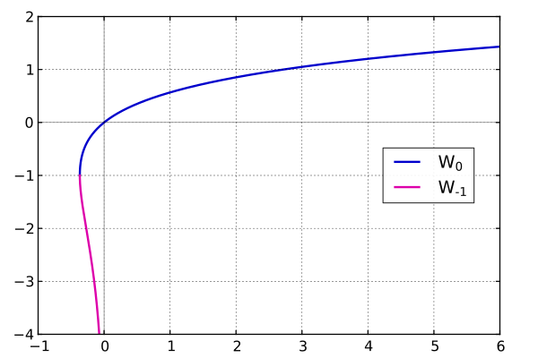

# 简单函数

## 函数的概念

### 定义

函数是一个定义域 $A$ 到值域 $B$ 的映射关系，函数的定义域和值域是一个集合，对于定义域内的每一个数，有且仅有值域内的一个数与之对应，记为 $f:A\to B$。

注意，定义域的是所有函数值的集合，是陪域的一个子集，严格来说函数是定义域到陪域的映射关系，只是陪域内的数，不一定是有效的函数值，只有值域内的数才是有效的函数值。

1. 函数的定义域就是能使解析式有意义的所有实数勿的集合，自然定义域是式子本身所要求的定义域。
2. 不要轻易对解析式进行化简变形，以免定义域发生变化。
3. 当一个函数由两个或两个以上代数式的和、差、积、商的形式构成时，定义域是使得各式子都有意义的公共部分、且（若有）分式有意义的集合。

复合函数：如果 $g$ 的值域为 $f$ 的定义域的子集，那么定义 $y=(f\circ g)(x)=f(g(x))$。

### 解析式

已知函数 $f$ 的一些关系式，求 $f(x)$，最常用的是换元法和变形法，例如：

$$
f(x+1)=x^2
$$

换元法，设 $t=x+1$，则：

$$
f(t)=(t-1)^2=t^2-2t+1
$$

如果给出多个 $f$ 的值，且自变量有对称性，那么对称联立，例如给出上式：

$$
\begin{cases}
3f(x)+2f(-x)&=x+3\\
3f(-x)+2f(x)&=-x+3
\end{cases}
$$

类似的还有 $x$ 与 $1/x$ 等。

由多个子函数分段定义的函数称为分段函数，如绝对值函数：

$$
|x|=\begin{cases}
x&x\ge0\\
-x&x<0
\end{cases}
$$

分段函数的定义域是各段函数定义域的并集，值域是各段函数值域的并集。

符号函数是一种常用的分段函数：

$$
\op{sgn}x=\begin{cases}
1&x>0\\
0&x=0\\
-1&x<0
\end{cases}
$$

### 反函数

对于二元关系 $(f:X\rightarrow Y)$ 和 $(g:Y\rightarrow X)$，若 $(\forall x\in X)\{g[f(x)]=x\}$ 且  $(\forall y\in Y)\{f[g(y)]=y\}$，则称 $g$ 为 $f$ 的反函数，记为 $f^{-1}$。

设 $f$ 表示一个函数，其定义域为 $X$、陪域为 $Y$，若存在一函数 $g$，其定义域为 $Y$、陪域为 $X$，且对于 $x\in X$ 有 $g(f(x))=x$、对于任意 $y\in Y$ 有 $f(g(y))=y$，则称 $g$ 为 $f$ 的反函数。

函数 $f$ 的反函数记为 $f^{-1}$，注意此处的 $-1$（次方的写法）并不是 $-1$ 次方，比如 $\sin$ 的反函数 $\arcsin$ 也记为 $\sin^{-1}$。

单调函数总是有反函数，并且反函数的单调性与原函数一致，原函数与反函数的图像关于函数 $y=x$ 的图像对称。

水平线测试：

- 在数学里，水平线测试为一测试方法，用来判断一函数是否为单射、满射或双射。

- 设一带有图像的函数为 $f:X\rightarrow Y$，接着使用 $X\times Y$ 上的水平线：

    $$
    y_0\in Y,\ \{\langle x,y_0\rangle\in f\mid x\in X\}
    $$

    若函数为单射，则其图像绝不会和任何一条水平线相交超过一次。

    若函数为满射，则每一水平线和图像至少相交一次。

    若函数为双射，则每一水平线和图像相交于一点且只有一点。

求反函数：记 $g$ 表示函数 $f$ 的反函数，那么从图像的角度考虑，若 $\langle x,y\rangle\in f$，那么 $\langle y,x\rangle\in g$，因此，我们对于 $y=f(x)=\dots x$，只需要将 $x,y$ 互换，得到的就是反函数的解析式。当然也不能写 $x=\dots y$ 的形式，要化为 $y=\dots x$ 的形式。

例题：求 $f(x)=2x+1$ 的反函数。答案：有 $y=f(x)=2x+1$；交换 $x,y$，即 $x=g(y)=2y+1$；整理，得 $y=g(y)=\dfrac{1}{2}x-\dfrac{1}{2}$。

### 朗博 W 函数

我们将朗博 $W$ 函数定义为 $f(x)=xe^x$ 的反函数。

也就是说，有关方程 $\displaystyle xe^x=a$ 可以给出通解

$$
\begin{cases}
W_0(a)&a\ge-\frac{1}{e}\\
W_{-1}(a)&a\in\left(-\dfrac{1}{e},0\right)
\end{cases}
$$

但是 $W(x)$ 没有初等意义的解析式，只有积分式。

- 将定义域限制在 $\displaystyle\left[-\frac{1}{e},+\infty\right)$ 上，取其在 $[-1,+\infty)$ 上的函数值，那么就定义了一个单调递增的函数 $W
_0(x)$；

- 将定义域限制在 $\displaystyle\left(-\frac{1}{e},0\right)$ 上，取其在 $(-\infty,-1)$ 上的函数值，那么就定义了一个单调递减的函数 $W_{-1}(x)$.

性质：当 $a\geq 0$ 时，${W(x)\cdot e^{W(x)}=x}$，此外可以推出

$$
\begin{aligned}
x\ln x=a&\implies x=e^{W(a)}\\
x+\ln x=a&\implies x=W(e^a)\\
\frac{\ln x}{x}=-a&\implies x=e^{-W(a)}
\end{aligned}
$$

以及朗博不等式，可以同构证明：${xe^x\geq x+\ln x+1}$

## 初等函数

- 正比例函数：$f(x+y)=f(x)+f(y)$。

- 幂型函数：$f(xy)=f(x)f(y)$。

- 对数型函数：$f(xy)=f(x)+f(y)$。

- 指数形函数：$f(x+y)=f(x)f(y)$。

### 幂函数

形如 $y=x^\alpha$（通常认为 $\alpha\neq0$），有性质：

- 函数恒过 $(1,1)$ 点。

- 如果 $\alpha>0$，那么函数恒过 $(0,0)$.

- 如果 $\alpha\in\Z^+$，那么函数有奇偶性，与 $\alpha$ 的奇偶性相同。

- 在 $(0,\infty)$ 上函数奇偶性与 $\alpha$ 关于 $1$ 的大小有关。

有幂的性质：

$$
a^{\frac{m}{n}}=\sqrt[n]{a^m}=\sqrt[n]{a}^m
$$

其中 $n,m$ 均为正数且不同奇偶。

$$
a^{-x}=\dfrac{1}{a^x}
$$

这一条经常用于简化除法的求导，转化为乘法可以更方便。

$$
\sqrt{a\pm\sqrt{b}}=\sqrt{a+\sqrt{a^2-b}\over2}\pm\sqrt{a-\sqrt{a^2-b}\over2}
$$

对于自然数 $a,b$，只有 $a^2-b$ 是完全平方数的时候，才能开出来。

证明：我们设 $\sqrt{a+\sqrt{b}}$ 化简完的结果是 $\sqrt x+\sqrt y$：

$$
\begin{aligned}
\sqrt{a+\sqrt{b}}&=\sqrt x+\sqrt y\\
a+\sqrt{b}&=x+y+2\sqrt{xy}
\end{aligned}
$$

因为 $a$ 外面没有根号，与 $x+y$ 相对应：

$$
\left\{\begin{aligned}
a&=x+y\\
\sqrt{b}&=2\sqrt{xy}
\end{aligned}\right.
$$

然后我们把下面的式子平方，可以写出方程组：

$$
\left\{\begin{aligned}
x+y&=a\\
xy&={b\over4}
\end{aligned}\right.
$$

然后用公式：

$$
\left\{\begin{aligned}
x+y&=a\\
x-y&=\sqrt{(x+y)^2-4xy}\\
&=\sqrt{a^2-b}
\end{aligned}\right.
$$

或者设 $t$ 满足：

$$
\begin{aligned}
(t-x)(t-y)&=0\\
t^2-(x+y)t+xy&=0
\end{aligned}
$$

解这个方程，得到的 $t$ 的两个根分别就是 $x$ 和 $y$。

具体的：

$$
\begin{aligned}
t^2-at+{b\over4}=0\\
t={a\pm\sqrt{a^2-b}\over2}
\end{aligned}
$$

解得：

$$
\left\{\begin{aligned}
x&={a+\sqrt{a^2-b}\over2}\\
y&={a-\sqrt{a^2-b}\over2}
\end{aligned}\right.
$$

因此：

$$
\begin{aligned}
&\sqrt{a+\sqrt{b}}=\sqrt x+\sqrt y\\
=\;&\sqrt{a+\sqrt{a^2-b}\over2}+\sqrt{a-\sqrt{a^2-b}\over2}
\end{aligned}
$$

减法同理。

### 指数函数

形如 $y=f(x)=a^x$（$a>0$ 且 $a\neq1$），有性质：

- 恒过 $(0,1)$ 点。

- 满足 $f(x)\cdot f(-x)=1$。

指数函数非积非偶，换元常常先统一底数，例如：

$$
4^x+2^{x+1}+3=(2^x)^2+2\cdot2^x+3
$$

指数函数中，有一种函数特别重要：

$$
f(x)=e^x
$$

其中，$e$ 是一个无理数，近似值为 $2.71828\dots$。

### 对数函数

若 $a^x=n$（$a>0$ 且 $a\neq1$），则记 $x=\log_an$，其中 $a$ 为底数，$n$ 为真数。

$$
\begin{aligned}
a^{\log_ax}&=x\\
\log_aa^x&=x
\end{aligned}
$$

因此：

$$
\begin{aligned}
\log_a1&=0\\
\log_aa&=1\\
\end{aligned}
$$

对数也有一些特殊记号，例如：

$$
\begin{aligned}
\log_ex&=\ln x\\
\log_2x&=\operatorname{lb}x\\
\log_{10}x&=\lg x
\end{aligned}
$$

对数的运算法则与指数相对，如下：

$$
\begin{aligned}
\log_axy&=\log_ax+\log_ay&&\qquad&a^xa^y&=a^{x+y}\\
\log_a\frac{x}{y}&=\log_ax-\log_ay&&\qquad&\frac{a^x}{a^y}&=a^{x-y}\\
\log_ax^y&=y\log_ax&&\qquad&(a^x)^y&=a^{xy}\\
\log_a\sqrt[y]x&=\frac{\log_ax}y&&\qquad&\sqrt[y]x&=x^\frac{1}{y}
\end{aligned}
$$

另外，还有换底公式，非常常用

$$
\begin{aligned}
\log_ax&=\frac{\log_bx}{\log_ba}\\
\log_ax&=\frac{1}{\log_xa}\\
\log_{a^n}b&=\frac{\log_ab}{n}
\end{aligned}
$$

另外，还有：

$$
\begin{aligned}
x^{\log_ay}&=y^{\log_ax}\\
\log_ab\log_bx&=\log_ax\\
\log_a\dfrac{1}{x}&=-\log_ax
\end{aligned}
$$

也就是说：

$$
\begin{aligned}
\log_am\log_bn&=\log_bm\log_an\\
\dfrac nm\log_ab&=\log_{a^m}b^n=\log_ab^{\frac nm}
\end{aligned}
$$
