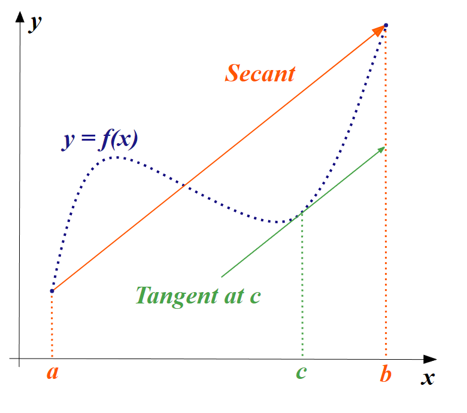
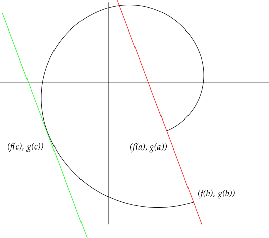

# 导数入门

## 定义和计算

### 导数概念

如果函数 $f(x)$ 在 $x_{0}$ 的一个**邻域** $(x_{0} - \delta, x_{0} + \delta)$ 有定义，且极限

$$
\boxed{\lim\limits_{\Delta x \to 0} \dfrac{f(x_{0} + \Delta x) - f(x_{0})}{\Delta x}}
$$

存在，那么称这个极限为 $f$ 在 $x_{0}$ 的**导数**，记作 $f'(x_{0})$ 或 $\dfrac{\d f}{\d x}(x_{0})$。此时称 $f$ 在 $x_{0}$ **可导**。

如果函数 $f(x)$ 在 $x_{0}$ 的一个**左邻域** $(x_{0} - \delta, x_{0}]$ 有定义，且极限

$$
\lim\limits_{\Delta x \to 0^{-}} \dfrac{f(x_{0} + \Delta x) - f(x_{0})}{\Delta x}
$$

存在，那么称这个极限为 $f$ 在 $x_{0}$ 的**左导数**，记作 $f'_{-}(x_{0})$。

如果函数 $f(x)$ 在 $x_{0}$ 的一个**右邻域** $[x_{0}, x_{0} + \delta)$ 有定义，且极限

$$
\lim\limits_{\Delta x \to 0^{+}} \dfrac{f(x_{0} + \Delta x) - f(x_{0})}{\Delta x}
$$

存在，那么称这个极限为 $f$ 在 $x_{0}$ 的**右导数**，记作 $f'_{+}(x_{0})$。

函数在 $x_{0}$ 可导的充要条件是它在 $x_{0}$ 的左导数和右导数存在且相等，即 $f$ 在点 $x_{0}$ 连续。
如果函数 $f$ 在区间 $I$ 内的每一点都可导，且在端点单侧可导，那么称 $f$ 在区间 $I$ 上可导。此时 $x \mapsto f'(x), x \in I$ 确定了一个函数，称为 $f$ 的**导函数**，简称**导数**，记作 $f'(x)$ 或 $\dfrac{\d f}{\d x}(x)$。后一种符号由德国数学家莱布尼茨发明。

### 切线问题

{ width="60%" }

观察曲线 $y = f(x)$ 的图像。连接曲线上的两点 $(x_{0}, f(x_{0}))$ 和 $(x_{0} + \Delta x, f(x_{0} + \Delta x))$，可以得到曲线的一条**割线**，其斜率

$$
k = \dfrac{f(x_{0} + \Delta x) - f(x_{0})}{\Delta x}
$$

由于函数 $f(x)$ 在 $x_{0}$ 连续，当 $\Delta x$ 趋于 $0$ 时，割线趋于某条特定的直线，这条直线称为曲线在点 $(x_{0}, f(x_{0}))$ 的**切线**，其斜率

$$
k = \lim\limits_{\Delta x \to 0} \dfrac{f(x_{0} + \Delta x) - f(x_{0})}{\Delta x}
$$

这就是导数的几何意义。通过点斜式可以写出切线的方程：$y - f(x_{0}) = f'(x_{0}) (x - x_{0})$。

注意，在求切线的题里，给定的点 $(a,b)$ 不一定在曲线上，如果不在曲线上，那么设出切点 $(x,f(x))$，写出：

$$
f'(x)\cdot\dfrac{f(x)-b}{x-a}=-1
$$

若是两条曲线的公切线问题，则切线方程需要算两次，然后根据直线方程列出对应参数相等，例如：求曲线 $f(x)=\ln x+2$ 与曲线 $g(x)=\ln(x+1)$ 的公切线。

- 设公切线切 $f$ 于点 $(x_1,\ln x_1+2)$，则：

    $$
    y=\dfrac{1}{x_1}x+\ln x_1+1
    $$

- 设公切线切 $g$ 于点 $(x_2,\ln(x_2+1))$，则：

    $$
    y=\dfrac{1}{x_2+1}x+\dfrac{1}{x_2+1}+\ln(x_2+1)-1
    $$

因为这是一条直线，所以列出总方程：

$$
\begin{cases}
\dfrac{1}{x_1}=\dfrac{1}{x_2+1}\\
\ln x_1+1=\dfrac{1}{x_2+1}+\ln(x_2+1)-1
\end{cases}
$$

解得 $x_1=\dfrac{1}{2}$，带入可知 $y=2x+1-\ln2$。

一般地，求曲线的切线方程都是通过求导的方式。但是若曲线为二次函数，一般利用的是判别式方法，即联立两方程，若相切则方程只有一个解，用 $\Delta=0$ 计算即可。

## 导数的计算

### 极限法

极限法求导数，是最简单的方法，高中数学中需要求导的函数基本上都是连续的，我们无需考虑不连续的情况，因此我们设出一个 $\Delta x$ 表示增量，用微分的思想，例如 $f(x)=ax^2$：

$$
\begin{aligned}
 \dfrac{\d f}{\d x}(x)
&= \lim_{\Delta x\to 0} \dfrac{f(x+\Delta x)-f(x)}{\Delta x} \\
&= \lim_{\Delta x\to 0} \dfrac{a(x+\Delta x)^2-ax^2}{\Delta x} \\
&= \lim_{\Delta x\to 0} \dfrac{2a\Delta x+a(\Delta x)^2}{\Delta x} \\
&= \lim_{\Delta x\to 0} (2a+a\Delta x)
\end{aligned}
$$

我们知道，$\Delta x$ 是趋近于 $0$，但是 $0/0$ 没有意义，所以我们继续化简，化简到最后，我们的 $a\Delta x$ 也是趋近于 $0$ 的，因此就可以忽略了，即导函数：

$$
f'(x)=2a
$$

通过一些多项式定理、三角恒等变换等，我们可以轻松得出下面的几个常用导数：

| 函数 | 导函数 | 函数 | 导函数 |
| :- | :- | :- | :- |
| $y=c$ | $y'=0$ | $y=x^n$ | $y'=nx^{n-1}$ |
| $y=a^x$ | $y'=a^x\ln a$ | $y=e^x$ | $y'=e^x$ |
| $y=\log_ax$ | $y'=\dfrac{1}{x\ln a}$ | $y=\ln x$ | $y'=\dfrac{1}{x}$ |
| $y=\sin x$ | $y'=\cos x$ | $y=\cos x$ | $y'=-\sin x$ |
| $y=\tan x$ | $y'=\dfrac{1}{\cos^2x}$ | $y=\cot x$ | $y'=-\dfrac{1}{\sin^2x}$ |

### 四则运算

导数的加减法则：

$$
\boxed{[f(x)\pm g(x)]'=f'(x)\pm g'(x)}
$$

证明：

$$
\begin{aligned}
   [f(x)\pm g(x)]'
&= \lim_{\Delta x\to 0} \dfrac{[f(x+\Delta x)\pm g(x+\Delta x)]-[f(x)\pm g(x)]}{\Delta x}\\
&= \lim_{\Delta x\to 0} \dfrac{[f(x+\Delta x)-f(x)]\pm [g(x+\Delta x)-g(x)]}{\Delta x}\\
&= \lim_{\Delta x\to 0} \dfrac{[f(x+\Delta x)-f(x)]}{\Delta x} \pm  \dfrac{[g(x+\Delta x)-g(x)]}{\Delta x} \\
&= \lim_{\Delta x\to 0} f'(x)\pm g'(x)
\end{aligned}
$$

导数的乘法法则：

$$
\boxed{[f(x)g(x)]'=f'(x)g(x)+f(x)g'(x)}
$$

同时，如果 $g(x)=c$ 也就是说：

$$
\boxed{[cf(x)]'=cf'(x)}
$$

导数的除法法则：

$$
\boxed{\left[\dfrac{f(x)}{g(x)}\right]'=\dfrac{f'(x)g(x)-f(x)g'(x)}{g^2(x)}}
$$

可以由：

$$
\boxed{\left[\dfrac{1}{g(x)}\right]'=-\dfrac{g'(x)}{g^2(x)}}
$$

推导得到，而上式可以通过复合函数，结合 $[x^{-1}]'=-x^{-2}$ 推导得到。

同时根据我们熟知的 $[e^x]'=e^x$，利用导数的除法法则可以用于推导对数函数，另外还有正切函数的导数。

### 链式法则

容易知道：

$$
\boxed{\dfrac{\d y}{\d x}=\dfrac{\d y}{\d z}\cdot\dfrac{\d z}{\d x}}
$$

此时，我们令 $y=f[g(x)]$，$z=g(x)$，那么：

$$
\dfrac{\d f(g(x))}{\d x}=\dfrac{\d f(g(x))}{\d g(x)}\cdot\dfrac{\d g(x)}{\d x}
$$

也就是说：

$$
\boxed{(f\circ g)'(x)=f'(g(x))\cdot g'(x)}
$$

这就是复合函数的导数，根据这个可以推导反函数求导：

$$
\dfrac{\d y}{\d x}\cdot\dfrac{\d x}{\d y}=1
$$

也就是说函数的导数与其反函数的导数互为倒数：

$$
\boxed{f'(x)\cdot(f^{-1})'(y)=1}
$$

例如：

$$
\begin{aligned}
[\arcsin x]'&=\dfrac{1}{(\sin y)'}=\dfrac{1}{\cos y}=\dfrac{1}{\sqrt{1-x^2}}\\
[\arccos x]'&=\dfrac{1}{(\cos y)'}=-\dfrac{1}{\sin y}=-\dfrac{1}{\sqrt{1-x^2}}\\
[\arctan x]'&=\dfrac{1}{(\tan y)'}=\cos^2y=\dfrac{1}{x^2+1}\\
\end{aligned}
$$

另外还有一种**对数求导法**：

$$
\boxed{[\ln h(x)]'=\frac{h'(x)}{h(x)}}
$$

那么，也就是说：

$$
\boxed{h'(x)=h(x)[\ln h(x)]'}
$$

这对于 $h(x)$ 为幂函数、指数函数的求导非常有帮助，具体的：

$$
[a^x]'=a^x[\ln a^x]'=a^x[x\ln a]'=a^x\ln a
$$

$$
[x^n]'=x^n[\ln x^n]'=x^n[n\ln x]'=x^n\dfrac{n}{x}=nx^{n-1}
$$

### 高阶导数

设函数 $f(x)$ 在区间 $I$ 上有导数 $f'(x)$：

- 若 $f'$ 在 $I$ 上可导。其为二阶导数，记作 $f''(x)$ 或 $f^{(2)}(x)$ 或

    $$
    \dfrac{\mathrm{d}^{2} f}{\mathrm{d} x^{2}}(x)
    $$

- 如果二阶导数仍然可导，那么就有三阶导数 $f'''(x)$ 或 $f^{(3)}(x)$ 或

    $$
    \dfrac{\mathrm{d}^{3} f}{\mathrm{d} x^{3}}(x)
    $$

- ……

- 如果 $f$ 的 $n - 1$ 阶导数可导，那么称其导数为 $f$ 的 $n$ 阶导数

    $$
    \dfrac{\mathrm{d}^{n} f}{\mathrm{d} x^{n}}(x)
    $$

    记作 $f^{(n)}(x)$。无限阶可导的函数称为光滑函数。

根据定义，不难得到两个函数和、差的高阶导数：

$$
\boxed{[f(x) \pm g(x)]^{(n)} = f^{(n)}(x) \pm g^{(n)}(x)}
$$

对于两个函数乘积的高阶导数，则有莱布尼茨公式：

$$
\boxed{[f(x) g(x)]^{(n)} = \sum\limits_{k=0}^{n} \mathrm{C}_{n}^{k} f^{(k)}(x) g^{(n - k)}(x)}
$$

证明由数学归纳法即可。

### 隐函数偏导

对于多元函数 $z=F(x,y)$ 或更一般的 $F(x,y,\dots)$，我们研究其对某一个变量的变化率时，我们假装其他所有变量都是常数，然后像求普通导数一样，只对我们关心的那个变量求导，这就是偏导，为了与普通的导数 $\d$ 区分，我们用一个新的符号 $\partial$，例如记函数 $F$ 对 $x$ 的偏导为 $F_x$，其计算方法为：

$$
\boxed{\begin{aligned}
F_x=\dfrac{\partial F}{\partial x}(x,y)&=\lim_{\Delta x\to 0}\dfrac{F(x+\Delta x,y)-F(x,y)}{\Delta x}\\
F_y=\dfrac{\partial F}{\partial y}(x,y)&=\lim_{\Delta y\to 0}\dfrac{F(x,y+\Delta y)-F(x,y)}{\Delta y}
\end{aligned}}
$$

在计算偏导的时候，求对某个变量的偏导数时，就把其他所有变量都看作是常数，然后按照普通求导的方法计算即可，例如以 $F(x,y)=x^2+3xy+y^3$ 为例：

$$
\begin{cases}
F_x&=2x+3y\\
F_y&=3y^2+3x\\
\end{cases}
$$

可以写成 $y=f(x)$ 的称为显函数，而有些是由方程 $F(x,y)=0$ 确定的，这种函数称为隐函数。隐函数求导的核心是，将 $y$ 看成 $f(x)$，然后对等式两边关于 $x$ 求导，此时应当使用链式法则。

例如对于一个关于 $y$ 的式子 $g(y)$，其导数应当为 $g'(y)\cdot y'$，也就是说，我们对这个式子直接关于 $y$ 求导之后，还要再乘上 $y'$，最后式子化为仅和 $x,y,y'$ 有关的式子，用 $x,y$ 表示 $y'$ 即可。

例如，我们对 $x^2+4y^2-16=0$ 求导，两边对 $x$ 求导：

$$
2x+8y\cdot y'=0
$$

也就是说：

$$
y'=-\dfrac{x}{4y}
$$

此时，带入满足曲线方程上的点 $(x,y)$，得到的即为该处的切线斜率。

另外，还可以通过求偏导的方式解决，我们容易求出：

$$
\begin{cases}
F_x&=2x\\
F_y&=8y
\end{cases}
$$

那么，根据下面的式子：

$$
\boxed{\dfrac{\d y}{\d x}=-\dfrac{F_x}{F_y}}
$$

也可以得出上面的导数，可以用于求曲线的切线方程。

### 洛必达法则

我们已经知道：

- 当 $x$ 趋于 0 时，$\ln x$ 趋于 $-\infty$；当 $x$ 趋于 $+\infty$ 时，$\ln x$ 趋于 $+\infty$；

- 当 $x$ 趋于 $-\infty$ 时，$e^x$ 趋于 0；当 $x$ 趋于 $+\infty$ 时，$e^x$ 趋于 $+\infty$；

- 当 $x > 0$ 且 $x$ 趋于 0 时，$\dfrac{1}{x}$ 趋于 $+\infty$；当 $x < 0$ 且 $x$ 趋于 0 时，$\dfrac{1}{x}$ 趋于 $-\infty$。

而洛必达法则定义了更加复杂的分式型极限，若当 $x\to a$，有 $f(x),g(x)$ 同时趋近于 $0$ 或无穷，那么：

$$
\lim_{x\to a}\dfrac{f(x)}{g(x)}=\lim_{x\to a}\dfrac{f'(x)}{g'(x)}
$$

例如当 $x \to +\infty$ 时，分式函数

$$
f(x) = \frac{e^x}{x^2}
$$

的分子 $e^x \to +\infty$ 且分母 $x^2 \to +\infty$，则无法直接判断 $f(x)$ 的取值趋势，利用洛必达法则可得

$$
\lim_{x\to +\infty} \frac{e^x}{x^2} = \lim_{x\to +\infty} \frac{e^x}{2x}
$$

分子 $e^x$ 和分母 $2x$ 依然趋于正无穷，故再次利用洛必达法则可得

$$
\lim_{x\to +\infty} \frac{e^x}{2x} = \lim_{x\to +\infty} \frac{e^x}{2} = +\infty
$$

注意：如果不是 $\dfrac{0}{0}$ 型或者 $\dfrac{\infty}{\infty}$ 型，则需要先变形使之成为 $\dfrac{0}{0}$ 型或者 $\dfrac{\infty}{\infty}$ 型。比如 $0 \cdot \infty$ 型可以转化为 $\dfrac{0}{\frac{1}{\infty}}$ 型或 $\dfrac{+\infty}{\frac{1}{0}}$ 型。举个例子：当 $x \to 0$ 时，$x \ln x$ 中 $x \to 0$，$\ln x \to -\infty$，可将其变形为 $x \ln x = \dfrac{\ln x}{\frac{1}{x}}$，之后再用洛必达法则。

一定要注意洛必达法则的前提：分子和分母都趋于 $0$ 或 $\infty$，否则洛必达失效！比如我们都知道

$$
\lim_{x\to +\infty} \frac{\sin x}{x} = 0
$$

但如果你用洛必达法则就会得到错误的结论：

$$
\lim_{x\to +\infty} \frac{\sin x}{x} = \lim_{x\to +\infty} \frac{\cos x}{1} = \text{不存在}
$$

## 微分中值定理

### 罗尔中值定理

如果函数 $f(x)$ 在 $[a,b]$ 上连续，在开区间 $(a,b)$ 可导，若 $f(a)=f(b)$，则存在 $\xi\in(a,b)$，使得

$$
f'(\xi)=0
$$

证明：函数 $f(x)$ 在闭区间 $[a,b]$ 一定可以取到最值，如果在开区间 $(a,b)$ 上一点 $\xi$ 取到，那么 $\xi$ 就是极值点，根据费马引理，$f'(\xi)=0$。如果最值只能在区间端点取到，因为 $f(a)=f(b)$，所以 $f(x)$ 的最大值和最小值相等，$f(x)$ 为常函数，其导数永远为零。

{ width="60%" }

罗尔中值定理的几何意义是：如果函数两个端点的函数值相等，那么函数图像上至少有一点的切线平行于 $x$ 轴。

### 达布中值定理

达布中值定理，也成为导数的介值定理，介值定理表明，对于定义在闭区间上的连续函数，任取端点值之间的任意值，在区间内一定存在某个点使得函数在此处取该值；等价地，闭区间上的连续函数可以取到最大值和最小值之间的任意值。

如果函数 $f(x)$ 在 $[a,b]$ 上连续，在开区间 $(a,b)$ 可导，假设 $f'(a)<f'(b)$，则对于任意 $\eta\in(f'(a),f'(b))$，都存在 $\xi\in(a,b)$ 使得

$$
f'(\xi)=\eta
$$

- 在闭区间 $[a,b]$ 上连续

    **直观含义**：函数的图形从 $x=a$ 到 $x=b$ 是一条**完整的、没有断裂的曲线**。你可以用笔从头到尾把它画出来，而不需要抬起笔。
    
    **技术含义**：
    
    1.  函数在开区间 $(a,b)$ 内的每一点都连续。
    2.  函数在两个**端点** $a$ 和 $b$ 也是连续的。
    
    这保证了函数在区间的边界处行为是“可预测的”，没有发生跳跃或丢失。

- 在开区间 $(a,b)$ 上可导

    **直观含义**：函数的图形在 $a$ 和 $b$ 之间是**光滑的，没有尖角或垂直的切线**。在每一点，你都可以画出一条唯一的、非垂直的切线。
    
    **技术含义**：对于 $(a,b)$ 内的每一点 $x$，导数 $f(x)$ 都存在且是一个有限值。这代表了函数在每一点的瞬时变化率都是明确的。

- 经典例子：

    考虑函数 $f(x) = \sqrt{1-x^2}$，它的图像是单位圆的上半部分，定义域为 $[-1,1]$。

    它在闭区间 $[-1,1]$ 上是**连续的**，它在开区间 $(-1, 1)$ 上是**可导的**。
    
    但是在端点 $x=-1$ 和 $x=1$ 处，切线是垂直的，导数是无穷大，所以它在端点**不可导**。

    这个函数满足“闭区间连续，开区间可导”的条件，因此所有基于这个条件的定理都对它适用。如果我们要求在闭区间 $[a,b]$ 上可导，那么像 $f(x) = \sqrt{1-x^2}$ 这样的函数就会被排除在外，定理的普适性就降低了。

    我们只需要函数在**内部**是光滑的，就可以研究它的变化趋势。我们允许它在**端点**处变得“不光滑”（例如出现垂直切线）。

当你看到“函数在闭区间 $[a,b]$ 上连续，在开区间 $(a,b)$ 上可导”这个条件时，你的脑海里应该立刻响起警铃：“中值定理要来了！”

### 拉格朗日中值定理

拉格朗日中值定理是罗尔中值定理的推广：如果函数 $f(x)$ 在 $[a,b]$ 上连续，在开区间 $(a,b)$ 可导，则存在 $\xi\in(a,b)$，使得：

$$
f'(\xi)=\dfrac{f(b)-f(a)}{b-a}
$$

证明：令直线方程 $g(x)$ 过 $(a,f(a)),(b,f(b))$ 两点，则函数

$$
g(x)=\dfrac{f(b)-f(a)}{b-a}(x-a)+f(a)
$$

那么，令 $F(x)=f(x)-g(x)$，对 $F(x)$ 使用罗尔中值定理，即可得到。

{ width="60%" }

拉格朗日中值定理的几何意义是：函数图像上至少有一点的切线平行于函数两个端点的连线。

利用拉格朗日中值定理容易得到两个推论：

- 如果函数 $f(x)$ 在区间 $I$ 上可导，且对于任意 $x\in I$ 都有 $f'(x)=0$，则 $f(x)$ 在区间 $I$ 上为常数。

- 如果函数 $f,g$ 在区间 $I$ 上可导，且对于任意 $x\in I$ 都有 $f'(x)=g'(x)$，则 $f,g$ 在区间 $I$ 上相差一个常数。

### 柯西中值定理

柯西中值定理是拉格朗日中值定理的推广：如果函数 $f,g$ 在闭区间 $[a,b]$ 上连续，在开区间 $(a,b)$ 上可导，且对任意 $x\in(a,b)$ 都有 $g'(x)\neq0$，则存在 $\xi\in(a,b)$，使得

$$
\dfrac{f'(\xi)}{g'(\xi)}=\dfrac{f(b)-f(a)}{g(b)-g(a)}
$$

拉格朗日中值定理是 $g(x)=x$ 时的特殊情况，证明也类似的设：

$$
g(x)=\dfrac{f(b)-f(a)}{g(b)-g(a)}[g(x)-g(a)]+f(a)
$$

应用罗尔中值定理即可得到。

{ width="60%" }

柯西中值定理的几何意义是：用参数方程

$$
\begin{cases}
x&=g(t)\\y&=f(t)
\end{cases}
$$

表示的曲线上至少有一点的切线平行于曲线两个端点的连线。
