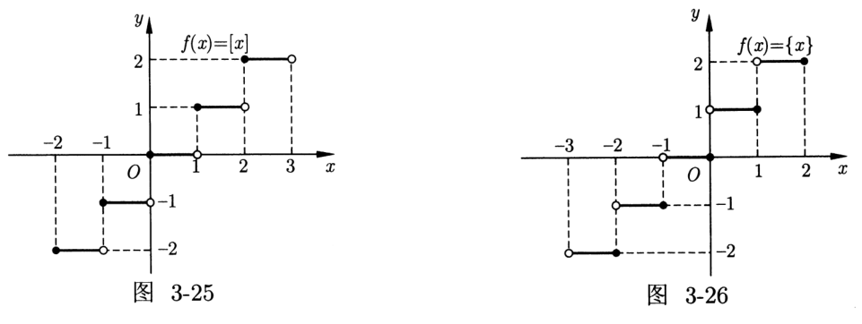

# 函数性质

## 基本性质

### 单调性

高中认为单调性即为严格单调性，定义法证明流程如下：

- 设 $x_1<x_2\in D$ 其中 $D$ 为定义域。

- 证明 $f(x_1)-f(x_2)$ 的正负性，通常将式子化为关于 $(x_1-x_2)$ 的式子。

- 声称 $f(x_1)$ 大于或小于 $f(x_2)$，得到单调性。

容易知道，在区间 $[a,b]$ 上：

- 如果 $f'(x)>0$，那么函数单调递增。

- 如果 $f'(x)<0$，那么函数单调递减。

- 如果 $f'(x)=0$，那么函数为常函数。

复合函数的单调性：满足同增异减，即单调性相同则为单增函数，单调性不同则为单减函数。

### 凹凸性

容易知道，凹凸性可以由二阶导数反应，由于高中课本没有涉及，而且凹凸性的定义也有不同说法，我们只需要知道，二阶导数可以反应凹凸性即可。

另外，如果函数 $f$ 在点 $x_0$ 凹凸性改变，那么 $x_0$ 是 $f$ 的一个拐点。注意，如同驻点不一定是极值点，$f''(x_0)=0$ 不代表 $x_0$ 一定是拐点。

### 奇偶性

定义奇偶性于定义域关于 $0$ 对称的函数上，奇函数为：

$$
f(x)+f(-x)=0
$$

因此，我们知道，如果定义域中有 $0$，那么只有 $f(0)=0$ 的函数才可能为奇函数。

偶函数为：

$$
f(x)=f(-x)
$$

特殊的，奇函数的绝对值为偶函数。

奇偶性的乘除法则：

- 奇函数 $\pm$ 奇函数 $=$ 奇函数。
- 偶函数 $\pm$ 偶函数 $=$ 偶函数。
- 奇函数 $\pm$ 偶函数 $=$ 非奇非偶。
- 奇函数 $\times$ 奇函数 $=$ 偶函数。
- 奇函数 $\times$ 偶函数 $=$ 奇函数。
- 偶函数 $\times$ 偶函数 $=$ 偶函数。

复合函数的奇偶性：

- 奇函数 $\circ$ 奇函数 $=$ 奇函数。

- 偶函数 $\circ$ 奇函数 $=$ 奇函数。

- 奇函数 $\circ$ 偶函数 $=$ 奇函数。

- 偶函数 $\circ$ 偶函数 $=$ 奇函数。

经典做题套路：

- 若 $f(x)$ 为偶函数，首先判断是否能转化为奇函数来处理。

- 奇函数 $f(x)$ 在定义域内有最大值 $M$，则 $f(x)$ 有最小值 $N$，且 $M+N=0$。

- 若偶函数 $f(x)$ 在 $[0, +\infty)$ 上单调，则 $f(x_1) = f(x_2)$ 等价于 $|x_1| = |x_2|$；

- 若偶函数 $f(x)$ 在 $[0, +\infty)$ 上单调递增，则 $f(x_1) > f(x_2)$ 等价于 $|x_1| > |x_2|$；

- 若偶函数 $f(x)$ 在 $[0, +\infty)$ 上单调递减，则 $f(x_1) > f(x_2)$ 等价于 $|x_1| < |x_2|$。

经典的函数模型：

- 函数 $f(x)=\dfrac{1\pm a^x}{1\mp a^x}$，$g(x)=\log_a\dfrac{1\pm a}{1\mp a}$ 是单调的奇函数。

- 函数 $f(x)=\log_a(\sqrt{x^2+1}\pm x)$ 是单调的奇函数。

- 函数 $f(x)=a^x+a^{-x}$ 是偶函数，函数 $g(x)=a^x-a^{-x}$ 是单调的奇函数。

奇偶性与导数：对于可导函数 $f(x)$，如果 $f(x)$ 是奇函数，则 $f'(x)$ 是偶函数；如果 $f(x)$ 是偶函数，则 $f'(x)$ 是奇函数。

### 对称性

函数关于 $x=x_0$ 对称，则：

$$
f(x_0-a)=f(x_0+a),\quad\forall a\in\R^+
$$

或者 $y=f(x+x_0)$ 为偶函数。

函数关于 $(x_0,y_0)$ 中心对称，则：

$$
f(x_0-a)+f(x_0+a)=2y_0,\quad\forall a\in\R^+
$$

或者 $y=f(x+a)-b$ 为奇函数。

因此，我们得到，若：

$$
f(x+\mu)=f(\lambda-x)
$$

则函数关于 $x=\dfrac{\lambda+\mu}{2}$ 对称；若：

$$
f(x+\mu)+f(\lambda-x)=k
$$

则函数关于 $\left(\dfrac{\lambda+\mu}{2},\dfrac{k}{2}\right)$ 对称。

### 周期性

对于任意 $x\in\R$，存在非零实数 $T$ 满足 $f(x+T)=f(x)$，则 $f(x)$ 为周期函数，且一个周期为 $T$。在周期函数 所有周期中最小的一个正数，称为最小正周期。

在已知周期的前提下的求值及表达式问题都是需要把所求变量利用周期平移至所给区间，利用所给区间的表达式来求值或者求表达式。

常见的周期函数：

- 对任意的 $x\in\R$，若 $f(x+a)+f(x)=c$，则 $T=2|a|$。

- 对任意的 $x\in\R$，若 $f(x+a)\cdot f(x)=c$，则 $T=2|a|$。

- 对任意的 $x\in\R$，若 $f(x+a)=f(x-a)$，则 $T=2|a|$。

- 对任意的 $x\in\R$，若 $f(x+a)=-f(x-a)$，则 $T=4|a|$。

- 若 $x$ 满足 $f(x)=f(x+a)-f(x+2a)$，则 $T=6|a|$。

对称性与周期性：

- 如果 $f(x)$ 关于 $x=a$ 和 $x=b$ 对称，则 $T=2|a-b|$。

- 如果 $f(x)$ 关于 $(a,0)$ 和 $(b,0)$ 对称，则 $T=2|a-b|$。

- 如果 $f(x)$ 关于 $(a,0)$ 和 $x=b$ 对称，则 $T=4|a-b|$。

## 基本问题

### 二次函数

对于一元二次方程 $ax^2+bx+c(a\neq0)$，当根的判别式 $\Delta=b^2-4ac$ 时，记 $x_1,x_2$ 为方程的两个实根，则有韦达定理

$$
x_1+x_2=-\dfrac{b}{a}
$$

$$
x_1x_2=\dfrac{c}{a}
$$

一元二次方程的根往往会有各种限制，比如两根都为正、两根都为负等。这类问题需要综合考虑开口方向、对称轴、根的判别式以及韦达定理才能准确求解，例如有两个不同的正根

$$
\iff\begin{cases}\Delta>0\\x_1+x_2>0\\x_1x_2>0\end{cases}
$$

同时，一定情况下也可以用参变分离解决，例如 $ax^2+2x+1$ 至少有一个正根，则：

$$
a=-\dfrac{2x+1}{x^2}=-\left(\dfrac{2}{x}+\dfrac{1}{x^2}\right)
$$

问题即为求该式在 $x>0$ 时的值域，设 $t=1/x>0$，则：

$$
a=-(t^2+2t)<0
$$

即 $a$ 的取值范围是 $(-\infty,0)$。

如果要求 $f(x)=ax^2+bx+c(a\neq0)$ 有两个大于 $r$ 的实根，容易想到，构造函数 $g(x)=f(x+r)=$，对 $g(x)$ 应用两个实根大于 $0$，但是这样比较复杂，我们进行一次模拟：

$$
\begin{cases}
\Delta>0\\
(x_1-r)+(x_2-r)>0\\
(x_1-r)(x_2-r)>0
\end{cases}
$$

注意到第二个相当于：

$$
x_1+x_2=-\dfrac{b}{a}>2r
$$

而第三个则为：

$$
\begin{aligned}
x_1x_2-r(x_1+x_2)+r^2&>0\\
\dfrac{c}{a}+\dfrac{br}{a}+r^2&>0
\end{aligned}
$$

也就是：

$$
af(r)>0
$$

因此，我们把条件转化为：

$$
\begin{cases}
\Delta>0\\
x_1+x_2>2r\\
af(r)>0
\end{cases}
$$

另外，如果有两个不同的实根，在区间 $(p,q)$ 内，那么：

$$
\iff\begin{cases}
\Delta>0\\
2p<-\dfrac{b}{a}<2q\\
af(p)>0\\
af(q)>0
\end{cases}
$$

二次方程 $f(x) = ax^2 + bx + c = 0(a \neq 0)$ 在区间 $(p,q)$，$(m,n)$ 内各有一个实数根，若 $a$ 的正负不确定，则其等价条件为

$$
\begin{cases}
f(p)f(q) < 0 \\
f(m)f(n) < 0
\end{cases}
$$

若已知 $a$ 的正负，则只需具体考虑端点处函数值的正负。

### 三次函数

三次函数的根本思想有两个，因式分解，求导。

我们知道，即使是对于更高次的函数，求导也是一般方法，只是三次函数求导后变为二次函数更好解决。

三次函数 $f(x)=ax^3+bx^2+cx+d(a\neq0)$ 是中心对称图像，且其对称中心为 $\left(-\dfrac{b}{3a},f(\dots)\right)$。

### 极值问题

由费马引理，我们知道，若 $x_0$ 为 $f(x)$ 的极值点，那么一定有 $f'(x)=0$。

但是，$f'(x)=0$ 仅仅是前命题的必要不充分条件，充分性不完全正确，例如对于 $f(x)=x^3$，有 $f'(0)=0$ 但是 $x=0$ 仅仅是一个拐点。

其充分性有几种不同的说法：

- 第一充分条件：严谨的数学语言略，我们感性的理解，如果函数的导数在 $x_0$ 处为零，且其左右一个大于零、一个小于零，那么 $x_0$ 为 $f(x)$ 的极值点。

- 第二充分条件：通过二阶导数，我们可以知道 $f'(x)=0$ 且 $f''(x)\neq0$，那么 $x_0$ 为 $f(x)$ 的极值点。

- 凹凸性条件：设函数 $f$ 由 $f'(x_0)=0$ 且在 $x_0$ 二阶可导，

    - 若 $f''(x_0)>0$，则 $x_0$ 为 $f$ 的一个极小值点；
    - 若 $f''(x_0)<0$，则 $x_0$ 为 $f$ 的一个极大值点。

但是注意，加上第一充分条件后，就是充分必要的；但是加上第二充分条件或者凹凸性条件，就不是必要的了，例如 $f(x)=x^4$ 在 $0$ 处二阶导为零，但是是一个极值点，具体的：

- 如果 $f'(x_0)=0$ 且 $f''(x_0)\neq0$，那么 $x_0$ 一定是极值点。

- 如果 $f'(x_0)=0$ 且其导函数左边为正、右边为负，则 $x_0$ 一定是极大值点。

- 如果 $f'(x_0)=0$ 且其导函数左边为负、右边为正，则 $x_0$ 一定是极小值点。

- 如果 $x_0$ 为 $f(x)$ 极值点，那么一定满足 $f'(x_0)=0$ 且为导函数变号点。

- 容易发现，因式分解后如果有一项的次数为偶数，那么在这里就是不变号的。

最值点：

- 最值点指的是区间或全局最大、最小的点的横坐标。

- 最值点一定是极值点，但是极值点不一定能是最值点。

- 求区间 $[a,b]$ 上的最值点方法是，按照 $f'(x_0)=0$ 找出所有可能的极值点（这不是充分的，但是必要就已经足够了），然后取最大或最小值。

### 零点问题

零点存在性定理：在 $[a,b]$ 连续的函数若 $f(a)f(b)<0$，则在 $(a,b)$ 中至少存在一个零点。

而导数正好可以求出所有的极值点，容易想到，我们对函数求导，然后求出所有的极值点，算出这里的极值，画出函数图像即可得到零点个数。

而导数还可以用于找零点的近似值，称为牛顿迭代法：初始时我们从给定的 $f(x)$ 和一个近似解 $x_0$ 开始（初值的问题与 Newton 分形有关，可参考 3Blue1Brown 的 [牛顿分形](https://www.bilibili.com/video/BV1HQ4y1q78v)。

假设我们目前的近似解是 $x_i$，我们画出与 $f(x)$ 切于点 $(x_i,f(x_i))$ 的直线 $l$，将 $l$ 与 $x$ 轴的交点横坐标记为 $x_{i+1}$，那么这就是一个更优的近似解。重复这个迭代的过程。

{ width="60%" }

根据导数的几何意义，可以得到如下关系：

$$
f'(x_i) = \frac{f(x_i)}{x_{i} - x_{i+1}}
$$

整理后得到如下递推式：

$$
x_{i+1} = x_i - \frac{f(x_i)}{f'(x_i)}
$$

直观地说，如果 $f(x)$ 比较平滑，那么随着迭代次数的增加，$x_i$ 会越来越逼近方程的解。

牛顿迭代法的收敛率是平方级别的，这意味着每次迭代后近似解的精确数位会翻倍。关于牛顿迭代法的收敛性证明可参考 [citizendium - Newton method Convergence analysis](http://en.citizendium.org/wiki/Newton%27s_method#Convergence_analysis)。当然牛顿迭代法也同样存在着缺陷，详情参考 [Xiaolin Wu - Roots of Equations 第 18 - 20 页分析](https://www.ece.mcmaster.ca/~xwu/part2.pdf)。

### 高斯函数

定义：

- 下取整函数 $f(x) = [x]$，其中 $[x]$ 表示不超过 $x$ 的最大整数，例如 $[1.2] = 1$， $[-1.2] = -2$，$[2] = 2$。

- 上取整函数 $f(x) = \{x\}$，其中 $\{x\}$ 表示不小于 $x$ 的最小整数，例如 $\{1.1\} = 2$，$\{-1.1\} = -1$，$\{2\} = 2$。

- 非负小数部分函数 $f(x) = x - [x]$。非负小数部分函数是一个周期为 $1$，值域为 $[0, 1)$ 的周期函数。

{ width="80%" }

基本性质：

- 下取整函数满足 $x - 1 < [x] \le x$，$[x] \le x < [x] + 1$。

- 上取整函数满足 $x \le \{x\} < x+1$，$\{x\} - 1 < x \le \{x\}$。

形如 $[f(x)] = g(x)$ 方程的一般解法：

1.  令 $[f(x)] = k$（$k \in \mathbb{Z}$），得不等式 $k \le f(x) < k+1$。
2.  从 $g(x) = k$ 中反解出 $x$，记为 $x = h(k)$，即 $k \le f[h(k)] < k+1$。
3.  解（2）中的关于整数 $k$ 的不等式，将所得 $k$ 值代入 $x = h(k)$ 得方程的解。

### 恒成立问题

简单的恒成立问题：

- $f(x)\ge0$ 在定义域内恒成立 $\iff f(x)_{\min}\ge0$。

- $f(x)\le0$ 在定义域内恒成立 $\iff f(x)_{\max}\le0$。

二次函数恒正、恒负的等价条件：

1. 对一切实数 $x$，$ax^2 + bx + c \ge 0$ 恒成立的条件是：

    $$
    \begin{cases}
    a &> 0 \\
    \Delta &\le 0
    \end{cases}
    $$

2. 对一切实数 $x$，$ax^2 + bx + c \le 0$ 恒成立的条件是：

    $$
    \begin{cases}
    a &< 0 \\
    \Delta &\le 0
    \end{cases}
    $$

复杂的恒成立问题，优先考虑求导数的零点，如果很难求解，则通过下面两个方法：

- 与指数相关的恒成立问题，如果很难求导数的零点，则优先考虑将函数变形为 $e^{f(x)}$ 或 $e^{-f(x)}$ 的形式。

- 与对数相关的恒成立问题，如果很难求导数的零点，则优先考虑将函数变形为 $f(x) + \ln g(x)$ 的形式。其思想精髓是将对数与其他函数分离，达到求导后可以摆脱对数的干扰。除了 $f(x) + \ln g(x)$ 这种形式外，还有一种形式，求导后可以“甩掉”对数。

    $$
    f(x)(\ln f(x) + C)
    $$

    求导后的结果是：

    $$
    f'(x)(\ln f(x) + C + 1)，
    $$

    其中 $C$ 为常数。显然其导数的零点与对数函数也无关。

    因此，与对数函数相关的函数题中，首先考虑将函数变形为 $f(x) + \ln g(x)$ 或 $f(x)(\ln f(x) + C)$ 的形式。

- 不要一看到指数函数就想变形，因为某些与指数函数相关的问题就不需要变形也能求其极值点。

- 如果问题是让你求函数 $f(x)$ 的最值、极值或者单调性之类的，则无论如何也**不能变形**，因为这会导致**变形后的问题与原问题不等价**。

### 任意与存在

存在型：

- 若存在 $x\in D$，使得 $f(x)>m$，则 $f(x)_{\max}>m$。

- 若存在 $x\in D$，使得 $f(x)<m$，则 $f(x)_{\min}<m$。

简单组合型：

- 对任意的 $x_1 \in A$，存在 $x_2 \in B$，使得 $f(x_1) = g(x_2)$，则 $f(x)$ 的值域是 $g(x)$ 值域的子集，即 $f(A) \subseteq g(B)$。
- 存在 $x_1 \in A$，存在 $x_2 \in B$ 使得 $f(x_1) = g(x_2)$，则 $f(x)$ 的值域与 $g(x)$ 值域有非空交集，即 $f(A) \cap g(B) \ne \varnothing$。

任意与存在：

+ 任意的 $x_1 \in A$，任意的 $x_2 \in B$ 使得 $f(x_1) \le g(x_2)$，则 $f(x)_{\max} \le g(x)_{\min}$；
+ 任意的 $x_1 \in A$，任意的 $x_2 \in B$ 使得 $f(x_1) \ge g(x_2)$，则 $f(x)_{\min} \ge g(x)_{\max}$。

- 对任意的 $x_1 \in A$，存在 $x_2 \in B$ 使得 $f(x_1) \le g(x_2)$，则 $f(x)_{\max} \le g(x)_{\max}$；
- 对任意的 $x_1 \in A$，存在 $x_2 \in B$ 使得 $f(x_1) \ge g(x_2)$，则 $f(x)_{\min} \ge g(x)_{\min}$。

+ 存在 $x_1 \in A$，存在 $x_2 \in B$ 使得 $f(x_1) \le g(x_2)$，则 $f(x)_{\min} \le g(x)_{\max}$；
+ 存在 $x_1 \in A$，存在 $x_2 \in B$ 使得 $f(x_1) \ge g(x_2)$，则 $f(x)_{\max} \ge g(x)_{\min}$。

绝对值问题：

- 对任意的 $x_1 \in A$，任意的 $x_2 \in B$ 有 $|f(x_1) - g(x_2)| \le a$，等价于 $g(x)_{\max} - f(x)_{\min} \le a$ 且 $f(x)_{\max} - g(x)_{\min} \le a$。
- 对任意的 $x_1 \in A$，任意的 $x_2 \in B$ 有 $|f(x_1) - g(x_2)| \ge a$，等价于 $g(x)_{\min} - f(x)_{\max} \ge a$ 或 $f(x)_{\min} - g(x)_{\max} \ge a$。

+ 若存在 $x_1 \in A$，存在 $x_2 \in B$ 使得 $|f(x_1) - g(x_2)| \le a$，等价于 $g(x)_{\min} - f(x)_{\max} \le a$ 且 $f(x)_{\min} - g(x)_{\max} \le a$。
+ 若存在 $x_1 \in A$，存在 $x_2 \in B$ 使得 $|f(x_1) - g(x_2)| \ge a$，等价于 $g(x)_{\max} - f(x)_{\min} \ge a$ 或 $f(x)_{\max} - g(x)_{\min} \ge a$。
+ 若存在 $x_1, x_2 \in A$，有 $|f(x_1) - f(x_2)| \ge a$，等价于 $f(x)_{\max} - f(x)_{\min} \ge a$。

- 对任意 $x_1 \in A$，存在 $x_2 \in B$ 使得 $|f(x_1) - g(x_2)| \le a$，等价于 $g(x)_{\min} - a \le f(x)_{\min}$ 且 $f(x)_{\max} \le a + g(x)_{\max}$。
- 对任意 $x_1 \in A$，存在 $x_2 \in B$ 使得 $|f(x_1) - g(x_2)| \ge a$，等价于 $g(x)_{\max} - f(x)_{\max} \ge a$ 或 $f(x)_{\min} - g(x)_{\min} \ge a$。

### 函数图像的绘制

其中，曲线的渐近线是当 $x$ 坐标或 $y$ 坐标或两者同时趋于无穷大时，与该曲线距离趋于 $0$ 的直线。

- 直线 $x = x_{0}$ 是曲线 $y = f(x)$ 的垂直渐近线，当且仅当

    

    $\lim\limits_{x \to x_{0}^{-}} f(x) = \infty$ 或 $\lim\limits_{x \to x_{0}^{+}} f(x) = \infty$
    

- 直线 $y = b$ 是曲线 $y = f(x)$ 的水平渐近线，当且仅当

    

    $\lim\limits_{x \to +\infty} f(x) = b$ 或 $\lim\limits_{x \to -\infty} f(x) = b$
    

- 直线 $y = ax + b (a \ne 0)$ 是曲线 $y = f(x)$ 的斜渐近线，当且仅当

    

    $\lim\limits_{x \to +\infty} [f(x) - (ax + b)] = 0$ 或 $\lim\limits_{x \to -\infty} [f(x) - (ax + b)] = 0$
    

一般来说，函数图像的绘制有以下步骤：

1. 确定函数的定义域；
2. 确定函数的对称性与周期性；
3. 确定函数的渐近线；
4. 计算导数，确定函数的单调区间和极值点；
5. 计算二阶导数，确定函数的凹凸区间和拐点。

通过导数，我们可以判断函数的单调性与凹凸性，从而就能粗略地绘制出函数的图像。
