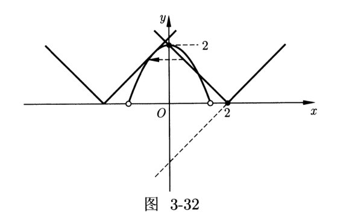

# 导数题型

## 函数的性质

### 单调性和凹凸性

容易知道，在区间 $[a,b]$ 上：

- 如果 $f'(x)>0$，那么函数单调递增。

- 如果 $f'(x)<0$，那么函数单调递减。

- 如果 $f'(x)=0$，那么函数为常函数。

容易知道，凹凸性可以由二阶导数反应，由于高中课本没有涉及，而且凹凸性的定义也有不同说法，我们只需要知道，二阶导数可以反应凹凸性即可。

另外，如果函数 $f$ 在点 $x_0$ 凹凸性改变，那么 $x_0$ 是 $f$ 的一个拐点。注意，如同驻点不一定是极值点，$f''(x_0)=0$ 不代表 $x_0$ 一定是拐点。

### 极值点和最值点

由费马引理，我们知道，若 $x_0$ 为 $f(x)$ 的极值点，那么一定有 $f'(x)=0$。

但是，$f'(x)=0$ 仅仅是前命题的必要不充分条件，充分性不完全正确，例如对于 $f(x)=x^3$，有 $f'(0)=0$ 但是 $x=0$ 仅仅是一个拐点。

其充分性有几种不同的说法：

- 第一充分条件：严谨的数学语言略，我们感性的理解，如果函数的导数在 $x_0$ 处为零，且其左右一个大于零、一个小于零，那么 $x_0$ 为 $f(x)$ 的极值点。

- 第二充分条件：通过二阶导数，我们可以知道 $f'(x)=0$ 且 $f''(x)\neq0$，那么 $x_0$ 为 $f(x)$ 的极值点。

- 凹凸性条件：设函数 $f$ 由 $f'(x_0)=0$ 且在 $x_0$ 二阶可导，

    - 若 $f''(x_0)>0$，则 $x_0$ 为 $f$ 的一个极小值点；
    - 若 $f''(x_0)<0$，则 $x_0$ 为 $f$ 的一个极大值点。

但是注意，加上第一充分条件后，就是充分必要的；但是加上第二充分条件或者凹凸性条件，就不是必要的了，例如 $f(x)=x^4$ 在 $0$ 处二阶导为零，但是是一个极值点，具体的：

- 如果 $f'(x_0)=0$ 且 $f''(x_0)\neq0$，那么 $x_0$ 一定是极值点。

- 如果 $f'(x_0)=0$ 且其导函数左边为正、右边为负，则 $x_0$ 一定是极大值点。

- 如果 $f'(x_0)=0$ 且其导函数左边为负、右边为正，则 $x_0$ 一定是极小值点。

- 如果 $x_0$ 为 $f(x)$ 极值点，那么一定满足 $f'(x_0)=0$ 且为导函数变号点。

- 容易发现，因式分解后如果有一项的次数为偶数，那么在这里就是不变号的。

最值点一定是极值点，但是极值点不一定能是最值点。

### 函数图像的绘制

其中，曲线的渐近线是当 $x$ 坐标或 $y$ 坐标或两者同时趋于无穷大时，与该曲线距离趋于 $0$ 的直线。

- 直线 $x = x_{0}$ 是曲线 $y = f(x)$ 的垂直渐近线，当且仅当

    

    $\lim\limits_{x \to x_{0}^{-}} f(x) = \infty$ 或 $\lim\limits_{x \to x_{0}^{+}} f(x) = \infty$
    

- 直线 $y = b$ 是曲线 $y = f(x)$ 的水平渐近线，当且仅当

    

    $\lim\limits_{x \to +\infty} f(x) = b$ 或 $\lim\limits_{x \to -\infty} f(x) = b$
    

- 直线 $y = ax + b (a \ne 0)$ 是曲线 $y = f(x)$ 的斜渐近线，当且仅当

    

    $\lim\limits_{x \to +\infty} [f(x) - (ax + b)] = 0$ 或 $\lim\limits_{x \to -\infty} [f(x) - (ax + b)] = 0$
    

一般来说，函数图像的绘制有以下步骤：

1. 确定函数的定义域；
2. 确定函数的对称性与周期性；
3. 确定函数的渐近线；
4. 计算导数，确定函数的单调区间和极值点；
5. 计算二阶导数，确定函数的凹凸区间和拐点。

通过导数，我们可以判断函数的单调性与凹凸性，从而就能粗略地绘制出函数的图像。

### 零点数与近似值

我们知道，根据零点存在性定理，对于一个连续的函数，如果有一正一负一对函数值，那么在他们中间一定至少有一个零点。

而我们的导数正好可以求出所有的极值点，容易想到，我们对函数求导，然后求出所有的极值点，算出这里的极值，画出函数图像即可得到零点个数。

而导数还可以用于找零点的近似值，称为牛顿迭代法：初始时我们从给定的 $f(x)$ 和一个近似解 $x_0$ 开始（初值的问题与 Newton 分形有关，可参考 3Blue1Brown 的 [牛顿分形](https://www.bilibili.com/video/BV1HQ4y1q78v)。

假设我们目前的近似解是 $x_i$，我们画出与 $f(x)$ 切于点 $(x_i,f(x_i))$ 的直线 $l$，将 $l$ 与 $x$ 轴的交点横坐标记为 $x_{i+1}$，那么这就是一个更优的近似解。重复这个迭代的过程。

{ width="60%" }

根据导数的几何意义，可以得到如下关系：

$$
f'(x_i) = \frac{f(x_i)}{x_{i} - x_{i+1}}
$$

整理后得到如下递推式：

$$
x_{i+1} = x_i - \frac{f(x_i)}{f'(x_i)}
$$

直观地说，如果 $f(x)$ 比较平滑，那么随着迭代次数的增加，$x_i$ 会越来越逼近方程的解。

牛顿迭代法的收敛率是平方级别的，这意味着每次迭代后近似解的精确数位会翻倍。关于牛顿迭代法的收敛性证明可参考 [citizendium - Newton method Convergence analysis](http://en.citizendium.org/wiki/Newton%27s_method#Convergence_analysis)。当然牛顿迭代法也同样存在着缺陷，详情参考 [Xiaolin Wu - Roots of Equations 第 18 - 20 页分析](https://www.ece.mcmaster.ca/~xwu/part2.pdf)。

## 导数与不等式

### 不等式方法

求证不等式的方法有几种，最简单的是：

- 设函数，证明函数恒大于或小于零。

- 直接对函数求导，尝试证明函数最小值大于零，或最大值小于零。

- 注意到多项式只要求够多次数多导数，一定会变为零，因此如果不好解决，继续求导，对高阶导数尝试分析其是否恒正或恒负。

### 简单不等式

$$
\boxed{e^x\ge x+1,\quad x\in\R}\tag a
$$

证明：设 $f(x)=e^x-x-1$，那么：

$$
f'(x)=e^x-1
$$

因此，当 $x>0$ 时，$f'(x)>0$；当 $x<0$ 时 $f'(x)<0$，因此：

$$
f(x)\ge f(0)=0
$$

即 $e^x\ge x+1$，带入 $x\gets\ln x$ 有：

$$
\boxed{x\ge\ln x+1,\quad x>0}\tag b
$$

三角函数也有一些不等式：

$$
\boxed{\sin x<x,\quad x>0}\tag c
$$

证明：设 $f(x)=x-\sin x$，那么 $f'(x)=1-\cos x\ge0$。

所以 $f(x)$ 在 $(0,\infty)$ 上单调递增，$f(x)>f(0)=0$ 即 $x>\sin x$。

$$
\boxed{x<\tan x,\quad x\in(0,\pi/2)}\tag d
$$

证明：令 $f(x)=\tan x-x$，则

$$
f'(x)=\dfrac{1}{\cos^2 x}-1>0
$$

所以 $f(x)$ 在 $(0,\pi/2)$ 上单调递增，$f(x)>f(0)=0$ 即 $\tan x>x$。

### 二元不等式

二元不等式，首选方案是将两个未知数用一个未知数表示，最常见的是两个次数相等的齐次式相除，用比值还原，将二元不等式转化为一元后，就可以求导解决了。

$$
\boxed{\sqrt{x_1x_2}<\dfrac{x_2-x_1}{\ln x_2-\ln x_1},\quad x_1,x_2>0}\tag e
$$

证明，不放假设 $x_2>x_1$，则化简式子为：

$$
\ln x_2-\ln x_1<\dfrac{x_2-x_1}{\sqrt{x_1x_2}}
$$

设 $t=\sqrt{x_2/x_1}>1$，则：

$$
\begin{aligned}
\text{LHS}&=\ln t^2=2\ln t\\
\text{RHS}&=\dfrac{t^2-1}{t}=t-\dfrac{1}{t}
\end{aligned}
$$

令 $f(t)=t-\dfrac{1}{t}-2\ln t$，则：

$$
f'(t)=1+\dfrac{1}{t^2}-\dfrac{2}{t}=\left(1-\dfrac{1}{t}\right)^2>0
$$

因此 $f(t)>f(1)=0$，这个也成为对数均值不等式：

$$
\boxed{\sqrt{x_1x_2}<\dfrac{x_2-x_1}{\ln x_2-\ln x_1}<\dfrac{x_1+x_2}{2},\quad x_1,x_2>0}\tag f
$$

## 隐零点问题

## 必要性探路

我们在一些特殊点处应用题述要求，得出一些必要性的条件。

然后根据这些必要性条件，在充分性的证明过程中就可以少讨论一些情况。

参变分离：关于 $a,x$ 的不等式在区间内恒成立，转化为求 $a$ 小于或大于一个关于 $x$ 的多项式的最大值或最小值。
