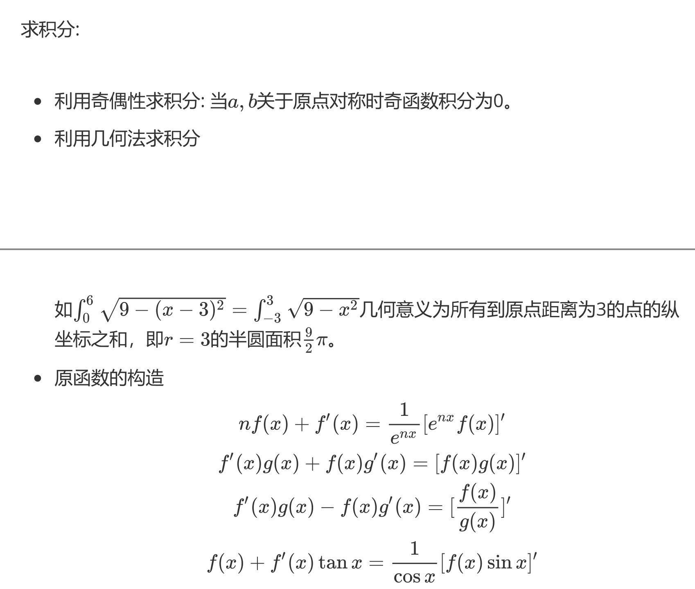

# 导数题型

## 函数的性质

### 参变分离

参变分离，即为将参数和变量分开，使不等式一边只有参数，另一边只含有变量，可以进行参变分离的一定是显式的。

**例题**：已知 $y = xe^x + x^2 + 2x + a$ 恰有两个不同的零点，则 $a$ 的取值范围为。

**答案**：由题意方程 $xe^x + x^2 + 2x + a = 0$ 有两个不同的实根，分离参数 $-a = xe^x + x^2 + 2x$。令 $f(x) = xe^x + x^2 + 2x$，则函数 $f(x)$ 的定义域为 $\mathbb{R}$，求导

$$
f'(x) = (x+1)(e^x + 2)
$$

当 $x < -1$ 时，$f'(x) < 0$，$f(x)$ 单调递减；当 $x > -1$ 时，$f'(x) > 0$，$f(x)$ 单调递增，所以函数 $f(x)$ 在 $x = -1$ 处取得极小值：

$$
f(-1) = -\dfrac{1}{e} - 1
$$

从而作出函数 $f(x)$ 的图像，则 $-a > -\dfrac{1}{e} - 1$ 时，函数 $y = f(x)$ 的图像与直线 $y = -a$ 有两个交点，所以

$$
a < \dfrac{1}{e} + 1
$$

**例题**：已知函数 $f(x) = x(\ln x - ax)$ 有两个极值点，则实数 $a$ 的取值范围为。

**答案**：函数 $f(x)$ 的定义域为 $x > 0$，由题意 $f'(x) = \ln x - 2ax + 1$ 有两个零点，分离参数

$$
2a = \dfrac{\ln x + 1}{x}=g(x)
$$

$$
g'(x) = \dfrac{1 - \ln x - 1}{x^2} = \dfrac{-\ln x}{x^2}
$$

当 $0 < x < 1$ 时，$g'(x) > 0$，$g(x)$ 单调递增；当 $x > 1$ 时，$g'(x) < 0$，$g(x)$ 单调递减，所以函数 $g(x)$ 在 $x = 1$ 处取得极大值$g(1) = 1$。

当 $x \to +\infty$ 时，$g(x) \to 0$；当 $x \to 0$ 时，$g(x) \to -\infty$。当 $0 < 2a < 1$，即 $0 < a < \dfrac{1}{2}$ 时，直线 $y = 2a$ 与 $y = g(x)$ 的图像有两个交点。

### 隐零点问题

## 必要性探路

我们在一些特殊点处应用题述要求，得出一些必要性的条件。

然后根据这些必要性条件，在充分性的证明过程中就可以少讨论一些情况。

参变分离：关于 $a,x$ 的不等式在区间内恒成立，转化为求 $a$ 小于或大于一个关于 $x$ 的多项式的最大值或最小值。
