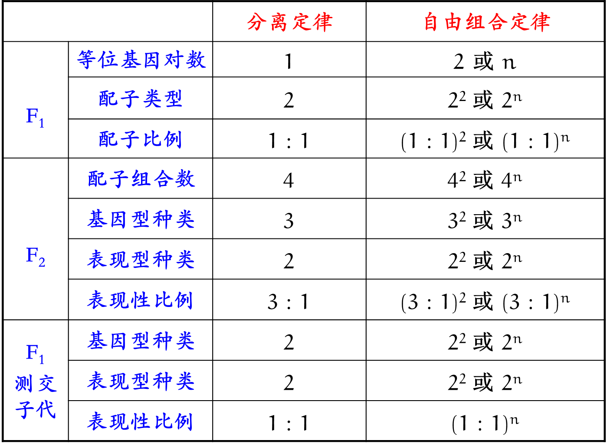

# 孟德尔遗传规律[^todo]

## 孟德尔规律基础

### 性状和基因

性状：

- 性状：生物体具有的形态结构和生理特征。

- 相对性状：同种生物的同一性状的不同表现类型。

- 隐性性状：一对相对性状的亲本杂交，杂种子一代未显现出来的性状。

- 显性性状：一对相对性状的亲本杂交，杂种子一代显现出来的性状。

- 性状分离：在杂种后代中，同时出现显性性状和隐性性状的现象。

丹麦生物学家约翰逊给孟德尔的“遗传因子”一词起了一个新名字，叫作“基因”，并且提出了表型（也叫表现型）和基因型的概念：

- 表型指生物个体表现出来的性状，如豌豆的高茎和矮茎。

- 与表型有关的基因组成叫作基因型，如高茎豌豆的基因型是 DD 或 Dd，矮茎豌豆的基因型是 dd。

- 控制相对性状的基因，叫作等位基因，如 D 和 d。

基因型与表现型的关系：

1. 基因型是性状表现的内在因素，在很大程度上决定表现型，而表现型是基因型的表现形式。

2. 表现型（生物的性状表现）是基因型（遗传物质组成）和环境条件共同作用的结果。

### 孟德尔的假说

1. 生物的性状是由遗传因子决定的。这些因子就像一个个独立的颗粒，既不会相互融合，也不会在传递中消失。每个因子决定一种特定的性状，其中决定显性性状的为显性遗传因子，用大写字母（如 D）来表示；决定隐性性状的为隐性遗传因子，用小写字母（如 d）来表示。

2. 在体细胞中，遗传因子是成对存在的。例如，纯种高茎豌豆的体细胞中有成对的遗传因子 DD，纯种矮茎豌豆的体细胞中有成对的遗传因子 dd。像这样，遗传因子组成相同的个体叫作纯合子。因为 F1 自交的后代中出现了隐性性状，所以在 F1 的体细胞中必然含有隐性遗传因子；而 F1 表现的是显性性状，因此 F1 的体细胞中的遗传因子应该是 Dd。像这样，遗传因子组成不同的个体叫作杂合子。

3. 生物体在形成生殖细胞——配子时，成对的遗传因子彼此分离，分别进入不同的配子中。配子中只含有每对遗传因子中的一个。

4. 受精时，雌雄配子的结合是随机的。例如，含遗传因子 D 的配子，既可以与含遗传因子 D 的配子结合，又可以与含遗传因子 d 的配子结合。

### 孟德尔第一定律

孟德尔第一定律，又称分离定律：在生物的体细胞中，控制同一性状的遗传因子成对存在，不相融合；在形成配子时，成对的遗传因子发生分离，分离后的遗传因子分别进入不同的配子中，随配子遗传给后代。

- 研究对象：位与一对同源染色体上的一对等位基因。

- 发生时间：减数分裂 I 后期。

- 使用范围：真核生物，有性生殖，细胞核遗传。

### 孟德尔第二定律

孟德尔第二定律，又称自由组合定律：控制不同性状的遗传因子的分离和组合是互不干扰的；在形成配子时，决定同一性状的成对的遗传因子彼此分离，决定不同性状的遗传因子自由组合。

- 研究对象：非同源染色体上的非等位基因。

- 发生时间：减数分裂 I 后期。

- 使用范围：真核生物，有性生殖，细胞核遗传。

### 孟德尔规律的应用

孟德尔用豌豆进行杂交实验：

- 成功地揭示了遗传的两条基本规律：遗传因子的分离定律和自由组合定律。

- 这两条基本规律的精髓是：生物体遗传的不是性状本身，而是控制性状的遗传因子。

杂交育种：

- 人们有目的地将具有不同优良性状的两个亲本杂交，使两个亲本的优良性状组合在一起，再筛选出所需要的优良品种。

- 例如，小麦的抗倒伏（D）对易倒伏（d）为显性，易染条锈病（T）对抗条锈病（t）为显性。小麦患条锈病或倒伏，会导致减产甚至绝收。现有两个不同品种的小麦，一个品种抗倒伏，但易染条锈病（DDTT）；另一个品种易倒伏，但能抗条锈病（ddtt）。将这两个品种的小麦杂交，在 F2 中就会出现新类型（如DDtt 或Ddtt）。继续繁育它们，经过选择和培育，就可以得到既抗倒伏又抗条锈病的纯种（DDtt）。

计算患病概率：

- 在医学实践中，人们可以依据分离定律和自由组合定律，对某些遗传病在后代中的患病概率作出科学的推断，从而为遗传咨询提供理论依据。

- 例如，人类的白化病是一种由隐性基因（a）控制的遗传病，如果一个患者的双亲表型正常，根据分离定律可知，患者的双亲一定都是杂合子（Aa），则双亲的后代中患病概率是 1/4。

## 豌豆杂交实验

### 实验材料的优点

豌豆的优点：

- 优点一：自花传粉，闭花受粉，自然状态下都是纯种。

- 优点二：相对性状易于区分。

- 优点三：豌豆花大，易于人工操作，生长周期短。

- 优点四：子粒较多，数学统计分析结果可靠。

自花传粉、闭花受粉：

- 自花传粉：两性花的花粉落在同一朵花的雌蕊柱头上的过程。

- 闭花受粉：在花未开放之前雄蕊的花粉落在雌蕊的柱头上。

- 在自然状态下，一般都是纯种，实验结果容易分析而且可靠。

### 杂交与研究过程

去雄、套袋、传粉、套袋。

孟德尔获得成功的原因：

1. 正确选用了实验材料。

2. 对性状分析是由一对到 多对，遵循由单因素到多因素的研究方法。

3. 进行统计学方法对实验结果进行分析。

4. 科学地设计了实验程序。

### 假说演绎法

| 步骤 | 分离定律 | 自由组合定律 |
| :-: | :-: | :-: |
| 分析问题 | $3:1$ | $9:3:3:1$ |
| 提出假说 | 遗传因子彼此分离 | 遗传因子自由组合 |
| 演绎推理 | 测交实验 | 测交实验、正交反交 |
| 验证假说 | $1:1$ | $1:1:1:1$ |
| 分析结果 | 真实结果与预期结果一致 | 真实结果与预期结果一致 |
| 得出结论 | 分离定律 | 自由组合定律 |

### 分离比模拟实验

小球球 >_<

## 遗传规律解题方法

### 分离定律

#### 显隐性的判断

1. 出现性状分离，不同亲本的性状为隐性（无中生有有为隐）。

2. 一个性状凭空消失，则这个性状为隐性（凭空消失为隐性）。

#### 基因型的判断

1. 观察法：若为隐性形状，则为 aa。

2. 自交法：若后代性状分离，则为 Aa，否则为 AA。

3. 测交法：若后代全为显性，则为 AA，否则为 Aa。

#### 连续自交比例

杂合子 Aa 连续自交 $n$ 代：

| | Aa | aa + AA | aa, AA | Aa + AA |
| :-: | :-: | :-: | :-: | :-: |
| $F_n$ | $\dfrac{1}{2^n}$ | $1-\dfrac{1}{2^n}=\dfrac{2^n-1}{2^n}$ | $\dfrac{1}{2}-\dfrac{1}{2^{n+1}}=\dfrac{2^n-1}{2^{n+1}}$ | $\dfrac{1}{2}+\dfrac{1}{2^{n+1}}=\dfrac{2^n+1}{2^{n+1}}$ |

用途：自交多代，纯合子比例提高，用于选育种。

变式：杂合子 Aa 连续自交，逐代淘汰 aa 隐性个体。

性质：逐代淘汰等价于连续自交后淘汰所有隐性个体，因为隐性个体自交一定还是隐性个体。

根据上表有：

$$
\dfrac{\rm{AA}}{\rm{AA+Aa}}=\dfrac{2^n-1}{2^n+1}
$$

那么：

| | Aa | AA |
| :-: | :-: | :-: |
| $F_n$ | $\dfrac{2}{2^n+1}$ | $1-\dfrac{2}{2^n+1}=\dfrac{2^n-1}{2^n+1}$ |

#### 自由交配比例

杂合子 Aa 自由交配：比例恒为 $1:2:1$。

配子法：一个区域内 $\rm{AA:Aa}=1:2$，求自由交配一代后性状及其比例。

找出配子：$\rm{A:a}=2\times1+1\times2:1\times2=2:1$，列出表格：

<svg xmlns="http://www.w3.org/2000/svg" width="17.769ex" height="9.896ex" viewBox="0 -2437 7854 4373.9" xmlns:xlink="http://www.w3.org/1999/xlink" aria-hidden="true" style=""><defs><path id="MJX-216-TEX-N-32" d="M109 429Q82 429 66 447T50 491Q50 562 103 614T235 666Q326 666 387 610T449 465Q449 422 429 383T381 315T301 241Q265 210 201 149L142 93L218 92Q375 92 385 97Q392 99 409 186V189H449V186Q448 183 436 95T421 3V0H50V19V31Q50 38 56 46T86 81Q115 113 136 137Q145 147 170 174T204 211T233 244T261 278T284 308T305 340T320 369T333 401T340 431T343 464Q343 527 309 573T212 619Q179 619 154 602T119 569T109 550Q109 549 114 549Q132 549 151 535T170 489Q170 464 154 447T109 429Z"></path><path id="MJX-216-TEX-N-41" d="M255 0Q240 3 140 3Q48 3 39 0H32V46H47Q119 49 139 88Q140 91 192 245T295 553T348 708Q351 716 366 716H376Q396 715 400 709Q402 707 508 390L617 67Q624 54 636 51T687 46H717V0H708Q699 3 581 3Q458 3 437 0H427V46H440Q510 46 510 64Q510 66 486 138L462 209H229L209 150Q189 91 189 85Q189 72 209 59T259 46H264V0H255ZM447 255L345 557L244 256Q244 255 345 255H447Z"></path><path id="MJX-216-TEX-N-31" d="M213 578L200 573Q186 568 160 563T102 556H83V602H102Q149 604 189 617T245 641T273 663Q275 666 285 666Q294 666 302 660V361L303 61Q310 54 315 52T339 48T401 46H427V0H416Q395 3 257 3Q121 3 100 0H88V46H114Q136 46 152 46T177 47T193 50T201 52T207 57T213 61V578Z"></path><path id="MJX-216-TEX-N-61" d="M137 305T115 305T78 320T63 359Q63 394 97 421T218 448Q291 448 336 416T396 340Q401 326 401 309T402 194V124Q402 76 407 58T428 40Q443 40 448 56T453 109V145H493V106Q492 66 490 59Q481 29 455 12T400 -6T353 12T329 54V58L327 55Q325 52 322 49T314 40T302 29T287 17T269 6T247 -2T221 -8T190 -11Q130 -11 82 20T34 107Q34 128 41 147T68 188T116 225T194 253T304 268H318V290Q318 324 312 340Q290 411 215 411Q197 411 181 410T156 406T148 403Q170 388 170 359Q170 334 154 320ZM126 106Q126 75 150 51T209 26Q247 26 276 49T315 109Q317 116 318 175Q318 233 317 233Q309 233 296 232T251 223T193 203T147 166T126 106Z"></path><path id="MJX-216-TEX-N-34" d="M462 0Q444 3 333 3Q217 3 199 0H190V46H221Q241 46 248 46T265 48T279 53T286 61Q287 63 287 115V165H28V211L179 442Q332 674 334 675Q336 677 355 677H373L379 671V211H471V165H379V114Q379 73 379 66T385 54Q393 47 442 46H471V0H462ZM293 211V545L74 212L183 211H293Z"></path><path id="MJX-216-TEX-M-1D670" d="M191 76Q212 75 220 68T229 38Q229 10 208 1H129H80Q48 1 38 7T28 38Q28 51 29 57T40 69T70 76Q89 76 89 78Q90 79 117 205T173 461T205 599Q212 623 250 623H262H273Q312 623 319 599Q322 591 350 461T406 205T435 78Q435 76 454 76H458Q484 76 493 59Q496 53 496 38Q496 11 478 3Q474 1 395 1H317Q295 8 295 38Q295 65 311 73Q316 75 333 76L348 77V78Q348 80 341 112L334 143H190L183 112Q176 80 176 78Q175 76 178 76Q180 76 191 76ZM318 221Q313 238 288 366T263 519Q263 526 262 527Q261 527 261 520Q261 493 236 365T206 221Q206 219 262 219T318 221Z"></path><path id="MJX-216-TEX-M-1D68A" d="M126 306Q105 306 90 321T74 359Q74 439 211 439Q268 439 276 438Q343 426 383 390T430 306Q431 301 431 190V81Q446 79 465 78T492 76T509 72T521 60T524 38Q524 11 506 3Q502 1 466 1Q426 1 406 5T379 14T355 36L345 30Q284 -6 205 -6Q135 -6 92 39T48 141Q48 182 79 212T158 256T252 278T342 285H347V290Q347 315 325 335T267 362Q258 363 224 363Q189 363 185 362H179L178 358Q178 353 178 352T176 345T174 337T170 330T165 322T158 316T150 311T139 308T126 306ZM132 140Q132 115 157 93T224 70Q269 70 302 87T344 133Q346 139 347 175V211H339Q256 209 194 190T132 140Z"></path></defs><g stroke="currentColor" fill="currentColor" stroke-width="0" transform="matrix(1 0 0 -1 0 0)"><g data-mml-node="math"><g data-mml-node="mtable"><g data-mml-node="mtr" transform="translate(0, 1687)"><g data-mml-node="mtd" transform="translate(625, 0)"></g><g data-mml-node="mtd" transform="translate(2811, 0)"><g data-mml-node="mn"><use xlink:href="#MJX-216-TEX-N-32"></use></g><g data-mml-node="mi" transform="translate(500, 0)"><use xlink:href="#MJX-216-TEX-N-41"></use></g></g><g data-mml-node="mtd" transform="translate(6238, 0)"><g data-mml-node="mn"><use xlink:href="#MJX-216-TEX-N-31"></use></g><g data-mml-node="mi" transform="translate(500, 0)"><use xlink:href="#MJX-216-TEX-N-61"></use></g></g></g><g data-mml-node="mtr" transform="translate(0, -7.9)"><g data-mml-node="mtd"><g data-mml-node="mn"><use xlink:href="#MJX-216-TEX-N-32"></use></g><g data-mml-node="mi" transform="translate(500, 0)"><use xlink:href="#MJX-216-TEX-N-41"></use></g></g><g data-mml-node="mtd" transform="translate(2320, 0)"><g data-mml-node="mstyle" transform="scale(1.44)"><g data-mml-node="mn"><use xlink:href="#MJX-216-TEX-N-34"></use></g><g data-mml-node="TeXAtom" data-mjx-texclass="ORD" transform="translate(500, 0)"><g data-mml-node="mtext"><use xlink:href="#MJX-216-TEX-M-1D670"></use><use xlink:href="#MJX-216-TEX-M-1D670" transform="translate(525, 0)"></use></g></g></g></g><g data-mml-node="mtd" transform="translate(5622, 0)"><g data-mml-node="mstyle" transform="scale(1.44)"><g data-mml-node="mn"><use xlink:href="#MJX-216-TEX-N-32"></use></g><g data-mml-node="TeXAtom" data-mjx-texclass="ORD" transform="translate(500, 0)"><g data-mml-node="mtext"><use xlink:href="#MJX-216-TEX-M-1D670"></use><use xlink:href="#MJX-216-TEX-M-1D68A" transform="translate(525, 0)"></use></g></g></g></g></g><g data-mml-node="mtr" transform="translate(0, -1687)"><g data-mml-node="mtd" transform="translate(125, 0)"><g data-mml-node="mn"><use xlink:href="#MJX-216-TEX-N-31"></use></g><g data-mml-node="mi" transform="translate(500, 0)"><use xlink:href="#MJX-216-TEX-N-61"></use></g></g><g data-mml-node="mtd" transform="translate(2320, 0)"><g data-mml-node="mstyle" transform="scale(1.44)"><g data-mml-node="mn"><use xlink:href="#MJX-216-TEX-N-32"></use></g><g data-mml-node="TeXAtom" data-mjx-texclass="ORD" transform="translate(500, 0)"><g data-mml-node="mtext"><use xlink:href="#MJX-216-TEX-M-1D670"></use><use xlink:href="#MJX-216-TEX-M-1D68A" transform="translate(525, 0)"></use></g></g></g></g><g data-mml-node="mtd" transform="translate(5622, 0)"><g data-mml-node="mstyle" transform="scale(1.44)"><g data-mml-node="mn"><use xlink:href="#MJX-216-TEX-N-31"></use></g><g data-mml-node="TeXAtom" data-mjx-texclass="ORD" transform="translate(500, 0)"><g data-mml-node="mtext"><use xlink:href="#MJX-216-TEX-M-1D68A"></use><use xlink:href="#MJX-216-TEX-M-1D68A" transform="translate(525, 0)"></use></g></g></g></g></g><line data-line="v" class="mjx-solid" x1="1785" y1="-1937" x2="1785" y2="2437"></line><line data-line="v" class="mjx-solid" x1="5087" y1="-1937" x2="5087" y2="2437"></line><line data-line="h" class="mjx-solid" x1="0" y1="1202" x2="7854" y2="1202"></line><line data-line="h" class="mjx-solid" x1="0" y1="-492.9" x2="7854" y2="-492.9"></line></g></g></g></svg>

得出答案：基因型 $\rm{AA:Aa:aa}=4:4:1$，形状分离比为 $8:1$。

杂合子 Aa 自由交配，逐代淘汰 aa 隐性个体：

| | AA | Aa |
| :-: | :-: | :-: |
| $F_n$ | $\dfrac{n}{n+2}$ | $\dfrac{2}{n+2}$ |

#### 合子致死问题

形式为，$\rm{AA,Aa,aa}$ 中有基因型导致致死，或者部分致死。

在 $1:2:1$ 的基础上，减掉一部分数即可，例如 $\rm aa$ 有 $50\%$ 致死：

$$
1:2:(1\times50\%)=2:4:1
$$

### 自由组合定律

#### 实质与验证

- 实质：验证双杂合子可以产生 $4$ 种比例相等的配子。

- 自交法：性状分离比 $9:3:3:1$。

- 测交法：性状分离比 $1:1:1:1$。

- 花粉法：花粉形状比 $1:1:1:1$。

- 单倍体育种：取花药离体培养，（花粉）获得单倍体幼苗，用秋水仙素处理，使幼苗染色体加倍、恢复正常染色体数，最终植株性状分离比 $1:1:1:1$。

#### 拆分组合法

将自由组合问题转化为若干个分离定律问题。

拆分：将多对等位基因分别考虑，然后乘起来，有：

$$
(3:1)(3:1)=9:3:3:1
$$

$$
(3:1)(1:1)=3:3:1:1
$$

$$
(1:1)(1:1)=1:1:1:1
$$

因此，$n$ 对等位基因 $\rm{AaBbCc\dots}$ 分离的现象：

| | $1$ 对相对性状 | $2$ 对相对性状 | $n$ 对相对性状 |
| :-: | :-: | :-: | :-: |
|  $F_1$ 配子 | 有 $2$ 种 $1:1$ | 有 $2^2$ 种 $1:1:1:1$ | 有 $2^n$ 种 $(1:1)^n$ |
|  $F_2$ 表现型 | 有 $2$ 种 $3:1$ | 有 $2^2$ 种 $9:3:3:1$ | 有 $2^n$ 种 $(3:1)^n$ |
|  $F_2$ 基因型 | 有 $2$ 种 $1:2:1$ | 有 $2^2$ 种 $1:2:1:2:4:2:1:2:1$ | 有 $2^n$ 种 $(1:2:1)^n$ |

根据全隐、全显比例判断 $n$ 等位基因对数：

| | 全显比例 | 全隐比例 |
| :-: | :-: | :-: |
| 自交 | $(3/4)^n$ | $(1/4)^n$ |
| 测交 | $(1/2)^n$ | $(1/2)^n$ |

#### 多项式展开法

先对每一对相对性状单独分析，对单独得到的比例相乘：

$$
(3:1)(3:1)=9:3:3:1
$$

可以通过这种方法来快速解决自由组合的杂交子代基因型比例问题。

#### 患病概率计算

容斥原理：

- 患甲病概率 $n$，患乙病概率 $m$。

- 同时患两病概率 $nm$，不患病概率 $(1-n)(1-m)$。

- 患病概率 $n+m-nm$，患一种病概率 $n+m-2nm$。

- 只患甲病概率 $n(1-m)=n-nm$，只患乙病概率 $m(1-n)=m-nm$。

#### 配子致死问题

配子完全致死问题：

以基因型为 Ab 的花粉（雄配子）致死为例：

我们知道 Ab 雄配子一定会与 $1:1:1:1$ 的 $\rm AB, Ab, aB, ab$ 的配子结合后死亡。

因此，我们在 $9:3:3:1$ 上减去对应的个体，即 $(9-1-1):(3-1-1):3:1=7:3:1:1$。

配子部分致死问题：

以 AaBb 中含 b 的花粉 $50\%$ 致死为例。

我们分开讨论，我们知道：

$$
\rm{Aa\times Aa=AA+2Aa+aa}
$$

$$
\rm{Bb\times B\dfrac{1}{2}b=BB+\dfrac{3}{2}Bb+\dfrac{1}{2}bb}
$$

性状分离比：

$$
(1+2:1)(2+3:1)=(3:1)(5:1)=15:5:3:1
$$

这种将系数放在前面可以快速解决。

## 遗传规律中的特例

### 分离定律

#### 不完全显性

- 显性 Aa 与 AA 表型不同。

- 杂合子自交分离比为 $1:2:1$。

#### 复等位基因

- 例如 ABO 血型：

    - AB 型血：$\rm{I^AI^B}$。

    - A 型血：$\rm{I^AI^A,I^Ai}$。

    - B 型血：$\rm{I^BI^B,I^Bi}$。

    - O 型血：$\rm{ii}$。

    - 其中 $\rm{I^A,I^B}$ 称为共显性基因。

#### 表型模拟

- 表型同时由基因型和环境影响。

- 例如 AA 果蝇 $\pu{0^oC}$ 为残翅。

- 从性遗传和伴性遗传的表型都与性别有密切的联系，但它们是两种截然不同的遗传方式——伴性遗传的基因位于性染色体上，而从性遗传的基因位于常染色体上，后者基因在传递时并不与性别相联系，这与位于性染色体上基因的传递有本质区别。

#### 从性遗传

- 基因型与表型的对应与性别有关，通常受到性激素的影响。

- 例如 Hh 公羊有角、母羊无角。

#### 母性效应

- 核遗传，但是子代某一性状为母本的核基因控制，不受自身核基因控制。

- 例如椎实螺的左旋与右旋。

#### 三体问题

- 例如二十一三体综合征，通常是减数分裂异常导致的。

- 例如 AAa 染色体的配子产生为：$\mathtt{(AA, a); (Aa, A); (Aa, A)}$，即 $\rm{AA:Aa:A:a}=1:2:2:1$。

### 自由组合定律

#### 基础 $9:3:3:1$ 型

最基本的类型，特征为和为 $16$。

产生 $9:3:3:1$ 通常是两对相对性状互不干扰，或者同时为显性时产生新的性状。

$$
\mathtt{(A\_B\_);(A\_bb);(aaB\_);(aabb)}
$$

举例：豌豆黄色、绿色，圆粒、皱粒。

测交：一一对应，下面的变形也是如此，对应组内测交比例之和即为测交性状分离。

#### 变形 $9:7$ 型

两对独立的非等位基因，两个基因均为显性（纯合或杂合状态）决定一种性状的出现，单独一个为显性与全不显性表现相同。

$$
\mathtt{(A\_B\_);(A\_bb,aaB\_,aabb)}
$$

举例：酶甲基因，酶乙基因，底物经过酶甲和酶乙后产生有色物质。

#### 变形 $9:6:1$ 型

两种显性基因同时存在时产生一种性状，单独存在时则能表现相似的性状，无显性基因时表达出又一种性状来。

$$
\mathtt{(A\_B\_);(A\_bb,aaB\_);(aabb)}
$$

举例：酶甲和酶乙均控制某颜色色素合成，但是两种色素在一起后产生不同颜色。

#### 变形 $15:1$ 型

只要一个显性基因存在时就表现性状，显性效果不累加，无显性基因不表现性状。

$$
\mathtt{(A\_B\_,A\_bb,aaB\_);(aabb)}
$$

举例：酶甲和酶乙均控制某色素合成，只要存在一种酶即可合成。

#### 叠加效应 $1:4:6:4:1$ 型

当两对非等位基因决定某一性状时，由于基因的相互作用，后代由于显性基因的叠加，从而出现偏离。

常见形式为 $1:4:6:4:1$，这个表示性状与显性基因的个数有关。

在某些题目里面，可以看到显性基因与性状（长度、质量等）的线性关系。

#### 隐性上位作用 $9:3:4$ 型

其中一个等位基因如果隐性纯合，则表现为一个形态，反之与另一个基因有关，我们称一对隐性基因对另一对基因起上位性作用。

$$
\mathtt{(A\_B\_);(A\_bb);(aaB\_,aabb)}
$$

举例：果蝇的有翅 $\rm A\_$ 无翅 $\rm aa$，与长翅 $\rm B\_$ 短翅 $\rm bb$。

#### 显性抑制作用 $13:3$ 型

其中一对基因对另一对其抑制作用且本身不控制性状的表现，称其为抑制基因，或者显性时性状抵消、与双隐性相同。

$$
\mathtt{(A\_bb);(A\_B\_,aaB\_,aabb)}
$$

举例：酶甲控制合成，酶乙控制抑制甲或者分解产物。

#### 显性上位作用 $12:3:1$ 型

两对独立的基因共同控制，其中一对基因对另一基因起遮盖作用且本身控制性状的表现。

$$
\mathtt{(A\_B\_,aaB\_);(A\_bb);(aabb)}
$$

举例：酶甲控制合成蓝色色素，酶乙控制合成黄色色素且抑制酶甲。

#### 相互抑制作用 $10:6$ 型

只要一个显性基因存在时就表现性状，但双显性基因相互抑制、作用效果抵消，与双隐性基因效果相同。

$$
\mathtt{(A\_B\_,aabb);(A\_bb,aaB\_)}
$$

举例：酶甲和酶乙均控制合成某种色素，两种酶互相抑制。

#### 相互抑制作用 $10:3:3$ 型

两个基因各自显性表现不同，但双显性基因相互抑制、作用效果抵消，与双隐性基因效果相同。

$$
\mathtt{(A\_B\_,aabb);(A\_bb,aaB\_)}
$$

举例：酶甲控制蓝色色素合成，酶乙控制黄色色素合成，两种酶相互抑制。

[^todo]: TODO: 五三 310 页考法 1, 2, 3。
