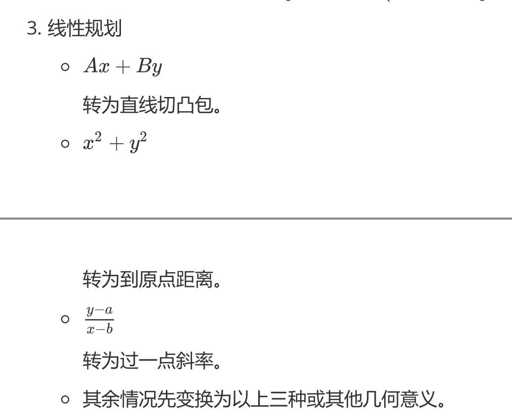

# 平面体系

## 平面坐标系

### 笛卡尔坐标系

笛卡尔坐标系（也称直角坐标系）在数学中是一种正交坐标系，二维的直角坐标系是由两条相互垂直、相交于原点的数线构成的。在平面内，任何一点的坐标是根据数轴上对应的点的坐标设定的，类似于数轴上点与坐标的对应关系。

二维的直角坐标系通常由两个互相垂直的坐标轴设定，通常分别称为 $x$ 轴和 $y$ 轴；两个坐标轴的相交点，称为原点，通常标记为 $O$。每一个轴都指向一个特定的方向。这两个不同线的坐标轴，决定了一个平面，称为 $xy$ 平面，又称为笛卡尔平面。

通常两个坐标轴只要互相垂直，其指向何方对于分析问题是没有影响的，但习惯性地，$x$ 轴被水平摆放，称为横轴，通常指向右方；$y$ 轴被竖直摆放而称为纵轴，通常指向上方。

为了要知道坐标轴的任何一点，离原点的距离。假设，我们可以刻画数值于坐标轴。那么，从原点开始，往坐标轴所指的方向，每隔一个单位长度，就刻画数值于坐标轴。这数值是刻画的次数，也是离原点的正值整数距离；同样地，背着坐标轴所指的方向，我们也可以刻画出离原点的负值整数距离。称 $x$ 轴刻画的数值为 $x$ 坐标，又称横坐标，称 $y$ 轴刻画的数值为 $y$ 坐标，又称纵坐标。

虽然，在这里，这两个坐标都是整数，对应于坐标轴特定的点。按照比例，我们可以推广至实数坐标和其所对应的坐标轴的每一个点。这两个坐标就是直角坐标系的直角坐标，标记为 $(x,y)$。任何一个点 $P$ 在平面的位置，可以用直角坐标来独特表达。只要从点 $P$ 画一条垂直于 $x$ 轴的直线。从这条直线与 $x$ 轴的相交点，可以找到点 $P$ 的 $x$ 坐标。同样地，可以找到点 $P$ 的 $y$ 坐标。这样，我们可以得到点 $P$ 的直角坐标。

### 皮克定理

给定顶点座标均是整点（或正方形格子点）的简单多边形，

皮克定理指出，其面积 $S$ 和内部格点数目 $i$、边上格点数目 $b$ 的关系：

$$
S=i+{b\over2}-1
$$

可以使用数学归纳法证明。

### 线性规划

## 欧几里得变换

### 平移与旋转

平移：

- 如果所有点的初始坐标是 $(x,y)$，在平移之后它们的坐标将是：

    $$
    \global\let\vecc=\overrightarrow
    (x',y')=(x+a,y+b)
    $$

- 平移平面上的一个点集，保持在它们之间的距离，等价于在点集中所有的笛卡尔坐标上增加固定的一对数值 $(a,b)$。

旋转：

- 要绕原点逆时针旋转一个图形 $\theta$ 度，等价于将所有点的坐标为 $(x,y)$ 替代为坐标 $(x',y')$，这里有：

    $$
    x'=x\cos \theta -y\sin \theta
    $$

    $$
    y'=x\sin \theta +y\cos \theta
    $$

- 因此：

    $$
    (x',y')=(x\cos \theta -y\sin \theta,x\sin \theta +y\cos \theta)
    $$

    详见线性代数章节。

### 对称性问题

对称是否属于欧几里得变换存在争议，但是很多教材将其列为其中。对称性问题主要涉及以下三个方面的内容：点关于点中心对称、点关于直线对称、直线关于直线对称。

- 点关于点中心对称：若点 $M(x_0, y_0)$ 及点 $N(x, y)$ 关于点 $P(a, b)$ 对称，则由中点坐标公式得

    $$
    \begin{cases}
    x = 2a - x_0 \\
    y = 2b - y_0
    \end{cases}
    $$

- 点关于直线成轴对称：设点 $P(x_0, y_0)$ 关于直线 $y = kx + b$ 的对称点为 $P'(x', y')$，则

    $$
    \begin{cases}
    \dfrac{y' - y_0}{x' - x_0} \cdot k = -1 \\
    \dfrac{y' + y_0}{2} = k \cdot \dfrac{x' + x_0}{2} + b
    \end{cases}
    $$

- 若将直线沿 $y=kx$ 对称，记倾斜角为 $\theta$，那么将所有 $x$ 替换成 ${x\cos 2\theta+y\sin 2\theta}$，将所有 $y$ 替换成 ${x\sin 2\theta-y\cos 2\theta}$。

- 直线关于直线的对称：一般转化为点关于直线的对称来解决，有两种情况，一是已知直线与对称轴相交；二是已知直线与对称轴平行。

曲线的对称：

- 曲线关于点中心对称、曲线关于直线轴对称一般是转化为点的中心对称或轴对称（这里既可选特殊点，也可选任意点实施转化），一般结论如下：

- 曲线 $f(x, y) = 0$ 关于点 $A(a, b)$ 对称的曲线方程是 $f(2a - x, 2b - y) = 0$。

- 曲线 $f(x, y) = 0$ 关于直线 $y = kx + b$ 对称的曲线方程的求法：设对称曲线上任意一点为 $P(x, y)$，其对称点在曲线 $f(x, y) = 0$ 上的坐标为 $P'(x_0, y_0)$，可用 $P(x, y)$ 表示 $P'(x_0, y_0)$，将 $P'(x_0, y_0)$ 代入已知曲线方程 $f(x, y) = 0$，应有 $f(x_0, y_0) = 0$，即可求出曲线 $f(x, y) = 0$ 关于直线 $y = kx + b$ 对称的曲线方程。这种方法称为相关点代入法。
