# 圆锥曲线

## 二次曲线

### 圆锥截线

用一平面去截双顶圆锥，得到的截线就是圆锥曲线。圆锥曲线是平面上满足距某定点（焦点）的距离与距某定直线（准线）的距离之比为常数 $e$ 的点的轨迹。

不妨设 $\alpha$ 指母线与轴的夹角（$0<\alpha<90^\circ$），切平面与轴的夹角为 $\beta$（$0\le\beta\le90^\circ$），则所得截线的离心率 $e$ 仅由这两个角决定：

$$
e = \dfrac{\cos\beta}{\cos\alpha}
$$

角度—类型—离心率的对照：

- $\beta > \alpha$：椭圆，且 $e < 1$；$\beta = 90^\circ$ 时 $e=0$，为圆。
- $\beta = \alpha$：抛物线，$e = 1$（此时平面与某条母线平行）。
- $\beta < \alpha$：双曲线，$e > 1$（平面切到两片圆锥）。

更加具体的几何构造，由于代数手段可以简单的解决，请自行查阅丹德林球。

离心率与行星运动，以牛顿大炮为例（忽略太阳的引力作用）：

- 以第一宇宙速度发射：圆形。

- 大于第一宇宙速度，小于第二宇宙速度：椭圆形。

- 第二宇宙速度：抛物线。

- 大于第二宇宙速度：双曲线。

一个有意思的问题：用一个平面截一个无限高的圆柱，设平面与圆柱底面的夹角为 $\theta(0<\theta<90^\circ)$，则截面是一个椭圆，离心率为 $\sin^2\theta$。

圆锥曲线的极坐标定义：

$$
\rho=\dfrac{ep}{1\pm e\cos\theta}=\dfrac{L}{1\pm e\cos\theta}
$$

这个形式极为简洁，其中 $L$ 为半通径，在椭圆中有 $L=a(1-e^2)$，常在焦点三角形中用到，我们会在那里详细解释。

### 一般方程

二次曲线（二次平面曲线）是圆锥曲线的别称，本身圆锥曲线就包括我们熟知的椭圆、双曲线、抛物线之外的一些“退化”的图像，但是我们在高中课本中最常讨论的是他们的标准形式，也就是说我们已经将这些退化的图形踢出了，我们为了保持与课本的一定对应关系，我们此处讨论这些退化的，或者更一般的圆锥曲线，统一按照“二次曲线”来称呼。

二次曲线（圆锥曲线）的一般方程：在笛卡尔坐标系内，二元二次方程的图像可以表示圆锥曲线，其一般方程为：

$$
f(x,y)=Ax^2+Bxy+Cy^2+Dx+Ey+F=0
$$

容易发现，一般方程一定可以表示任何一个圆锥曲线（或者退化的圆锥曲线），而标准方程就只能表示中心在原点（对于椭圆和双曲线来讲）、焦点在坐标轴上的一个非常“标准”的圆锥曲线。

五点确定圆锥曲线：

- 我们发现六个系数 $A,B,C,D,E,F$ 齐次于比例，故参数空间是五维。通常情况下，平面上任意五个点，只要没有四个或四个以上的点共线，就能唯一地确定一条圆锥曲线。这条曲线是否退化，取决于这五个点的具体位置。

- 我们不妨带入这五个点（公式略），这是一个有 $5$ 个方程、$6$ 个未知数的齐次线性方程组。根据线性代数理论，这样的方程组总是有非零解。如果解空间的维数是 $1$，那么所有的非零解都是成比例的，它们对应同一条圆锥曲线。

- 五个点唯一确定了一条圆锥曲线。若任意三点不共线，则可以确定唯一一个非退化的圆锥曲线。这五个点的位置关系直接决定了最终曲线的类型。例如，如果五个点构成一个凸五边形，那么它们确定的曲线必定是椭圆。如果一个点“远离”其他四个点，则很可能形成双曲线或抛物线。

一旦通过五个点解出了方程 $Ax^2 + Bxy + Cy^2 + Dx + Ey + F = 0$ 的系数 $A, B, C$，我们就可以通过代数方法来判断其类型。在此之前，我们先引入二次曲线的矩阵形式表达，我们不妨记二次项矩阵为 $Q$：

$$
Q=\bmatrix{A & B/2 \\ B/2 & C}
$$

以及在齐次坐标下的增广矩阵 $M$：

$$
M=\bmatrix{A & B/2 & D/2 \\ B/2 & C & E/2 \\ D/2 & E/2 & F}
$$

这样，二次曲线就可以被表示为：

$$
f(x,y)=\bmatrix{x & y} Q \bmatrix{x \\ y} + \bmatrix{D & E}\bmatrix{x \\ y} + F = 0
$$

或者用齐次坐标下的增广矩阵形式：

$$
f(x,y)=\bmatrix{x & y & 1} M \bmatrix{x \\ y \\ 1} = 0
$$

这里面有经典的三大不变量与一半不变量，我们为了方便书写取一部分（部分字母可能存在差异，这里仅供参考）例如：

$$
\Delta_3=\det M
$$

$$
\Delta_2=\det Q=AC-\dfrac{B^2}{4}
$$

对于后者，我们通常使用它的一个变体，即：

$$
\delta=-4\Delta_2=B^2-4AC
$$

一个二次曲线是否退化是由 $\Delta_3$ 决定的，而其具体的形状是由 $\delta(\Delta_2)$ 决定的：

- 如果 $\Delta_3\neq 0$，则曲线是非退化的（标准的圆锥曲线）。

    - 如果 $\delta<0$ 即 $\Delta_2>0$，则曲线为椭圆。

    - 如果 $\delta=0$ 即 $\Delta_2=0$，则曲线为抛物线。

    - 如果 $\delta>0$ 即 $\Delta_2<0$，则曲线为双曲线。

        特殊的，当 $A+C=0$ 时，其渐近线相互垂直，称为直角双曲线。

- 如果 $\Delta_3=0$，则曲线是退化的（点、一两条线或无图形）。

    - 如果 $\delta<0$ 即 $\Delta_2>0$，一个点或无实数图形。

        这种情况下，通常可以求解中心点坐标 $x_0,y_0$，如果 $f(x_0,y_0)=0$ 就是一个点，否则无实数图形。
    
    - 如果 $\delta=0$ 即 $\Delta_2=0$，两条平行（或重合）直线，或无实数图形。

        由于 $Ax^2+Bxy+Cy^2$ 是一个完全平方，我们知道它是平行直线，且方向向量为 $(\sqrt{C},-\sqrt{A})$，设直线方程为 $\sqrt{A}x+\sqrt{C}y+k=0$，带入原方程消去变量，得到一个关于 $k$ 的二次方程，解出两个 $k$ 即可得到两条平行直线（如果有重根就是一条重合直线，如果无解即为没有实数图形）。

        当 $B=0$ 时，还有一些简单方法，但是意义不大。

    - 如果 $\delta>0$ 即 $\Delta_2<0$，两条相交直线。

        将原方程看作关于 $x$（或 $y$）的二次方程，用求根公式解出 $x$（或 $y$）。

        $$
        \Delta=(By+D)^2-4A(Cy^2+Ey+F)
        $$

        是一个关于 $y$（或 $x$）的完全平方式，开方后会得到两个线性方程。

有一些分类可以用矩阵的秩（$\rank M$）快速解决，但是这过于超纲且难以理解，请自行查阅。

### 对角化

我们知道 $xy$ 项代表坐标轴相对曲线主轴的旋转，旋转角 $\theta$ 记为使新坐标系 $(x',y')$ 下的 $x'y'$ 项系数为零的角度，满足双角公式 $\cot\theta=\dfrac{A-C}{B}$ $\tan 2\theta=\dfrac{B}{A-C}$。我们需要求出新坐标系下的二项次系数，不妨记 $\lambda_1,\lambda_2$ 是矩阵 $Q$ 的特征值，即

$$
\lambda^2-(A+C)\lambda+(AC-B^2/4)=0
$$

或者

$$
\lambda^2-(A+C)\lambda+\Delta_2=0
$$

二次方程变为：

$$
\lambda_1x'^2+\lambda_2y'^2+D'x'+E'y'+F=0
$$

其中 $D',E'$ 是原 $D,E$ 在新坐标系下的分量。

### 消除平移

对于有中心对称的曲线（椭圆、双曲线），其中心 $(x_0,y_0)$ 是函数 $f(x,y)$ 的梯度为零的点，我们列出：

$$
\dfrac{\partial f}{\partial x}=2Ax+By+D=0
$$

$$
\dfrac{\partial f}{\partial y}=Bx+2Cy+E=0
$$

解得：

$$
\left\{\begin{aligned}
x_0&=\dfrac{BE-2CD}{B^2-4AC}&=\dfrac{BE-2CD}{\delta}\\
y_0&=\dfrac{BD-2AE}{B^2-4AC}&=\dfrac{BD-2AE}{\delta}
\end{aligned}\right.
$$

注意到 $\delta=0$ 是显然无解的，这再次说明抛物线没有中心。

### 标准方程

我们先将任一坐标 $(x,y)$ 旋转 $\theta$，然后将坐标原点平移到 $(x_0,y_0)$，即可得到二次曲线的标准方程：

$$
\lambda_1(x'')^2+\lambda_2(y'')^2+F'=0
$$

常数项可以通过将 $(x_0,y_0)$ 带入原方程得到，也有更优雅的公式：

$$
F'=f(x_0,y_0)=\dfrac{\Delta_3}{\Delta_2}
$$

如果二次曲线是椭圆，则根据上面的方程，其参数 $a,b$ 分别为：

$$
\left\{\environment{aligned}{
a^2&=-\dfrac{\Delta_3}{\lambda_1\Delta_2}\\
b^2&=-\dfrac{\Delta_3}{\lambda_2\Delta_2}
}\right.
$$

然后我们就可以按部就班的求出新坐标系下的焦点坐标（求出 $c$ 即可）：

$$
c^2=|a^2-b^2|=\vert{\dfrac{\Delta_3(\lambda_1-\lambda_2)}{\Delta_2\lambda_1\lambda_2}}=\vert{\dfrac{\Delta_3(\lambda_1-\lambda_2)}{\Delta_2^2}}
$$

将焦点坐标变换回原始坐标系即可：

$$
\pmatrix{x\\y}=\pmatrix{\cos\theta&-\sin\theta\\\sin\theta&\cos\theta}\pmatrix{x''\\ y''}+\pmatrix{x_0\\ y_0}
$$

将 $F_{1,2}''$ 的坐标（注意焦点在哪个坐标轴上）代入上式，即可得到原始坐标系下的焦点坐标。

离心率统一公式：

$$
e={\sqrt {\frac {2{\sqrt {(A-C)^{2}+B^{2}}}}{\eta (A+C)+{\sqrt {(A-C)^{2}+B^{2}}}}}}
$$

此处 $\eta=-\sgn\Delta_3$，即 $\Delta_3$ 为负则 $\eta =1$，否则 $\eta=-1$。

### 模糊设法

我们知道一个方程（对于非退化的椭圆和双曲线来说）：

$$
mx+ny=1
$$

既可以表示椭圆，也可以表示双曲线，也可以表示二者的焦点在 $x,y$ 轴上。

这种设法，在某些题目中可以减少不必要的分类讨论，称为模糊设法，我们知道判断这样一个方程是什么图形，只需要看 $m,n$ 的正负和绝对值大小即可。

齐次化的方法：我们通常用一个一次的去乘给另一个等式中低次项，得出的式子既是齐次的、又是联立的，直接解出来就可以得到交点坐标。一个顶点、两个动点，且是求斜率之和、之积类问题，是经典的齐次化题型。通常我们还会结合将顶点平移到原点。

我们知道 $Ax^2+Bxy+Cy^2=0$ 可以表示两条过原点的直线，那么，当我们处理一条直线 $\lambda x+\mu y=1$ 和圆锥曲线的两个交点时，不妨用一的代换将圆锥曲线齐次化。将圆锥曲线方程中的一次项乘以 $\lambda x+\mu y$，常数项乘以 $(\lambda x+\mu y)^2$，例如：

$$
\begin{aligned}
\dfrac{x^2}{a^2}+\dfrac{y^2}{b^2}=1\\
b^2x^2+a^2y^2-a^2b^2=0\\
b^2x^2+a^2y^2-a^2b^2(\lambda x+\mu y)^2=0\\
b^2x^2+a^2y^2-a^2b^2(\lambda^2x^2+\lambda\mu xy+\mu^2y^2)=0\\
b^2(1-a^2\lambda^2)x^2-2a^2b^2\lambda\mu xy+a^2(1-b^2\mu^2)y^2=0
\end{aligned}
$$

这个式子就表示原点 $O$ 和两个交点 $A,B$ 构成的直线 $OA,OB$。例如，如果我们知道 $OA\perp OB$，那么只需要令

$$
b^2(1-a^2\lambda^2)+a^2(1-b^2\mu^2)=0
$$

即可，非常方便，不妨记这三项分别为 $A,B,C$，那么：

| 直线 $OA,OB$ 满足的条件 | 转化的代数条件 |
| :-: | :-: |
| 垂直 | $A+C=0$ |
| 关于 $x$ 轴对称 | $B=0$ |
| 夹角为 $\theta$ | $\tan\theta=\dfrac{\sqrt{B^2-4AC}}{|A+C|}$ |
| 斜率之和为定值 $K$ | $-\dfrac{B}{C}=K$ |
| 斜率之积为定值 $K$ | $\dfrac{A}{C}=K$ |

根据这些要求可以求出参数满足的条件，进而下一步解题即可。

## 椭圆

### 第一定义

到两个定点 $F_1$、$F_2$ 的距离之和为定值（大于 $|F_1F_2|$）的点所形成的轨迹称为椭圆。这两个定点叫做椭圆的焦点，两焦点间的距离叫做椭圆的焦距，焦距的一半称为半焦距。

我们不妨设 $F_1=(-c,0),F_2=(c,0)$ 为焦点的椭圆经过 $M$ 点，且 $M$ 到 $F_1,F_2$ 的局里之和为 $2a$，其中 $a>c$，那么写出方程：

$$
\sqrt{(x-c)^2+y^2}+\sqrt{(x+c)^2+y^2}=2a
$$

我们把一个根号移到另一侧，然后两边平方，整理后再平方，可以得到：

$$
\dfrac{x^2}{a^2}+\dfrac{y^2}{a^2-c^2}=1
$$

不妨令 $b=\sqrt{a^2-c^2}$，那么**椭圆的标准方程**：

$$
\dfrac{x^2}{a^2}+\dfrac{y^2}{b^2}=1(a>b>0)
$$

这个椭圆的焦点在 $x$ 轴上，容易知道焦点在 $y$ 轴上的椭圆

$$
\dfrac{x^2}{b^2}+\dfrac{y^2}{a^2}=1(a>b>0)
$$

注意 $c^2=a^2-b^2$ 这个式子很重要。

### 第二定义

到一定点 $F_1$ 的距离与到一定直线的距离之比为定值（小于 $1$）的点所形成的轨迹称为椭圆。该定直线称为准线。

我们不妨设 $F_1=(c,0),F_2=(-c,0)$，同样还有一个 $a$ 那么：

$$
\sqrt{(x-c)^2+y^2}+\sqrt{(x+c)^2+y^2}=2a
$$

不妨写出这个式子的共轭根式，

$$
\sqrt{(x-c)^2+y^2}-\sqrt{(x+c)^2+y^2}=\dfrac{2cx}{a}
$$

容易知道他们的乘积就是 $4cx$，因此写出其共轭根式为上式，联立两式，不难得到

$$
\sqrt{(x-c)^2+y^2}=\dfrac{c}{a}\vert{x-\dfrac{a^2}{c}}
$$

容易知道准线方程为

$$
x=\dfrac{a^2}{c}
$$

因为我们是取的右焦点，因此这个准线也称为右准线；同理取左焦点

$$
x=-\dfrac{a^2}{c}
$$

称为左准线，而比值就是 $\dfrac{c}{a}$，这称为离心率：

$$
e=\dfrac{c}{a}=\sqrt{1-\dfrac{b^2}{a^2}}\in(0,1)
$$

特别的，圆的离心率为零；离心率越大，椭圆越扁平。

### 第三定义

第三定义是关于斜率的一种定义，其由两种形式，因为常见做法通常是点差法，因此有的时候也直接称为点差法。设椭圆

$$
C:\dfrac{x^2}{a^2}+\dfrac{y^2}{b^2}=1
$$

1. 在 $C$ 上有一点 $P$（除左右顶点 $A,B$ 外） ，则

    $$
    k_{PA}\cdot k_{PB}=-\dfrac{b^2}{a^2}=e^2-1
    $$

2. 在 $C$ 上有两点 $P,Q$，$M$ 为 $PQ$ 重点，则

    $$
    k_{OM}\cdot k_{PQ}=-\dfrac{b^2}{a^2}=e^2-1
    $$

证明可以用点差法，即设处两点坐标，做差得到直线斜率。这类关于中点、斜率的问题通常可以用点差法，同时因为是椭圆的一条弦与它的中点，我们也称其为中点弦问题。

/// details | 点差法
不妨设

$$
P(x_1,y_1),Q(x_2,y_2)
$$

因此

$$
\begin{cases}
\dfrac{x_1^2}{a^2}+\dfrac{y_1^2}{b^2}&=1\\
\dfrac{x_2^2}{a^2}+\dfrac{y_2^2}{b^2}&=1
\end{cases}
$$

做差，得到

$$
(x_1-x_2)\cdot\dfrac{x_1+x_2}{a^2}+(y_1-y_2)\cdot\dfrac{y_1+y_2}{b^2}=0
$$

根据中点

$$
\begin{cases}
x_1+x_2&=2x_M\\
y_1+y_2&=2y_M
\end{cases}
$$

因此

$$
(x_1-x_2)\cdot\dfrac{x_M}{a^2}+(y_1-y_2)\cdot\dfrac{y_M}{b^2}
$$

又因为斜率

$$
k=\dfrac{y_1-y_2}{x_1-x_2}
$$

因此就有

$$
\dfrac{x_M}{a^2}+k\cdot\dfrac{y_M}{b^2}=0
$$

整理可得出两个结论。
///

在点差法的使用过程中一定要注意检验，首先是涉及到斜率不存在的问题，其次是我们设出直线与圆锥曲线交于两点，前提是要有两个焦点，即要验证求出来的斜率能否使得 $\Delta>0$ 的问题。

同时，我们也可以根据仿射变换轻松得到，这将其视为一种变换。

### 几何性质

椭圆有两条对称轴（两个坐标轴）和一个对称中心（原点）。

$$
\dfrac{x^2}{a^2}+\dfrac{y^2}{b^2}=1(a>b>0)
$$

我们注意到，

$$
x^2=a^2\paren{1-\dfrac{y^2}{b^2}}
$$

因此

$$
-a\le x\le a
$$

同理

$$
-b\le y\le b
$$

也就是说，椭圆整个图形都在一个中心在原点、长为 $b$ 高为 $a$ 的矩形中心，矩形与椭圆焦点分为上下左右四个。

- 椭圆的面积：$S=\pi ab$（$a,b$ 分别为长半轴、短半轴的长）。

    证明：根据仿射变换显然。或利用微积分，此处略。

- 椭圆的周长是一个没有答案的问题，历史上许多伟大的数学家，如拉马努金，都提出了非常精确的近似公式来估算椭圆周长，但它们都只是近似，无法得到精确的有理数结果。现代我们知道可以用第二类完全椭圆积分来表示，但这对高中数学便没有任何意义了。

椭圆的特征三角形：左右焦点、原点、上下顶点，所构成的三角形称为特征三角形，因为其在一个三角形内完美的展现了 $a,b,c$ 三个非常重要的参数，也被用于求解椭圆的离心率，或者放缩。

我们发现椭圆的离心率即为椭圆的特征三角形的短边顶点的角的正弦值，这常常用来计算离心率。因为特征三角形某种意义上也是一个焦点三角形（把另一半补上），因此一些用途我们在焦点三角形部分再说。

此外，我们知道椭圆的焦点三角形是及其重要的一个模型，因为其过于复杂，我们后面会开一个单独的模块讲解。

### 极点极线

过椭圆外一点 $P(x_0,y_0)$ 做两条切线 $PC,PD$，容易知道

$$
\ell_{CD}:\dfrac{x_0x}{a^2}+\dfrac{y_0y}{b^2}=1
$$

而我们不妨做两条 $\angle CPD$ 内的线，分别与椭圆交于 $A_1,A_2$ 与 $B_1,B_2$ 点，如图。

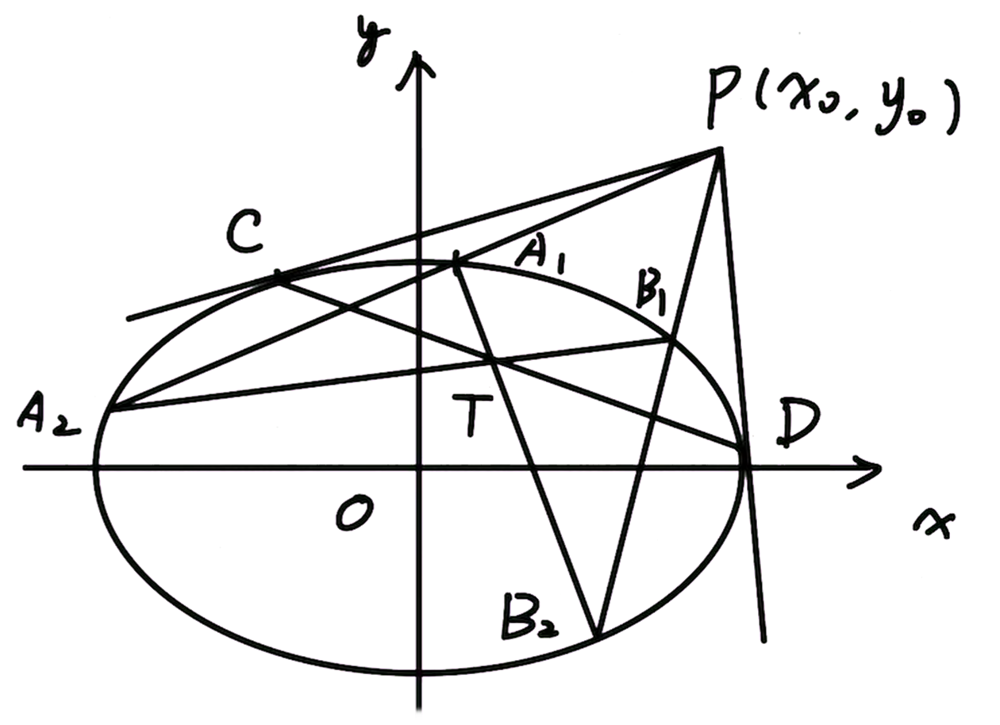{ width="50%" }

我们发现 $A_2B_1,A_1B_2$ 相交于 $T$，且 $T$ 在 $CD$ 上。

特殊的，如果 $P$ 在椭圆的右准线上（左准线类似），容易知道极线方程：

$$
\dfrac{x}{c}+\dfrac{yt}{b^2}=1
$$

一定是过右焦点 $F(c,0)$ 的，且 $PF\perp CD$，弦长公式为：

$$
|CD|=\dfrac{2a(c^2t^2+b^4)}{c^2t^2+a^2b^2}\ge\dfrac{2b^2}{a^2}
$$

互极：设 $ABCD$ 是椭圆

$$
\frac{x^2}{a^2} + \frac{y^2}{b^2} = 1
$$

的内接四边形，对边 $AB$，$CD$ 交于点 $P(x_1, y_1)$，对边 $AD$，$BC$ 交于点$Q(x_2, y_2)$，对角线 $AC$，$BD$ 交于点 $R(x_3, y_3)$，则 $P,Q,R$ 三点满足：

其中任意两点确定的直线，恰为以第三点为极点关于椭圆的极线。即：对任意 $i, j = 1,2,3, i \ne j$，我们有

$$
\frac{x_i x_j}{a^2} + \frac{y_i y_j}{b^2} = 1
$$

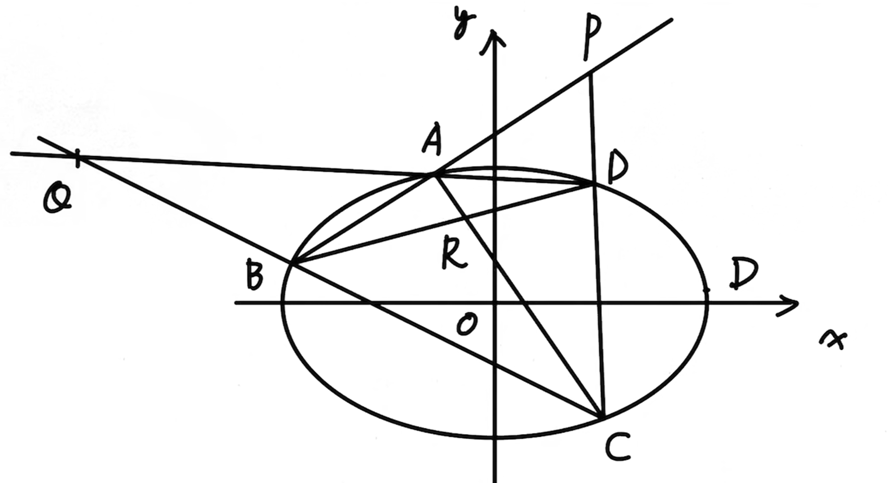{ width="60%" }

如图 9-12 所示，已知 $P(x_P, y_P)$ 和圆 $x^2 + y^2 = 1$，过点 $P$ 任作一割线交圆于 $A,B$ 两点，交 $\ell : x_Px + y_Py = 1$ 于点 $Q$，则

$$
\begin{aligned}
\dfrac{PA}{PB} = \dfrac{QA}{QB}\\
\dfrac{2}{PQ} = \dfrac{1}{PA} + \dfrac{1}{PB}
\end{aligned}
$$

同时，点 $P$ 关于圆 $x^2 + y^2 = 1$ 的极线经过点 $Q$ 当且仅当点 $Q$ 关于圆 $x^2 + y^2 = 1$ 的极线经过点 $P$。

如图 9-13 所示，特别地，若 $PQ$ 经过圆心并交圆于 $R$，则有 $|OR|^2 = |OP|\cdot|OQ|$。反之，若 $|OR|^2 = |OP|\cdot|OQ|$，则 $Q$ 落在点 $P$ 的极线 $x_Px + y_Py = 1$ 上。

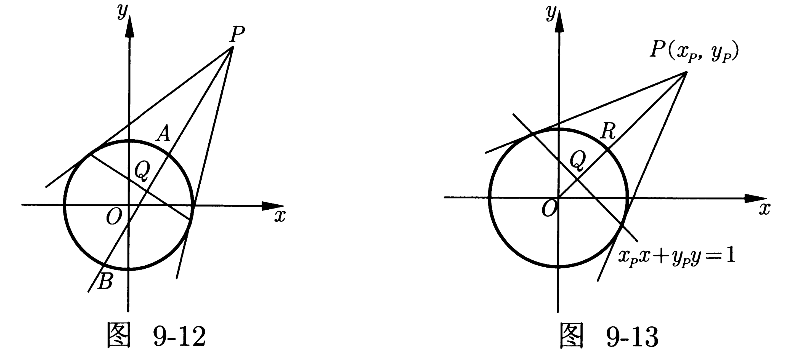{ width="80%" }

对于一般的圆锥曲线，将切线方程直接搬过来，就是极线方程，也有上面的两条性质。

### 等角共轭

椭圆的等角共轭：过椭圆外一点 $P$ 做切线 $PX,PY$，切点为 $X,Y$。连接 $PF_1,PF_2$，则 $\angle XPF_1=\angle YPF_2$。

{ width="50%" }

我们将 $F_1,F_2$ 分别关于 $PX,PY$ 对称，得到 $F_1',F_2'$，根据初中几何容易知道，$\triangle PF_1'F_2\cong\triangle PF_1F_2'$，两顶角减去公共部分 $\angle F_1PF_2$，即可得到。

根据已经证明的全等，因此 $\angle PF_1X = \angle PF_1'F_2 = \angle PF_1F_2' = \angle PF_1Y$，也就是说对于曲线外一点 $P$ 与焦点的连线一定平分两个切点与这个焦点所构成的角。

双曲线有着类似的性质，但是需要注意切点是否位于同一分支上。

{ width="40%" }

此时有 $\angle F_1PX = \pi - \angle F_2PY$。

### 蒙日圆

蒙日圆：若过椭圆外一点 $P$ 做椭圆的两条切线相互垂直，则 $P$ 的轨迹为一个圆，轨迹方程为

$$
x^2+y^2=a^2+b^2
$$

证明：不妨做 $F_1$ 关于 $PX$ 的对称点 $F_1'$，不难得到 $\angle F_1'PF_2=\angle XPY=90^\circ$，

{ width="40%" }

又因为 $PF_1'=PF_1$，也就是说只需要令

$$
PF_1^2+PF_2^2=F_1F_2^2
$$

即可，我们设 $P(x,y)$，而 $F_1F_2=2a$，带入得

$$
(x+c)^2+y^2+(x-c)^2+y^2=4a^2
$$

整理即可得到上面的轨迹方程。

对双曲线而言，这样的圆并不总存在。当双曲线的两条渐近线所成角为锐角时，该圆的半径为虚数；若两条渐近线互相垂直，则该圆退化为双曲线的中心这一点。

还有一些奇怪的结论。

- 过点 $P$ 作圆锥曲线的两条切线，若两切线的斜率之积为定值，则点 $P$ 的轨迹为某一圆锥曲线。

- 将一根绳子套在椭圆 $\alpha$ 上，并用铅笔把绳子绷紧。若使铅笔绕着椭圆转动，则它将描出另一条与 $\alpha$ 同焦的椭圆。

- 一条椭圆内接于一个凸四边形，且它的两个焦点分别落在该四边形的两条（不同的）对角线上，则该四边形两对对边长度的乘积相等。

## 双曲线

### 第一定义

到两定点 $F_1,F_2$ 距离之差的绝对值为常数（小于 $|F_1F_2|$）的点的轨迹称为双曲线。

与椭圆类似，我们设左焦点 $F_1=(-c,0)$ 和右焦点 $F_2=(c,0)$，距离之差为 $2a$，其中 $c>a>0$，有双曲线的一般方程

$$
\dfrac{x^2}{a^2}-\dfrac{y^2}{c^2-a^2}=1
$$

同样，令 $b=\sqrt{c^2-a^2}$ 即 $c^2=a^2+b^2$。

$$
\dfrac{x^2}{a^2}-\dfrac{y^2}{b^2}=1
$$

### 第二定义

到一定点 $F_1$ 的距离与到一定直线的距离之比为定值（大于 $1$）的点所形成的轨迹称为双曲线。该定直线称为准线。

与抛物线一样，我们可以得到

$$
\sqrt{(x-c)^2+y^2}=\dfrac{c}{a}\vert{x-\dfrac{a^2}{c}}
$$

但是此时 $\dfrac{c}{a}$ 应当是大于 $1$ 的，同理

$$
\sqrt{(x+c)^2+y^2}=\dfrac{c}{a}\vert{x+\dfrac{a^2}{c}}
$$

前者是右焦点与右准线，后者是左焦点与左准线，准线方程依旧是

$$
x=\pm\dfrac{a^2}{c}
$$

比值就是 $\dfrac{c}{a}$，这称为离心率，定义为

$$
e=\dfrac{c}{a}=\sqrt{1+\dfrac{b^2}{a^2}}>1
$$

离心率越大，双曲线的开口越大。

### 焦点三角形

此处写一点双曲线的焦点三角形相关内容，尽管下面的焦点三角形中已经有很多结论，但是大部分还是针对椭圆的，为了不引起歧义或混乱，一些东西在这里列举。

双曲线左右焦点为 $F_1,F_2$，双曲线上一点 $P$ 的焦点弦：

$$
|PF_1|=|a+ex_0|
$$

$$
|PF_2|=|a-ex_0|
$$

注意这里要有绝对值符号，里面的式子正负取决于是否在同一侧，因为绝对值的存在，这不影响最终结果。

不妨设 $\angle PF_1F_2=\theta$，不妨假设 $P$ 在左支（在 $F_1$ 一侧），这条直线交另一支于点 $Q$，则：

$$
|PF_1|=\dfrac{ep}{e\cos\theta+1}=\dfrac{a(e^2-1)}{e\cos\theta+1}
$$

$$
|QF_1|=\dfrac{ep}{e\cos\theta-1}=\dfrac{a(e^2-1)}{e\cos\theta-1}
$$

双曲线的第三定义的主要区别在于，在椭圆的公式中去掉负号即可。

- $M,N$ 是双曲线 $C:\dfrac{x^2}{A^2}-\dfrac{y^2}{B^2}=\pm1$ 上的两点，则 $P$ 是 $MN$ 的中点，等价于

    $$
    k_{MN} \cdot k_{OP} = \dfrac{B^2}{A^2}
    $$

- 已知直线 $y=kx+m$ 与双曲线 $C: \dfrac{x^2}{A^2} - \dfrac{y^2}{B^2} = 1$ 的渐近线交于 $M, N$ 两点，则 $P$ 是 $MN$ 的中点，等价于

    $$
    k_{MN} \cdot k_{OP} = \dfrac{B^2}{A^2}
    $$

    令 $M(x_1, y_1), N(x_2, y_2)$，点 $M, N$ 在渐近线上，可得

    $$
    \begin{cases}
    \dfrac{x_2^2}{a^2} - \dfrac{y_2^2}{b^2} = 0 \\
    \dfrac{x_1^2}{a^2} - \dfrac{y_1^2}{b^2} = 0
    \end{cases}
    \implies \dfrac{y_2^2 - y_1^2}{x_2^2 - x_1^2} = \dfrac{b^2}{a^2} \implies \dfrac{y_2 - y_1}{x_2 - x_1} \cdot \dfrac{y_2 + y_1}{x_2 + x_1} = \dfrac{b^2}{a^2}
    $$

    由此可知 $k_{OP} \cdot k_{MN} = \dfrac{b^2}{a^2}$。

### 特征三角形

做焦点到渐近线的垂线，焦点、垂足、圆心所构成的三角形即为双曲线的特征三角形。

{ width="60%" }

设焦点 $F(c,0)$，在渐近线 $bx=ay$ 上的垂足为 $P$，坐标原点为 $O$，则

$$
|FP|=\dfrac{bc}{\sqrt{a^2+b^2}}=b
$$

根据勾股定理，$|OP|=a$，这就是双曲线的特征三角形。

与之类似的，我们还可以从双曲线上任意一点向两条渐近线引垂线，如图

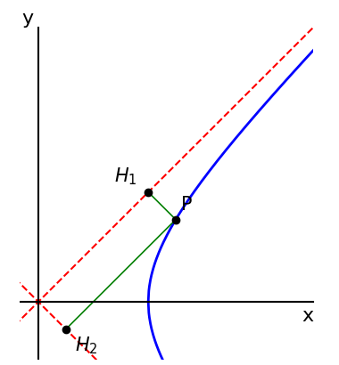{ width="40%" }

则有

$$
|PH_1|\cdot|PH_2|=\dfrac{a^2b^2}{a^2+b^2}
$$

可以直接设出 $P$ 点坐标，带入化简即可。

### 特殊双曲线

一些特殊的双曲线：

- 等轴双曲线（直角双曲线）：渐近线相互垂直 $a=b$ 的双曲线，离心率 $e=\sqrt2$。

- 共轭双曲线：两条虚实轴互换的双曲线，共用两条渐近线，四焦点共圆。

根据我们在一般方程中的描述，很容易发现以下的函数也都是双曲线：

$$
y=\dfrac{1}{x}
$$

$$
y=x+\dfrac{1}{x}
$$

$$
y=x-\dfrac{1}{x}
$$

其实大胆猜测，“形状像”双曲线的，可以化为二元二次实方程的，都是双曲线。

### 几何性质

我们知道

$$
x^2=a^2\paren{1+\dfrac{y^2}{b^2}}
$$

因此

$$
|x|\ge a
$$

即 $x\ge a$ 或 $x\le-a$，而 $y$ 为实数。

双曲线有两个顶点，左顶点 $A_1=(-a,0)$ 和右顶点 $A_2=(a,0)$，线段 $A_1A_2$ 称为实轴，$a$ 称为实半轴长。

另外，设 $B_1=(0,b)$ 和 $B_2=(0,-b)$，则 $B_1B_2$ 称为虚轴，这个轴本身没有太多意义。

特别的，如果 $a=b$，则这个双曲线称为等轴双曲线。

双曲线有对称轴为坐标轴，对称中心为坐标原点。

双曲线有两条渐近线

$$
y=\pm\dfrac{b}{a}x
$$

也就是

$$
\dfrac{y}{b}\pm\dfrac{x}{a}=0
$$

或者可以记为

$$
\dfrac{x^2}{a^2}-\dfrac{y^2}{b^2}=0
$$

### 双曲函数

双曲函数因为其性质极其类似三角函数，因此也称为双曲三角函数。

我们知道三角函数 $\sin\theta,\cos\theta$ 是在单位圆上引入一条倾角为 $\theta$ 的直线，与单位圆相交的点的坐标即为 $(\cos\theta,\sin\theta)$，类似的我们推出双曲函数的最初定义：倾角为 $\theta$ 的直线与双曲线 $x^2-y^2=1$ 交于点 $(\cosh\theta,\sinh\theta)$。

$$
\sinh x=\dfrac{e^x-e^{-x}}{2}
$$

$$
\cosh x=\dfrac{e^x+e^{-x}}{2}
$$

$$
\tanh x=\dfrac{\sinh x}{\cosh x}=\dfrac{e^x-e^{-x}}{e^x+e^{-x}}
$$

其图像如图

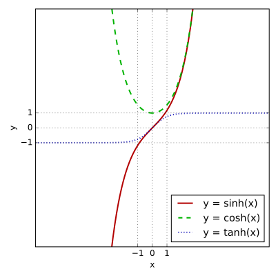{ width="60%" }

我们在复数部分推导了欧拉公式，因此不难知道

$$
\begin{cases}
\cos x&=\cosh(ix)\\
\sin x&=-i\sinh(ix)
\end{cases}
$$

我们利用这个可以从三角函数的几乎所有公式迁移到双曲函数。

/// details | 一些公式

$$
\cosh^2x-\sinh^2x=1
$$

$$
\sinh(x\pm y)=\sinh x\cosh y\pm \cosh x\sinh y
$$

$$
\cosh(x\pm y)=\cosh x\cosh y\pm\sinh x\sinh y
$$

$$
\tanh (x\pm y)=\frac{\tanh x\pm \tanh y}{1\pm \tanh x\tanh y}
$$

$$
\sinh 2x=2\sinh x\cosh x
$$

$$
\cosh 2x=\cosh^2x+\sinh^2x
$$

$$
\tanh 2x=\frac{2\tanh x}{1+\tanh^2x}
$$

$$
(\sinh x)'=\cosh x
$$

$$
(\cosh x)'=\sinh x
$$

///

## 焦点三角形

焦点三角形，即为圆锥曲线上一点或两点，与两个或一个焦点为顶点，所构成的三角形（或者退化的三角形），其在椭圆中表现的尤为重要，更多是因为双曲线的焦点三角形情况复杂、出题较少，且抛物线更常用到的模型是特征矩形而不是焦点三角形。

### 离心率

离心率问题是初学阶段最重要的一类题目，难度相对较低但是适合练手，对于离心率问题，常见的几种方法有：

1. 带入点或者根据定义直接求 $a,b,c$ 的值或其比例。

2. 构造关于 $a,b,c$ 的齐次方程，全部化为 $a,c$ 的齐次方程后同除 $a^2$ 得到关于 $e$ 的一元方程。

3. 在特征三角形中解决，或者在一般的焦点三角形中，利用余弦定理等解三角形方式解决，设椭圆上一点 $P$、左右焦点 $F_1,F_2$ 构成三角形，设 $\theta=\angle F_1PF_2$，$\alpha=\angle PF_1F_2$，$\beta=\angle PF_2F_1$。

    不妨列出正弦定理：

    $$
    \dfrac{|PF_1|}{\sin\beta}=\dfrac{|PF_2|}{\sin\alpha}=\dfrac{|F_1F_2|}{\sin\theta}
    $$

    根据合比定理：

    $$
    \dfrac{|PF_1|+|PF_2|}{\sin\alpha+\sin\beta}=\dfrac{|F_1F_2|}{\sin\theta}
    $$

    注意到前者分子为 $2a$，后者分子为 $2c$，则

    $$
    e=\dfrac{2c}{2a}=\dfrac{\sin\theta}{\sin\alpha+\sin\beta}=\dfrac{\sin(\alpha+\beta)}{\sin\alpha\sin\beta}
    $$

    这类问题中要活用几何问题代数化，先思考然后才能简便的计算。

对于离心率的极值问题，我们通常取顶点作为特殊点（顶角的最大角），根据三角函数的单调性、配合离心率与开口大小的关系解决。

### 长度问题

椭圆左右焦点分别为 $F_1,F_2$，则椭圆上一点 $P(x_0,y_0)$，则：

$$
|PF_1|=a+\dfrac{c}{a}x_0=a+ex_0
$$

$$
|PF_2|=a-\dfrac{c}{a}x_0=a-ex_0
$$

据此，我们发现：

$$
b^2-c^2\le\vecc{PF_1}\cdot\vecc{PF_2}\le b^2
$$

$$
a^2\le|PF_1|\cdot|PF_2|=a^2-e^2x_0^2\le b^2
$$

而根据极化恒等式 $\vecc{PF_1}\cdot\vecc{PF_2}=|PO|^2-c^2$，得出：

$$
b\le|PO|\le a
$$

双曲线中的一类特殊的长度问题：过一个焦点的直线，已知与双曲线交出的弦的长度 $k$，求可能的直线条数。分类讨论直线与双曲线交于一支还是两支，容易发现如果小于 $k$ 通经 $2b^2/a$，则直线不存在；如果大于实轴长 $2a$，则一定存在四条直线；在中间分界即可。

用参数方程表示直线：当我们考虑的式子是形如 $|PA|,|PB|$ 的关系，不妨考虑以 $P(x_0,y_0)$ 为极点建立极坐标系（形式上用参数方程），然后表示 $AB$（倾斜角为 $\theta$）的方程即为

$$
\begin{cases}
x&=x_0+\rho\cos\theta\\
y&=y_0+\rho\sin\theta
\end{cases}
$$

这样 $\rho$ 就表示一个点到 $P$ 的距离，将其带入圆锥曲线，利用韦达定理可以快速得到 $|PA|,|PB|$ 的关系。

### 角度问题

在上一节中，我们推导了关于 $P$ 点坐标的焦半径公式，那如果不知道坐标呢？此时我们将 $P$ 字母换为 $A$ 字母，反向延长 $F_1A$ 交椭圆于点 $B$，设 $\theta=\angle F_1AF_2$ 那么就有焦半径公式点角度形式：

$$
|AF_1|=\dfrac{ep}{1-e\cos\theta}=\dfrac{a(1-e^2)}{1-e\cos\theta}=\dfrac{b^2/a}{1-e\cos\theta}
$$

$$
|AF_2|=\dfrac{ep}{1+e\cos\theta}=\dfrac{a(1-e^2)}{1+e\cos\theta}=\dfrac{b^2/a}{1+e\cos\theta}
$$

这两个东西即为椭圆的极坐标表示，即以左焦点为极点、长轴正方形为极轴，则

$$
\rho=\dfrac{a(1-e^2)}{1-e\cos\theta}
$$

我们不妨推导一些更有意思的东西：

$$
\dfrac{1}{|AF_1|}+\dfrac{1}{AF_2}=\dfrac{2}{ep}=\dfrac{2}{a(1-e^2)}=\dfrac{2a}{b^2}
$$

$$
|AB|=|AF_1|+|AF_2|=\dfrac{2b^2/a}{1-e^2\cos^2\theta}\ge\dfrac{2b^2}{a}
$$

这个最小值即为椭圆的通经，即过焦点垂直于轴的直线交椭圆的弦。

在圆锥曲线的选择与填空题中，若有中点这样的信息出现，就要联想到原点并连接原点与该点，构造中位线。因为原点是椭圆和双曲线的中心，是两焦点的天然中点。

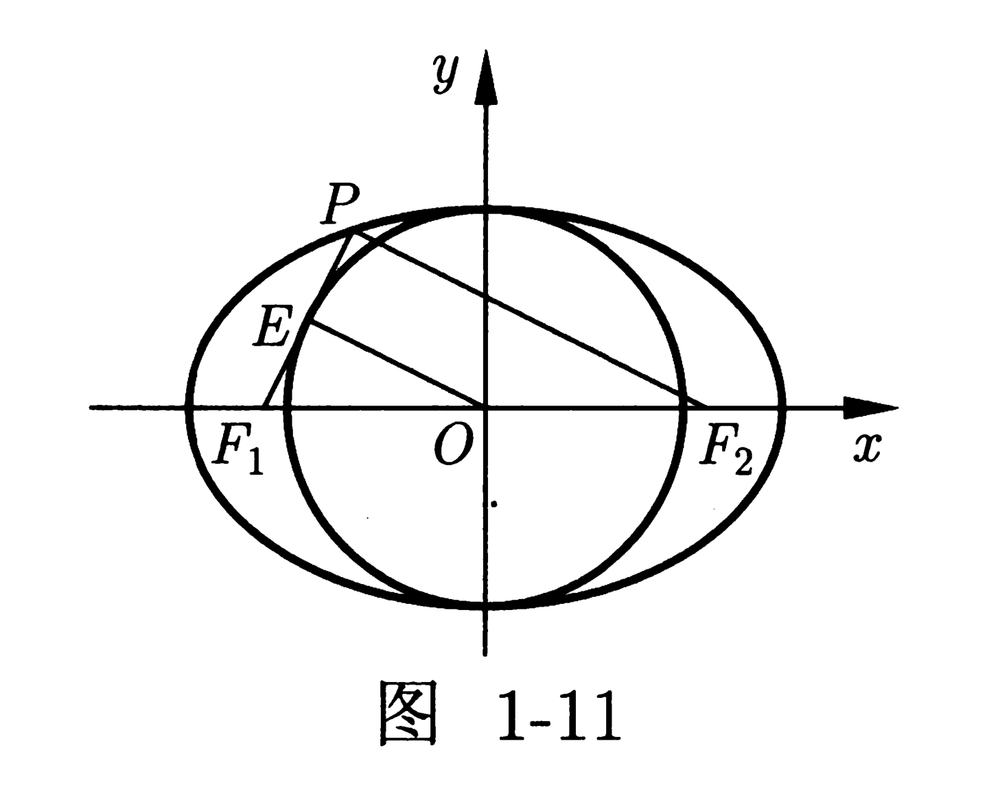{ width="40%" }

通经公式可以作如下推广：过焦点 $F$ 作 $n$ 条夹角相等的射线交椭圆于 $P_1, P_2, \cdots, P_n$，则

$$
\frac{1}{|FP_1|} + \frac{1}{|FP_2|} + \cdots + \frac{1}{|FP_n|} = \frac{na}{b^2}
$$

焦比定理（简化形式）指出，若 $|AF_1|=\lambda|BF_1|$，我们列出：

$$
\dfrac{1}{1-e\cos\theta}=\dfrac{\lambda}{1+e\cos\theta}
$$

那么，

$$
e|\cos\theta|=\dfrac{\lambda-1}{\lambda+1}
$$

这个在一些小题可能有快速解题的作用。

### 固定关系

焦点三角形的**周长**与圆锥曲线的定义之间存在着紧密联系。

- 已知 $F_1, F_2$ 分别为椭圆 $\dfrac{x^2}{a^2} + \dfrac{y^2}{b^2} = 1(a > b > 0)$ 的左、右焦点，$l$ 过焦点 $F_1$ 且与椭圆交于 $A, B$ 两点，则 $\triangle F_2AB$ 的周长恒为定值 $4a$；

- 已知 $F_1, F_2$ 分别为椭圆 $\dfrac{x^2}{a^2} + \dfrac{y^2}{b^2} = 1(a > b > 0)$ 的左、右焦点，$P$ 是椭圆上的动点，则 $\triangle PF_1F_2$ 的周长恒为定值 $2a + 2c$。

    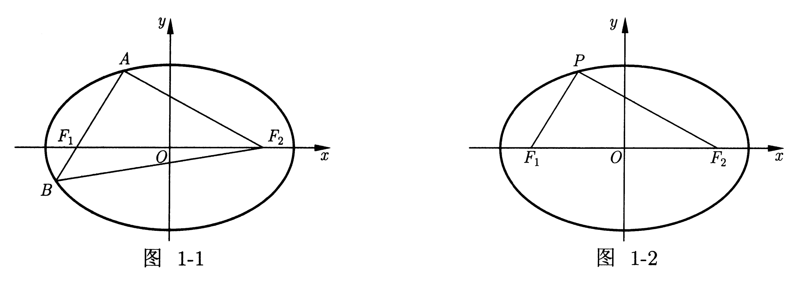

- 已知 $F_1, F_2$ 分别是双曲线 $\dfrac{x^2}{a^2} - \dfrac{y^2}{b^2} = 1(a > 0, b > 0)$ 的左、右焦点，$l$ 过焦点 $F_1$ 且与双曲线交于 $A, B$ 两点，则 $|AF_2| + |BF_2| - |AB| = 4a$。

    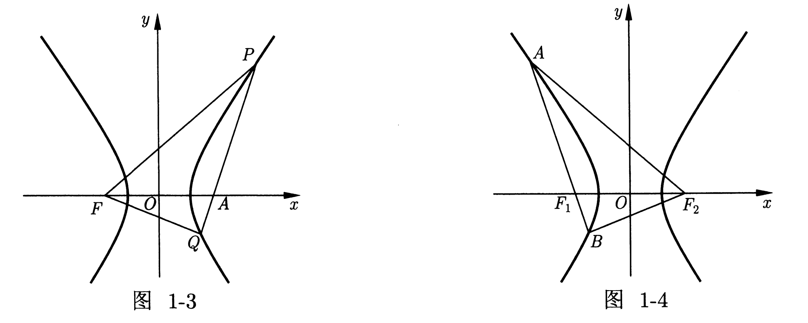

面积则与顶角有联系，根据余弦定理等可以推导：

- 已知 $F_1, F_2$ 为椭圆 $\dfrac{x^2}{a^2} + \dfrac{y^2}{b^2} = 1(a > b > 0)$ 的两个焦点，$M$ 是椭圆上的动点，则 $\triangle MF_1F_2$ 的面积 $S = c|y_M| = b^2 \tan\dfrac{\angle F_1MF_2}{2}$。

    /// details | 证明
    不妨令 $\theta=\angle F_1MF_2$，$r_1=MF_1,r_2=MF_2$，根据余弦定理

    $$
    \cos\theta=\dfrac{r_1^2+r_2^2-4c^2}{2r_1r_2}=\dfrac{(r_1+r_2)^2-2r_1r_2-4c^2}{2r_1r_2}=\dfrac{2b^2}{r_1r_2}-1
    $$

    因此：

    $$
    r_1r_2=\dfrac{2b^2}{\cos\theta+1}\le a^2
    $$

    带入三角形面积公式：

    $$
    S=\dfrac12r_1r_2\sin\theta=b^2\dfrac{\sin\theta}{\cos\theta+1}=b^2\tan\dfrac{\theta}2
    $$
    ///

- 已知 $F_1, F_2$ 为双曲线 $\dfrac{x^2}{a^2} - \dfrac{y^2}{b^2} = 1(a > 0, b > 0)$ 的两个焦点，$M$ 是双曲线上的动点，则 $\triangle MF_1F_2$ 的面积 $S = c|y_M| = b^2\cot\dfrac{\angle F_1MF_2}{2}$。

内切圆即角平分线与面积也有着很大的关联：

- $P$ 是椭圆 $\dfrac{x^2}{a^2} + \dfrac{y^2}{b^2} = 1(a > b > 0)$ 上的动点，$\triangle PF_1F_2$ 的内切圆为圆 $I$，半径为 $r$，则 $S_{\triangle PF_1F_2} = r(a+c)$。

- 设椭圆 $\dfrac{x^2}{a^2} + \dfrac{y^2}{b^2} = 1(a > b > 0)$ 的左、右焦点分别为 $F_1, F_2$，过焦点 $F_1$ 的直线交椭圆于 $A, B$ 两点，$\triangle AF_2B$ 的内切圆为圆 $I$，半径为 $r$，则 $S_{\triangle AF_2B} = 2ar$。

    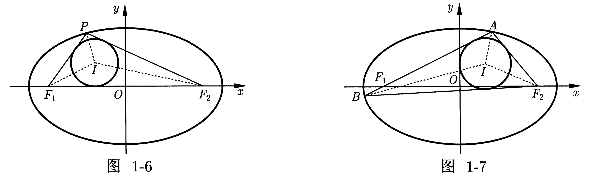

- 已知 $P$ 是双曲线 $\dfrac{x^2}{a^2} - \dfrac{y^2}{b^2} = 1(a > 0, b > 0)$ 上的动点，$\triangle PF_1F_2$ 的内切圆的圆心为 $I(x_0, y_0)$，则 $|S_{\triangle PIF_1} - S_{\triangle PIF_2}| = \dfrac{S_{\triangle F_1IF_2}}{e}$，$|x_0| = a$。

    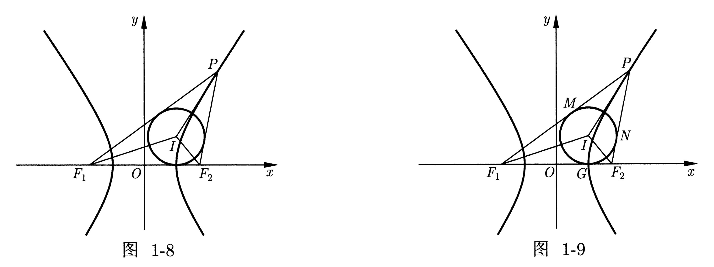

### 转换关系

转换问题，通常也是隐焦点问题，通常只给出一个焦点，我们需要作出另一个焦点，来构造三角形、平行四边形等。

- 我们注意到，如果 $P$ 在椭圆上，那么 $PF_2=2a-PF_1$，这暗示我们可以对 $PF_1$ 与令一点 $A$ 应用两边之和大于第三边的同时，对 $PF_2=2a-PF_1$ 应用两边之差小于第三边，同样可以得到求和的形式。

- 设 $A$ 为椭圆上的动点，且 $F$ 为椭圆的一个焦点，P为不在椭圆上的一定点，则 $|PA|+|PF|$ 的最值的求法是先利用三角不等式，判断等号成立的条件是否成立？若不成立，则利用另外一个焦点进行转化。

设椭圆方程为 $\dfrac{x^2}{a^2} + \dfrac{y^2}{b^2} = 1(a > b > 0)$，$F_1, F_2$ 分别为椭圆的左、右焦点，平面上一定点 $Q(x_0, y_0)$，$M$ 为椭圆上任意一点。

- 定点 $Q(x_0, y_0)$ 在椭圆内部，则 $2a - |QF_1| \le |MF_2| + |MQ| \le 2a + |QF_1|$；
- 定点 $Q(x_0, y_0)$ 在椭圆外部，则 $|QF_2| \le |MF_2| + |MQ| \le 2a + |QF_1|$。

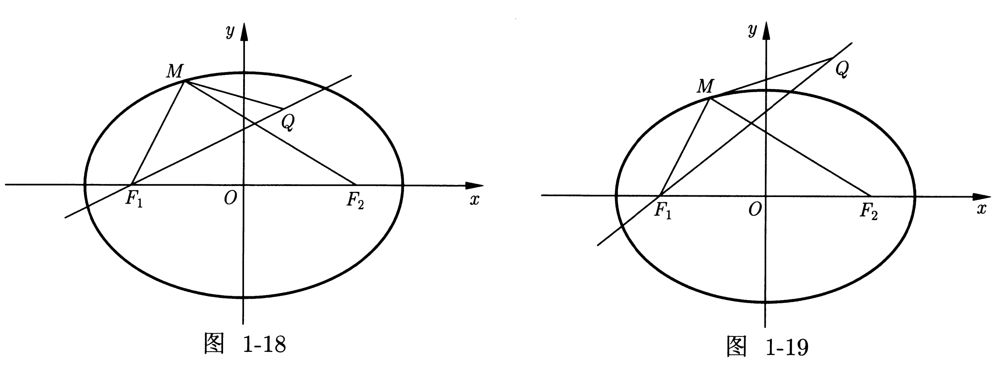

设双曲线方程为 $\dfrac{x^2}{a^2} - \dfrac{y^2}{b^2} = 1(a > 0, b > 0)$，$F_1, F_2$ 分别为双曲线的左、右焦点，平面上一定点 $Q(x_0, y_0)$，$M$ 为双曲线右支上任意一点。

- 若定点 $Q(x_0, y_0)$ 与双曲线右焦点 $F_2$ 在双曲线右支的同侧，则 $|MQ| + |MF_2|$ 的最小值是 $|QF_1| - 2a$，最大值不存在；
- 若定点 $Q(x_0, y_0)$ 与双曲线右焦点 $F_2$ 在双曲线右支的异侧，则 $|MQ| + |MF_2|$ 的最小值是 $|QF_2|$，最大值不存在。

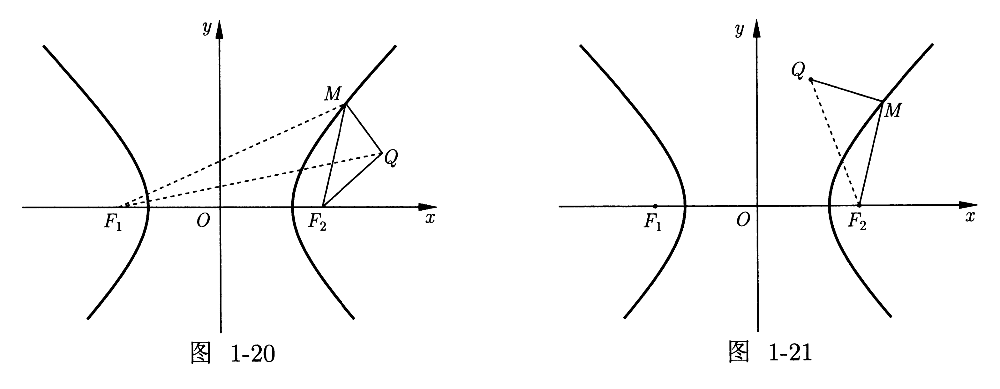

- 不仅第一定义，我们也可以利用第二定义进行转化，把距离焦点的距离转化为距离准线的距离乘上离心率 $e$。

- 设 $A$ 为抛物线上的动点，且 $F$ 为焦点，$P$ 为不在抛物线上的一定点，则 $|PA| + |PF|$ 的最值的求法是先利用三角不等式，判断等号成立的条件是否成立。若不成立，则利用准线进行转化。

### 共焦点型

共焦点的关键在于两个：$c$ 相等与定义，在设共焦点圆锥曲线的时候，可以关注 $a^2,b^2$ 的和或者差的关系，用一个变量 $\lambda$ 串联两个圆锥曲线。

例如椭圆 $a_1,b_1,c$ 和双曲线 $a_2,b_2,c$ 共焦点 $F_1,F_2$，且一交点为 $P$ 不难写出

$$
\begin{cases}
PF_1+PF_2&=2a_1\\
PF_1-PF_2&=2a_2
\end{cases}
$$

也就是说

$$
\begin{cases}
PF_1&=a_1+a_2\\
PF_2&=a_1-a_2
\end{cases}
$$

已知 $F_1, F_2$ 是椭圆 $C_1$ 与双曲线 $C_2$ 的公共焦点，$e_1, e_2$ 分别是 $C_1, C_2$ 的离心率。若点 $P$ 为 $C_1, C_2$ 的公共点，$\angle F_1PF_2 = 2\theta$，则 $\dfrac{\sin^2\theta}{e_1^2} + \dfrac{\cos^2\theta}{e_2^2} = 1$。

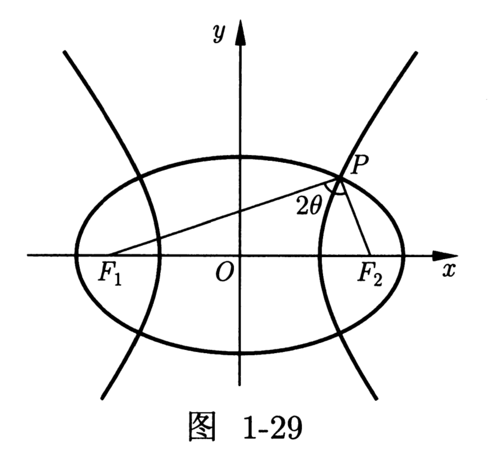{ width="40%" }

在这个图中，据余弦定理还可以推导：

$$
S_{\triangle PF_1F_2}=b_1b_2=\sqrt{(a_1^2-c^2)(c^2-a_2^2)}
$$

### 最值问题

距离最值：

- 将直线 $\ell$ 平移到与曲线相切的位置，得到曲线的一条与直线 $\ell$ 平行的切线 $\ell'$，此时直线 $\ell$ 与 $\ell'$ 之间的距离即为曲线与 $\ell$ 距离的最值。

    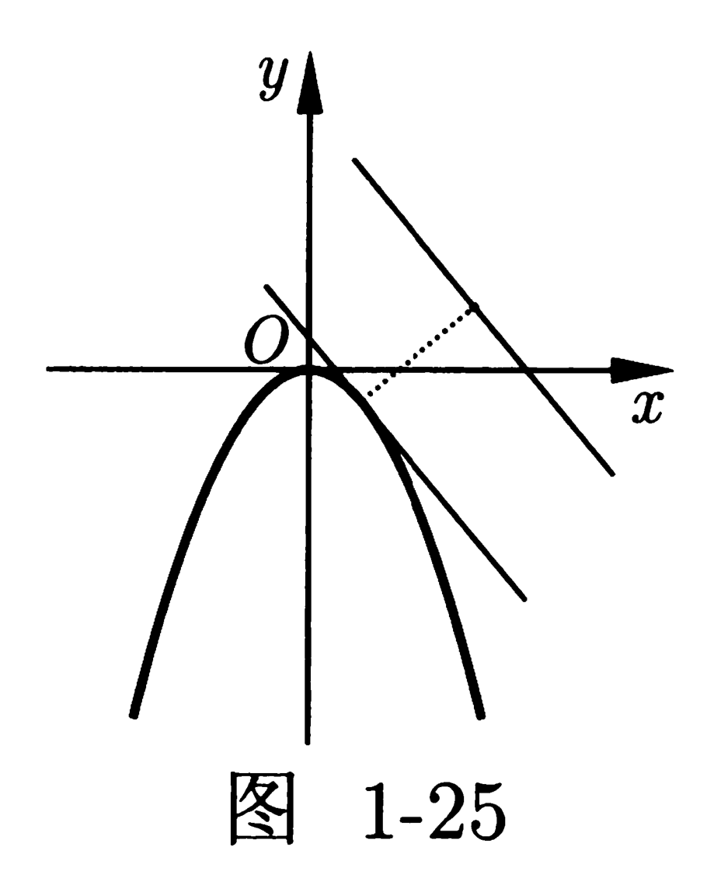{ width="30%" }

- 椭圆内或外一点到椭圆上一定点的最短距离，我们称所有可能是最近点的点为可能点的点集，而最短距离就是这些点集中的点到定点的距离的最小值。

    理论上，只要这个点集包含了椭圆上所有的点，我们就一定可以找到最小值，但是实际上我们不可能这么做。于是，我们得出几个程序化的方案，将点集缩小到可以手工计算。第一，椭圆的顶点一定是点集内的点。如果图形特征已知，我们也可以只找一两个顶点，取验证其对最小值的贡献即可。

    第二，我们不妨提出法线对齐的概念：当动点 $M$ 在椭圆上运动到某点 $M_0$ 时，如果连接定点 $P$ 与 $M_0$ 的线段 $PM_0$ 恰好是椭圆在 $M_0$ 点的法线，那么 $|PM_0|$ 就是一个极值距离（极大值或极小值）。

    将法线方程与椭圆方程联立（同时还需要考虑斜率不存在的情况），解这个方程组，得到所有满足法线对齐条件的候选点 $M_i(x_i, y_i)$ 的坐标。这通常会转化为一个关于 $x$ 或 $y$ 的四次方程，可能有 $0, 2, 4$ 个实数解。只需验证这些点（顶点和极值点），即可得到最小距离。

长度最值：

- $F$ 为椭圆 $\dfrac{x^2}{a^2} + \dfrac{y^2}{b^2} = 1(a > b > 0)$ 的一个焦点，若 P 是椭圆上的点，则 $a - c \le |PF| \le a + c$。

- $F$ 为双曲线 $\dfrac{x^2}{a^2} - \dfrac{y^2}{b^2} = 1(a > 0, b > 0)$ 的右焦点，若 P 是双曲线右支上的动点，则 $|PF| \ge c - a$。若 P 是双曲线左支上的动点，则 $|PF| \ge c + a$。

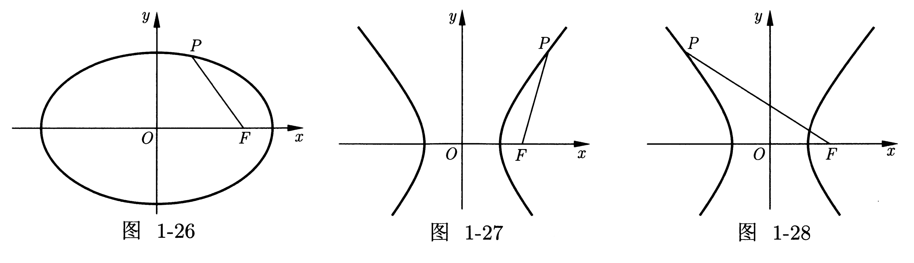

角度最值：

- $F_1, F_2$ 为椭圆 $\dfrac{x^2}{a^2} + \dfrac{y^2}{b^2} = 1(a > b > 0)$ 的左、右焦点，$P$ 是椭圆上的动点，当且仅当 $P$ 为上、下顶点时，$\angle F_1PF_2$ 最大。

- $A, B$ 为椭圆 $\dfrac{x^2}{a^2} + \dfrac{y^2}{b^2} = 1(a > b > 0)$ 的左、右顶点，$P$ 是椭圆上的动点，当且仅当 $P$ 为上、下顶点时，$\angle APB$ 最大。

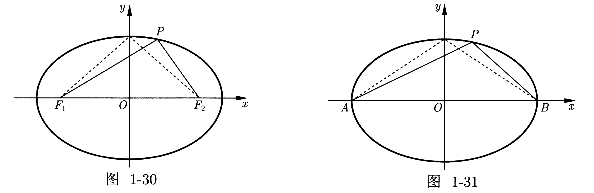

对于讨论垂直关系，更常用向量和斜率，或者勾股定理、射影定理等。

### 光学性质

费马原理：当一束光经过镜子的反射，那么入射角等于出射角，可以证明，这个路径是最短的。

/// details | 证明
设光线从 $F_1$ 经过直线 $\ell$ 的反射到达 $F_2$ 点，我们将 $F_1$ 关于 $\ell$ 对称的点设为 $F_1'$

{ width="40%" }

则 $P$ 点位于 $F_1'F_2$ 与 $\ell$ 的交点上，这就是将军饮马模型，也容易证明，入射角和出射角是相等的。
///

椭圆的光学性质：从一个焦点发出的光线，经过椭圆的反射后一定经过另一个焦点。

/// details | 证明
如图，容易知道，我们只需要证明 $\angle DAF_1=\angle DAF_2$ 即可，

{ width="60%" }

根据角平分线逆定理，只需要证

$$
\dfrac{AF_1}{AF_2}=\dfrac{MF_1}{MF_2}
$$

但是这比较复杂，我们发现费马定理可以非常容易的解决这个问题。

{ width="40%" }

不妨设 $X$ 是 $\ell$ 上任意一点，则根据 $P$ 在椭圆上、$X$ 在椭圆外，

$$
XF_1+XF_2\ge PF_1+PF_2
$$

取等当且仅当 $P=X$，因此 $P$ 就是费马定理的点，符合入射角等于出射角。
///

抛物线的光学性质：从焦点发出的光线，经过抛物线的反射后，一定平行于抛物线的轴。

/// details | 证明
假设 $P$ 为抛物线上一点，做到准线的垂线，垂足为 $P'$，如图

{ width="40%" }

我们不妨证明锅 $P$ 点的切线 $\ell$ 恰好平分 $\angle FPP'$。

不妨假设角平分线 $\ell'$ 与抛物线相交与 $P,Q$ 两点，做 $QQ'$ 垂直于准线。根据抛物线的定义，有 $FP=PP'$，因此也有 $QF=QP'$，又因为 $FQ=QQ'$，因此 $P=Q$，即 $\ell=\ell'$，证毕。

我们也可以证明角相等，

{ width="60%" }

不难得到，只需要证 $\angle FPQ=\angle FQP$ 即可。

不妨证明 $FP=FQ$，容易想到，列出直线方程直接求解，得到点的坐标即可。
///

双曲线的光学性质：从一个焦点发出的光线，经过双曲线的发射后反向延长经过另一个焦点。

/// details | 证明
与椭圆类似，我们取作差的将军饮马模型，即延长线上的点最小。

与抛物线类似，我们用两边之差小于第三边，也可以证明。
///

椭圆的旁心：在椭圆上任取两点 $P,Q$，做 $F_1PF_2,F_1QF_2$ 的外角角平分线，根据光学性质，也就是说 $PR,QR$ 都是椭圆的切线，交于一点 $R$，连接 $RF_1$，则 $RF_1\perp PQ$。

证明：我们知道 $R$ 是一个旁切圆的圆心，与 $PQ$ 相切与 $F'$（我们要证明它和 $F_1$ 重合），设椭圆与 $F_2P,F_2Q$ 相切于 $X,Y$，则 $F'P+PF_2=XF_2$，$F'Q+QF_2=YF_2$，因为 $RX=RY$ 所以 $XF_2=YF_2$，因此 $F'=F_1$ 即为椭圆焦点。

## 抛物线

### 一般方程

平面内与一个定点 $F$ 和一条定直线 $\ell$（不过 $F$）的距离相等的点的轨迹叫做抛物线。点 $F$ 叫做抛物线的焦点，直线 $\ell$ 叫做抛物线的准线。

.svg>){ width="40%" }

不妨设 $F$ 到准线的距离（焦准距）为 $p$ 且垂足为 $K$，容易知道，抛物线的顶点就是 $FK$ 的中点，即 $F=\paren{\dfrac{p}{2},0},K=\paren{-\dfrac{p}{2},0}$，不难得到抛物线的标准方程为

$$
y^2=2px(p>0)
$$

这个是开口朝向 $x$ 轴正半轴的，同理我们还有另外四个方向。

### 简单性质

对于抛物线

$$
y^2=2px(p>0)
$$

有 $x\ge0$，且关于 $y=0$ 对称，没有对称中心。

容易知道，二次函数

$$
f(x)=a^2+bx+c(a\neq0)
$$

就是一条抛物线且定点为

$$
\paren{-\dfrac{b}{2a},f\paren{-\dfrac{b}{2a}}}
$$

注意：抛物线的离心率恒为 $1$，而焦准距则衡量了开口大小。

### 几何方法

圆锥曲线（通常是抛物线）的弦与过弦的端点的两条切线所围成的三角形，称为**阿基米德三角形**。

如图，过抛物线 $x^2=2py(p>0)$ 外的点 $P$ 作抛物线的两条切线 $PA, PB$，设线段 $AB$ 的中点为 $M$，则 $PM$ 一定平行（或重合）与抛物线的轴，设线段 $PM$ 的中点为 $R$，则 $R$ 一定在抛物线上，且抛物线在 $R$ 处的切线与 $AB$ 平行。

{ width="80%" }

不妨设 $P(x_0,y_0)$，直线 $AB$ 与 $y$ 轴交于点 $Q$，则有：

- $k_{AB} \cdot k_{PQ} = \dfrac{2y_0}{p}$；

- $k_{PA} \cdot k_{PB} = \dfrac{2y_0}{p}$；

假设 $\triangle ABC$ 外切于一条抛物线，即直线 $AB$，$BC$，$CA$ 均与抛物线相切，那么 $\triangle ABC$ 的垂心始终过抛物线的准线。

{ width="40%" }

- 兰伯特定理：由抛物线的三条切线所围成的三角形，其外接圆必经过抛物线的焦点。

- 西姆松定理：点 $P$ 到 $\triangle ABC$ 各边的投影共线，当且仅当 $P$ 位于该三角形的外接圆上。

- 斯坦纳线定理：一个三角形外接圆上任意一点（该点不为三角形顶点）关于三角形三边的对称点，这三个对称点是共线的，并且这条直线（称为斯坦纳线）必经过该三角形的垂心。

下面是关于特征矩形的一些经典问题，选自 Geometry of Conics (Mathematical World VOLUME 26)。

1. 抛物线的焦点关于任意一条切线的对称点一定在准线上。

    证明：做 $PP'\perp\ell$，根据抛物线的性质，$FP=PP'$。
    
    { width="40%" }

    因为 $FP'\perp\ell'$，因此 $\ell'$ 是 $\angle FPP'$ 角平分线，所以，$F$ 关于 $\ell'$ 的反射点即为 $P'$ 在准线上。

    推论：抛物线的焦点到其各条切线的投影点，均位于抛物线顶点处的切线上。

2. 假设抛物线在点 $X$ 和 $Y$ 的切线相交于点 $P$。那么 $PX'=PY'=PF$，其中 $X'$ 和 $Y'$ 是 $X$ 和 $Y$ 在抛物线准线上的投影，而 $F$ 是抛物线的焦点。

    证明：根据上一条，这两条切线分别是线段 $FX'$ 和 $FY'$ 的中垂线。因此，它们的交点即为三角形 $FX'Y'$ 的外接圆圆心。

    { width="90%" }

    推论：如果 $PX$ 和 $PY$ 是抛物线的切线，那么点 $P$ 在准线上的投影，是 $X$ 和 $Y$ 在准线上的投影点所构成线段的中点。

3. 做抛物线上两点 $X,Y$ 的切线，相交于点 $P$，若 $PX\perp PY$，则 $P$ 在抛物线的准线上。反过来，过准线上一点 $P$ 做抛物线的两条切线，则他们相互垂直。同时，$XY$ 一定过焦点 $F$ 且 $PF\perp XY$。

    证明：设 $X',Y'$ 为 $X,Y$ 到准线上的投影，因为 $P$ 在准线上，

    { width="40%" }
    
    那么 $XF=XX',YF=YY'$，因此可以得到两个三角形全等，那么 $\angle XPY=90^\circ$。

4. 我们做推广，两条切线为 $\varphi$ 或 $180^\circ-\varphi$ 的点的集合是一个以 $F$ 焦点，抛物线准线 $\ell$ 为准线的双曲线，其离心率等于 $|\cos\varphi|$。

    { width="40%" }

    注意到 $P$ 为 $\triangle FX'Y'$ 外心，因此 $\angle X'PY'=360^\circ-2\varphi$，那么 $P$ 到准线的距离为 $PF|\cos(180^\circ-\varphi)|=PF|\cos\varphi|$，证毕。

5. 设 $PX$ 和 $PY$ 为过点 $P$ 的抛物线的两条切线，并设 $l$ 为过 $P$ 且平行于抛物线轴的直线。那么直线 $PY$ 与 $l$ 的夹角等于 $\angle XPF$，且 $\triangle XFP\backsim\triangle PFY$。由此可推知，$FP$ 是角 $XFY$ 的角平分线。

    设 $X'$ 和 $Y'$ 是 $X$ 和 $Y$ 在准线上的投影。那么，点 $F$、$X'$ 和 $Y'$位于一个以 $P$ 为圆心的圆上，
    
    { width="40%" }

    因此 $\angle X'Y'F = \dfrac{1}{2}\angle X'PF = \angle XPF$。因为 $\ell$ 垂直于 $X'Y'$，因此 $PY$ 与 $\ell$ 的夹角等于 $Y'F$ 与 $X'Y'$ 的夹角，而 $Y'F$ 垂直于 $PY$。

    由于 $l$ 平行于 $YY'$，$PY$ 与 $l$ 的夹角等于角 $PYY'$，根据光学性质，该角等于角 $FYP$。因此 $\angle FYP = \angle XPF$。类似地，$\angle FXP = \angle YPF$。因此 $\triangle XFP\backsim\triangle PFY$。 

### 特征梯形

过焦点的直线交抛物线与点 $A,B$ 过 $A,B$ 做准线 $\ell$ 的垂线 $AC,BC$，锁围成的直角梯形称为抛物线的特征直角梯形。

如下图，$M$ 点的纵坐标是切点 $A,B$ 的纵坐标之和的一半，也就是说，做 $AB$ 的中点 $M'$，则 $MM'$ 是平行于抛物线的轴（图中为 $x$ 轴）的。

一些结论：

- 对于抛物线 $y^2=2px(p>0)$，任意一条过 $B(-2p,0)$ 的斜率为 $k$ 的割线 $PQ$，则顶点 $O$ 到两交点 $P,Q$ 的距离之积恒等于 $\dfrac{4p^2}{|k|}$。

- 任意焦点弦的两个端点与原点构成的角都是钝角，即过焦点的直线与抛物线交于 $A,B$ 两点，则 $\angle AOB$ 一定是钝角。

## 方程联立

双曲线联立直线，一定要先把一般方程化为整式。

注意直线不一定都可以表示为 $y=kx+b$，平行于 $y$ 轴的斜率不存在。

若直线过曲线的左顶点或者右顶点，我们应该设直线方程为 $x = ty + m$；若直线过曲线的上顶点或者下顶点，我们应该设直线方程为 $y = kx + m$。

若直线过曲线的顶点，一般来说我们都将另—个交点的坐标求出。

### 椭圆联立

椭圆与直线有三种情况，相切、相交、相离

我们设椭圆的一般方程

$$
\dfrac{x^2}{a^2}+\dfrac{y^2}{b^2}=1
$$

不妨先化为整式

$$
b^2x^2+a^2y^2=a^2b^2
$$

设直线方程为 $y=kx+m$，带入

$$
\begin{aligned}
b^2x^2+a^2(kx+m)^2&=a^2b^2\\
b^2x^2+a^2(k^2x^2+m^2+2kmx)&=a^2b^2
\end{aligned}
$$

化简得到

$$
(b^2+a^2k^2)x^2+2kma^2x+a^2m^2-a^2b^2=0
$$

我们知道

$$
\begin{aligned}
\Delta&=4k^2m^2a^4-4a^2(m^2-b^2)(b^2+a^2k^2)\\
&=4a^2[k^2m^2a^2-(m^2-b^2)(b^2+a^2k^2)]\\
&=4a^2b^2(b^2+a^2k^2-m^2)
\end{aligned}
$$

- 相交：$b^2+a^2k^2-m^2\ge0$。
- 相切：$b^2+a^2k^2-m^2=0$。
- 相离：$b^2+a^2k^2-m^2<0$。

如果相交，此时两交点之间的距离有

$$
\begin{aligned}
|AB|&=\sqrt{k^2+1}\cdot|x_a-x_b|\\
&=\sqrt{k^2+1}\cdot\dfrac{2ab\sqrt{b^2+a^2k^2-m^2}}{b^2+a^2k^2}
\end{aligned}
$$

前者为硬解定理，后者为弦长公式。

直线 $\ell:y = kx + m$ 与曲线相交于 $A, B$，若弦长或三角形的面积已知，则斜率 $k$ 与 $m$ 必定满足某一个方程。

### 双曲线联立

根据双曲线的两条渐近线，因此双曲线与直线有也有三种情况，相切、相交、相离

我们设双曲线的一般方程

$$
\dfrac{x^2}{a^2}-\dfrac{y^2}{b^2}=1
$$

不妨先化为整式

$$
b^2x^2-a^2y^2=a^2b^2
$$

设直线方程为 $y=kx+m$，带入

$$
\begin{aligned}
b^2x^2-a^2(kx+m)^2&=a^2b^2\\
b^2x^2-a^2(k^2x^2+m^2+2kmx)&=a^2b^2
\end{aligned}
$$

化简得到

$$
(b^2-a^2k^2)x^2-2kma^2x-a^2m^2-a^2b^2=0
$$

我们分类讨论二项式系数

/// note | 如果 $b^2=a^2k^2$
即 $k=\pm\dfrac{b}{a}$，此时

$$
2kma^2x+a^2m^2+a^2b^2=0
$$

此时

- 若 $m\neq0$，则有一个交点

- 若 $m=0$，则无焦点。

我们注意到这个 $k$ 就是渐近线斜率，也就是说平行于渐近线最多只有一个焦点。
///

/// note | 如果 $b^2\neq a^2k^2$
则讨论二次函数

$$
\begin{aligned}
\Delta&=4k^2m^2a^4+4a^2(m^2+b^2)(b^2-a^2k^2)\\
&=4a^2[k^2m^2a^2+(m^2+b^2)(b^2-a^2k^2)]\\
&=4a^2b^2(b^2-a^2k^2+m^2)
\end{aligned}
$$

- 相交：$b^2-a^2k^2+m^2\ge0$。
- 相切：$b^2-a^2k^2+m^2=0$。
- 相离：$b^2-a^2k^2+m^2<0$。

如果相交，此时两交点之间的距离有

$$
\begin{aligned}
|AB|&=\sqrt{k^2+1}\cdot|x_a-x_b|\\
&=\sqrt{k^2+1}\cdot\dfrac{2ab\sqrt{b^2-a^2k^2+m^2}}{|b^2-a^2k^2|}
\end{aligned}
$$

前者为硬解定理，后者为弦长公式。
///

注意，如果直线与双曲线有一个交点，则可能有两种情况。

### 抛物线联立

不妨设抛物线

$$
y^2=2px
$$

联立直线 $y=kx+m$，得到

$$
k^2x^2+(2km-2p)x+m^2=0
$$

若 $k=0$，则有一个交点。

若 $k\neq0$，我们知道

$$
\Delta=4p^2-8kmp=4p(p-2km)
$$

因此：

- 若 $p-2km\ge0$：相交。

- 若 $p-2km=0$：相切。

- 若 $p-2km<0$：相离。

同样有弦长公式

$$
\begin{aligned}
|AB|&=\sqrt{k^2+1}\cdot|x_a-x_b|\\
&=\sqrt{k^2+1}\cdot\dfrac{\sqrt{p(p-2km)}}{k^2}
\end{aligned}
$$

如果我们知道直线与 $x$ 轴的交点，例如过抛物线的焦点，不妨设直线方程 $x=ky+m$，联立的时候直接带入，得到

$$
y^2-2pky-2pm=0
$$

此时就可以避免平方了。

### 硬解定理

### 二次曲线系

我们知道两条直线 $L_1=0,L_2=0$ 可以共用一个退化的“二次曲线”来表示，即为 $L_1\cdot L_2=0$，这给我们一个启示，两条直线与圆锥曲线联立，不妨用这个二次曲线去联立。

例如，两条平行直线交双曲线 $E:\dfrac{x^2}{a^2}-\dfrac{y^2}{b^2}=1(a,b>0)$ 左、右支于四个点 $A,B,C,D$，不妨设 $AB(L_1),CD(L_2)$ 交于点 $P(x_c,y_c)$，我们不妨设：

$$
\begin{cases}
L_1:&Ax+By+C_1=0\\
L_2:&Ax+By+C_2=0
\end{cases}
$$

我们不妨设：

$$
C:L_1\cdot L_2
$$

我们知道 $A,B,C,D$ 即过 $E$，也过 $C$，因此不妨构造：

$$
\Gamma:E+\lambda C=E+\lambda L_1L_2
$$

那么一定存在一个 $\lambda$ 使得 $\Gamma$ 过点 $P$，即为过 $P$ 的两条相交直线，我们不妨写出这个二次曲线的中心点坐标，令其即为 $(x_0,y_0)$，即可得到参数的关系。

这里有一个二级结论：两条斜率为 $k$ 的平行直线分别与双曲线相交，则同一支上两个交点连线，两条直线的交点 $P$ 一定满足：

$$
k\cdot k_{OP}=\dfrac{b^2}{a^2}
$$

即 $P$ 一定在：

$$
y=\dfrac{b^2}{a^2k}x
$$

上面。

### 切线方程

方法一（判别式）：

- 我们知道相切即有且仅有一个交点，利用判别式：

    设切线为 $y=kx+b$，联立曲线方程，令判别式 $\Delta=0$。

方法二（求导法）：

-  我们令曲线方程为 $F(x,y)=0$，对 $F$ 求导。

- 我们利用导数中讲的隐函数求导：

    将 $y$ 看作 $f(x)$，利用链式法则进行求导。

- 或者更简单的，我们利用偏导：

    $$
    y'=-\dfrac{F_x}{F_y}
    $$

    其中
    
    $$
    \begin{aligned}
    F_x&=\dfrac{\partial F}{\partial x}(x,y)\\
    F_y&=\dfrac{\partial F}{\partial y}(x,y)
    \end{aligned}
    $$

- 对于求导后的结果，带入曲线上的点即可得到曲线在该处的切线。

经过推导，我们得出椭圆的切线方程

$$
\dfrac{x_0x}{a^2}+\dfrac{y_0y}{b^2}=1
$$

同理，双曲线的切线方程

$$
\dfrac{x_0x}{a^2}-\dfrac{y_0y}{b^2}=1
$$

对于一般的圆锥曲线

$$
Ax^2+Bxy+Cy^2+Dx+Ey+F=0
$$

其切线方程就是

$$
Ax_0x+B\cdot\dfrac{x_0y+xy_0}{2}+Cy_0y+D\cdot\dfrac{x_0+x}{2}+E\cdot\dfrac{y_0+y}{2}+F=0
$$

也就是说我们替换

$$
\begin{cases}
x^2&\gets x_0x\\
y^2&\gets y_0y\\
x&\gets\dfrac{x_0+x}{2}\\
y&\gets\dfrac{y_0+y}{2}\\
xy&\gets\dfrac{x_0y+xy_0}{2}
\end{cases}
$$

得到的就是 $F$ 在 $(x_0,y_0)$ 处的切线方程。

切点弦方程：设过椭圆外一点 $A=(x_0,y_0)$ 有椭圆的切线 $AB,AC$，其中 $B=(x_1,y_1),C=(x_2,y_2)$ 为切点，则 $BC$ 的方程也为

$$
\dfrac{x_0x}{a^2}+\dfrac{y_0y}{b^2}=1
$$

证明：根据 $AB,AC$ 是切线，列出 $AB,AC$ 的直线方程

$$
\begin{cases}
\dfrac{x_1x}{a^2}+\dfrac{y_1y}{b^2}=1\\
\dfrac{x_2x}{a^2}+\dfrac{y_2y}{b^2}=1\\
\end{cases}
$$

我们知道 $A(x_0,y_0)$ 在这两条直线上，因此带入 $(x,y)=(x_0,y_0)$

$$
\begin{cases}
\dfrac{x_1x_0}{a^2}+\dfrac{y_1y_0}{b^2}=1\\
\dfrac{x_2x_0}{a^2}+\dfrac{y_2y_0}{b^2}=1\\
\end{cases}
$$

因此不妨令直线

$$
\dfrac{x_0x}{a^2}+\dfrac{y_0y}{b^2}=1
$$

则一定有 $B(x_1,y_1),C(x_2,y_2)$ 一定在这条直线上。

### 设而不求

通过合适的设，可以大大简化计算量。

/// details | （2011 江苏）已知椭圆 $\dfrac{x^2}{4} + \dfrac{y^2}{2} = 1$，过坐标原点的直线交椭圆于 $P, A$ 两点，其中点 $P$ 在第一象限，过点 $P$ 作 $x$ 轴的垂线，垂足为 $C$，连接 $AC$ 并延长交椭圆于点 $B$，设直线 $PA$ 的斜率为 $k$，证明：对任意 $k > 0$，求证：$PA \perp PB$。

注意到本题中，点 $P$ 与点 $A$ 关于原点对称，点 $C$ 是点 $P$ 在 $x$ 轴上的射影。而且我们知道求出来的点 $P$ 的横坐标比较复杂（需要开方），所以干脆不去求，直接设 $P(m, km)$。则立即能知道 $A(-m, -km), C(m, 0)$。因而可以求得直线 $AC$ 的斜率为 $k_{AC} = \dfrac{km}{2m} = \dfrac{k}{2}$。此时可设直线 $AC$ 的方程为 $y = \dfrac{k}{2}(x - m)$。联立直线 $AC$ 和椭圆方程，消去变量 $y$ 并整理可得

$$
\begin{cases}
\dfrac{x^2}{4} + \dfrac{y^2}{2} = 1 \\
y = \dfrac{k}{2}(x - m)
\end{cases}
\Rightarrow (k^2 + 2)x^2 - 2mk^2x + k^2m^2 - 8 = 0
$$

由韦达定理得 $x_B + x_A = \dfrac{2mk^2}{k^2 + 2}$，因为 $x_A = -m$。因此有 $x_B = \dfrac{2mk^2}{k^2 + 2} + m = \dfrac{3mk^2 + 2m}{k^2 + 2}$，代入直线 $AC$ 得

$$
y_B = \dfrac{k}{2}\left(\dfrac{3mk^2 + 2m}{k^2 + 2} - m\right) = \dfrac{mk^3}{k^2 + 2}
$$

最后一步就是去求 $PB$ 的斜率，则有

$$
k_{PB} = \dfrac{\dfrac{mk^3}{k^2 + 2} - km}{\dfrac{3mk^2 + 2m}{k^2 + 2} - m} = -\dfrac{1}{k}
$$

所以 $PA \perp PB$。

///

直线斜率互补：

- 若 $A(x_0, y_0)$ 为椭圆 $\dfrac{x^2}{a^2} + \dfrac{y^2}{b^2} = 1(a>b>0)$ 上的点，$E, F$ 是椭圆上的两个动点，直线 $AE$ 的倾斜角与直线 $AF$ 的倾斜角互补，则直线 $EF$ 的斜率为定值 $(1-e^2)\dfrac{x_0}{y_0}$，且和椭圆在点 $A$ 处的切线的斜率互为相反数。（其中 $e$ 为椭圆的离心率）

- 若 $A(x_0, y_0)$ 为双曲线 $\dfrac{x^2}{a^2} - \dfrac{y^2}{b^2} = 1(a>0, b>0)$ 上的点，$E,F$ 是双曲线上的两个动点，直线 $AE$ 的倾斜角与直线 $AF$ 的倾斜角互补，则直线 $EF$ 的斜率为定值 $(1-e^2)\dfrac{x_0}{y_0}$，且和双曲线在点 $A$ 处的切线的斜率互为相反数。（证明过程可类比上述证明椭圆相关性质的过程）。

- 若 $A(x_0, y_0)$ 为抛物线 $y^2 = 2px(p>0)$ 上的点，$E, F$ 是抛物线上的两个动点，直线 $AE$ 的倾斜角与直线 $AF$ 的倾斜角互补，则直线 $EF$ 的斜率为定值 $-\dfrac{p}{y_0}$，且和抛物线在点 $A$ 处的切线的斜率互为相反数。
