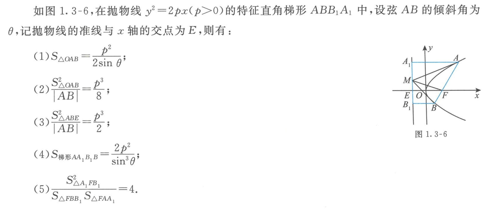

# 圆曲初步

## 圆曲概述

### 圆锥截线

用一平面去截双顶圆锥，得到的截线就是圆锥曲线。

不妨设 $\alpha$ 指母线与轴的夹角（$0<\alpha<90^\circ$），切平面与轴的夹角为 $\beta$（$0\le\beta\le90^\circ$）。

则所得截线的离心率 $e$ 仅由这两个角决定：

$$
e = \dfrac{\cos\beta}{\cos\alpha}
$$

角度—类型—离心率的对照：

- $\beta > \alpha$：椭圆，且 $e < 1$；$\beta = 90^\circ$ 时 $e=0$，为圆。
- $\beta = \alpha$：抛物线，$e = 1$（此时平面与某条母线平行）。
- $\beta < \alpha$：双曲线，$e > 1$（平面切到两片圆锥）。

更加具体的几何构造，由于代数手段可以简单的解决，请自行查阅丹德林球。

离心率与行星运动，以牛顿大炮为例：

- 以第一宇宙速度发射：圆形。

- 大于第一宇宙速度，小于第二宇宙速度：椭圆形。

- 第二宇宙速度：抛物线。

- 大于第二宇宙速度：双曲线。

此处忽略太阳引力的影响。

### 定比轨迹

圆锥曲线是平面上满足距某定点（焦点）的距离与距某定直线（准线）的距离之比为常数 $e$ 的点的轨迹。

其中 $e$ 称为离心率：$e<1$ 为椭圆，$e=1$ 为抛物线，$e>1$ 为双曲线，特殊的 $e=0$ 为圆。

### 一般方程

### 参数方程

参数方程和函数相似，都是由一些在指定的集合的数，称为参数或自变数，以决定因变数的结果。

我们知道，几何中常见的方程是 $y$ 关于 $x$ 的方程，但是我们也可以将 $x,y$ 均视为因变量，钦定其为关于 $t$ 或 $\theta$ 的方程，称为参数方程。

- 普通方程转为参数方程：利用参数方程，可以很方便的表示不能用函数表达，或者常规的方程难以表达的曲线。

- 参数方程转为普通方程：消去参数，或者将参数用 $x,y$ 表示，然后解没有参数的方程。

参数方程可以用于消元，当两个未知量具有明显的几何意义，可以设出参数方程。

容易知道：

$$
\boxed{\begin{cases}
x&=a+r\cos\theta\\
y&=b+r\sin\theta
\end{cases}}
$$

可以表示一个圆。

容易知道

$$
\boxed{\begin{cases}
x&=a\cos\theta\\
y&=b\sin\theta
\end{cases}}
$$

可以表示一个中心在原点的椭圆。

容易知道

$$
\boxed{\begin{cases}
x&=\dfrac{a}{\cos\theta}\\
y&=b\tan\theta
\end{cases}}
$$

可以表示一个中心在原点的双曲线。

### 阿氏卡氏

1. 到两定点的距离之商为定值（不等于 $1$）的点的轨迹是阿波罗尼斯圆；
2. 到两定点的距离之和为定值（大于两定点的距离）的点的轨迹是椭圆；
3. 到两定点的距离之差的绝对值为定值（大于 $0$ 且小于两定点的距离）的点的轨迹是双曲线；
4. 到两定点的距离之积为定值（该定值为正数）的点的轨迹是卡西尼卵形线。

阿波罗尼斯圆（简称阿氏圆）已知平面上两点 $A,B$，则所有满足 $PA/PB=k$（$k\neq1$）的点 $P$ 的轨迹是一个圆。

$$
\boxed{\dfrac{(x-x_a)^2+(y-y_a)^2}{(x-x_b)^2+(y-y_b)^2}=k^2}
$$

整理可以得到圆的方程，但是阿波罗尼斯圆的常见找法是，在 $AB$ 所在直线上找到满足条件的两个点，以两点中点为圆心作圆即可。

阿氏圆的性质：$\triangle POA\backsim\triangle POB$，根据相似。

## 椭圆

### 第一定义

到两个定点 $F_1$、$F_2$ 的距离之和为定值（大于 $|F_1F_2|$）的点所形成的轨迹称为椭圆。这两个定点叫做椭圆的焦点，两焦点间的距离叫做椭圆的焦距，焦距的一半称为半焦距。

我们不妨设 $F_1=(-c,0),F_2=(c,0)$ 为焦点的椭圆经过 $M$ 点，且 $M$ 到 $F_1,F_2$ 的局里之和为 $2a$，其中 $a>c$，那么写出方程：

$$
\sqrt{(x-c)^2+y^2}+\sqrt{(x+c)^2+y^2}=2a
$$

我们把一个根号移到另一侧，然后两边平方，整理后再平方，可以得到：

$$
\dfrac{x^2}{a^2}+\dfrac{y^2}{a^2-c^2}=1
$$

不妨令 $b=\sqrt{a^2-c^2}$，那么**椭圆的标准方程**：

$$
\dfrac{x^2}{a^2}+\dfrac{y^2}{b^2}=1(a>b>0)
$$

这个椭圆的焦点在 $x$ 轴上，容易知道焦点在 $y$ 轴上的椭圆

$$
\dfrac{x^2}{b^2}+\dfrac{y^2}{a^2}=1(a>b>0)
$$

注意 $c^2=a^2-b^2$ 这个式子很重要。

容易知道椭圆上一点 $P$，横坐标为 $x_0$，到两个焦点 $F_1,F_2$ 的距离分别为

$$
PF_1=a+\dfrac{c}{a}x_0=a+ex_0
$$

$$
PF_2=a-\dfrac{c}{a}x_0=a-ex_0
$$

### 第二定义

到一定点 $F_1$ 的距离与到一定直线的距离之比为定值（小于 $1$）的点所形成的轨迹称为椭圆。该定直线称为准线。

我们不妨设 $F_1=(c,0),F_2=(-c,0)$，同样还有一个 $a$ 那么：

$$
\sqrt{(x-c)^2+y^2}+\sqrt{(x+c)^2+y^2}=2a
$$

不妨写出这个式子的共轭根式，

$$
\sqrt{(x-c)^2+y^2}-\sqrt{(x+c)^2+y^2}=\dfrac{2cx}{a}
$$

容易知道他们的乘积就是 $4cx$，因此写出其共轭根式为上式，联立两式，不难得到

$$
\sqrt{(x-c)^2+y^2}=\dfrac{c}{a}\vert{x-\dfrac{a^2}{c}}
$$

容易知道准线方程为

$$
x=\dfrac{a^2}{c}
$$

因为我们是取的右焦点，因此这个准线也称为右准线；同理取左焦点

$$
x=-\dfrac{a^2}{c}
$$

称为左准线，而比值就是 $\dfrac{c}{a}$，这称为离心率，我们后面再说。

### 几何性质

我们注意到对于

$$
\dfrac{x^2}{a^2}+\dfrac{y^2}{b^2}=1(a>b>0)
$$

有

$$
x^2=a^2\paren{1-\dfrac{y^2}{b^2}}
$$

因此

$$
-a\le x\le a
$$

同理

$$
-b\le y\le b
$$

也就是说，椭圆整个图形都在一个中心在原点、长为 $b$ 高为 $a$ 的矩形中心，矩形与椭圆焦点分为上下左右四个。

椭圆有两条对称轴（两个坐标轴）和一个对称中心（原点）。

椭圆的离心率，定义为

$$
e=\dfrac{c}{a}=\sqrt{1-\dfrac{b^2}{a^2}}\in(0,1)
$$

特别的，圆的离心率为零；离心率越大，椭圆越扁平。

通径：我们过一个焦点，做焦点连线的垂线，与椭圆交于两点 $P,Q$，这个线段称为椭圆的通径，有公式

$$
PQ=\dfrac{2b^2}{a}
$$

上述结论可以作如下推广：过焦点 $F$ 作 $n$ 条夹角相等的射线交椭圆于 $P_1, P_2, \cdots, P_n$，则

$$
\frac{1}{|FP_1|} + \frac{1}{|FP_2|} + \cdots + \frac{1}{|FP_n|} = \frac{na}{b^2}
$$

椭圆的面积：$S=\pi ab$（$a,b$ 分别为长半轴、短半轴的长）。

证明：根据仿射变换显然。或利用微积分，此处略。

## 双曲线

### 第一定义

到两定点 $F_1,F_2$ 距离之差的绝对值为常数（小于 $|F_1F_2|$）的点的轨迹称为双曲线。

与椭圆类似，我们设左焦点 $F_1=(-c,0)$ 和右焦点 $F_2=(c,0)$，距离之差为 $2a$，其中 $c>a>0$，有双曲线的一般方程

$$
\dfrac{x^2}{a^2}-\dfrac{y^2}{c^2-a^2}=1
$$

同样，令 $b=\sqrt{c^2-a^2}$ 即 $c^2=a^2+b^2$。

$$
\dfrac{x^2}{a^2}-\dfrac{y^2}{b^2}=1
$$

### 第二定义

到一定点 $F_1$ 的距离与到一定直线的距离之比为定值（大于 $1$）的点所形成的轨迹称为双曲线。该定直线称为准线。

与抛物线一样，我们可以得到

$$
\sqrt{(x-c)^2+y^2}=\dfrac{c}{a}\vert{x-\dfrac{a^2}{c}}
$$

但是此时 $\dfrac{c}{a}$ 应当是大于 $1$ 的，同理

$$
\sqrt{(x+c)^2+y^2}=\dfrac{c}{a}\vert{x+\dfrac{a^2}{c}}
$$

前者是右焦点与右准线，后者是左焦点与左准线，准线方程依旧是

$$
x=\pm\dfrac{a^2}{c}
$$

比值就是 $\dfrac{c}{a}$，这称为离心率，我们后面再说。

### 几何性质

我们知道

$$
x^2=a^2\paren{1+\dfrac{y^2}{b^2}}
$$

因此

$$
|x|\ge a
$$

即 $x\ge a$ 或 $x\le-a$，而 $y$ 为实数。

双曲线有两个顶点，左顶点 $A_1=(-a,0)$ 和右顶点 $A_2=(a,0)$，线段 $A_1A_2$ 称为实轴，$a$ 称为实半轴长。

另外，设 $B_1=(0,b)$ 和 $B_2=(0,-b)$，则 $B_1B_2$ 称为虚轴，目前来说这个 $b$ 没有什么特殊意义。

特别的，如果 $a=b$，则这个双曲线称为等轴双曲线。

双曲线有对称轴为坐标轴，对称中心为坐标原点。

双曲线有两条渐近线

$$
y=\pm\dfrac{b}{a}x
$$

也就是

$$
\dfrac{y}{b}\pm\dfrac{x}{a}=0
$$

或者

$$
\dfrac{x^2}{a^2}-\dfrac{y^2}{b^2}=0
$$

双曲线的离心率，定义为

$$
e=\dfrac{c}{a}=\sqrt{1+\dfrac{b^2}{a^2}}>1
$$

离心率越大，双曲线的开口越大。

## 抛物线

### 一般方程

平面内与一个定点 $F$ 和一条定直线 $\ell$（不过 $F$）的距离相等的点的轨迹叫做抛物线。点 $F$ 叫做抛物线的焦点，直线 $\ell$ 叫做抛物线的准线。

.svg>){ width="40%" }

不妨设 $F$ 到准线的距离（焦准距）为 $p$ 且垂足为 $K$，容易知道，抛物线的顶点就是 $FK$ 的中点，即 $F=\paren{\dfrac{p}{2},0},K=\paren{-\dfrac{p}{2},0}$，不难得到抛物线的标准方程为

$$
y^2=2px(p>0)
$$

这个是开口朝向 $x$ 轴正半轴的，同理我们还有另外四个方向。

### 简单性质

对于抛物线

$$
y^2=2px(p>0)
$$

有 $x\ge0$，且关于 $y=0$ 对称，没有对称中心。

容易知道，二次函数

$$
f(x)=a^2+bx+c(a\neq0)
$$

就是一条抛物线且定点为

$$
\paren{-\dfrac{b}{2a},f\paren{-\dfrac{b}{2a}}}
$$

注意：抛物线的离心率恒为 $1$，而焦准距则衡量了开口大小。

### 特征梯形

过焦点的直线交抛物线与点 $A,B$ 过 $A,B$ 做准线 $\ell$ 的垂线 $AC,BC$，锁围成的直角梯形称为抛物线的特征直角梯形。。

{ width="50%" }

$$
\angle CED=90^\circ
$$

$$
CF\cdot DF=EF^2
$$

$$
\angle AFE=\angle BFE
$$

证明，显然。

此外

$$
AB=\dfrac{2p}{\sin^2\angle AEF}
$$

即焦点弦公式。

### 几何性质

1. 抛物线的焦点关于任意一条切线的对称点一定在准线上。

    证明：做 $PP'\perp\ell$，根据椭圆的性质，$FP=PP'$。
    
    { width="40%" }

    因为 $FP'\perp\ell'$，因此 $\ell'$ 是 $\angle FPP'$ 角平分线，所以，$F$ 关于 $\ell'$ 的反射点即为 $P'$ 在准线上。

    推论：抛物线的焦点到其各条切线的投影点，均位于抛物线顶点处的切线上。

2. 假设抛物线在点 $X$ 和 $Y$ 的切线相交于点 $P$。那么 $PX'=PY'=PF$，其中 $X'$ 和 $Y'$ 是 $X$ 和 $Y$ 在抛物线准线上的投影，而 $F$ 是抛物线的焦点。

    证明：根据上一条，这两条切线分别是线段 $FX'$ 和 $FY'$ 的中垂线。因此，它们的交点即为三角形 $FX'Y'$ 的外接圆圆心。

    { width="90%" }

    推论：如果 $PX$ 和 $PY$ 是抛物线的切线，那么点 $P$ 在准线上的投影，是 $X$ 和 $Y$ 在准线上的投影点所构成线段的中点。

3. 做抛物线上两点 $X,Y$ 的切线，相交于点 $P$，若 $PX\perp PY$，则 $P$ 在抛物线的准线上。反过来，过准线上一点 $P$ 做抛物线的两条切线，则他们相互垂直。同时，$XY$ 一定过焦点 $F$ 且 $PF\perp XY$。

    证明：设 $X',Y'$ 为 $X,Y$ 到准线上的投影，因为 $P$ 在准线上，

    { width="40%" }
    
    那么 $XF=XX',YF=YY'$，因此可以得到两个三角形全等，那么 $\angle XPY=90^\circ$。

4. 我们做推广，两条切线为 $\varphi$ 或 $180^\circ-\varphi$ 的点的集合是一个以 $F$ 焦点，抛物线准线 $\ell$ 为准线的双曲线，其离心率等于 $|\cos\varphi|$。

    { width="40%" }

    注意到 $P$ 为 $\triangle FX'Y'$ 外心，因此 $\angle X'PY'=360^\circ-2\varphi$，那么 $P$ 到准线的距离为 $PF|\cos(180^\circ-\varphi)|=PF|\cos\varphi|$，证毕。

5. 设 $PX$ 和 $PY$ 为过点 $P$ 的抛物线的两条切线，并设 $l$ 为过 $P$ 且平行于抛物线轴的直线。那么直线 $PY$ 与 $l$ 的夹角等于 $\angle XPF$，且 $\triangle XFP\backsim\triangle PFY$。由此可推知，$FP$ 是角 $XFY$ 的角平分线。

    设 $X'$ 和 $Y'$ 是 $X$ 和 $Y$ 在准线上的投影。那么，点 $F$、$X'$ 和 $Y'$位于一个以 $P$ 为圆心的圆上，
    
    { width="40%" }

    因此 $\angle X'Y'F = \dfrac{1}{2}\angle X'PF = \angle XPF$。因为 $\ell$ 垂直于 $X'Y'$，因此 $PY$ 与 $\ell$ 的夹角等于 $Y'F$ 与 $X'Y'$ 的夹角，而 $Y'F$ 垂直于 $PY$。

    由于 $l$ 平行于 $YY'$，$PY$ 与 $l$ 的夹角等于角 $PYY'$，根据光学性质，该角等于角 $FYP$。因此 $\angle FYP = \angle XPF$。类似地，$\angle FXP = \angle YPF$。因此 $\triangle XFP\backsim\triangle PFY$。 

6. 假设 $\triangle ABC$ 外切于一条抛物线，即直线 $AB$，$BC$，$CA$ 均与抛物线相切，那么 $\triangle ABC$ 的垂心始终过抛物线的准线。

    { width="40%" }

    兰伯特定理：由抛物线的三条切线所围成的三角形，其外接圆必经过抛物线的焦点。

    西姆松定理：点 $P$ 到 $\triangle ABC$ 各边的投影共线，当且仅当 $P$ 位于该三角形的外接圆上。

    斯坦纳线定理：一个三角形外接圆上任意一点（该点不为三角形顶点）关于三角形三边的对称点，这三个对称点是共线的，并且这条直线（称为斯坦纳线）必经过该三角形的垂心。

## 几何性质

### 光学性质

费马原理：当一束光经过镜子的反射，那么入射角等于出射角，可以证明，这个路径是最短的。

??? note "证明"
    设光线从 $F_1$ 经过直线 $\ell$ 的反射到达 $F_2$ 点，我们将 $F_1$ 关于 $\ell$ 对称的点设为 $F_1'$

    { width="40%" }
    
    则 $P$ 点位于 $F_1'F_2$ 与 $\ell$ 的交点上，这就是将军饮马模型，也容易证明，入射角和出射角是相等的。

椭圆的光学性质：从一个焦点发出的光线，经过椭圆的反射后一定经过另一个焦点。

??? note "证明"
    如图，容易知道，我们只需要证明 $\angle DAF_1=\angle DAF_2$ 即可，

    { width="60%" }
    
    根据角平分线逆定理，只需要证
    
    $$
    \dfrac{AF_1}{AF_2}=\dfrac{MF_1}{MF_2}
    $$

    但是这比较复杂，我们发现费马定理可以非常容易的解决这个问题。

    { width="40%" }

    不妨设 $X$ 是 $\ell$ 上任意一点，则根据 $P$ 在椭圆上、$X$ 在椭圆外，

    $$
    XF_1+XF_2\ge PF_1+PF_2
    $$

    取等当且仅当 $P=X$，因此 $P$ 就是费马定理的点，符合入射角等于出射角。

抛物线的光学性质：从焦点发出的光线，经过抛物线的反射后，一定平行于抛物线的轴。

??? note "证明"
    假设 $P$ 为抛物线上一点，做到准线的垂线，垂足为 $P'$，如图

    { width="40%" }

    我们不妨证明锅 $P$ 点的切线 $\ell$ 恰好平分 $\angle FPP'$。

    不妨假设角平分线 $\ell'$ 与抛物线相交与 $P,Q$ 两点，做 $QQ'$ 垂直于准线。根据抛物线的定义，有 $FP=PP'$，因此也有 $QF=QP'$，又因为 $FQ=QQ'$，因此 $P=Q$，即 $\ell=\ell'$，证毕。

    我们也可以证明角相等，

    { width="60%" }

    不难得到，只需要证 $\angle FPQ=\angle FQP$ 即可。

    不妨证明 $FP=FQ$，容易想到，列出直线方程直接求解，得到点的坐标即可。

双曲线的光学性质：从一个焦点发出的光线，经过双曲线的发射后反向延长经过另一个焦点。

??? note "证明"
    与椭圆类似，我们取作差的将军饮马模型，即延长线上的点最小。

    与抛物线类似，我们用两边之差小于第三边，也可以证明。

椭圆的旁心：在椭圆上任取两点 $P,Q$，做 $F_1PF_2,F_1QF_2$ 的外角角平分线，根据光学性质，也就是说 $PR,QR$ 都是椭圆的切线，交于一点 $R$，连接 $RF_1$，则 $RF_1\perp PQ$。

证明：我们知道 $R$ 是一个旁切圆的圆心，与 $PQ$ 相切与 $F'$（我们要证明它和 $F_1$ 重合），设椭圆与 $F_2P,F_2Q$ 相切于 $X,Y$，则 $F'P+PF_2=XF_2$，$F'Q+QF_2=YF_2$，因为 $RX=RY$ 所以 $XF_2=YF_2$，因此 $F'=F_1$ 即为椭圆焦点。

### 等角共轭

椭圆的等角共轭：过椭圆外一点 $P$ 做切线 $PX,PY$，切点为 $X,Y$。连接 $PF_1,PF_2$，则 $\angle XPF_1=\angle YPF_2$。

{ width="50%" }

我们将 $F_1,F_2$ 分别关于 $PX,PY$ 对称，得到 $F_1',F_2'$，根据初中几何容易知道，$\triangle PF_1'F_2\cong\triangle PF_1F_2'$，两顶角减去公共部分 $\angle F_1PF_2$，即可得到。

根据已经证明的全等，因此 $\angle PF_1X = \angle PF_1'F_2 = \angle PF_1F_2' = \angle PF_1Y$，也就是说对于曲线外一点 $P$ 与焦点的连线一定平分两个切点与这个焦点所构成的角。

双曲线有着类似的性质，但是需要注意切点是否位于同一分支上。

{ width="40%" }

此时有 $\angle F_1PX = \pi - \angle F_2PY$。

蒙日圆：若过椭圆外一点 $P$ 做椭圆的两条切线相互垂直，则 $P$ 的轨迹为一个圆，轨迹方程为

$$
x^2+y^2=a^2+b^2
$$

证明：不妨做 $F_1$ 关于 $PX$ 的对称点 $F_1'$，不难得到 $\angle F_1'PF_2=\angle XPY=90^\circ$，

{ width="40%" }

又因为 $PF_1'=PF_1$，也就是说只需要令

$$
PF_1^2+PF_2^2=F_1F_2^2
$$

即可，我们设 $P(x,y)$，而 $F_1F_2=2a$，带入得

$$
(x+c)^2+y^2+(x-c)^2+y^2=4a^2
$$

整理即可得到上面的轨迹方程。

对双曲线而言，这样的圆并不总存在。当双曲线的两条渐近线所成角为锐角时，该圆的半径为虚数；若两条渐近线互相垂直，则该圆退化为双曲线的中心这一点。

还有一些奇怪的结论。

- 过点 $P$ 作圆锥曲线的两条切线，若两切线的斜率之积为定值，则点 $P$ 的轨迹为某一圆锥曲线。

- 将一根绳子套在椭圆 $\alpha$ 上，并用铅笔把绳子绷紧。若使铅笔绕着椭圆转动，则它将描出另一条与 $\alpha$ 同焦的椭圆。

- 一条椭圆内接于一个凸四边形，且它的两个焦点分别落在该四边形的两条（不同的）对角线上，则该四边形两对对边长度的乘积相等。

### 仿射变换

我们在坐标系部分讲解了线性变换，我们知道线性变换后

- 直线变换后依然是直线。

- 直线比例保持不变。

- 原点变换后依然是原点。

而我们称仿射变换是指在对一个向量空间进行一次线性变换并接上一个**平移**，变换为另一个向量空间。伸缩、平移、对称等都是仿射变换，

{ width="80%" }

事实上：

- 平行直线依然平行。

- 共线的点依然共线。

- 直线变换后依然是直线。

- 直线上的线段比例保持不变。

使用一增广矩阵与一增广向量，需要所有向量在其末端扩长 $1$ 且所有矩阵都于底部添加一排零，右边扩长一列转换向量，及右下角添加一个 $1$。

$$
\begin{bmatrix}{\vec {y}}\\1\end{bmatrix}=\left[{\begin{array}{ccc|c}\,&A&&{\vec {b}}\ \\0&\ldots &0&1\end{array}}\right]{\begin{bmatrix}{\vec {x}}\\1\end{bmatrix}}
$$

等价于

$$
\vec {y}=A{\vec {x}}+{\vec {b}}
$$

对于一个椭圆

$$
\dfrac{x^2}{a^2}+\dfrac{y^2}{b^2}=1
$$

我们不妨令 $x'=\dfrac{b}{a}x$，则

$$
x'^2+y^2=b^2
$$

我们不妨令 $y'=\dfrac{a}{b}y$，则

$$
x^2+y'^2=a^2
$$

这样就通过伸缩变换将椭圆变成了圆；一般的，我们讨论变换

$$
f:\begin{cases}
x'&=mx\\
y'&=ny
\end{cases}
$$

- 任意面积 $S$ 变为 $nm$ 倍：$S'=nm\cdot S$。

- 有椭圆第三定义。

双曲线也可以用仿射变换，此时令

$$
f:\begin{cases}
x&=ax'\\
y&=biy'
\end{cases}
$$

带入双曲线方程

$$
\dfrac{x^2}{a^2}-\dfrac{y^2}{b^2}=x^2+y^2=1
$$

也就是一个单位圆，但是此时引入复数是不完全明智的，可能会存在一些伪证，我们通常需要进行验证才能得到结论，因此双曲线的仿射变换不常用。
