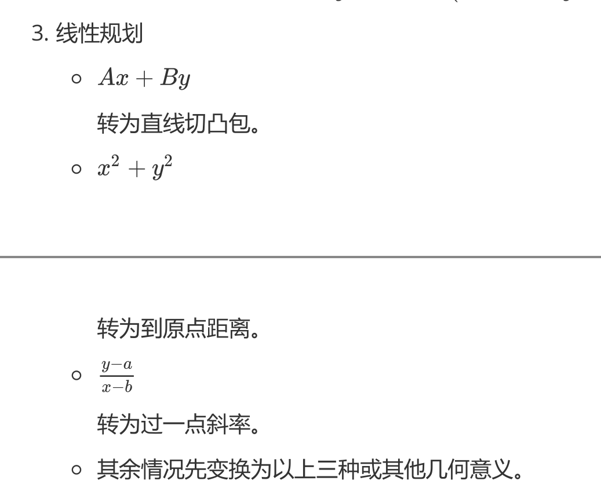

# 圆曲初步

## 圆曲概述

### 圆锥截线

用一平面去截双顶圆锥，得到的截线就是圆锥曲线。圆锥曲线是平面上满足距某定点（焦点）的距离与距某定直线（准线）的距离之比为常数 $e$ 的点的轨迹。

不妨设 $\alpha$ 指母线与轴的夹角（$0<\alpha<90^\circ$），切平面与轴的夹角为 $\beta$（$0\le\beta\le90^\circ$）。

则所得截线的离心率 $e$ 仅由这两个角决定：

$$
e = \dfrac{\cos\beta}{\cos\alpha}
$$

角度—类型—离心率的对照：

- $\beta > \alpha$：椭圆，且 $e < 1$；$\beta = 90^\circ$ 时 $e=0$，为圆。
- $\beta = \alpha$：抛物线，$e = 1$（此时平面与某条母线平行）。
- $\beta < \alpha$：双曲线，$e > 1$（平面切到两片圆锥）。

更加具体的几何构造，由于代数手段可以简单的解决，请自行查阅丹德林球。

离心率与行星运动，以牛顿大炮为例（忽略太阳的引力作用）：

- 以第一宇宙速度发射：圆形。

- 大于第一宇宙速度，小于第二宇宙速度：椭圆形。

- 第二宇宙速度：抛物线。

- 大于第二宇宙速度：双曲线。

圆锥曲线的极坐标定义：

$$
\rho=\dfrac{ep}{1\pm e\cos\theta}=\dfrac{L}{1\pm e\cos\theta}
$$

这个形式极为简洁，其中 $L$ 为半通径，在椭圆中有 $L=a(1-e^2)$，常在焦点三角形中用到，我们会在那里详细解释。

### 切线方程

方法一（判别式）：

- 我们知道相切即有且仅有一个交点，利用判别式：

    设切线为 $y=kx+b$，联立曲线方程，令判别式 $\Delta=0$。

方法二（求导法）：

-  我们令曲线方程为 $F(x,y)=0$，对 $F$ 求导。

- 我们利用导数中讲的隐函数求导：

    将 $y$ 看作 $f(x)$，利用链式法则进行求导。

- 或者更简单的，我们利用偏导：

    $$
    y'=-\dfrac{F_x}{F_y}
    $$

    其中
    
    $$
    \begin{aligned}
    F_x&=\dfrac{\partial F}{\partial x}(x,y)\\
    F_y&=\dfrac{\partial F}{\partial y}(x,y)
    \end{aligned}
    $$

- 对于求导后的结果，带入曲线上的点即可得到曲线在该处的切线。

经过推导，我们得出椭圆的切线方程

$$
\dfrac{x_0x}{a^2}+\dfrac{y_0y}{b^2}=1
$$

同理，双曲线的切线方程

$$
\dfrac{x_0x}{a^2}-\dfrac{y_0y}{b^2}=1
$$

对于一般的圆锥曲线

$$
Ax^2+Bxy+Cy^2+Dx+Ey+F=0
$$

其切线方程就是

$$
Ax_0x+B\cdot\dfrac{x_0y+xy_0}{2}+Cy_0y+D\cdot\dfrac{x_0+x}{2}+E\cdot\dfrac{y_0+y}{2}+F=0
$$

也就是说我们替换

$$
\begin{cases}
x^2&\gets x_0x\\
y^2&\gets y_0y\\
x&\gets\dfrac{x_0+x}{2}\\
y&\gets\dfrac{y_0+y}{2}\\
xy&\gets\dfrac{x_0y+xy_0}{2}
\end{cases}
$$

得到的就是 $F$ 在 $(x_0,y_0)$ 处的切线方程。

切点弦方程：设过椭圆外一点 $A=(x_0,y_0)$ 有椭圆的切线 $AB,AC$，其中 $B=(x_1,y_1),C=(x_2,y_2)$ 为切点，则 $BC$ 的方程也为

$$
\dfrac{x_0x}{a^2}+\dfrac{y_0y}{b^2}=1
$$

证明：根据 $AB,AC$ 是切线，列出 $AB,AC$ 的直线方程

$$
\begin{cases}
\dfrac{x_1x}{a^2}+\dfrac{y_1y}{b^2}=1\\
\dfrac{x_2x}{a^2}+\dfrac{y_2y}{b^2}=1\\
\end{cases}
$$

我们知道 $A(x_0,y_0)$ 在这两条直线上，因此带入 $(x,y)=(x_0,y_0)$

$$
\begin{cases}
\dfrac{x_1x_0}{a^2}+\dfrac{y_1y_0}{b^2}=1\\
\dfrac{x_2x_0}{a^2}+\dfrac{y_2y_0}{b^2}=1\\
\end{cases}
$$

因此不妨令直线

$$
\dfrac{x_0x}{a^2}+\dfrac{y_0y}{b^2}=1
$$

则一定有 $B(x_1,y_1),C(x_2,y_2)$ 一定在这条直线上。

### 距离定义

1. 到两定点的距离之商为定值（不等于 $1$）的点的轨迹是阿波罗尼斯圆；
2. 到两定点的距离之和为定值（大于两定点的距离）的点的轨迹是椭圆；
3. 到两定点的距离之差的绝对值为定值（大于 $0$ 且小于两定点的距离）的点的轨迹是双曲线；
4. 到两定点的距离之积为定值（该定值为正数）的点的轨迹是卡西尼卵形线。

阿波罗尼斯圆（简称阿氏圆）已知平面上两点 $A,B$，则所有满足 $PA/PB=k$（$k\neq1$）的点 $P$ 的轨迹是一个圆。

$$
\boxed{\dfrac{(x-x_a)^2+(y-y_a)^2}{(x-x_b)^2+(y-y_b)^2}=k^2}
$$

整理可以得到圆的方程，但是阿波罗尼斯圆的常见找法是，在 $AB$ 所在直线上找到满足条件的两个点，以两点中点为圆心作圆即可。

阿氏圆的性质：$\triangle POA\backsim\triangle POB$，根据相似。

卡西尼卵形线，是平面内到两个定点的距离之积为常数的点的轨迹，我们不妨设两顶点 $F_1=(-c,0),F_2=(c,0)$，曲线上的点 $P(x,y)$ 满足

$$
|PF_1|\cdot|PF_2|=b^2
$$

卵形线的形状与比值 $b/c$ 有关：

- 如果 $b/c$ 大于 $1$，则轨迹是一条闭曲线。

- 如果 $b/c$ 小于 $1$，则轨迹是两条不相连的闭曲线。

- 如果 $b/c$ 等于 $1$，则是伯努利双扭线。

{ width="60%" }

伯努利双纽线的形状类似无穷大的符号，是双曲线关于圆心在双曲线中心的圆的反演图形。

{ width="80%" }

### 光学性质

费马原理：当一束光经过镜子的反射，那么入射角等于出射角，可以证明，这个路径是最短的。

/// details | 证明
设光线从 $F_1$ 经过直线 $\ell$ 的反射到达 $F_2$ 点，我们将 $F_1$ 关于 $\ell$ 对称的点设为 $F_1'$

{ width="40%" }

则 $P$ 点位于 $F_1'F_2$ 与 $\ell$ 的交点上，这就是将军饮马模型，也容易证明，入射角和出射角是相等的。
///

椭圆的光学性质：从一个焦点发出的光线，经过椭圆的反射后一定经过另一个焦点。

/// details | 证明
如图，容易知道，我们只需要证明 $\angle DAF_1=\angle DAF_2$ 即可，

{ width="60%" }

根据角平分线逆定理，只需要证

$$
\dfrac{AF_1}{AF_2}=\dfrac{MF_1}{MF_2}
$$

但是这比较复杂，我们发现费马定理可以非常容易的解决这个问题。

{ width="40%" }

不妨设 $X$ 是 $\ell$ 上任意一点，则根据 $P$ 在椭圆上、$X$ 在椭圆外，

$$
XF_1+XF_2\ge PF_1+PF_2
$$

取等当且仅当 $P=X$，因此 $P$ 就是费马定理的点，符合入射角等于出射角。
///

抛物线的光学性质：从焦点发出的光线，经过抛物线的反射后，一定平行于抛物线的轴。

/// details | 证明
假设 $P$ 为抛物线上一点，做到准线的垂线，垂足为 $P'$，如图

{ width="40%" }

我们不妨证明锅 $P$ 点的切线 $\ell$ 恰好平分 $\angle FPP'$。

不妨假设角平分线 $\ell'$ 与抛物线相交与 $P,Q$ 两点，做 $QQ'$ 垂直于准线。根据抛物线的定义，有 $FP=PP'$，因此也有 $QF=QP'$，又因为 $FQ=QQ'$，因此 $P=Q$，即 $\ell=\ell'$，证毕。

我们也可以证明角相等，

{ width="60%" }

不难得到，只需要证 $\angle FPQ=\angle FQP$ 即可。

不妨证明 $FP=FQ$，容易想到，列出直线方程直接求解，得到点的坐标即可。
///

双曲线的光学性质：从一个焦点发出的光线，经过双曲线的发射后反向延长经过另一个焦点。

/// details | 证明
与椭圆类似，我们取作差的将军饮马模型，即延长线上的点最小。

与抛物线类似，我们用两边之差小于第三边，也可以证明。
///

椭圆的旁心：在椭圆上任取两点 $P,Q$，做 $F_1PF_2,F_1QF_2$ 的外角角平分线，根据光学性质，也就是说 $PR,QR$ 都是椭圆的切线，交于一点 $R$，连接 $RF_1$，则 $RF_1\perp PQ$。

证明：我们知道 $R$ 是一个旁切圆的圆心，与 $PQ$ 相切与 $F'$（我们要证明它和 $F_1$ 重合），设椭圆与 $F_2P,F_2Q$ 相切于 $X,Y$，则 $F'P+PF_2=XF_2$，$F'Q+QF_2=YF_2$，因为 $RX=RY$ 所以 $XF_2=YF_2$，因此 $F'=F_1$ 即为椭圆焦点。

### 何意味

定点问题基本框架：

- 若点 $P$ 是圆锥曲线 $C$ 上一定点，$A,B$ 是 $C$ 上两个动点，则我们有如下框架图：

    $$
    k_{PA} + k_{PB} = 0 \iff k_{AB} \scriptsize \text{ 为定值}
    $$

- 点 $P$ 是坐标轴上异于圆锥曲线 $C$ 的顶点的一定点，直线 $\ell$ 交 $C$ 于 $A,B$ 两点，则我们有如下框架图：

    $$
    k_{PA} + k_{PB} = 0 \iff \ell \scriptsize \text{ 过定点}
    $$

- 直线 $\ell$ 与圆锥曲线 $C$ 相交于 $A,B$ 两点，$P$ 是直线外一点，则我们有如下框架图：

    $$
    k_{PA} + k_{PB} = \lambda(\lambda \ne 0) \iff \ell \scriptsize \text{ 过定点}
    $$

- 已知 $A, B$ 是圆锥曲线 $C$ 上两动点，$M$ 是一定点，其中 $\alpha, \beta$ 分别为 $MA, MB$ 的倾斜角，则有以下等价：

    $$
    \begin{cases}
    AB \text{\scriptsize{ 恒过定点}}\\
    \overrightarrow{MA} \cdot \overrightarrow{MB} \text{\scriptsize{ 为定值}} \\
    k_{MA} \cdot k_{MB} \text{\scriptsize{ 为定值}} \\
    \alpha + \beta = \theta(0 < \theta < \pi)
    \end{cases}
    $$

已知椭圆的方程为 $\dfrac{x^2}{a^2} + \dfrac{y^2}{b^2} = 1(a > b > 0)$，$A, B$ 是椭圆上的两动点，$M$ 为平面上动点且满足 $\overrightarrow{OM} = \lambda\overrightarrow{OA} + \mu\overrightarrow{OB}$，则有（已知任意两个，可以推出第三个）：

$$
\begin{cases}
k_{OA} \cdot k_{OB} = -\dfrac{b^2}{a^2}\\
\lambda^2 + \mu^2 = 1\\
M\small\text{ 在椭圆上}
\end{cases}
$$

对于 $M$ 不一定在曲线上，已知 $A,B$ 是椭圆 $\dfrac{x^2}{a^2} + \dfrac{y^2}{b^2} = 1(a > b > 0)$ 上的两动点，$M$ 是平面上一动点且 $\overrightarrow{OM} = \lambda \overrightarrow{OA} + \mu \overrightarrow{OB}$，我们有如下

$$
k_{OA} \cdot k_{OB} = -\dfrac{b^2}{a^2} \iff \dfrac{x_M^2}{a^2} + \dfrac{y_M^2}{b^2} = \lambda^2 + \mu^2
$$

如果斜率互补，则有下面的结论：

- 若 $A(x_0, y_0)$ 为椭圆 $\dfrac{x^2}{a^2} + \dfrac{y^2}{b^2} = 1(a>b>0)$ 上的点，$E, F$ 是椭圆上的两个动点，直线 $AE$ 的倾斜角与直线 $AF$ 的倾斜角互补，则直线 $EF$ 的斜率为定值 $(1-e^2)\dfrac{x_0}{y_0}$，且和椭圆在点 $A$ 处的切线的斜率互为相反数。（其中 $e$ 为椭圆的离心率）

- 若 $A(x_0, y_0)$ 为双曲线 $\dfrac{x^2}{a^2} - \dfrac{y^2}{b^2} = 1(a>0, b>0)$ 上的点，$E,F$ 是双曲线上的两个动点，直线 $AE$ 的倾斜角与直线 $AF$ 的倾斜角互补，则直线 $EF$ 的斜率为定值 $(1-e^2)\dfrac{x_0}{y_0}$，且和双曲线在点 $A$ 处的切线的斜率互为相反数。（证明过程可类比上述证明椭圆相关性质的过程）。

- 若 $A(x_0, y_0)$ 为抛物线 $y^2 = 2px(p>0)$ 上的点，$E, F$ 是抛物线上的两个动点，直线 $AE$ 的倾斜角与直线 $AF$ 的倾斜角互补，则直线 $EF$ 的斜率为定值 $-\dfrac{p}{y_0}$，且和抛物线在点 $A$ 处的切线的斜率互为相反数。

垂直问题：

椭圆 $C: \dfrac{x^2}{a^2} + \dfrac{y^2}{b^2} = 1$ 的中心为原点 $O$，过点 $O$ 作两条垂直的射线交椭圆于 $P,Q$ 两点，过原点 $O$ 作直线 $PQ$ 的垂线，垂足为 $D$，$d$ 表示点 $O$ 到直线 $PQ$ 的距离。则有如下的四个等价：

$$
\begin{cases}
OP \perp OQ\\
\dfrac{1}{|OP|^2} + \dfrac{1}{|OQ|^2} = \dfrac{1}{a^2} + \dfrac{1}{b^2}\\
D \text{ {\scriptsize 的轨迹是} } x^2 + y^2 = \dfrac{a^2b^2}{a^2 + b^2}\\
d = \dfrac{ab}{\sqrt{a^2 + b^2}}
\end{cases}
$$

设双曲线 $C: \dfrac{x^2}{A^2} - \dfrac{y^2}{B^2} = \pm 1$ 的中心为原点 $O$，过点 $O$ 作两条垂直的射线交双曲线于 $P,Q$ 两点。过点 $O$ 作直线 $PQ$ 的垂线，垂足为 $D$，$d$ 表示点 $O$ 到直线 $PQ$ 的距离。则有如下的四个等价：

$$
\begin{cases}
OP \perp OQ\\
\dfrac{1}{|OP|^2} + \dfrac{1}{|OQ|^2} = \left|\dfrac{1}{A^2} - \dfrac{1}{B^2}\right|\\
D \text{ {\scriptsize 的轨迹是} } x^2 + y^2 = \dfrac{A^2 B^2}{|B^2 - A^2|}\\
d = \dfrac{AB}{\sqrt{|B^2 - A^2|}}
\end{cases}
$$

已知 $A, B$ 是抛物线 $y^2 = 2px(p>0)$ 上的两动点，其中 $\alpha, \beta$ 分别为 $OA, OB$ 的倾斜角，则有如下的四个等价：

$$
\begin{cases}
OA \perp OB\\
k_{OA} \cdot k_{OB} = -1\\
AB \text{ {\scriptsize 恒过定点} } (2p, 0)\\
|\alpha - \beta| = \dfrac{\pi}{2}
\end{cases}
$$

## 椭圆

### 第一定义

到两个定点 $F_1$、$F_2$ 的距离之和为定值（大于 $|F_1F_2|$）的点所形成的轨迹称为椭圆。这两个定点叫做椭圆的焦点，两焦点间的距离叫做椭圆的焦距，焦距的一半称为半焦距。

我们不妨设 $F_1=(-c,0),F_2=(c,0)$ 为焦点的椭圆经过 $M$ 点，且 $M$ 到 $F_1,F_2$ 的局里之和为 $2a$，其中 $a>c$，那么写出方程：

$$
\sqrt{(x-c)^2+y^2}+\sqrt{(x+c)^2+y^2}=2a
$$

我们把一个根号移到另一侧，然后两边平方，整理后再平方，可以得到：

$$
\dfrac{x^2}{a^2}+\dfrac{y^2}{a^2-c^2}=1
$$

不妨令 $b=\sqrt{a^2-c^2}$，那么**椭圆的标准方程**：

$$
\dfrac{x^2}{a^2}+\dfrac{y^2}{b^2}=1(a>b>0)
$$

这个椭圆的焦点在 $x$ 轴上，容易知道焦点在 $y$ 轴上的椭圆

$$
\dfrac{x^2}{b^2}+\dfrac{y^2}{a^2}=1(a>b>0)
$$

注意 $c^2=a^2-b^2$ 这个式子很重要。

### 第二定义

到一定点 $F_1$ 的距离与到一定直线的距离之比为定值（小于 $1$）的点所形成的轨迹称为椭圆。该定直线称为准线。

我们不妨设 $F_1=(c,0),F_2=(-c,0)$，同样还有一个 $a$ 那么：

$$
\sqrt{(x-c)^2+y^2}+\sqrt{(x+c)^2+y^2}=2a
$$

不妨写出这个式子的共轭根式，

$$
\sqrt{(x-c)^2+y^2}-\sqrt{(x+c)^2+y^2}=\dfrac{2cx}{a}
$$

容易知道他们的乘积就是 $4cx$，因此写出其共轭根式为上式，联立两式，不难得到

$$
\sqrt{(x-c)^2+y^2}=\dfrac{c}{a}\vert{x-\dfrac{a^2}{c}}
$$

容易知道准线方程为

$$
x=\dfrac{a^2}{c}
$$

因为我们是取的右焦点，因此这个准线也称为右准线；同理取左焦点

$$
x=-\dfrac{a^2}{c}
$$

称为左准线，而比值就是 $\dfrac{c}{a}$，这称为离心率：

$$
e=\dfrac{c}{a}=\sqrt{1-\dfrac{b^2}{a^2}}\in(0,1)
$$

特别的，圆的离心率为零；离心率越大，椭圆越扁平。

### 第三定义

第三定义，即点差法。在椭圆

$$
\dfrac{x^2}{a^2}+\dfrac{y^2}{b^2}=1
$$

上，有两个点 $P,Q$，设 $M$ 为 $PQ$ 中点，则

$$
k_{PQ}=-\dfrac{b^2}{a^2}\cdot\dfrac{x_M}{y-M}
$$

反过来，若直线 $PQ$ 的斜率为 $k$，则 $M$ 在定直线

$$
\ell:\dfrac{x}{a^2}+\dfrac{ky}{b^2}=0
$$

上，也可以说，$PQ$ 与 $OM$ 斜率之积

$$
k_{PQ}\cdot k_{OM}=-\dfrac{b^2}{a^2}
$$

证明即“点差”设出点的坐标，然后做差。

/// details | 证明
不妨设

$$
P(x_1,y_1),Q(x_2,y_2)
$$

因此

$$
\begin{cases}
\dfrac{x_1^2}{a^2}+\dfrac{y_1^2}{b^2}&=1\\
\dfrac{x_2^2}{a^2}+\dfrac{y_2^2}{b^2}&=1
\end{cases}
$$

做差，得到

$$
(x_1-x_2)\cdot\dfrac{x_1+x_2}{a^2}+(y_1-y_2)\cdot\dfrac{y_1+y_2}{b^2}=0
$$

根据中点

$$
\begin{cases}
x_1+x_2&=2x_M\\
y_1+y_2&=2y_M
\end{cases}
$$

因此

$$
(x_1-x_2)\cdot\dfrac{x_M}{a^2}+(y_1-y_2)\cdot\dfrac{y_M}{b^2}
$$

又因为斜率

$$
k=\dfrac{y_1-y_2}{x_1-x_2}
$$

因此就有

$$
\dfrac{x_M}{a^2}+k\cdot\dfrac{y_M}{b^2}=0
$$

即为上面第二条结论，整理得第一条结论。
///

可以根据仿射变换轻松得到，因此我们类比，如果 $AB$ 过抛物线中心（类似于圆心），$P$ 是椭圆上异于 $A,B$ 的一个点，则

$$
k_{PA}\cdot k_{PB}=-\dfrac{b^2}{a^2}
$$

已知动直线 $\ell$ 与椭圆 $\dfrac{x^2}{A^2} + \dfrac{y^2}{B^2} = 1$ 交于 $P(x_1, y_1)$， $Q(x_2, y_2)$ 两个不同的点，且 $\triangle OPQ$ 的面积记为 $S_{\triangle OPQ}$，其中 $O$ 为坐标原点。我们有如下的框架图：

$$
\begin{cases}
k_{OP} \cdot k_{OQ} = -\dfrac{B^2}{A^2}\\
S_{\triangle OPQ} = \dfrac{1}{2}AB\\
y_1^2 + y_2^2 = B^2\\
x_1^2 + x_2^2 = A^2
\end{cases}
$$

已知 $E(x_0, y_0)$ 是椭圆 $\dfrac{x^2}{A^2} + \dfrac{y^2}{B^2} = 1$ 上任意一点，从原点 $O$ 引圆 $E:(x-x_0)^2+(y-y_0)^2=r^2$ 的两条切线，分别交椭圆于 $P, Q$ 两点。若 $x_0^2 \ne r^2$，则我们有如下的三个互为等价的结论：

$$
\begin{cases}
\dfrac{1}{A^2} + \dfrac{1}{B^2} = \dfrac{1}{r^2} \\
S_{\triangle OPQ} = \dfrac{1}{2}AB \\
k_{OP} \cdot k_{OQ} = -\dfrac{B^2}{A^2}
\end{cases}
$$

此外还可以推导出：

$$
|OP|^2 + |OQ|^2 = A^2 + B^2
$$

这个结论并非等价，有很多条件也能推出来。

已知椭圆 $C: \dfrac{x^2}{a^2} + \dfrac{y^2}{b^2} = 1(a>b>0)$，不过原点 $O$ 的直线 $\ell$ 与椭圆 $C$ 相交于 $A,B$ 两点，设 $OA, \ell, OB$ 的斜率分别为 $k_1, k, k_2$。则有：

$$
k_1 \cdot k_2 = k^2\implies|OA|^2 + |OB|^2 = a^2 + b^2
$$

### 几何性质

椭圆有两条对称轴（两个坐标轴）和一个对称中心（原点）。

$$
\dfrac{x^2}{a^2}+\dfrac{y^2}{b^2}=1(a>b>0)
$$

我们注意到，

$$
x^2=a^2\paren{1-\dfrac{y^2}{b^2}}
$$

因此

$$
-a\le x\le a
$$

同理

$$
-b\le y\le b
$$

也就是说，椭圆整个图形都在一个中心在原点、长为 $b$ 高为 $a$ 的矩形中心，矩形与椭圆焦点分为上下左右四个。

椭圆的面积：$S=\pi ab$（$a,b$ 分别为长半轴、短半轴的长）。

证明：根据仿射变换显然。或利用微积分，此处略。

### 特征三角形

此外，我们知道椭圆的焦点三角形是及其重要的一个模型，因为其过于复杂，我们后面会开一个单独的模块讲解。

### 离心率问题

离心率问题是初学阶段最重要的一类题目，难度相对较低但是适合练手，对于离心率问题，常见的几种方法有：

离心率的问题本质就是 $a,b,c$ 的比值问题，但是对于最值有一些特殊的方法。

- 已知 $F_1, F_2$ 为椭圆 $\dfrac{x^2}{a^2} + \dfrac{y^2}{b^2} = 1(a > b > 0)$ 的左、右焦点，$P$ 是椭圆上的动点，则椭圆离心率的取值范围为 $\sin\dfrac{\angle F_1PF_2}{2} \le e < 1$。

    证明：设 $B$ 为椭圆的上顶点。

    $$
    e=\dfrac{c}{a}=\sin\dfrac{\angle F_1BF_2}{2}\ge\dfrac{\angle F_1PF_2}{2}
    $$

- 已知 $F_1, F_2$ 为椭圆 $\dfrac{x^2}{a^2} + \dfrac{y^2}{b^2} = 1(a > b > 0)$ 的左、右焦点，$P$ 是椭圆上的动点，$\angle PF_1F_2 = \alpha, \angle PF_2F_1 = \beta$，则椭圆的离心率 $e = \dfrac{\sin(\alpha + \beta)}{\sin\alpha + \sin\beta}$。

    证明：根据正弦定理

    $$
    \dfrac{m}{\sin\beta}=\dfrac{n}{\sin\alpha}=\dfrac{2c}{\sin(\alpha+\beta)}
    $$

    整理得到

    $$
    \dfrac{2c}{\sin(\alpha+\beta)}=\dfrac{n+m}{\sin\alpha+\sin\beta}=\dfrac{2a}{\sin\alpha+\sin\beta}
    $$

    也就是说

    $$
    e=\dfrac{c}{a}=\dfrac{\sin(\alpha+\beta)}{\sin\alpha+\sin\beta}
    $$

- 已知 $F_1, F_2$ 为双曲线 $\dfrac{x^2}{a^2} - \dfrac{y^2}{b^2} = 1(a > 0, b > 0)$ 的左、右焦点，$P$ 是双曲线上的动点，若 $\angle PF_1F_2 = \alpha, \angle PF_2F_1 = \beta$，则双曲线的离心率 $e = \dfrac{\sin(\alpha + \beta)}{|\sin\alpha - \sin\beta|}$。

### 极点极线

过椭圆外一点 $P(x_0,y_0)$ 做两条切线 $PC,PD$，容易知道

$$
\ell_{CD}:\dfrac{x_0x}{a^2}+\dfrac{y_0y}{b^2}=1
$$

而我们不妨做两条 $\angle CPD$ 内的线，分别与椭圆交于 $A_1,A_2$ 与 $B_1,B_2$ 点，如图。

{ width="50%" }

我们发现 $A_2B_1,A_1B_2$ 相交于 $T$，且 $T$ 在 $CD$ 上。

互极：设 $ABCD$ 是椭圆

$$
\frac{x^2}{a^2} + \frac{y^2}{b^2} = 1
$$

的内接四边形，对边 $AB$，$CD$ 交于点 $P(x_1, y_1)$，对边 $AD$，$BC$ 交于点$Q(x_2, y_2)$，对角线 $AC$，$BD$ 交于点 $R(x_3, y_3)$，则 $P,Q,R$ 三点满足：

其中任意两点确定的直线，恰为以第三点为极点关于椭圆的极线。即：对任意 $i, j = 1,2,3, i \ne j$，我们有

$$
\frac{x_i x_j}{a^2} + \frac{y_i y_j}{b^2} = 1
$$

{ width="60%" }

如图 9-12 所示，已知 $P(x_P, y_P)$ 和圆 $x^2 + y^2 = 1$，过点 $P$ 任作一割线交圆于 $A,B$ 两点，交 $\ell : x_Px + y_Py = 1$ 于点 $Q$，则

$$
\begin{aligned}
\dfrac{PA}{PB} = \dfrac{QA}{QB}\\
\dfrac{2}{PQ} = \dfrac{1}{PA} + \dfrac{1}{PB}
\end{aligned}
$$

同时，点 $P$ 关于圆 $x^2 + y^2 = 1$ 的极线经过点 $Q$ 当且仅当点 $Q$ 关于圆 $x^2 + y^2 = 1$ 的极线经过点 $P$。

如图 9-13 所示，特别地，若 $PQ$ 经过圆心并交圆于 $R$，则有 $|OR|^2 = |OP|\cdot|OQ|$。反之，若 $|OR|^2 = |OP|\cdot|OQ|$，则 $Q$ 落在点 $P$ 的极线 $x_Px + y_Py = 1$ 上。

{ width="80%" }

对于一般的圆锥曲线，将切线方程直接搬过来，就是极线方程，也有上面的两条性质。

### 等角共轭

椭圆的等角共轭：过椭圆外一点 $P$ 做切线 $PX,PY$，切点为 $X,Y$。连接 $PF_1,PF_2$，则 $\angle XPF_1=\angle YPF_2$。

{ width="50%" }

我们将 $F_1,F_2$ 分别关于 $PX,PY$ 对称，得到 $F_1',F_2'$，根据初中几何容易知道，$\triangle PF_1'F_2\cong\triangle PF_1F_2'$，两顶角减去公共部分 $\angle F_1PF_2$，即可得到。

根据已经证明的全等，因此 $\angle PF_1X = \angle PF_1'F_2 = \angle PF_1F_2' = \angle PF_1Y$，也就是说对于曲线外一点 $P$ 与焦点的连线一定平分两个切点与这个焦点所构成的角。

双曲线有着类似的性质，但是需要注意切点是否位于同一分支上。

{ width="40%" }

此时有 $\angle F_1PX = \pi - \angle F_2PY$。

### 蒙日圆

蒙日圆：若过椭圆外一点 $P$ 做椭圆的两条切线相互垂直，则 $P$ 的轨迹为一个圆，轨迹方程为

$$
x^2+y^2=a^2+b^2
$$

证明：不妨做 $F_1$ 关于 $PX$ 的对称点 $F_1'$，不难得到 $\angle F_1'PF_2=\angle XPY=90^\circ$，

{ width="40%" }

又因为 $PF_1'=PF_1$，也就是说只需要令

$$
PF_1^2+PF_2^2=F_1F_2^2
$$

即可，我们设 $P(x,y)$，而 $F_1F_2=2a$，带入得

$$
(x+c)^2+y^2+(x-c)^2+y^2=4a^2
$$

整理即可得到上面的轨迹方程。

对双曲线而言，这样的圆并不总存在。当双曲线的两条渐近线所成角为锐角时，该圆的半径为虚数；若两条渐近线互相垂直，则该圆退化为双曲线的中心这一点。

还有一些奇怪的结论。

- 过点 $P$ 作圆锥曲线的两条切线，若两切线的斜率之积为定值，则点 $P$ 的轨迹为某一圆锥曲线。

- 将一根绳子套在椭圆 $\alpha$ 上，并用铅笔把绳子绷紧。若使铅笔绕着椭圆转动，则它将描出另一条与 $\alpha$ 同焦的椭圆。

- 一条椭圆内接于一个凸四边形，且它的两个焦点分别落在该四边形的两条（不同的）对角线上，则该四边形两对对边长度的乘积相等。

## 双曲线

### 第一定义

到两定点 $F_1,F_2$ 距离之差的绝对值为常数（小于 $|F_1F_2|$）的点的轨迹称为双曲线。

与椭圆类似，我们设左焦点 $F_1=(-c,0)$ 和右焦点 $F_2=(c,0)$，距离之差为 $2a$，其中 $c>a>0$，有双曲线的一般方程

$$
\dfrac{x^2}{a^2}-\dfrac{y^2}{c^2-a^2}=1
$$

同样，令 $b=\sqrt{c^2-a^2}$ 即 $c^2=a^2+b^2$。

$$
\dfrac{x^2}{a^2}-\dfrac{y^2}{b^2}=1
$$

### 第二定义

到一定点 $F_1$ 的距离与到一定直线的距离之比为定值（大于 $1$）的点所形成的轨迹称为双曲线。该定直线称为准线。

与抛物线一样，我们可以得到

$$
\sqrt{(x-c)^2+y^2}=\dfrac{c}{a}\vert{x-\dfrac{a^2}{c}}
$$

但是此时 $\dfrac{c}{a}$ 应当是大于 $1$ 的，同理

$$
\sqrt{(x+c)^2+y^2}=\dfrac{c}{a}\vert{x+\dfrac{a^2}{c}}
$$

前者是右焦点与右准线，后者是左焦点与左准线，准线方程依旧是

$$
x=\pm\dfrac{a^2}{c}
$$

比值就是 $\dfrac{c}{a}$，这称为离心率，定义为

$$
e=\dfrac{c}{a}=\sqrt{1+\dfrac{b^2}{a^2}}>1
$$

离心率越大，双曲线的开口越大。

### 第三定义

双曲线的第三定义的主要区别在于，在椭圆的公式中去掉负号即可。

- $M,N$ 是双曲线 $C:\dfrac{x^2}{A^2}-\dfrac{y^2}{B^2}=\pm1$ 上的两点，则 $P$ 是 $MN$ 的中点，等价于

    $$
    k_{MN} \cdot k_{OP} = \dfrac{B^2}{A^2}
    $$

- 已知直线 $y=kx+m$ 与双曲线 $C: \dfrac{x^2}{A^2} - \dfrac{y^2}{B^2} = 1$ 的渐近线交于 $M, N$ 两点，则 $P$ 是 $MN$ 的中点，等价于

    $$
    k_{MN} \cdot k_{OP} = \dfrac{B^2}{A^2}
    $$

    令 $M(x_1, y_1), N(x_2, y_2)$，点 $M, N$ 在渐近线上，可得

    $$
    \begin{cases}
    \dfrac{x_2^2}{a^2} - \dfrac{y_2^2}{b^2} = 0 \\
    \dfrac{x_1^2}{a^2} - \dfrac{y_1^2}{b^2} = 0
    \end{cases}
    \implies \dfrac{y_2^2 - y_1^2}{x_2^2 - x_1^2} = \dfrac{b^2}{a^2} \implies \dfrac{y_2 - y_1}{x_2 - x_1} \cdot \dfrac{y_2 + y_1}{x_2 + x_1} = \dfrac{b^2}{a^2}
    $$

    由此可知 $k_{OP} \cdot k_{MN} = \dfrac{b^2}{a^2}$。

### 几何性质

我们知道

$$
x^2=a^2\paren{1+\dfrac{y^2}{b^2}}
$$

因此

$$
|x|\ge a
$$

即 $x\ge a$ 或 $x\le-a$，而 $y$ 为实数。

双曲线有两个顶点，左顶点 $A_1=(-a,0)$ 和右顶点 $A_2=(a,0)$，线段 $A_1A_2$ 称为实轴，$a$ 称为实半轴长。

另外，设 $B_1=(0,b)$ 和 $B_2=(0,-b)$，则 $B_1B_2$ 称为虚轴，这个轴本身没有太多意义。

特别的，如果 $a=b$，则这个双曲线称为等轴双曲线。

双曲线有对称轴为坐标轴，对称中心为坐标原点。

双曲线有两条渐近线

$$
y=\pm\dfrac{b}{a}x
$$

也就是

$$
\dfrac{y}{b}\pm\dfrac{x}{a}=0
$$

或者可以记为

$$
\dfrac{x^2}{a^2}-\dfrac{y^2}{b^2}=0
$$

### 双曲函数

双曲函数因为其性质极其类似三角函数，因此也称为双曲三角函数。

我们知道三角函数 $\sin\theta,\cos\theta$ 是在单位圆上引入一条倾角为 $\theta$ 的直线，与单位圆相交的点的坐标即为 $(\cos\theta,\sin\theta)$，类似的我们推出双曲函数的最初定义：倾角为 $\theta$ 的直线与双曲线 $x^2-y^2=1$ 交于点 $(\cosh\theta,\sinh\theta)$。

$$
\sinh x=\dfrac{e^x-e^{-x}}{2}
$$

$$
\cosh x=\dfrac{e^x+e^{-x}}{2}
$$

$$
\tanh x=\dfrac{\sinh x}{\cosh x}=\dfrac{e^x-e^{-x}}{e^x+e^{-x}}
$$

其图像如图

{ width="60%" }

我们在复数部分推导了欧拉公式，因此不难知道

$$
\begin{cases}
\cos x&=\cosh(ix)\\
\sin x&=-i\sinh(ix)
\end{cases}
$$

我们利用这个可以从三角函数的几乎所有公式迁移到双曲函数。

/// details | 一些公式

$$
\cosh^2x-\sinh^2x=1
$$

$$
\sinh(x\pm y)=\sinh x\cosh y\pm \cosh x\sinh y
$$

$$
\cosh(x\pm y)=\cosh x\cosh y\pm\sinh x\sinh y
$$

$$
\tanh (x\pm y)=\frac{\tanh x\pm \tanh y}{1\pm \tanh x\tanh y}
$$

$$
\sinh 2x=2\sinh x\cosh x
$$

$$
\cosh 2x=\cosh^2x+\sinh^2x
$$

$$
\tanh 2x=\frac{2\tanh x}{1+\tanh^2x}
$$

$$
(\sinh x)'=\cosh x
$$

$$
(\cosh x)'=\sinh x
$$

///

### 特征三角形

做焦点到渐近线的垂线，焦点、垂足、圆心所构成的三角形即为双曲线的特征三角形。

{ width="60%" }

设焦点 $F(c,0)$，在渐近线 $bx=ay$ 上的垂足为 $P$，坐标原点为 $O$，则

$$
|FP|=\dfrac{bc}{\sqrt{a^2+b^2}}=b
$$

根据勾股定理，$|OP|=a$，这就是双曲线的特征三角形。

与之类似的，我们还可以从双曲线上任意一点向两条渐近线引垂线，如图

{ width="40%" }

则有

$$
|PH_1|\cdot|PH_2|=\dfrac{a^2b^2}{a^2+b^2}
$$

可以直接设出 $P$ 点坐标，带入化简即可。

## 焦点三角形

焦点三角形，即为圆锥曲线上一点或两点，与两个或一个焦点为顶点，所构成的三角形（或者退化的三角形），其在椭圆中表现的尤为重要，更多是因为双曲线的焦点三角形情况复杂、出题较少，且抛物线更常用到的模型是特征矩形而不是焦点三角形。

下面是椭圆的焦点三角形的一些经典结论：

椭圆上一点 $P$，横坐标为 $x_0$，到两个焦点 $F_1,F_2$ 的距离分别为

$$
PF_1=a+\dfrac{c}{a}x_0=a+ex_0
$$

$$
PF_2=a-\dfrac{c}{a}x_0=a-ex_0
$$

通径：我们过一个焦点，做焦点连线的垂线，与椭圆交于两点 $P,Q$，这个线段称为椭圆的通径，有公式

$$
PQ=\dfrac{2b^2}{a}
$$

上述结论可以作如下推广：过焦点 $F$ 作 $n$ 条夹角相等的射线交椭圆于 $P_1, P_2, \cdots, P_n$，则

$$
\frac{1}{|FP_1|} + \frac{1}{|FP_2|} + \cdots + \frac{1}{|FP_n|} = \frac{na}{b^2}
$$

### 周长问题

焦点三角形的周长与圆锥曲线的定义之间存在着紧密联系。

- 已知 $F_1, F_2$ 分别为椭圆 $\dfrac{x^2}{a^2} + \dfrac{y^2}{b^2} = 1(a > b > 0)$ 的左、右焦点，$l$ 过焦点 $F_1$ 且与椭圆交于 $A, B$ 两点，则 $\triangle F_2AB$ 的周长恒为定值 $4a$；

- 已知 $F_1, F_2$ 分别为椭圆 $\dfrac{x^2}{a^2} + \dfrac{y^2}{b^2} = 1(a > b > 0)$ 的左、右焦点，$P$ 是椭圆上的动点，则 $\triangle PF_1F_2$ 的周长恒为定值 $2a + 2c$。

    

- 已知 $F_1, F_2$ 分别是双曲线 $\dfrac{x^2}{a^2} - \dfrac{y^2}{b^2} = 1(a > 0, b > 0)$ 的左、右焦点，$l$ 过焦点 $F_1$ 且与双曲线交于 $A, B$ 两点，则 $|AF_2| + |BF_2| - |AB| = 4a$。

    

### 面积问题

- 已知 $F_1, F_2$ 为椭圆 $\dfrac{x^2}{a^2} + \dfrac{y^2}{b^2} = 1(a > b > 0)$ 的两个焦点，$M$ 是椭圆上的动点，则 $\triangle MF_1F_2$ 的面积 $S = c|y_M| = b^2 \tan\dfrac{\angle F_1MF_2}{2}$。

- 已知 $F_1, F_2$ 为双曲线 $\dfrac{x^2}{a^2} - \dfrac{y^2}{b^2} = 1(a > 0, b > 0)$ 的两个焦点，$M$ 是双曲线上的动点，则 $\triangle MF_1F_2$ 的面积 $S = c|y_M| = \dfrac{b^2}{\tan\dfrac{\angle F_1MF_2}{2}}$。

内切圆即角平分线与面积也有着很大的关联：

- $P$ 是椭圆 $\dfrac{x^2}{a^2} + \dfrac{y^2}{b^2} = 1(a > b > 0)$ 上的动点，$\triangle PF_1F_2$ 的内切圆为圆 $I$，半径为 $r$，则 $S_{\triangle PF_1F_2} = r(a+c)$。

- 设椭圆 $\dfrac{x^2}{a^2} + \dfrac{y^2}{b^2} = 1(a > b > 0)$ 的左、右焦点分别为 $F_1, F_2$，过焦点 $F_1$ 的直线交椭圆于 $A, B$ 两点，$\triangle AF_2B$ 的内切圆为圆 $I$，半径为 $r$，则 $S_{\triangle AF_2B} = 2ar$。

    

- 已知 $P$ 是双曲线 $\dfrac{x^2}{a^2} - \dfrac{y^2}{b^2} = 1(a > 0, b > 0)$ 上的动点，$\triangle PF_1F_2$ 的内切圆的圆心为 $I(x_0, y_0)$，则 $|S_{\triangle PIF_1} - S_{\triangle PIF_2}| = \dfrac{S_{\triangle F_1IF_2}}{e}$，$|x_0| = a$。

    

### 中点问题

在圆锥曲线的选择与填空题中，若有中点这样的信息出现，就要联想到原点并连接原点与该点，构造中位线。因为原点是椭圆和双曲线的中心，是两焦点的天然中点。

{ width="40%" }

根据推导可以发现，焦点在 $x$ 轴上的抛物线（开口向左、右）外一点，纵坐标是切点纵坐标的算数平均值，横坐标是切点横坐标的几何平均值。

### 转换问题

- 我们注意到，如果 $P$ 在椭圆上，那么 $PF_2=2a-PF_1$，这暗示我们可以对 $PF_1$ 与令一点 $A$ 应用两边之和大于第三边的同时，对 $PF_2=2a-PF_1$ 应用两边之差小于第三边，同样可以得到求和的形式。

- 设 $A$ 为椭圆上的动点，且 $F$ 为椭圆的一个焦点，P为不在椭圆上的一定点，则 $|PA|+|PF|$ 的最值的求法是先利用三角不等式，判断等号成立的条件是否成立？若不成立，则利用另外一个焦点进行转化。

设椭圆方程为 $\dfrac{x^2}{a^2} + \dfrac{y^2}{b^2} = 1(a > b > 0)$，$F_1, F_2$ 分别为椭圆的左、右焦点，平面上一定点 $Q(x_0, y_0)$，$M$ 为椭圆上任意一点。

- 定点 $Q(x_0, y_0)$ 在椭圆内部，则 $2a - |QF_1| \le |MF_2| + |MQ| \le 2a + |QF_1|$；
- 定点 $Q(x_0, y_0)$ 在椭圆外部，则 $|QF_2| \le |MF_2| + |MQ| \le 2a + |QF_1|$。

设双曲线方程为 $\dfrac{x^2}{a^2} - \dfrac{y^2}{b^2} = 1(a > 0, b > 0)$，$F_1, F_2$ 分别为双曲线的左、右焦点，平面上一定点 $Q(x_0, y_0)$，$M$ 为双曲线右支上任意一点。

- 若定点 $Q(x_0, y_0)$ 与双曲线右焦点 $F_2$ 在双曲线右支的同侧，则 $|MQ| + |MF_2|$ 的最小值是 $|QF_1| - 2a$，最大值不存在；
- 若定点 $Q(x_0, y_0)$ 与双曲线右焦点 $F_2$ 在双曲线右支的异侧，则 $|MQ| + |MF_2|$ 的最小值是 $|QF_2|$，最大值不存在。

- 不仅第一定义，我们也可以利用第二定义进行转化，把距离焦点的距离转化为距离准线的距离乘上离心率 $e$。

- 设 $A$ 为抛物线上的动点，且 $F$ 为焦点，$P$ 为不在抛物线上的一定点，则 $|PA| + |PF|$ 的最值的求法是先利用三角不等式，判断等号成立的条件是否成立。若不成立，则利用准线进行转化。

### 解三角形

重心：在椭圆 $\dfrac{x^2}{a^2} + \dfrac{y^2}{b^2} = 1(a>b>0)$ 的焦点三角形 $PF_1F_2$ 中，点 $G$ 是 $\triangle PF_1F_2$ 的重心，则重心的轨迹在一个椭圆上。

内心：在椭圆 $\dfrac{x^2}{a^2} + \dfrac{y^2}{b^2} = 1(a>b>0)$ 的焦点三角形 $PF_1F_2$ 中，点 $I$ 是 $\triangle PF_1F_2$ 的内心，$PI$ 的延长线交线段 $F_1F_2$ 于点 $N$，则 $\dfrac{|PI|}{|IN|} = \dfrac{1}{e}$。（其中 $e$ 为椭圆的离心率）

### 共焦点型

共焦点的关键在于两个：$c$ 相等与定义。

例如椭圆 $a_1,b_1,c$ 和双曲线 $a_2,b_2,c$ 共焦点 $F_1,F_2$，且一交点为 $P$ 不难写出

$$
\begin{cases}
PF_1+PF_2&=2a_1\\
PF_1-PF_2&=2a_2
\end{cases}
$$

也就是说

$$
\begin{cases}
PF_1&=a_1+a_2\\
PF_2&=a_1-a_2
\end{cases}
$$

我们可以列一个表格

| | $a$ | $b$ | $c$ |
| :-: | :-: | :-: | :-: |
| 椭圆 | $a_1=$ | $b_1=$ | $c=$ |
| 双曲线 | $a_2=$ | $b_2=$ | $c=$ |

已知 $F_1, F_2$ 是椭圆 $C_1$ 与双曲线 $C_2$ 的公共焦点，$e_1, e_2$ 分别是 $C_1, C_2$ 的离心率。若点 $P$ 为 $C_1, C_2$ 的公共点，$\angle F_1PF_2 = 2\theta$，则 $\dfrac{\sin^2\theta}{e_1^2} + \dfrac{\cos^2\theta}{e_2^2} = 1$。

{ width="40%" }

### 最值问题

距离最值：将直线 $\ell$ 平移到与曲线相切的位置，得到曲线的一条与直线 $\ell$ 平行的切线 $\ell'$，此时直线 $\ell$ 与 $\ell'$ 之间的距离即为曲线与 $\ell$ 距离的最值。

{ width="30%" }

长度最值：

- $F$ 为椭圆 $\dfrac{x^2}{a^2} + \dfrac{y^2}{b^2} = 1(a > b > 0)$ 的一个焦点，若 P 是椭圆上的点，则 $a - c \le |PF| \le a + c$。

- $F$ 为双曲线 $\dfrac{x^2}{a^2} - \dfrac{y^2}{b^2} = 1(a > 0, b > 0)$ 的右焦点，若 P 是双曲线右支上的动点，则 $|PF| \ge c - a$。若 P 是双曲线左支上的动点，则 $|PF| \ge c + a$。

角度最值：

- $F_1, F_2$ 为椭圆 $\dfrac{x^2}{a^2} + \dfrac{y^2}{b^2} = 1(a > b > 0)$ 的左、右焦点，$P$ 是椭圆上的动点，当且仅当 $P$ 为上、下顶点时，$\angle F_1PF_2$ 最大。

- $A, B$ 为椭圆 $\dfrac{x^2}{a^2} + \dfrac{y^2}{b^2} = 1(a > b > 0)$ 的左、右顶点，$P$ 是椭圆上的动点，当且仅当 $P$ 为上、下顶点时，$\angle APB$ 最大。

对于讨论垂直关系，更常用向量和斜率，或者勾股定理、射影定理等。

## 抛物线

### 一般方程

平面内与一个定点 $F$ 和一条定直线 $\ell$（不过 $F$）的距离相等的点的轨迹叫做抛物线。点 $F$ 叫做抛物线的焦点，直线 $\ell$ 叫做抛物线的准线。

.svg>){ width="40%" }

不妨设 $F$ 到准线的距离（焦准距）为 $p$ 且垂足为 $K$，容易知道，抛物线的顶点就是 $FK$ 的中点，即 $F=\paren{\dfrac{p}{2},0},K=\paren{-\dfrac{p}{2},0}$，不难得到抛物线的标准方程为

$$
y^2=2px(p>0)
$$

这个是开口朝向 $x$ 轴正半轴的，同理我们还有另外四个方向。

### 简单性质

对于抛物线

$$
y^2=2px(p>0)
$$

有 $x\ge0$，且关于 $y=0$ 对称，没有对称中心。

容易知道，二次函数

$$
f(x)=a^2+bx+c(a\neq0)
$$

就是一条抛物线且定点为

$$
\paren{-\dfrac{b}{2a},f\paren{-\dfrac{b}{2a}}}
$$

注意：抛物线的离心率恒为 $1$，而焦准距则衡量了开口大小。

### 阿基米德

阿基米德三角形：圆锥曲线（通常是抛物线）的弦与过弦的端点的两条切线所围成的三角形，称为阿基米德三角形。

过抛物线 $x^2=2py(p>0)$ 外的点 $P$ 作抛物线的两条切线 $PA, PB$，设线段 $AB$ 的中点为 $M$，则 $PM$ 一定平行（或重合）与抛物线的轴，设线段 $PM$ 的中点为 $R$，则 $R$ 一定在抛物线上，且抛物线在 $R$ 处的切线与 $AB$ 平行。

{ width="80%" }

不妨设 $P(x_0,y_0)$，直线 $AB$ 与 $y$ 轴交于点 $Q$，则有：

- $k_{AB} \cdot k_{PQ} = \dfrac{2y_0}{p}$；

- $k_{PA} \cdot k_{PB} = \dfrac{2y_0}{p}$；

### 特征梯形

过焦点的直线交抛物线与点 $A,B$ 过 $A,B$ 做准线 $\ell$ 的垂线 $AC,BC$，锁围成的直角梯形称为抛物线的特征直角梯形。

下面是关于特征矩形的一些经典问题，选自 Geometry of Conics (Mathematical World VOLUME 26)。

1. 抛物线的焦点关于任意一条切线的对称点一定在准线上。

    证明：做 $PP'\perp\ell$，根据抛物线的性质，$FP=PP'$。
    
    { width="40%" }

    因为 $FP'\perp\ell'$，因此 $\ell'$ 是 $\angle FPP'$ 角平分线，所以，$F$ 关于 $\ell'$ 的反射点即为 $P'$ 在准线上。

    推论：抛物线的焦点到其各条切线的投影点，均位于抛物线顶点处的切线上。

2. 假设抛物线在点 $X$ 和 $Y$ 的切线相交于点 $P$。那么 $PX'=PY'=PF$，其中 $X'$ 和 $Y'$ 是 $X$ 和 $Y$ 在抛物线准线上的投影，而 $F$ 是抛物线的焦点。

    证明：根据上一条，这两条切线分别是线段 $FX'$ 和 $FY'$ 的中垂线。因此，它们的交点即为三角形 $FX'Y'$ 的外接圆圆心。

    { width="90%" }

    推论：如果 $PX$ 和 $PY$ 是抛物线的切线，那么点 $P$ 在准线上的投影，是 $X$ 和 $Y$ 在准线上的投影点所构成线段的中点。

3. 做抛物线上两点 $X,Y$ 的切线，相交于点 $P$，若 $PX\perp PY$，则 $P$ 在抛物线的准线上。反过来，过准线上一点 $P$ 做抛物线的两条切线，则他们相互垂直。同时，$XY$ 一定过焦点 $F$ 且 $PF\perp XY$。

    证明：设 $X',Y'$ 为 $X,Y$ 到准线上的投影，因为 $P$ 在准线上，

    { width="40%" }
    
    那么 $XF=XX',YF=YY'$，因此可以得到两个三角形全等，那么 $\angle XPY=90^\circ$。

4. 我们做推广，两条切线为 $\varphi$ 或 $180^\circ-\varphi$ 的点的集合是一个以 $F$ 焦点，抛物线准线 $\ell$ 为准线的双曲线，其离心率等于 $|\cos\varphi|$。

    { width="40%" }

    注意到 $P$ 为 $\triangle FX'Y'$ 外心，因此 $\angle X'PY'=360^\circ-2\varphi$，那么 $P$ 到准线的距离为 $PF|\cos(180^\circ-\varphi)|=PF|\cos\varphi|$，证毕。

5. 设 $PX$ 和 $PY$ 为过点 $P$ 的抛物线的两条切线，并设 $l$ 为过 $P$ 且平行于抛物线轴的直线。那么直线 $PY$ 与 $l$ 的夹角等于 $\angle XPF$，且 $\triangle XFP\backsim\triangle PFY$。由此可推知，$FP$ 是角 $XFY$ 的角平分线。

    设 $X'$ 和 $Y'$ 是 $X$ 和 $Y$ 在准线上的投影。那么，点 $F$、$X'$ 和 $Y'$位于一个以 $P$ 为圆心的圆上，
    
    { width="40%" }

    因此 $\angle X'Y'F = \dfrac{1}{2}\angle X'PF = \angle XPF$。因为 $\ell$ 垂直于 $X'Y'$，因此 $PY$ 与 $\ell$ 的夹角等于 $Y'F$ 与 $X'Y'$ 的夹角，而 $Y'F$ 垂直于 $PY$。

    由于 $l$ 平行于 $YY'$，$PY$ 与 $l$ 的夹角等于角 $PYY'$，根据光学性质，该角等于角 $FYP$。因此 $\angle FYP = \angle XPF$。类似地，$\angle FXP = \angle YPF$。因此 $\triangle XFP\backsim\triangle PFY$。 

6. 假设 $\triangle ABC$ 外切于一条抛物线，即直线 $AB$，$BC$，$CA$ 均与抛物线相切，那么 $\triangle ABC$ 的垂心始终过抛物线的准线。

    { width="40%" }

    兰伯特定理：由抛物线的三条切线所围成的三角形，其外接圆必经过抛物线的焦点。

    西姆松定理：点 $P$ 到 $\triangle ABC$ 各边的投影共线，当且仅当 $P$ 位于该三角形的外接圆上。

    斯坦纳线定理：一个三角形外接圆上任意一点（该点不为三角形顶点）关于三角形三边的对称点，这三个对称点是共线的，并且这条直线（称为斯坦纳线）必经过该三角形的垂心。

## 联立直线

双曲线联立直线，一定要先把一般方程化为整式。

注意直线不一定都可以表示为 $y=kx+b$，平行于 $y$ 轴的斜率不存在。

若直线过曲线的左顶点或者右顶点，我们应该设直线方程为 $x = ty + m$；若直线过曲线的上顶点或者下顶点，我们应该设直线方程为 $y = kx + m$。

若直线过曲线的顶点，一般来说我们都将另—个交点的坐标求出。

### 椭圆联立

椭圆与直线有三种情况，相切、相交、相离

我们设椭圆的一般方程

$$
\dfrac{x^2}{a^2}+\dfrac{y^2}{b^2}=1
$$

不妨先化为整式

$$
b^2x^2+a^2y^2=a^2b^2
$$

设直线方程为 $y=kx+m$，带入

$$
\begin{aligned}
b^2x^2+a^2(kx+m)^2&=a^2b^2\\
b^2x^2+a^2(k^2x^2+m^2+2kmx)&=a^2b^2
\end{aligned}
$$

化简得到

$$
(b^2+a^2k^2)x^2+2kma^2x+a^2m^2-a^2b^2=0
$$

我们知道

$$
\begin{aligned}
\Delta&=4k^2m^2a^4-4a^2(m^2-b^2)(b^2+a^2k^2)\\
&=4a^2[k^2m^2a^2-(m^2-b^2)(b^2+a^2k^2)]\\
&=4a^2b^2(b^2+a^2k^2-m^2)
\end{aligned}
$$

- 相交：$b^2+a^2k^2-m^2\ge0$。
- 相切：$b^2+a^2k^2-m^2=0$。
- 相离：$b^2+a^2k^2-m^2<0$。

如果相交，此时两交点之间的距离有

$$
\begin{aligned}
|AB|&=\sqrt{k^2+1}\cdot|x_a-x_b|\\
&=\sqrt{k^2+1}\cdot\dfrac{2ab\sqrt{b^2+a^2k^2-m^2}}{b^2+a^2k^2}
\end{aligned}
$$

前者为硬解定理，后者为弦长公式。

直线 $\ell:y = kx + m$ 与曲线相交于 $A, B$，若弦长或三角形的面积已知，则斜率 $k$ 与 $m$ 必定满足某一个方程。

### 双曲线联立

根据双曲线的两条渐近线，因此双曲线与直线有也有三种情况，相切、相交、相离

我们设双曲线的一般方程

$$
\dfrac{x^2}{a^2}-\dfrac{y^2}{b^2}=1
$$

不妨先化为整式

$$
b^2x^2-a^2y^2=a^2b^2
$$

设直线方程为 $y=kx+m$，带入

$$
\begin{aligned}
b^2x^2-a^2(kx+m)^2&=a^2b^2\\
b^2x^2-a^2(k^2x^2+m^2+2kmx)&=a^2b^2
\end{aligned}
$$

化简得到

$$
(b^2-a^2k^2)x^2-2kma^2x-a^2m^2-a^2b^2=0
$$

我们分类讨论二项式系数

/// note | 如果 $b^2=a^2k^2$
即 $k=\pm\dfrac{b}{a}$，此时

$$
2kma^2x+a^2m^2+a^2b^2=0
$$

此时

- 若 $m\neq0$，则有一个交点

- 若 $m=0$，则无焦点。

我们注意到这个 $k$ 就是渐近线斜率，也就是说平行于渐近线最多只有一个焦点。
///

/// note | 如果 $b^2\neq a^2k^2$
则讨论二次函数

$$
\begin{aligned}
\Delta&=4k^2m^2a^4+4a^2(m^2+b^2)(b^2-a^2k^2)\\
&=4a^2[k^2m^2a^2+(m^2+b^2)(b^2-a^2k^2)]\\
&=4a^2b^2(b^2-a^2k^2+m^2)
\end{aligned}
$$

- 相交：$b^2-a^2k^2+m^2\ge0$。
- 相切：$b^2-a^2k^2+m^2=0$。
- 相离：$b^2-a^2k^2+m^2<0$。

如果相交，此时两交点之间的距离有

$$
\begin{aligned}
|AB|&=\sqrt{k^2+1}\cdot|x_a-x_b|\\
&=\sqrt{k^2+1}\cdot\dfrac{2ab\sqrt{b^2-a^2k^2+m^2}}{|b^2-a^2k^2|}
\end{aligned}
$$

前者为硬解定理，后者为弦长公式。
///

注意，如果直线与双曲线有一个交点，则可能有两种情况。

### 抛物线联立

不妨设抛物线

$$
y^2=2px
$$

联立直线 $y=kx+m$，得到

$$
k^2x^2+(2km-2p)x+m^2=0
$$

若 $k=0$，则有一个交点。

若 $k\neq0$，我们知道

$$
\Delta=4p^2-8kmp=4p(p-2km)
$$

因此：

- 若 $p-2km\ge0$：相交。

- 若 $p-2km=0$：相切。

- 若 $p-2km<0$：相离。

同样有弦长公式

$$
\begin{aligned}
|AB|&=\sqrt{k^2+1}\cdot|x_a-x_b|\\
&=\sqrt{k^2+1}\cdot\dfrac{\sqrt{p(p-2km)}}{k^2}
\end{aligned}
$$

如果我们知道直线与 $x$ 轴的交点，例如过抛物线的焦点，不妨设直线方程 $x=ky+m$，联立的时候直接带入，得到

$$
y^2-2pky-2pm=0
$$

此时就可以避免平方了。

### 硬解定理

### 设而不求

通过合适的设，可以大大简化计算量。

例题：（2011 江苏）已知椭圆 $\dfrac{x^2}{4} + \dfrac{y^2}{2} = 1$，过坐标原点的直线交椭圆于 $P, A$ 两点，其中点 $P$ 在第一象限，过点 $P$ 作 $x$ 轴的垂线，垂足为 $C$，连接 $AC$ 并延长交椭圆于点 $B$，设直线 $PA$ 的斜率为 $k$，证明：对任意 $k > 0$，求证：$PA \perp PB$。

注意到本题中，点 $P$ 与点 $A$ 关于原点对称，点 $C$ 是点 $P$ 在 $x$ 轴上的射影。而且我们知道求出来的点 $P$ 的横坐标比较复杂（需要开方），所以干脆不去求，直接设 $P(m, km)$。则立即能知道 $A(-m, -km), C(m, 0)$。因而可以求得直线 $AC$ 的斜率为 $k_{AC} = \dfrac{km}{2m} = \dfrac{k}{2}$。此时可设直线 $AC$ 的方程为 $y = \dfrac{k}{2}(x - m)$。联立直线 $AC$ 和椭圆方程，消去变量 $y$ 并整理可得

$$
\begin{cases}
\dfrac{x^2}{4} + \dfrac{y^2}{2} = 1 \\
y = \dfrac{k}{2}(x - m)
\end{cases}
\Rightarrow (k^2 + 2)x^2 - 2mk^2x + k^2m^2 - 8 = 0
$$

由韦达定理得 $x_B + x_A = \dfrac{2mk^2}{k^2 + 2}$，因为 $x_A = -m$。因此有 $x_B = \dfrac{2mk^2}{k^2 + 2} + m = \dfrac{3mk^2 + 2m}{k^2 + 2}$，代入直线 $AC$ 得

$$
y_B = \dfrac{k}{2}\left(\dfrac{3mk^2 + 2m}{k^2 + 2} - m\right) = \dfrac{mk^3}{k^2 + 2}
$$

最后一步就是去求 $PB$ 的斜率，则有

$$
k_{PB} = \dfrac{\dfrac{mk^3}{k^2 + 2} - km}{\dfrac{3mk^2 + 2m}{k^2 + 2} - m} = -\dfrac{1}{k}
$$

所以 $PA \perp PB$。

### 圆曲与圆
