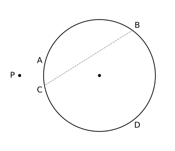
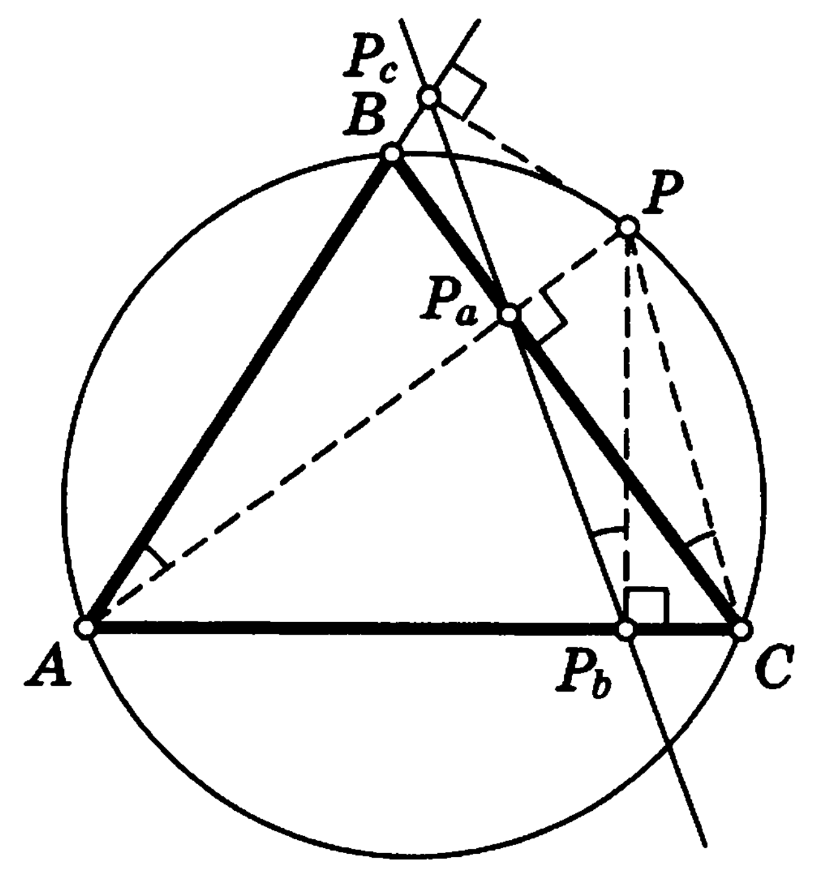
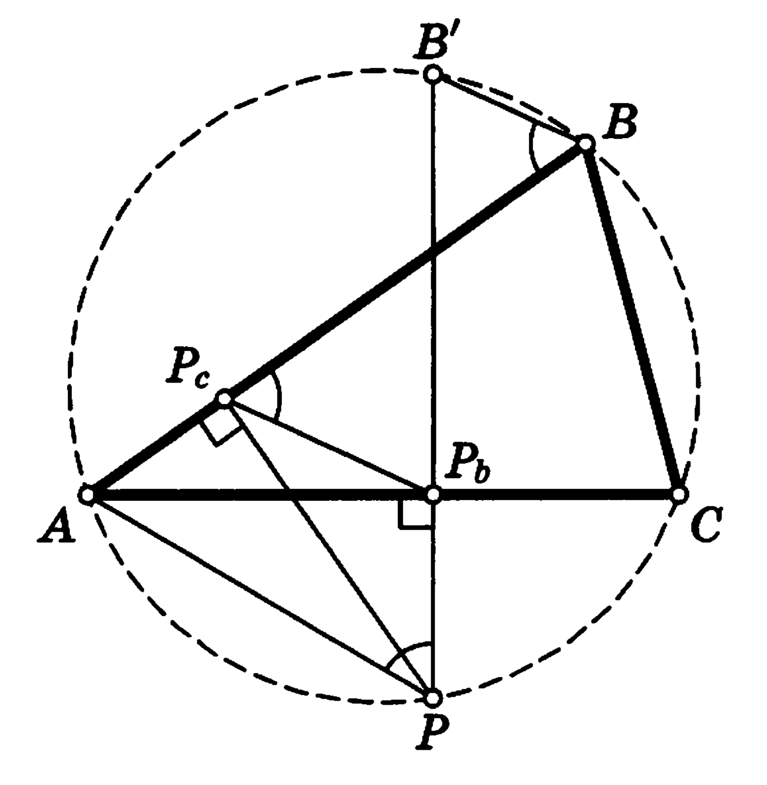

# 拓展内容

## 圆的定理

### 托勒密定理

托勒密定理指出：圆内接凸四边形中，两组对边的乘积之和等于两条对角线的乘积。

$$
AB\cdot CD+AD\cdot BC=AC\cdot BD
$$

广义托勒密定理指出，任意凸四边形左式大于等于右式，取等当且仅当为圆内接。

$$
AB\cdot CD+AD\cdot BC\ge AC\cdot BD
$$

若线段 $AB$ 与 $CD$ 相交于 $M$，则 $A, B, C, D$ 四点共圆等价于 $|MA| \cdot |MB| = |MC| \cdot |MD|$。

### 相交弦定理

圆的两条弦 $AB,CD$ 相交于点 $P$，如图

{ width="50%" }

则

$$
|PA|\cdot|PB|=|PC|\cdot|PD|
$$

如果 $P$ 在圆内也成立。

### 圆幂定理

[TODO]

### 西姆松定理

点 $P$ 到 $\triangle ABC$ 各边的投影共线，当且仅当 $P$ 位于该三角形的外接圆上（如图左）。

{ width="80%" }

{ width="85%" }

斯坦纳线定理：一个三角形外接圆上任意一点（该点不为三角形顶点）关于三角形三边的对称点，这三个对称点是共线的，并且这条直线（称为斯坦纳线）必经过该三角形的垂心。

如右图，假设点 $P$ 位于三角形 $ABC$ 的外接圆上。在外接圆上选择一点 $B'$，使得直线 $PB'$ 垂直于 $AC$。那么 $BB'$ 平行于 $P$ 的西姆松线。

推论：当点 $P$ 沿圆周移动时，西姆松线以弧 $PA$ 变化率的一半的速率向相反方向旋转。

## 二次曲线

### 一般方程

二次曲线（二次平面曲线）是圆锥曲线的别称，本身圆锥曲线就包括我们熟知的椭圆、双曲线、抛物线之外的一些“退化”的图像，但是我们在高中课本中最常讨论的是他们的标准形式，也就是说我们已经将这些退化的图形踢出了，我们为了保持与课本的一定对应关系，我们此处讨论这些退化的，或者更一般的圆锥曲线，统一按照“二次曲线”来称呼。

二次曲线（圆锥曲线）的一般方程：在笛卡尔坐标系内，二元二次方程的图像可以表示圆锥曲线，其一般方程为：

$$
f(x,y)=Ax^2+Bxy+Cy^2+Dx+Ey+F=0
$$

容易发现，一般方程一定可以表示任何一个圆锥曲线（或者退化的圆锥曲线），而标准方程就只能表示中心在原点（对于椭圆和双曲线来讲）、焦点在坐标轴上的一个非常“标准”的圆锥曲线。

五点确定圆锥曲线：

- 我们发现六个系数 $A,B,C,D,E,F$ 齐次于比例，故参数空间是五维。通常情况下，平面上任意五个点，只要没有四个或四个以上的点共线，就能唯一地确定一条圆锥曲线。这条曲线是否退化，取决于这五个点的具体位置。

- 我们不妨带入这五个点（公式略），这是一个有 $5$ 个方程、$6$ 个未知数的齐次线性方程组。根据线性代数理论，这样的方程组总是有非零解。如果解空间的维数是 $1$，那么所有的非零解都是成比例的，它们对应同一条圆锥曲线。

- 五个点唯一确定了一条圆锥曲线。若任意三点不共线，则可以确定唯一一个非退化的圆锥曲线。这五个点的位置关系直接决定了最终曲线的类型。例如，如果五个点构成一个凸五边形，那么它们确定的曲线必定是椭圆。如果一个点“远离”其他四个点，则很可能形成双曲线或抛物线。

一旦通过五个点解出了方程 $Ax^2 + Bxy + Cy^2 + Dx + Ey + F = 0$ 的系数 $A, B, C$，我们就可以通过代数方法来判断其类型。在此之前，我们先引入二次曲线的矩阵形式表达，我们不妨记二次项矩阵为 $Q$：

$$
Q=\bmatrix{A & B/2 \\ B/2 & C}
$$

以及在齐次坐标下的增广矩阵 $M$：

$$
M=\bmatrix{A & B/2 & D/2 \\ B/2 & C & E/2 \\ D/2 & E/2 & F}
$$

这样，二次曲线就可以被表示为：

$$
f(x,y)=\bmatrix{x & y} Q \bmatrix{x \\ y} + \bmatrix{D & E}\bmatrix{x \\ y} + F = 0
$$

或者用齐次坐标下的增广矩阵形式：

$$
f(x,y)=\bmatrix{x & y & 1} M \bmatrix{x \\ y \\ 1} = 0
$$

这里面有经典的三大不变量与一半不变量，我们为了方便书写取一部分（部分字母可能存在差异，这里仅供参考）例如：

$$
\Delta_3=\det M
$$

$$
\Delta_2=\det Q=AC-\dfrac{B^2}{4}
$$

对于后者，我们通常使用它的一个变体，即：

$$
\delta=-4\Delta_2=B^2-4AC
$$

一个二次曲线是否退化是由 $\Delta_3$ 决定的，而其具体的形状是由 $\delta(\Delta_2)$ 决定的：

- 如果 $\Delta_3\neq 0$，则曲线是非退化的（标准的圆锥曲线）。

    - 如果 $\delta<0$ 即 $\Delta_2>0$，则曲线为椭圆。

    - 如果 $\delta=0$ 即 $\Delta_2=0$，则曲线为抛物线。

    - 如果 $\delta>0$ 即 $\Delta_2<0$，则曲线为双曲线。

        特殊的，当 $A+C=0$ 时，其渐近线相互垂直，称为直角双曲线。

- 如果 $\Delta_3=0$，则曲线是退化的（点、一两条线或无图形）。

    - 如果 $\delta<0$ 即 $\Delta_2>0$，一个点或无实数图形。

        这种情况下，通常可以求解中心点坐标 $x_0,y_0$，如果 $f(x_0,y_0)=0$ 就是一个点，否则无实数图形。
    
    - 如果 $\delta=0$ 即 $\Delta_2=0$，两条平行（或重合）直线，或无实数图形。

        由于 $Ax^2+Bxy+Cy^2$ 是一个完全平方，我们知道它是平行直线，且方向向量为 $(\sqrt{C},-\sqrt{A})$，设直线方程为 $\sqrt{A}x+\sqrt{C}y+k=0$，带入原方程消去变量，得到一个关于 $k$ 的二次方程，解出两个 $k$ 即可得到两条平行直线（如果有重根就是一条重合直线，如果无解即为没有实数图形）。

        当 $B=0$ 时，还有一些简单方法，但是意义不大。

    - 如果 $\delta>0$ 即 $\Delta_2<0$，两条相交直线。

        将原方程看作关于 $x$（或 $y$）的二次方程，用求根公式解出 $x$（或 $y$）。

        $$
        \Delta=(By+D)^2-4A(Cy^2+Ey+F)
        $$

        是一个关于 $y$（或 $x$）的完全平方式，开方后会得到两个线性方程。

有一些分类可以用矩阵的秩（$\rank M$）快速解决，但是这过于超纲且难以理解，请自行查阅。

### 对角化

我们知道 $xy$ 项代表坐标轴相对曲线主轴的旋转，旋转角 $\theta$ 记为使新坐标系 $(x',y')$ 下的 $x'y'$ 项系数为零的角度，满足双角公式 $\cot\theta=\dfrac{A-C}{B}$ $\tan 2\theta=\dfrac{B}{A-C}$。我们需要求出新坐标系下的二项次系数，不妨记 $\lambda_1,\lambda_2$ 是矩阵 $Q$ 的特征值，即

$$
\lambda^2-(A+C)\lambda+(AC-B^2/4)=0
$$

或者

$$
\lambda^2-(A+C)\lambda+\Delta_2=0
$$

二次方程变为：

$$
\lambda_1x'^2+\lambda_2y'^2+D'x'+E'y'+F=0
$$

其中 $D',E'$ 是原 $D,E$ 在新坐标系下的分量。

### 消除平移

对于有中心对称的曲线（椭圆、双曲线），其中心 $(x_0,y_0)$ 是函数 $f(x,y)$ 的梯度为零的点，我们列出：

$$
\dfrac{\partial f}{\partial x}=2Ax+By+D=0
$$

$$
\dfrac{\partial f}{\partial y}=Bx+2Cy+E=0
$$

解得：

$$
\left\{\begin{aligned}
x_0&=\dfrac{BE-2CD}{B^2-4AC}&=\dfrac{BE-2CD}{\delta}\\
y_0&=\dfrac{BD-2AE}{B^2-4AC}&=\dfrac{BD-2AE}{\delta}
\end{aligned}\right.
$$

注意到 $\delta=0$ 是显然无解的，这再次说明抛物线没有中心。

### 标准方程

我们先将任一坐标 $(x,y)$ 旋转 $\theta$，然后将坐标原点平移到 $(x_0,y_0)$，即可得到二次曲线的标准方程：

$$
\lambda_1(x'')^2+\lambda_2(y'')^2+F'=0
$$

常数项可以通过将 $(x_0,y_0)$ 带入原方程得到，也有更优雅的公式：

$$
F'=f(x_0,y_0)=\dfrac{\Delta_3}{\Delta_2}
$$

如果二次曲线是椭圆，则根据上面的方程，其参数 $a,b$ 分别为：

$$
\left\{\environment{aligned}{
a^2&=-\dfrac{\Delta_3}{\lambda_1\Delta_2}\\
b^2&=-\dfrac{\Delta_3}{\lambda_2\Delta_2}
}\right.
$$

然后我们就可以按部就班的求出新坐标系下的焦点坐标（求出 $c$ 即可）：

$$
c^2=|a^2-b^2|=\vert{\dfrac{\Delta_3(\lambda_1-\lambda_2)}{\Delta_2\lambda_1\lambda_2}}=\vert{\dfrac{\Delta_3(\lambda_1-\lambda_2)}{\Delta_2^2}}
$$

将焦点坐标变换回原始坐标系即可：

$$
\pmatrix{x\\y}=\pmatrix{\cos\theta&-\sin\theta\\\sin\theta&\cos\theta}\pmatrix{x''\\ y''}+\pmatrix{x_0\\ y_0}
$$

将 $F_{1,2}''$ 的坐标（注意焦点在哪个坐标轴上）代入上式，即可得到原始坐标系下的焦点坐标。

离心率统一公式：

$$
e={\sqrt {\frac {2{\sqrt {(A-C)^{2}+B^{2}}}}{\eta (A+C)+{\sqrt {(A-C)^{2}+B^{2}}}}}}
$$

此处 $\eta=-\sgn\Delta_3$，即 $\Delta_3$ 为负则 $\eta =1$，否则 $\eta=-1$。
