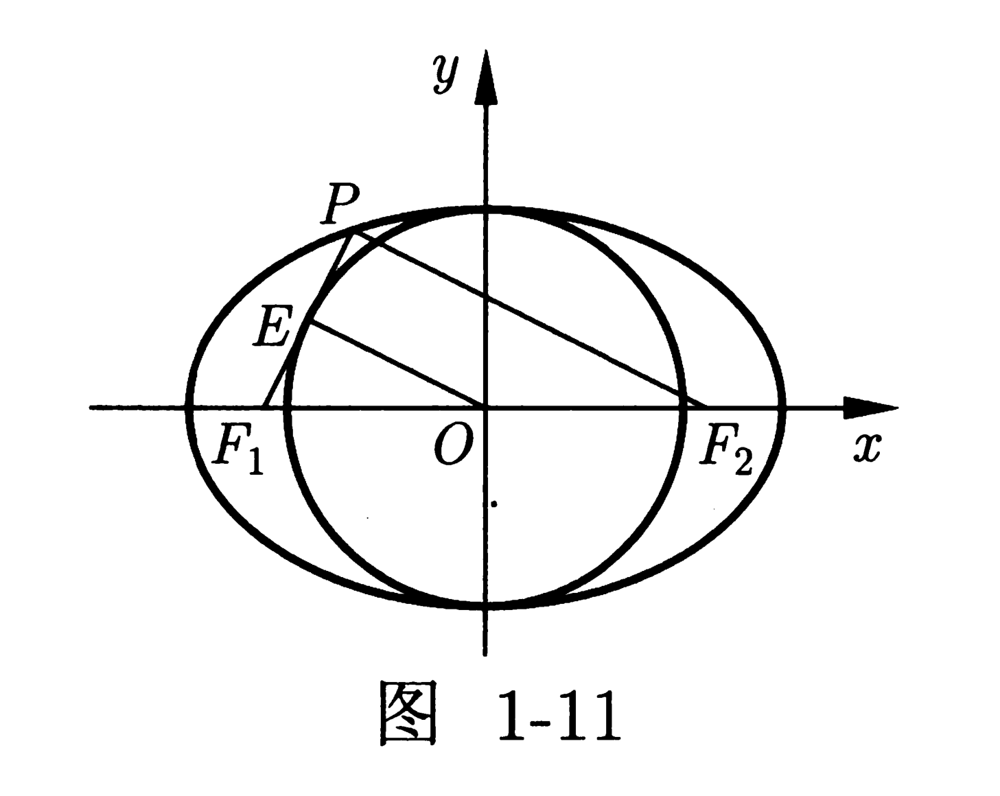
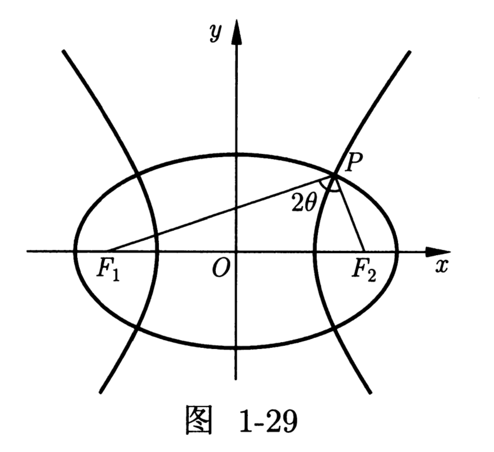
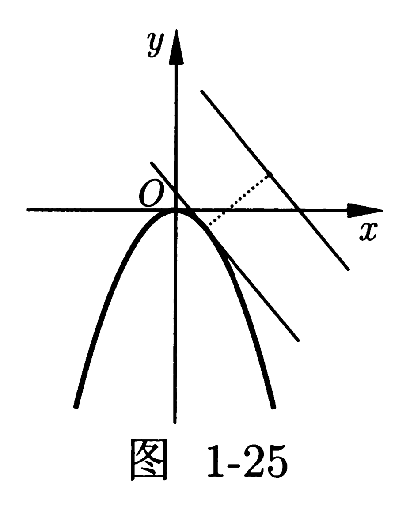
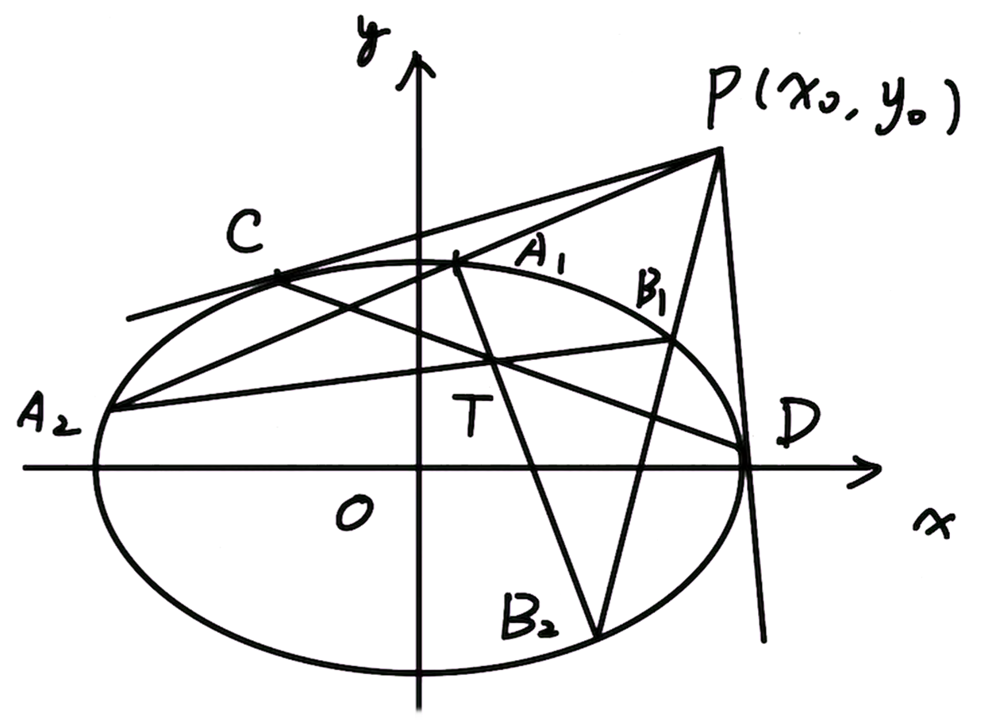
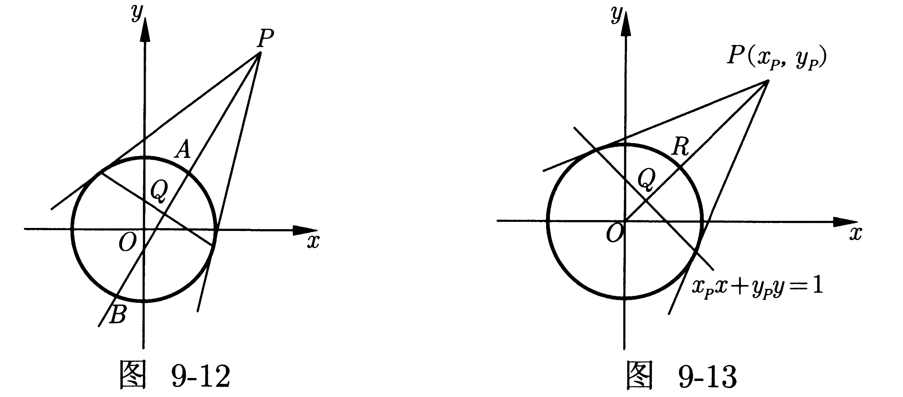

# 解析几何

## 焦点三角形

焦点三角形：由椭圆或者双曲线上的一点及其两个焦点构成的三角形，我们称为焦点三角形。

阿基米德三角形：圆锥曲线的弦与过弦的端点的两条切线所围成的三角形，称为阿基米德三角形。

过抛物线 $x^2=2py(p>0)$ 外的点 $P(x_0,y_0)$ 作抛物线的两条切线 $PA, PB$，设切点分别为 $A, B$，直线 $AB$ 与 $y$ 轴交于点 $Q$，则有：

- $k_{AB} \cdot k_{PQ} = \dfrac{2y_0}{p}$；

- $k_{PA} \cdot k_{PB} = \dfrac{2y_0}{p}$；

- 若 $M$ 为弦 $AB$ 的中点，则 $PM$ 与抛物线的轴平行（或重合）；

- $PM$ 的中点 $R$ 在抛物线上，且点 $R$ 处的切线与 $AB$ 平行。

### 周长问题

焦点三角形的周长与圆锥曲线的定义之间存在着紧密联系。

- 已知 $F_1, F_2$ 分别为椭圆 $\dfrac{x^2}{a^2} + \dfrac{y^2}{b^2} = 1(a > b > 0)$ 的左、右焦点，$l$ 过焦点 $F_1$ 且与椭圆交于 $A, B$ 两点，则 $\triangle F_2AB$ 的周长恒为定值 $4a$；

- 已知 $F_1, F_2$ 分别为椭圆 $\dfrac{x^2}{a^2} + \dfrac{y^2}{b^2} = 1(a > b > 0)$ 的左、右焦点，$P$ 是椭圆上的动点，则 $\triangle PF_1F_2$ 的周长恒为定值 $2a + 2c$。

    

- 已知 $F_1, F_2$ 分别是双曲线 $\dfrac{x^2}{a^2} - \dfrac{y^2}{b^2} = 1(a > 0, b > 0)$ 的左、右焦点，$l$ 过焦点 $F_1$ 且与双曲线交于 $A, B$ 两点，则 $|AF_2| + |BF_2| - |AB| = 4a$。

    

### 面积问题

- 已知 $F_1, F_2$ 为椭圆 $\dfrac{x^2}{a^2} + \dfrac{y^2}{b^2} = 1(a > b > 0)$ 的两个焦点，$M$ 是椭圆上的动点，则 $\triangle MF_1F_2$ 的面积 $S = c|y_M| = b^2 \tan\dfrac{\angle F_1MF_2}{2}$。

- 已知 $F_1, F_2$ 为双曲线 $\dfrac{x^2}{a^2} - \dfrac{y^2}{b^2} = 1(a > 0, b > 0)$ 的两个焦点，$M$ 是双曲线上的动点，则 $\triangle MF_1F_2$ 的面积 $S = c|y_M| = \dfrac{b^2}{\tan\dfrac{\angle F_1MF_2}{2}}$。

内切圆即角平分线与面积也有着很大的关联：

- $P$ 是椭圆 $\dfrac{x^2}{a^2} + \dfrac{y^2}{b^2} = 1(a > b > 0)$ 上的动点，$\triangle PF_1F_2$ 的内切圆为圆 $I$，半径为 $r$，则 $S_{\triangle PF_1F_2} = r(a+c)$。

- 设椭圆 $\dfrac{x^2}{a^2} + \dfrac{y^2}{b^2} = 1(a > b > 0)$ 的左、右焦点分别为 $F_1, F_2$，过焦点 $F_1$ 的直线交椭圆于 $A, B$ 两点，$\triangle AF_2B$ 的内切圆为圆 $I$，半径为 $r$，则 $S_{\triangle AF_2B} = 2ar$。

    

- 已知 $P$ 是双曲线 $\dfrac{x^2}{a^2} - \dfrac{y^2}{b^2} = 1(a > 0, b > 0)$ 上的动点，$\triangle PF_1F_2$ 的内切圆的圆心为 $I(x_0, y_0)$，则 $|S_{\triangle PIF_1} - S_{\triangle PIF_2}| = \dfrac{S_{\triangle F_1IF_2}}{e}$，$|x_0| = a$。

    

### 中点问题

在圆锥曲线的选择与填空题中，若有中点这样的信息出现，就要联想到原点并连接原点与该点，构造中位线。因为原点是椭圆和双曲线的中心，是两焦点的天然中点。

{ width="40%" }

根据推导可以发现，焦点在 $x$ 轴上的抛物线（开口向左、右）外一点，纵坐标是切点纵坐标的算数平均值，横坐标是切点横坐标的几何平均值。

### 转换问题

- 我们注意到，如果 $P$ 在椭圆上，那么 $PF_2=2a-PF_1$，这暗示我们可以对 $PF_1$ 与令一点 $A$ 应用两边之和大于第三边的同时，对 $PF_2=2a-PF_1$ 应用两边之差小于第三边，同样可以得到求和的形式。

- 设 $A$ 为椭圆上的动点，且 $F$ 为椭圆的一个焦点，P为不在椭圆上的一定点，则 $|PA|+|PF|$ 的最值的求法是先利用三角不等式，判断等号成立的条件是否成立？若不成立，则利用另外一个焦点进行转化。

设椭圆方程为 $\dfrac{x^2}{a^2} + \dfrac{y^2}{b^2} = 1(a > b > 0)$，$F_1, F_2$ 分别为椭圆的左、右焦点，平面上一定点 $Q(x_0, y_0)$，$M$ 为椭圆上任意一点。

- 定点 $Q(x_0, y_0)$ 在椭圆内部，则 $2a - |QF_1| \le |MF_2| + |MQ| \le 2a + |QF_1|$；
- 定点 $Q(x_0, y_0)$ 在椭圆外部，则 $|QF_2| \le |MF_2| + |MQ| \le 2a + |QF_1|$。

设双曲线方程为 $\dfrac{x^2}{a^2} - \dfrac{y^2}{b^2} = 1(a > 0, b > 0)$，$F_1, F_2$ 分别为双曲线的左、右焦点，平面上一定点 $Q(x_0, y_0)$，$M$ 为双曲线右支上任意一点。

- 若定点 $Q(x_0, y_0)$ 与双曲线右焦点 $F_2$ 在双曲线右支的同侧，则 $|MQ| + |MF_2|$ 的最小值是 $|QF_1| - 2a$，最大值不存在；
- 若定点 $Q(x_0, y_0)$ 与双曲线右焦点 $F_2$ 在双曲线右支的异侧，则 $|MQ| + |MF_2|$ 的最小值是 $|QF_2|$，最大值不存在。

- 不仅第一定义，我们也可以利用第二定义进行转化，把距离焦点的距离转化为距离准线的距离乘上离心率 $e$。

- 设 $A$ 为抛物线上的动点，且 $F$ 为焦点，$P$ 为不在抛物线上的一定点，则 $|PA| + |PF|$ 的最值的求法是先利用三角不等式，判断等号成立的条件是否成立。若不成立，则利用准线进行转化。

### 解三角形

重心：在椭圆 $\dfrac{x^2}{a^2} + \dfrac{y^2}{b^2} = 1(a>b>0)$ 的焦点三角形 $PF_1F_2$ 中，点 $G$ 是 $\triangle PF_1F_2$ 的重心，则重心的轨迹在一个椭圆上。

内心：在椭圆 $\dfrac{x^2}{a^2} + \dfrac{y^2}{b^2} = 1(a>b>0)$ 的焦点三角形 $PF_1F_2$ 中，点 $I$ 是 $\triangle PF_1F_2$ 的内心，$PI$ 的延长线交线段 $F_1F_2$ 于点 $N$，则 $\dfrac{|PI|}{|IN|} = \dfrac{1}{e}$。（其中 $e$ 为椭圆的离心率）

### 共焦点型

共焦点的关键在于两个：$c$ 相等与定义。

例如椭圆 $a_1,b_1,c$ 和双曲线 $a_2,b_2,c$ 共焦点 $F_1,F_2$，且一交点为 $P$ 不难写出

$$
\begin{cases}
PF_1+PF_2&=2a_1\\
PF_1-PF_2&=2a_2
\end{cases}
$$

也就是说

$$
\begin{cases}
PF_1&=a_1+a_2\\
PF_2&=a_1-a_2
\end{cases}
$$

我们可以列一个表格

| | $a$ | $b$ | $c$ |
| :-: | :-: | :-: | :-: |
| 椭圆 | $a_1=$ | $b_1=$ | $c=$ |
| 双曲线 | $a_2=$ | $b_2=$ | $c=$ |

已知 $F_1, F_2$ 是椭圆 $C_1$ 与双曲线 $C_2$ 的公共焦点，$e_1, e_2$ 分别是 $C_1, C_2$ 的离心率。若点 $P$ 为 $C_1, C_2$ 的公共点，$\angle F_1PF_2 = 2\theta$，则 $\dfrac{\sin^2\theta}{e_1^2} + \dfrac{\cos^2\theta}{e_2^2} = 1$。

{ width="40%" }

## 最值问题

### 距离最值

将直线 $\ell$ 平移到与曲线相切的位置，得到曲线的一条与直线 $\ell$ 平行的切线 $\ell'$，此时直线 $\ell$ 与 $\ell'$ 之间的距离即为曲线与 $\ell$ 距离的最值。

{ width="30%" }

### 长度最值

- $F$ 为椭圆 $\dfrac{x^2}{a^2} + \dfrac{y^2}{b^2} = 1(a > b > 0)$ 的一个焦点，若 P 是椭圆上的点，则 $a - c \le |PF| \le a + c$。

- $F$ 为双曲线 $\dfrac{x^2}{a^2} - \dfrac{y^2}{b^2} = 1(a > 0, b > 0)$ 的右焦点，若 P 是双曲线右支上的动点，则 $|PF| \ge c - a$。若 P 是双曲线左支上的动点，则 $|PF| \ge c + a$。

### 角度最值

- $F_1, F_2$ 为椭圆 $\dfrac{x^2}{a^2} + \dfrac{y^2}{b^2} = 1(a > b > 0)$ 的左、右焦点，$P$ 是椭圆上的动点，当且仅当 $P$ 为上、下顶点时，$\angle F_1PF_2$ 最大。

- $A, B$ 为椭圆 $\dfrac{x^2}{a^2} + \dfrac{y^2}{b^2} = 1(a > b > 0)$ 的左、右顶点，$P$ 是椭圆上的动点，当且仅当 $P$ 为上、下顶点时，$\angle APB$ 最大。

对于讨论垂直关系，更常用向量和斜率，或者勾股定理、射影定理等。

### 离心率值

离心率的问题本质就是 $a,b,c$ 的比值问题，但是对于最值有一些特殊的方法。

- 已知 $F_1, F_2$ 为椭圆 $\dfrac{x^2}{a^2} + \dfrac{y^2}{b^2} = 1(a > b > 0)$ 的左、右焦点，$P$ 是椭圆上的动点，则椭圆离心率的取值范围为 $\sin\dfrac{\angle F_1PF_2}{2} \le e < 1$。

    证明：设 $B$ 为椭圆的上顶点。

    $$
    e=\dfrac{c}{a}=\sin\dfrac{\angle F_1BF_2}{2}\ge\dfrac{\angle F_1PF_2}{2}
    $$

- 已知 $F_1, F_2$ 为椭圆 $\dfrac{x^2}{a^2} + \dfrac{y^2}{b^2} = 1(a > b > 0)$ 的左、右焦点，$P$ 是椭圆上的动点，$\angle PF_1F_2 = \alpha, \angle PF_2F_1 = \beta$，则椭圆的离心率 $e = \dfrac{\sin(\alpha + \beta)}{\sin\alpha + \sin\beta}$。

    证明：根据正弦定理

    $$
    \dfrac{m}{\sin\beta}=\dfrac{n}{\sin\alpha}=\dfrac{2c}{\sin(\alpha+\beta)}
    $$

    整理得到

    $$
    \dfrac{2c}{\sin(\alpha+\beta)}=\dfrac{n+m}{\sin\alpha+\sin\beta}=\dfrac{2a}{\sin\alpha+\sin\beta}
    $$

    也就是说

    $$
    e=\dfrac{c}{a}=\dfrac{\sin(\alpha+\beta)}{\sin\alpha+\sin\beta}
    $$

- 已知 $F_1, F_2$ 为双曲线 $\dfrac{x^2}{a^2} - \dfrac{y^2}{b^2} = 1(a > 0, b > 0)$ 的左、右焦点，$P$ 是双曲线上的动点，若 $\angle PF_1F_2 = \alpha, \angle PF_2F_1 = \beta$，则双曲线的离心率 $e = \dfrac{\sin(\alpha + \beta)}{|\sin\alpha - \sin\beta|}$。

## 轨迹问题

要求轨迹方程，即得到方程式；要求轨迹，则用对应的定义来描述一个曲线。

### 直接求法

若动点的轨迹与某一类圆锥曲线的定义吻合，可直接根据定义来求。

- 定圆上一动点和圆内一定点的垂直平分线与其半径的交点的轨迹是椭圆。
- 定圆上一动点与圆外一定点的垂直平分线与其半径的交点的轨迹是双曲线。

### 间接求法

直译法：

- 通常是给出直线或点的关系。

- 我们设轨迹上一点 $P(x,y)$，列出 $x,y$ 满足的调节，化简即可。

参数法：

- 如果动点本身所满足的条件式中含有一个参数，或在运动过程中受到某个变量的制约，那么以此变量为参数，建立轨迹的参数方程，再设法消去参数，即可得到轨迹的方程。

- 如果动点是两条曲线的交点，则其坐标同时满足两个曲线万程，那么消去辅助量，即可求得动点的轨迹。

相关点法：

- 动点满足的限制条件不容易直接列出等式，但是动点随着另—相关点的运动而运动。

- 这时可用动点（所求点）坐标表示相关点（已知点）的坐标，根据相关点所满足的方程求得动点的轨迹方程。

### 空间轨迹

空间点的轨迹的求解绝大多数都需要把平面知识类比到空间来处理，例如：中垂线类比到中垂面，角平分线类比到角平分面。

当几何体中是—个规则的图形且几何关系比较明确的时候，则通过建立空间直角坐标系把几何问题转化为代数运算来处理。

几何定义：详见圆曲初步——圆锥截线。

## 定点问题

### 简单定点

- 根据特殊直线、对称性猜定点。

    对称性：关于轴对称，则对称过去交于一点。

- 证明定点，或用恒成立求顶点。

    证明，不妨表示直线上两点 $A,B$，用猜出的 $M$ 坐标验证 $k_{AM}=k_{MB}$。

参变分离法：求定点

$$
(3k+1)x+2ky+4k-3=0
$$

不妨令 $k$ 为主元，

$$
(3x+2y+4)k+x-3=0
$$

因此令

$$
\begin{cases}
3x+2y+4&=0\\
x-3&=0
\end{cases}
$$

因此定点 $\paren{3,-\dfrac{13}{2}}$。

对于含参且参数的次数都是 $1$ 的，不妨以参数为主元，令常数和系数都为零。

### 基本框架

若点 $P$ 是圆锥曲线 $C$ 上一定点，$A,B$ 是 $C$ 上两个动点，则我们有如下框架图：

$$
k_{PA} + k_{PB} = 0 \iff k_{AB} \scriptsize \text{ 为定值}
$$

点 $P$ 是坐标轴上异于圆锥曲线 $C$ 的顶点的一定点，直线 $\ell$ 交 $C$ 于 $A,B$ 两点，则我们有如下框架图：

$$
k_{PA} + k_{PB} = 0 \iff \ell \scriptsize \text{ 过定点}
$$

直线 $\ell$ 与圆锥曲线 $C$ 相交于 $A,B$ 两点，$P$ 是直线外一点，则我们有如下框架图：

$$
k_{PA} + k_{PB} = \lambda(\lambda \ne 0) \iff \ell \scriptsize \text{ 过定点}
$$

已知 $A, B$ 是圆锥曲线 $C$ 上两动点，$M$ 是一定点，其中 $\alpha, \beta$ 分别为 $MA, MB$ 的倾斜角，则有以下等价：

$$
\begin{cases}
AB \text{\scriptsize{ 恒过定点}}\\
\overrightarrow{MA} \cdot \overrightarrow{MB} \text{\scriptsize{ 为定值}} \\
k_{MA} \cdot k_{MB} \text{\scriptsize{ 为定值}} \\
\alpha + \beta = \theta(0 < \theta < \pi)
\end{cases}
$$

### 极点极线

过椭圆外一点 $P(x_0,y_0)$ 做两条切线 $PC,PD$，容易知道

$$
\ell_{CD}:\dfrac{x_0x}{a^2}+\dfrac{y_0y}{b^2}=1
$$

而我们不妨做两条 $\angle CPD$ 内的线，分别与椭圆交于 $A_1,A_2$ 与 $B_1,B_2$ 点，如图。

{ width="50%" }

我们发现 $A_2B_1,A_1B_2$ 相交于 $T$，且 $T$ 在 $CD$ 上。

互极：设 $ABCD$ 是椭圆

$$
\frac{x^2}{a^2} + \frac{y^2}{b^2} = 1
$$

的内接四边形，对边 $AB$，$CD$ 交于点 $P(x_1, y_1)$，对边 $AD$，$BC$ 交于点$Q(x_2, y_2)$，对角线 $AC$，$BD$ 交于点 $R(x_3, y_3)$，则 $P,Q,R$ 三点满足：

其中任意两点确定的直线，恰为以第三点为极点关于椭圆的极线。即：对任意 $i, j = 1,2,3, i \ne j$，我们有

$$
\frac{x_i x_j}{a^2} + \frac{y_i y_j}{b^2} = 1
$$

{ width="60%" }

如图 9-12 所示，已知 $P(x_P, y_P)$ 和圆 $x^2 + y^2 = 1$，过点 $P$ 任作一割线交圆于 $A,B$ 两点，交 $\ell : x_Px + y_Py = 1$ 于点 $Q$，则

$$
\begin{aligned}
\dfrac{PA}{PB} = \dfrac{QA}{QB}\\
\dfrac{2}{PQ} = \dfrac{1}{PA} + \dfrac{1}{PB}
\end{aligned}
$$

同时，点 $P$ 关于圆 $x^2 + y^2 = 1$ 的极线经过点 $Q$ 当且仅当点 $Q$ 关于圆 $x^2 + y^2 = 1$ 的极线经过点 $P$。

如图 9-13 所示，特别地，若 $PQ$ 经过圆心并交圆于 $R$，则有 $|OR|^2 = |OP|\cdot|OQ|$。反之，若 $|OR|^2 = |OP|\cdot|OQ|$，则 $Q$ 落在点 $P$ 的极线 $x_Px + y_Py = 1$ 上。

{ width="80%" }

对于一般的圆锥曲线，将切线方程直接搬过来，就是极线方程，也有上面的两条性质。

## 联立直线

双曲线联立直线，一定要先把一般方程化为整式。

注意直线不一定都可以表示为 $y=kx+b$，平行于 $y$ 轴的斜率不存在。

若直线过曲线的左顶点或者右顶点，我们应该设直线方程为 $x = ty + m$；若直线过曲线的上顶点或者下顶点，我们应该设直线方程为 $y = kx + m$。

若直线过曲线的顶点，一般来说我们都将另—个交点的坐标求出。

### 椭圆联立

椭圆与直线有三种情况，相切、相交、相离

我们设椭圆的一般方程

$$
\dfrac{x^2}{a^2}+\dfrac{y^2}{b^2}=1
$$

不妨先化为整式

$$
b^2x^2+a^2y^2=a^2b^2
$$

设直线方程为 $y=kx+m$，带入

$$
\begin{aligned}
b^2x^2+a^2(kx+m)^2&=a^2b^2\\
b^2x^2+a^2(k^2x^2+m^2+2kmx)&=a^2b^2
\end{aligned}
$$

化简得到

$$
(b^2+a^2k^2)x^2+2kma^2x+a^2m^2-a^2b^2=0
$$

我们知道

$$
\begin{aligned}
\Delta&=4k^2m^2a^4-4a^2(m^2-b^2)(b^2+a^2k^2)\\
&=4a^2[k^2m^2a^2-(m^2-b^2)(b^2+a^2k^2)]\\
&=4a^2b^2(b^2+a^2k^2-m^2)
\end{aligned}
$$

- 相交：$b^2+a^2k^2-m^2\ge0$。
- 相切：$b^2+a^2k^2-m^2=0$。
- 相离：$b^2+a^2k^2-m^2<0$。

如果相交，此时两交点之间的距离有

$$
\begin{aligned}
|AB|&=\sqrt{k^2+1}\cdot|x_a-x_b|\\
&=\sqrt{k^2+1}\cdot\dfrac{2ab\sqrt{b^2+a^2k^2-m^2}}{b^2+a^2k^2}
\end{aligned}
$$

前者为硬解定理，后者为弦长公式。

直线 $\ell:y = kx + m$ 与曲线相交于 $A, B$，若弦长或三角形的面积已知，则斜率 $k$ 与 $m$ 必定满足某一个方程。

### 双曲线联立

根据双曲线的两条渐近线，因此双曲线与直线有也有三种情况，相切、相交、相离

我们设双曲线的一般方程

$$
\dfrac{x^2}{a^2}-\dfrac{y^2}{b^2}=1
$$

不妨先化为整式

$$
b^2x^2-a^2y^2=a^2b^2
$$

设直线方程为 $y=kx+m$，带入

$$
\begin{aligned}
b^2x^2-a^2(kx+m)^2&=a^2b^2\\
b^2x^2-a^2(k^2x^2+m^2+2kmx)&=a^2b^2
\end{aligned}
$$

化简得到

$$
(b^2-a^2k^2)x^2-2kma^2x-a^2m^2-a^2b^2=0
$$

我们分类讨论二项式系数

/// note | 如果 $b^2=a^2k^2$
即 $k=\pm\dfrac{b}{a}$，此时

$$
2kma^2x+a^2m^2+a^2b^2=0
$$

此时

- 若 $m\neq0$，则有一个交点

- 若 $m=0$，则无焦点。

我们注意到这个 $k$ 就是渐近线斜率，也就是说平行于渐近线最多只有一个焦点。
///

/// note | 如果 $b^2\neq a^2k^2$
则讨论二次函数

$$
\begin{aligned}
\Delta&=4k^2m^2a^4+4a^2(m^2+b^2)(b^2-a^2k^2)\\
&=4a^2[k^2m^2a^2+(m^2+b^2)(b^2-a^2k^2)]\\
&=4a^2b^2(b^2-a^2k^2+m^2)
\end{aligned}
$$

- 相交：$b^2-a^2k^2+m^2\ge0$。
- 相切：$b^2-a^2k^2+m^2=0$。
- 相离：$b^2-a^2k^2+m^2<0$。

如果相交，此时两交点之间的距离有

$$
\begin{aligned}
|AB|&=\sqrt{k^2+1}\cdot|x_a-x_b|\\
&=\sqrt{k^2+1}\cdot\dfrac{2ab\sqrt{b^2-a^2k^2+m^2}}{|b^2-a^2k^2|}
\end{aligned}
$$

前者为硬解定理，后者为弦长公式。
///

注意，如果直线与双曲线有一个交点，则可能有两种情况。

### 抛物线联立

不妨设抛物线

$$
y^2=2px
$$

联立直线 $y=kx+m$，得到

$$
k^2x^2+(2km-2p)x+m^2=0
$$

若 $k=0$，则有一个交点。

若 $k\neq0$，我们知道

$$
\Delta=4p^2-8kmp=4p(p-2km)
$$

因此：

- 若 $p-2km\ge0$：相交。

- 若 $p-2km=0$：相切。

- 若 $p-2km<0$：相离。

同样有弦长公式

$$
\begin{aligned}
|AB|&=\sqrt{k^2+1}\cdot|x_a-x_b|\\
&=\sqrt{k^2+1}\cdot\dfrac{\sqrt{p(p-2km)}}{k^2}
\end{aligned}
$$

如果我们知道直线与 $x$ 轴的交点，例如过抛物线的焦点，不妨设直线方程 $x=ky+m$，联立的时候直接带入，得到

$$
y^2-2pky-2pm=0
$$

此时就可以避免平方了。

### 硬解定理

### 设而不求

通过合适的设，可以大大简化计算量。

例题：（2011 江苏）已知椭圆 $\dfrac{x^2}{4} + \dfrac{y^2}{2} = 1$，过坐标原点的直线交椭圆于 $P, A$ 两点，其中点 $P$ 在第一象限，过点 $P$ 作 $x$ 轴的垂线，垂足为 $C$，连接 $AC$ 并延长交椭圆于点 $B$，设直线 $PA$ 的斜率为 $k$，证明：对任意 $k > 0$，求证：$PA \perp PB$。

注意到本题中，点 $P$ 与点 $A$ 关于原点对称，点 $C$ 是点 $P$ 在 $x$ 轴上的射影。而且我们知道求出来的点 $P$ 的横坐标比较复杂（需要开方），所以干脆不去求，直接设 $P(m, km)$。则立即能知道 $A(-m, -km), C(m, 0)$。因而可以求得直线 $AC$ 的斜率为 $k_{AC} = \dfrac{km}{2m} = \dfrac{k}{2}$。此时可设直线 $AC$ 的方程为 $y = \dfrac{k}{2}(x - m)$。联立直线 $AC$ 和椭圆方程，消去变量 $y$ 并整理可得

$$
\begin{cases}
\dfrac{x^2}{4} + \dfrac{y^2}{2} = 1 \\
y = \dfrac{k}{2}(x - m)
\end{cases}
\Rightarrow (k^2 + 2)x^2 - 2mk^2x + k^2m^2 - 8 = 0
$$

由韦达定理得 $x_B + x_A = \dfrac{2mk^2}{k^2 + 2}$，因为 $x_A = -m$。因此有 $x_B = \dfrac{2mk^2}{k^2 + 2} + m = \dfrac{3mk^2 + 2m}{k^2 + 2}$，代入直线 $AC$ 得

$$
y_B = \dfrac{k}{2}\left(\dfrac{3mk^2 + 2m}{k^2 + 2} - m\right) = \dfrac{mk^3}{k^2 + 2}
$$

最后一步就是去求 $PB$ 的斜率，则有

$$
k_{PB} = \dfrac{\dfrac{mk^3}{k^2 + 2} - km}{\dfrac{3mk^2 + 2m}{k^2 + 2} - m} = -\dfrac{1}{k}
$$

所以 $PA \perp PB$。
