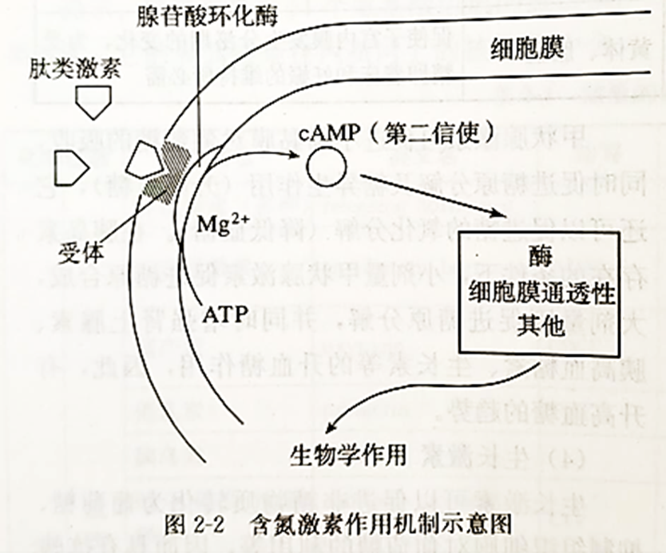

# 体液调节

## 调节概述

### 激素调节

人和高等动物体内都分布着许多能分泌物质的腺体，在这些分泌腺中，

- 凡是分泌物经由导管而流出体外或流到消化腔的，称为外分泌腺，如汗腺、唾液腺、胃腺等。

- 凡是没有导管的腺体，其分泌物（激素）进入腺体内的毛细血管，并随血液循环输送到全身各处的，称为内分泌腺。

机体除了神经调节，还存在由内分泌器官或细胞分泌的化学物质——激素进行调节的方式，就是激素调节。

激素的发现（第一种发现的激素——促胰液素）：

- 提出问题：胰腺能分泌胰液。胰液通过导管注入小肠，其中的酶用来消化食物。胰液的分泌是如何调节的呢？

- 实验发现：把稀盐酸注入狗的上段小肠肠腔内，会引起胰腺分泌胰液。若直接将稀盐酸注入狗的血液中则不会引起胰液的分泌。切除了通向该段小肠的神经，只留下血管，再向小肠内注入稀盐酸，发现这样仍能促进胰液分泌。

- 作出假设：这不是反射而是化学调节。在盐酸的作用下，小肠黏膜细胞可能产生了一种化学物质，这种物质进入血液后，随血流到达胰腺，引起胰液的分泌。

- 验证假设：他们把狗的一段小肠剪下，刮下黏膜，将稀盐酸加入黏膜磨碎，并制成提取液。将提取液**注射到同一条狗的静脉中**，发现能促进胰腺分泌胰液。

- 这证明假设是正确的，小肠黏膜分泌的这种化学物质称作促胰液素。注意：这个实验只能证明促胰液素可以使胰腺分泌胰液，实际上，神经调节同样可以促进胰腺分泌胰液。

研究内分泌腺及其分泌激素功能的方法：

<table class="tg"><thead>
  <tr>
    <th class="tg-mro8 no-wrap">研究方法</th>
    <th class="tg-61sv">摘除法（植入法）</th>
    <th class="tg-61sv">饲喂法</th>
    <th class="tg-61sv">注射法</th>
  </tr></thead>
<tbody>
  <tr>
    <td class="tg-c7ow">实验方法</td>
    <td class="tg-c7ow">①摘除内分泌腺</td>
    <td class="tg-c7ow">①饲喂动物激素</td>
    <td class="tg-c7ow">①注射动物激素</td>
  </tr>
  <tr>
    <td class="tg-c7ow">适用范围</td>
    <td class="tg-c7ow">所有内分泌腺</td>
    <td class="tg-c7ow">非蛋白质或多肽类激素</td>
    <td class="tg-c7ow">所有激素</td>
  </tr>
  <tr>
    <td class="tg-c7ow">实验目的</td>
    <td class="tg-c7ow">验证或探究某种内分泌腺的生理作用</td>
    <td class="tg-c7ow" colspan="2">验证或探究某种激素的生理作用</td>
  </tr>
  <tr>
    <td class="tg-c7ow">实验设计</td>
    <td class="tg-3f42">②不摘除内分泌腺（手术但不摘除） ③对摘除内分泌腺的实验组植入内分泌腺（或补充激素）</td>
    <td class="tg-3f42">②不饲喂动物激素（饲喂等量正常饲料） ③施加动物激素抑制剂</td>
    <td class="tg-3f42">②不注射动物激素（注射等量生理盐水） ③施加动物激素抑制剂</td>
  </tr>
</tbody></table>

### 调节特点

各种激素的化学结构不同，生理作用各异，但它们的作用方式却有着一些共同的特性。

- 通过体液进行运输：内分泌腺没有导管，内分泌细胞产生的激素弥散到体液中，随血液流到全身，传递着各种信息。临床上常通过抽取血样来检测内分泌系统中激素的水平。

- 作用于靶器官、靶细胞：众多的激素分子弥散在全身的体液中，甲状腺激素几乎对全身的细胞都起作用，而促甲状腺激素只作用于甲状腺。能被特定激素作用的器官、细胞，就是该激素的靶器官、靶细胞。激素选择靶细胞，是通过与靶细胞上的特异性受体相互识别，并发生特异性结合实现的。

- 作为信使传递信息：激素种类多、量极微，既不组成细胞结构，又不提供能量，也不起催化作用，而是随体液到达靶细胞，使靶细胞原有的生理活动发生变化。激素是调节生命活动的信息分子，一经靶细胞接受并起作用后就失活了。因此，体内需要源源不断地产生激素，以维持激素含量的动态平衡。

- 微量和高效：在正常生理状态下，血液中的激素浓度都很低。虽然激素含量甚微，但其作用效果极其显著。激素是人和动物体内微量、高效的生物活性物质。因此，一旦体内激素含量偏离了生理范围，就会严重影响机体机能。

激素种类多、量极微，既不组成细胞结构，又不提供能量，也不起催化作用，而是随体液到达靶细胞，使靶细胞原有的生理活动发生变化。

在机体内，往往多种激素共同参与调节同一生理功能，各种激素彼此关联，相互影响。例如，胰高血糖素、甲状腺激素、肾上腺素等均可升高血糖，它们通过作用于不同环节，在提高血糖浓度上具有协同作用；而胰岛素则降低血糖，与上述激素的升糖效应相抗衡。

### 调节功能

激素等化学物质，通过体液传送的方式对生命活动进行调节，称为体液调节。激素调节是体液调节的主要内容。

除激素外，其他一些化学物质，如组胺、某些气体分子（$\ce{NO}$、$\ce{CO}$ 等）以及一些代谢产物（如 $\ce{CO2}$），也能作为体液因子对细胞、组织和器官的功能起调节作用。$\ce{CO2}$ 是调节呼吸运动的重要体液因子。体液中 $\ce{CO2}$ 浓度变化会刺激相关感受器，从而通过神经系统对呼吸运动进行调节。临床上给患者输入 $\ce{O2}$ 时，往往采用含有 $5\%$ 左右的 $\ce{CO2}$ 的混合气体，以达到刺激呼吸中枢的目的。

在人和高等动物体内，体液调节和神经调节都是机体调节生命活动的重要方式，它们相辅相成，各具优势。

| 比较项目 | 作用途径 | 反应速度 | 作用范围 | 作用时间 |
| :-: | :-: | :-: | :-: | :-: |
| 体液调节 | 体液运输 | 较缓慢 | 较广泛 | 比较长 |
| 神经调节 | 反射弧 | 迅速 | 准确、比较局限 | 短暂 |

在人和高等动物体内，体液调节和神经调节的联系可概括为以下两个方面。

- 一方面，不少内分泌腺直接或间接地受中枢神经系统的调节，在这种情况下，体液调节可以看作是神经调节的一个环节。

- 另一方面，内分泌腺分泌的激素也可以影响神经系统的发育和功能。

总之，人和高等动物体的各项生命活动常常同时受神经和体液的调节。正是由于这两种调节方式的配合，各器官、系统的活动才能协调一致，内环境的稳态才得以维持，各项生命活动才能正常进行，机体才能适应环境的不断变化。

### 内分泌系统

内分泌系统由相对独立的内分泌腺以及兼有内分泌功能的细胞共同构成。

- 有的内分泌细胞聚集在一起成为内分泌腺体。

- 也有的内分泌细胞分散在一些器官、组织内，如在小肠黏膜上有分泌促胰液素等的众多内分泌细胞。

- 下丘脑中的某些神经细胞，也具有内分泌功能。

内分泌系统是由内分泌腺以及兼有内分泌功能的细胞共同构成的，内分泌腺主要包括垂体、甲状腺、肾上腺、胰岛和性腺等，它们分泌的各类激素参与生命活动的调节。

激素的化学本质：大部分激素是蛋白质或多肽，另外还有氨基酸衍生物、类固醇。

- 甲状腺激素：含碘氨基衍生物。

- 肾上腺素：氨基酸衍生物。

- 皮质类激素、性激素：类固醇。

内分泌系统是机体整体功能的重要调节系统。各种内分泌腺间具有复杂的功能联系，共同调节机体活动，包括维持内环境稳定、调节物质和能量代谢、调控生长发育和生殖等。

具体的内分泌腺及其分泌的激素，我们在下一节详细分解。

## 激素概述

### 调节方式

反馈调节：

- 反馈方式：负反馈、正反馈。

    负反馈：结果抑制条件，有利于维持稳态，因此大部分反馈都是负反馈。

    正反馈：结果促进条件，通常使结果趋于完全，常见的正反馈有排尿、凝血等。

- 在一个系统中，系统本身工作的效果，反过来又作为信息调节该系统的工作，这种调节方式叫作反馈调节。反馈调节是生命系统中非常普遍的调节机制，它对于机体维持稳态具有重要意义。

分级调节：

- 人和高等动物体内有“下丘脑—垂体—甲状腺轴”“下丘脑—垂体—肾上腺皮质轴”“下丘脑—垂体—性腺轴”等。

- 下丘脑、垂体和一些内分泌腺（称为靶腺体）功能的分级调节系统，称为下丘脑—垂体—靶腺体轴，人们将这种分层调控称为分级调节。分级调节可以放大激素的调节效应，形成多级反馈调节，有利于精细调控，从而维持机体的稳态。

<pre class="mermaid">
flowchart TD
    A["下丘脑"] --> B1["促甲状腺激素释放激素"] & B2["促肾上腺皮质激素释放激素"] & B3["促性腺激素释放激素"]
    B1 --> C["垂体"]
    B2 --> C
    B3 --> C
    C --> D1["促甲状腺激素"] & D2["促肾上腺皮质激素"] & D3["促性腺激素"]
    D1 --> E1["甲状腺"]
    D2 --> E2["肾上腺"]
    D3 --> E3["性腺"]
    E1 --> F1["甲状腺激素"]
    E2 --> F2["肾上腺皮质激素"]
    E3 --> F3["性激素"]
    F1 --> G["分别作用不同部位 产生不同的生理作用"]
    F2 --> G
    F3 --> G
</pre>

受体与信使假说：

{ width="60%" }

/// note | 第二信使学说
例如：含氮激素的作用机制。

cAMP 使无活性的蛋白激酶转为有活性，从而激活磷酸化酶，引起靶细胞各种生理生化反应，如肌肉细胞的收缩与舒张、神经元的电位变化。
///

/// note | 基因表达学说
例如：类固醇激素的作用机制

激素一受体复合物进入细胞核后结合于染色质的非组蛋白的特异位点上，启动或抑制该部位的 DNA 转录过程，进而促进或抑制 mRNA 的形成，结果是诱导或减少某种蛋白质（主要是酶）的合成，引起相应的生物效应。
///

### 脑垂体

垂体（又称脑垂体、脑下垂体、垂腺、脑垂腺）是人体的一个内分泌腺，位于脑底部的中央位置。

{ width="100%" }

下丘脑：分泌促甲状腺激素释放激素、促性腺激素释放激素、促肾上腺皮质激素释放激素等多种激素。这些激素作用于垂体，调控垂体分泌释放相应的激素。

脑下垂体前叶（又称腺垂体），受下丘脑分泌的释放激素、抑制激素作用，分泌多种激素。

- 生长激素：作用于骨骼、肌肉，影响糖类、脂质、蛋白质的代谢，促进人体成长。

    幼年期生长激素分泌过多，称为巨人症；幼年期生长激素分泌不足，称为侏儒症（生长激素缺乏症）；成年期成长激素分泌过多，常会使末端肥大（增生），称为肢端肥大症。

- 催乳素（刺激乳腺细胞生长及产生乳汁）、催黑素（黑色素细胞刺激素，刺激黑色素细胞产生黑色素）。

- 促性腺激素：黄体成长素、促卵泡激素，注意这两种激素雄性与雌性动物皆有生产，但作用不同。

- 促甲状腺激素、促肾上腺皮质激素等，分别调节相应的内分泌腺的分泌活动。

脑下垂体后叶（又称神经垂体），负责储存或释放下丘脑分泌的催产素与抗利尿激素。

### 甲状腺

甲状腺：接受垂体分泌的激素的调节，分泌甲状腺激素等；甲状腺激素具有调节体内的有机物代谢、促进生长和发育、提高神经的兴奋性等作用。

临床上发现，甲状腺机能亢进时，血液中甲状腺激素水平升高，促甲状腺激素的水平降低；当甲状腺功能减退时，血液中甲状腺激素水平下降，促甲状腺激素的水平升高。

研究表明，甲状腺激素分泌的调节，是通过下丘脑—垂体—甲状腺轴来进行的。当机体感受到寒冷等刺激时，相应的神经冲动传到下丘脑，下丘脑分泌促甲状腺激素释放激素；促甲状腺激素释放激素运输到并作用于垂体，促使垂体分泌促甲状腺激素；促甲状腺激素随血液循环到达甲状腺，促使甲状腺增加甲状腺激素的合成和分泌。当血液中的甲状腺激素含量增加到一定程度时，又会抑制下丘脑和垂体分泌相关激素，进而使甲状腺激素的分泌减少而不至于浓度过高。也就是说，在甲状腺激素分泌的过程中，既存在分级调节，也存在反馈调节。

人在幼年时缺乏甲状腺激素会影响脑的发育；成年时，甲状腺激素分泌不足会使神经系统的兴奋性降低，表现为头晕、反应迟钝、记忆力减退等症状。

### 胰岛素

研究历史：

- 研究者在显微镜下观察胰腺组织时，发现其中有一些聚集成岛状的细胞堆，将其命名为“胰岛”。科学家发现，切除胰腺的狗会患上与人的糖尿病类似的疾病，据此科学家将胰岛产生的、可能与糖尿病有关的物质命名为胰岛素。

- 班廷在查阅资料时了解到，以实验方法结扎胰管或因胆结石阻塞胰管都会引起胰腺萎缩，而胰岛却保持完好，这样机体不会患糖尿病。班廷和助手贝斯特先将狗的胰管结扎，使胰腺萎缩；然后摘除了另一只健康狗的胰腺，造成实验性糖尿病；之后，从结扎的狗身上取出萎缩得只剩胰岛的胰腺做成提取液，注入因摘除胰腺而患糖尿病的狗身上。患病狗的血糖（血液中的葡萄糖）迅速下降。经数天治疗后，病狗的血糖恢复了正常。

- 随后他们与生化学家合作，抑制胰蛋白酶的活性，可直接提取正常胰腺中的胰岛素。将提取的胰岛素用于对糖尿病患者的治疗，取得了很好的效果。

其中胰岛内有多种分泌细胞，高中阶段只要求掌握 A、B 两种。

{ width="40%" }

- 图中黄色部分：胰岛 B 细胞（$\beta$ 细胞），分泌胰岛素。

- 图中绿色部分：胰岛 A 细胞（$\alpha$ 细胞），分泌胰高血糖素。

- 图中紫色部分：胰岛 D 细胞（$\delta$ 细胞），分泌生长抑素。

### 性激素

性激素分泌腺：

- 卵巢：接受垂体分泌的激素的调节；分泌的雌激素和孕激素等具有促进女性生殖器官的发育、卵细胞的生成和女性第二性征的出现等作用。

- 睾丸：接受垂体分泌的激素的调节；分泌的雄激素（主要是睾酮）具有促进男性生殖器官的发育、精子细胞的生成和男性第二性征的出现等作用。

性激素相关的研究：

- 研究者发现，公鸡被摘除睾丸后，其雄性性征明显消失：鲜红突出的鸡冠逐渐萎缩、不再啼鸣、求偶行为也慢慢消失。如果将睾丸重新移植回去，公鸡的特征又会逐步恢复。经过不断的实验，科学家从动物睾丸中提取出睾酮，经证实，睾酮就是睾丸分泌的雄激素。

- 设计实验：在家兔胚胎生殖系统分化之前，通过手术摘除即将发育为卵巢或睾丸的组织。当幼兔生下来之后，观察它们的性染色体组成及外生殖器的表现。实验结果表明，发育出雄性器官需要来自睾丸提供的激素信号，当这一信号缺失时，胚胎发育出雌性器官。

### 肾上腺

在哺乳类动物中，肾上腺是位于两肾脏上方前内侧缘的一对内分泌腺体，左侧肾上腺近似半月形，右侧肾上腺略呈三角形。肾上腺内部分为皮质和髓质两部分，外周是皮质，中心是髓质。两者在发生、结构与功能上均不相同，实际上是两种内分泌腺。

- 肾上腺髓质分泌的激素称为髓质激素（氨基酸衍生物），主要为肾上腺素、去甲肾上腺素，主要功能为提高机体的应急能力、调节体温平衡。

- 肾上腺皮质分泌的激素称为皮质激素（类固醇），分为包括调节代谢和应激的糖皮质激素（如皮质醇）、维持水盐平衡的盐皮质激素（如醛固酮）及少量性激素。

注意：髓质激素与甲状腺激素一样，功能非常复杂，高中阶段不要求全部掌握、阅读材料即可。

肾上腺髓质受交感神经支配，当交感神经兴奋时，肾上腺髓质分泌肾上腺素等激素，它们作用于靶细胞，使靶细胞产生相应的反应。

某些医生使用糖皮质激素类物质消除发热症状。这些激素可抑制热量释放或降低体温中枢的敏感性，从而使体温下降或防止发热。

## 体液调节

### 血糖调节

血液中的糖称为血糖，主要是葡萄糖。

{ width="80%" }

血糖平衡的调节，也就是调节血糖的来源和去向，使其处于平衡状态。

<pre class="mermaid">
---
config:
  theme: neutral
---
flowchart LR
    A["下丘脑"] --> n2["肾上腺"] & n3["甲状腺"] & n1["胰岛"]
    n1 --> n4["胰岛素"] & n5["胰高血糖素"]
    n3 --> n6["甲状腺激素"]
    n2 --> n7["肾上腺素"] & n8["糖皮质激素"]
    n9["葡萄糖"] --> A & n1
    n7 --> n10["肝细胞 肌细胞 组织细胞 脂肪细胞"]
    n8 --> n10
    n6 --> n10
    n4 --> n10
    n5 --> n10
    A@{ shape: rounded}
    n2@{ shape: rounded}
    n3@{ shape: rounded}
    n1@{ shape: rounded}
    n9@{ shape: text}
</pre>

研究发现，机体是通过一些特定的激素来调节血糖的代谢速率的，其中最主要的是胰岛分泌的胰高血糖素和胰岛素。

- 当血糖浓度升高到一定程度时，胰岛 B 细胞的活动增强，胰岛素的分泌量明显增加。

    体内胰岛素水平的上升，一方面促进血糖进入组织细胞进行氧化分解，进入肝、肌肉并合成糖原，进入脂肪细胞和肝细胞转变为甘油三酯等；另一方面又能抑制肝糖原的分解和非糖物质转变成葡萄糖（三促进、两抑制）。

    这样既增加了血糖的去向，又减少了血糖的来源，使血糖浓度恢复到正常水平。
    
- 当血糖浓度降低时，胰岛 A 细胞的活动增强，胰高血糖素的分泌量增加。胰高血糖素主要作用于肝，促进肝糖原分解成葡萄糖进入血液，促进非糖物质转变成糖，使血糖浓度回升到正常水平（两抑制）。

胰岛素和胰高血糖素共同维持血糖含量的稳定。同时，在血糖调节的过程中，胰岛素的作用结果会反过来影响胰岛素的分泌，胰高血糖素也是如此。这就是一种经典的反馈调节。

- 血糖的平衡还受到神经系统的调节。例如，当血糖含量降低时，下丘脑的某个区域兴奋，通过交感神经使胰岛 A 细胞分泌胰高血糖素，使得血糖含量上升。另外，神经系统还通过控制甲状腺和肾上腺的分泌活动来调节血糖含量。

- 人体内有多种激素参与调节血糖浓度，如糖皮质激素、肾上腺素、甲状腺激素等，它们通过调节有机物的代谢或影响胰岛素的分泌和作用，直接或间接地提高血糖浓度。胰岛素是唯一能够降低血糖浓度的激素。

血糖调节的细节：

- 胰高血糖素通过对胰岛 B 细胞直接作用和通过升高血糖的间接作用，促进胰岛素的分泌。另外，神经系统通过迷走神经直接作用于胰岛 B 细胞或通过促使胃肠激素的释放，间接促进胰岛素的分泌。

- 肾上腺素的作用是促进肝糖原分解为葡萄糖、促进糖异生作用、抑制糖原的合成等，因此，它的作用效果是使血糖含量升高。

- 甲状腺激素可促进小肠黏膜对葡萄糖的吸收，同时促进糖原分解及糖异生作用（升高血糖），它还可以促进糖的氧化分解（降低血糖）。在胰岛素存在的条件下，小剂量甲状腺激素促进糖原合成，大剂量则促进糖原分解，并同时增强肾上腺素、胰高血糖素、生长素等的升血糖作用，因此，有升高血糖的趋势。

- 糖皮质激素主要通过它的抗胰岛素样作用（使胰岛素与其受体的结合受到抑制）抑制组织对葡萄糖的利用（但心脏和脑组织除外，这样在应激情况下可以保证心、脑组织对葡萄糖的需要），还促进糖异生作用及糖原的分解，结果使血糖含量升高。

糖尿病：

- 糖尿病是一种严重危害健康的常见病，主要表现为高血糖和尿糖。糖尿病主要分为 1、2 两种类型。

- 1 型糖尿病由胰岛功能减退、分泌胰岛素减少所致，通常在青少年时期发病，通常可以通过注射胰岛素治疗。

- 2 型糖尿病的发病率与遗传、环境、生活方式等密切相关。能量摄入过多、运动量过少、肥胖是 2 型糖尿病最常见的危险因素。

### 体温调节

当你在寒风中瑟瑟发抖时，你身体内几乎所有的细胞都被动员起来，共同抵御寒冷。起动员作用的是神经冲动和激素，甲状腺分泌的甲状腺激素在其中起重要作用。甲状腺激素随血液运到全身，几乎作用于体内所有的细胞，提高细胞代谢的速率，使机体产生更多的热量。

- 代谢产热是机体热量的主要来源。在安静状态下，人体主要通过肝、脑等器官的活动提供热量；运动时，骨骼肌成为主要的产热器官。

- 而皮肤是人体最主要的散热器官，皮肤散热主要通过辐射（如以红外线等形式将热量传到外界）、传导（机体热量直接传给同它接触的物体）、对流（通过气体来交换热量）以及蒸发（如汗液的蒸发）的方式进行。体温调节是通过调节上述器官的产热和散热实现的。

人和高等动物皮肤中分布有感受温度变化的温度感受器，包括冷觉感受器和热觉感受器。

- 在寒冷环境中，散热加快，当局部体温低于正常体温时，冷觉感受器受到刺激并产生兴奋，兴奋传递到下丘脑的体温调节中枢，通过中枢的分析、综合，再使有关神经兴奋，进而引起皮肤血管收缩，皮肤的血流量减少，散热量也相应减少。同时，汗腺的分泌量减少，蒸发散热也随之减少。

- 在减少热量散失的同时，机体还会主动增加产热。寒冷刺激使下丘脑的体温调节中枢兴奋后，可引起骨骼肌战栗，使产热增加。与此同时，相关神经兴奋后可以促进甲状腺激素、肾上腺素等激素的释放，使肝及其他组织细胞的代谢活动增强，增加产热。

- 在炎热的环境中时，皮肤中的热觉感受器兴奋，该兴奋传递至下丘脑的体温调节中枢，进而通过自主神经系统的调节和肾上腺等腺体的分泌，最终使皮肤的血管舒张，皮肤血流量增多，也使汗液的分泌增多等，从而增加散热。

由此可见，体温调节是由神经调节和体液调节共同实现的。就这样，机体实现产热和散热的平衡，体温维持正常。这类通过神经影响激素的分泌，再由激素对机体功能实施调节的方式，称为神经—体液调节。

人体调节体温的能力是有限的。人如果在寒冷的环境中停留过久，机体产生的热量不足以补偿散失的热量，体温就会降低；人如果在高温环境中停留过久，体内产生的热量不能及时散出，会导致体温升高。体温过低或过高都会影响物质代谢的正常进行，使细胞、组织和器官发生功能紊乱，破坏内环境稳态，严重时会危及生命。

### 水盐调节

人体每天都要从饮食中获得水和各种无机盐，同时又要通过多种途径排出一定的水和无机盐。人体内水的来源是饮水、食物中所含有的水和代谢中产生的水；水的排出有四条途径，其中肾排尿是人体排出水的最主要途径。

- 钠离子 $\ce{Na+}$ 的主要来源是食盐，几乎全部由小肠吸收，主要经肾随尿排出，排出量几乎等于摄入量。

- 钾离子 $\ce{K+}$ 不仅在维持细胞内液的渗透压上起决定性作用，而且还具有维持心肌舒张、保持心肌正常兴奋等重要作用。

水平衡和盐平衡的调节过程密切相关，通常称为渗透压调节，主要是通过肾完成的。机体能够通过调节排尿量，使水的排出量与摄入量相适应，以保持机体的水平衡。

- 当人饮水不足或吃的食物过咸时，细胞外液渗透压会升高，下丘脑中的渗透压感受器会受到刺激。这个刺激一方面传至大脑皮
层，通过产生渴觉来直接调节水的摄入量；另一方面促使下丘脑分泌、垂体释放的抗利尿激素增加，从而促进肾小管和集合管对
水分的重吸收，减少了尿量，保留了体内的水分，使细胞外液的渗透压趋向于恢复正常。相反，当人饮水过多或盐分丢失过多而使细胞外液的渗透压下降时，对渗透压感受器的刺激减少，也就减少了抗利尿激素的分泌和释放，肾排出的水分就会增加，这样细胞外液的渗透压就恢复正常。

- 另外，当大量丢失水分使细胞外液量减少以及血钠含量降低时，肾上腺皮质增加分泌醛固酮，促进肾小管和集合管对钠离子的重吸收，维持血钠含量的稳定。相反，当血钠含量升高时，则醛固酮的分泌量减少，其结果也是维持血钠含量的平衡。水和无机盐的平衡，是在神经调节和激素调节的共同作用下，通过调节尿量和尿的成分实现的。

水和无机盐的平衡，对于维持人体的稳态起着非常重要的作用，是人体各种生命活动正常进行的必要条件。当人剧烈运动、在高温条件下工作或患某些疾病（如剧烈呕吐、严重腹泻）时，都会丢失大量的水和无机盐（主要是钠盐）。这时，在补充水的同时如果不及时补充钠盐，机体细胞外液渗透压就会下降，而且还会出现血压下降、心率加快、四肢发冷等症状，严重的甚至昏迷。这时如果及时补充生理盐水，就可以缓解上述症状。如果排出的尿量过少，代谢废物不能及时随尿液排出体外，就会引起中毒而损害健康。因此，人每天都要保证一定量的饮水。
