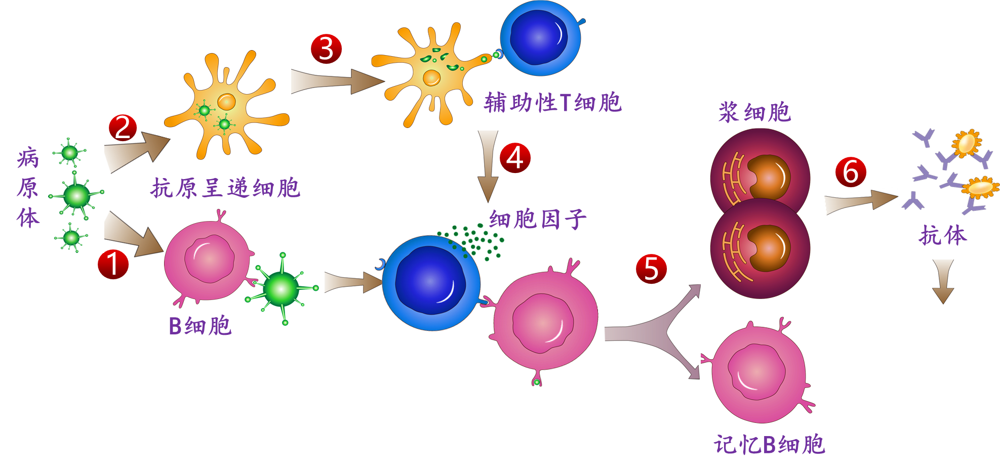
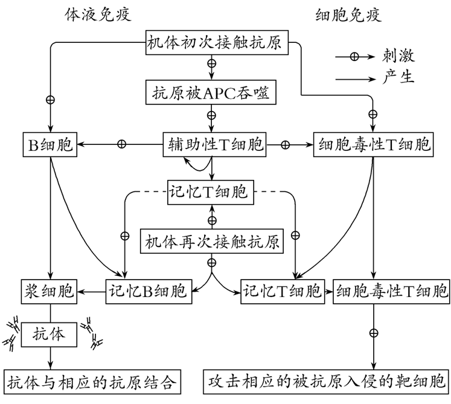
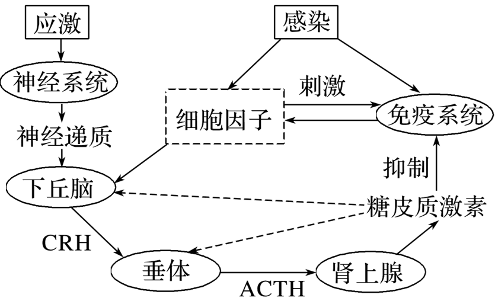
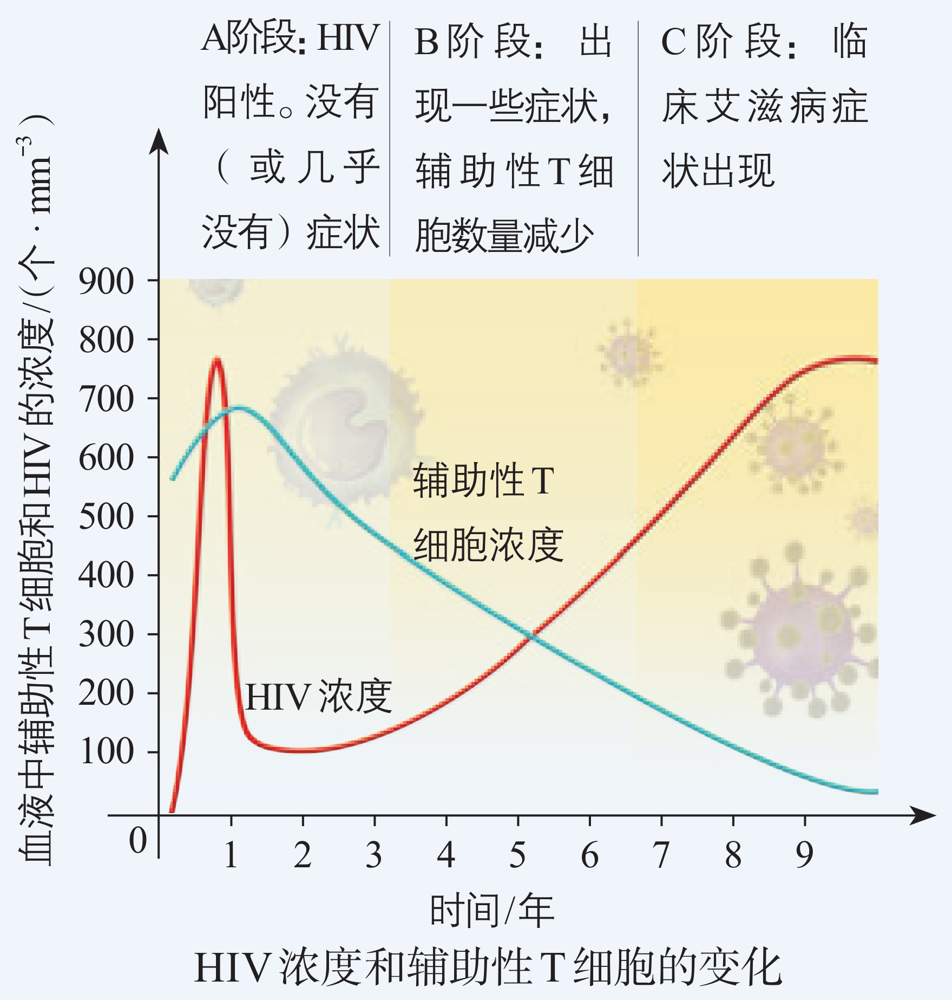
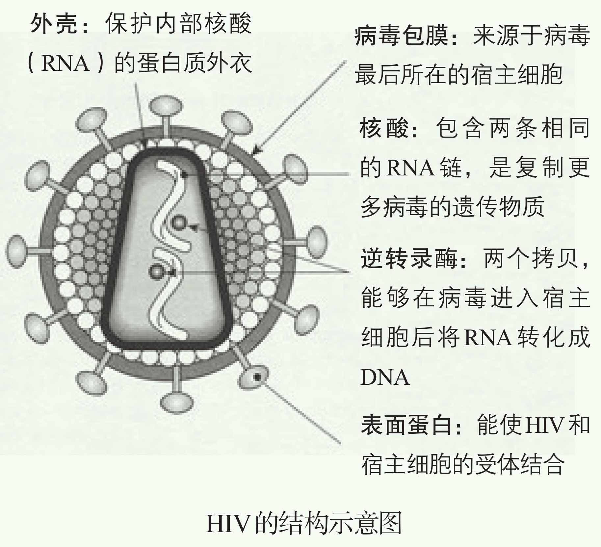

# 免疫系统

## 物质基础 [TODO]

骨髓、胸腺、脾、淋巴结等**免疫器官**，淋巴细胞和树突状细胞、巨噬细胞等**免疫细胞**，以及体液中的各种抗体和细胞因子等**免疫活性物质**，共同组成了人体的**免疫系统**，这是免疫调节的结构和物质基础。

### 免疫器官

免疫器官主要由淋巴组织构成，并借助于血液循环和淋巴循环相互联系。免疫器官包括骨髓、胸腺、脾、淋巴结和扁桃体等。

骨髓和胸腺是免疫细胞分化、发育、成熟的场所：

- 骨髓：是几乎所有免疫细胞的发生地（骨髓的造血干细胞分裂、分化为免疫细胞），同时也是是 B 细胞分化、发育、成熟的场所。

- 胸腺：位于胸骨的后面，胸腺随年龄而增长，在青春期时达到高峰，以后逐渐退化。胸腺是 T 细胞分化、发育、成熟的场所。

    胸腺同时也负责分泌胸腺激素。

脾、淋巴结和扁桃体是免疫细胞集中分布的场所：

- 脾：内含大量的淋巴细胞；也参与制造新的血细胞与清除衰老的血细胞等。

- 淋巴结：是淋巴细胞集中的地方；沿淋巴管遍布全身，主要集中在颈部、腋窝部和腹股沟部等处，能阻止和消灭侵入体内的微生物。

    科学家在脑组织保持生理状态的情况下，发现其中有免疫细胞并呈管状分布。脑部的淋巴管顺着一条主血管进入静脉窦，它们离血管非常近。

- 扁桃体：通常指咽腭部的扁桃体，左右各一，形状像扁桃。其内部有很多免疫细胞，具有防御功能。

### 免疫细胞

免疫细胞是执行免疫功能的细胞，它们来自骨髓的造血干细胞，包括各种类型的白细胞，如淋巴细胞、树突状细胞和巨噬细胞等。

- 淋巴细胞：包括 B 淋巴细胞（简称 B 细胞）和 T 淋巴细胞（简称 T 细胞）等。

- 树突状细胞：分布于皮肤、消化道、呼吸道等很多上皮组织及淋巴器官内，成熟时具有分支；具有强大的吞噬、呈递抗原功能。

- 巨噬细胞：几乎分布于机体的各种组织中，具有吞噬消化、抗原处理和呈递功能。

B 细胞、树突状细胞和巨噬细胞都能摄取和加工处理抗原，并且可以将抗原信息暴露在细胞表面，以便呈递给其他免疫细胞，因此，这些细胞统称为抗原呈递细胞（APC）。

辅助性 T 细胞：

- 识别抗原呈递细胞（APC）呈递的抗原。

- 激活 B 细胞。

- 分泌细胞因子。

能增殖、分化的免疫细胞：B 细胞（浆细胞除外）、T 细胞（辅助性 T 细胞、细胞毒性 T 细胞）、记忆细胞（记忆 B 细胞、记忆 T 细胞）。

浆细胞是高度分化的（也称为效应 B 细胞），不能识别抗原、分裂、分化，只能大量分泌抗体。

### 分子基础

病原体在进入机体后，其表面一些特定的蛋白质等物质，能够与免疫细胞表面的受体结合，从而引发免疫反应。这些能引发免疫反应的物质称为抗原。大多数抗原是蛋白质，它既可以游离，也可以存在于细菌、病毒等病原微生物以及细胞上，能刺激机体产生免疫反应。

| 物质 | 来源 | 本质 | 作用 |
|-----|------|------|------|
| 抗体 | 浆细胞/B细胞 | 免疫球蛋白（蛋白质） | 特异性免疫 |
| 淋巴因子 | T细胞等 | 细胞因子（多为蛋白质） | 免疫调节 |
| 溶菌酶 | 多种细胞 | 酶（蛋白质） | 非特异性免疫 |
| 抗毒素 | 浆细胞 | 抗体的一种 | 中和外毒素 |

免疫活性物质是指由免疫细胞或其他细胞产生的、并发挥免疫作用的物质，他们通常都能随血液循环和淋巴循环到达身体的各个部位。

- 机体产生的专门应对抗原的蛋白质，称为抗体。抗体能与相应抗原发生特异性结合，即一种抗体通常只能与特定抗原结合（抗体有时也能和与特定抗原结构类似的抗原结合）。

- 除了抗体，其他一些物质，如溶菌酶（溶解细菌的细胞壁，肽聚糖）、淋巴细胞分泌的细胞因子等，也属于免疫活性物质。白细胞介素、干
扰素、肿瘤坏死因子等是几类主要的细胞因子。

{ width="60%" }

在人体所有细胞膜的表面，都有多种不同的蛋白质，其中包括作为分子标签来起作用的一组蛋白质。它们就像身份标志，能被自身的免疫细胞所识别。病毒、细菌等病原体也带有各自的身份标签，当它们侵入人体后，能被免疫细胞识别出来。免疫细胞是靠细胞表面的受体来辨认它们的。

每个人的细胞表面都带有一组与别人不同的蛋白质——组织相容性抗原，也叫人类白细胞抗原，简称HLA。它们是标明细胞身份的标签物质，每个人的白细胞都认识这些物质，因此正常情况下不会攻击自身的细胞。

抗体与病原体的结合可以抑制病原体的增殖或对人体细胞的黏附。在多数情况下，抗体与病原体结合后会发生进一步的变化，如形成沉淀等，进而被其他免疫细胞吞噬消化。

## 免疫过程

人体有三道防线来抵御病原体的攻击。

- 皮肤、黏膜是保卫人体的**第一道防线**（溶菌酶也可以在第一道防线发挥作用，它通常存在于外分泌液中）。

- 体液中的杀菌物质（如溶菌酶）和吞噬细胞（如巨噬细胞和树突状细胞）是保卫人体的**第二道防线**，他们主要存在于血清中。

前两道防线人人生来就有，是机体在长期进化过程中遗传下来的，不针对某一类特定的病原体，而是对多种病原体都有防御作用，因此叫作**非特异性免疫**。多数情况下，这两道防线可以防止病原体对机体的侵袭，这也是我们虽然时刻处在病原体的包围之中，但并不会经常感到不适的原因。

我们称特异性即为 B 细胞、细胞毒性 T 细胞的活化条件，对于不同的抗原或其宿主细胞，能激活不同的免疫细胞。

**第三道防线**是机体在个体发育过程中与病原体接触后获得的，主要针对特定的抗原起作用，因而具有特异性，叫作**特异性免疫**。特异性免疫相对非特异性免疫较为复杂、多样，我们后面也会重点关注特异性免疫。

### 非特异性

当流感病毒突破了机体的前两道防线，第三道防线的“部队”就会紧急动员起来，产生特异性免疫。第三道防线的“作战部队”主要是众多的淋巴细胞。

识别、摄取、处理、呈递：

1. 一些病原体被树突状细胞、B 细胞等抗原呈递细胞摄取。

    抗原呈递细胞（吞噬细胞）是唯一非特异性识别抗原的细胞。

2. 抗原呈递细胞将抗原处理后呈递在细胞表面，然后传递给辅助性 T 细胞。

3. 辅助性 T 细胞开始分裂、分化，并分泌细胞因子。

不同的细胞因子起到不同的作用，他们主要能促进 B 细胞及 T 细胞的分裂、分化过程。

### 体液免疫

B 细胞激活后可以产生抗体，由于抗体存在于体液中，所以这种主要靠抗体“作战”的方式称为体液免疫。

{ width="90%" }

1. 一些病原体可以和 B 细胞接触，这为激活 B 细胞提供了第一个信号。

2. 辅助性 T 细胞表面的特定分子发生变化并与 B 细胞结合，这是激活 B 细胞的第二个信号。

3. B 细胞受到两个信号的刺激后（细胞因子能加速这一过程）开始分裂、分化，大部分分化为浆细胞，小部分分化为记忆 B 细胞。

4. 浆细胞产生和分泌大量抗体，抗体可以随体液在全身循环并与这种病原体结合。

5. 记忆细胞可以在抗原消失后存活几年甚至几十年，当再接触这种抗原时，能迅速增殖分化，分化产生的浆细胞快速产生大量抗体。

{ width="50%" }

少数某一些抗原仅仅接触 B 细胞即可直接激活，不需要抗原呈递细胞和辅助性 T 细胞的参与。

通常情况下，一个 B 细胞只针对一种特异的病原体，活化、增殖后只产生一种特异性的抗体。人体内 B 细胞的种数在 $\pu{E9}$ 以上，至少可以产生 $\pu{E9}$ 种独特的抗体，可以识别自然界存在的种类繁多的病原体。

### 细胞免疫

病毒只有侵入细胞才能够增殖，而有一些致病细菌如**结核分枝杆菌**、**麻风分枝杆菌**等，也是寄生在宿主细胞内的。一旦病原体进入细胞，抗体对它们就无能为力了。

当病原体进入细胞内部，就要靠 T 细胞直接接触靶细胞来“作战”，这种方式称为细胞免疫。

1. 被病原体（如病毒）感染的宿主细胞（靶细胞）膜表面的某些分子发生变化，细胞毒性 T 细胞识别变化的信号。

2. 细胞毒性 T 细胞分裂并分化（细胞因子能加速这一过程），形成新的细胞毒性 T 细胞和记忆 T 细胞。

3. 新形成的细胞毒性 T 细胞在体液中循环，它们可以识别并接触、裂解被同样病原体感染的靶细胞。

4. 靶细胞裂解、死亡后，病原体暴露出来，抗体可以与之结合；或被其他细胞吞噬掉。

5. 在这个过程中形成的记忆细胞可以在体内存活几年甚至几十年，如果没有机会再次接触相同的抗原，它们就会逐渐死亡。如果再次遇到相同的抗原，它们会立即增殖、分化为细胞毒性 T 细胞，**迅速**、**高效**地产生免疫反应。

在细胞免疫过程中，靶细胞、辅助性 T 细胞等共同参与细胞毒性 T 细胞的活化过程。

### 免疫的意义

三道防线是统一的整体，它们共同实现**免疫防御**、**免疫自稳**和**免疫监视**三大基本功能。

- 免疫防御：机体排除外来抗原性异物的一种免疫防护作用，这是免疫系统最基本的功能。

- 免疫自稳：机体清除衰老或损伤的细胞，进行自身调节，维持内环境稳态的功能。

    正常情况下，免疫系统对自身的抗原物质不产生免疫反应；若该功能异常，则容易发生自身免疫病。

- 免疫监视：机体识别和清除突变的细胞，防止肿瘤发生的功能。

    机体免疫功能正常时，可识别这些突变的肿瘤细胞，然后调动一切免疫因素将其消除；若此功能低下或失调，机体会有肿瘤发生或持续的病毒感染。

在病原体被基本消灭以后，活化的免疫细胞的功能会受到抑制，机体将逐渐恢复到正常状态。

{ width="70%" }

- B 细胞和细胞毒性 T 细胞的活化离不开辅助性 T 细胞的辅助，可见辅助性 T 细胞在体液免疫和细胞免疫中都起着关键的作用。

- 体液免疫中产生的抗体，能消灭细胞外液中的病原体；而消灭侵入细胞内的病原体，要靠细胞免疫将靶细胞裂解，使病原体失去藏身之所，此时体液免疫就又能发挥作用了。

体液免疫和细胞免疫巧妙配合、密切合作，共同完成对机体稳态的调节。

实际的免疫应答远远比这复杂，其主要就是固有免疫与适应性免疫的协同，多种细胞因子的网络调控作用。

### 内环境稳态 [TODO]

免疫调节在维持机体稳态的过程中具有重要的作用。越来越多的证据表明，神经系统、内分泌系统与免疫系统之间存在着相互调节，通过信息分子构成一个复杂网络（神经-体液-免疫调节网络）。

{ width="50%" }

1. 神经调节、体液调节和免疫调节的实现都离不开信号分子（如神经递质、激素和细胞因子等），这些信号分子的作用方式，都是直接与受体接触。

2. 受体一般是蛋白质分子，不同受体的结构各异，因此信号分子与受体的结合具有特异性。通过这些信号分子，复杂的机体才能够实现统一协调，稳态才能够得以保持。

| 神经途径 | 对免疫系统的影响 | 机制 |
|:--------:|:----------------:|------|
| 交感神经兴奋 | 抑制免疫功能 | 去甲肾上腺素与免疫细胞受体结合 |
| 副交感神经 | 促进局部免疫 | 乙酰胆碱影响细胞因子释放 |
| 下丘脑-垂体-肾上腺皮质轴（HPA 轴） | 免疫抑制 | 糖皮质激素抑制炎症反应 |

长期慢性应激（例如长期寒冷应激、长期压力和焦虑情绪），会导致持续的高皮质醇水平，进而导致免疫抑制，人体更容易感染病原体。

广谱抗炎药物（糖皮质激素类）如地塞米松、甲泼尼龙，可能抑制抗病毒免疫。严格来说，“糖皮质激素抑制免疫功能”是不严谨的，这个结论过于绝对。糖皮质激素的作用是双向的、剂量依赖的。

- 生理浓度下的急性升高（例如短期应激）：糖皮质激素可以起到“免疫重新分配”的作用。它会促使淋巴细胞从血液进入淋巴结等组织，可能会增强局部的免疫监视，为即将到来的“战斗”（如创伤感染）做准备。

- 药理剂量或长期慢性高水平（例如长期压力、用药）：这才是我们熟知的广谱免疫抑制作用。它通过抑制促炎细胞因子的基因转录、促进淋巴细胞凋亡等方式，强力下调免疫应答。临床上用它来治疗自身免疫病和抗器官移植排斥，正是利用了这一特性。

- 同时，细胞因子是 HPA 轴的强力激活剂，导致糖皮质激素水平升高。这是一个完美的**负反馈回路**：免疫系统被激活后，释放细胞因子通知大脑，大脑通过 HPA 轴释放糖皮质激素，而糖皮质激素反过来抑制过度的免疫反应，防止“防卫过当”造成自身损伤。这也可以认为是形成了三向反馈，长期如此容易引发神经内分泌失衡，这也解释了为什么慢性炎症可导致内分泌紊乱和情绪障碍。

细胞因子的神经调节作用：部分细胞因子可通过血脑屏障或迷走神经影响中枢，其中常见的就是**影响体温调定点**（机体发热的主要机制），IL-1 等细胞因子作用于下丘脑体温调节中枢，使调定点上升，产热增加、散热减少。注意：细胞因子不是"增加产热酶活性"，而是改变调定点，通过下丘脑体温调节中枢间接升高体温。

| 激素类型 | 主要作用 | 临床意义 |
|:--------:|----------|----------|
| 糖皮质激素 | 抗炎、免疫抑制 | 治疗自身免疫病，但降低抗感染能力 |
| 甲状腺激素 | 维持免疫功能 | 甲减者免疫力下降 |
| 性激素 | 雌激素增强免疫，雄激素抑制 | 女性自身免疫病发病率高 |
| 生长激素 | 促进胸腺发育 | 影响T细胞成熟 |

胰岛素、胰高血糖素等代谢激素也影响免疫细胞功能（通过调节能量供应）。

肠-脑轴：肠道菌群影响神经系统发育和功能。

胆碱能抗炎通路：迷走神经通过释放乙酰胆碱抑制巨噬细胞炎症因子释放。

这三个系统各自以特有的方式在内环境稳态的维持中发挥作用，它们之间的任何一方都不能取代另外两方。

## 免疫应用

免疫学在临床实践上的应用，除了免疫预防，还包括免疫诊断和免疫治疗。由于抗原和抗体反应的高度特异性，免疫学技术和制剂在临床诊断中得到了广泛的应用，如检测病原体和肿瘤标志物等。免疫治疗已成为与传统的手术、化学疗法、放射疗法并列的重要治疗方法，对于免疫功能低下者使用免疫增强疗法，对于有些疾病则使用免疫抑制疗法。例如，治疗类风湿关节炎、系统性红斑狼疮等常使用免疫抑制剂。

### 过敏反应

已免疫的机体，在再次接触相同的抗原时，有时会发生引发组织损伤或功能紊乱的免疫反应，这样的免疫反应称为过敏反应。引起过敏反应的抗原物质叫作过敏原，通常是高溶解性、低剂量反复接触的低分子量蛋白，很多过敏原也含蛋白酶活性。

人第一次接触过敏原时，抗原呈递细胞（比如树突状细胞）吞噬抗原，辅助性 T 细胞收到信号后，分泌细胞因子激活 B 细胞分化为浆细胞并产生某些抗体（主要是 IgE，免疫球蛋白 E）。这些抗体进入血液循环，然后吸附在某些细胞（如**肥大细胞**和**嗜碱性粒细胞**）的表面，这些细胞常分布在皮肤、呼吸道或消化道黏膜以及血液中。

人第二次或多次接触过敏原时，过敏原直接与已经结合在肥大细胞表面的多个 IgE 抗体相遇并结合。这个过程叫做交联，这种交联信号，直接导致肥大细胞脱颗粒（把储存在细胞质内的组织胺等速发型物质迅速抛出）。组织胺等速发介质立刻引起过敏反应，同时，细胞内部开始合成并分泌白三烯等迟发介质，使哮喘等症状更严重、更持久。最终导致过敏者出现皮肤红肿、发疹、流涕、打喷嚏、哮喘、呼吸困难等症状。

- 组织胺：预先合成并储存在颗粒里，效应快。使毛细血管扩张、通透性增加（导致皮肤红肿、起风团、流鼻涕），刺激神经末梢（导致瘙痒），收缩支气管平滑肌（导致呼吸困难、哮喘）。

- 白三烯：被激活后现场合成，导致支气管平滑肌收。作用比组织胺强上百倍甚至上千倍，而且作用时间更持久，是引发过敏性哮喘的关键。因此，严重哮喘需用白三烯受体拮抗剂（孟鲁司特）。

- 前列腺素：被激活后现场合成，导致血管扩张和支气管收缩的。

- 过敏反应激活的数小时后，肥大细胞也可能分泌细胞因子，导致慢性的炎症。

过敏反应是免疫功能“失调”或“超敏反应”，其根源在于免疫调节的平衡被打破，导致免疫系统对无害物质做出了过度且错误的反应。这种由 IgE 介导的速发型过敏反应，被精确地分类为 **I 型超敏反应**。

| 类型 | 机制 | 典型疾病 | 发生时间 |
|:----:|:----:|----------|:--------:|
| **Ⅰ型** | IgE 介导 | 花粉症、哮喘、食物过敏 | 数秒 $\sim$ 数分钟 |
| Ⅱ型 | IgG / IgM 攻击细胞 | 输血反应、新生儿溶血 | 数小时 |
| Ⅲ型 | 免疫复合物沉积 | 血清病、红斑狼疮 | 数小时 $\sim$ 数天 |
| Ⅳ型 | T 细胞介导 | 接触性皮炎、结核菌素试验 | 数天小时 |

- 只有遗传易感个体才会在首次接触时发生异常的 IgE 应答，正常人首次接触花粉只产生少量 IgE，不会致敏。

- 第二次的时间跨度：致敏期可能需要数天到数年，需要 IgE 抗体滴度达到阈值、肥大细胞表面 IgE 受体充分结合。

- 首次也可能发生过敏，例如青霉素过敏，有些人首次注射就休克。与肠道菌群产生的类似结构发生交叉反应。

过敏性休克：

- 大量肥大细胞同时激活，血管通透性剧增、血浆外渗，血容量骤降，支气管平滑肌收缩导致窒息。

- 过敏性休克需立即注射肾上腺素，抗组胺药此时完全无效。肾上腺素能快速收缩血管、提升血压，同时舒张支气管平滑肌。

鱼、虾、牛奶、蛋类、花粉、花生、室内尘土、磺胺、奎宁、宠物的皮屑、棉絮等都是（或含有）过敏原。由于过敏反应是机体接触过敏原才发生的，因此找出过敏原并且尽量避免再次接触该过敏原，是预防过敏反应发生的主要措施。

### 自身免疫病

人体的免疫系统具有分辨“自己”和“非己”成分的能力，一般不会对自身成分发生免疫反应。

但是，在某些特殊情况下，免疫系统也会对自身成分发生反应。如果自身免疫反应对组织和器官造成损伤并出现了症状，就称为自身免疫病。

- 某种链球菌的表面有一种抗原分子，与心脏瓣膜上一种物质的结构十分相似，当人体感染这种病菌后，免疫系统不仅向病菌发起进攻，而且也向心脏瓣膜发起进攻。结果，在消灭病菌的同时，心脏也受到损伤。这就是风湿性心脏病。

- 风湿类疾病：风湿类疾病是一组以自身免疫反应为核心特征的慢性疾病，通常与遗传背景与环境因素有关，这类疾病主要累及关节、结缔组织及血管等部位。因为患者常在阴冷潮湿、多风的环境中发病，因此称为风湿病。风湿类疾病往往不局限于关节，以以类风湿关节炎为例，长期的滑膜炎症导致软骨降解、骨质侵蚀、纤维化等现象，导致关节僵硬、活动性受限且长期疼痛。

- 系统性红斑狼疮：一种累及多个器官的疾病，病程可有缓解和发作交替进行，其主要症状有发热、关节痛、红斑、大量脱发、白细胞减少等。系统性红斑狼疮的病因至今尚未完全研究清楚，与遗传、免疫失调、内分泌异常以及环境等多因素有关。

自身免疫病的发病率较高，其中许多类型都缺乏有效的根治手段。对病情严重的自身免疫病患者进行自体造血干细胞移植是一种目前很有前景的治疗方法。

### 免疫缺陷病

免疫缺陷病是指由机体免疫功能不足或缺乏而引起的疾病。该病分为两类：

- 一类是由于遗传而生来就有免疫缺陷的，叫作**先天性免疫缺陷病**，如重症联合免疫缺陷病。

    重症联合免疫缺陷病是由与淋巴细胞发育有关的基因突变或缺陷引起的，患者多为新生儿和婴幼儿，他们存在严重的体液免疫和细胞免疫缺陷，任何一种病原体感染，对他们都是致命的。

- 另一类是由疾病和其他因素引起的，叫作**获得性免疫缺陷病**，如艾滋病。大多数免疫缺陷病都属于获得性免疫缺陷病。

    艾滋病（AIDS）是由人类免疫缺陷病毒（HIV）引起的，HIV 能够攻击人体的免疫系统，主要侵染辅助性 T 细胞。HIV 侵入人体后通常可以数年。期间，HIV 会经历迅速增殖，刺激机体产生免疫反应，免疫系统分泌抗 HIV 的抗体，这也是目前 HIV 检测的重要依据。

    

    

     

    

    
    直到艾滋病病发时，机体仍会继续分泌该抗体。但是，随着病毒的复制，T 细胞的数量持续下降，免疫系统的功能减退，感染者出现淋巴结肿大、发热、体重下降等临床症状。最终患者死于由免疫功能丧失引起的严重感染或恶性肿瘤等疾病。

    HIV 是逆转录病毒，由两类猿猴的病毒重组产生。抗逆转录病毒联合疗法可阻止 HIV 在人体内的繁殖。

### 流行性感冒

当我们体内上呼吸道有炎症时，扁桃体会肿大，有时颌下、腋下、腹股沟等部位还会出现淋巴结肿大。

- 在我们的扁桃体表明有很多微小的淋巴滤泡，免疫细胞大量分布在其中，流感病毒附着在扁桃体（淋巴结亦如此）上，被免疫细胞（主要是树突状细胞、巨噬细胞）发现并激活 T 细胞，释放细胞因子并激活 B 细胞。淋巴细胞被激活后会迅速分裂，同时细胞因子引起炎症反应，如组织水肿、毛细血管充血、导致扁桃体肿大。

- 如果扁桃体反复发炎，即反复发作的慢性扁桃体炎，例如细菌（尤其是链球菌）在其表明形成顽固的菌落（生物膜），慢性感染难以控制、引发继发疾病，则就需要切除扁桃体。切除扁桃体后，由于免疫系统其他冗余性和代偿性（例如其他淋巴组织会代偿性增生、肥大），总的来说对免疫系统防线影响微乎其微。

流行性感冒的病原体简称流感病毒，根据其内部蛋白质种类的不同，常见的有甲、乙、丙、丁、戊型，称为某型流感、简称某流。流感病毒的表面有血凝素（HA）和神经氨酸酶（NA）等蛋白。甲型流感病毒的 HA 分为 H1 ~ H18 等亚型，NA 分为 N1 ~ N11 等亚型。HA 和 NA 可以随机组合。

- 流感病毒极易突变，表现为病毒表面的蛋白质分子（特别是 HA、NA）改变。对于一些新出现的流感病毒，免疫系统对它没有任何记忆，一旦感染，机体对它剧烈的反应容易造成致病性损伤。而且人群普遍缺乏对它的免疫力，因而容易引起较大范围的流行。接种疫苗是国际上普遍采用的预防流感的措施。但流感疫苗具有一定的局限性，如不能应对新发的突变等。

- 抗生素：按照原理可以分为**杀菌性抗生素**（杀菌作用，主动摧毁细菌，例如破坏细菌的细胞壁、细胞膜、DNA 或 RNA 等）和**抑菌性抗生素**（抑菌作用，抑制生长繁殖，例如 阻断细菌代谢通路或抑制细菌的蛋白质合成）。

对比：支原体感染反复性强，支原体是唯一没有细胞壁的原核生物，体积小、易黏附或寄生在宿主细胞内。同时支原体变异极快，难以形成有效的记忆细胞。某些支原体还可以产生类似超级抗原的物质，引起细胞因子风暴，损伤宿主器官，使 T 细胞迅速耗竭、凋亡。

### 细胞因子风暴

**细胞因子风暴**（CS / CRS）是指机体在感染、药物或其他刺激下，免疫系统被过度激活，导致多种细胞因子（尤其是促炎因子）在短时间内海量产生并释放的一种失控的、过度的、具有破坏性的免疫反应。其主要机制为恶性的正反馈循环：

- 启动：大量病原体或其产生的毒素刺激免疫细胞，释放第一波促炎细胞因子。

- 放大：这些细胞因子又激活了更多的免疫细胞。

- 失控：被新激活的细胞释放出更多、更大量的细胞因子，形成雪崩式的正反馈循环，彻底打破了促炎与抗炎的平衡。

| 对比维度 | 轻度感染 | 重度感染（早期） | 重度感染（后期） |
|:--------:|:--------:|:----------------:|:----------------:|
| **病原体负荷** | 低 | 高 | 持续高、难以清除 |
| **固有免疫** | 局部、轻度炎症 | 全身性强烈炎症 | 可能免疫麻痹 |
| **细胞因子** | 适量释放 | 爆发性释放 | 持续高水平或耗竭 |
| **适应性免疫** | 适度激活 | 强烈激活 | T 细胞耗竭 |
| **抗体产生** | 滴度较低 | 滴度高 | 可能产生非中和抗体 |
| **组织损伤** | 轻微可逆 | 严重损伤 | 器官衰竭 |
| **临床表现** | 轻微症状 | 高热、休克等 | 多器官衰竭|
| **免疫记忆** | 良好形成 | 可能形成 | 记忆质量受影响 |
| **转归** | 自愈或易治 | 需积极治疗 | 高死亡率 |

严重的细胞因子风暴可能会导致全身性炎症反应综合征（SIRS）甚至多器官衰（MODS），这也是感染性疾病重症患者死亡率高的原因。

| 病原体类型 | 代表疾病 | 特点 |
|:----------:|:--------:|:----:|
| 病毒 | 新冠肺炎、流感、SARS | 病毒复制、免疫过激 |
| 细菌 | 败血症、中毒性休克综合征 | 内、外毒素强刺激 |
| 真菌 | 侵袭性曲霉菌病 | 免疫原性强 |
| 寄生虫 | 重症疟疾 | 红细胞大量破坏 |

免疫应答强度不仅取决于病原体数量，还受到**病原体特性、宿主状态、时间阶段**的综合影响。

| 特殊情况 | 机制 | 例子 |
|:--------:|:----:|:----:|
| **免疫逃逸** | 病原体主动抑制免疫 | HIV、结核杆菌 |
| **免疫耗竭** | 持续刺激导致功能衰竭 | 慢性病毒感染 |
| **免疫麻痹** | 过度激活后的反向抑制 | 败血症后期 |
| **免疫偏倚** | 诱导无效或有害的免疫类型 | 某些寄生虫 |

老年人更容易重症的原因：

- 老年人固有免疫效率低且过度激活。

- 适应性免疫反应慢且质量差。

- 调节机制退化，易失控形成风暴。

- 基础病导致储备能力低，耐受性差。

### 癌症的免疫疗法

为了提升 T 细胞识别和杀伤肿瘤细胞的能力，科学家在体外改造病人自身的 T 细胞，使它能识别特定癌细胞并被激活，再把大量增殖的此类细胞回输到病人体内。

研究发现，活化的 T 细胞表面的 PD-1（程序性死亡受体 1）与正常细胞表面的 PD-L1（程序性死亡配体 1）一旦结合，T 细胞即可“认清”对方，不触发免疫反应。肿瘤细胞可通过过量表达 PD-L1 来逃避免疫系统的“追杀”。基于此，科学家使用 PD-1 或 PD-L1 抗体来阻断这一信号通路，从而使 T 细胞能有效对付癌细胞。

当然，免疫疗法也有一定的局限性。例如，回输的 T 细胞也可能对正常细胞造成损害；过度阻断 PD-1 / PD-L1 信号通路，可能会引起过强的免疫反应等。

### 疫苗和抗毒血清

> “打开天花患者的小脓包，用棉花吸沾一点脓液，并使之干燥……然后放入可能患天花人的鼻子里。”被接种者会轻度感染天花，然后痊愈。

疫苗通常是用灭活的或减毒的病原体制成的生物制品。接种疫苗后，人体内可产生相应的抗体，从而对特定传染病具有抵抗力。新型的基因工程疫苗将有广阔的应用前景。

- 巴斯德将感染了狂犬病的兔的神经组织制成匀浆，每天取样给家兔注射。开始几天被注射的家兔都会发病，但随着匀浆放置时间的延长，家兔发病的反应越来越弱。这时，如果再给这些没有发病的、被注射了“过期病兔神经组织匀浆”的家兔注射新鲜病兔的神经组织匀浆，家兔也不会发病了。后来，巴斯德制成了狂犬病疫苗，即过期病兔的神经组织匀浆。

- 在 1937 年，用鸡胚培养流感病毒获得成功，到目前为止，鸡胚仍然是流感疫苗等多种疫苗制备的主要“工厂”。

当给机体输入外源抗原时，免疫系统能够产生反应，而且这种反应具有特异性。除此之外，免疫系统还具有记忆性，免疫力能维持较长的时间。疫苗的应用是人们根据免疫反应的规律来设计的，这样可以促进对机体有利的免疫反应，从而维护人体健康。

减毒活疫苗类：

- 天花疫苗：人类历史上第一个疫苗，其原理是交叉免疫。使用对人体致病性很弱的牛痘病毒，其抗原结构与天花病毒非常相似，记忆免疫细胞也能识别并攻击天花病毒、消灭病原体。

- 卡介苗：主要是用来预防结核病，是一种减毒活疫苗，因为结核分枝杆菌通常寄生在细胞内，因此卡介苗的原理重点不在抗体，而是训练 T 细胞识别被感染的细胞（主要是巨噬细胞）。卡介苗对麻风病（麻风分枝杆菌）也有较弱的交叉免疫作用。

- 脊髓灰质炎疫苗：俗称“糖丸”含有减毒的脊髓灰质炎病毒（小儿麻痹症病毒），这种病毒主要通过粪-口途径传。口服后病毒在肠道黏膜复制，既能激发体液免疫产生抗体，又能产生肠道局部免疫。

- 麻疹疫苗：减毒的麻疹病毒，通常一次接种可提供终身保护。麻疹病毒传染性极强，需要极高的接种率才能建立有效的群体免疫（阻断传播）。接种麻疹疫苗可能会出现低热、皮疹等轻微反应，现在多采用“麻腮风三联疫苗”。

- 水痘疫苗：减毒的水痘-带状疱疹病毒，即使接种后仍可能感染水痘，但症状会显著减轻（称为突破性感染）。这种病毒会潜伏在神经节中，因此免疫力下降的时候有概率引起轻微的带状疱疹。

灭活疫苗类：

- 脊髓灰质炎灭活疫苗：采用化学方式灭活，病毒仅保留抗原性。注射后诱发产生抗体，但肠道局部免疫较弱。优点是绝对安全，缺点是需要多次接种，目前发达国家多采用。

- 狂犬病疫苗：灭活的狂犬病毒，狂犬病是致死率几乎 $100\%$ 的疾病，病毒主要攻击神经系统。狂犬病毒有潜伏期，被咬伤后立即接种疫苗，疫苗需多次注射，高危人群可提前接种。

- 流感灭活疫苗：使用当年预测流行的几种流感病毒株灭活制成，每年更新、根据监测数据预测，保护效果取决于预测的准确性。保护期约一年。

- 甲肝灭活疫苗：灭活的甲型肝炎病毒，与乙肝不同，甲肝不会转为慢性，感染后终身免疫。儿童感染甲肝症状较轻甚至无症状，灭活疫苗安全性好，也有减毒活疫苗可选。

重组蛋白疫苗：

- 乙肝疫苗：将编码乙肝病毒表面抗原的基因插入酵母菌，让酵母菌大量生产这种蛋白，纯化后制成疫苗。疫苗接种绝对安全，接种后产生的抗体能中和病毒，阻止其感染肝细胞。

- 人乳头瘤病毒疫苗（HPV 疫苗）：第一个预防癌症的疫苗，是使用病毒样颗粒技术制成的重组疫苗。接种后能高效刺激免疫系统产生大量高亲和力的中和抗体。当真病毒入侵时，这些抗体能迅速将其中和，使其无法感染宫颈上皮细胞。

- 肺炎球菌疫苗：肺炎链球菌有 $90$ 多种血清型，疫苗选取最常致病的若干型制成，疫苗种类复杂，不同人群有不同类型的疫苗。

- 百日咳疫苗：无细胞疫苗，只含百日咳杆菌的几种关键蛋白成分，而非全细菌。副作用小，但免疫持久性稍弱，需要加强接种。

类毒素疫苗：

- 白喉疫苗：使用白喉类毒素制成。白喉杆菌分泌的外毒素破坏心肌和神经组织，将外毒素用甲醛处理，破坏其毒性但保留抗原性，形成类毒素。抗体只能中和毒素，不能杀灭细菌本身，因此接种者仍可能携带并传播白喉杆菌。

- 破伤风疫苗：使用破伤风类毒素制成。破伤风梭菌是厌氧菌，在深部伤口中繁殖并产生神经毒素，导致肌肉痉挛。类毒素原理同白喉疫苗。每十年作用建议加强一次。

- 百日咳疫苗、白喉类毒素、破伤风类毒素通常联合制成“百白破疫苗”，一次接种预防三种疾病，是儿童免疫规划的重要组成。

到目前为止，疫苗仍是人类发明的对抗传染病的一件有效的武器，而且对某些疾病来讲，注射疫苗可能是唯一有效的预防措施。

> 新型冠状病毒感染康复者的血清中含有针对新型冠状病毒的抗体，提取这样的血清输给临床病人，其中的抗体可以与新型冠状病毒结合，使病毒失活，有助于病人康复。

抗毒血清，更广义地可以称为免疫血清，是一种提供被动免疫的生物制剂，含有针对特定病原体或毒素的抗体。

与疫苗的主动免疫不同，疫苗是让身体自己产生抗体和记忆细胞，需要时间（通常数周）；而抗毒血清直接注射现成的抗体，注射后立即发挥作用。这种被动免疫起效快，但持续时间短（通常数周到数月），因为外来抗体会逐渐被代谢降解，且不产生免疫记忆。因为是异种蛋白，可能引发过敏反应（如血清病），因此使用前通常需要做皮试。

它的经典制备方法是：将经过减毒或脱毒处理的毒素（类毒素）或病原体，反复注射给大型动物（通常是马），刺激这些动物产生大量的特异性抗体。然后，采集这些动物的血液，分离出富含抗体的血清部分，经过纯化处理后，就制成了抗毒血清。

抗毒血清主要用于三种情况：**紧急治疗**已经发生的中毒或感染（如被毒蛇咬伤）；**暴露后预防**，给予高危暴露者即时保护（如狂犬病暴露）；**免疫缺陷者**的替代治疗。从免疫学角度，这是利用体液免疫中抗体的即时保护作用，弥补细胞免疫和主动免疫来不及发挥作用的时间窗口。

常见的抗毒血清有：破伤风抗毒素、白喉抗毒素、肉毒抗毒素、狂犬病免疫球蛋白、乙肝免疫球蛋白、水痘-带状疱疹免疫球蛋白、麻疹免疫球蛋白、抗蛇毒血清、抗蛇毒血清、抗蜘蛛毒血清等。

### 器官移植和排异

医学上把用正常的器官置换丧失功能的器官，以重建其生理功能的技术叫作器官移植。随着器官保存技术和外科手术方法等的不断改进，以及高效免疫抑制剂的陆续问世，器官移植已经成为治疗多种重要疾病的有效手段。

进行器官移植手术后，免疫系统会把来自其他人的器官当作“非己”成分进行攻击，这就是器官移植容易失败的原因。除了存在免疫排斥的问题，供体器官短缺也是世界各国在器官移植方面普遍存在的问题。人们寄希望于利用干细胞培养相应的组织、器官。

如果将别人的器官或组织移植过来，白细胞能识别出 HLA 不同而发起攻击。因此，器官移植的成败，主要取决于供者与受者的 HLA 是否一致或相近。事实上，除了同卵双胞胎，要想在世界上找到两个 HLA 完全一致的人几乎是不可能的。研究表明，只要供者与受者的主要 HLA 有一半以上相同，就可以进行器官移植。免疫抑制剂的应用，大大提高了器官移植的成活率，给需要进行器官移植的患者带来了希望。

人类基因 D 编码红细胞表面的 RhD 蛋白，其等位基因 d 不编码蛋白质。基因型为 DD 或 Dd 的被称为 Rh 阳性（Rh^+^），基因型为 dd 被称为 Rh 阴性（Rh^-^）。人的血清中不存在抗 RhD 的天然抗体，只有当 Rh^-^ 的人接受 Rh^+^ 人的血液后，才会通过免疫反应产生该抗体。RhD 抗体可以透过胎盘。

当 Rh^-^ 的母亲怀有 Rh^+^ 的胎儿时，胎儿的少量红细胞或 RhD 蛋白可以在妊娠末期或分娩时进入母体，使母体产生抗体。如果此抗体进入胎儿的循环系统，会使胎儿的红细胞发生溶血，造成新生儿溶血，严重时可导致死亡。

当母亲和胎儿的 RhD 不相容时，一般情况下，第一胎生产不会发生临床的症状。但当母亲第二次生育时，就可能发生新生儿溶血。
