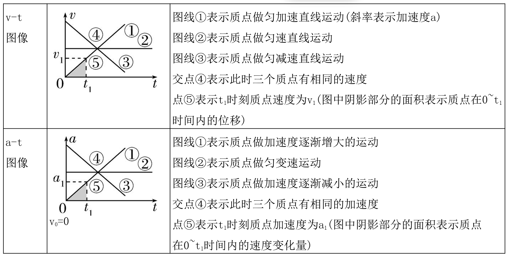
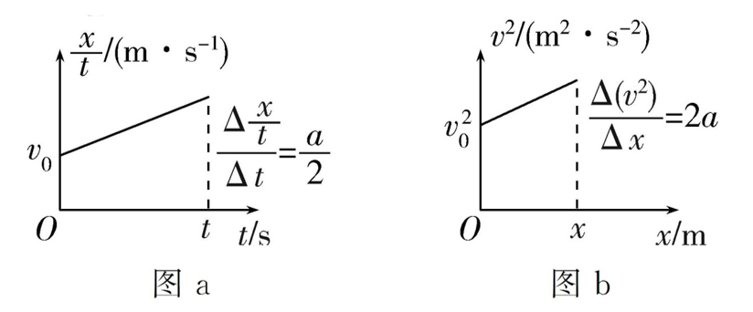

# 直线运动

## 相关定义

### 位移

如果质点做直线运动，我们可以取运动直线为坐标轴，设正方向为 $x$ 方向。

质点位置：

$$
x=x(t)
$$

质点的位移：

$$
\Delta x=x(t+\Delta t)-x(t)
$$

### 速度

质点的平均速度定义为：

$$
\bar v=\dfrac{\Delta v}{\Delta t}
$$

平均速度是反映质点运动快慢与运动方向的物理量，而且是较为粗糙的反映 $\Delta t$ 时间段内运动的平均快慢和方向。如果要精确的描述质点在各时刻运动的快慢和方向，需取 $\Delta t\to0$ 的极限：

$$
v=\lim_{\Delta t\to0}\dfrac{\Delta v}{\Delta t}
$$

做直线运动的质点的位置随时间变化的关系，可以在 $x-t$ 坐标中用一条曲线（称为位置图线）来表示。速度等于过曲线上一点切线的斜率，它是位置对时间的瞬时变化率。

于是，平均速度：

$$
\bar v=\dfrac{x(t+\Delta t)-x(t)}{\Delta t}=\tan\alpha
$$

其中 $\tan\alpha$ 表示割线斜率，当 $\Delta t\to0$，割线变成了切线。

### 加速度

同样，可以定义平均加速度：

$$
\bar a=\dfrac{\Delta v}{\Delta t}
$$

以及，瞬时加速度：

$$
a=\lim_{\Delta t\to0}\dfrac{\Delta v}{\Delta t}
$$

其中，$\bar a$ 是反映质点运动速度在 $\Delta t$ 时间内变化快慢和方向物理量。

当 $\Delta t\to0$ 时，成为能精确描述的瞬时加速度。

做直线运动的质点的速度随时间的变化关系，可以在 $v-t$ 坐标中用一条曲线（称为速度图线）来表示。同样，平均加速度 $\bar a$ 和加速度 $a$ 分别是过曲线上两点割线的斜率和曲线上一点切线的斜率。

应用 $v-t$ 图像（即速度图线）可以求出质点在任意时间内的位移，具体做法可以用近似求解。令 $t_1\to t_2$ 时间内分成 $n$ 个相等的小段，每段大小为 $\Delta t$，只需 $\Delta t$ 足够小，就可以近似认为 $\Delta t$ 内速度大小几乎不变，然后写出总面积：

$$
S=\sum_{i=1}^nv(t_i)\Delta t
$$

其中 $v(t_i)$ 为第 $i$ 条内的速度值。当 $\Delta t\to0$，即 $n\to\infty$ 时，此值 $S$ 即为位移的精确值。

## 解题方法

### 运动学方程

加速度 $a$ 保持不变的匀速直线运动称为匀变速直线运动。

| 描述 | 公式 |
| :-: | - |
| 少 $x$ 的公式 | $v_t=v_0+at$ |
| 少 $a$ 的公式 | $x=\dfrac{v_0+v_t}{2}t$ |
| 少 $v_t$ 的公式 | $x=v_0t+\dfrac{1}{2}at^2$ |
| 少 $v_0$ 的公式 | $x=v_tt-\dfrac{1}{2}at^2$ |
| 少 $t$ 的公式 | $2ax={v_t}^2-{v_0}^2$ |

上述方程包括五个参量：$v_0$、$v_t$、$a$、$t$、$x$。

若把这五个参量当成是「独立参量」，那么以上各方程独立的只有两个方程，因此欲由上述方程求解未知参量，必须先给出三个参量。

### 平均速度

| 描述 | 公式 |
| :-: | - |
| 平均速度等于中时速度 | $\bar v=v_{t/2}=\dfrac{v_0+v_t}{2}$ |
| 中位移速度等于平方平均数 | $v_{x/2}=\sqrt{\dfrac{v_t^2+v_0^2}{2}}$ |
| 中位移速度推广 | $v_{mx/n}=\sqrt{\dfrac{(n-m)v_0^2+mv_t^2}{n}}$ |

题型：知道两段时间和位移，求出平均速度作为中时速度，可得加速度。

### 公式的选择

把已知量打对钩，要求的打问号，例如：

$$
\begin{cases}
v_0&\checkmark\\
v_t&\checkmark\\
a&\,?\,\\
t&\checkmark\\
x&
\end{cases}
$$

于是考虑用少 $x$ 的公式，即 $v_t=v_0+at$。

### 无初速度比例

等分时间：

| 物理量 | 比例 | 解释 |
| :-: | :-: | - |
| 末速度 | $1:2:3:4:\dots$ | 由 $v=at$ 可知 |
| 位移 | $1:4:9:16:\dots$ | 由 $x=0.5at^2$ 可知 |
| 位移差分 | $1:3:5:7:\dots$ | 由位移差分可得 |

等分位移：

| 物理量 | 比例 | 解释 |
| :-: | :-: | - |
| 末速度 | $1:\sqrt2:\sqrt3:\sqrt4:\dots$ | 由 $x=0.5at^2$ 可知 |
| 时间 | $1:\sqrt2:\sqrt3:\sqrt4:\dots$ | 由 $v=at$ 可知 |
| 时间差分 | $1:\sqrt2-1:\sqrt3-\sqrt2:\sqrt4-\sqrt3:\dots$ | 由位移差分可得 |

## 实际问题

### 逐差法

有公式：

$$
\Delta x=aT^2
$$

表示的是，两段相邻 $T$ 时间内，位移的差值 $x_2-x_1$ 的数值。

根据这个，可以计算打点计时器算加速度。

多段逐差法计算：

- 求 $v$ 瞬时速度：

    从这个点前后找最长的相等等分时间，用总位移除以总时间。

- 求 $a$ 加速度：

    在位移中选择最长的连续的偶数段，记为 $n+n=2n$ 段，则：

    $$
    a=\dfrac{x_后-x_前}{(nT)^2}
    $$

    例如：

    $$
    a=\dfrac{(x_3+x_4)-(x_1+x_2)}{(2T)^2}
    $$

    注意原始点和计数点的关系。

### 函数法

列出位移**或位置**关于时间的函数，联立。

相遇，令 $\Delta x(t)=0$，极值利用二次函数或分式函数求解。

### 图像法

一般画出 $v-t$ 图像，图像面积的意义为位移大小。

图像法的缺点：没有绝对位置信息，无法表示变加速度，变加速度需要分段。

- 常规图像：

    

    

- 特殊图像 $\dfrac{x}{t}-t$ 图像：由 $x=v_0t+\dfrac{1}{2}at^2$ 可得 $\dfrac{x}{t}=v_0+\dfrac12at$，图线斜率为 $\dfrac12a$，图像纵截距为初速度，如图 a。

    特殊图像 $v^2-x$ 图像：由 $v^2-v_0^2=2ax$ 可得 $v^2=v_0^2+2ax$，图线斜率为 $2a$，图像纵截距为初速度的二次方，如图 b。

    { width="70%" }

- 特殊图像 $a-x$ 图像：由 $v^2-v_0^2=2ax$ 可得 $ax=\dfrac{v^2-v_0^2}{2}$，图线与 $x$ 轴所围成面积表示速度平方的变化量的一半，如图 c。

    { width="30%" }

注意声明正方向。

注意：判定不需要证明，直接给出结论。

特殊图像问题：一次函数关注解析式、$k,b$ 含义，二次函数关注特殊点。

## 直线运动例题

### 例题一

一物体从静止开始从 $A$ 点做匀加速直线运动，加速度大小为 $5\mathrm{m/s^2}$。一段时间后做匀减速直线运动，加速度大小为 $2.5\mathrm{m/s^2}$，已知 $AB$ 距离为 $60\mathrm{m}$，求物体加速多久，可以恰好停在 $B$ 点。

设加速时间为 $t\mathrm{s}$，则可以列出方程：

$$
5t\times\left(\dfrac{5t}{2.5}+t\right)\times\dfrac{1}{2}=60
$$

解得 $t=2\sqrt2\mathrm{s}$。

### 例题二

一火箭从某个无大气层的行星的一个极地竖直向上发射。由火箭上传递过来的无线电信息知，从火箭发射时的一段时间 $\tau$ 内，火箭上所有物体对支持物的压力或对其悬挂装置的拉力是火箭发射前的 $1.8$ 倍。在落回行星表面前的所有时间内，火箭里的物体处于完全失重状态。试问，从火箭发射到落回行星表面经过多少时间？设行星引力大小随距行星高度的变化可以忽略不计。

设星球重力加速度 $g$，则火箭上升的 $\tau$ 时间内，加速度 $a$ 恒为：

$$
a=(1.8-1)g=0.8g
$$

在 $\tau$ 时间内，火箭达到的高度：

$$
h=\dfrac{1}{2}a\tau^2
$$

在 $t$ 秒末火箭的速度（方向向上）：

$$
v=a\tau
$$

火箭落回星球表面，完全失重表明火箭自由落体：

$$
-h=vt-\dfrac{1}{2}gt^2
$$

带入可得：

$$
-0.4g\tau^2=0.8g\tau t-\dfrac{1}{2}gt^2
$$

解得 $t_1=-0.4\tau{\scriptsize\texttt{（舍）}},t_2=2\tau$。

即火箭从发射到落回星球表面共用时 $3\tau$ 时间。

### 例题三

两个完全相同的球 $A$ 和 $B$，质量均为 $m$，$A$ 在 $B$ 后的距离为 $a$。如 $A$ 受沿 $AB$ 方向的冲量 $I$ 的作用，同时 $B$ 受沿 $AB$ 方向的常力 $F$ 的作用开始运动。试推导 $A$ 不超越 $B$ 的条件。

球 $A$ 受到冲量 $I$ 的作用，做速度为 $v_A$ 的匀速运动：

$$
I=mv_A
$$

球 $B$ 受到常力 $F$ 的作用，做加速度为 $a_B$ 的匀加速运动：

$$
F=ma_B
$$

则运动方程：

$$
\begin{aligned}
x_A&=v_At&&={I\over m}t\\
x_B&=a+\dfrac{1}{2}at^2&&=a+\dfrac{1}{2}{F\over m}t^2
\end{aligned}
$$

球 $A$ 不超越 $B$，即 $x_B$ 恒大于 $x_A$：

$$
\begin{aligned}
x_B>x_A\\
a+\dfrac{1}{2}{F\over m}t^2>{I\over m}t\\
2am+Ft^2>2It
\end{aligned}
$$

得到：

$$
Ft^2-2It+2am>0
$$

因为 $F>0$，此式恒成立的条件为 $\Delta<0$，即：

$$
\begin{aligned}
4I^2-8maF<0\\
I^2<2maF
\end{aligned}
$$
