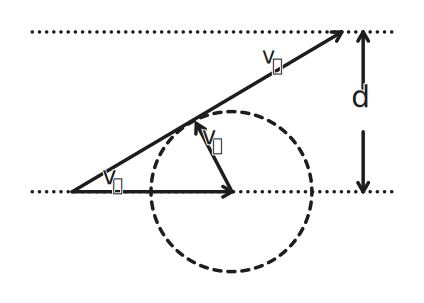
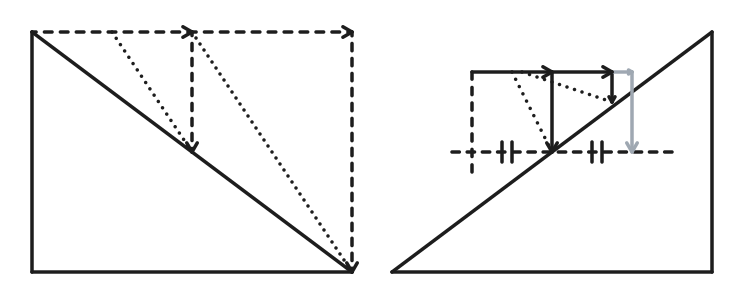

# 抛体运动

## 曲线运动概述

### 曲线运动特点

条件：$v,a$ 不共线。

特点：瞬时速度方向等于轨迹切线方向，证明：

$$
\dfrac{v_y}{v_x}=\dfrac{\d y}{\d t}\cdot\dfrac{\d t}{\d x}=\dfrac{\d y}{\d x}
$$

合速度加在 $a,v$ 之间，向 $a$ 靠拢，但不会和 $a$ 共线。

合运动类型：

| | 匀速直线运动 | 匀加速直线运动 |
| :-: | :-: | :-: |
| **匀速直线运动** | 匀速直线运动 | 曲线运动 |
|  **匀加速直线运动** |  曲线运动 | 若 $v_合$ 与 $a_合$ 共线则为匀加速直线运动 否则为曲线运动 |

### 小船过河问题

{ align=right width="40%" }

如果船速大于水速：

- 垂直河对岸：时间最短。

- 斜向上、合速度指向对岸：位移最短。

如果船速小于水速：

- 垂直河对岸：时间最短。

- 斜向上、位与圆的切线：位移最短。

### 关联速度问题

连接关联：

- 刚性绳被动端速率由主动端平行于绳的速度分量决定。

- 本质是，分速度是合速度的投影，合速度是分速度的反投影。

接触关联：

- 刚性接触的物体法向分量相等。

交点关联：

- 两物体始终相交，速度一定相切于交点。

- 通常换参考系，然后用相似解决。

微元法：

- 忽略加速度 $a$。

- 将扇形视为三角形。

### 抛体运动定义

抛体运动是一个曲线运动，而且在运动中加速度始终为方向竖直向下的重力加速度 $g$。

因此，抛体运动是一个匀变速曲线运动（易证，也是一个平面运动）。

## 抛体运动分类

### 平面平抛

有时，我们关心的是轨道方程，尽管轨道方程所包含的信息没有运动方程所含信息多。

在讨论轨道方程时，通常先写出轨道方程，再消去 $t$ 得到，正如我们上面的两个推导过程。

1. 显而易见，在 $v_0,\theta$ 确定的情况下，抛射体运动的轨道方程确定。

2. 设抛射点为坐标原点，抛射初速度大小 $v_0$ 为已知值，而 $(x,y)$ 为竖直抛射面内被击中的一定点，此时一般能解出两个 $\theta$ 值；其中 $\theta_1+\theta_2=\pi/2+\beta$，其中 $\beta$ 为在抛射点所看到的点 $(x,y)$ 的视角（$|\beta|\le\pi/2$）。

3. 斜抛运动中，速度（切线）的反向延长线过水平位移中点。即速偏角 $\theta$ 正切等于位偏角 $\alpha$ 正切两倍。

轨迹方程：

$$
y=-\dfrac{g}{2v_0^2}x^2
$$

### 水平斜抛

根据运动叠加原理，可以把抛体运动看作由两个直线运动叠加而成。

即把一个曲线运动分解成两个直线运动的叠加来讨论。有两种分解方法：

1. 速度为 $v_0$ 的匀速直线运动和沿竖直方向的自由落体运动。

2. 以抛射点为坐标原点，在抛射平面（竖直平面）内建立直角坐标系，再把方程中各矢量沿 $x,y$ 方向分解。如果在抛射平面内分别取水平方向和竖直向上方向为 $x,y$ 轴方向，那么抛体运动方程的分量形式为：

$$
\begin{aligned}
&v_x=v_0\cos\theta&&\kern{1em}v_y=v_0\sin\theta-gt\\[0.5em]
&x=(v_0\cos\theta)t&&\kern{1em}y=(v_0\sin\theta)t-gt^2/2
\end{aligned}
$$

这表示，抛体运动可以看成：

沿 $x$ 方向的速度为 $v_0\cos\theta$ 的匀速直线运动和沿 $y$ 方向的初速为 $v_0\sin\theta$、加速度为 $g$ 的匀变速直线运动。

轨迹方程：

$$
y=-\dfrac{g}{2v_{0x}^2}x^2+\dfrac{v_{0y}}{v_{0x}}x
$$

因为 $v_{0x}=v_0\cos\theta,v_{0y}=v_0\sin\theta$，因此：

$$
y=-\dfrac{g}{2(v_0\cos\theta)^2}x^2+\tan\theta x
$$

可得结论：

$$
H=\dfrac{v_0^2\sin^2\theta}{2g}
$$

$$
L=\dfrac{v_0^2\sin2\theta}{g}
$$

对这个式子，我们知道，若在原点以同一角度、不同初速度斜抛，则最高点一定在方程：

$$
y=\dfrac{H}{1/2L}x=\dfrac{1}{2}\tan\theta x
$$

上面，同时，我们取一个固定时间 $t$，横纵坐标关于初速度的直线方程：

$$
y=\tan\theta x-\dfrac{1}{2}gt^2
$$

### 斜面斜抛

在讨论沿斜面向上（或向下）抛掷物体的抛体运动时，通常令直角坐标的 $x,y$ 轴分别指向沿斜面向上（或向下）和垂直于斜面向上的方向更为方便。

此时 $x,y$ 方向的运动均为匀变速直线运动，它们在 $x,y$ 方向的分运动方程分别为：

$$
\begin{aligned}
&v_x=v_0\cos\theta\pm(g\sin\varphi)t&&\kern{1em}v_y=v_0\sin\theta-(g\cos\varphi)t\\[0.5em]
&x=(v_0\cos\theta)t\pm(g\sin\varphi)t^2/2&&\kern{1em}y=(v_0\sin\theta)t-(g\cos\varphi)t^2/2
\end{aligned}
$$

正号为斜面向下，负号为斜面向上，如图：

/// caption
斜面斜抛
///

### 斜面平抛

{ width="90%" }

从斜面上高点抛出，到最低点因为位偏角相等，因此速偏角相等，打到斜面上的速度夹角相同，三角形相似。

从斜面上方反向抛出，做出等高的线，这条线上存在初速度与水平位移的正比例。

### 包络线方程

抛体运动的包络线方程，也称为安全抛物线，是描述在给定初速度下，所有可能抛物线轨迹的外边界。

$$
y=-\dfrac{g}{2v_0^2}x^2+\dfrac{v_0^2}{2g}
$$

其顶点为 $\dfrac{v_0^2}{2g}$。

联立包络线方程和 $y=-h$ 等可以直接得到很多好玩的东西。

### 斜抛运动矢量法

根本：将速度、位移按照效果分解。

{ width="90%" }

通常结合功动能定理。

### 类平抛运动

初速度与合外力垂直，满足平抛运动的一般性质。

例如合成等效重力。

## 抛体运动例题

#### 例题一

如图 $(a)$，求射程、最大高度，

射程，可由 $y=0$ 时的 $x$ 求得，表示 $t$：

$$
t=\dfrac{v_0\sin\theta\pm v_0\sin\theta}{g}=\dfrac{2v_0\sin\theta}{g}
$$

表示 $L(x)$，同时根据正弦函数二倍角公式，化简得：

$$
L=(v_0\cos\theta)t=\dfrac{v_0^2\times2\sin\theta\cos\theta}{g}=\dfrac{v_0^2\sin2\theta}{g}
$$

易知，当 $\theta=\pi/4\,(45^\circ)$ 时 $L_{\mathit{max}}=v_0^2/g$。

最大高度，可由 $v_y=0$ 时的 $y$ 求得：

$$
t=\dfrac{v_0\sin\theta}{g},\,H=\dfrac{v_0^2\sin^2\theta}{2g}
$$

易知，当 $\theta=\pi/2\,(90^\circ)$ 时 $H_{\mathit{max}}=v_0^2/2g$。

#### 例题二

如图 $(b)$，同理，小球在斜面上的射程：

$$
S=\dfrac{2v_0^2\cos(\theta+\varphi)\sin\theta}{g\cos^2\varphi}
$$

#### 例题三

在距离墙面 $x$ 处以 $v_0$ 的初速度抛出一小球，小球撞击墙面的最大高度：

$$
H_{\mathit{max}}=\dfrac{v_0^2}{2g}-\dfrac{gx^2}{2v_0^2}
$$

#### 例题四

在距离水平面 $h$ 处以 $v_0$ 的初速度抛出一小球，小球落到水平面的最大射程：

$$
L_{\mathit{max}}=\dfrac{v_0}{g}\sqrt{v_0^2+2gh}
$$

抛射角：

$$
\theta=\cot\left(\dfrac{v_0}{\sqrt{v_0^2-2gh}}\right)
$$

#### 例题五

斜上抛物体到达最高点时速度为 $v=24\mathrm{m/s}$，落地时速度为 $v_t=30\mathrm{m/s}$，求：

- 物体抛出时的速度的大小和方向；物体在空中的飞行时间；射高和水平射程。

列出方程：

$$
\begin{aligned}
&v_x=v_0\cos\theta&&\kern{1em}v_y=v_0\sin\theta-gt\\
&x=(v_0\cos\theta)t&&\kern{1em}y=(v_0\sin\theta)t-gt^2/2
\end{aligned}
$$

由题意，$v_x=24\mathrm{m/s}$；当 $y=0$ 时，$v_x^2+v_y^2=(30\mathrm{m/s})^2$，解得 $v_y=18\mathrm{m/s}$。

根据对称性，抛出时速度 $v_0=30\mathrm{m/s}$，夹角 $\theta=\cot(v_y/v_x)=\cot(3/4)=37^\circ$。

落地飞行时间，即 $y=0$ 时的 $t$，则 $t_1=0\mathrm{s},\,t_2=3.6\mathrm{s}$，其中 $0$ 为抛出时（舍）。

射高，即 $v_y=0$ 时的 $y$，即 $y|_{t=1.8\mathrm{s}}=16.2\mathrm{m}$；射程，即 $x|_{t=3.6\mathrm{s}}=86.4\mathrm{m}$。

即：初速度 $30\mathrm{m/s}\,(37^\circ)$，飞行时间 $3.6\mathrm{s}$，射高为 $16.2\mathrm{m}$，射程为 $86.4\mathrm{m}$。

#### 例题六

传送门：<https://www.luogu.com.cn/problem/P4710>。

形式化题面：

一个可以视为质点的小球在 $(x_0,y_0)$ 沿 $x$ 轴负方向以一初速度抛出，忽略阻力。

给定该小球落到原点 $(0,0)$ 时的瞬时速度 $v$ 及该速度与法线的夹角 $\theta$，求 $(x_0,y_0)$。

给定速度单位为 $\mathrm{m/s}$，角度单位为 $\mathrm{rad}$，重力加速度取 $g=10\mathrm{m/s^2}$。

考虑将末速度正交分解：

$$
\left\{\begin{aligned}
v_x&=v\sin\theta\\
v_y&=v\cos\theta
\end{aligned}\right.
$$

考虑计算运动时间。

$$
v_t=v_0+at
$$

故：

$$
t=\dfrac{v_t-v_0}{a}=\dfrac{v_y}{2g}=\dfrac{v\cos\theta}{10\mathrm{m/s^2}}
$$

考虑水平运动距离：

$$
x_x=v_xt=\dfrac{v^2\sin\theta\cos\theta}{10\mathrm{m/s^2}}
$$

考虑垂直运动距离：

$$
2ax=v_t^2-v_0^2
$$

故：

$$
x_y=\dfrac{v_t^2-v_0^2}{2a}=\dfrac{v_y^2}{2g}=\dfrac{v^2\cos^2\theta}{20\mathrm{m/s^2}}
$$

故起点坐标：

$$
(x_0,y_0)=\left(\dfrac{v^2\sin\theta\cos\theta}{10\mathrm{m/s^2}},\dfrac{v^2\cos^2\theta}{20\mathrm{m/s^2}}\right)
$$
