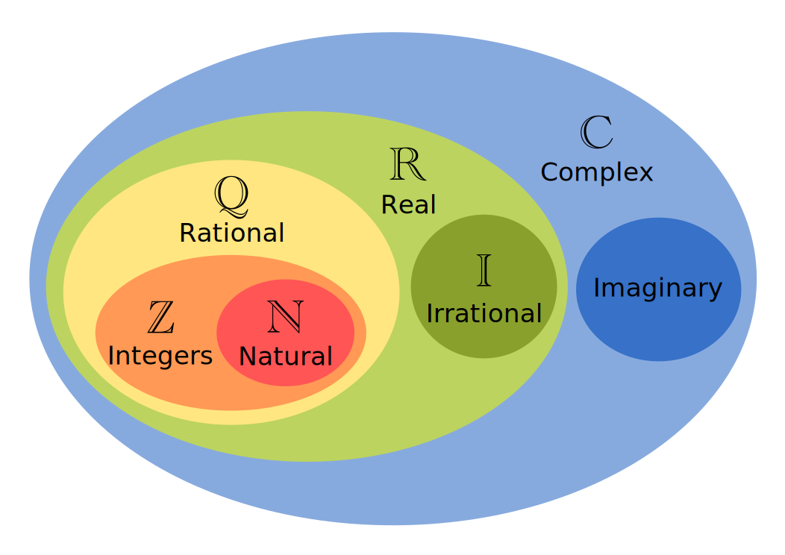

# 数字和计数系统

## 数字系统

区分数字系统和记数系统：

- 数字系统：Numbers can be classified into sets, called **number sets** or **number systems**, such as the natural numbers and the real numbers.

- 记数系统：A **numeral system** is a writing system for expressing numbers without words; that is, a mathematical notation for representing numbers of a given set, using digits (in positional notation) or other symbols (in sign-value notation) in a consistent manner.

{ width="70%" }

## 记数系统

**数字系统**（numeral system），又称**记数系统**，指的是用以表示数字的书写系统，如[印度–阿拉伯数字系统](https://en.wikipedia.org/wiki/Hindu%E2%80%93Arabic_numeral_system)、[罗马数字](https://en.wikipedia.org/wiki/Roman_numerals)、[苏州码子](https://en.wikipedia.org/wiki/Suzhou_numerals)等。数字系统是我们给数做编码的工具。一般来说，一个数字系统下的数字都是一串符号，同时有一套规则将这串符号和对应的数一一对应起来，例如罗马数字 $\text{XLII}$、二进制数 $101010_{(2)}$ 和十进制数 $42$ 均能对应到相同的数。

### 进位系统

**进位制**，又称**进位系统**（carry system）、**进制系统**、**位置记法**（positional notation）、**位值记数法**（place-value notation）、**位置数值系统**（positional numeral system），是一种能用有限种符号表示所有自然数的数字系统。一种进位制可以使用的符号数目称为**基数**（radix）或**底数**（base），基数为 $n$ 的进位制称为 $n$ 进制（$n>1$），例如我们最常用的十进制，通常只使用 `0, 1, 2, 3, 4, 5, 6, 7, 8, 9` 这十个符号来记数。进位指的是「当一个数字的某一位达到基数时，将其置为 $0$ 并使高一位的数加一」的操作。

一般地，我们常将一个 $n$ 进制的数记作 $(a_k\cdots a_1a_0)_n$、$(a_k\cdots a_1a_0)_{(n)}$、${a_k\cdots a_1a_0}_{(n)}$、${a_k\cdots a_1a_0}_{n}$ 等。若基数隐含在上下文中我们也可以省略下标。注意此处的 $a_k\cdots a_1a_0$ 并不是 $k+1$ 个数的乘积，而是一串序列。

对于 $k$ 进制数 $a_n\cdots a_1a_0$，其表示的值为 $a_nk^n+\cdots+a_1k^1+a_0k^0=\sum_{i=0}^n a_ik^i$；对一个数 $m$，设其 $k$ 进制下的表示为 $a_n\cdots a_1a_0$，则有：

$$
\begin{array}{cc}
    a_0=m-q_0k,&q_0=f(m/k),\\
    a_1=q_0-q_1k,&q_1=f(q_0/k),\\
    \vdots&\vdots\\
    a_n=q_{n-1}-q_nk,&q_n=f(q_{n-1}/k)=0,\\
\end{array}
$$

其中 $f(x)=\lfloor x\rfloor$。数 $n$ 在 $k$ 进制下表示的长度为 $\lceil\log_k (n+1)\rceil$。

我们一般通过添加小数点「$.$」来表示小数（有的地区使用「$,$」表示小数点）、添加负号「$-$」来表示负数、在小数末尾的一段上添加上划线表示无限循环小数等。为了方便阅读，我们可以每隔若干数位添加间隔符号（如空格、$,$、`'` 等），如 $12~345$ 表示 $12345$。

### 不同进位制间的转换

十进制转其他进制，这里以二进制为例来演示，其他进制的原理与其类似。

整数部分，把十进制数不断执行除 $2$ 操作，直至商数为 $0$，之后从下到上，取所有余数的数字，即为二进制的整数部分数字。小数部分，则用其乘 $2$，取其整数部分的结果，再用计算后的小数部分依此重复计算，算到小数部分全为 $0$ 为止，之后从上到下，取所有计算后整数部分的数字，即为二进制的小数部分数字。

例子：将 $35.25$ 转化为二进制数。

整数部分：

$$
\begin{aligned}
    35/2&=17  &\dots 1,\\
    17/2&=8   &\dots 1,\\
    8/2&=4    &\dots 0,\\
    4/2&=2    &\dots 0,\\
    2/2&=1    &\dots 0,\\
    1/2&=0    &\dots 1.
\end{aligned}
$$

小数部分：

$$
\begin{aligned}
    0.25\times 2&=0.5  &\dots 0,\\
    0.5\times 2&=1     &\dots 1.
\end{aligned}
$$

即 $35.25 = (100011.01)_2$。

其他进制转十进制，还是以二进制为例。二进制数转换为十进制数，只需将每个位的值，乘以 $2^i$ 次即可，其中 $i$ 为当前位的位数，个位的位数为 $0$。

例子：将 $(11010.01)_{2}$ 转换为十进制数。

$$
\begin{aligned}
    (11010.01)_{2}&=\phantom{+~}1\times 2^4+1\times 2^3+0\times 2^2+1\times 2^1+0\times 2^0\\
    &\phantom{=}+~0\times 2^{-1}+1\times 2^{-2} \\
                &=26.25.
\end{aligned}
$$

即 $(11010.01)_2 = (26.25)_{10}$。

二进制/八进制/十六进制间的相互转换：一个八进制位可以用 3 个二进制位来表示（因为 $2^3 = 8$），一个十六进制位可以用 4 个二进制位来表示（$2^4 = 16$），反之同理。

### 补数法

我们将只由 `0` 或 `1` 构成的长度固定的序列称为位序列。最左边的位称为最高位，最右边的位称为最低位。计算机中用位序列表示一定范围内的整数。长度为 $N$ 的位序列只有 $2^N$ 种，所以只能和 $2^N$ 个整数建立一一对应关系。这种一一对应关系可以分为两类：**有符号**和**无符号**。有符号指的是对应的整数有负数，无符号指的是对应的整数全部为非负数。

- 对于无符号的对应关系，我们可以直接将整数的二进制表示作为位序列，长度不足就在高位补 `0`。

    在无符号的对应关系下，长度为 $N$ 的位序列可以表示 $[0,2^N-1]$ 内的整数。

- 对于有符号的对应关系，我们有两种表示规则：**反码**（ones' complement）和**补码**（two's complement）。

    对于非负整数来说，其表示规则和无符号的规则一致；对于负整数来说，我们将其相反数对应的位序列**按位取反**（即将 `0` 变为 `1`，将 `1` 变为 `0`）后的结果称为反码，将反码按无符号的对应关系转为整数，然后加一，最后按无符号的对应关系转为位序列，超出原位序列长度的部分舍弃，得到的新序列称为补码。

    在反码的对应关系下，长度为 $N$ 的位序列可以表示 $[-2^{N-1}+1,2^{N-1}-1]$ 内的整数。

    在补码的对应关系下，长度为 $N$ 的位序列可以表示 $[-2^{N-1},2^{N-1}-1]$ 内的整数。

以 $3$ 位的位序列为例：

| 位序列 | 无符号整数 | 有符号整数（反码） | 有符号整数（补码） |
| ------ | ---------- | ------------------ | ------------------ |
| `000`  | $0$        | $0$                | $0$                |
| `001`  | $1$        | $1$                | $1$                |
| `010`  | $2$        | $2$                | $2$                |
| `011`  | $3$        | $3$                | $3$                |
| `100`  | $4$        | $-3$               | $-4$               |
| `101`  | $5$        | $-2$               | $-3$               |
| `110`  | $6$        | $-1$               | $-2$               |
| `111`  | $7$        | $-0$               | $-1$               |

可以看到反码的最大问题是会出现 $-0$ 这个实际上不存在的「负数」，所以一般情况下我们只用补码。由于表示有符号整数时，其正负号仅由位序列的最高位决定，所以我们将这一位称为**符号位**。将位序列转为整数也是容易做到的：对非负数来说不需要特别操作，对反码来说取反即可得到对应的相反数，对补码来说取反加一即可得到对应的相反数。

**补数法**（method of complements）是用正数表示负数，使得可以用和正数加法相同的算法/电路/机械结构来计算减法的方法。补数法广泛用于计算器和计算机的设计中，用以简化结构。

对 $b$ 进制下 $n$ 位数 $a$，其**数基补数**（radix complement，称为 $b$ 的补数）是 $b^n-a$，其**缩减数基补数**（diminished radix complement，称为 $b-1$ 的补数，简称**减补数**）是 $b^n-1-a$。在二进制下，数基补数叫做 $2$ 的补数（two's complement），又叫做**补码**；缩减数基补数叫做 $1$ 的补数（ones' complement），又叫做**反码**；在十进制下，数基补数又叫做 $10$ 的补数（ten's complement），缩减数基补数又叫做 $9$ 的补数（nine's complement）；其他进制以此类推。

对 $b$ 进制下的 $n$ 位数 $x,y$，当计算 $x-y$ 时，我们有如下方法（若结果超过 $n$ 位，则舍弃高位）：

1. 考虑 $x$ 的减补数 $x'=b^n-1-x$，计算 $x'+y=b^n-1-x+y$，则该结果的减补数即为答案。
2. 考虑 $y$ 的减补数 $y'=b^n-1-y$，计算 $x+y'=b^n-1+x-y$，直接加一即为答案。
3. 考虑 $x$ 的数基补数 $x'=b^n-x$，计算 $x'+y=b^n-x+y$，则该结果的数基补数即为答案。
4. 考虑 $y$ 的数基补数 $y'=b^n-y$，计算 $x+y'=b^n+x-y$，此即为答案。

另外，对 $k$ 进制下的数，我们设 $d=k-1$，则 $\cdots dd=:\overline{d}=\sum_{i=0}^{\infty} dk^i=-1$，所以对 $n$ 位数 $x$，设其数基补数在 $k$ 进制下的表示为 $a_{n-1}\cdots a_1a_0$，则 $\overline{d}a_{n-1}\cdots a_1a_0$ 即为 $\sum_{i=0}^{n-1}a_ik^i+\sum_{i=n}^{\infty} dk^i=k^n-x+(-k^n)=-x$。这种「无限位的数」的思想可以推广为 [**$p$ 进数**](https://en.wikipedia.org/wiki/P-adic_number)（$p$-adic number）。

此外，我们有一个关于补数和无限循环小数的有趣定理：Midy 定理指出，设 $a$ 是正整数，$p$ 是正素数，$a/p$ 在 $b$ 进制下的表示为 $0.\overline{a_1a_2\cdots a_l}$，其中 $l$ 为（最短）循环节长度。若 $l$ 是偶数，设 $l=2k$，则 $a_1a_2\cdots a_k$ 是 $a_{k+1}a_{k+2}\cdots a_{2k}$ 的减补数，即：

- $a_i+a_{i+k}=b$，
- $a_1a_2\cdots a_k+a_{k+1}a_{k+2}\cdots a_{2k}=b^k-1$。

进一步，若 $l$ 有非平凡因子 $k$，设 $l=nk$，则 $\sum_{i=0}^{n-1}a_{ik+1}a_{ik+2}\cdots a_{(i+1)k}$ 是 $b^k-1$ 的倍数。

例子：对于 $1/19=0.\overline{052~631~578~947~368~421}=0.\overline{032~745}_{(8)}$，我们有：

- $052~631~578+947~368~421=999~999~999$，
- $052+631+578+947+368+421=3\times 999$，
- $032_{(8)}+745_{(8)}=777_{(8)}$，
- $03_{(8)}+27_{(8)}+45_{(8)}=77_{(8)}$。

证明：对定理中的 $a,b,p,l,n,k$，不难发现 $1\leq a<p$，$b>1$ 且 $(a,p)=(b,p)=1$。

对整数 $0\leq i<l$，令 $f(i)=b^i\cdot a/p-\lfloor b^i\cdot a/p\rfloor$，我们有

$$
0<f(i)=0.\overline{a_{i+1}a_{i+2}\cdots a_{nk}a_1a_2\cdots a_i}<1 \implies 0<pf(i)<p.
$$

注意到 $pf(i)\in\mathbf{N}_+$ 且 $pf(i)\equiv ab^i\pmod p$，因此 $pf(i)=ab^i\bmod p$。

令 $S_n=\sum_{i=0}^{n-1}f(ik)=\sum_{i=0}^{n-1}0.\overline{a_{ik+1}a_{ik+2}\cdots a_{nk}a_1a_2\cdots a_{ik}}$，我们可以在各个小数间「交换」若干位（例如 $0.\overline{{\color{Orchid}{14}}{\color{RoyalBlue}{28}}{\color{YellowGreen}{57}}}+0.\overline{{\color{RoyalBlue}{28}}{\color{YellowGreen}{57}}{\color{Orchid}{14}}}+0.\overline{{\color{YellowGreen}{57}}{\color{Orchid}{14}}{\color{RoyalBlue}{28}}}=0.\overline{\color{Orchid}{141414}}+0.\overline{\color{RoyalBlue}{282828}}+0.\overline{\color{YellowGreen}{575757}}=0.\overline{\color{Orchid}{14}}+0.\overline{\color{RoyalBlue}{28}}+0.\overline{\color{YellowGreen}{57}}=14/99+28/99+57/99=1$），则

$$
\begin{aligned}
    S_n&=\sum_{i=0}^{n-1}0.\overline{a_{ik+1}a_{ik+2}\cdots a_{(i+1)k}}\\
    &=\sum_{i=0}^{n-1}a_{ik+1}a_{ik+2}\cdots a_{(i+1)k}/\left(b^k-1\right),
\end{aligned}
$$

进而

$$
pS_n=p\sum_{i=0}^{n-1}a_{ik+1}a_{ik+2}\cdots a_{(i+1)k}/\left(b^k-1\right)= \sum_{i=0}^{n-1} \left(ab^{ik}\bmod p\right),
$$

因此

$$
\sum_{i=0}^{n-1}a_{ik+1}a_{ik+2}\cdots a_{(i+1)k}=\left(b^k-1\right)\frac{\sum_{i=0}^{n-1} \left(ab^{ik}\bmod p\right)}{p}.
$$

若 $p\mid \left(b^k-1\right)$，注意到

$$
\left(b^k-1\right)a/p=a_1a_2\cdots a_k.\overline{a_{k+1}a_{k+2}\cdots a_{nk}a_1a_2\cdots a_k}-0.\overline{a_{1}a_{2}\cdots a_{nk}},
$$

则有 $a_{k+1}a_{k+2}\cdots a_{nk}a_1a_2\cdots a_k=a_{1}a_{2}\cdots a_{nk}$，进而 $a_1a_2\cdots a_k=a_{k+1}a_{k+2}\cdots a_{2k}=\dots=a_{(n-1)k+1}a_{(n-1)k+2}\cdots a_{nk}$，即 $0.\overline{a_1a_2\cdots a_l}=0.\overline{a_1a_2\cdots a_k}$，这与 $l$ 的定义矛盾，因此 $p\nmid \left(b^k-1\right)$。

故存在正整数 $c=\dfrac{\sum_{i=0}^{n-1} \left(ab^{ik}\bmod p\right)}{p}$，使得

$$
\sum_{i=0}^{n-1}a_{ik+1}a_{ik+2}\cdots a_{(i+1)k}=c\left(b^k-1\right).
$$

推论：对上述的 $b,n,k,p$，有

$$
\sum_{i=0}^{n-1} b^{ik}\equiv 0\pmod p.
$$

### 广义进制系统

标准的进制系统中，基数 $b$ 总是一个固定的正数，每个数位在 $b$ 种不同的符号中选取，用以表示一个非负数（不考虑小数点和负号）。实际上仍有许多记数系统和进制系统有类似的特征，但不完全符合进制系统的规定，我们把这样的记数系统称为**广义进制系统**或**非标准进制系统**（Non-standard positional numeral systems）。下面介绍几种常见的广义进制系统。

双射记数系统：标准的进制系统并不能和其表示的数字建立双射，如 $1$、$01$、$001$ 表示的数是相同的，我们把最高的非 $0$ 位之前的 $0$ 称为[**前导零**](https://en.wikipedia.org/wiki/Leading_zero)（leading zero）。类似地，我们可以定义[**后导零**](https://en.wikipedia.org/wiki/Trailing_zero)（trailing zero）。而**双射记数系统**（bijective numeral system）可以和其表示的数字建立双射。

双射 $k$ 进制（$k\geq 1$）使用数集 $\{1,2,\dots,k\}$ 来唯一表示一个数，规则如下：

1. 用空串表示 $0$；
2. 用非空串 $a_n\cdots a_1a_0$ 表示数 $a_nk^n+\cdots+a_1k^1+a_0k^0=\sum_{i=0}^n a_ik^i$。

对一个正数 $m$，设其双射 $k$ 进制下的表示为 $a_n\cdots a_1a_0$，则有：

$$
\begin{array}{cc}
    a_0=m-q_0k,&q_0=f(m/k),\\
    a_1=q_0-q_1k,&q_1=f(q_0/k),\\
    \vdots&\vdots\\
    a_n=q_{n-1}-q_nk,&q_n=f(q_{n-1}/k)=0,\\
\end{array}
$$

其中 $f(x)=\lceil x\rceil-1$。

例如 Microsoft Excel 的列标签采用的就是双射 $26$ 进制。在双射记数系统下，我们有 [一进制](https://en.wikipedia.org/wiki/Unary_numeral_system)，一进制下的非空串只由 $1$ 构成，串的长度即为其表示的数。

类似补数法下的叙述，在 $k>1$ 的双射 $k$ 进制下，我们设 $d=k-1$，则 $\cdots dd=:\overline{d}=\sum_{i=0}^{\infty} dk^i=-1$，进而 $\overline{d}k=0$，所以设 $x$ 在双射 $k$ 进制下的表示为 $a_{n-1}\cdots a_1a_0$，则 $\overline{d}ka_{n-1}\cdots a_1a_0$ 即为 $-x$。

下面是双射 $k$ 进制数的一些性质：

- 长度为 $l\geq 0$ 的数共有 $k^l$ 种。
- $k\geq 2$ 时，数 $n$ 在双射 $k$ 进制下表示的长度为 $\lfloor\log_k (n+1)(k-1)\rfloor$。
- $k\geq 2$ 时，若一个数 $n$ 在 $k$ 进制下的表示中不含 $0$，则其在 $k$ 进制下的表示和在双射 $k$ 进制下的表示相同。

双射 $k$ 进制转十进制和 $k$ 进制转十进制的代码相同，下面是十进制转双射 $k$ 进制的参考实现

### 有符号位数进制

有的进位制系统允许数位中出现负数，例如平衡三进制。平衡三进制，也称为对称三进制。这是一个广义进位系统。正规的三进制的数字都是由 `0`,`1`,`2` 构成的，而平衡三进制的数字是由 `-1`,`0`,`1` 构成的。它的基数也是 `3`（因为有三个可能的值）。由于将 `-1` 写成数字不方便，我们将使用字母 `Z` 来代替 `-1`。

这里有几个例子：

| 十进制 | 平衡三进制 | 十进制 | 平衡三进制 |
| ------ | ---------- | ------ | ---------- |
| `0`    | `0`        | `5`    | `1ZZ`      |
| `1`    | `1`        | `6`    | `1Z0`      |
| `2`    | `1Z`       | `7`    | `1Z1`      |
| `3`    | `10`       | `8`    | `10Z`      |
| `4`    | `11`       | `9`    | `100`      |

该数字系统的负数表示起来很容易：只需要将正数的数字倒转即可（`Z` 变成 `1`,`1` 变成 `Z`）。

| 十进制 | 平衡三进制 |
| ------ | ---------- |
| `-1`   | `Z`        |
| `-2`   | `Z1`       |
| `-3`   | `Z0`       |
| `-4`   | `ZZ`       |
| `-5`   | `Z11`      |

很容易就可以看到，负数最高位是 `Z`，正数最高位是 `1`。

在平衡三进制的转转换法中，需要先写出一个给定的数 `x` 在标准三进制中的表示。当 `x` 是用标准三进制表示时，其数字的每一位都是 `0`、`1` 或 `2`。从最低的数字开始迭代，我们可以先跳过任何的 `0` 和 `1`，但是如果遇到 `2` 就应该先将其变成 `Z`，下一位数字再加上 `1`。而遇到数字 `3` 则应该转换为 `0` 下一位数字再加上 `1`。

- 应用一：把 `64` 转换成平衡三进制。

    ***

    首先，我们用标准三进制数来重写这个数：

    $$
    \text 64_{10} = 02101_3
    $$

    让我们从对整个数影响最小的数字（最低位）进行处理：
    - `101` 被跳过（因为在平衡三进制中允许 `0` 和 `1`）；
    - `2` 变成了 `Z`，它左边的数字加 `1`，得到 `1Z101`；
    - `1` 被跳过，得到 `1Z101`。

    最终的结果是 `1Z101`。

    我们再把它转换回十进制：

    $$
    \texttt {1Z101}=81 \times 1 +27 \times (-1) + 9 \times 1 + 3 \times 0 + 1 \times 1 = 64_{10}
    $$

- 应用二：把 `237` 转换成平衡三进制。

    ***

    首先，我们用标准三进制数来重写这个数：

    $$
    \text 237_{10} = 22210_3
    $$
    - `0` 和 `1` 被跳过（因为在平衡三进制中允许 `0` 和 `1`）；
    - `2` 变成 `Z`，左边的数字加 `1`，得到 `23Z10`；
    - `3` 变成 `0`，左边的数字加 `1`，得到 `30Z10`；
    - `3` 变成 `0`，左边的数字（默认是 `0`）加 `1`，得到 `100Z10`；
    - `1` 被跳过，得到 `100Z10`。

    最终的结果是 `100Z10`。

    我们再把它转换回十进制：

    $$
    \texttt{100Z10} = 243 \cdot 1 + 81 \cdot 0 + 27 \cdot 0 + 9 \cdot (-1) + 3 \cdot 1 + 1 \cdot 0 = 237_{10}
    $$

对于一个平衡三进制数 $X_3$ 来说，其可以按照每一位 $x_i$ 乘上对应的权值 $3^i$ 来唯一得到一个十进制数 $Y_{10}$。那对于一个十进制数 $Y_{10}$，是否 **唯一对应一个平衡三进制数** 呢？答案是肯定的，这种性质被叫做平衡三进制的唯一性。我们利用 **反证法** 来求证：

假设一个十进制数 $Y_{10}$，存在两个 **不同的平衡三进制数** $A_3,B_3$ 转化成十进制时等于 $Y_{10}$，即证 $A_3 = B_3$。分情况讨论：

1. 当 $Y_{10}=0$，显然 $A_3 = B_3 = 0_3$，与假设矛盾。
2. 当 $Y_{10}>0$：
    - 将 $A_3$，$B_3$ 的数位按低位到高位编号，记 $a_i$ 为 $A_3$ 的第 $i$ 位，$b_i$ 为 $B$ 的第 $i$ 位。在 $A_3,B_3$ 中，必存在 $i$ 使得 $a_i\neq b_i$。可以发现第 $i-1,i-2,\dots,0$ 位均与证明无关。因此，将 $A_3,B_3$ 按位右移 $i$ 位，得到 $A_3',B_3'$，原问题等价于证明 $A_3'=B_3'$。
    - 对于 $A_3',B_3'$ 第 $0$ 位，$a_0 \neq b_0$。假设 $b_0 > a_0$（$a_0>b_0$ 时结果相同），易知 $b_0 - a_0 \in \{1,2\}$。$A_3'$ 的位 $i=1,2,3,\dots$ 对于 $A_3'$ 的值的贡献为 $S_1 = a_1 \times 3^1 + a_2 \times 3^2+ \dots$，$B_3'$ 的位 $i=1,2,3,\dots$ 对于 $B_3'$ 的值的贡献为 $S_2 = b_1 \times 3^1 + b_2 \times 3^2 + \dots$。由于 $A_3' = B_3'$，得 $S_1 - S_2 = b_0 - a_0$。$S_1,S_2$ 有公因子 $3$，而 $b_0 - a_0$ 不能被 $3$ 整除，与假设矛盾，因此 $A_3'\neq B_3'$

3. 当 $Y_{10}<0$，证法与 $Y_{10}>0$ 相同。

故对于任意十进制 $Y_{10}$，均有唯一对应的平衡三进制 $X_3$。

### Gray 码

Gray 码又叫**循环二进制码**或**反射二进制码**（reflected binary code，RBC），格雷码是一个二进制数字系统，其中两个相邻数的二进制位只有一位不同。举个例子，$3$ 位二进制数的格雷码序列为

$$
000,001,011,010,110,111,101,100
$$

注意序列的下标我们以 $0$ 为起点，也就是说 $G(0)=000,G(4)=110$。格雷码由贝尔实验室的 Frank Gray 于 1940 年代提出，并于 1953 年获得专利。

格雷码的构造方法很多。我们首先介绍手动构造方法，然后会给出构造的代码以及正确性证明。

- 手动构造：

    $k$ 位的格雷码可以通过以下方法构造。我们从全 $0$ 格雷码开始，按照下面策略：
    1. 翻转最低位得到下一个格雷码，（例如 $000\to 001$）；
    2. 把最右边的 $1$ 的左边的位翻转得到下一个格雷码，（例如 $001\to 011$）；

    交替按照上述策略生成 $2^{k-1}$ 次，可得到 $k$ 位的格雷码序列。

- 镜像构造：

    $k$ 位的格雷码可以从 $k-1$ 位的格雷码以上下镜射后加上新位的方式快速得到，如下图：

    $$
    \begin{matrix}
    k=1\\
    0\\ 1\\\\\\\\\\\\\\
    \end{matrix}
    \to \begin{matrix}\\
    \color{Red}0\\\color{Red}1\\\color{Blue}1\\\color{Blue}0\\\\\\\\\\
    \end{matrix}
    \to \begin{matrix}
    k=2\\
    {\color{Red}0}0\\{\color{Red}0}1\\{\color{Blue}1}1\\{\color{Blue}1}0\\\\\\\\\\
    \end{matrix}
    \to \begin{matrix}\\
    \color{Red}00\\\color{Red}01\\\color{Red}11\\\color{Red}10\\\color{Blue}10\\\color{Blue}11\\\color{Blue}01\\\color{Blue}00
    \end{matrix}
    \to \begin{matrix}
    k=3\\
    {\color{Red}0}00\\{\color{Red}0}01\\{\color{Red}0}11\\{\color{Red}0}10\\{\color{Blue}1}10\\{\color{Blue}1}11\\{\color{Blue}1}01\\{\color{Blue}1}00
    \end{matrix}
    $$

我们观察一下 $n$ 的二进制和 $G(n)$。可以发现，如果 $G(n)$ 的二进制第 $i$ 位为 $1$，仅当 $n$ 的二进制第 $i$ 位为 $1$，第 $i+1$ 位为 $0$ 或者第 $i$ 位为 $0$，第 $i+1$ 位为 $1$。于是我们可以当成一个异或的运算，即

$$
G(n)=n\oplus \left\lfloor\frac{n}{2}\right\rfloor
$$

正确性证明：接下来我们证明一下，按照上述公式生成的格雷码序列，相邻两个格雷码的二进制位有且仅有一位不同。

我们考虑 $n$ 和 $n+1$ 的区别。把 $n$ 加 $1$，相当于把 $n$ 的二进制下末位的连续的 $1$ 全部变成取反，然后把最低位的 $0$ 变成 $1$。我们这样表示 $n$ 和 $n+1$ 的二进制位：

$$
\begin{aligned}
(n)_2 &= \cdots0\underbrace{11\cdots11}_{k\text{个}}\\
(n+1)_2 &= \cdots1\underbrace{00\cdots00}_{k\text{个}}
\end{aligned}
$$

于是我们在计算 $g(n)$ 和 $g(n+1)$ 的时侯，后 $k$ 位都会变成 $\displaystyle\underbrace{100\cdots00}_{k\text{个}}$ 的形式，而第 $k+1$ 位是不同的，因为 $n$ 和 $n+1$ 除了后 $k+1$ 位，其他位都是相同的。因此第 $k+1$ 位要么同时异或 $1$，要么同时异或 $0$。两种情况，第 $k+1$ 位都是不同的。而除了后 $k+1$ 位以外的二进制位也是做相同的异或运算，结果是相同的。

证毕。

通过格雷码构造原数（逆变换）：接下来我们考虑格雷码的逆变换，即给你一个格雷码 $g$，要求你找到原数 $n$。我们考虑从二进制最高位遍历到最低位（最低位下标为 $1$，即个位；最高位下标为 $k$）。则 $n$ 的二进制第 $i$ 位与 $g$ 的二进制第 $i$ 位 $g_i$ 的关系如下：

$$
\begin{aligned}
n_k &= g_k \\
n_{k-1} &= g_{k-1} \oplus n_k &&= g_k \oplus g_{k-1} \\
n_{k-2} &= g_{k-2} \oplus n_{k-1} &&= g_k \oplus g_{k-1} \oplus g_{k-2} \\
n_{k-3} &= g_{k-3} \oplus n_{k-2} &&= g_k \oplus g_{k-1} \oplus g_{k-2} \oplus g_{k-3} \\
&\vdots\\
n_{k-i} &=\displaystyle\bigoplus_{j=0}^ig_{k-j}
\end{aligned}
$$

格雷码有一些十分有用的应用，有些应用让人意想不到：

- $k$ 位二进制数的格雷码序列可以当作 $k$ 维空间中的一个超立方体（二维里的正方形，一维里的单位向量）顶点的哈密尔顿回路，其中格雷码的每一位代表一个维度的坐标。

- 格雷码被用于最小化数字模拟转换器（比如传感器）的信号传输中出现的错误，因为它每次只改变一个位。

- 格雷码可以用来解决汉诺塔的问题。

    设盘的数量为 $n$。我们从 $n$ 位全 $0$ 的格雷码 $G(0)$ 开始，依次移向下一个格雷码（$G(i)$ 移向 $G(i+1)$）。当前格雷码的二进制第 $i$ 位表示从小到大第 $i$ 个盘子。

    由于每一次只有一个二进制位会改变，因此当第 $i$ 位改变时，我们移动第 $i$ 个盘子。在移动盘子的过程中，除了最小的盘子，其他任意一个盘子在移动的时侯，只能有一个放置选择。在移动第一个盘子的时侯，我们总是有两个放置选择。于是我们的策略如下：

    如果 $n$ 是一个奇数，那么盘子的移动路径为 $f\to t\to r\to f\to t\to r\to\cdots$，其中 $f$ 是最开始的柱子，$t$ 是最终我们把所有盘子放到的柱子，$r$ 是中间的柱子。

    如果 $n$ 是偶数：$f \to r \to t \to f \to r \to t \to \cdots$

### 非正基数进制

我们知道对于 $k$ 进制数 $a_n\cdots a_1a_0$，其表示的值为 $\sum_{i=0}^n a_ik^i$，我们稍加修改即可定义 $-k$ 进制数 ${a_n\cdots a_1a_0}_{(-k)}$ 表示 $\sum_{i=0}^n a_i(-k)^i$，其中 $a_n,\dots,a_1,a_0\in \{0,1,\dots,k-1\}$。例如 $12345_{(-10)}=8265_{(10)}$。这种进制系统叫做[**负底数进制**](https://en.wikipedia.org/wiki/Negative_base)（negative-base system）。

类似地，我们也可以定义[**复底数进制**](https://en.wikipedia.org/wiki/Complex-base_system)（complex-base system），如 [**2i 进制**](https://en.wikipedia.org/wiki/Quater-imaginary_base)（quater-imaginary base、quater-imaginary numeral system），我们还可以定义[**非整数进位制**](https://en.wikipedia.org/wiki/Non-integer_base_of_numeration)（non-integer base of numeration）用于表示实数的 **$\beta$ 展开**（$\beta$-expansion）等。

### 混合基数进制

标准的进制系统中，每一个数位对应的基数都是固定的，而混合基数进制允许每一个数位对应不同的基数。混合基数进制系统最常见的应用就是计时：小时采用 $24$ 进制，分钟和秒采用 $60$ 进制。

$a_n\cdots a_1a_0$ 在 $b$ 进制下表示的数为 $\sum_{i=0}^n a_ib^i$，而在混合基数进制下，其表示的数为 $\sum_{i=0}^n a_i\prod_{j=0}^{i-1}b_j$，其中 $b_j$ 为 $a_j$ 对应的基数。

最常见的混合基数进制系统是[**阶乘进制**](https://en.wikipedia.org/wiki/Factorial_number_system)（factorial number system），其中的数可以记作 ${a_n\cdots a_1a_0}_{~!}$，其表示的数为 $\sum_{i=0}^na_i i!$。阶乘进制的应用可参见 Lehmer 码/Cantor 展开。$a_i$ 对应的基数是 $i+1$，$0\leq a_i\leq i$。注意到 $(n+1)!-n!=n\cdot n!$，所以数在阶乘进制下的表示在去除前导零的情况下是唯一的。

## 虚数与复数

### 虚数定义

虚数 $i$ 为一个定义为

$$
i^2+1=0
$$

的一个解，其满足上式的性质，又可表示为，

$$
i^2=-1
$$

> 虽然没有这样的实数可以满足这个二次方程，但可以通过虚数单位将实数系统 $\mathbb R$ 延伸至复数系统 $\mathbb C$。延伸的主要动机为有很多实系数多项式方程式无实数解，可是倘若我们允许解答为虚数，那么这方程式以及所有的多项式方程式都有解。

我们回到原问题，

$$
x^2+1=0
$$

存在两个根，分别为，$i$ 和 $-i$，它们都是有效的，且互为共轭虚数及倒数。

这是因为，虽然 $i$ 和 $-i$ 在数量上不是相等的（它们是一对**共轭虚数**），

但是 $i$ 和 $-i$ 之间没有质量上的区别（$-1$ 和 $+1$ 就不是这样的）。

在任何的等式中同时将所有 $i$ 替换为 $-i$，该等式仍成立。

$$
-i^2=1,-i={1\over i}
$$

例题：考虑 $-5$ 的平方根。

$$
x^2+5=0\\
x=\pm\sqrt5 i
$$

另外，**虚数单位**同样可以表示为，

$$
i=\sqrt{-1}
$$

但是我们对负数开根号没有自然的定义，因此我们也可以定义，

$$
i=-\sqrt{-1}
$$

因此，这往往被认为是错的，因为，

$$
-1=i^2=\sqrt{-1}\times\sqrt{-1}=\sqrt{(-1)> \times(-1)}=1\\
-1=i^2=\pm\sqrt{-1}\times\pm\sqrt{-1}=\pm1
$$

这是显然不对的，因为 $\sqrt a\cdot\sqrt b=\sqrt{ab}$ 需要满足 $a,b>0$。

使用这种记法时需要非常谨慎，有些在实数范围内成立的公式在复数范围内并不成立。

但是我们也可以总结出一些有意义的法则，对于负数 $x$，

$$
\sqrt x=\sqrt{-x}i
$$

例如，

$$
\sqrt{-7}=\sqrt7 i
$$

或者说，对于正数 $y$，

$$
\sqrt{-y}=\sqrt yi
$$

因为，

$$
(\sqrt{-y})^2=-y
$$

成立，这是良好定义的。

对于虚数，存在与实数不同的一些运算法则，对于负数 $x,y$，

$$
\sqrt x\sqrt y=\sqrt{-x}i\times\sqrt{-y}i=-\sqrt{xy}
$$

$$
{\sqrt x\over\sqrt y}={\sqrt{-x}i\over\sqrt{-y}i}=\sqrt{-x\over-y}
$$

不同的虚数都是不能比较大小的，因此虚数也没有正负（但是存在记号）。

如果再将虚数的这个概念扩展开去，就可以组成四元数、八元数等特殊数学范畴。

### 复数定义

**复数**，为实数的延伸，它使任一多项式方程都有根。

形式上，复数系统可以定义为普通实数的虚数 $i$ 的代数扩展。

复数通常写为如下形式：

$$
z=a+bi
$$

这里的 $a$ 和 $b$ 是实数，而 $i$ 是虚数单位，

- 实数 $a$ 叫做复数的**实部**，记为 $\Re(z)$ 或 $\operatorname{Re} z$。

- 实数 $b$ 叫做复数的**虚部**，记为 $\Im(z)$ 或 $\operatorname{Im} z$。

我们有额外定义，

- 实部为零且虚部不为零的复数也被称作「**纯虚数**」，即 $0+bi$。

- 而实部不为零且虚部也不为零的复数也被称作「非纯虚数」或「杂虚数」。

而实数可以被认为是虚部为零的复数，就是说实数 $a$ 等价于复数 $a+0i$。

所有复数的集合通常指示为 $\mathbb C$（黑板粗体），实数 $\mathbb R$ 可以被当作 $\mathbb C$ 的子集。

我们有很多虚数中类似的性质，比如继承虚数的不可比大小，只可比相等为，

两个复数是相等的，当且仅当它们的实部是相等的并且它们的虚部是相等的。

### 二元运算

当计算一个表达式时，只需假设 $i$ 是一个未知数，替代 $i^2$ 为 $-1$ 即可。

对于 $i$ 的更高整数次幂，可以按照如下规则替换，

$$
i^2=-1\\
i^3=i^2\times i=-i\\
i^4=i^3\times i=-i^2=1\\
i^5=i^4\times i=i
$$

我们归纳为，

$$
\begin{aligned}
i^0&=1\\
i^1&=i\\
i^2&=-1\\
i^3&=-i\\
i^n&=i^{n\bmod 4}
\end{aligned}
$$

由此，可以很好的定义虚数的负指数次方。

我们继续继承虚数的性质，将 $i$ 仅仅看为未知数，用上文的替代即可。

容易发现，复数的运算类似于多项式的运算，有：

$$
(a+bi)\pm(c+di)=(a+c)\pm(b+d)i
$$

$$
(a+bi)(c+di)=(ac-bd)+(ad+bc)i
$$

除法暂不了解。容易推导，复数运算存在，

|    性质    |         公式          |                      公式                       |
| :--------: | :-------------------: | :---------------------------------------------: |
|   封闭性   | $a+b \in \mathbb{C}$  |           $a \times b \in \mathbb{C}$           |
|   结合律   | $a + (b+c) = (a+b)+c$ | $a \times (b \times c) = (a \times b) \times c$ |
|   交换律   |       $a+b=b+a$       |             $a \times b=b \times a$             |
| 存在单位元 |        $a+0=a$        |                $a \times 1 = a$                 |
|  存在逆元  |      $a+(-a)=0$       |         $a \times (1/a) = 1, (a \ne 0)$         |

另外还有分配律：$a \times (b+c) = a \times b + a \times c$。

因此，复数数系是一个域，

复数可定义为实数 $a,b$ 组成的有序对，

- $(a,b)+(c,d)=(a+c,b+d)$.

- $(a,b)\times(c,d)=(ac-bd,bc+ad)$.

- 加法单位元（零元）：$(0,0)$.

- 乘法单位元（幺元）：$(1,0)$.

- $(a,b)$ 的加法逆元：$(-a,-b)$.

### 复数开根

我们有，

$$
\sqrt i={1+i\over\sqrt2}={\sqrt2\over2}(1+i)
$$

因为，两边平方，

$$
2i=i^2+2i+1=2i
$$

> 在此仅做补充，
>
> $$
> \sin i={e^2-1\over2e}i
> $$
>
> $$
> \cos i={e^2+1\over2e}
> $$

补充：在某些学科中，也用 $j$ 表示虚数单位，避免与电流 $i(t)$ 混淆。

容易知道，$1$ 的 $n$ 次方根就是将单位圆均分为 $n$ 份，也就是

$$
\xi_k=\cos\dfrac{2k\pi}{n}+i\sin\dfrac{2k\pi}{n},k\in\{0,1,\dots,n-1\}
$$

我们称 $\xi_0,\xi_1,\dots,\xi_{n-1}$ 为 $n$ 次单位根，由定义都满足 $\xi_i^n=1$

其中 $\xi_0=1$，也就是实数情况下的平凡解。

{ width="60%" }

根据恒等式：

$$
x^n-1=(x-1)\big(x^{n-1}+x^{n-2}+\cdots+1\big)
$$

只要 $k\ne 0$，就有 $\xi_k\ne 1$，这样，

$$
0=\xi_k^{n}-1=(\xi_k-1)\big(\xi_k^{n-1}+\xi_k^{n-2}+\cdots+1\big)
$$

得到

$$
\xi_k^{n-1}+\xi_k^{n-2}+\cdots+1=0
$$

特别地，令 $k=1$，得到

$$
\xi^{n-1}+\xi^{n-2}+\cdots+1=0
$$

由 $\xi_k=\xi^k$，这个式子用求和符号表示就是

$$
\sum_{k=0}^{n-1}\xi_k=0
$$

### 单位根

借助直角坐标系的视角以及极坐标系的视角，可以写出复数的三种形式．

复数的**代数形式**用于表示任意复数．

$$
z=x+y\mathrm{i}
$$

代数形式用于计算复数的加减乘除四个运算比较方便．

复数的**三角形式**和**指数形式**，用于表示非零复数．

$$
z=r(\cos \theta +\mathrm{i}\sin \theta)=r \exp (\mathrm{i}\theta)
$$

这两种形式用于计算复数的乘除两个运算以及后面的运算较为方便．如果只用高中见过的函数，可以使用三角形式．如果引入了复指数函数，写成等价的指数形式会更加方便．

考察方程 $x^n=1$ 在复数意义下的解．显然，这样的解有 $n$ 个，称这 $n$ 个解都是 **$n$ 次单位（复）根**（$n$-th root of unity）．根据复平面的知识，$n$ 次单位根把单位圆 $n$ 等分．

设 $\omega_n=\exp\dfrac{2\pi \mathrm{i}}{n}$（即幅角为 $2\pi/n$ 的单位复数），则 $x^n=1$ 的解集表示为 $\{\omega_n^k\mid k=0,1\cdots,n-1\}$，其中，

$$
w_n^k = \exp\dfrac{2\pi k \mathrm{i}}{n} = \cos\dfrac{2\pi k}{n} + \mathrm{i}\sin\dfrac{2\pi k}{n}.
$$

如果不加说明，一般叙述中的 $n$ 次单位根，是指从 $1$ 开始逆时针方向的第一个解，即上述 $\omega_n$，其它解均可以用 $\omega_n$ 的幂表示．

为什么通常提到 $n$ 次单位根，总是特指第一个？主要是为了应用时方便．所有 $n$ 次单位根都可以表示为第一个 $n$ 次单位根 $\omega_n$ 的幂次；而且，对于任意 $k < n$，复数 $\omega_n$ 都不是 $k$ 次单位根．

事实上，$n$ 次单位根中满足类似性质的不止 $\omega_n$ 一个．称集合

$$
\{\omega_n^k\mid 0\le k<n,~\gcd(n,k)=1\}
$$

中的元素为 **$n$ 次本原单位根**（$n$-th primitive root of unity）．根据上述表达式可知，全体 $n$ 次本原单位根共有 $\varphi(n)$ 个，其中，$\varphi(n)$ 为欧拉函数．

任意一个本原单位根 $\omega$，都与上述 $\omega_n$ 具有相同的性质：对于任意的 $0<k<n$，$\omega$ 的 $k$ 次幂不为 $1$，也就是说，$\omega$ 不是 $k$ 次单位根．因此，借助任意一个本原单位根，都可以生成全体单位根．

为了理解 $n$ 次本原单位根的结构，需要考虑单位根的如下性质：对于整数 $n$ 和 $k$，设 $d=\gcd(n,k)$，有 $\omega_n^k = \omega_{n/d}^{k/d}$．

直接计算可知

$$
w_n^k = \exp\dfrac{2\pi k\mathrm{i}}{n} = \exp\dfrac{2\pi (k/d)\mathrm{i}}{n/d} = \omega_{n/d}^{k/d}.
$$

这说明，只要 $\gcd(n,k)\neq 1$，那么，$\omega_n^k$ 就一定是 $\dfrac{n}{\gcd(n,k)}$ 次（本原）单位根．因此，满足前述性质的单位根 $\omega_n^k$ 一定是满足 $\gcd(n,k)=1$．这正是本原单位根具有上述定义的原因．

另外，作为这些分析的简单推论，有：当 $k$ 遍历 $n$ 的因数，所有 $k$ 次本原单位根恰构成 $n$ 次单位根的一个划分．而且，对于 $\ell\perp n$，映射 $x\mapsto x^\ell$ 给出 $n$ 次单位根之间的双射，且保持上述划分不变：它将 $k\mid n$ 次本原单位根仍然映射到 $k$ 次本原单位根．

尽管本原单位根有很多选择，但是由于第一个根 $\omega_n$ 形式最为简单，算法竞赛中还是 $\omega_n$ 最为常用．对于部分场景，为提高计算效率，还可以考虑用某一模数下的本原单位根代替复数域中的 $\omega_n$．

## 复平面

### 复平面

在几何上，我们：

将平面直角坐标系的水平轴（x-axis）用于实部，垂直轴（y-axis）用于虚部，

则，虚数 $a+bi$ 对应的点就是 $(a,b)$；虚部为零的复数可以看作是实数。

容易发现，这一操作是更加直观的将实数数值拓展的过程，我们称为**复平面**。

复平面有时也叫做**阿尔冈平面**，因为它用于阿尔冈图中。

注意到，我们这么表示出来的复数的点，也可以用位置向量 $\overrightarrow{OZ}=(\Re z,\Im z)$ 表示，

但是，虚数的运算不完全遵守其直观的位置向量的运算，尤其是乘法。

### 模长幅角

有了上面的基础（以及图），我们容易定义，

$$
r=|z|=|\overrightarrow{OZ}|=\sqrt{x^2+y^2}=\sqrt{\Re^2z+\Im^2z}
$$

这就是复数的**模**，也称为**绝对值**。

于是，我们有计算方法，

$$
|zw|=|z||w|
$$

$$
\left|{z\over w}\right|={|z|\over|w|}
$$

以及三角形不等式，

$$
|z|-|w|\le|z+w|\le|z|+|w|
$$

以及我们可以定义距离，

$$
\operatorname{dist}(z,w)=|z-w|=|w-z|
$$

而**幅角**定义为位置向量与 $x$ 轴的夹角，一般用 $\varphi$ 表示。

幅角的具体计算方式略，通用公式比较复杂。

我们知道一个位置的角可以有无数种表示方向（$+2\pi$），而，

因此，定义**辐角主值**为，幅角的所有表示方式中，属于 $(-\pi,\pi]$ 的一个。

有时也用 $[0,2\pi)$ 来表示，以避免出现负数。

### 共轭复数

我们类似共轭根式的，定义**共轭复数**，

$$
a+bi,a-bi
$$

互为共轭复数，记为 $\overline z$，可以用于分式化简（分母实数化），

$$
(a+bi)(a-bi)=a^2-(bi)^2=a^2+b^2
$$

于是，我们知道，共轭复数本质是关于实数轴的对称点。

有性质，

$$
\overline{z+w}=\overline z+\overline w
$$

$$
\overline{zw}=\overline z\cdot\overline w
$$

$$
\overline{\overline z}=z,|\overline z|=|z|
$$

其中，$\overline z=z$ 当且仅当 $z$ 是实数。

### 几何解释

复平面的想法提供了一个复数的几何解释。

在加法下，类似向量相加，可以用三角形法则或平行四边形法则。

在乘法下，复数的成绩与向量乘法不同，它更加简洁的定义为，

乘积的模长是两个模长的乘积，乘积的辐角是两个辐角的和。

特别地，用一个模长为 $1$ 的复数相乘即为一个旋转，最常见的，

- 乘以 $1$ 相当于不变。
- 乘以 $i$ 相当于逆时针旋转 $90^\circ$.
- 乘以 $-1$ 相当于逆时针旋转 $180^\circ$.
- 乘以 $-i$ 相当于逆时针旋转 $270^\circ$（顺时针 $90^\circ$）.

而上文已经说了，共轭根式本质是关于实数轴的对称点。

- $|z|=r\implies z$ 在复平面内对应点的集合是以**原点**为圆心，$r$ 为半径的圆。

    $|z-z_1|=r\implies z$ 在复平面内对应点的集合是以 $z_1$ 在复平面内的对应点为圆心，$r$ 为半径的圆。

    $|z-z_1|=|z-z_2|\implies z$ 在复平面内对应点的集合是 $Z_1,Z_2$ 为端点的线段的**中垂线**。

- 设复数 $z_1,z_2,z_1+z_2$ 在复平面内对应点为 $A,B,C$，结合平面向量的基本运算。

    $|z_1+z_2|=|z_1-z_2|\implies$ 四边形 $\text{OACB}$ 为**矩形**。

    $|z_1|=|z_2|\implies$ 四边形 $\text{OACB}$ 为**菱形**。

    $|z_1|=|z_2|$ 且 $|z_1+z_2|=|z_1-z_2|\implies$ 四边形 $\text{OACB}$ 为**正方形**。

## 复数运算

### CIS 函数

纯虚数指数函数，正如标题所说，记为，

$$
\operatorname{cis}x=\cos x+i\sin x
$$

这个 $\operatorname{cis}$ 函数（COSINE PLUS I SINE）主要的功能为简化某些数学表达式，使更简便地表达。

### 欧拉公式

经典公式，

$$
e^{ix}=\cos x+i\sin x
$$

或者，

$$
e^{ix}=\operatorname{cis}x
$$

取 $x=\pi$ 时，即著名的欧拉恒等式，

$$
e^{i\pi}+1=0
$$

这公式可以说明当 $x$ 为实数时，函数 $e^{ix}$ 可在复数平面描述一单位圆。

欧拉公式则提供了，将负数从平面直角坐标系中，变换到极坐标系的理论。

但是我们不讨论极坐标系；我们可以得出两个经典公式，

$$
\sin x={e^{ix}-e^{-ix}\over 2i}
$$

$$
\cos x={e^{ix}+e^{-ix}\over2}
$$

下面更复杂的我们就不讨论了。

### 棣莫弗公式

也是一个经典公式，

$$
(\cos x+i\sin x)^n=\cos(nx)+i\sin(nx)
$$

或者表示为，

$$
\operatorname{cis}^nx=\operatorname{cis}(nx)
$$

在操作上，我们常常限制 $x\in\mathbb R,n\in\mathbb Z$，但是更复杂的也存在类似的公式。

最简单的检验方法是应用欧拉公式，

$$
\def\cis{\operatorname{cis}}
\cis^nx=e^{inx}=\cis(nx)
$$

### 复数与二次方程

对于方程 $ax^2+bx+c=0$（$a,b,c\in C,a\neq 0$），配方得到：

$$
\left(x+\frac{b}{2a}\right)^2=\frac{b^2-4ac}{4a^2}
$$

如果限定系数范围为 $a,b,c\in R$，那么

1. 若 $b^2-4ac>0$，方程有两个不相等的实根；

    $$
    x_{1,2}=\frac{-b\pm\sqrt{b^2-4ac}}{2a}
    $$

2. 若 $b^2-4ac=0$，方程有两个相等的实根；

    $$
    x=\frac{-b}{2a}
    $$

3. 若 $b^2-4ac<0$，方程有两个共轭虚根：

    $$
    x_{1,2}=\frac{-b\pm\sqrt{4ac-b^2}i}{2a}
    $$

### 复数与高次方程

代数基本定理：任何一元 $n(n \in \mathbb{N}^*)$ 次复系数多项式方程 $f(x)=0$ 至少有一个复数根。

设 $a$ 为复数，$f(x)$ 为复系数多项式，因式定理有：$a$ 为 $f(x)$ 的根当且仅当 $(x-a)$ 为 $f(x)$ 的一个因式。

若正整数 $k$ 满足 $(x-a)^k$ 为 $f(x)$ 的因式，但 $(x-a)^{k+1}$ 不为 $f(x)$ 的因式，则称 $a$ 为 $f(x)$ 的 $k$ 重根。二重及以上的根称为重根。

这样，就能由上面两个定理得到推论：任何一元 $n(n \in \mathbb{N}^*)$ 次复系数多项式方程 $f(x)=0$ 都有 $n$ 个复数根（重根按重数计，即把 $k$ 重根当作 $k$ 个根来计）。

把重根合到一起就得到唯一分解定理：任何一元 $n(n \in \mathbb{N}^*)$ 次复系数多项式都可唯一地表示为

$$
f(x)=a\prod_{k=1}^m (x-a_k)^{f_k}
$$

其中 $a, a_1, \dots, a_m \in \mathbb{C}$，$f_1, f_2, \dots, f_m \in \mathbb{N}^*$，满足 $\sum_{k=1}^m f_k=n$。

这样，设 $f(x)=\sum_{k=0}^n a_k x^k (a_n \ne 0)$ 的根为 $x_1, x_2, \dots, x_n$，$f(x)$ 就可以表示成：

$$
f(x)=a_n(x-x_1)(x-x_2)\cdots(x-x_n)
$$

展开多项式就能得到韦达定理：

$$
\sum_{1\le i_1<i_2<\cdots<i_k\le n} x_{i_1} x_{i_2} \cdots x_{i_k} = (-1)^k \frac{a_{n-k}}{a_n}, k=1, 2, \dots, n
$$

对于实系数多项式，即系数都是实数的多项式，有虚根成对定理：若复数 $a$ 是实系数多项式 $f(x)$ 的根，则 $\bar{a}$ 也是 $f(x)$ 的根。

这样，实系数多项式的根，除去实根以外，就都是成对的共轭复数。一元 $n(n \in \mathbb{N}^*)$ 次实系数多项式就能在实数范围内分解为：

$$
f(x)=a \prod_{k=1}^s (x-a_k) \cdot \prod_{k=1}^t (x^2+b_k x+c_k)
$$

其中 $a, a_k, b_k, c_k \in \mathbb{R}$，$s+2t=n$，且 $c_k > 0$，$b_k^2 < 4c_k$。
