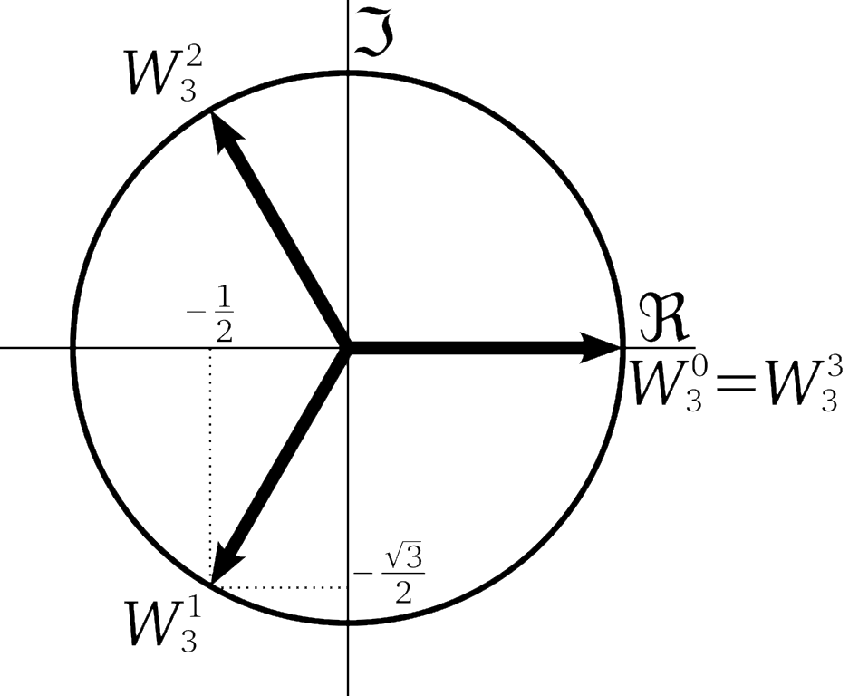

# 数系与复数

## 虚数与复数

### 虚数定义

虚数 $i$ 为一个定义为

$$
i^2+1=0
$$

的一个解，其满足上式的性质，又可表示为，

$$
i^2=-1
$$

> 虽然没有这样的实数可以满足这个二次方程，但可以通过虚数单位将实数系统 $\mathbb R$ 延伸至复数系统 $\mathbb C$。延伸的主要动机为有很多实系数多项式方程式无实数解，可是倘若我们允许解答为虚数，那么这方程式以及所有的多项式方程式都有解。

我们回到原问题，

$$
x^2+1=0
$$

存在两个根，分别为，$i$ 和 $-i$，它们都是有效的，且互为共轭虚数及倒数。

这是因为，虽然 $i$ 和 $-i$ 在数量上不是相等的（它们是一对**共轭虚数**），

但是 $i$ 和 $-i$ 之间没有质量上的区别（$-1$ 和 $+1$ 就不是这样的）。

在任何的等式中同时将所有 $i$ 替换为 $-i$，该等式仍成立。

$$
-i^2=1,-i={1\over i}
$$

例题：考虑 $-5$ 的平方根。

$$
x^2+5=0\\
x=\pm\sqrt5 i
$$

另外，**虚数单位**同样可以表示为，

$$
i=\sqrt{-1}
$$

但是我们对负数开根号没有自然的定义，因此我们也可以定义，

$$
i=-\sqrt{-1}
$$

因此，这往往被认为是错的，因为，

$$
-1=i^2=\sqrt{-1}\times\sqrt{-1}=\sqrt{(-1)> \times(-1)}=1\\
-1=i^2=\pm\sqrt{-1}\times\pm\sqrt{-1}=\pm1
$$

这是显然不对的，因为 $\sqrt a\cdot\sqrt b=\sqrt{ab}$ 需要满足 $a,b>0$。

使用这种记法时需要非常谨慎，有些在实数范围内成立的公式在复数范围内并不成立。

但是我们也可以总结出一些有意义的法则，对于负数 $x$，

$$
\sqrt x=\sqrt{-x}i
$$

例如，

$$
\sqrt{-7}=\sqrt7 i
$$

或者说，对于正数 $y$，

$$
\sqrt{-y}=\sqrt yi
$$

因为，

$$
(\sqrt{-y})^2=-y
$$

成立，这是良好定义的。

对于虚数，存在与实数不同的一些运算法则，对于负数 $x,y$，

$$
\sqrt x\sqrt y=\sqrt{-x}i\times\sqrt{-y}i=-\sqrt{xy}
$$

$$
{\sqrt x\over\sqrt y}={\sqrt{-x}i\over\sqrt{-y}i}=\sqrt{-x\over-y}
$$

不同的虚数都是不能比较大小的，因此虚数也没有正负（但是存在记号）。

如果再将虚数的这个概念扩展开去，就可以组成四元数、八元数等特殊数学范畴。

### 复数定义

**复数**，为实数的延伸，它使任一多项式方程都有根。

形式上，复数系统可以定义为普通实数的虚数 $i$ 的代数扩展。

复数通常写为如下形式： 

$$
z=a+bi
$$

这里的 $a$ 和 $b$ 是实数，而 $i$ 是虚数单位，

+ 实数 $a$ 叫做复数的**实部**，记为 $\Re(z)$ 或 $\operatorname{Re} z$。

+ 实数 $b$ 叫做复数的**虚部**，记为 $\Im(z)$ 或 $\operatorname{Im} z$。

我们有额外定义，

- 实部为零且虚部不为零的复数也被称作「**纯虚数**」，即 $0+bi$。

- 而实部不为零且虚部也不为零的复数也被称作「非纯虚数」或「杂虚数」。

而实数可以被认为是虚部为零的复数，就是说实数 $a$ 等价于复数 $a+0i$。

所有复数的集合通常指示为 $\mathbb C$（黑板粗体），实数 $\mathbb R$ 可以被当作 $\mathbb C$ 的子集。

我们有很多虚数中类似的性质，比如继承虚数的不可比大小，只可比相等为，

两个复数是相等的，当且仅当它们的实部是相等的并且它们的虚部是相等的。

### 二元运算

当计算一个表达式时，只需假设 $i$ 是一个未知数，替代 $i^2$ 为 $-1$ 即可。

对于 $i$ 的更高整数次幂，可以按照如下规则替换，

$$
i^2=-1\\
i^3=i^2\times i=-i\\
i^4=i^3\times i=-i^2=1\\
i^5=i^4\times i=i
$$

我们归纳为，

$$
\begin{aligned}
i^0&=1\\
i^1&=i\\
i^2&=-1\\
i^3&=-i\\
i^n&=i^{n\bmod 4}
\end{aligned}
$$

由此，可以很好的定义虚数的负指数次方。

我们继续继承虚数的性质，将 $i$ 仅仅看为未知数，用上文的替代即可。

容易发现，复数的运算类似于多项式的运算，有：

$$
(a+bi)\pm(c+di)=(a+c)\pm(b+d)i
$$

$$
(a+bi)(c+di)=(ac-bd)+(ad+bc)i
$$

除法暂不了解。容易推导，复数运算存在，

| 性质 | 公式 | 公式 |
| :---: | :---: | :---: |
| 封闭性 | $a+b \in \mathbb{C}$ | $a \times b \in \mathbb{C}$ |
| 结合律 | $a + (b+c) = (a+b)+c$ | $a \times (b \times c) = (a \times b) \times c$ |
| 交换律 | $a+b=b+a$ | $a \times b=b \times a$ |
| 存在单位元 | $a+0=a$ | $a \times 1 = a$ |
| 存在逆元 | $a+(-a)=0$ | $a \times (1/a) = 1, (a \ne 0)$ |

另外还有分配律：$a \times (b+c) = a \times b + a \times c$。

因此，复数数系是一个域，

复数可定义为实数 $a,b$ 组成的有序对，

+ $(a,b)+(c,d)=(a+c,b+d)$.

+ $(a,b)\times(c,d)=(ac-bd,bc+ad)$.

+ 加法单位元（零元）：$(0,0)$.

+ 乘法单位元（幺元）：$(1,0)$.

+ $(a,b)$ 的加法逆元：$(-a,-b)$.

### 复数开根

我们有，

$$
\sqrt i={1+i\over\sqrt2}={\sqrt2\over2}(1+i)
$$

因为，两边平方，

$$
2i=i^2+2i+1=2i
$$

> 在此仅做补充，
> 
> $$
> \sin i={e^2-1\over2e}i
> $$
> 
> $$
> \cos i={e^2+1\over2e}
> $$

补充：在某些学科中，也用 $j$ 表示虚数单位，避免与电流 $i(t)$ 混淆。

容易知道，$1$ 的 $n$ 次方根就是将单位圆均分为 $n$ 份，也就是

$$
\xi_k=\cos\dfrac{2k\pi}{n}+i\sin\dfrac{2k\pi}{n},k\in\{0,1,\dots,n-1\}
$$

我们称 $\xi_0,\xi_1,\dots,\xi_{n-1}$ 为 $n$ 次单位根，由定义都满足 $\xi_i^n=1$

其中 $\xi_0=1$，也就是实数情况下的平凡解。

{ width="60%" }

根据恒等式：

$$
x^n-1=(x-1)\big(x^{\,n-1}+x^{\,n-2}+\cdots+1\big)
$$

只要 $k\ne 0$，就有 $\xi_k\ne 1$，这样，

$$
0=\xi_k^{\,n}-1=(\xi_k-1)\big(\xi_k^{\,n-1}+\xi_k^{\,n-2}+\cdots+1\big)
$$

得到

$$
\xi_k^{\,n-1}+\xi_k^{\,n-2}+\cdots+1=0
$$

特别地，令 $k=1$，得到

$$
\xi^{\,n-1}+\xi^{\,n-2}+\cdots+1=0
$$

由 $\xi_k=\xi^k$，这个式子用求和符号表示就是

$$
\sum_{k=0}^{n-1}\xi_k=0
$$

## 复平面

### 复平面原理

在几何上，我们：

将平面直角坐标系的水平轴（x-axis）用于实部，垂直轴（y-axis）用于虚部，

则，虚数 $a+bi$ 对应的点就是 $(a,b)$；虚部为零的复数可以看作是实数。

容易发现，这一操作是更加直观的将实数数值拓展的过程，我们称为**复平面**。

复平面有时也叫做**阿尔冈平面**，因为它用于阿尔冈图中。

注意到，我们这么表示出来的复数的点，也可以用位置向量 $\overrightarrow{OZ}=(\Re z,\Im z)$ 表示，

但是，虚数的运算不完全遵守其直观的位置向量的运算，尤其是乘法。

### 模长和幅角

有了上面的基础（以及图），我们容易定义，

$$
r=|z|=|\overrightarrow{OZ}|=\sqrt{x^2+y^2}=\sqrt{\Re^2z+\Im^2z}
$$

这就是复数的**模**，也称为**绝对值**。

于是，我们有计算方法，

$$
|zw|=|z||w|
$$

$$
\left|{z\over w}\right|={|z|\over|w|}
$$

以及三角形不等式，

$$
|z|-|w|\le|z+w|\le|z|+|w|
$$

以及我们可以定义距离，

$$
\operatorname{dist}(z,w)=|z-w|=|w-z|
$$

而**幅角**定义为位置向量与 $x$ 轴的夹角，一般用 $\varphi$ 表示。

幅角的具体计算方式略，通用公式比较复杂。

我们知道一个位置的角可以有无数种表示方向（$+2\pi$），而，

因此，定义**辐角主值**为，幅角的所有表示方式中，属于 $(-\pi,\pi]$ 的一个。

有时也用 $[0,2\pi)$ 来表示，以避免出现负数。

### 共轭复数

我们类似共轭根式的，定义**共轭复数**，

$$
a+bi,a-bi
$$

互为共轭复数，记为 $\overline z$，可以用于分式化简（分母实数化），

$$
(a+bi)(a-bi)=a^2-(bi)^2=a^2+b^2
$$

于是，我们知道，共轭复数本质是关于实数轴的对称点。

有性质，

$$
\overline{z+w}=\overline z+\overline w
$$

$$
\overline{zw}=\overline z\cdot\overline w
$$

$$
\overline{\overline z}=z,|\overline z|=|z|
$$

其中，$\overline z=z$ 当且仅当 $z$ 是实数。

### 几何解释

复平面的想法提供了一个复数的几何解释。

在加法下，类似向量相加，可以用三角形法则或平行四边形法则。

在乘法下，复数的成绩与向量乘法不同，它更加简洁的定义为，

乘积的模长是两个模长的乘积，乘积的辐角是两个辐角的和。

特别地，用一个模长为 $1$ 的复数相乘即为一个旋转，最常见的，

+ 乘以 $1$ 相当于不变.
+ 乘以 $i$ 相当于逆时针旋转 $90^\circ$.
+ 乘以 $-1$ 相当于逆时针旋转 $180^\circ$.
+ 乘以 $-i$ 相当于逆时针旋转 $270^\circ$（顺时针 $90^\circ$）.

而上文已经说了，共轭根式本质是关于实数轴的对称点。

## 复数运算

### CIS 函数

纯虚数指数函数，正如标题所说，记为，

$$
\operatorname{cis}x=\cos x+i\sin x
$$

这个 $\operatorname{cis}$ 函数（COSINE PLUS I SINE）主要的功能为简化某些数学表达式，使更简便地表达。

### 欧拉公式

经典公式，

$$
e^{ix}=\cos x+i\sin x
$$

或者，

$$
e^{ix}=\operatorname{cis}x
$$

取 $x=\pi$ 时，即著名的欧拉恒等式，

$$
e^{i\pi}+1=0
$$

这公式可以说明当 $x$ 为实数时，函数 $e^{ix}$ 可在复数平面描述一单位圆。

欧拉公式则提供了，将负数从平面直角坐标系中，变换到极坐标系的理论。

但是我们不讨论极坐标系；我们可以得出两个经典公式，

$$
\sin x={e^{ix}-e^{-ix}\over 2i}
$$

$$
\cos x={e^{ix}+e^{-ix}\over2}
$$

下面更复杂的我们就不讨论了。

### 棣莫弗公式

也是一个经典公式，

$$
(\cos x+i\sin x)^n=\cos(nx)+i\sin(nx)
$$

或者表示为，

$$
\operatorname{cis}^nx=\operatorname{cis}(nx)
$$

在操作上，我们常常限制 $x\in\mathbb R,n\in\mathbb Z$，但是更复杂的也存在类似的公式。

最简单的检验方法是应用欧拉公式，

$$
\def\cis{\operatorname{cis}}
\cis^nx=e^{inx}=\cis(nx)
$$

## 复数与方程

### 二次方程

对于方程 $ax^2+bx+c=0$（$a,b,c\in C,a\neq 0$），配方得到：

$$
\left(x+\frac{b}{2a}\right)^2=\frac{b^2-4ac}{4a^2}
$$

如果限定系数范围为 $a,b,c\in R$，那么

1. 若 $b^2-4ac>0$，方程有两个不相等的实根；

    $$
    x_{1,2}=\frac{-b\pm\sqrt{b^2-4ac}}{2a}
    $$

2. 若 $b^2-4ac=0$，方程有两个相等的实根；

    $$
    x=\frac{-b}{2a}
    $$

3. 若 $b^2-4ac<0$，方程有两个共轭虚根：

    $$
    x_{1,2}=\frac{-b\pm\sqrt{4ac-b^2}\,i}{2a}
    $$

### 高次方程

代数基本定理：任何一元 $n(n \in \mathbb{N}^*)$ 次复系数多项式方程 $f(x)=0$ 至少有一个复数根。

设 $a$ 为复数，$f(x)$ 为复系数多项式，因式定理有：$a$ 为 $f(x)$ 的根当且仅当 $(x-a)$ 为 $f(x)$ 的一个因式。

若正整数 $k$ 满足 $(x-a)^k$ 为 $f(x)$ 的因式，但 $(x-a)^{k+1}$ 不为 $f(x)$ 的因式，则称 $a$ 为 $f(x)$ 的 $k$ 重根。二重及以上的根称为重根。

这样，就能由上面两个定理得到推论：任何一元 $n(n \in \mathbb{N}^*)$ 次复系数多项式方程 $f(x)=0$ 都有 $n$ 个复数根（重根按重数计，即把 $k$ 重根当作 $k$ 个根来计）。

把重根合到一起就得到唯一分解定理：任何一元 $n(n \in \mathbb{N}^*)$ 次复系数多项式都可唯一地表示为

$$
f(x)=a\prod_{k=1}^m (x-a_k)^{f_k}
$$

其中 $a, a_1, \dots, a_m \in \mathbb{C}$，$f_1, f_2, \dots, f_m \in \mathbb{N}^*$，满足 $\sum_{k=1}^m f_k=n$。

这样，设 $f(x)=\sum_{k=0}^n a_k x^k (a_n \ne 0)$ 的根为 $x_1, x_2, \dots, x_n$，$f(x)$ 就可以表示成：

$$
f(x)=a_n(x-x_1)(x-x_2)\cdots(x-x_n)
$$

展开多项式就能得到韦达定理：

$$
\sum_{1\le i_1<i_2<\cdots<i_k\le n} x_{i_1} x_{i_2} \cdots x_{i_k} = (-1)^k \frac{a_{n-k}}{a_n}, k=1, 2, \dots, n
$$

对于实系数多项式，即系数都是实数的多项式，有虚根成对定理：若复数 $a$ 是实系数多项式 $f(x)$ 的根，则 $\bar{a}$ 也是 $f(x)$ 的根。

这样，实系数多项式的根，除去实根以外，就都是成对的共轭复数。一元 $n(n \in \mathbb{N}^*)$ 次实系数多项式就能在实数范围内分解为：

$$
f(x)=a \prod_{k=1}^s (x-a_k) \cdot \prod_{k=1}^t (x^2+b_k x+c_k)
$$

其中 $a, a_k, b_k, c_k \in \mathbb{R}$，$s+2t=n$，且 $c_k > 0$，$b_k^2 < 4c_k$。
