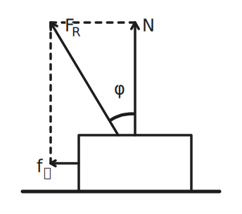

# 力与动量

## 基本性质力

### 力

力：力是物体间的相互作用。

力是改变物体运动状态或改变物体形状的原因。

力有大小、方向、作用点三个要素。

当我们把物体理想化为质点或刚体时，即不计物体的大小或不计物体形状变化时：

力是改变物体运动状态的原因。

力对于刚体具有可传递特性，即可以沿作用线滑移。

可以沿作用线方向改变作用点，而不改变该力对刚体的作用效果。

所以作用在刚体上的力，三个要素是：大小、方向和作用线。

如果物体平衡，即物体静止或保持运动状态不变，作用于物体的各力相互抵消。

受力分析的顺序：先主动力（外力、重力）、后被动力（弹力、摩擦力）。

注意：效果力由性质力充当，例如拉力支持力向心力。

### 拉密定理

拉密定理指出，如果三个共点力的合力为零，那么任一力与其相对角的正弦的比值均相等：

$$
\dfrac{A}{\sin\alpha}=\dfrac{B}{\sin\beta}=\dfrac{C}{\sin\gamma}
$$

其中 $A$、$B$、$C$ 为作用在一点（假设为 $P$）力的大小。

而 $\alpha$、$\beta$、$\gamma$ 则为在 $A$、$B$、$C$ 力相对角的角度。

证明：

把三个力（向量）根据向量的三角形法则联结成为一个封闭的三角形。

根据正弦定理，

$$
\dfrac{A}{\sin(\pi-\alpha)}=\dfrac{B}{\sin(\pi-\beta)}=\dfrac{C}{\sin(\pi-\gamma)}
$$

根据正弦函数的诱导公式，

$$
\dfrac{A}{\sin\alpha}=\dfrac{B}{\sin\beta}=\dfrac{C}{\sin\gamma}
$$

### 力的合成与分解

力的合成：

- 矢量叠加，无先后顺序。

- 合成范围问题，根据三角不等式：

    $$
    ||\bm F_1|-|\bm F_2||\le|\bm F_1+\bm F_2|\le|\bm F_1|+|\bm F_2|
    $$

- 分力与合力为等价关系，二者不共存。

力的分解：

- 根据水平方向分解：最简单直观。

- 根据斜面方向分解：通常会把更多的力集中在坐标轴上。

- 根据力的作用分解：通常沿绳、杆，利用两端力的关系解决。

注意活杆、死结的问题。

### 重力

基本概念：

- 来源：天体表面或附近。

- 本质：在地球上，万有运力提供重力和向心力的效果，即：

    $$
    \bm F_万=\bm G+\bm F_向
    $$

    其中向心力方向为垂直于地轴，因此重力方向不总是指向地心。

三要素：

1. 大小：重力与重力成正比。

2. 方向：重力竖直向下。

3. 作用点：称为重心。

重心：

- 一个物体的重力是在地球表面附近地球对该物体引力的总和，其等效的作用点称为重心。

- 注意：而重心与重力有关，如果没有重力就没有重心。重心不一定等于质心，在匀强重力场中质心等于重心。

- 经典反例：地球上一根非常非常长的杆子，质心为几何重心，而重心因为重力加速度随高度变化，要偏下一点。

求重心的方法：

1. 如果物体具有对称性，重心必在对称轴线上。

2. 如果质量作平面分布，实验上可以用悬挂方法求，即选平面物体上两点，分别悬挂起来，过悬挂点的两条竖直线所交之点即为重心（如果两线平行，可重新再选一点悬挂起来）。

3. 分割法：如果物体由几个部分组成，每部分重心易求，再逐次选择两部分作为两质点求重心，直至求得整个物体的重心。

4. 负质量法：如果物体经补充一部分后变成重心易求的新的物体，那么原物体重心可以由补充后的新物体与具有负质量的补充部分求得。

5. 质心的定义表达式：

    $$
    R_c=\dfrac{m_1\bm r_1+m_2\bm r_2+\dots}{m_1+m_2+\dots}=\dfrac{\sum m_i\bm r_i}{\sum m_i}=\dfrac{1}{M}\sum m_i\bm r_i
    $$

    这是在某个确定的坐标下写出的，其中 $r_i$ 为第 $i$ 个质点在该坐标系下的位置，$m_i$ 为第 $i$ 个质点的质量，$M$ 为总质量。

    写成直角坐标中的分量形式：

    $$
    \begin{aligned}
    X_c&=\dfrac{1}{M}\sum m_ix_i\\
    Y_c&=\dfrac{1}{M}\sum m_iy_i\\
    Z_c&=\dfrac{1}{M}\sum m_iz_i
    \end{aligned}
    $$

### 弹力

基本概念：

- 来源：接触挤压。

- 分类：弹性弹力、刚体弹力。

弹性弹力：

- 弹力必须沿轴向，非自由端不可突变。

- 公式：$\bm F=-k\bm x$，其中 $k$ 称为劲度系数，单位 $\pu{N/m}$。

刚体弹力：

- 方向：与绳杆平行，与接触面垂直。

- 轻绳模型：绳两端力的大小相等、方向相反。

- 注意：刚体弹力做功，机械能不一定守恒。

弹力存在判定：

1. 假设移除法。

2. 受力分析、动力学分析法。

{ width="80%" }

### 摩擦力

两固体接触面有相对滑动或有相对滑动趋势时，所产生的阻碍相对滑动（滑动摩擦力）或相对滑动趋势（静摩擦）的力。

滑动摩擦力：

- 主动力，可以写成一个近似的表达式：

    $$
    f_k=\mu_kN
    $$

    其中 $N$ 为两个相互接触表面的法向力（即正压力），$\mu_k$ 为滑动摩擦系数。

- 长毛法：

    假设物体长毛了，然后经过摩擦，毛的偏向就是所受摩擦力方向。

静摩擦力：

- 被动力，有近似上限：

    $$
    f_s\le\mu_sN
    $$

    一般静摩擦系数 $\mu_s$ 稍大于滑动摩擦系数 $\mu_k$。

    如果没有特殊说明，可以认为 $\mu_s=\mu_k$，统称为摩擦系数 $\mu$。

- 静摩擦力常作为一种通过接触面作用的未知的切向力，它的大小取决于周围其它物体施加的作用力和该物体的运动情况。只有在临界状态，即该物体在接触面处将产生相对滑动、又未产生滑动的临界运动状态时，静摩擦力等于最大静摩擦，$f_s=\mu_sN$。

滚动摩擦力：

- 通常远小于同条件下的滑动摩擦力。

- 注意滚动的时候，如果不是刚体可能会有能量损失。

了处理问题方便，引进摩擦角的概念：

{ align=right width="35%" }

- 在滑动摩擦下，称 $\varphi=\arctan(f_k/N)$ 为滑动摩擦角，因此 $\mu=\tan\varphi$。

- 我们将滑动摩擦力和支持力合并为一个效果力，称为全反力 $F_R$。全反力和支持力的夹角即为摩擦角 $\varphi$，只要物体发生滑动摩擦力，无论支持力是多少，摩擦角都是不变的。

- 一物置于倾角为 $\theta$ 的粗糙斜面上，$\theta<\varphi$ 则物体不会自行滑下，这一现象称为自锁。

另外，在静摩擦下，称 $\varphi=\arctan(f_{sm}/N)$ 为静摩擦角，$f_{sm}$ 为最大静摩擦力。

### 摩擦力做功

我们知道摩擦力做功通常可以表示为摩擦力乘上相对路程，也可以表示为一对摩擦力做的总功。

一对相互作用力做功之和​：考虑两个物体 $A$ 和 $B$，$A$ 受到 $F_A$，$B$ 受到 $F_B$，$F_A$ 和 $F_B$ 是一对相互作用力。那么虽然 $F_A$ 和 $F_B$ 可能是变力，但由于他们时刻相等，可以考虑微分，设两个物体经过微小的位移，此时可以认为它们为大小不变的恒力。

根据相互作用力的关系，显然有

$$
\overrightarrow{F_A} = -\overrightarrow{F_B}
$$

设 $A$ 经过微小位移 $\mathrm d \overrightarrow{x_A}$，$B$ 经过微小位移 $\mathrm d \overrightarrow{x_B}$，则两力做功之和为

$$
\overrightarrow{F_A} \cdot \mathrm d \overrightarrow{x_A} + \overrightarrow{F_B} \cdot \mathrm d \overrightarrow{x_B} = \overrightarrow{F_A} \cdot \mathrm d \left(\overrightarrow{x_A} - \overrightarrow{x_B}\right)
$$

设 $A$ 相对于 $B$ 的运动路径是 $L$，对上式进行第二类曲线积分可得

$$
W_A + W_B = \int_L \overrightarrow{F_A} \cdot \mathrm d l
$$

即一对相互作用力做功之和，只与力和 $A$ 相对 $B$ 运动的路径有关。注意到 $A$ 相对 $B$ 运动的路径是与选取的参考系无关的，因此 一对相互作用力做功之和与参考系无关。这又是一个非常特殊，经典且重要的一个做功与参考系无关的特例——两个与参考系都有关的力，其做功之和可能与参考系无关。

上式也相当于令 $B$ 为参考系的特殊情形，此时由于 $B$ 静止，$F_B$ 不做功，这对相互作用力的做功之和就是 $F_A$ 的做功。这提示我们计算一对相互作用力做功之和，可以考虑换系，以其中一个物体为参考系，则要计算的和简化为一个功。

一对相互作用力做功之和不为零一对相互作用力之和为零，但一对相互作用力做功之和不是。根据上面的结论，我们可以很方便地构造一对相互作用力做功之和为正；为零；为负的情形。

- 两个磁铁相互吸引，手动令两个磁铁相互靠近，则以一个磁铁为参考系，另一个磁铁的磁力与运动方向同向，这对磁力做功之和为正。

- 两个磁铁相互吸引，手动令两个磁铁相互远离，则以一个磁铁为参考系，另一个磁铁的磁力与运动方向反向，这对磁力做功之和为负。

两个磁铁相互吸引，令两磁铁静止，相互作用力做功之和为零。因此，$A$ 对 $B$ 做功 $W$，则 $B$ 对 $A$ 做功 $-W$ 这种说法是完全错误的。

有两个结论：

- 一对静摩擦力做功之和为零。原因：以其中一个物体为参考系，另一个物体没有运动，因此做功之和为零。

- 一对动摩擦做功之和为负。原因：以其中一个物体为参考系，另一个物体的运动方向与它受到的摩擦力相反，因此做功之和为负。

另外，当我们对系统受力分析时，系统的内力一定是完整的几对相互作用力。因此，系统内力之和为零，系统内力做功之和在不同参考系下相同，但不一定为零。

考虑一辆以 $v_车 = \pu{100 m/s}$ 的速度匀速运行的火车上，一个人以 $\pu{1N}$ 的力 $F$ 推动原先静止的，质量为 $m = \pu{2kg}$ 的箱子，使得箱子加速运动到 $v = \pu{1 m/s}$，火车地面光滑。

- 火车参考系上，箱子的动能变化量 $\Delta E_{\mathrm k} = \dfrac 1 2 m v^2 = \pu{1J}$。

- 地面参考系上，箱子的动能变化量为 $\Delta {E_{\mathrm k}}' = \dfrac 1 2 m (v + v_车)^2 - \dfrac 1 2 m {v_车}^2 = \pu{201J}$。

人推动箱子时，火车参考系上人的化学能似乎做功了 $\pu{1J}$，但地面参考系上人的化学能似乎做功了 $\pu{201 J}$。同一个人推动物体，在不同参考系上耗费化学能看似不同甚至相差如此巨大，但化学能怎么可能随参考系改变而改变？这么多多余的能量是哪来的？

化学能中实际做功的一部分并不是只给箱子做功；也同时给人做功了。也就是说，化学能这个非保守能量因素的存在，允许两个物体之间凭空多出一对相互作用力，但没有允许单个物体受到力而另一个物体不受力（违背牛顿第三定律）。聪明的读者已经发现内在的奥妙了：一对相互作用力做功之和与参考系的选取无关。所以本题的答案是：化学能中的一部分在不同参考系下并没有改变，它对应的并不是箱子动能的变化，而是箱子与人动能的总变化。而一对相互作用力做功之和在变换参考系下的情形下不变；事实上，箱子与人的总动能变化量也不变。如果人脚下的地面变为粗糙的（箱子下地面仍光滑），车对人存在静摩擦，使得人静止不动呢？

此时看起来箱子与人的总动能变化量就是箱子的动能变化量，一定与参考系有关？确实，但人此时多受了一个静摩擦的作用，箱子与人的总动能变化量不再是这对来源于化学能的相互作用力做功之和，还要加上人受到的静摩擦做功。而人受到的静摩擦做功在不同参考系下是会变化的。

人的动能变化量恒为 $\bm 0$，与参考系无关？确实，虽然其受到的斥力与摩擦力做功与参考系都有关，但这是一对平衡力，平衡力做功恒为 $0$，与参考系无关。

## 静力平衡

### 质点平衡

在共点力系作用下，物体平衡条件为合外力等于零，可用两种方式表示。

1. 直角坐标系下的分量表示：

    $$
    \begin{aligned}
    \bm F_1+\bm F_2+\dots=\sum \bm F_i=0\\
    \sum F_{ix}=0,\,\sum F_{iy}=0,\,\sum F_{iz}=0
    \end{aligned}
    $$

2. 矢量表示法：逐个力矢量相加，各矢量首尾相接，最后必形成封闭折线。

三力作用下的平衡物体，这三力平衡力系有两个特性：三力必共面、共点。三个力矢量构成封闭三角形。

### 动态平衡

定义力的变化：

- 恒力：大小方向都不变的力。

- 定力：大小改变方向不变的力。

- 变力：大小方向都改变的力。

转矢量三角形法：

1. 条件：恒力、定力、变力各一个。

2. 恒力反向，定力平移，变力移动（TC）。

3. 定力反向，恒力平移，变力移动（黄夫人）。

相似三角形法：

1. 反向延长绳子的力。

2. 竖直向下平移另一力。

3. 找相似三角形（延长弹力）。

4. 列相似比。

特殊的：

- 四力平衡：全反力合成。

- 比例问题：拉密定理。

- 直角三角形：画圆。

### 平动平衡的稳定性

处在平衡状态的质点，当受到扰动时，会稍稍偏离平衡位置。这时会产生合外力。

- 这个合力为回复力，即此合力有把质点拉回到原平衡位置的倾向，那么称原质点的平衡是稳定平衡；

- 这个合力为推斥力，即此合力有把质点推离原平衡位置的倾向，那么称原质点的平衡是不稳定平衡；

- 这个合力为零，既没有回复原位的倾向，又没有推离原位的倾向，那么称原质点的平衡是随遇平衡。

例：位于光滑碗底的质点处于稳定平衡状态；位于光滑圆球顶端的质点处于不稳定平衡状态，位于光滑水平面上的质点处于随遇平衡状态。

### 转动平衡的稳定性

相对固定轴可以转动的物体处于平衡时，受到外界扰动而偏离平衡位置，产生合外力矩。

如果外力矩是一个回复力矩，即此合外力矩有把物体拉回原平衡位置的倾向，那么称原物体的平衡处于稳定的转动平衡状态。

同样，可给出不稳定转动平衡状态和随遇转动平衡状态的定义。

### 无固定转轴物体平衡的稳定性

对于无固定转轴物体，当它受外界扰动而偏离平衡位置时，会产生合外力和合外力矩。

如果合外力是回复力，合外力矩是回复力矩，那么会有被拉回到平衡位置的倾向，则原物体的平衡是稳定平衡。

同样，可给出不稳定平衡和随遇平衡的定义。

而且，物体可以在平动方面处于一种平衡状态，而在转动方面处于另一种平衡状态；对于同一种平动平衡状态，可以在一个方向上处于一种平衡状态，在另一个方向上处于另一种平衡状态。

## 冲量和动量

### 运动的度量

- 笛卡尔和牛顿认为应该将 $mv$ 作为运动的度量（动量）。

- 莱布尼茨认为应该将 $mv^2$ 作为运动的度量（能量）。

- 两个派别对各自的度量都研究出了转化和守恒，我们下面来了解。

### 冲量

冲量是作用在物体上的力在时间上的累积效果。

用符号 $\bm{I}$ 表示，也可用 $\bm{J}$ 或 Imp 表示冲量，公式：

$$
\bm{I}=\bm{F}t
$$

没有特殊的单位，其单位为 $F$ 和 $t$ 单位的合成，即 $\mathrm{N\cdot s}$（牛秒）。

### 冲量和功

$$
\begin{aligned}
\bm{I}=\bm{F}t\\
W=\bm{F}\bm{x}=Fx\cos\theta
\end{aligned}
$$

如果 $I=0$，那么 $F=0$，因为 $t$ 时间为 $0$ 没有意义。

如果 $W=0$，那么是 $F=0$ 或 $x=0$ 或 $\cos\theta=0$。

注意区分合外力（在瞬间，相当于恒力）的冲量和功：

$$
\begin{aligned}
\bm{I}_{\text{合}}=\Sigma\bm{I}=t\Sigma\bm{F}=\bm{F}_{\text{合}}t\\
W_{\text{合}}=\Sigma(\bm{F}\bm{x})=\Sigma W
\end{aligned}
$$

### 动量

动量是一个物体在它运动方向上保持运动的趋势。

用符号 $\bm{p}$ 表示，公式：

$$
\bm{p}=m\bm{v}
$$

没有特殊的单位，其单位为 $m$ 和 $v$ 单位的合成，即 $\mathrm{kg\cdot m/s}$（牛秒）。

变化量的计算：

$$
\Delta\bm{p}=m\bm{v}_t-m\bm{v}_0
$$

注意相减一定要是矢量相减，因此在一条直线上的运算需要规定正方向。

PS：默认初速度方向为正方向。

动量与动能的转化：

$$
p^2=m^2v^2=\frac{1}{2}mv^2\times2m=2m\cdot E_k
$$

即 $E_k=\frac{p^2}{2m}$，但是这个结论适用范围很窄，一定要考虑方向的问题。

### 动量和动能

$$
\begin{aligned}
\bm{p}=m\bm{v}\\
E_k=\frac{1}{2}mv^2
\end{aligned}
$$

其中 $\bm{v}$ 表示速度，$v$ 表示速率。

在 $m$ 不改变的情况下：

若 $p$ 改变，$v$ 的方向和大小一定有一个改变。

若 $E_k$ 改变，只可能是 $v$ 的大小改变。

因此，我们得出：

- 一个物体的动能改变，其动量一定改变；
- 一个物体的动量改变，其动能不一定改变。

例如，一辆快速移动的重型卡车拥有很大的动量。若要使这重型卡车从零速度加速到移动速度，则需要使到很大的作用力；若要使重型卡车从移动速度减速到零，则也需要使到很大的作用力；若卡车轻一点或移动速度慢一点，则它的动量也会小一点。

## 动量定理

### 定义形态

动量定理指出：物体所受合力的冲量等于物体的动量变化。

$$
\begin{aligned}
\Sigma\bm{I}&=\Delta\bm{p}\\
\bm{F}_{\text{合}}t&=m\Delta\bm{v}
\end{aligned}
$$

上述式子可以用一行，更清晰的表示：

$$
\bm{I}=\bm{F}\Delta t=m\Delta\bm{v}=\Delta\bm{p}
$$

其中 $I$ 表示物体所受冲量，$m$ 表示物体的质量，$F$ 表示物体所受的合外力（恒力），$\Delta t$ 表示力的作用时间，$\Delta v$ 表示速度的变化量，$\Delta p$ 是动量变化量。

理解方式：物体摔到地上，$m\Delta v$ 是定值，比较软的地面会产生形变，时间 $t$ 更长、合外力更小。

### 一点解释

$$
\Delta\bm{p}=\bm{I}
$$

即物体的动量变化量即为物体受到的冲量。

$$
{\Delta\bm{p}\over\Delta t}=\bm{F}
$$

即物体的动量变化率即为其受到的合外力。

另外，有牛顿第二定律的原式形式：

$$
\bm{F}={\Delta\bm{p}\over\Delta t}={m\Delta\bm{v}\over\Delta t}=m\bm{a}
$$

部分推导如下：

$$
\begin{aligned}
\bm{F}\Delta t=m\bm{a}\Delta t=m\Delta\bm{v}\\
m\Delta\bm{v}=\Delta(m\bm{v})=\Delta\bm{p}
\end{aligned}
$$

### 解题方法

对（物体），从（初位置）到（末位置），合外力（正方向－负方向），列动量定理：

比如一个重力为 $G$ 的小球落到地上，对地面的压力为 $N$，弹起用时为 $t$：

$$
(N-G)t=\Delta p=m(v_t-v_0)
$$

其中 $v_0$、$v_t$ 可以用匀变直求解，带入可解得未知量。

注意，合外力一定要用「正方向－负方向」而不是大减小，因为此处是要考虑方向的。

### 判断动量守恒

基础方法：

1. 画出系统内所有物体的受力分析；
2. 一对相互作用力抵消；
3. 判断水平方向上是否合外力分量为零；
4. 判断竖直方向上是否加速度矢量和为零。

### 基础题目

列式：

$$
\begin{aligned}
&m_1\bm{v}_1+m_2\bm{v}_2+\dots+m_n\bm{v}_n\\
=\;&m_1\bm{v}_1'+m_2\bm{v}_2'+\dots+m_n\bm{v}_n'
\end{aligned}
$$

求值，注意规定正方向。

## 动量守恒定律

### 定义形态

如果物体受到的合外力为零，则系统内各物体动量之和保持不变。

其推论为：没有外力干预，任何系统的质心都将保持匀速直线运动或静止状态不变。

数学表示：

$$
\sum_{i=1}^n\bm{p}_i=\mathit{const}
$$

一般更常用以以下形式表示：

$$
\sum_{i=1}^nm_i\bm{v}_i=\mathit{const}
$$

即：

$$
\begin{aligned}
&m_1\bm{v}_1+m_2\bm{v}_2+\dots+m_n\bm{v}_n\\
=\;&m_1\bm{v}_1'+m_2\bm{v}_2'+\dots+m_n\bm{v}_n'
\end{aligned}
$$

### 应用条件

动量守恒定律严格成立的条件是物理系统受到的合外力为零。而若在某一个方向上合外力的分量为零，则该方向的动量守恒，即动量在该方向的分量守恒（根据运动的分解与合成和力的独立作用原理可推知）。

求近似值：若系统内部的物体之间相互作用的内力远远大于外力。相对于内力，可以忽略外力，此时动量守恒定律近似成立。例如碰撞、爆炸、反冲，可认为在此过程中，该物体系统（由各个小物体组成）动量守恒。

根本原因：系统间内力等大、反向，相互抵消，这表现了空间平移不变性的特性。

### 公式的使用

对于不守恒的，考虑变化量的：

$$
\begin{aligned}
F_{\text{合}}x=\frac{1}{2}mv_t^2-\frac{1}{2}mv_0^2&&(1)\\
F_{\text{合}}t=mv_t-mv_0&&(2)
\end{aligned}
$$

我们考虑功动能定理 $(1)$ 和动量定理 $(2)$ 存在什么区别和联系。

相同点：都有速度变化量 $\Delta v$ 和质量；不同点：一个是位移 $x$ 一个是时间 $t$。

因此，如果题目中出现了时间，则用动量定理；出现了位移，就用功动能定理。

均无关的，考虑其他方式求值，或者是用能量守恒、动量守恒解题。

对于守恒的，考虑不变化的：

$$
\begin{aligned}
\frac{1}{2}m_1v_1^2+\frac{1}{2}m_2v_2^2=\frac{1}{2}m_1v_1'^2+\frac{1}{2}m_2v_2'^2&&(1)\\
m_1v_1+m_2v_2=m_1v_1'+m_2v_2'&&(2)
\end{aligned}
$$

使用情景很简答，如果守恒，一定要用。是否守恒判断：

如果系统的合外力在某一方向上的分量不做功，那么这个方向上动量守恒。

如果系统内无动能转化为其他形式的能（势能、热能），那么系统动能守恒。

### 经典例题

