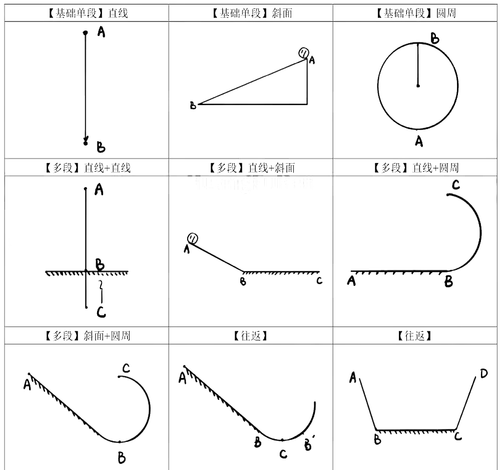

# 运动学与功和能量

这一部分的根本是受力分析，因为这里面绝大部分的力都是不平衡的。

其实在后面几乎所有的力学都需要受力分析，虽然可能简单题不需要画出来也能想清楚。

受力分析的一个常用方法就是整体法，整体法一定是能用就用的。

## 牛顿运动定律

### 牛顿第一定律

牛顿第一定律表述为：不受外力作用的物体必将作匀速直线运动或保持静止。

这条定律就其叙述的内容本身提出了力和惯性两个重要概念：牛顿把改变物体运动状态的因素归于物体受到了力，而运动物体自身又具有保持其匀速直线运动或保持静止的属性，并称此属性为惯性。

根据运动的相对性，对于不同的参照系，物体往往有不同的加速度，在一个参照系中作匀速运动的物体，在另一个参照系中可能有加速度。

牛顿第一定律断言存在着一个参照系，在此参照系中，物体的运动遵循牛顿第一定律。这个参照系称为惯性系，因此，第一定律又称为惯性定律。

运动的相对性告诉我们，对于任何两个相互作匀速运动的参照系，同一质点具有相同的加速度。因此，只要存在一个惯性系，那么相对于此惯性系作匀速运动的所有参照系都是惯性系。

总结：

- 假若施加于某物体的外力为零，则该物体的运动速度不变。
- 静止的物体会保持静止状态，除非有外力施加于这物体。
- 运动中的物体不会改变其运动速度，除非有外力施加于这物体。

注意到速度是向量，物体运动速度的大小与方向都不会改变。

牛顿第一定律的意义就在于定义了惯性参照系，并断言惯性系一定存在。下一步需要给出物体在受到某种影响时，它的运动状态是如何变化的规则。这个规则就是牛顿第二定律。

### 牛顿第三定律

牛顿第三定律表述为：两物体间的相互作用力总是大小相等、方向相反并沿着同一直线。

这条定律指明，作用力和反作用力必定同时存在、同时消失，并且作用在两个不同的物体上，不存在相互抵消的问题。

作用力与反作用力这基本物理概念，时常会被许多人一知半解地应用。

在这里，必须清楚明了一个重点：

这反作用力是施加于另外一个物体，而不是施加于感受到作用力的物体。

经典错误举例：

一、一本书稳定地置放在桌子上，书的重量 $G$ 与桌子施加于书本的力 $N$ 是一对反作用力。

重力本质是由万有引力（近似）提供的，因此 $G$ 的反作用力应该是书本对地球的吸引。桌子对书的力 $N$ 的反作用力是，书对桌子的压力 $N$。

二、离心力是向心力的反作用力。

向心力是效果力，而离心力是一种伪力，二者无关联。

PS：此处伪力，只有从非惯性参考系，才会测量出离心力的存在。

### 牛顿第二定律

在惯性参照系中，外力的作用改变物体的动量，并满足

$$
\bm{F}=\lim_{\Delta t\to0}\dfrac{\Delta\bm{p}}{\Delta t}
$$

在质量不随时间变化的情况下，记为

$$
\bm{F}=m\bm{a}
$$

牛顿第二定律指出了力所引起的物体运动的定量变化：动量的变化率正比于力。

{ width="60%" }

在这条定律中，把受到相同大小作用力的推动下，轻物体容易起动，重物体不易起动的事实，引进了质量的概念。

质量被定义为惯性的定量量度。

惯性不仅在第一定律意义下表现为不受力时所具有的保持原来运动状态的属性，而且还在第二定律意义下表现为在受力情况下具有的改变原来运动状态的抗拒能力。

在这条定律的数学表达式中，力失 $\bm F$ 是物体所受的合外力；并认定，质量具有不变性，是一个常数；力与加速度之间的关系是瞬时关系，即某一时刻的力决定了这一时刻的加速度。

多物体牛二：在 $\bm{F}=m\bm{a}$ 中，左侧 $\bm{F}$ 表示合外力，右侧等号应为 $m\bm{a}$ 的矢量和即可，证明略。

---

微分形式，

经 @lanjiarui 补充：

$$
v(t)
=\lim_{\Delta{t}\to0}\dfrac{x(t+\Delta{t})-x(t)}{\Delta{t}}
=\dfrac{\mathrm{d}x}{\mathrm{d}t}
\\[1.2em]
a(t)
=\lim_{\Delta{t}\to0}\dfrac{v(t+\Delta{t})-v(t)}{\Delta{t}}
=\dfrac{\mathrm{d}v}{\mathrm{d}t}
=\dfrac{\mathrm{d^2}x}{\mathrm{d}t^{2}}
$$

经 @pjykk 补充：

$$
a=\dfrac{\mathrm{d}v}{\mathrm{d}t}=\dfrac{\mathrm{d}v}{\mathrm{d}x}\cdot\dfrac{\mathrm{d}x}{\mathrm{d}t}=v\dfrac{\mathrm{d}v}{\mathrm{d}x}
$$

## 牛顿动力学概述

### 平动加速参考系

牛顿运动定律只适用于惯性系，然而，在某些场合需要在非惯性系中讨论问题。

为此，引进惯性力的概念；以下是平动加速参考系。

设参考系 $S'$ 相对于惯性参考系 $S$ 以不变的加速度 $\bm{a}_0$ 运动。

质量为 $m$ 的质点相对于参考系 $S'$、$S$ 的加速度分别为 $\bm a'$、$\bm a$，他们满足关系：

$$
\bm{a}=\bm{a}'+\bm{a}_0
$$

在惯性系 $S$，牛顿第二定律成立，

$$
\bm{F}=m\bm{a}=m\bm{a}'+m\bm{a}_0
$$

在非惯性系 $S'$，有动力学方程，

$$
m\bm{a}'=\bm{F}-m\bm{a}_0=\bm{F}+\bm{F}_{惯}
$$

其中 $\bm{F}_{惯}=-m\bm{a}_0$，称为惯性力，可以理解为受到与加速度方向相反的大小为 $ma_0$ 的力。

这个方程说明，如果把等式右边看成是质点在平动加速参照系 $S'$ 中受到的合力，那么在 $S'$ 系中仍能在形式上运用牛顿第二定律求解动力学问题。等式右边第一项 $F$ 为质点所受真实力的合力，第二项则是惯性力。

应该强调的是，惯性力并不是其它物体施于质点的真实的力，只是为了能在非惯性系中沿用牛顿第二定律的形式来处理问题而人为引入的虚拟力，也称虚拟力。

在加速平动系中所感受的虚拟力是均匀的，而且与重力一样与质量成正比。它起源于参照系的加速运动，而不是物体间的相互作用。

补充：在惯性系到非惯性系的转换时，可以理解为反叠一个加速度（高中大部分情况都是可以的），因此我们不需要考虑在惯性系下复杂的受力情况，只需要在反叠惯性力的情况下，直接按照假设存在于惯性系中分析即可。

经典例题：光滑地面放置光滑直角劈放置光滑物块，物块自由下滑。容易想到直角劈是加速运动的，直角劈以一个不平行于斜面的加速度加速下滑，此时可以换直角劈为参考系，反叠一个斜面的加速度的惯性力即可。

推荐补充阅读：科里奥利力（可以理解为北半球物体受到向右的力，南半球相反）。

### 非惯性系与惯性系

在惯性系中，物体满足牛顿第一定律，即在不受力的情况下，速度的大小与方向不变。

非惯性系与惯性系可以通过惯性力的有无来区分，简单来说：非惯性系的效应导致观察者必须在计算中引入惯性力。

惯性力存在意味着此时的物理定律并非最简，所以依据狭义相对论，存在惯性力的参考系不是惯性系：在非惯性系中的运动方程与在惯性系中的运动方程相差一项称为惯性力。这使我们能用实验觉察出一个参考系（例如地球的自转）之非惯性系性质。

非惯性系中的物体会受到惯性力。它是来源于参考系自己加速度的力，而非作用在物体的实际相互作用。

牛顿还考虑直线加速的一种情况：对于一组物体，无论它们相互之间如何运动，如果它们受到平行方向上的相同加速力，它们会继续保持相对运动状态，就像没有受到这种力一样。

这个原理推广了惯性系中的情况。比如，一个关在正自由落体的电梯中的观察者，会发现只要不知道电梯外的情况，自己就是个有效的惯性系，即使此时他正受引力作用加速下落（注：当然此时的 $g=g_0-a$，其中 $g_0$ 表示原来的重力加速度，$a$ 表示加速下落的加速度）。

所以，严格来说，惯性系是一种相对的概念。依据这一点，人们就可以定义彼此静止或匀速平移的惯性系的集合，而单个惯性系是这个集合的一个元素。在使用这种理念的时候，参考系中观测到的一切物体会具有来自参考系的具有基线的共同加速度。例如，还是在电梯的例子中，所有物体都具有相同的引力加速度，而电梯自己也具有这种加速度。

### 超重失重问题

实重可以理解为物体本身的重量。

视重可以理解为体重秤上的重量。

列方程为竖直方向大减小等于 $ma$。

失重表现为视重小于实重，完全失重变现为视重为零。

超重表现为视重大于实重。

### 科里奥利力

可以理解为：

- 北半球受到指向**运动方向**向右的力。

- 南半球受到指向**运动方向**向左的力。

表现有台风转向、马桶漩涡转向等。

### 质量的定义

惯性质量和引力质量是等价的，这条原理在广义相对论中称为等效原理。

**惯性质量**：一个物体的惯性质量决定它受力时的加速度。根据牛顿运动第二定律，假设一个物体受到一个力 $F$，其加速度为 $a$，则其惯性质量。

$$
m=\dfrac{F}{a}
$$

**主动引力质量和被动引力质量**：根据万有引力定律，

$$
F=G\dfrac{M_1M_2}{r^2}
$$

其中，$G$ 表示万有引力常数，这个质量常称为引力质量。

## 功和功率

### 功

$$
W=\vec{F}\vec{x}=Fx\cos\theta=Fx_F
$$

其中 $\theta$ 表示力与位移的夹角，$x_F$ 表示在力 $F$ 的方向上的位移。

一般来说（对于简单题），直线运动用 $W=Fx\cos\theta$，曲线运动用 $W=Fx_F$。

做功正负：正负号取决于 $\cos\theta$ 的大小，即

- 若力与位移的夹角小于直角，则机械功为正，亦称为力做正功。
- 若力与位移的夹角大于直角，则机械功为负，或力做负功，或物体克服力做功。

PS：善用 Fs 图像，FS 图像中图形围成的面积即功。

### 约束力

约束力决定了系统中对象的位移，将其限制在范围内。它消除了在该方向上所有的位移，即物体平行此力的速度被约束为 $0$，因此约束力不对系统做功。

例如：用一根绳子系上一个小球做匀速圆周运动，小球会受到来自绳子，方向指向圆心的一个向心力。这个力的方向和球速度的方向垂直，所以这个力不做功（$W=0$）。

又如：桌上有一本书，施加外力会使书在桌面上移动。如果再对书施加一个垂直的力（实际上书受到的重力和支持力就属于这个力），和其欲移动之方向垂直，则此约束力（施加的垂直力）不做功。

### 平均功率

$$
P=\frac{W}{t}
$$

### 瞬时功率

$$
P=\frac{\mathrm{d}W}{\mathrm{d}t}=\frac{\vec{F}\vec{x}}{t}=\vec{F}\vec{v}=Fv\cos\theta
$$

符号解释同上。

一定注意到功率的变化量是与 $F$、$v$、$\theta$ 都有关的。

## 能量

### 动能

物体因为运动而具有的能量，单位为焦耳 $\mathrm{J}$。

$$
E_k=\frac{1}{2}mv^2
$$

其中 $v$ 表示速率，即瞬时速度。

### 势能

势能，是储存于一物理系统内的一种能量，是一个用来描述物体在保守力场中做功能力大小的物理量。从物理意义上来说，势能表示物体在特定位置上所储存的能量，描述做功能力的大小。在适当的情况下，势能可以转化为例如动能、内能等其他能量。

如果分别作用于两个质点上的作用力与反作用力做功与具体路径无关，只取决于相互作用质点初末位置，那么这样的一对力就叫作保守力。不满足这个条件的则称为非保守力。例如，重力是一种保守力，而摩擦力是一种非保守力。

常见的势能有重力势能和弹性势能，还有其他的，但是不属于这篇文章的范畴。

### 内能

内能是指系统所含有的能量，但不包含因外部力场而产生的系统整体之动能与势能。

内能会因系统能量的增损而随之改变，系统的内能可能因对系统加热、对系统作功，或添加或移除物质而改变。当系统内有不可穿透的墙阻止物质传递时，该系统称之为「封闭系统」。

但是一系统内给定状态下的内能不能被直接量测。内能是一系统内的状态函数，因为其值仅取决于该系统的目前状态，而与达到此一状态所采之途径或过程无关。

虽然内能是个宏观物理量，内能也可在微观层面上由两个假设的量来解释。一个是系统内粒子的微观运动（平移、旋转、振动）所产生的微观动能。另一个是与粒子间的化学键及组成物质的静止质量能量等微观力有关之势能。

摩擦力发热公式：

$$
Q=-(W_f+W_{f'})=-f\Delta s
$$

理想情况下，一对平衡力做总功 $0$，除了摩擦力，因为产生的热量属于损耗。

即一对摩擦力做的总功为负数，而损耗的部分就是放热，即总功取相反数。

这对摩擦力大小相同，方向相反，其阻碍物体产生的相对运动就是发热多少。

### 重力势能

重力大小：

$$
G=mg
$$

表示重力做功的能力。

$$
E_{pG}=mgh
$$

其中 $h$ 表示距离零势能面的高度。

$$
\Delta E_{pG}=mg\Delta h
$$

物体质量不变，重力势能变化量与零势能面无关。

$$
W_G=-\Delta E_{pG}
$$

重力做正功，重力势能减少。

### 弹性势能

胡克定律：

$$
F_{\text{弹}}=kx
$$

弹性势能公式：

$$
E_{p\text{弹}}=\frac{1}{2}kx^2
$$

弹力做正功，弹性势能减少。

$$
W_{\text{弹}}=-\Delta E_{p\text{弹}}
$$

注意：这里讨论的做功是弹簧对物体做功，弹簧的势能减小。

### 机械能

机械能是指宏观物质所表现出的势能 $E_p$ 与动能 $E_k$ 的总和，即：

$$
E_{\text{机}}=E_k+E_p
$$

不包括电势能。

### 机械能与做功

$$
W_{\text{除G}}=\Delta E_{\text{机}}
$$

做正功，机械能增加；排除了重力做功，因为：

重力做功会导致重力势能减小，动能增加，总和不变。

## 守恒定律

假若孤立物理系统的某种可观测性质遵守守恒定律，则随着系统的演进，这种性质不会改变。

诺特定理表明，每一种守恒定律，必定有其伴随的物理对称性。

即不论在空间的取向为何，物理系统的物理行为一样。

### 绝对定律

绝对定律指，物理学者从未找到任何违背这些定律的证据。

- 质能守恒定律
- 动量守恒定律
- 角动量守恒定律
- 电荷守恒定律
- ……

### 近似定律

在某些特别状况，像低速、短暂时间尺寸、某种相互作用等等，以下这些定律近似于正确。

- 质量守恒定律（适用于非相对论性速度与不存在核反应的状况）
- 能量守恒定律（适用于非相对论性速度与不存在核反应的状况）
- 宇称对称性
- ……

### 机械能守恒定律

机械能守恒定律指出，任何物体系统无外力做功，系统内又只有保守力做功时，则系统的机械能（动能与势能之和）保持不变。

外力做功为零，表明没有从外界输入机械功；只有保守力做功，即只有动能和势能的转化，而无机械能转化为其他能，符合这两条件的机械能守恒对一切惯性参考系都成立。

本质：势能（$E_p$）和动能（$E_k$）的相互转化。

机械能守恒的条件：对于一个系统，如果系统内部只有保守力做功（常见的，摩擦力就不属于保守力），系统无外力做功（合外力不做功）的情况下，机械能守恒。

另一个不严谨的判断方式：判断系统内的机械能有没有转变为系统外的机械能（比如弹簧的压缩和伸长），判断系统内的动能和势能之和有没有变化（比如匀速下落的小球）。

注意：有的地方可能会写除去重力，其本质就是当我们讨论地球上的物体的时候，这个被讨论的系统其实是地球和物体，而地球和物体的相互作用重力是保守力，因此重力不算「外力」。

### 能量守恒定律

第一个形式：初能量等于末能量。

$$
E_t=E_0
$$

第二个形式：增能量等于减能量，即所有做功代数和为零。

$$
\Sigma E=0
$$

往往要配合单物体功动能定理使用。

## 功动能定理

### 定义形态

功动能定理指合力作用在物质上（合力做功）的功等于物质的动能变化量。

$$
W_{\text{合}}=\Delta E_k=\frac{1}{2}m{v_t}^2-\frac{1}{2}m{v_0}^2
$$

其中可以表示，

$$
W_{\text{合}}=F_{\text{合}}x=\Sigma W
$$

单方向上通常不存在功动能定理。

### 解题方法

对（物体），从（初位置）到（末位置），做功有（哪些力），列功动能定理：

$$
\begin{aligned}
W_{\text{合}}&=\Delta E_k\\
W_G+W_f+\dots&=\frac{1}{2}m{v_t}^2-\frac{1}{2}m{v_0}^2
\end{aligned}
$$

{ width="90%" }

1. 圆周运动上受力和速度的关系。

2. 绳杆最高点最低点的受力关系。

如何选择运动段应用功动能定理：

- 问一个点的信息：一个 $v$ 已知的点、这个点。
- 问一个段的信息：两个 $v$ 已知的点。

不需要完全是这个段的端点，也可以是包含这个部分的一个大段。

### 负正相关

带负号的叫负相关：

- 表示做功后能量减小。

    $$
    \begin{aligned}
    W_G&=-\Delta E_{pG}\\
    W_{\text{弹}}&=-\Delta E_{p\text{弹}}
    \end{aligned}
    $$

- 即，负相关，重力势能变化量是克服重力做的功，弹性势能变化量是克服弹力做的功。

- 对于重力势能，写：取（整个运动的最低点，某点水平位置）为零势能面。

不带负号的叫正相关：

- 表示做功后能量增加。

    $$
    \begin{aligned}
    W_{\text{合}}&=\Delta E_k\\
    W_{\text{除G}}&=\Delta E_{\text{机}}
    \end{aligned}
    $$

- 即，正相关，动能变化量是合外力做功，机械能变化量是除重力外做的功。

### 摩擦力做功

特点，从斜面上方静止滑下，摩擦力做功与水平距离有关，与斜面倾角无关。

$$
W=\mu mg\cos\theta\cdot x=\mu mgL
$$

在曲线运动中，找压力即可。

内能和摩擦力：

$$
Q=-(W_f+W_{f'})
$$

一个物体克服摩擦力做的功没有实际意义，因为内能需要一对摩擦力做的总功。

### 非质点问题

画出初末状态，找出变化的部分所做的功。

例如一个链条在桌角无摩擦力滑下，水平的部分滑下，找出对应重心下落高度。

### 轻杆轻绳

轻绳、轻杆（$m=0$）没有重力势能、动能。

因此其无法具有能量，总功 $W=0$，只起到传递能量的作用。

据此，我们可以整体的分析，对多个物体同时分析。

轻杆轻绳的力做功直接忽略不计，列功动能定理，列关联速度。

杆子和绳子这种同步转动的，关联速度 $v=r\omega$（同一物体 $\omega$ 相同）。

非同步转动的，分解速度到沿绳沿杆方向，根据同绳等力列式。

### 弹簧做功

常见的问题有两类：

1. 弹簧压缩拉伸，形变量不变，做功为零。

2. 弹簧产生的阻力与动力相等时，为加速度反向的点，注意不一定产生弹力即反向加速。

另外，弹性势能虽然有的时候很好用，但是不常用，通常不需要先考虑。

### 多物体动能定理

本质上，多物体动能定理和机械能守恒定律类似，写出来的式子通常是等价的。

形式上为，将多个单物体动能定理等式简单的相加：

$$
W_1+W_2+\dots=\Delta E_{k1}+\Delta E_{k2}+\dots
$$

注意：轻绳轻杆不储备能量，做的总共为零（起到传递作用）。
