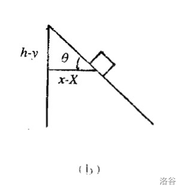
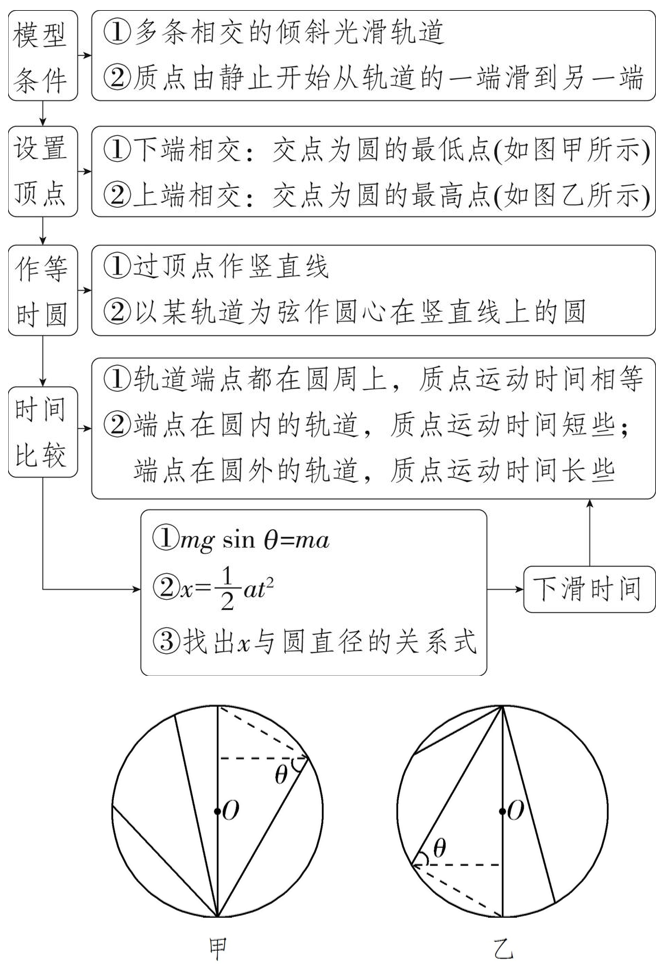
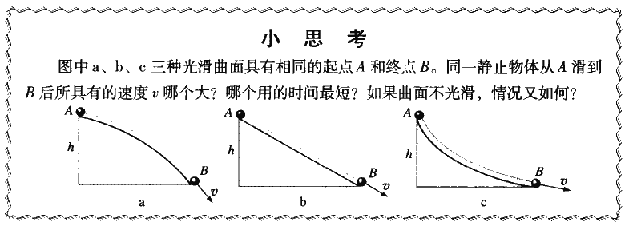
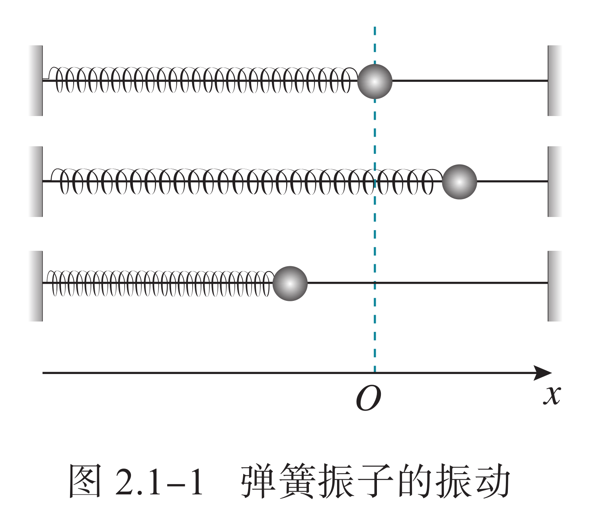
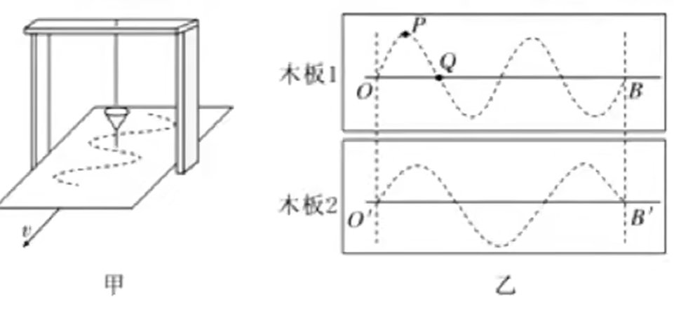
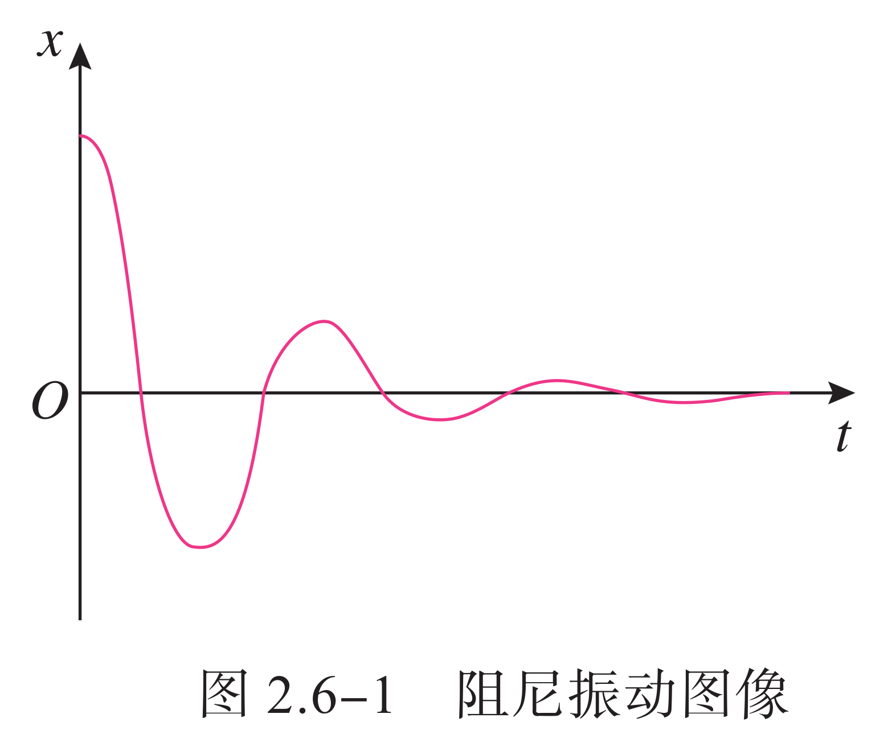

# 动力学模型

## 动力学模型

### 晾衣绳模型

等腰三角形、晾衣杆问题，特征为动滑轮通过刚性轻绳固定，有公式：

$$
F=\dfrac{G}{2\cos\theta}
$$

特征；$F$ 仅与 $\theta$ 有关，上下移动绳子端点力不变，端点水平靠近拉力下降、远离拉力上升。

物体的平衡可以分为稳定平衡、不稳定平衡和随遇平衡三种。

### 弹簧突变

因为弹簧的弹力无法突变，因此我们：

1. 受力分析初状态，得出弹簧弹力。

2. 把弹簧弹力当做外力，重新受力分析。

沿绳方向速度、受力大小一定相等。

### 斜面模型

斜面模型「物体是否会下滑」，设斜面与水平面夹角为 $\theta$：

受力分析，得 $G_x=mg\sin\theta$，$f=\mu mg\cos\theta$。

- 若物体下滑：$G_x>f \Rightarrow G_x/f>1 \Rightarrow \tan\theta/\mu>1 \Rightarrow \tan\theta>\mu$。
- 同理，若物体静止不动，$G_x\le f \Rightarrow \tan\theta\le\mu$。

即，若 $\tan\theta>\mu$，物体会下滑。

同时也可以根据此探究动摩擦因数 $\mu=\arctan\theta$。

### 直角劈模型

注意物体的位置应该在惯性系中表示，否则应用牛顿定律会产生麻烦。

根据已知常量列出方程，例如绳长不变，绳子切面速度相同，以及对应的加速度关系。

典例是直角劈模型，有 $\theta$ 角度的直角劈，一木块放在上面，则：

其中 $V$ 和 $A$ 为劈的速度和加速度，$x$ 为木块相对参考系的水平位移，$X$ 为木块相对参考系的水平位移，$(h-y)$ 为木块滑下的竖直高度：

$$
\begin{aligned}
(x-X)=(h-y)\cot\theta\\
v_x-V=-v_y\cot\theta\\
a_x-A=-a_y\cot\theta
\end{aligned}
$$

上式从上到下，实为对方程两边做一次时间变化率，常数项忽略，常数系数不变。

注意：约束方程与作用力无关，各接触面有无摩擦不影响约束方程。

### 狭义连接体模型

整体法可求得加速度。

隔离法可求得压力／绳子拉力，也可以整体一部分物体。

如果绳子是弯的，那么直接两次隔离把力约掉算加速度。

可以得出，绳子拉力与斜面夹角、摩擦因数均无关：

$$
T=\dfrac{m_1}{m_1+m_2}F
$$

这个公式可以成为连接体的质量分配原则，其中 $1$ 是绳子没有直接拉着的那个物体。

推广：如果两个物体两侧分别拉着（$F_1$ 拉质量为 $m_1$ 的物体，$F_2$ 对于 $m_2$）：

$$
T=\dfrac{F_1m_2+F_2m_1}{m_1+m_2}
$$

即总是一个力乘上没有直接连接的物体。

### 等时圆模型

{ align=right width="50%" }

质点自半径为 $R$ 的空心球（对于平面而言是圆环）的最高点由静止开始无摩擦地沿任一弦下滑至球面（或圆环），所需时间相等，且等于：

$$
\sqrt{\dfrac{4R}{g}}
$$

证明：

设下滑的弦与法线的夹角为 $\beta$，则弦长：

$$
l=2R\cos\beta
$$

沿弦方向加速度为：

$$
a=g\cos\beta
$$

列运动学方程：

$$
\begin{aligned}
l&=\dfrac{1}{2}at^2\\
2R\cos\beta&=\dfrac{1}{2}(g\cos\beta)t^2
\end{aligned}
$$

易得 $t$ 与 $\beta$ 无关，且：

$$
t=\sqrt{\dfrac{4R}{g}}
$$

经典例题：

一小球从角度为 $\alpha$ 的斜面上某一点的上方 $l$ 处沿某一直线无摩擦的滑下，问落到斜面上的最短时间。

由上面的结论，最佳下落线与法线的夹角 $\theta=\alpha/2$。

易知，该圆的直径（$Q$ 为圆与斜面的切点，$H$ 为最高点到斜面的垂足）：

$$
2R=\dfrac{OQ}{\cos\theta}=\dfrac{OH}{\cos^2\theta}=\dfrac{l\cos\alpha}{\cos^2(\alpha/2)}
$$

则：

$$
R=\dfrac{l\cos\alpha}{1+\cos\alpha}
$$

则最短时间：

$$
t=\sqrt{\dfrac{4R}{g}}=2\sqrt{\dfrac{l\cos\alpha}{g(1+\cos\alpha)}}
$$

等时圆的构造：

设定一点为最高点或最低点即可，根据几何关系得到距离圆心的距离。

### 最速降线问题

在平面内，$B$ 点在 $A$ 右下，自 $A$ 静止释放一个小球，运动到 $B$ 点的最短时间。

{ width="100%" }

伯努利（哥哥和弟弟分别）证明了最速降线是一条摆线。

## 传送带和板块模型

{ width="90%" }

**例题１**：质量为 $2\text{kg}$ 的物体沿光滑斜面下滑，斜面与水平面的夹角为 $37^\circ$，求木块的加速度。

列式：

$$
\begin{cases}
F_r&=ma\\
F_r&=G\sin37^\circ\\
G&=mg\\
m&=2\text{kg}
\end{cases}
$$

解得：

$$
\begin{cases}
m&=2&\text{kg}\\
G&=20&\text{N}\\
F_r&=12&\text{N}\\
a&=6&\text{m/s}^2\\
\end{cases}
$$

所以，加速度为 $6\text{m/s}^2$，方向沿斜面向下。

**例题２**：质量为 $2\text{kg}$ 的物体沿斜面下滑，斜面的摩擦因数为 $0.2$，斜面与水平面的夹角为 $37^\circ$，求木块的加速度。

列式：

$$
\begin{cases}
F_r&=ma\\
F_r&=G\sin37^\circ-f\\
f&=\mu N\\
N&=G\cos37^\circ\\
G&=mg\\
m&=2\text{kg}
\end{cases}
$$

解得：

$$
\begin{cases}
m&=2&\text{kg}\\
G&=20&\text{N}\\
N&=16&\text{N}\\
f&=3.2&\text{N}\\
F_r&=8.8&\text{N}\\
a&=4.4&\text{m/s}^2\\
\end{cases}
$$

所以，加速度为 $4.4\text{m/s}^2$，方向沿斜面向下。

**例题３**：质量为 $2\text{kg}$ 的物体静止于水平面的 $A$ 处，$AB$ 间距 $L=20\text{m}$，如图：

$$
\begin{matrix}
\underline{\kern{1em}\Box\kern{7em}\Box\kern{1em}}\\[-0.8em]
\cdot\kern{7.5em}\cdot\\[-0.4em]
{\small{A}}\kern{7em}{\small{B}}
\end{matrix}
$$

现用大小为 $30\text{N}$ 的力，沿水平方向拉物体，$2\text{s}$ 后到达 $B$ 处。

求物体与地面的摩擦因数 $\mu$。  

解：

对物体 $A$ 受力分析：

$$
\begin{cases}
F_r&=F-f\\
N&=G
\end{cases}
$$

展开：

$$
\begin{cases}
ma&=F-\mu N\\
N&=mg
\end{cases}
$$

得到方程组：

$$
\begin{cases}
x&=\dfrac{1}{2}at^2\\
ma&=F-\mu mg
\end{cases}
$$

代数，得：

$$
\begin{cases}
20\text{m}&=\dfrac{1}{2}a\cdot(2\text{s})^2\\
2\text{kg}\cdot a&=30\text{N}-\mu\cdot20\text{N}
\end{cases}
$$

解得：

$$
\begin{cases}
a&=10\text{m/s}^2\\
\mu&=0.5
\end{cases}
$$

即 $\mu=0.5$。

### 传送带模型

加速度：

$$
a=g\sin\theta\pm\mu g\cos\theta
$$

表示重力下滑分量和滑动摩擦力的作用。

假设可以共速静止，比较 $\tan\theta$ 和 $\mu$。

判断共速时的位与和传送带长度之间的关系。

善用 $v-t$ 图像。

### 一板一物模型

地面光滑：

- 木板有初速度。

- 木板无初速度。

地面不光滑：

- 木板有初速度。

- 木板无初速度。

详见 [TC 课件](./第13讲%20板块模型.pdf) 内容。

### 叠加体相对静止

广义连接体，指不用绳子连接的连接体，常见的有用静摩擦力、刚体弹力提供的。

叠加体相对静止，可以看为是由摩擦力提供拉力的连接体模型，因此下面的步骤也非常相似。

整体法可求得加速度。

隔离法可求得摩擦力，也可以整体一部分物体。

可以得出，摩擦力与斜面夹角无关，与摩擦因数有关：

$$
f=\dfrac{m_1}{m_1+m_2}F-\mu mg\cos\theta
$$

若斜面是水平面（$\theta=0$），那么 $\cos\theta=1$：

$$
f=\dfrac{m_1}{m_1+m_2}F-\mu mg
$$

同样也类似质量分配原则，其中 $1$ 是力没有直接作用在的那个物体。

### 叠加体相对滑动

1. 找到不受外力的物体，即可能会发生相对滑动的物体，
2. 隔离法，求出这个物体的最大加速度，
3. 整体法，求出最大的外力大小。

形式一：拉着下面的 $M$ 走，其上表面 $\mu_1$、下表面 $\mu_2$：

$$
F=(m+M)(\mu_1+\mu_2+\tan\theta)g\cdot\cos\theta
$$

若斜面是水平面（$\theta=0$），那么 $\cos\theta=1,\tan\theta=0$：

$$
F=(m+M)(\mu_1+\mu_2)g
$$

形式二：拉着上面的 $m$ 走，其下 $M$ 上表面 $\mu_1$、下表面 $\mu_2$：

$$
F=\dfrac{m}{M}(m+M)(\mu_1-\mu_2)g\cdot\cos\theta
$$

若斜面是水平面（$\theta=0$），那么 $\cos\theta=1$：

$$
F=\dfrac{m}{M}(m+M)(\mu_1-\mu_2)g
$$

注意此形式下，需要上物体能拉动下物体，拉不动的话就更简单了。

## 启动模型

### 解题方法

对（物体），做（运动段），如图（受力分析），列（平衡／牛二）。

$$
\begin{aligned}
F_{\text{合}}=ma&=F-f\\
F&=\frac{P}{v}
\end{aligned}
$$

得出（一定要受力分析）：

$$
\begin{aligned}
F&=f+ma\\
ma&=\frac{P}{v}-f
\end{aligned}
$$

### 恒定功率启动

随着汽车的加速，

1. $v$ 增大，$P$ 不变，$F$ 减小，$F_r$ 减小；
2. $m$ 不变，$a$ 减小，$v$ 变化放缓。
3. 直至 $F=f$，汽车匀速运动。

即汽车加速到一定程度后，汽车将保持匀速运动。

### 恒定加速度启动

按照时间顺序：

1. $a$ 不变，$m$ 不变，$f$ 不变，$F$ 不变；
2. $v$ 增大，$P$ 增大，汽车持续增速；
3. 汽车增速到一定程度后，$P$ 无法继续增大：
4. 此时 $P$ 恒定，故进行恒定功率启动式的加速。

### 做题思路

1. 对匀速运动状态分析：平衡 $F=f$；
2. 对匀加速末状态分析：牛二 $ma=P/v-f$；
3. 对加速阶段状态分析：牛二 $ma=P/v-f$。

### F-1/v 图像

按照时间，从右往左，因为汽车速度增大，倒数减小。

- 牵引力为水平直线的：匀加速运动。
- 牵引力逐渐下降的：加速度逐渐减小。
- 牵引力端点位置：最终状态匀速直线运动。

做题方法：同上，一定要分析的是拐点和端点处的受力分析。

## 简谐运动

### 基本概念

我们把物体或物体的一部分在一个位置附近的往复运动称为机械振动，简称振动。

我们将一个小球连在一个理想弹簧上，放在光滑平面上，我们称小球在运动方向上合力为零的位置称为**平衡位置**（通常是弹簧原长），把小球和弹簧所组成的系统称为**弹簧振子**，也可以简称为振子。

{ width="40%" }

一般来说，默认称位移即为从平衡位置的距离，位移的正负通常需要规定正方向。

- 在平衡位置，速度最大，弹性势能最小。

- 在两段位移的绝对值最大处，速度最小（通常为零），弹性势能最大。

对于更一般的情况，例如考虑竖直放置的弹簧以及小球受到的与弹簧方向共线的重力，我们一般取受力平衡点进行分段讨论，此时也有更一般的结论：

- 加速度与位移方向一定相反。

- 加速度与位移的变化趋势一定相同。

下面我们将主要探讨机械振动中一个较为特殊的运动：简谐运动。

### 运动轨迹

简谐运动是最基本的振动，我们先对简谐运动下一个定义：如果物体的位移与时间的关系遵从正弦函数的规律，即它的振动图像（$x-t$ 图像）是一条正弦曲线，这样的振动是一种简谐运动（**运动学定义**）。

在定义中已经描述了简谐运动的一个重要性质 $x-t$ 图像，我们知道对正弦曲线求导还是正弦曲线，因此 $v-t$ 图像、$a-t$ 图像的性质很容易得出。

$$
\begin{aligned}
x&=A\sin(\omega t+\varphi)\\
v=\dot x&=A\omega\cos(\omega t+\varphi)\\
a=\ddot x&=-A\omega^2\sin(\omega t+\varphi)
\end{aligned}
$$

也就是说有 $a-x,v-x$ 关系：

$$
a=-\omega^2x
$$

$$
v^2=\omega^2(A^2-x^2)
$$

我们对课本上一些经典的物理意义进行总结：

- $A$ 是振幅，即最大位移。

- $\omega$ 是角速度，代表振动的快慢，而完成一次全振动所需要的时间称为周期。

    $$
    T=\dfrac{2\pi}{\omega}
    $$

    我们称物体完成全振动的次数与所用时间之比叫做振动的频率

    $$
    f=\dfrac{1}{T}=\dfrac{\omega}{2\pi}
    $$

    对于仅受到劲度系数为 $k$ 的理想弹簧的弹力的简谐运动，容易推导

    $$
    \omega=\sqrt{\dfrac{k}{m}}
    $$

- $\omega t+\varphi$ 是相位，反应了 $t$ 时刻的空间状态，若 $t=0$ 则为初始状态，称为初相位。

    我们称一对频率相同的简谐运动的相位差为其相位之差的绝对值 $\Delta\varphi=|\varphi_1-\varphi_2|$。

由于我们似乎在数学的三角函数中进行了充分的研究，我们只是提供一种定义方式。

### 力学意义

在一个力的作用下，物体在平衡位置附近做往复运动，我们把这样的力称为**回复力**。

根据胡克定理，弹簧的弹力在简谐运动中就提供了这个回复力：

$$
F=kx
$$

我们发现，物体所受的弹簧弹力始终指向平衡位置，也就是说有向量式

$$
\bm F=-k\bm x
$$

也就是说：如果物体在运动方向上所受的力与它偏离平衡位置位移的大小成正比，并且总是指向平衡位置，物体的运动就是简谐运动（**力学定义**）。

通常来说，如果要求我们证明一个运动是简谐运动，通常来说只需要证明 $F$ 与到某一点位移成正比即可，这个点即为平衡点，例如在天体中我们常常探讨的一个问题。

在地球一条直径处建立一条穿过地心的长直隧道，忽略一切阻力，从一端静止放入一个小球，容易知道万有引力提供回复力

$$
F=G\dfrac{Mm}{r^3}\cdot x
$$

因此这个运动即为一个简谐运动。对于一个一般的证明，例如有多个力的合力提供回复力，可以先列出平衡点方程，然后通过带入这个式子，尝试证明在任意一点的合外力与其位移成正比，然后说明力的方向与位移相反。

### 等效圆周

我们可以认为，简谐运动可以表示为匀速圆周运动在一个方向上的投影，而 $\omega$ 正好对应圆周运动的角速度，我们似乎在数学中讨论了这个问题。

容易证明，简谐运动中的 $F=kx$ 与圆周运动的关系式

$$
k=m\dfrac{v^2}{r^2}
$$

### 简单问题

我们知道，根据正弦函数可以非常方便得到很多性质，但是实际上，我们很难在一道实际的题中求出函数方程，所以，我们通常直接应用物理意义，或者**对称性**进行求解。

振幅的求法：找平衡位置、找速度为零的点，他们之间的距离即为振幅。

对称性：若两点关于平衡位置对称，则合外力（加速度）关于平衡位置对称。

多物体临界问题：通常来说，最大振幅 $x_{\max}$ 正比于最大拉力

$$
x_{\max}=\dfrac{F_{\max}}{k}
$$

也就是 $F(x_{\max})=F_{\max}$。

能量守恒：容易发现，简谐运动一定是能量守恒的，具体的

$$
F=kx=ma
$$

根据圆的思想，有 $a=\omega^2r$，其中 $r=x$，因此

$$
\omega=\sqrt{\dfrac{k}{m}}
$$

因此

$$
E=\dfrac{1}{2}mv^2+\dfrac{1}{2}kx^2=\operatorname{Const.}
$$

具体的，我们带入 $v=0,x=A$，因此

$$
E=\dfrac{1}{2}kA^2=\dfrac{1}{2}m\omega^2A^2
$$

最值位移：在不超过一个的周期内，最值位移一定发生在关于上升零点对称的两侧。

### 单摆运动

不考虑一切**阻力**，一个**刚性轻绳**拴着一个**小球**做**角度很小**（一般来说小于 $5^\circ$ 左右，在这个角度内，我们可以取 $\sin x=x$ 的近似）的摆动，这样的装置就叫作单摆。单摆是实际摆的理想化模型。

我们尝试写出单摆的回复力，我们知道在单摆中，回复力就是切线方向上的分力，即

$$
F=mg\sin\theta\approx mg\theta
$$

根据弧度制的定义，$\theta$ 就是弧长除以绳长 $\ell$，而弧长可以近似看作位移，

$$
F\approx\dfrac{mg}{\ell}x
$$

而在方向上，容易知道是相反的，因此这种运动即为一种近似的简谐运动。

根据周期公式

$$
T=2\pi\sqrt{\dfrac{m}{k}}\approx2\pi\sqrt{\dfrac{\ell}{g}}
$$

注意：我们这里称绳长 $\ell$ 是小球直径远小于绳长，因此在近似的情况下，$\ell$ 应当取绳子悬挂点到下面物体的重心的距离，下面漏斗模型是非常经典的问题。

漏斗漏沙子模型：一条细绳拴着一个装满沙子的漏斗，做单摆运动，沙子缓慢均匀漏下，下方垫一块匀速运动的毯子，则沙子在毯子上留下的轨迹近似为一个正弦图像。

{ width="60%" }

一些性质：

- 沙子不断漏下，因此整体的重心先下降再上升，因此 $\ell$ 先增大后减小，周期也同样先增大后减小。

- 漏斗摆动的速度 $Q$ 点大于 $P$ 点，而单位时间内流下的沙子近似相等，因此 $P$ 点积累的沙子的量比 $Q$ 点多。

### 测重力场

单摆测重力加速度：

- 小球穿孔拴在细绳上，用铁夹将细绳夹在铁架台上。

- 测量周期用停表，测量多次摆动总用时，摆动到正中间开始计时。

我们测的了 $T$ 和 $\ell$，则利用公式

$$
g=\dfrac{4\pi^2}{T^2}\cdot\ell
$$

或者多次测量作出 $T^2-\ell$ 图求斜率，因为图像斜率与 $\ell$ 误差关系较小。

而如果电场力类比为重力，则有

$$
g=\dfrac{Eq}{m}
$$

### 受迫振动

弹簧振子与单摆在没有外力干预的情况下做简谐运动，周期或频率与振幅无关，仅由系统自身的性质决定。我们把这种振动称为固有振动，其振动频率称为固有频率。

由于实际的振动系统都会受到摩擦力、黏滞力等阻碍作用，振幅必然逐渐减小。这种振幅随时间逐渐减小的振动称为阻尼振动。

{ width="40%" }

振动系统能量衰减的方式通常有两种。

- 一种是由于振动系统受到摩擦阻力的作用，使振动系统的机械能逐渐转化为内能。例如单摆运动时受到空气的阻力。

- 另一种是由于振动系统引起邻近介质中各质点的振动，使能量向四周辐射出去，从而自身机械能减少。例如音叉发声时，一部分机械能随声波辐射到周围空间，导致音叉振幅减小。

阻尼振动最终要停下来，那么怎样才能产生持续的振动呢？最简单的办法是使周期性的外力作用于振动系统，外力对系统做功，补偿系统的能量损耗，使系统的振动维持下去。这种周期性的外力叫作驱动力，系统在驱动力作用下的振动叫作受迫振动。机器运转时底座发生的振动、扬声器纸盆的振动，都是受迫振动。

- 物体做受迫振动达到稳定后，物体振动的频率等于驱动力的频率，与物体的固有频率无关。

- 物体在做受迫振动时，驱动力的频率与物体的固有频率相差越小，受迫振动的振幅越大；当驱动力的频率与物体的固有频率相等时，受迫振动的振幅达到最大。

当驱动力的频率等于固有频率时，物体做受迫振动的振幅达到最大值，这种现象称为共振。把一些不同长度的钢片安装在同一个支架上，可以制作转速计。把这样的转速计与开动着的机器紧密接触，机器的振动引起转速计的轻微振动，这时固有频率与机器转速一致的那个钢片发生共振，振幅最大。读出这个钢片的固有频率，就可以知道机器的转速。

共振是十分普遍的现象，在工程技术的许多领域都可以观察到它，都要应用到它。有的情况下需要避免共振。例如，在桥梁、码头等各种建筑的设计施工中，以及飞机、汽车、轮船的发动机等机器设备的设计、制造、安装中，都必须考虑防止共振产生的危害，以保证建筑和设备的安全。

振动控制技术：有一种工程减振装置叫作调谐质量阻尼器，是目前大跨度、大悬挑与高耸结构振动控制中应用最广泛的结构被动控制装置之一。这种装置是一个由弹簧、阻尼器和质量块组成的振动控制系统，附加在需要振动控制的主结构上。主结构在外界驱动力的作用下产生振动时，会带动减振装置一起振动。当满足一定条件时，减振装置的弹性力与外来驱动力的方向相反，抵消了一部分驱动力，从而最大限度地降低主结构的振动，达到减振的效果。
