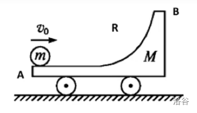
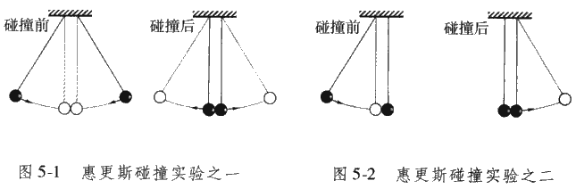

# 动力学的模型总结

## 动力学模型

### 晾衣绳模型

等腰三角形、晾衣杆问题，特征为动滑轮通过刚性轻绳固定，有公式：

$$
F=\dfrac{G}{2\cos\theta}
$$

特征；$F$ 仅与 $\theta$ 有关，上下移动绳子端点力不变，端点水平靠近拉力下降、远离拉力上升。

物体的平衡可以分为稳定平衡、不稳定平衡和随遇平衡三种。

### 斜面模型

斜面模型「物体是否会下滑」，设斜面与水平面夹角为 $\theta$：

受力分析，得 $G_x=mg\sin\theta$，$f=\mu mg\cos\theta$。

- 若物体下滑：$G_x>f \Rightarrow G_x/f>1 \Rightarrow \tan\theta/\mu>1 \Rightarrow \tan\theta>\mu$。
- 同理，若物体静止不动，$G_x\le f \Rightarrow \tan\theta\le\mu$。

即，若 $\tan\theta>\mu$，物体会下滑。

同时也可以根据此探究动摩擦因数 $\mu=\arctan\theta$。

### 直角劈模型

注意物体的位置应该在惯性系中表示，否则应用牛顿定律会产生麻烦。

根据已知常量列出方程，例如绳长不变，绳子切面速度相同，以及对应的加速度关系。

典例是直角劈模型，有 $\theta$ 角度的直角劈，一木块放在上面，则：

其中 $V$ 和 $A$ 为劈的速度和加速度，$x$ 为木块相对参考系的水平位移，$X$ 为木块相对参考系的水平位移，$(h-y)$ 为木块滑下的竖直高度：

$$
\begin{aligned}
(x-X)=(h-y)\cot\theta\\
v_x-V=-v_y\cot\theta\\
a_x-A=-a_y\cot\theta
\end{aligned}
$$

上式从上到下，实为对方程两边做一次时间变化率，常数项忽略，常数系数不变。

注意：约束方程与作用力无关，各接触面有无摩擦不影响约束方程。

### 狭义连接体模型

整体法可求得加速度。

隔离法可求得压力／绳子拉力，也可以整体一部分物体。

如果绳子是弯的，那么直接两次隔离把力约掉算加速度。

可以得出，绳子拉力与斜面夹角、摩擦因数均无关：

$$
T=\dfrac{m_1}{m_1+m_2}F
$$

这个公式可以成为连接体的质量分配原则，其中 $1$ 是绳子没有直接拉着的那个物体。

推广：如果两个物体两侧分别拉着（$F_1$ 拉质量为 $m_1$ 的物体，$F_2$ 对于 $m_2$）：

$$
T=\dfrac{F_1m_2+F_2m_1}{m_1+m_2}
$$

即总是一个力乘上没有直接连接的物体。

### 多物体弹簧突变

因为弹簧的弹力无法突变，因此我们：

1. 受力分析初状态，得出弹簧弹力。
2. 把弹簧弹力当做外力，重新受力分析。

沿绳方向速度、受力大小一定相等。

### 等时圆模型

{ align=right width="50%" }

质点自半径为 $R$ 的空心球（对于平面而言是圆环）的最高点由静止开始无摩擦地沿任一弦下滑至球面（或圆环），所需时间相等，且等于：

$$
\sqrt{\dfrac{4R}{g}}
$$

证明：

设下滑的弦与法线的夹角为 $\beta$，则弦长：

$$
l=2R\cos\beta
$$

沿弦方向加速度为：

$$
a=g\cos\beta
$$

列运动学方程：

$$
\begin{aligned}
l&=\dfrac{1}{2}at^2\\
2R\cos\beta&=\dfrac{1}{2}(g\cos\beta)t^2
\end{aligned}
$$

易得 $t$ 与 $\beta$ 无关，且：

$$
t=\sqrt{\dfrac{4R}{g}}
$$

经典例题：

一小球从角度为 $\alpha$ 的斜面上某一点的上方 $l$ 处沿某一直线无摩擦的滑下，问落到斜面上的最短时间。

由上面的结论，最佳下落线与法线的夹角 $\theta=\alpha/2$。

易知，该圆的直径（$Q$ 为圆与斜面的切点，$H$ 为最高点到斜面的垂足）：

$$
2R=\dfrac{OQ}{\cos\theta}=\dfrac{OH}{\cos^2\theta}=\dfrac{l\cos\alpha}{\cos^2(\alpha/2)}
$$

则：

$$
R=\dfrac{l\cos\alpha}{1+\cos\alpha}
$$

则最短时间：

$$
t=\sqrt{\dfrac{4R}{g}}=2\sqrt{\dfrac{l\cos\alpha}{g(1+\cos\alpha)}}
$$

等时圆的构造：

设定一点为最高点或最低点即可，根据几何关系得到距离圆心的距离。

### 最速降线问题

在平面内，$B$ 点在 $A$ 右下，自 $A$ 静止释放一个小球，运动到 $B$ 点的最短时间。

{ width="100%" }

伯努利（哥哥和弟弟分别）证明了最速降线是一条摆线。

## 传送带和板块模型

{ width="90%" }

**例题１**：质量为 $2\text{kg}$ 的物体沿光滑斜面下滑，斜面与水平面的夹角为 $37^\circ$，求木块的加速度。

列式：

$$
\begin{cases}
F_r&=ma\\
F_r&=G\sin37^\circ\\
G&=mg\\
m&=2\text{kg}
\end{cases}
$$

解得：

$$
\begin{cases}
m&=2&\text{kg}\\
G&=20&\text{N}\\
F_r&=12&\text{N}\\
a&=6&\text{m/s}^2\\
\end{cases}
$$

所以，加速度为 $6\text{m/s}^2$，方向沿斜面向下。

**例题２**：质量为 $2\text{kg}$ 的物体沿斜面下滑，斜面的摩擦因数为 $0.2$，斜面与水平面的夹角为 $37^\circ$，求木块的加速度。

列式：

$$
\begin{cases}
F_r&=ma\\
F_r&=G\sin37^\circ-f\\
f&=\mu N\\
N&=G\cos37^\circ\\
G&=mg\\
m&=2\text{kg}
\end{cases}
$$

解得：

$$
\begin{cases}
m&=2&\text{kg}\\
G&=20&\text{N}\\
N&=16&\text{N}\\
f&=3.2&\text{N}\\
F_r&=8.8&\text{N}\\
a&=4.4&\text{m/s}^2\\
\end{cases}
$$

所以，加速度为 $4.4\text{m/s}^2$，方向沿斜面向下。

**例题３**：质量为 $2\text{kg}$ 的物体静止于水平面的 $A$ 处，$AB$ 间距 $L=20\text{m}$，如图：

$$
\begin{matrix}
\underline{\kern{1em}\Box\kern{7em}\Box\kern{1em}}\\[-0.8em]
\cdot\kern{7.5em}\cdot\\[-0.4em]
{\small{A}}\kern{7em}{\small{B}}
\end{matrix}
$$

现用大小为 $30\text{N}$ 的力，沿水平方向拉物体，$2\text{s}$ 后到达 $B$ 处。

求物体与地面的摩擦因数 $\mu$。  

解：

对物体 $A$ 受力分析：

$$
\begin{cases}
F_r&=F-f\\
N&=G
\end{cases}
$$

展开：

$$
\begin{cases}
ma&=F-\mu N\\
N&=mg
\end{cases}
$$

得到方程组：

$$
\begin{cases}
x&=\dfrac{1}{2}at^2\\
ma&=F-\mu mg
\end{cases}
$$

代数，得：

$$
\begin{cases}
20\text{m}&=\dfrac{1}{2}a\cdot(2\text{s})^2\\
2\text{kg}\cdot a&=30\text{N}-\mu\cdot20\text{N}
\end{cases}
$$

解得：

$$
\begin{cases}
a&=10\text{m/s}^2\\
\mu&=0.5
\end{cases}
$$

即 $\mu=0.5$。

### 传送带模型

加速度：

$$
a=g\sin\theta\pm\mu g\cos\theta
$$

表示重力下滑分量和滑动摩擦力的作用。

假设可以共速静止，比较 $\tan\theta$ 和 $\mu$。

判断共速时的位与和传送带长度之间的关系。

善用 $v-t$ 图像。

### 一板一物模型

地面光滑：

- 木板有初速度。

- 木板无初速度。

地面不光滑：

- 木板有初速度。

- 木板无初速度。

详见 [TC 课件](./第13讲%20板块模型.pdf) 内容。

### 叠加体相对静止

广义连接体，指不用绳子连接的连接体，常见的有用静摩擦力、刚体弹力提供的。

叠加体相对静止，可以看为是由摩擦力提供拉力的连接体模型，因此下面的步骤也非常相似。

整体法可求得加速度。

隔离法可求得摩擦力，也可以整体一部分物体。

可以得出，摩擦力与斜面夹角无关，与摩擦因数有关：

$$
f=\dfrac{m_1}{m_1+m_2}F-\mu mg\cos\theta
$$

若斜面是水平面（$\theta=0$），那么 $\cos\theta=1$：

$$
f=\dfrac{m_1}{m_1+m_2}F-\mu mg
$$

同样也类似质量分配原则，其中 $1$ 是力没有直接作用在的那个物体。

### 叠加体相对滑动

1. 找到不受外力的物体，即可能会发生相对滑动的物体，
2. 隔离法，求出这个物体的最大加速度，
3. 整体法，求出最大的外力大小。

形式一：拉着下面的 $M$ 走，其上表面 $\mu_1$、下表面 $\mu_2$：

$$
F=(m+M)(\mu_1+\mu_2+\tan\theta)g\cdot\cos\theta
$$

若斜面是水平面（$\theta=0$），那么 $\cos\theta=1,\tan\theta=0$：

$$
F=(m+M)(\mu_1+\mu_2)g
$$

形式二：拉着上面的 $m$ 走，其下 $M$ 上表面 $\mu_1$、下表面 $\mu_2$：

$$
F=\dfrac{m}{M}(m+M)(\mu_1-\mu_2)g\cdot\cos\theta
$$

若斜面是水平面（$\theta=0$），那么 $\cos\theta=1$：

$$
F=\dfrac{m}{M}(m+M)(\mu_1-\mu_2)g
$$

注意此形式下，需要上物体能拉动下物体，拉不动的话就更简单了。

## 启动模型

### 解题方法

对（物体），做（运动段），如图（受力分析），列（平衡／牛二）。

$$
\begin{aligned}
F_{\text{合}}=ma&=F-f\\
F&=\frac{P}{v}
\end{aligned}
$$

得出（一定要受力分析）：

$$
\begin{aligned}
F&=f+ma\\
ma&=\frac{P}{v}-f
\end{aligned}
$$

### 恒定功率启动

随着汽车的加速，

1. $v$ 增大，$P$ 不变，$F$ 减小，$F_r$ 减小；
2. $m$ 不变，$a$ 减小，$v$ 变化放缓。
3. 直至 $F=f$，汽车匀速运动。

即汽车加速到一定程度后，汽车将保持匀速运动。

### 恒定加速度启动

按照时间顺序：

1. $a$ 不变，$m$ 不变，$f$ 不变，$F$ 不变；
2. $v$ 增大，$P$ 增大，汽车持续增速；
3. 汽车增速到一定程度后，$P$ 无法继续增大：
4. 此时 $P$ 恒定，故进行恒定功率启动式的加速。

### 做题思路

1. 对匀速运动状态分析：平衡 $F=f$；
2. 对匀加速末状态分析：牛二 $ma=P/v-f$；
3. 对加速阶段状态分析：牛二 $ma=P/v-f$。

### F-1/v 图像

按照时间，从右往左，因为汽车速度增大，倒数减小。

- 牵引力为水平直线的：匀加速运动。
- 牵引力逐渐下降的：加速度逐渐减小。
- 牵引力端点位置：最终状态匀速直线运动。

做题方法：同上，一定要分析的是拐点和端点处的受力分析。

## 流体模型

### 动量定理

判断标准：出现密度、面积等特定关键词。

关键字眼：水、空气、光子等一群运动的粒子。

解题思路：

列出动能定理，

$$
Ft=mv-mv_0
$$

发现我们不知道 $m$ 和 $t$，考虑进行处理，我们发现这里的质量只是打在接触面上的质量：

$$
m=\rho V=\rho Sh
$$

然后进行化简：

$$
F=\rho S{h\over t}(v-v_0)=\rho Sv(v-v_0)
$$

其中，$v$ 是打在墙面上时的流体速度，$v_0$ 为流体的初速度。

代数，$\rho$ 为流体密度，$S$ 为打在墙面上的接触面积，$F$ 为墙面受到的平均压力。

其中，后半边式子成立的前提是粒子均匀密布在接触面上，如风和水管。

对于下雨一类的，需要带前半边的式子，用 $h$ 表示 $t$ 时间内的余量（积水高度）。

### 流和流量

一段时间内流经截面的某种物理量的总量就叫做**流量**。

流量是时间 $t$ 的函数，流是流量关于时间的导数，流量是流在某段时间的定积分，反之。

单位时间流经某个截面的某种物理量叫**流**。

最常见的例子是电流，即单位时间流经某截面的电荷量，用极限定义为：

$$
I=\lim_{\Delta t\to0}{\Delta q\over\Delta t}
$$

或者用下文流密度定义，

$$
I=\int\bm j(\bm r,t)\,\mathrm d\bm s
$$

把电荷 $q$ 替换成其他物理量如质量、能量、粒子数，分别得到质量流、能流、粒子流。

### 能流密度

**流密度**可以用于描述某时刻流体在的空间流动的速率。

以水流为例，在一条河流或管道中，某时刻 $t$ 在空间中任意一点 $\bm r$ 处，都对应一个水流速度 $\bm v$，如果我们在该点放置一个与速度垂直的微小截面（通常叫面元），令其面积为 $\Delta S$，在一段微小时间 $\Delta t$ 内流经截面的质量为 $\Delta m$，那么质量流密度可以用极限定义为，

$$
\bm j(\bm r,t)=\hat{\bm n}\lim_{\Delta S,\Delta t\to0}{\Delta m\over \Delta S\Delta t}
$$

其中 $\hat{\bm n}$ 表示面元正方向法向量或者面元处流体的速度方向。

或者，

$$
\bm j(\bm r,t)=\rho(\bm r,t)\bm v(\bm r,t)\\
\rho(\bm r,t)=\lim_{\Delta V\to0}{\Delta m\over\Delta V}
$$

注意到，

$$
\Delta V=\Delta S\cdot v\Delta t
$$

因此，上式 $(1)(2)$ 其实是等价的。

流密度是一个关于位置的矢量函数，即矢量场。其中，质量可以替换为不同的物理量，若替换为能量则称为能流密度，若是粒子数则称为粒子流密度，若是电荷量则称为电流密度，等等。

## 动量模型

### 简单模型

#### 人船模型

1. 动量守恒

    注意这里的加号是矢量相加：

    $$
    0=m_1\bm{v}_1+m_2\bm{v}_2
    $$

2. 位移关系

    可以用平均动量乘时间推出来（其中 $x$ 为某一方向上的位移）：

    $$
    \begin{aligned}
    m_1x_1&=m_2x_2\\
    x_1+x_2&=x
    \end{aligned}
    $$

3. 现象：人动船动，人停船停。

4. 推论

    $$
    \begin{aligned}
    x_1&=\frac{m_2x}{m_1+m_2}\\
    x_2&=\frac{m_1x}{m_1+m_2}
    \end{aligned}
    $$

#### 爆炸模型

人船模型的一种，但是人船模型一般问位移，爆炸模型一般问速度。

$$
0=m_1v_1+m_2v_2
$$

$$
E_增=\dfrac12m_1v_1^2+\dfrac12m_2v_2^2
$$

动量守恒，能量（动能）增加；能量来源：重力势能、弹性势能、化学能（爆炸）。

常配合功动能定理列方程解动能增加量。

#### 凹槽模型

质量为 $m=2\mathrm{kg}$ 的小球，从 $A$ 点以初速度 $v_0=6\mathrm{m/s}$ 向右运动，小车质量 $M=4\mathrm{kg}$：

问：小球运动到点 $B$ 后，能达到的最大高度是多少（水平共速模型）。

小球相对小车向上运动，水平方向上没有相对运动，即水平共速，小球做斜抛运动。

$$
mv_0=(m+M)v_f
$$

即质心速度，

$$
v_f=v_0\cdot\frac{m}{m+M}=2\mathrm{m/s}
$$

损失的动能：

$$
E_{\text{损}}=\frac{1}{2}mv_0^2-\frac{1}{2}(m+M)v_f^2=24(\mathrm{J})
$$

损失的动能全部转化为重力势能：

$$
E_{\text{损}}=E_p=mgh=20h
$$

解得 $h=1.2\mathrm{m}$。

问：当小球返回 $A$ 时，小球和小车的速度分别是多少（弹性模型）。

根据质心速度结论：

$$
\left\{\begin{aligned}
v_1&=2v_f-v_0=-2(\mathrm{m/s})\\
v_2&=2v_f=4(\mathrm{m/s})
\end{aligned}\right.
$$

问：若水平轨道粗糙且长度为 $2\mathrm m$，小球回到远处后自由落体，问水平轨道的摩擦因数。

根据动量守恒定律：

$$
mv_0=Mv_1
$$

解得 $v_1=3\mathrm{m/s}$。

求出动能：

$$
\begin{aligned}
E_0&=\frac{1}{2}mv_0^2=36(\mathrm{J})\\
E_t&=\frac{1}{2}Mv_1^2=18(\mathrm{J})
\end{aligned}
$$

根据发热公式：

$$
\begin{aligned}
Q&=E_0-E_t=18(\mathrm{J})\\
Q&=f\Delta s=\mu mg(L+R)
\end{aligned}
$$

解得 $\mu=0.225$。

#### 碰撞模型

这里只讨论垂直碰撞，不讨论斜碰撞。

碰撞在物理学中表现为两粒子或物体间极短的相互作用。

碰撞前后参与物发生速度，动量或能量改变。

由能量转移的方式区分为弹性碰撞和非弹性碰撞。

碰撞的研究可以追溯到惠更斯的《论物体的碰撞运动》（研究成果在其死后发表于），他研究了完全弹性碰撞，证明了碰撞前后能量和动量的守恒。

{ width="90%" }

二次碰撞：如果一个物体回复时速度比前面的物体大，则会二次碰撞。

下面我们详细讲解碰撞模型。

碰撞模型的一般流程：先列动量守恒，如果解不出来，则判断是否为弹性碰撞，写能量守恒。

### 弹性碰撞

弹性碰撞是碰撞前后整个系统的动能不变的碰撞。

弹性碰撞的必要条件是动能没有转成其他形式的能量（变形或发热）。

理想弹性碰撞在宏观上是一个物理模型，由于摩擦和其他因素的存在，系统总会损失动能。

#### 一般形式

- 动能守恒：

$$
\frac{1}{2}m_1v_1^2+\frac{1}{2}m_2v_2^2=\frac{1}{2}m_1v_1'^2+\frac{1}{2}m_2v_2'^2
$$

- 动量守恒：

$$
m_1\bm{v}_1+m_2\bm{v}_2=m_1\bm{v}_1'+m_2\bm{v}_2'
$$

#### 做题方法

由动量守恒、动能守恒：

$$
\left\{\begin{aligned}
m_1v_1+m_2v_2&=m_1v_1'+m_2v_2'\\
\frac{1}{2}m_1v_1^2+\frac{1}{2}m_2v_2^2&=\frac{1}{2}m_1v_1'^2+\frac{1}{2}m_2v_2'^2
\end{aligned}\right.
$$

化简，得：

$$
\left\{\begin{aligned}
m_1v_1+m_2v_2&=m_1v_1'+m_2v_2'\\
v_1+v_1'&=v_2+v_2'
\end{aligned}\right.
$$

解得：

$$
\left\{\begin{aligned}
v_1'&=\frac{v_1(m_1-m_2)+2m_2v_2}{m_1+m_2}\\
v_2'&=\frac{v_2(m_2-m_1)+2m_1v_1}{m_1+m_2}
\end{aligned}\right.
$$

PS：下面的式子不用记，直接用上面的方程组解即可。

#### 模型总结

动撞静：

- 使用二元组表示，即 $(v_1,m_1)$ 撞 $(0,m_2)$：

    $$
    \left\{\begin{aligned}
    v_1'&=\frac{v_1(m_1-m_2)}{m_1+m_2}\\
    v_2'&=\frac{2m_1v_1}{m_1+m_2}
    \end{aligned}\right.
    $$

    注意到 $v_2'$ 永远是正的，但是 $v_1'$ 可能是负的。

- 具体的，如果 $m_1<m_2$，$v_1'<0$，即物体反向。

- 特殊的，如果 $m_2\to\infty$，则 $v_1'\to -v_1$，$v_2'\to0$，类比到小球撞墙。

等重碰撞：

- 即 $(v_1,m)$ 撞 $(v_2,m)$。易得 $v_1'=v_2$，$v_2'=v_1$，即交换速度。

经典的性质如下：

- 守恒性质：

    - 质心的速度不变。
    - 物件在碰撞前后的平均动量相同。

- 速度性质：

    - 两个碰撞物的质量相同，则两者速度互换。
    - 一物碰撞一个质量远小于其的另一物，前者的速度几乎不变，后者以近乎其两倍速度弹出。
    - 一物碰撞一个质量远大于其的另一物，前者的以近乎原速率反弹，后者几乎不动。

#### 十字交叉法

质心的速度不变，可以列出初、末速度和质心速度 $v_f$ 的关系：

$$
\left\{\begin{aligned}
v_1+v_1'&=2v_f\\
v_2+v_2'&=2v_f
\end{aligned}\right.
$$

考虑求质心速度，等价于两物体撞到共速的速度 $v_f$：

$$
\begin{aligned}
m_1v_1+m_2v_2=(m_1+m_2)v_f\\
v_f=\frac{m_1v_1+m_2v_2}{m_1+m_2}
\end{aligned}
$$

那么就有：

$$
\left\{\begin{aligned}
v_1'&=2\cdot\frac{m_1v_1+m_2v_2}{m_1+m_2}-v_1\\
v_2'&=2\cdot\frac{m_1v_1+m_2v_2}{m_1+m_2}-v_2
\end{aligned}\right.
$$

不要化简。

因为如果你化简了，你就会发现这个式子完全等价于上面那个奇奇怪怪的式子。

### 非弹性碰撞

非弹性碰撞是碰撞后整个系统的部分动能转换成至少其中一碰撞物的内能。

在碰撞中一部分动能转化为其他形式的能量（变形或发热），该碰撞称为「非弹性的」。

使整个系统的动能无法守恒，但它们仍遵守动量守恒定律的一类碰撞。

#### 一般形式

- 动能不守恒：

$$
\frac{1}{2}m_1v_1^2+\frac{1}{2}m_2v_2^2\ge\frac{1}{2}m_1v_1'^2+\frac{1}{2}m_2v_2'^2
$$

- 动量守恒：

$$
m_1\bm{v}_1+m_2\bm{v}_2=m_1\bm{v}_1'+m_2\bm{v}_2'
$$

#### 做题方法

由于朴素的非弹性碰撞只有动量守恒，因此你也只能列这一个。

$$
m_1v_1+m_2v_2=m_1v_1'+m_2v_2'
$$

此时可以问在碰撞中损耗的能量是多少：

$$
\begin{aligned}
E_{\text{损}}&=E_{k0}-E_{kt}\\
&=\left(\frac{1}{2}m_1v_1^2+\frac{1}{2}m_2v_2^2\right)\\
&-\left(\frac{1}{2}m_1v_1'^2+\frac{1}{2}m_2v_2'^2\right)
\end{aligned}
$$

因为，注意到在小球中，有用的能量只有动能。

### 完全非弹性碰撞

两个物体在碰撞后黏贴在一起，没有任何弹跳运动，则为完全非弹性碰撞。

完全非弹性碰撞损失的系统总动能，等于非弹性碰撞，大于弹性碰撞。

#### 一般形式

非完全弹性碰撞后两物体速度相同，设为 $v_f$，可以列出动量守恒：

$$
m_1\bm{v}_1+m_2\bm{v}_2=(m_1+m_2)\bm{v}_f
$$

即：

$$
v_f=\frac{m_1v_1+m_2v_2}{m_1+m_2}
$$

此时，动能的损失量最大：

$$
E_损=\dfrac12m_1v_1^2+\dfrac12m_2v_2^2-\dfrac12(m_1+m_2)v_f^2
$$

#### 做题方法

非完全弹性碰撞的条件就是撞到共速，一般会表述为黏在一起、无相对运动。

没了。再难的作者也不会了。

### 实际碰撞

#### 恢复系数

恢复系数是衡量两个物体在碰撞后的反弹程度。

恢复系数通常在 $0$ 与 $1$ 之间，但是不是一定，我们记为 $C_r$：

- $C_r=1$，则此碰撞为弹性碰撞；
- $0\le C_r<1$，则此碰撞为非弹性碰撞；
- $C_r=0$，则此碰撞为完全非弹性碰撞，两个物体黏贴在一起。
- $C_r>1$，表示产生动能的碰撞。例如，当两个地雷碰撞引起爆炸。
- $C_r<0$，表示其中一个物体会超过另外一个物体。例如，子弹穿过弹靶。

恢复系数是两个物体相互碰撞的特性，而不是单独物体的属性。

其中，恢复系数有公式：

$$
C_r=\frac{v_1'-v_2'}{v_2-v_1}=\frac{v_2'-v_1'}{v_1-v_2}
$$

于是，我们可以根据一次碰撞，求出两物体（材质）的恢复系数，再带入计算另一次碰撞。

#### 实际碰撞解题

两个物体间的实际碰撞是参考理想弹性碰撞和理想非弹性碰撞的混合模型来表述的。

这个混合模型可以通过恢复系数 $C_r$ 来表示，其中 $C_r$ 是物体（材质）的特性。

作为系统只考虑其中之一，所以并不考虑动能守恒，否则系统就改变了其状态。

如果不考虑穿过物体的碰撞（穿墙），以及产生动能的碰撞（爆炸）：

- 动量守恒：

    $$
    m_1\bm{v}_1+m_2\bm{v}_2=m_1\bm{v}_1'+m_2\bm{v}_2'
    $$

- 同向相撞，后面的球的速度大于前面的球：

- 后面的球的速度在碰撞之后一定减小。

- 末状态动能不大于初状态动能。

#### 取值范围问题

依旧不考虑穿过物体的碰撞（穿墙），以及产生动能的碰撞（爆炸）。

1. 速度的取值范围：$[$ 共速速度 $,$ 弹性碰撞速度 $]$，两边可以取等号。

    适用情况：没有给出任何末状态信息。

    注意问的是速度大小的最大、最小值，要看绝对值。

2. 损失能量的范围：$[0,$ 完全非弹性碰撞损失的能量 $]$，两边可以取等号。

3. 质量未知的动量变化范围：极限法，后物体撞前物体，

    1. 前物体质量极大速度极小，后物体近似原速返回，动量变化量为 $-2p_1$。

    2. 前物体和后物体速度接近，后物体近似速度不变，动量变化量为 $0$。

    故后物体动量变化范围为 $(-2p_1,0)$，不能取等号。
