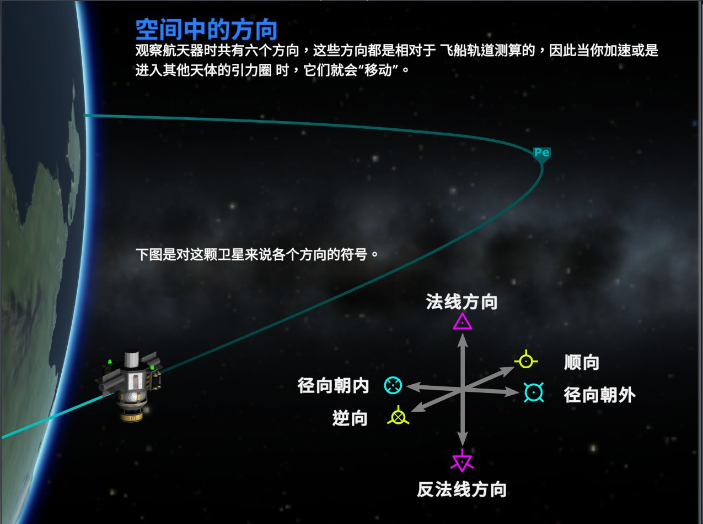
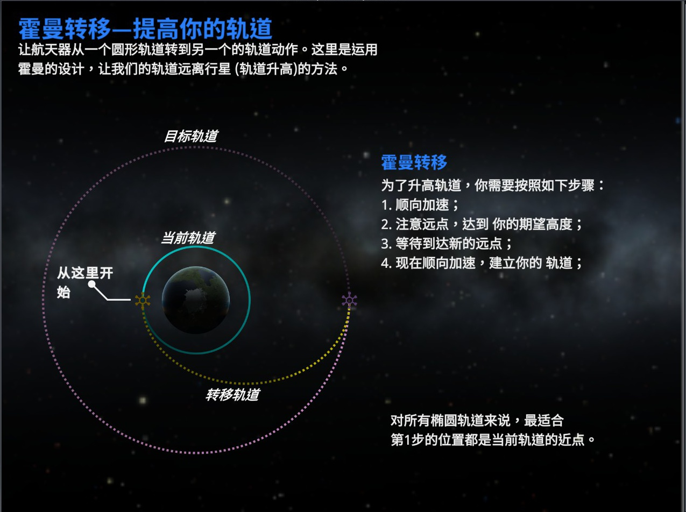
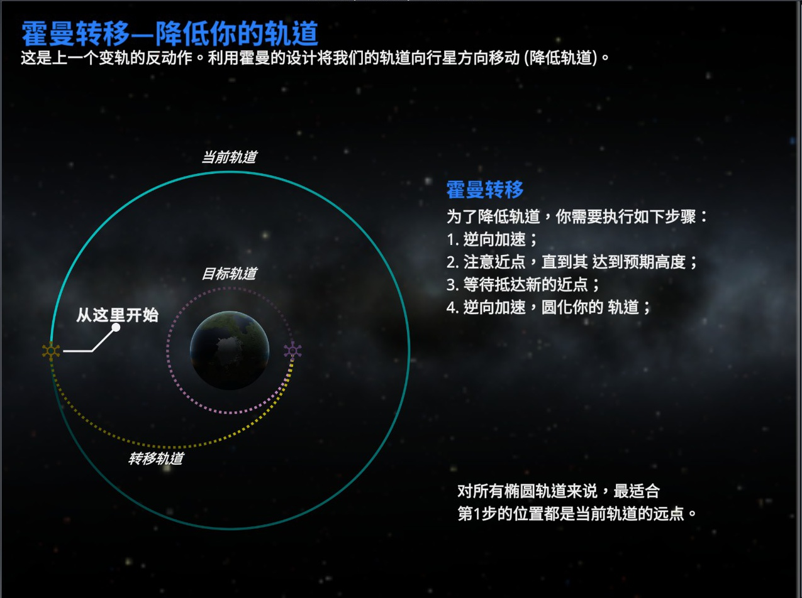
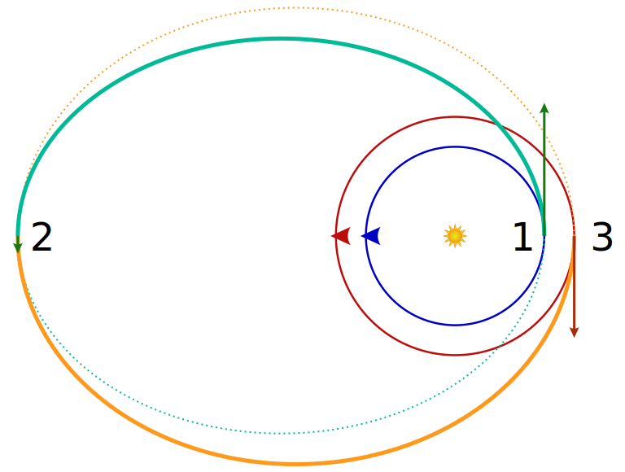

# 轨道力学

## 卫星问题

### 轨道概述

轨道方向：

- 顺行轨道：与行星自转方向同向的轨道。

- 逆行轨道：与行星自转方向相反的轨道。

{ width="100%" }
/// caption
图片来自 [KSPedia](https://ksp.huijiwiki.com/wiki/KSPedia)
///

近点和远点：

- 近点（Pe）：距离轨道环绕的物体最近的点。

- 远点（Ap）：距离轨道环绕的物体最远的点。

升空与着陆：

- 借助重力转弯，加速度不要太大，避免把燃料浪费在与大气阻力对抗。

- 达到目标高度后，顺向加速，提高速度至可以留在轨道上。

- 着陆前，逆向加速，进入大气层后，大气阻力也会使你减速。

离心率与调整离心率：

- 开普勒轨道：是天体力学描述在三维空间的椭圆、抛物线、双曲线（还有直线）轨道上运动的物体在二维轨道平面上的轨道运动。其只考虑两个点状物体之间的引力作用，而忽略与其它物体之间引力交互作用的摄动、大气拖曳、太阳辐射压、非球面的中心物体等等。

- 离心率为 $0$ 是圆，小于 $1$ 是椭圆，$1$ 是抛物线，大于 $1$ 是双曲线。

- 顺向加速能够提高离心率，逆向加速能够降低离心率。

- 离心率小于 $0$ 就会着陆，离心率大于等于 $1$ 就会脱离天体。

倾角与调整倾角：

- 轨道平面与其环绕物体的赤道面之间的角度差。

- 沿法线、逆法线方向加速，可以调整倾角。

重力弹弓效应：

- 奥伯特效应：即速度越快，速度变化量相同的变化所改变的动能越大。

- 重力助推，又称重力弹弓效应、绕行星变轨，是利用行星或其他天体的相对运动和引力改变飞行器的轨道和速度。

- 从重力助推中获得更多能量的既定方法是在近拱点（此时飞行器拥有最大速度）点燃火箭。

- 重力助推既可用于加速飞行器，也能用于降低飞行器速度。

### 卫星轨道

极轨道：

- 极轨道是地心轨道的一种，其特点是沿此轨道运行的卫星在每次环绕地球的圆周运动中都从两极上空经过。

- 这类轨道的倾角是 $90^\circ$ 或接近，极轨道卫星的缺点是不能对地球上某一点进行持续观测（这通常要靠地球静止轨道卫星来实现）。

根据轨道高度：

- 高地球轨道：周期大于一天。

- **地球同步轨道**：周期等于一天。

- 低、中地球轨道：周期小于一天，最小周期约为 $84$ 分钟。

特殊的：

- 同步卫星（又称静止卫星），为相对赤道不动的卫星。

- 其轨道高度一般在 $5.6R\approx \pu{35,786km}$，环绕速率约为 $\pu{3.1km/s}$。

    $$
    T=2\pi\sqrt{\dfrac{r^3}{MG}}
    $$

    此时带入后的 $T$ 恰好和地球自转周期相近。
    
- 同步卫星不属于地球表面，常用公式：

    $$
    v=r\omega
    $$

    $$
    a=\omega^2r
    $$

- 记为：**同步卫星看地面**（周期和线速度相同）。

### 活力公式

活力公式，又称为轨道能量守恒方程，表示二体问题中的总能量守恒，即轨道上任一点的动能与势能之和为常数。

对任意开普勒轨道，活力公式的表达式为：

$$
v^2=GM\left({\dfrac{2}{r}-\dfrac{1}{a}}\right)
$$

其中，

- $v$ 表示两天体间的相对速度。

- $r$ 表示两天体间的相对距离

- $a$ 表示半长轴。

- $G$ 表示万有引力常数。

- $M$ 表示两天体的总质量。

在忽略卫星的质量时通常很好用。

### 霍曼转移

如图：

{ width="100%" }

{ width="100%" }

- 航天器无需经过多次反复的加减速过程，仅需进行两次相同方向的推进即可升高或降低轨道。

- 霍曼转移是一些情况下消耗能量最小的转移方式，其节省了在变换方向加减速时的能量浪费。

- 在理论中，我们假设航天器的加速或减速是瞬间完成的，而在现实中不是这样。任何航天器的加速都需要时间（否则加速度 $a$ 即为无穷大），而这就导致事实上霍曼转移并非没有燃料浪费，飞船仍需消耗部分燃料来补偿加速所消耗时间带来的影响。

有 $\Delta v$ 为：

- 假设速度改变是瞬间达成，霍曼转移所需的两次 $\Delta v$ 为：

    $$
    \Delta v_1={\sqrt {\frac {\mu }{r_{1}}}}\left({\sqrt {\frac {2r_{2}}{r_{1}+r_{2}}}}-1\right)
    $$

    $$
    \Delta v_2={\sqrt {\frac {\mu }{r_{2}}}}\left(1-{\sqrt {\frac {2r_{1}}{r_{1}+r_{2}}}}\right)
    $$

- 其中 $r_1,r_2$ 分别是原本圆轨道与目标圆轨道的半径。

以提高轨道为例：

- 于 $v_1$ 点火后 $v_p$，最高轨道 $v_q$ 点火加速到 $v_2$ 圆周。

    $$
    v_q<v_2<v_1<v_p
    $$

    圆轨道使用高轨低速大周期判断速度即可。

- 根据开普勒第三定律，转移时间为椭圆轨道周期的一半：

    $$
    t_{H}=\pi{\sqrt{\frac{(r_1+r_2)^3}{8\mu}}}
    $$

- 简记为，椭圆轨道在两极，点火加速 $a$ 不变，周期看长轴（开三）。

### 双椭圆转移

双椭圆转移，是一种使航天器在高度不同的轨道间转移的方式。

双椭圆转移全过程需要三次推进，方向不同，此过程中存在明显能量损耗。

当两个圆轨道半径之比大于 $12$ 时，消耗燃料比霍曼转移更少，消耗时间更多。

{ width="70%" }
/// caption
1 加速，2 加速，3 减速
///

总转移时间是两个半椭圆轨道所需时间的总和，感兴趣的可以了解 [Spacecraft Dynamics and Control, Lecture 9: Bi-elliptics and Out-of-Plane Maneuvers](https://control.asu.edu/Classes/MAE462/462Lecture09.pdf)。

### 比值问题

假设中心天体相同。

- **已知 $r$ 之比求 $T$ 之比**

    ---

    由，

    $$
    T=2\pi\sqrt{\dfrac{r^3}{MG}}
    $$

    得，

    $$
    \dfrac{T_1}{T_2} = \sqrt{\dfrac{r_1^3}{r_2^3}}
    $$

- **已知 $r$ 之比求 $v$ 之比**

    ---

    由，

    $$
    v=\sqrt{\dfrac{GM}{r}}
    $$

    得，

    $$
    \dfrac{v_1}{v_2} = \sqrt{\dfrac{r_2}{r_1}}
    $$

- **已知 $r$ 之比求 $\omega$ 之比**

    ---

    由，

    $$
    \omega=\sqrt{\dfrac{GM}{r^3}}
    $$

    得，

    $$
    \dfrac{\omega_1}{\omega_2} = \sqrt{\dfrac{r_2^3}{r_1^3}}
    $$

- **已知 $r$ 之比求 $a$ 之比**

    ---

    由，

    $$
    a=\dfrac{GM}{r^2}
    $$

    得，

    $$
    \dfrac{a_1}{a_2}=\dfrac{r_2^2}{r_1^2}
    $$

- **特殊的**

    ---

    有反比：

    $$
    \dfrac{T_1}{T_2}\cdot\dfrac{\omega_1}{\omega_2}=1
    $$

- **朴素的**

    ---

    1. 将题目给出的物理量转化为半径之比。

    2. 根据半径之比，结合公式得出所求比。

如果中心天体（质量）不同，保留 $M$ 即可。
