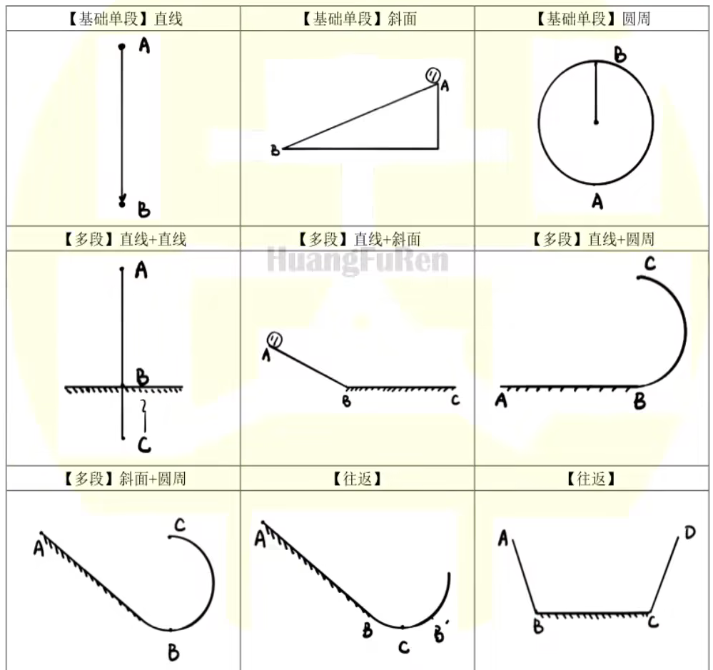

# 功能动量定律

## 守恒定律

假若孤立物理系统的某种可观测性质遵守守恒定律，则随着系统的演进，这种性质不会改变。

诺特定理表明，每一种守恒定律，必定有其伴随的物理对称性。

即不论在空间的取向为何，物理系统的物理行为一样。

### 绝对定律

绝对定律指，物理学者从未找到任何违背这些定律的证据。

- 质能守恒定律
- 动量守恒定律
- 角动量守恒定律
- 电荷守恒定律
- ……

### 近似定律

在某些特别状况，像低速、短暂时间尺寸、某种相互作用等等，以下这些定律近似于正确。

- 质量守恒定律（适用于非相对论性速度与不存在核反应的状况）
- 能量守恒定律（适用于非相对论性速度与不存在核反应的状况）
- 宇称对称性
- ……

### 机械能守恒定律

机械能守恒定律指出，任何物体系统无外力做功，系统内又只有保守力做功时，则系统的机械能（动能与势能之和）保持不变。

外力做功为零，表明没有从外界输入机械功；只有保守力做功，即只有动能和势能的转化，而无机械能转化为其他能，符合这两条件的机械能守恒对一切惯性参考系都成立。

本质：势能（$E_p$）和动能（$E_k$）的相互转化。

机械能守恒的条件：对于一个系统，如果系统内部只有保守力做功（常见的，摩擦力就不属于保守力），系统无外力做功（合外力不做功）的情况下，机械能守恒。

另一个不严谨的判断方式：判断系统内的机械能有没有转变为系统外的机械能（比如弹簧的压缩和伸长），判断系统内的动能和势能之和有没有变化（比如匀速下落的小球）。

注意：有的地方可能会写除去重力，其本质就是当我们讨论地球上的物体的时候，这个被讨论的系统其实是地球和物体，而地球和物体的相互作用重力是保守力，因此重力不算「外力」。

### 能量守恒定律

第一个形式：初能量等于末能量。

$$
E_t=E_0
$$

第二个形式：增能量等于减能量，即所有做功代数和为零。

$$
\Sigma E=0
$$

往往要配合单物体功动能定理使用。

## 功动能定理

### 定义形态

功动能定理指合力作用在物质上（合力做功）的功等于物质的动能变化量。

$$
W_{\text{合}}=\Delta E_k=\frac{1}{2}m{v_t}^2-\frac{1}{2}m{v_0}^2
$$

其中可以表示，

$$
W_{\text{合}}=F_{\text{合}}x=\Sigma W
$$

单方向上通常不存在功动能定理。

### 解题方法

对（物体），从（初位置）到（末位置），做功有（哪些力），列功动能定理：

$$
\begin{aligned}
W_{\text{合}}&=\Delta E_k\\
W_G+W_f+\dots&=\frac{1}{2}m{v_t}^2-\frac{1}{2}m{v_0}^2
\end{aligned}
$$

{ width="90%" }

1. 圆周运动上受力和速度的关系。

2. 绳杆最高点最低点的受力关系。

如何选择运动段应用功动能定理：

- 问一个点的信息：一个 $v$ 已知的点、这个点。
- 问一个段的信息：两个 $v$ 已知的点。

不需要完全是这个段的端点，也可以是包含这个部分的一个大段。

### 负正相关

带负号的叫负相关：

- 表示做功后能量减小。

    $$
    \begin{aligned}
    W_G&=-\Delta E_{pG}\\
    W_{\text{弹}}&=-\Delta E_{p\text{弹}}
    \end{aligned}
    $$

- 即，负相关，重力势能变化量是克服重力做的功，弹性势能变化量是克服弹力做的功。

- 对于重力势能，写：取（整个运动的最低点，某点水平位置）为零势能面。

不带负号的叫正相关：

- 表示做功后能量增加。

    $$
    \begin{aligned}
    W_{\text{合}}&=\Delta E_k\\
    W_{\text{除G}}&=\Delta E_{\text{机}}
    \end{aligned}
    $$

- 即，正相关，动能变化量是合外力做功，机械能变化量是除重力外做的功。

### 摩擦力做功

特点，从斜面上方静止滑下，摩擦力做功与水平距离有关，与斜面倾角无关。

$$
W=\mu mg\cos\theta\cdot x=\mu mgL
$$

在曲线运动中，找压力即可。

内能和摩擦力：

$$
Q=-(W_f+W_{f'})
$$

一个物体克服摩擦力做的功没有实际意义，因为内能需要一对摩擦力做的总功。

### 非质点问题

画出初末状态，找出变化的部分所做的功。

例如一个链条在桌角无摩擦力滑下，水平的部分滑下，找出对应重心下落高度。

### 轻杆轻绳

轻绳、轻杆（$m=0$）没有重力势能、动能。

因此其无法具有能量，总功 $W=0$，只起到传递能量的作用。

据此，我们可以整体的分析，对多个物体同时分析。

轻杆轻绳的力做功直接忽略不计，列功动能定理，列关联速度。

杆子和绳子这种同步转动的，关联速度 $v=r\omega$（同一物体 $\omega$ 相同）。

非同步转动的，分解速度到沿绳沿杆方向，根据同绳等力列式。

### 弹簧做功

常见的问题有两类：

1. 弹簧压缩拉伸，形变量不变，做功为零。

2. 弹簧产生的阻力与动力相等时，为加速度反向的点，注意不一定产生弹力即反向加速。

另外，弹性势能虽然有的时候很好用，但是不常用，通常不需要先考虑。

### 多物体动能定理

本质上，多物体动能定理和机械能守恒定律类似，写出来的式子通常是等价的。

形式上为，将多个单物体动能定理等式简单的相加：

$$
W_1+W_2+\dots=\Delta E_{k1}+\Delta E_{k2}+\dots
$$

注意：轻绳轻杆不储备能量，做的总共为零（起到传递作用）。

## 动量定理

### 定义形态

动量定理指出：物体所受合力的冲量等于物体的动量变化。

$$
\begin{aligned}
\Sigma\bm{I}&=\Delta\bm{p}\\
\bm{F}_{\text{合}}t&=m\Delta\bm{v}
\end{aligned}
$$

上述式子可以用一行，更清晰的表示：

$$
\bm{I}=\bm{F}\Delta t=m\Delta\bm{v}=\Delta\bm{p}
$$

其中 $I$ 表示物体所受冲量，$m$ 表示物体的质量，$F$ 表示物体所受的合外力（恒力），$\Delta t$ 表示力的作用时间，$\Delta v$ 表示速度的变化量，$\Delta p$ 是动量变化量。

理解方式：物体摔到地上，$m\Delta v$ 是定值，比较软的地面会产生形变，时间 $t$ 更长、合外力更小。

### 一点解释

$$
\Delta\bm{p}=\bm{I}
$$

即物体的动量变化量即为物体受到的冲量。

$$
{\Delta\bm{p}\over\Delta t}=\bm{F}
$$

即物体的动量变化率即为其受到的合外力。

另外，有牛顿第二定律的原式形式：

$$
\bm{F}={\Delta\bm{p}\over\Delta t}={m\Delta\bm{v}\over\Delta t}=m\bm{a}
$$

部分推导如下：

$$
\begin{aligned}
\bm{F}\Delta t=m\bm{a}\Delta t=m\Delta\bm{v}\\
m\Delta\bm{v}=\Delta(m\bm{v})=\Delta\bm{p}
\end{aligned}
$$

### 解题方法

对（物体），从（初位置）到（末位置），合外力（正方向－负方向），列动量定理：

比如一个重力为 $G$ 的小球落到地上，对地面的压力为 $N$，弹起用时为 $t$：

$$
(N-G)t=\Delta p=m(v_t-v_0)
$$

其中 $v_0$、$v_t$ 可以用匀变直求解，带入可解得未知量。

注意，合外力一定要用「正方向－负方向」而不是大减小，因为此处是要考虑方向的。

### 判断动量守恒

基础方法：

1. 画出系统内所有物体的受力分析；
2. 一对相互作用力抵消；
3. 判断水平方向上是否合外力分量为零；
4. 判断竖直方向上是否加速度矢量和为零。

### 基础题目

列式：

$$
\begin{aligned}
&m_1\bm{v}_1+m_2\bm{v}_2+\dots+m_n\bm{v}_n\\
=\;&m_1\bm{v}_1'+m_2\bm{v}_2'+\dots+m_n\bm{v}_n'
\end{aligned}
$$

求值，注意规定正方向。

### 流体类动量定理

判断标准：出现密度、面积等特定关键词。

关键字眼：水、空气、光子等一群运动的粒子。

解题思路：

列出动能定理，

$$
Ft=mv-mv_0
$$

发现我们不知道 $m$ 和 $t$，考虑进行处理，我们发现这里的质量只是打在接触面上的质量：

$$
m=\rho V=\rho Sh
$$

然后进行化简：

$$
F=\rho S{h\over t}(v-v_0)=\rho Sv(v-v_0)
$$

其中，$v$ 是打在墙面上时的流体速度，$v_0$ 为流体的初速度。

代数，$\rho$ 为流体密度，$S$ 为打在墙面上的接触面积，$F$ 为墙面受到的平均压力。

其中，后半边式子成立的前提是粒子均匀密布在接触面上，如风和水管。

对于下雨一类的，需要带前半边的式子，用 $h$ 表示 $t$ 时间内的余量（积水高度）。

## 动量守恒定律

### 定义形态

如果物体受到的合外力为零，则系统内各物体动量之和保持不变。

其推论为：没有外力干预，任何系统的质心都将保持匀速直线运动或静止状态不变。

数学表示：

$$
\sum_{i=1}^n\bm{p}_i=\mathit{const}
$$

一般更常用以以下形式表示：

$$
\sum_{i=1}^nm_i\bm{v}_i=\mathit{const}
$$

即：

$$
\begin{aligned}
&m_1\bm{v}_1+m_2\bm{v}_2+\dots+m_n\bm{v}_n\\
=\;&m_1\bm{v}_1'+m_2\bm{v}_2'+\dots+m_n\bm{v}_n'
\end{aligned}
$$

### 应用条件

动量守恒定律严格成立的条件是物理系统受到的合外力为零。而若在某一个方向上合外力的分量为零，则该方向的动量守恒，即动量在该方向的分量守恒（根据运动的分解与合成和力的独立作用原理可推知）。

求近似值：若系统内部的物体之间相互作用的内力远远大于外力。相对于内力，可以忽略外力，此时动量守恒定律近似成立。例如碰撞、爆炸、反冲，可认为在此过程中，该物体系统（由各个小物体组成）动量守恒。

根本原因：系统间内力等大、反向，相互抵消，这表现了空间平移不变性的特性。

### 弹性模型——类弹性碰撞

除动能外，无任何能量生成或损失。

1. 初动能＝末动能

2. 动量守恒

    $$
    m_1\bm{v}_1+m_2\bm{v}_2=m_1\bm{v}_1'+m_2\bm{v}_2'
    $$

3. 动能守恒

    $$
    \frac{1}{2}m_1v_1^2+\frac{1}{2}m_2v_2^2=\frac{1}{2}m_1v_1'^2+\frac{1}{2}m_2v_2'^2
    $$

4. 结论，$v_f$ 表示质心速度

    $$
    \left\{\begin{aligned}
    v_1'&=2v_f-v_1\\
    v_2'&=2v_f-v_2\\
    v_f&=\frac{m_1v_1+m_2v_2}{m_1+m_2}
    \end{aligned}\right.
    $$

### 共速模型——完全非弹性碰撞

两物体变成相对静止或某方向相对静止。

1. 动量守恒

    $$
    m_1\bm{v}_1+m_2\bm{v}_2=m_1\bm{v}_1'+m_2\bm{v}_2'
    $$

2. 能量损失

    $$
    E_{\text{损}}=\left(\frac{1}{2}m_1v_1^2+\frac{1}{2}m_2v_2^2\right)-\frac{1}{2}(m_1+m_2)v_f^2
    $$

3. 损失去向

    发热量、重力势能、弹性势能。

### 人船模型——初动量为零

1. 动量守恒

    注意这里的加号是矢量相加：

    $$
    0=m_1\bm{v}_1+m_2\bm{v}_2
    $$

2. 位移关系

    可以用平均动量乘时间推出来（其中 $x$ 为某一方向上的位移）：

    $$
    \begin{aligned}
    m_1x_1&=m_2x_2\\
    x_1+x_2&=x
    \end{aligned}
    $$

3. 现象：人动船动，人停船停。

4. 推论

    $$
    \begin{aligned}
    x_1&=\frac{m_2x}{m_1+m_2}\\
    x_2&=\frac{m_1x}{m_1+m_2}
    \end{aligned}
    $$

### 爆炸模型——能量增多

人船模型的一种，但是人船模型一般问位移，爆炸模型一般问速度。

动量守恒，能量（动能）增加；能量来源：重力势能、弹性势能、化学能（爆炸）。

常配合功动能定理列方程解动能增加量。

### 凹槽模型——综合起来

质量为 $m=2\mathrm{kg}$ 的小球，从 $A$ 点以初速度 $v_0=6\mathrm{m/s}$ 向右运动，小车质量 $M=4\mathrm{kg}$：

问：小球运动到点 $B$ 后，能达到的最大高度是多少（水平共速模型）。

小球相对小车向上运动，水平方向上没有相对运动，即水平共速，小球做斜抛运动。

$$
mv_0=(m+M)v_f
$$

即质心速度，

$$
v_f=v_0\cdot\frac{m}{m+M}=2\mathrm{m/s}
$$

损失的动能：

$$
E_{\text{损}}=\frac{1}{2}mv_0^2-\frac{1}{2}(m+M)v_f^2=24(\mathrm{J})
$$

损失的动能全部转化为重力势能：

$$
E_{\text{损}}=E_p=mgh=20h
$$

解得 $h=1.2\mathrm{m}$。

问：当小球返回 $A$ 时，小球和小车的速度分别是多少（弹性模型）。

根据质心速度结论：

$$
\left\{\begin{aligned}
v_1&=2v_f-v_0=-2(\mathrm{m/s})\\
v_2&=2v_f=4(\mathrm{m/s})
\end{aligned}\right.
$$

问：若水平轨道粗糙且长度为 $2\mathrm m$，小球回到远处后自由落体，问水平轨道的摩擦因数。

根据动量守恒定律：

$$
mv_0=Mv_1
$$

解得 $v_1=3\mathrm{m/s}$。

求出动能：

$$
\begin{aligned}
E_0&=\frac{1}{2}mv_0^2=36(\mathrm{J})\\
E_t&=\frac{1}{2}Mv_1^2=18(\mathrm{J})
\end{aligned}
$$

根据发热公式：

$$
\begin{aligned}
Q&=E_0-E_t=18(\mathrm{J})\\
Q&=f\Delta s=\mu mg(L+R)
\end{aligned}
$$

解得 $\mu=0.225$。
