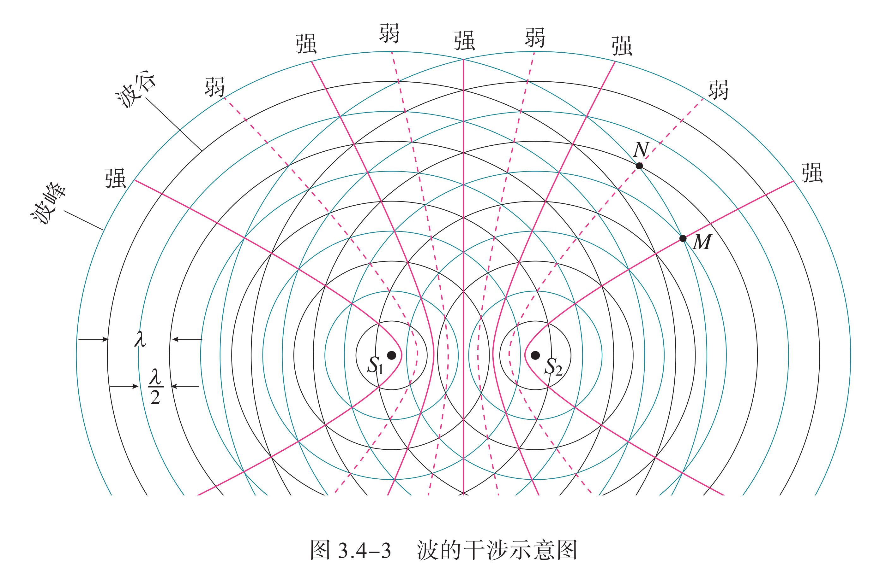

# 热学与热力学

## 热力学基础

热力学是研究**热现象**中物态转变和能量转换规律的学科，它着重研究物质的平衡状态以及与准平衡态的物理、化学过程。热力学定义了许多宏观物理量，描述各物理量之间的关系：

- 研究对象：包含大量（无限多）微观粒子的宏观物体的性质。

- 研究内容：热运动的规律，与热运动有关的物性和宏观物质系统的演化。

- 热运动：组成宏观物体的大量微观粒子的无规则运动的规律。

研究某一容器中气体的热学性质，其研究对象是容器中的大量分子组成的系统，这在热学中叫作一个热力学系统，简称系统。系统之外与系统发生相互作用的其他物体统称外界。例如，用酒精灯加热容器中的气体，把气体作为研究对象，它就是一个热力学系统，而容器和酒精灯就是外界。

- 孤立系统：不能交换热量，不能交换机械功，不能交换物质。
- 绝热系统：不能交换热量，可以交换机械功，不能交换物质。
- 封闭系统：可以交换热量，可以交换机械功，不能交换物质。
- 开放系统：可以交换热量，可以交换机械功，可以交换物质。

热运动影响着物质的各种宏观性质。

### 分子的能量

分子动能：人们利用分子动理论通过对大量分子求统计平均，建立了宏观量与相应的微观量统计平均值的关系。分子不停地做无规则运动，那么，像一切运动着的物体一样，做热运动的分子也具有动能，这就是分子动能。物体中分子热运动的速率大小不一，所以各个分子的动能也有大有小，而且在不断改变。在热现象的研究中，我们关心的是组成系统的大量分子整体表现出来的热学性质，因而，这里重要的不是系统中某个分子的动能大小，而是所有分子的动能的平均值。这个平均值叫作分子热运动的平均动能。

温度升高时，分子的热运动加剧，温度越高，分子热运动的平均动能越大。温度越低，分子热运动的平均动能越小。因此，可以得出结论：物体温度升高时，分子热运动的平均动能增加。这样，分子动理论使我们懂得了温度的微观含义。过去我们说，“温度是分子热运动剧烈程度的标志”，现在就能进一步说，“物体的温度是它的分子热运动的平均动能的标志”。

分子势能：分子间存在着相互作用力，可以证明分子间的作用力所做的功与路径无关，分子组成的系统具有分子势能。分子势能的大小由分子间的相对位置决定，这说明分子势能 $E_p$ 与分子间距离 $r$ 是有关系的。设两个分子相距无穷远，我们可以规定它们的分子势能为 $0$。让一个分子 A 不动，另一个分子 B 从无穷远处逐渐靠近 A。在这个过程中，分子间的作用力做功，分子势能的大小发生改变。

当分子 B 向分子 A 靠近，分子间距离 $r$ 大于 $r_0$ 时，分子间的作用力表现为引力，力的方向与分子的位移方向相同，分子间的作用力做正功，分子势能减小。当分子间距离 $r$ 减小到 $r_0$ 时，分子间的作用力为 $0$，分子势能减到最小。越过平衡位置 $r_0$ 后，分子 B 继续向分子 A 靠近，分子间的作用力表现为斥力，力的方向与分子的位移方向相反，分子间的作用力做负功，分子势能增大。

可见，分子势能的大小是由分子间的相对位置决定的。由以上分析可知，如果选定分子间距离 $r$ 为无穷远时的分子势能 $E_p$ 为 $0$，分子势能 $E_p$ 随分子间距离 $r$ 的变化有最小值，即当 $r = r_0$ 时，分子势能最小。物体的体积变化时，分子间距离将发生变化，因而分子势能随之改变。可见，分子势能与物体的体积有关。

物体的内能：物体中所有分子的热运动动能与分子势能的总和，叫作物体的内能。任何物体都具有内能。分子热运动的平均动能与温度有关，分子势能与物体的体积有关。一般说来，物体的温度和体积变化时它的内能都会随之改变。应当指出，组成物体的分子在做无规则的热运动，具有热运动的动能，它是内能的一部分；同时物体还可能做整体的运动，因此，还会具有动能，这是机械能的一部分。后者是由物体的机械运动决定的，它对物体的内能没有贡献。

- 热量：热量不是传递着的热质，而是传递着的能量。

    传热是基于各部分温度的不一致而发生的能量的传递，有，

    $$
    \Delta Q=mc\Delta T
    $$

    其中 $c$ 表示材料的比热容，单位为 $\pu{[J/(kg*^oC)]}$。

    做功与传热是使系统能量发生变化的两种方式。

- 比热：对于质量为 $m$ 的物体或体系，其比热，

    $$
    C=mc
    $$

    即，热容为 $C$ 的物体或体系，温度改变 $\Delta T$ ，吸放热，

    $$
    \Delta Q=C\Delta T
    $$

    物体的热容不仅与物体的性质、质量有关，一般还与温度有关。

内能是物体所有分子的热运动动能和分子势能的总和，内能的决定因素有：

- 微观：分子个数、分子势能、分子动能。

- 宏观：物质的量、体积、温度。一般也说质量和物态。

- 分子势能：由分子的位置相关，微观上与分子间距相关，宏观上与体积相关。

- 分子平均动能：只与温度有关（但是不能说内能由温度决定）。

### 热力学温标

在力学中，为描述物体（质点）的运动状态，我们使用了物体的位置和速度这两个物理量。在热学中，为确定系统的状态，也需要用到一些物理量，这些物理量叫作系统的状态参量。例如，为了确定系统的空间范围，要用到体积，这是一个几何参量；为了确定外界与系统之间或系统内部各部分之间力的作用，要用到压强，这是一个力学参量；而要确定系统的冷热程度，就要用到一个热学参量——温度。

状态参量：

- 是指在动态系统中，可以描述系统数学状态的一组变量。

- 可以通过状态参量，在系统未受到外界干扰的情形下，预测系统未来的特性。

- 对不同的假想体系具体考虑某一方面的性质，形成了物理学的不同分支。

- 它们是对实际的宏观系统进行不同的抽象，引进不同的状态参量来描述。

状态函数：

- 由一系列表征体系性质的物理量所确定下来的体系的存在形式称作体系的状态，借以确定体系状态的物理量称作体系的状态函数。

- 如研究某理想气体，其物质的量 $n = \pu{1mol}$，压强 $p = \pu{1.01E5 Pa}$，体积 $V = \pu{22.4 dm3}$，温度 $\pu{0 ^\circ C}$，则认为它处于**标准状况**，这里 $n$，$p$，$V$，$T$ 就是体系的状态函数。

- 体系的状态和状态函数互相确定：体系的多个状态函数确定了，状态也就确定了；状态确定了，多个状态函数也就确定了。这里状态函数中的“函数”，指的就是它们是体系状态上的函数，比如 $p(\text{标准状况}) = \pu{1.01E5 Pa}$。

状态函数的性质：

- 有些状态函数，如 $V$ 和 $n$ 等所表示的性质具有加和性，如一个体系的 $V$ 等于体系各部分的 $V$ 之和、体系的这类具有加和性的性质，称作体系的**广度性质**，这类状态函数称作**广度量**。

- 还有些状态函数，如 $p$ 和 $T$ 等所表示的性质无加和性，称作体系的**强度性质**，这类状态函数称作**强度量**。大部分这类状态函数满足体系的该状态函数等于体系各部分的状态函数。

如果要定量地描述温度，就必须有一套方法，这套方法就是温标。确定一个温标时首先要选择一种测温物质，根据这种物质的某个特性来制造温度计。例如，可以根据水银的热膨胀来制造水银温度计，这时我们规定细管中水银柱的高度与温度的关系是线性关系。还可以根据气体压强随温度的变化来制造气体温度计，等等。确定了测温物质和它用以测温的某种性质之后， 还要确定温度的零点和分度的方法。例如，摄氏温标曾经规定，标准大气压下冰的熔点为 0 ℃，水的沸点为 100 ℃ ；并据此把玻璃管上 0 ℃ 刻度与 100 ℃ 刻度之间均匀分成 100 等份，每份算作 1 ℃。

现代科学中用得更多的是热力学温标。热力学温标表示的温度叫作热力学温度，它是国际单位制中七个基本物理量之一，用符号 $T$ 表示，单位是开尔文，简称开，符号为 $K$。热力学温标对应的物理量是热力学温度，或称开氏度，符号为 $\pu{K}$。

- 自 2019 年 5 月 20 日起，$\pu{1K}$ 被严格定义，也就是说 $\pu{0K = -273.15^oC}$ 是人为定义的。

- 绝对零度是低温的极限，只可接近、不可达到。因此热力学温度没有负数。

- 温度变化 $1$ 摄氏度，相当于变化 $1$ 开尔文（每变化 $\pu{1K}$ 相当于变化 $\pu{1^oC}$）。

摄氏温标和热力学温标（开尔文, K）两种温标的转换公式为：

$$
[\pu{^oC}] = [\pu{k}] - 273.15
$$

$$
[\pu{k}] = [\pu{^oC}] + 273.15
$$

一般只取 $273$ 舍掉小数部分，因此 $\pu{27^oC = 300K}$。

探索热的本质：对于“热是什么”，历史上有两种不同的观点。一种是热的物质说（热质说），另一种是热的运动说（热动说）。

热质说和热动说：培根、玻意耳、笛卡儿、胡克、牛顿、伯努利、罗蒙诺索夫等人根据摩擦生热等现象，认为热是粒子运动的表现，物体由于粒子的剧烈运动而发热。但在他们的时代，这种观点缺乏足够的实验证据。与此对立的另一种看法是热质说。热质说认为，热是一种流质，名为热质，可以渗入一切物体，不生不灭，没有质量。一个物体是冷还是热，取决于其中所含热质的多少。热质说可以解释当时观察到的大部分热学现象：物体温度的变化是因为吸收、放出了热质，传热是热质的流动与传播，热膨胀是由于热质粒子之间的排斥，等等。

但是，热质说无法解释伦福德的炮筒镗孔实验。英国科学家本杰明·汤普森（又名伦福德）在德国慕尼黑的兵工厂为炮筒镗孔时，发现钻头与钢铁的摩擦能产生大量的热。按照热质说，钻头越锋利，铁屑切得越小，它们能保存住的热质就越少，释放的热质就越多，用来冷却的水沸腾得也就越快。然而，伦福德注意到，在钻头已经变钝时照旧要产生大量的热。不但如此，他发现在钻孔加工中热量似乎是取之不尽的。

伦福德进行了反复的观察和实验，终于在 1798 年公布了他的研究成果。他明确指出：在这些实验中被激发出来的热，除了把它看作“运动”之外，似乎很难看作其他任何东西。然而，事情并不简单。伦福德的实验无法进行定量测量，因此他的实验的说服力大打折扣。到了 19 世纪 40 年代，英国物理学家焦耳以定量的实验为热动说的胜利画上了句号。与伦福德同时代的英国化学家戴维，也通过实验否定了热质说。

### 热力学定律

#### 热力学第零定律

若两个热力学系统均与第三个系统处于热平衡状态，此两个系统也必互相处于热平衡，这就是**热力学第零定律**（Zeroth Law of Thermodynamics），也称为热平衡定律。这一规律看似平淡，实则是整个热力学体系的基础。

- **核心价值**：它认可了“温度”作为状态参量的存在。如果没有第零定律，我们就无法定义一个统一的温度标尺。

- **平衡态的定义**：是指一个处在没有外界影响的热力学系统，经过一段时间后，将达到一个确定的状态，而不再有任何宏观变化。

- **动力学视角的补充**：在不受外界影响的条件下，系统宏观性质不随时间变化的状态称为平衡态。例如，一根两端分别接触 $0 \pu{^\circ C}$ 和 $100 \pu{^\circ C}$ 水的金属棒，其内部温度分布最终会稳定（稳态），但它**不处于**平衡态，因为它持续与外界发生能量交换。

#### 热力学第一定律

热力学第一定律本质上是**能量守恒定律**在热力学系统中的体现。19 世纪中叶，焦耳通过一系列著名的实验（如叶片搅拌水、电流产热等）证明了功与热的等使性。

- **内能（$U$）**：系统内部所有微观粒子热运动动能与势能的总和。它是一个状态函数，只由状态决定，与过程无关。

- **功（$W$）**：外界对系统所做的机械量贡献。在准静态过程中，体积功为 $W = - \int p \mathrm{d}V$。

- **热量（$Q$）**：因温度差而引起的能量转移。

**数学表达式**：

$$
\Delta U = Q + W
$$

对于该公式，我们需要严格遵守符号规定以应对“应试”中的陷阱：

- **$Q > 0$**：系统吸热；**$Q < 0$**：系统放热。
- **$W > 0$**：外界对系统做功（体积压缩）；**$W < 0$**：系统对外界做功（体积膨胀）。
- **第一类永动机**：指不需要任何动力或燃料，却能不断对外做功的机器。热力学第一定律宣告了其不可实现性，因为能量不能凭空产生。

#### 热力学第二定律

能量守恒定律（第一定律）规定了能量在转化中的数量关系，但它并没有限制过程的方向。**热力学第二定律**揭示了宏观自然过程的不可逆性。

- **克劳修斯表述**：热量不能自发地从低温物体传到高温物体（热传导的不可逆性）。注意“自发”二字，电冰箱可以制冷，但那是消耗了外界电功的结果。

- **开尔文表述**：不可能从单一热库吸收热量，使之完全变成功，而不产生其他影响。这直接宣告了“第二类永动机”的破产。

**热机效率（Thermal Efficiency）**：

对于任何热机，从高温热库吸收热量 $Q_1$，对外做功 $W$，向低温热库排出热量 $Q_2$，其效率 $\eta$ 定义为：

$$
\eta = \frac{W}{Q_1} = \frac{Q_1 - Q_2}{Q_1} = 1 - \frac{Q_2}{Q_1}
$$

**卡诺循环（Carnot Cycle）**：

法国工程师卡诺提出了一种理想的热机循环，由两个等温过程和两个绝热过程组成。其效率取决于两个热库的温度：

$$
\eta_{\text{max}} = 1 - \frac{T_{\text{L}}}{T_{\text{H}}}
$$

这是热机效率的理论极限。它告诉我们，要提高发动机效率，要么提高燃烧温度（提高 $T_{\text{H}}$），要么优化散热（降低 $T_{\text{L}}$）。

#### 熵与熵增加原理

“热力学第二定律”可以被更深层地定义为**熵增加原理**。

- **熵（Entropy）**：由克劳修斯引入，用来量度系统的无序程度。微观上，波尔兹曼给出了著名的关系式：

    $$
    S = k \ln \Omega
    $$

    其中 $\Omega$ 为系统的微观状态数。

- **熵增原理**：在一个孤立系统中，自发过程总是朝着熵增加的方向进行。从有序到无序，是宇宙的大趋势所趋。

- **科普视角——时间之矢**：在物理定律底层，大多是对称的（时间倒流也成立），但热力学第二定律打破了这种对称。它赋予了时间明确的方向：宇宙的未来一定是熵更高的。

#### 热力学第三定律

随着温度降低，分子的热运动减弱。

- **表述一**：绝对零度（$\pu{0 K}$）是无法通过有限个步骤达到的极限。
- **表述二**：随着温度趋于 $\pu{0 K}$，纯物质完美晶体的熵趋于零。

这解释了为什么我们可以无限接近 $\pu{-273.15 ^\circ C}$，却永远无法跨过那最后的一步。

#### 能量守恒的宏观演化

人类对能量的认识并不是一蹴而就的。从迈尔（Mayer）观察人血颜色的差异，到焦耳（Joule）执着二十年的定量实验，再到亥姆霍兹（Helmholtz）将其上升为普遍定律，这是一场跨越生物、化学、物理的伟大综合。

- **能量耗散**：虽然总能量守恒，但能量的“品质”在不断下降。机械能可以 $100\%$ 转化为内能，但内能无法全额转回机械能。那些流散到环境中的废热，虽然能量还在，却再也无法驱动大机器工作了。这正是我们要节约能源的原因——我们节约的不是能量的数量，而是能量的“低熵”品质。

### 热力学过程

状态的变化：要定量地描述系统的状态往往很难，因为有时系统的参量会随时间变化。然而在没有外界影响的情况下，只要经过足够长的时间，系统内各部分的状态参量就能够达到稳定状态。这种状态叫作平衡态，否则就是非平衡态。当系统处于平衡态时，系统所有状态参量都不随时间变化，我们就能比较准确地描述系统的状态。在中学阶段，我们主要处理平衡态的问题。

理想气体状态方程是理想气体处在**平衡态**时，描述气体状态参量的所满足的方程式。平衡态是指一个处在没有外界影响的热力学系统，经过一段时间后，将达到一个确定的状态，而不再有任何宏观变化。即，在不受外界影响的条件下，系统**宏观性质**不随时间变化的状态称为平衡态。

上面所说的平衡态，指的是一个系统的状态参量不再改变。下面我们要研究一个系统与另一个系统相互作用的问题。如果两个系统相互接触而传热，这两个系统的状态参量将会互相影响而分别改变。经过一段时间， 各自的状态参量就不再变化了，这说明两个系统达到了平衡。这种平衡叫作热平衡。实验表明，如果两个系统分别与第三个系统达到热平衡，那么这两个系统彼此之间也必定处于热平衡，这个结论称为热平衡定律。热平衡定律表明，当两个系统 A、B 处于热平衡时，它们必定具有某个共同的热学性质，我们就把表征这一“共同的热学性质”的物理量叫作温度。换句话说，温度是决定一个系统与另一个系统是否达到热平衡的物理量，它的特点就是“达到热平衡的系统具有相同的温度”。

例如：有一根金属棒，一端与冰水混合物（$\pu{0 ^\circ C}$）接触，另一端与开水接触（$\pu{100 ^\circ C}$），经一定时间后，金属棒内的温度分布将不随时间变化，但它并不处在平衡态，因为此棒不断从高温处吸热，在低温处放热，即持续受到外界影响。

体系的一个状态函数或者几个状态函数发生了改变时，体系的状态发生变化，称体系经历了一个热力学过程，简称过程。体系发生变化前的状态称作始态，变化后的状态称作终态。体系变化的始态和终态一旦确定，各状态函数的改变量也随之确定。状态函数的改变量用 $\Delta$ 表示，如始态温度 $T_1$，终态温度 $T_2$，我们有状态函数改变量 $\Delta T = T_2 - T_1$。有一些过程具有值得研究的特殊性，如：

- 恒温条件：体系始态和终态的温度相等，且等于环境的温度。满足该条件的过程称作恒温过程。

- 恒压条件：体系始态和终态的压强相等，且等于环境的压强。满足该条件的过程称作恒压过程。

- 恒容条件：体系始态和终态的体积相等。满足该条件的过程称作恒容过程。

上面三个条件不互斥，可共存，如存在既满足恒温条件又满足恒压条件的过程——恒温恒压过程。同种过程可以采取多种不同的具体方式实现，每种具体方式称作一种途径。

比如某理想气体从始态 $p = \pu{1E5 Pa}$，$V = \pu{2dm3}$ 经一恒温过程变为终态 $p = \pu{2e5 Pa}$，$V = \pu{1dm3}$。该过程存在无数种途径，其中两种如下：先恒温膨胀为 $p = \pu{0.5E5 Pa}$，$V = \pu{4dm3}$，再恒温压缩为终态 $p = \pu{2e5 Pa}$，$V = \pu{1dm3}$。先恒温压缩为 $p = \pu{2E5 Pa}$，$V = \pu{1dm3}$，再恒温压缩为终态 $p = \pu{2e5 Pa}$，$V = \pu{1dm3}$。

但当过程确定了，无论途径如何，每个状态函数的改变量都是相同的。也即，状态函数的改变量与途径无关。过程的关键是始态和终态，途径则注重具体实施方式。

#### P-V 图与功

在热力学中，我们经常使用压强-体积（P-V）图来直观地表示气体状态的变化过程。P-V 图的横轴表示体积 $V$，纵轴表示压强 $p$。气体从一个状态变化到另一个状态，在 P-V 图上表现为一条曲线或直线。

{ width="60%" }
*P-V 图示例：气体从状态 A 变化到状态 B*

**功的计算**：
在 P-V 图上，气体对外做功或外界对气体做功，可以通过曲线下的面积来表示。
根据热力学第一定律中功的定义 $W = - \int p \mathrm{d}V$：

- **气体膨胀（$V$ 增大）**：系统对外做功，$\mathrm{d}V > 0$，因此 $W < 0$。在 P-V 图上，过程曲线下的面积为正，但功的符号为负。
- **气体压缩（$V$ 减小）**：外界对系统做功，$\mathrm{d}V < 0$，因此 $W > 0$。在 P-V 图上，过程曲线下的面积为负，但功的符号为正。

**不同过程中的功**：

- **等压过程**：压强 $p$ 恒定。功 $W = -p \Delta V$。在 P-V 图上为水平线，功是矩形面积。
- **等容过程**：体积 $V$ 恒定。$\Delta V = 0$，因此 $W = 0$。在 P-V 图上为竖直线，曲线下面积为零。
- **等温过程**：温度 $T$ 恒定。对于理想气体，$pV = nRT = \text{const.}$。功 $W = -nRT \ln(V_2/V_1)$。在 P-V 图上为双曲线。
- **绝热过程**：没有热量交换。$p V^\gamma = \text{const.}$。功的计算较为复杂，但同样是曲线下的面积。

通过 P-V 图，我们可以直观地比较不同路径下系统做功的多少，这对于理解热力学过程的路径依赖性非常重要。

### 热机与循环

$17 \sim 18$ 世纪，许多人致力于制造一种机器，它不需要任何动力或燃料，却能不断地对外做功，史称“第一类永动机”。
任何动力机械的作用都是把其他形式的能转化为机械能。内燃机把燃料的化学能转化为燃气的内能然后再转化为机械能，电动机把电能转化为机械能……如果没有燃料、电流或其他动力的输入，能量从哪里来呢！永动机的思想违背了能量守恒定律，所以是不可能制成的。

自然界的一切变化，人类社会的所有活动，都伴随着能量的转移和转化，能量是一切物质运动的源泉，是一切生命活动的基础。能量在数量上虽然守恒，但其转移和转化却具有方向性。各种各样的活动中，机械能、电能、光能、声能、化学能、核能、生物能……最终都转化成内能，流散到周围的环境中。每天我们使用的能源最后都转化成了内能，能源消耗使得周围环境升温。根据热力学第二定律，分散在环境中的内能不管数量多么巨大，它也只不过能使地球、大气稍稍变暖一点，却再也不能自动聚集起来驱动机器做功了。

这样的转化过程叫作“能量耗散”。周围环境中的内能很难再利用，而机械能、光能、化学能、电能相对于周围环境中的内能来说，可利用的品质要高。所谓能源，其实是指具有高品质的容易利用的储能物质，例如石油、天然气、煤等。能源的使用过程中虽然能的总量保持守恒，但能量的品质下降了。虽然能量总量不会减少，但能源会逐步减少，因此能源是有限的资源。

## 理想气体定律

### 理想气体概念

理想气体为假想的气体，其假设：

- 有质量：显然。
- 无体积：意味着可以无限压缩。
- 分子间无作用力：无势能、只有动能。

真实气体在低压高温的状态，气体分子间作用力小，性质接近理想气体。

- 理想气体的内能是分子动能之和。
- 理想气体适用理想气体状态方程。
- 理想气体绝不液化或固化。
- 最接近理想气体的气体为**氦气**。

**热容与内能的深化**：

对于理想气体，其内能 $U$ 仅是温度 $T$ 的函数。为了定量描述温度变化与吸热的关系，我们引入**摩尔热容**（Molar Heat Capacity）：

- **等容摩尔热容（$C_{V,m}$）**：在体积不变的过程中，$\pu{1 mol}$ 物质温度升高 $\pu{1 K}$ 所吸收的热量。对于单原子理想气体，$C_{V,m} = \frac{3}{2}R$。
- **等压摩尔热容（$C_{p,m}$）**：在压力不变的过程中，$\pu{1 mol}$ 物质温度升高 $\pu{1 K}$ 所吸收的热量。

**迈耶公式（Mayer's Relation）**：

对于理想气体，两者满足：

$$
C_{p,m} - C_{V,m} = R
$$

这意味着在等压过程中，系统吸收的热量不仅用于增加内能（温度升高），还用于克服大气压力做功（体积膨胀）。

**绝热过程（Adiabatic Process）**：

当系统与外界没有热量交换（$Q = 0$）时，气体的压强与体积满足：

$$
p V^\gamma = \text{const.}
$$

其中 $\gamma = C_p / C_{V}$ 称为**绝热指数**。这一公式解释了为什么喷漆罐在使用时会变冷，以及柴油机通过快速压缩空气来点火的原理。

理想气体为假想的气体，其假设：

- 气体分子本身不占有体积；
- 气体分子持续以直线运动，并且与容器器壁间发生弹性碰撞，因而对器壁施加压强；
- 气体分子间无作用力，亦即不吸引也不排斥；
- 气体分子的平均能量与开尔文温度成正比。

或者用百度百科上的，从微观上看：

- 理想气体的分子有质量，无体积，是质点；
- 每个分子在气体中的运动是独立的，与其他分子无相互作用，碰到容器器壁之前作匀速直线运动；
- 理想气体分子只与器壁发生碰撞，碰撞过程中气体分子在单位时间里施加于器壁单位面积冲量的统计平均值，宏观上表现为气体的压强。

自此开始，我们讨论的气体通常必然是理想气体，而理想气体作为经典的讨论对象，其一些基本的一般性质已经在前面提到过，下面的讲解重点将会放在应试和题型上，因此我们讨论的速度也会较快。

### 气体体积分数

在恒压容器中定义体积分数是很自然的，考虑到气体分子的**扩散性**：

- **在恒容容器中（比如一个 $\pu{10L}$ 的钢瓶）：** 无论里面有多少种气体（比如氧气和氮气），氧气会充满这 $\pu{10L}$，氮气也会充满这 $\pu{10L}$。
- **物理真相：** 既然所有气体都充满了整个容器，它们的实际体积都是容器的体积（$\pu{10L}$）。
- **“矛盾”点：** 如果你也占 $\pu{10L}$，我也占 $\pu{10L}$，那说“氧气的体积分数是 $20\%$（即 $\pu{2L}$）”是什么意思？难道氧气只缩在角落里吗？当然不是。

这就是你觉得不严谨的原因：**在恒容条件下，气体并没有在空间上被分割开。**虽然气体充满了整个容器，但在热力学和化学计算中，我们定义了一个概念叫**“分体积”（Partial Volume）**。

**体积分数的定义（阿马加定律）：**某组分气体的体积分数，是指**在与混合气体相同的温度和总压强下**，该组分气体**单独**存在时所占有的体积。

想象一个思想实验：

1. **现状：** 一个 $\pu{10L}$ 的钢瓶里装着混合气体（高压），总压强是 $P$，温度是 $T$。
2. **提取：** 我们把其中的氧气分子全部挑出来，放到另一个能伸缩的针筒里。
3. **条件：** 保持温度 $T$ 不变，压缩针筒直到氧气的压强也达到 $P$。
4. **结果：** 此时针筒里的体积，就是氧气的“分体积”。

如果算出来是 $\pu{2L}，我们就说氧气的体积分数是 $20\%$。所以，**在恒容容器中说体积分数，其实是在描述一个“假设状态”（Hypothetical State）**，而不是描述气体当前在容器里的空间分布。

**核心桥梁是理想气体状态方程**。为什么大家依然喜欢用“体积分数”这个词？因为对于**理想气体**，它有一个完美的数学等价关系：

$$
PV = nRT
$$

- **体积分数** $\varphi = V_i / V_{total}$
- **摩尔分数** $x = n_i / n_{total}$
- **压强分数**（即分压比总压） $P_i / P_{total}$

对于理想气体，这三者是完全相等的：

体积分数 $\equiv$ 摩尔分数 $\equiv$ 压强分数

**结论：**在恒容容器中，当你看到“体积分数是 $20\%$”时，**请直接在脑海里把它翻译成“摩尔分数是 $20\%$”或者“分子数量占 $20\%$”。**

科学家和工程师之所以混用，是因为“体积分数”在工业和工程上（比如配气）很直观，而在数学处理上，它和摩尔分数是一回事。

### 速率分布规律

在一定条件下，若某事件必然出现，这个事件叫作必然事件；若某事件不可能出现，这个事件叫作不可能事件。若在一定条件下某事件可能出现，也可能不出现，这个事件叫作随机事件。大量随机事件的整体往往会表现出一定的规律性，这种规律就叫作统计规律。

气体分子运动的特点热现象与大量分子热运动的统计规律有关。要研究气体的热现象，就要了解气体分子运动的特点。我们可以认为，液体的分子是一个挨着一个地排列的。液体变为气体后，体积要增大上千倍，可见，气体分子间距离大约是分子直径的 $10$ 倍。分子的大小相对分子间的空隙来说很小，所以，可以把气体分子视为质点。由于气体分子间距离比较大，分子间的作用力很弱，通常认为，气体分子除了相互碰撞或者跟器壁碰撞外，不受力而做匀速直线运动，气体充满它能达到的整个空间。

{ width="80%" }

分子运动速率分布图像尽管分子做无规则运动，速率有大有小，但大量分子的速率却按一定的规律分布。下表是氧气分子在 0 ℃ 和 100 ℃ 两种不同情况下的速率分布情况。可以看到，0 ℃ 和 100 ℃ 氧气分子的速率都呈“中间多、两头少”的分布，但这两个温度下具有最大比例的速率区间是不同的：温度越高，分子的热运动越剧烈。

虽然气体分子的分布比液体稀疏，但分子的数密度（分子的个数与它们所占空间体积之比叫作分子的数密度，通常用 $n$ 表示）仍然十分巨大，分子之间频繁地碰撞，每个分子的速度大小和方向频繁地改变。分子的运动杂乱无章，在某一时刻，向着任何一个方向运动的分子都有，而且向各个方向运动的分子数目几乎相等。当然，这里说的数目相等，是针对大量分子而言的，实际数目会有微小的差别，由于分子数极多，其差别完全可以忽略。

### 微观气体压强

回顾压强的相关概念，大气压强是 $\pu{1atm}\approx\pu{1bar}=\pu{E5Pa}$，液体压强会用 $\rho gh$ 表达，而在很多情境下，我们通常会用毫米汞柱（$\pu{mmHg}$）来表示压强，大气压强约为 $\pu{76mmHg}$。

气体压强的微观解释：从分子动理论的观点来看，气体对容器的压强源于气体分子的热运动，当它们飞到器壁时，就会跟器壁发生碰撞（可视为弹性碰撞），就是这个撞击对器壁产生了作用力，从而产生了压强。选择一个与器壁发生正碰的气体分子为研究对象，由于是弹性碰撞，所以气体分子与器壁碰撞前后的动量大小为 $mv$，方向相反，气体分子受到的冲量为

$$
F\Delta t=- mv - mv=- 2mv
$$

根据牛顿第三定律，器壁受到的作用力与气体分子受到的作用力大小相等、方向相反：

$$
F'=-F=-\dfrac{2mv}{\Delta t}
$$

对于单个分子来说，这种撞击是间断的、不均匀的，但是对于大量分子总的作用来说，就表现为连续的和均匀的了。器壁单位面积上受到的压力，就是气体的压强。从微观角度来看，气体分子的数量是巨大的。一方面，若某容器中气体分子的平均速率越大，单位面积上气体分子与器壁的碰撞对器壁的作用力就越大；另一方面，若容器中气体分子的数密度大，在单位时间内，与单位面积器壁碰撞的分子数就多，平均作用力也会较大。

不妨设单位体积内有 $n$ 个气体分子，气体分子的速度为 $v$，单个字体分子的平均质量为 $m$、平均动能为 $\bar{\epsilon}_k$，再结合温度与平均平动动能的关系，可以得到：

$$
\bar{\epsilon}_k=\dfrac{1}{2}mv^2=\dfrac{3}{2}kT
$$

我们根据前面的推导，也就是说假设气体分子都是垂直撞向容器壁，那么气体压强：

$$
p=nmv^2=2n\bar{\epsilon}_k
$$

分子动理论将气体系统的宏观性质归结为分子的热运动及其相互作用，揭示了宏观现象的微观本质。同理，我们也可以求出气体分子与器壁发生斜碰时分子给器壁的作用力。于统计学而言（也可以用微积分算出来），我们可以发现，实际上，如果考虑分子与容器壁的角度，那么有：

$$
p=\dfrac{1}{3}nmv^2=\dfrac{2}{3}n\bar{\epsilon}_k
$$

根据前面所说温度与平均平动动能的关系，容易发现：

$$
p=nkT
$$

我们后面会提到，这就是理想气体状态方程的一个标准形式。

真实气体在高压低温下偏离理想行为，范德瓦尔斯引入体积修正和分子间吸引力修正，得到相对来说更接近实际的**范德瓦尔斯方程**：

$$
\left(p + a\dfrac{n^2}{V^2}\right)(V - nb) = nRT
$$

- **体积修正**：常数 $b$ 修正分子固有体积，约等于 $\pu{1 mol}$ 分子体积的 $4$ 倍。分子本身占据体积，使分子自由活动的空间减小为 $V - nb$。

- **压强修正**：常数 $a$ 修正分子间引力，反映分子间引力强度。容器内部的分子受到周围分子的引力作用，使得实际压强比理想压强小，因此在内压强上增加一项。

### 气体实验定律

我们首先研究一种特殊的情况：一定质量的气体，在温度不变的条件下，其压强与体积变化时的关系。我们把这种变化叫作气体的等温变化；一定质量的某种气体，在压强不变时，体积随温度变化的过程叫作气体的等压变化；一定质量的某种气体，在体积不变时，压强随温度变化的过程叫作气体的等容变化。

- **玻意耳-马略特定律**：一定质量化学纯的气体的**温度不变**时，它的压强和体积的乘积是恒量。

    $$
    pV=\text{const.}
    $$

    用分子动理论可以定性解释气体的实验定律。一定质量的某种理想气体，温度保持不变时，分子的平均动能是一定的。在这种情况下，体积减小时，分子的数密度增大，单位时间内、单位面积上碰撞器壁的分子数就多，气体的压强就增大。这就是玻意耳定律的微观解释。

- **查理定律**：一定质量化学纯的气体的**体积不变**时，它的压强与温度成正比。

    $$
    p\propto T
    $$

    一定质量的某种理想气体，温度升高时，分子的平均动能增大；只有气体的体积同时增大，使分子的数密度减小，才能保持压强不变。这就是盖-吕萨克定律的微观解释。一定质量的某种理想气体，体积保持不变时，分子的数密度保持不变。在这种情况下，温度升高时，分子的平均动能增大，气体的压强就增大。这就是查理定律的微观解释。

- **盖吕萨克定律**：一定质量化学纯的气体的**压强不变**时，它的体积与温度成正比。

    $$
    V\propto T
    $$

- **阿伏伽德罗定律**：在相同的温度和压强下，各种气体在相同的体积内所含分子数相等。

    $$
    V\propto n
    $$

    例如，在标况下 $1$ 摩尔各种气体的体积都近似等于 $22.4$ 升。

- **气体分压定律**（道耳顿分压定律）：容器中混合气体对器壁所产生的压强等于在同样温度、体积条件下组成混合气体各成分单独存在时的分压强之和。

    下面是基于理想气体状态方程的推导。由 $p=cRT$，我们容易推得：

    $$
    \begin{aligned}
    p&=cRT\\
    &=(c_1+c_2+\dots)RT\\
    &=c_1RT+c_2RT+\dots\\
    &=p_1+p_2+\dots
    \end{aligned}
    $$

    同时，设温度相同，则：

    $$
    \dfrac{p_分}{p_总} = \dfrac{c_分}{c_总} = \dfrac{n_分}{n_总} = x_分
    $$

    某组分气体分压等于容器总压乘以该组分气体的物质的量分数。对于物质的量，使用 $p=nkT$ 即可，推导步骤类似，略。

理想气体状态方程（Ideal Gas Law）是描述理想气体在处于平衡态时，压强、体积、温度间关系的状态方程。它建立在玻意耳-马略特定律、查理定律、盖吕萨克定律等定律的基础上，由法国科学家克拉珀龙于 $1834$ 年提出。

**形式一**：

$$
p V = n R T = \dfrac{M}{\mu} R T
$$

其中，$p , V , T$ 表示气体的压强、体积、热力学温度，

- $n$：气体物质的量，摩尔数。
- $R$：理想气体常数，$R\approx\pu{8.314J/(mol*K)}$。
- $M$：气体的质量，$\pu{g}$。
- $\mu$：气体摩尔质量，$\pu{g/mol}$。

**形式二**：

$$
p V = N k T
$$

其中，$p , V , T$ 表示气体的压强、体积、热力学温度，

- $N$：气体粒子数，无量纲。
- $k$：波尔兹曼常数，$k\approx\pu{1.38E-23J/K}$。

波尔茨曼常数 $k$，理想气体常数 $R$，阿伏伽德罗常数 $N_A$，满足：

$$
k = \dfrac R{N_A}
$$

**形式三**：

$$
p = n k T
$$

其中，$p , V , T$ 表示气体的压强、体积、热力学温度，

- $n$：单位体积内的气体粒子数，$n = N / V$。
- $k$：波尔兹曼常数，$k\approx\pu{1.38E-23J/K}$。

### 简单做题步骤

在高中物理里，更常用的是对于两个状态，

$$
\dfrac{p_1V_1}{T_1}=\dfrac{p_2V_2}{T_2}
$$

我们可以用表格的形式将这三个物理量综合起来，表示多个状态。对于复杂的循环过程，建议画出 $P-V$ 图像协助分析。

## 方法与题型

### P-V 图像与循环功

在热力学问题的“应试”中，图像法是处理复杂循环过程最有效的武器。

- **面积的本质**：在 $P-V$ 图像中，过程曲线与 $V$ 轴围成的面积代表了系统所做的**功**。如果是膨胀过程（$V$ 增大），系统对外做功；如果是压缩过程（$V$ 减小），外界对系统做功。

- **循环过程**：对于一个封闭的循环路径（回到初态），内能的变化量 $\Delta U = 0$。由热力学第一定律 $\Delta U = Q + W$ 可知，$Q = -W$。也就是说，循环吸收的净热量等于系统对外的净功（图像包围的面积）。

- **效率判断**：在图像中，离原点越远的等温线对应温度越高。通过对比不同位置的等温线，可以轻松判断吸放热的方向。

### 液柱与活塞

这类问题的核心是，对塞住气体的物体进行受力分析，同时将气体压强、大气压强——通常气体压强是对于大气压强来说，因此在其他情境下，气体的压强和大气压强是相等的，通常来说就不存在气压差，也就不用画出受力，但是在理想气体部分，我们一定是需要考虑气体压强的，因此——对塞子的作用力画出来，核心原理：

$$
F=pS
$$

其中 $S$ 是气体与液柱、活塞的接触面积，通常来说是圆形、椭圆的面积。注意不要忘记液柱本身的重力，例如以单液柱问题为例，做受力分析：

$$
mg+p_0S=p_{气}S
$$

薄膜法：取液柱、气柱的某一个薄膜，这个薄膜一般是某一特殊的平面，通常来说是水平的，

### 其他例题

#### 例题一

假设地球大气层分布均匀，试估算地球大气总质量。

设大气压强为 $p_0$，则地球表面受到的总压力为：

$$
F=p_0S=4\pi p_0R^2
$$

其中，近似的取 $p_0=1.013\times10^5\mathrm{Pa}$，地球半径 $R=6.37\times10^6\mathrm m$。

带入，近似：

$$
F=5.17\times10^{19}\mathrm N
$$

则大气总质量近似，

$$
m=F/g=5.17\times10^{18}\mathrm{kg}
$$

#### 例题二

一个密闭容器内盛有少量水，处于平衡状态。假设水蒸气为理想气体，且水蒸气分子碰到水面时都变成水，气体分子的平均速率与气体的热力学温度 $T$ 的平方根成正比。

已知水在 $\pu{14 ^\circ C}$ 时的饱和蒸气压为 $\pu{12.0 mmHg}$，试近似计算在 $\pu{100 ^\circ C}$ 和 $\pu{14 ^\circ C}$ 时，单位时间内通过单位面积水面的蒸发变为水蒸气的分子数之比 $n_{100}:n_{14}$。

已知，

$$
\bar v\propto\sqrt{T}
$$

易知，时间 $t$ 内飞向水面单位体积的分子数，

$$
n=\frac16n_0\bar vt
$$

则单位时间内，

$$
n\propto n_0\bar v
$$

因为处于平衡态，且容器是密闭的，水面上的蒸气是饱和气，所以单位时间内由水变为水蒸气的分子数等于由水蒸气变为水的分子数。

由理想气体状态方程，

$$
p=n_0kT
$$

即，

$$
n_0=\frac{p}{kT}
$$

故，

$$
n\propto\frac{p}{\sqrt T}
$$

因此，

$$
\frac{n_{100}}{n_{14}}=\frac{p_{100}}{\sqrt{373}}\cdot\frac{\sqrt{287}}{p_{14}}=\sqrt{\frac{287}{373}}\cdot\frac{760\mathrm{mmHg}}{12\mathrm{mmHg}}\doteq56
$$

#### 例题三

有两个体积相同的玻璃球形容器，用一根细玻璃管联通，容器内封入 $\pu{0 ^\circ C}$、一大气压的干燥空气。现用冰水混合物将一个容器保持在 $\pu{0 ^\circ C}$，用水蒸气使另一容器的温度保持在 $\pu{100 ^\circ C}$。求，稳定后容器内的压强。不计容器体积的变化和细玻璃管的体积。

设每个容器体积为 $V$，设 $p_0=1\mathrm{atm}$ 表示大气压，$T_0=273\mathrm K$。

封入 $n(\mathrm{mol})$ 的气体，稳定后两个容器分别有 $n_1,n_2(\mathrm{mol})$ 的气体，温度 $T_1=273\mathrm K,T_2=373\mathrm K$。

初始状态下，

$$
p_02V=nRT_0\tag1
$$

然后是两个末状态，

$$
pV=n_1RT_1\tag2
$$

$$
pV=n_2RT_2\tag3
$$

根据原子守恒，

$$
n=n_1+n_2\tag4
$$

联立 $(1)(2)(3)(4)$，易得：

好吧其实我解了半天，写一下解方程的步骤：

由 $(1)$，

$$
V=\frac{nRT_0}{2p_0}\tag{5}
$$

由 $(2)(4)$，

$$
pV=(n-n_2)RT_1\tag{6}
$$

由 $T_1\cdot(3)+T_2\cdot(6)$，

$$
pV(T_1+T_2)=nRT_1T_2\tag7
$$

由 $(5)(7)$，

$$
p=\frac{nR}{V}\cdot\frac{T_1T_2}{T_1+T_2}=\frac{2p_0}{T_0}\cdot\frac{T_1T_2}{T_1+T_2}
$$

再根据 $T_0=T_1=273\mathrm K,T_2=373\mathrm K$，

$$
p=\frac{2p_0}{1+T_1/T_2}=1.15p_0
$$

即稳定后，内部气压 $p=1.15\mathrm{atm}$。

#### 例题四

在容积为 $V$ 的容器中，有气体，压强为 $p_1$，连容器重 $G_1$。

缓慢放掉一部分气体，测得压强为 $p_2$，连容器重 $G_2$。

问：该气体的摩尔质量，以及在 $1$ 大气压下该气体的密度。

气体视为理想气体。

列出方程：

$$
p_1V={G_1/g-M_0\over\mu}RT\\
p_2V={G_2/g-M_0\over\mu}RT
$$

联立，得，

$$
(p_1-p_2)V={G_1-G_2\over\mu g}RT
$$

即，

$$
\mu={RT\over gV}\cdot{G_1-G_2\over p_1-p_2}
$$

列出一大气压下，该气体的状态方程，

$$
pV={M\over\mu}RT
$$

根据，

$$
\rho={M\over V}={\mu p\over RT}={p\over gV}\cdot{G_1-G_2\over p_1-p_2}
$$

当 $p=1\mathrm{bar}$ 时，即一大气压下的该气体密度。

#### 例题五

一定质量的理想气体，压强为 $p_1$、温度为 $T_1$，与同体积的压强为 $p_1$、温度为 $T_2$ 的同种气体混合。

混合过程中，未与外界发生能量交换，气体的比热可视作常数。

已知混合气体体积之和为原来体积之和，求混合后的气体温度。

列出方程：

$$
{p_1V_0\over T_1}=n_1R\\
{p_2V_0\over T_2}=n_2R
$$

联立，得，

$$
{p_1/T_1\over p_2/T_2}={n_1\over n_2}\tag1
$$

设终态温度为 $T$，与外界无热量交换，能量守恒，

$$
Q_1=Q_2\\
cn_1\mu(T_1-T)=cn_2\mu(T-T_2)\\
n_1(T_1-T)=n_2(T-T_2)\tag2
$$

联立 $(1)(2)$，

$$
{p_1/T_1\over p_2/T_2}={T-T_2\over T_1-T}\\[0.5em]
T={(p_1+p_2)T_1T_2\over p_1T_2+p_2T_1}
$$

#### 例题六

有 $3\mathrm{mol}$ 理想气体，自体积 $V_0$ 膨胀到 $3V_0$，其压强 $P$ 随体积 $V$ 的变化规律如，

$$
P=P_0\left(2-{V\over4V_0}\right)
$$

其中 $p_0$ 为初始状态的气压，求该气体在此过程中能达到的最高温度。

列出方程，

$$
P=P_0\left(2-{V\over4V_0}\right)\\
PV=3RT
$$

联立，

$$
{3RT\over P_0}=V\left(2-{V\over4V_0}\right)=-{1\over4V_0}V^2+2V
$$

当 $V=4V_0$ 时，$T$ 最大；但是因为 $V_0\le V\le3V_0$，因此取 $V=3V_0$，

$$
T_{\max}={5P_0V_0\over4R}
$$
