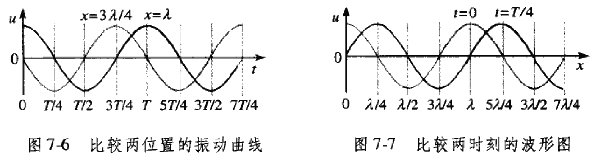
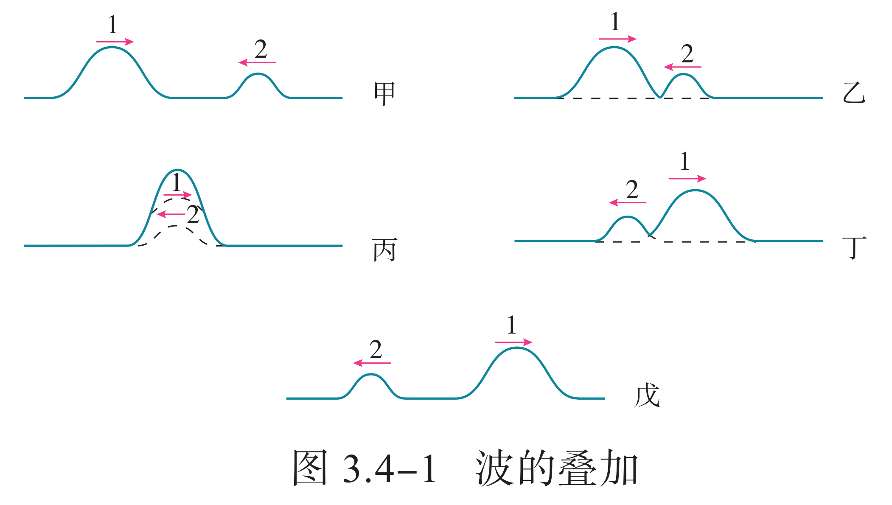

# 热学与热力学

## 分子动理论

### 分子热运动

物体是由大量分子组成的。需要指出的是：在研究物质的化学性质时，我们认为组成物质的微粒是分子、原子或者离子。但是，在研究物体的热运动性质和规律时，不必区分它们在化学变化中所起的不同作用，而把组成物体的微粒统称为分子。

我们在化学中学过，$\pu{1 mol}$ 的任何物质都含有相同的粒子数，这个数量用阿伏加德罗常数表示，即 $N_A=\pu{6.02214076E23 mol^-1}$。这足以表明，组成物体的分子是大量的。人们用肉眼无法直接看到分子，就是用高倍的光学显微镜也看不到。直至 1982 年，人们研制了能放大几亿倍的扫描隧道显微镜，才观察到物质表面原子的排列。扫描隧道显微镜是一种可以探测物质表面结构的仪器，它通过移动着的探针与物质表面的相互作用，将物质表面原子的排列状态转换为图像信息，获得具有原子尺度分辨力的表面形貌信息。

**扩散**：从许多实验和生活现象中我们都会发现，不同种物质能够彼此进入对方。在物理学中，人们把这类现象叫作扩散。扩散现象并不是外界作用（例如对流、重力作用等）引起的，也不是化学反应的结果，而是由物质分子的无规则运动产生的。扩散现象是物质分子永不停息地做无规则运动的证据之一。扩散现象在科学技术中有很多应用。例如，在生产半导体器件时，需要在纯净半导体材料中掺入其他元素。这一过程可以在高温条件下通过分子的扩散来完成。

**布朗运动**：19 世纪初，一些人观察到，悬浮在液体中的小颗粒总在不停地运动。1827 年，英国植物学家布朗首先在显微镜下研究了这种运动。如果在显微镜下追踪一颗小炭粒的运动，每隔 $\pu{30 s}$ 把炭粒的位置记录下来，然后用线段把这些位置按时间顺序依次连接起来，便可以得到某一颗微粒运动的位置连线。这表明微粒的运动是无规则的。实际上，就是在 $\pu{30 s}$ 内，微粒的运动也是极不规则的。

{ width="90%" }

{ width="80%" }

当时布朗观察的是悬浮在水中的花粉微粒。他起初认为，微粒的运动不是外界因素引起的，而是其自发的运动。是不是因为植物有生命才产生了这样的运动？布朗用当时保存了上百年的植物标本，取其微粒进行实验，他还用了一些没有生命的无机物粉末进行实验。结果是，不管哪一种微粒，只要足够小，就会发生这种运动；微粒越小，运动就越明显。这说明微粒的运动不是生命现象。后人把悬浮微粒的这种无规则运动叫作布朗运动。

- 粒子的运动由平移及转移所构成，显得非常没规则而且其轨迹几乎是处处没有切线。
- 粒子之移动显然互不相关，甚至于当粒子互相接近至比其直径小的距离时也是如此。
- 粒子越小或液体粘性越低或温度越高时，粒子的运动越活泼。
- 粒子的成分及密度对其运动没有影响。
- 粒子的运动永不停止。

在显微镜下看起来连成一片的液体，实际上是由许许多多分子组成的，液体分子不停地做无规则运动，不断地撞击微粒。在某一瞬间，微粒在某个方向受到的撞击作用较强；在下一瞬间，微粒受到另一方向的撞击作用较强，这样就引起了微粒无规则的运动。悬浮在液体中的微粒越小，在某一瞬间跟它相撞的液体分子数越少，撞击作用的不平衡性就表现得越明显，并且微粒越小，它的质量越小，其运动状态越容易被改变，因而，布朗运动越明显。如果悬浮在液体中的微粒很大，在某一瞬间跟它相撞的分子数很多，各个方向的撞击作用接近平衡，这时就很难观察到布朗运动了。

分子的无规则运动无法直接观察。悬浮微粒的无规则运动并不是分子的运动，但这一现象可以间接地反映液体分子运动的无规则性。注意，在大众的一般观念中，布朗运动和花粉之间的关系是不严谨的，不能说我们观察到了花粉的“布朗运动”，而应该说是观察花粉在水中的“无规则运动”可以间接反应液体分子的布朗运动。实际上，花粉具备足够大小而几乎无法观测到布朗运动，而我们观察到的是液体分子进出、碰撞花粉微粒造成的无规则运动。

**热运动**：在扩散现象中，温度越高，扩散得越快。观察布朗运动，温度越高，悬浮微粒的运动就越明显。可见，分子的无规则运动与温度有关系，温度越高，这种运动越剧烈。因此，我们把分子这种永不停息的无规则运动叫作热运动。温度是分子热运动剧烈程度的标志。

我们已经知道：物体是由大量分子组成的，分子在做永不停息的无规则运动，分子之间存在着相互作用力。这就是分子动理论的基本内容。在热学研究中常常以这样的基本内容为出发点，把物质的热学性质和规律看作微观粒子热运动的宏观表现。这样建立的理论叫作分子动理论。由于分子热运动是无规则的，所以，对于任何一个分子而言，在每一时刻沿什么方向运动，以及运动的速率等都具有偶然性；但是对于大量分子的整体而言，它们的运动却表现出规律性。

### 分子间作用力

气体很容易被压缩，说明气体分子之间存在着很大的空隙。固体或液体不容易被压缩，那么，分子之间还会有空隙吗？水和酒精混合后的总体积变小了。这表明液体分子间存在着空隙。再如，压在一起的金块和铅块，各自的分子能扩散到对方的内部，这表明固体分子之间也存在着空隙。分子间有空隙，大量分子却能聚集在一起，这说明分子之间存在着相互作用力。

当用力拉伸物体时，物体内各部分之间要产生反抗拉伸的作用力，此时分子间的作用力表现为引力。当用力压缩物体时，物体内各部分之间会产生反抗压缩的作用力，此时分子间的作用力表现为斥力。分子之间的引力或斥力都跟分子间距离有关，那么，它们之间有怎样的关系呢？研究表明，分子间的作用力 $F$ 跟分子间距离 $r$ 的关系为：

- 当 $r < r_0$ 时，分子间的作用力 $F$ 表现为斥力。
- 当 $r = r_0$ 时，分子间的作用力 $F$ 为 $0$，这个位置称为平衡位置。
- 当 $r > r_0$ 时，分子间的作用力 $F$ 表现为引力。

那么，分子间为什么有相互作用力呢？我们知道，分子是由原子组成的。原子内部有带正电的原子核和带负电的电子。分子间的作用力就是由这些带电粒子的相互作用引起的。

### 油膜法估算

分子十分微小。一个直径为 $\pu{E-3 mm}$ 左右的水珠，它的大小与细菌差不多，用肉眼无法观察，就是在这样小的水珠里，分子的个数竟比地球上人口的总数还多上好几倍！那么，通过什么途径可以知道分子的大小呢？下面我们通过一个实验来估测分子的大小——用油膜法估测油酸分子的大小。用油膜法估测油酸分子直径的大小是一种通过测量宏观量来测量微观量的方法。

为了估测油酸分子的大小，我们把 $1$ 滴油酸滴在水面上，水面上会形成一层油膜，油膜是由单层油酸分子（$\ce{C17H33COOH}$）中的烃基组成的。油酸分子中的一部分是羧基 $\ce{-COOH}$，它对水有较强的亲合力；而另一部分烃基 $\ce{-C17H33}$ 对水没有亲合力，要冒出水面。因此，油酸分子会一个个地直立在水面上形成单分子油膜。

{ width="40%" }

尽管油酸分子有着复杂的结构和形状，分子间也存在着间隙，但在估测其大小时，可以把它简化为球形处理，并认为它们紧密排布。测出油膜的厚度 $d$，它就相当于分子的直径。实验中，为了使油酸充分展开，获得一块单分子油膜，我们需要将油酸在酒精中稀释后再滴入水中。这样的油酸酒精溶液滴在水面上，溶液中的酒精将溶于水并很快挥发，从而获得纯油酸形成的油膜。用 $1$ 滴油酸酒精溶液中纯油酸的体积 $V$ 和该油膜面积 $S$ 计算出油膜厚度，即可以粗略地认为，油膜的厚度 $d$ 等于 $1$ 滴油酸酒精溶液中纯油酸的体积 $V$ 与它在水面上摊开的面积 $S$ 之比。

1. 测量 $1$ 滴油酸酒精溶液中纯油酸的体积 $V$。配制一定浓度的油酸酒精溶液，用注射器吸取一段油酸酒精溶液，由注射器上的刻度读取该段溶液的总体积，再把它一滴一滴地滴入烧杯中，记下液滴的总滴数。用它们的总体积除以总滴数，得到 $1$ 滴油酸酒精溶液的体积，再计算其所含纯油酸的体积 $V$。

    { width="35%" align=right }

2. 测量 $1$ 滴油酸酒精溶液在水面上形成的油膜面积 $S$。在浅盘里盛上水，一只手捏住盛有爽身粉的布袋，另一只手拍打，将爽身粉均匀地撒在水面上。然后，用注射器向水面上滴 $1$ 滴油酸酒精溶液，油酸立即在水面散开，形成一块油膜。油膜上没有爽身粉，可以清楚地看出它的轮廓。待油膜形状稳定后，将事先准备好的带有坐标方格的玻璃板放在浅盘上，在玻璃板上描下薄膜的形状。

3. 根据画有油膜轮廓的玻璃板上的坐标方格，计算轮廓范围内正方形的个数，不足半个的舍去，多于半个的算一个。然后，把正方形的个数乘单个正方形的面积就得到油膜的面积 $S$。

大量实验结果表明，尽管所用的测定分子大小的方法不同，测出的结果也有差异，但数量级是一致的。除了一些有机物质的大分子外，多数分子大小的数量级为 $\pu{E-10 m}$。

### 分子的能量

分子动能：人们利用分子动理论通过对大量分子求统计平均，建立了宏观量与相应的微观量统计平均值的关系。分子不停地做无规则运动，那么，像一切运动着的物体一样，做热运动的分子也具有动能，这就是分子动能。物体中分子热运动的速率大小不一，所以各个分子的动能也有大有小，而且在不断改变。在热现象的研究中，我们关心的是组成系统的大量分子整体表现出来的热学性质，因而，这里重要的不是系统中某个分子的动能大小，而是所有分子的动能的平均值。这个平均值叫作分子热运动的平均动能。

温度升高时，分子的热运动加剧，温度越高，分子热运动的平均动能越大。温度越低，分子热运动的平均动能越小。因此，可以得出结论：物体温度升高时，分子热运动的平均动能增加。这样，分子动理论使我们懂得了温度的微观含义。过去我们说，“温度是分子热运动剧烈程度的标志”，现在就能进一步说，“物体的温度是它的分子热运动的平均动能的标志”。

分子势能：分子间存在着相互作用力，可以证明分子间的作用力所做的功与路径无关，分子组成的系统具有分子势能。分子势能的大小由分子间的相对位置决定，这说明分子势能 $E_p$ 与分子间距离 $r$ 是有关系的。设两个分子相距无穷远，我们可以规定它们的分子势能为 $0$。让一个分子 A 不动，另一个分子 B 从无穷远处逐渐靠近 A。在这个过程中，分子间的作用力做功，分子势能的大小发生改变。

当分子 B 向分子 A 靠近，分子间距离 $r$ 大于 $r_0$ 时，分子间的作用力表现为引力，力的方向与分子的位移方向相同，分子间的作用力做正功，分子势能减小。当分子间距离 $r$ 减小到 $r_0$ 时，分子间的作用力为 $0$，分子势能减到最小。越过平衡位置 $r_0$ 后，分子 B 继续向分子 A 靠近，分子间的作用力表现为斥力，力的方向与分子的位移方向相反，分子间的作用力做负功，分子势能增大。

可见，分子势能的大小是由分子间的相对位置决定的。由以上分析可知，如果选定分子间距离 $r$ 为无穷远时的分子势能 $E_p$ 为 $0$，分子势能 $E_p$ 随分子间距离 $r$ 的变化有最小值，即当 $r = r_0$ 时，分子势能最小。物体的体积变化时，分子间距离将发生变化，因而分子势能随之改变。可见，分子势能与物体的体积有关。

物体的内能：物体中所有分子的热运动动能与分子势能的总和，叫作物体的内能。任何物体都具有内能。分子热运动的平均动能与温度有关，分子势能与物体的体积有关。一般说来，物体的温度和体积变化时它的内能都会随之改变。

应当指出，组成物体的分子在做无规则的热运动，具有热运动的动能，它是内能的一部分；同时物体还可能做整体的运动，因此，还会具有动能，这是机械能的一部分。后者是由物体的机械运动决定的，它对物体的内能没有贡献。

## 物态变化

### 内能与热量

内能：物体所有分子的热运动动能和分子势能的总和。

内能的决定因素：

- 微观：分子个数、分子势能、分子动能。

- 宏观：物质的量、体积、温度。一般也说质量和物态。

- 分子势能：由分子的位置相关，微观上与分子间距相关，宏观上与体积相关。

- 分子平均动能：只与温度有关（但是不能说内能由温度决定）。

热量：

- 热量不是传递着的热质，而是传递着的能量。

- 传热是基于各部分温度的不一致而发生的能量的传递，有，

    $$
    \Delta Q=mc\Delta T
    $$

    其中 $c$ 表示材料的比热容，单位为 $\pu{[J/(kg*^oC)]}$。

- 做功与传热是使系统能量发生变化的两种方式。

比热：

- 对于质量为 $m$ 的物体，其比热，

    $$
    C=mc
    $$

- 即，热容为 $C$ 的物体，温度改变 $\Delta T$ ，吸放热，
    
    $$
    \Delta Q=C\Delta T
    $$

    物体的热容不仅与物体的性质、质量有关，一般还与温度有关。

- 对于一个体系，式子也是一样的。

### 固体的性质

食盐颗粒总是呈现立方体形，松香颗粒没有规则的几何形状。我们常见的固体，有些是晶体，有些是非晶体。石英、云母、明矾、食盐、硫酸铜、味精等是晶体，这些晶体有天然的、规则的几何形状。玻璃、蜂蜡、松香、沥青、橡胶等是非晶体。非晶体没有规则的外形。

雪花是水蒸气凝华时形成的晶体，它们都具有相似的几何形状，即图案中都有六个角。食盐晶体是正六面体形，明矾晶体总是八面体形，天然石英晶体（俗称水晶）的中间是一个六棱柱，两端是六棱锥。

云母是一种矿物，化学成分为铝硅酸盐，可以剥成一片片的薄层。有些云母的绝缘性能很好，在过去没有塑料的年代，云母常在电器中当作绝缘物使用。除了形状是否规则外，晶体和非晶体在物理性质上也有所不同。我们在初中已经学过，晶体具有确定的熔点，非晶体没有确定的熔化温度，这就是区别之一。此外，其他物理性质也有差异。

### 液体的性质

## 热力学基础

### 热力学

热力学，是研究**热现象**中物态转变和能量转换规律的学科，它着重研究物质的平衡状态以及与准平衡态的物理、化学过程。热力学定义许多宏观的物理量，描述各物理量之间的关系：

- 研究对象：包含大量（无限多）微观粒子的宏观物体的性质。

- 研究内容：热运动的规律，与热运动有关的物性和宏观物质系统的演化。

- 热运动：组成宏观物体的大量微观粒子的无规则运动的规律。

研究某一容器中气体的热学性质，其研究对象是容器中的大量分子组成的系统，这在热学中叫作一个热力学系统，简称系统。系统之外与系统发生相互作用的其他物体统称外界。例如，用酒精灯加热容器中的气体，把气体作为研究对象，它就是一个热力学系统，而容器和酒精灯就是外界。

- 孤立系统：不能交换热量，不能交换机械功，不能交换物质。
- 绝热系统：不能交换热量，可以交换机械功，不能交换物质。
- 封闭系统：可以交换热量，可以交换机械功，不能交换物质。
- 开放系统：可以交换热量，可以交换机械功，可以交换物质。

热运动影响着物质的各种宏观性质。

### 状态参量

在力学中，为描述物体（质点）的运动状态，我们使用了物体的位置和速度这两个物理量。在热学中，为确定系统的状态，也需要用到一些物理量，这些物理量叫作系统的状态参量。例如，为了确定系统的空间范围，要用到体积，这是一个几何参量；为了确定外界与系统之间或系统内部各部分之间力的作用，要用到压强，这是一个力学参量；而要确定系统的冷热程度，就要用到一个热学参量——温度。

状态参量：

- 是指在动态系统中，可以描述系统数学状态的一组变量。

- 可以通过状态参量，在系统未受到外界干扰的情形下，预测系统未来的特性。

- 对不同的假想体系具体考虑某一方面的性质，形成了物理学的不同分支。

- 它们是对实际的宏观系统进行不同的抽象，引进不同的状态参量来描述。

状态函数：

- 由一系列表征体系性质的物理量所确定下来的体系的存在形式称作体系的状态，借以确定体系状态的物理量称作体系的状态函数。

- 如研究某理想气体，其物质的量 $n = \pu{1mol}$，压强 $p = \pu{1.01E5 Pa}$，体积 $V = \pu{22.4 dm3}$，温度 $\pu{0 ^\circ C}$，则认为它处于**标准状况**，这里 $n$，$p$，$V$，$T$ 就是体系的状态函数。

- 体系的状态和状态函数互相确定：体系的多个状态函数确定了，状态也就确定了；状态确定了，多个状态函数也就确定了。这里状态函数中的「函数」，指的就是它们是体系状态上的函数，比如 $p(标准状况) = \pu{1.01E5 Pa}$。

状态函数的性质：

- 有些状态函数，如 $V$ 和 $n$ 等所表示的性质具有加和性，如一个体系的 $V$ 等于体系各部分的 $V$ 之和、体系的这类具有加和性的性质，称作体系的**广度性质**，这类状态函数称作**广度量**。

- 还有些状态函数，如 $p$ 和 $T$ 等所表示的性质无加和性，称作体系的**强度性质**，这类状态函数称作**强度量**。大部分这类状态函数满足体系的该状态函数等于体系各部分的状态函数。

### 状态的变化​

要定量地描述系统的状态往往很难，因为有时系统的参量会随时间变化。然而在没有外界影响的情况下，只要经过足够长的时间，系统内各部分的状态参量就能够达到稳定状态。这种状态叫作平衡态，否则就是非平衡态。当系统处于平衡态时，系统所有状态参量都不随时间变化，我们就能比较准确地描述系统的状态。在中学阶段，我们主要处理平衡态的问题。

理想气体状态方程是理想气体处在**平衡态**时，描述气体状态参量的所满足的方程式。平衡态是指一个处在没有外界影响的热力学系统，经过一段时间后，将达到一个确定的状态，而不再有任何宏观变化。即，在不受外界影响的条件下，系统**宏观性质**不随时间变化的状态称为平衡态。

上面所说的平衡态，指的是一个系统的状态参量不再改变。下面我们要研究一个系统与另一个系统相互作用的问题。如果两个系统相互接触而传热，这两个系统的状态参量将会互相影响而分别改变。经过一段时间， 各自的状态参量就不再变化了，这说明两个系统达到了平衡。这种平衡叫作热平衡。实验表明，如果两个系统分别与第三个系统达到热平衡，那么这两个系统彼此之间也必定处于热平衡，这个结论称为热平衡定律。热平衡定律表明，当两个系统 A、B 处于热平衡时，它们必定具有某个共同的热学性质，我们就把表征这一“共同的热学性质”的物理量叫作温度。换句话说，温度是决定一个系统与另一个系统是否达到热平衡的物理量，它的特点就是“达到热平衡的系统具有相同的温度”。

例如：有一根金属棒，一端与冰水混合物（$0℃$）接触，另一端与开水接触（$100℃$），经一定时间后，金属棒内的温度分布将不随时间变化，但它并不处在平衡态，因为此棒不断从高温处吸热，在低温处放热，即持续受到外界影响。

体系的一个状态函数或者几个状态函数发生了改变时，体系的状态发生变化，称体系经历了一个热力学过程，简称过程。体系发生变化前的状态称作始态，变化后的状态称作终态。体系变化的始态和终态一旦确定，各状态函数的改变量也随之确定。状态函数的改变量用 $\Delta$ 表示，如始态温度 $T_1$，终态温度 $T_2$，我们有状态函数改变量 $\Delta T = T_2 - T_1$。有一些过程具有值得研究的特殊性，如：

- 恒温条件：体系始态和终态的温度相等，且等于环境的温度。满足该条件的过程称作恒温过程。

- 恒压条件：体系始态和终态的压强相等，且等于环境的压强。满足该条件的过程称作恒压过程。

- 恒容条件：体系始态和终态的体积相等。满足该条件的过程称作恒容过程。

上面三个条件不互斥，可共存，如存在既满足恒温条件又满足恒压条件的过程——恒温恒压过程。同种过程可以采取多种不同的具体方式实现，每种具体方式称作一种途径。

比如某理想气体从始态 $p = \pu{1E5 Pa}$，$V = \pu{2dm3}$ 经一恒温过程变为终态 $p = \pu{2e5 Pa}$，$V = \pu{1dm3}$。该过程存在无数种途径，其中两种如下：先恒温膨胀为 $p = \pu{0.5E5 Pa}$，$V = \pu{4dm3}$，再恒温压缩为终态 $p = \pu{2e5 Pa}$，$V = \pu{1dm3}$。先恒温压缩为 $p = \pu{2E5 Pa}$，$V = \pu{1dm3}$，再恒温压缩为终态 $p = \pu{2e5 Pa}$，$V = \pu{1dm3}$。

但当过程确定了，无论途径如何，每个状态函数的改变量都是相同的。也即，状态函数的改变量与途径无关。过程的关键是始态和终态，途径则注重具体实施方式。

### 热力学第零定律

热力学第零定律（又称热平衡定律）指出：

> 若两个热力学系统均与第三个系统处于热平衡状态，此两个系统也必互相处于热平衡。

两个互相处于平衡状态的系统会满足以下条件：

- 两者各自处于平衡状态；

- 两者在可以交换热量的情况下，仍然保持平衡状态。进而推广之，如果能够肯定两个系统在可以交换热量的情况下物理性质也不会发生变化时，即使不容许两个系统交换热量，也可以肯定互为平衡状态。

对于现在来说，可以认为热力学第零定律认可了**温度**作为状态参量的存在。

- 平衡态是指一个处在没有外界影响的热力学系统，经过一段时间后，将达到一个确定的状态，而不再有任何宏观变化。

    即，在不受外界影响的条件下，系统宏观性质不随时间变化的状态称为平衡态。

- 例如：有一根金属棒，一端与冰水混合物（0℃）接触，另一端与开水接触（100℃），经一定时间后，金属棒内的温度分布将不随时间变化，但它并不处在平衡态，因为此棒不断从高温处吸热，在低温处放热，即持续受到外界影响。

### 热力学温标定义

如果要定量地描述温度，就必须有一套方法，这套方法就是温标。确定一个温标时首先要选择一种测温物质，根据这种物质的某个特性来制造温度计。例如，可以根据水银的热膨胀来制造水银温度计，这时我们规定细管中水银柱的高度与温度的关系是线性关系。还可以根据气体压强随温度的变化来制造气体温度计，等等。确定了测温物质和它用以测温的某种性质之后， 还要确定温度的零点和分度的方法。例如，摄氏温标曾经规定，标准大气压下冰的熔点为 0 ℃，水的沸点为 100 ℃ ；并据此把玻璃管上 0 ℃ 刻度与 100 ℃ 刻度之间均匀分成 100 等份，每份算作 1 ℃。

现代科学中用得更多的是热力学温标。热力学温标表示的温度叫作热力学温度，它是国际单位制中七个基本物理量之一，用符号 $T$ 表示，单位是开尔文，简称开，符号为 $K$。热力学温标对应的物理量是热力学温度，或称开氏度，符号为 $\pu{K}$。

- 自 2019 年 5 月 20 日起，$\pu{1K}$ 被严格定义，也就是说 $\pu{0K = -273.15^oC}$ 是人为定义的。

- 绝对零度是低温的极限，只可接近、不可达到。因此热力学温度没有负数。

- 温度变化 $1$ 摄氏度，相当于变化 $1$ 开尔文（每变化 $\pu{1K}$ 相当于变化 $\pu{1^oC}$）。

摄氏温标和热力学温标（开尔文, K）两种温标的转换公式为：

$$
[\pu{^oC}] = [\pu{k}] - 273.15
$$

$$
[\pu{k}] = [\pu{^oC}] + 273.15
$$

一般只取 $273$ 舍掉小数部分，因此 $\pu{27^oC = 300K}$。

### 热力学第一定律

系统与环境的总和就是宇宙。系统内能的增加量等于环境内能的减少量，对于宇宙来说能量守恒。

根据热力学第一定律，对始终静止的系统，令 $\Delta U$ 为系统的内能变化，$Q$ 为热量，$W$ 为环境对系统做的功，则有：

$$
\Delta U = Q + W
$$

在热力学中，我们不讨论系统进行宏观运动的情形，只讨论微观上分子的运动，因此能量的形式不包含动能和势能，只有内能。

热学中涉及到的功可以分为两类：体积功和非体积功。体积功是由于系统体积变化从而环境对系统的做功；非体积功指除了体积功以外其他所有形式的做功，如电功。中学阶段并不研究非体积功，体积功的大小等于 $-p_{\mathrm e}\Delta V$。
