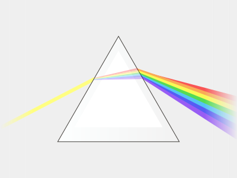
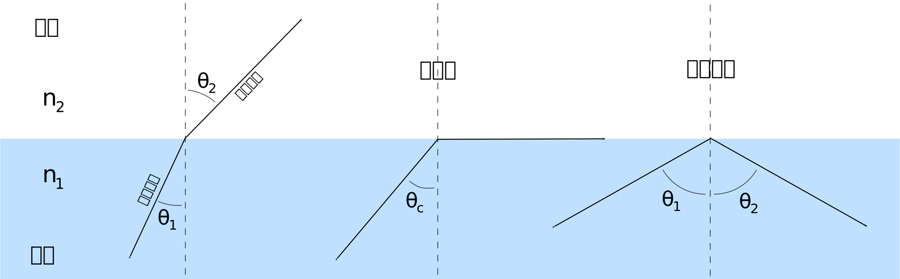
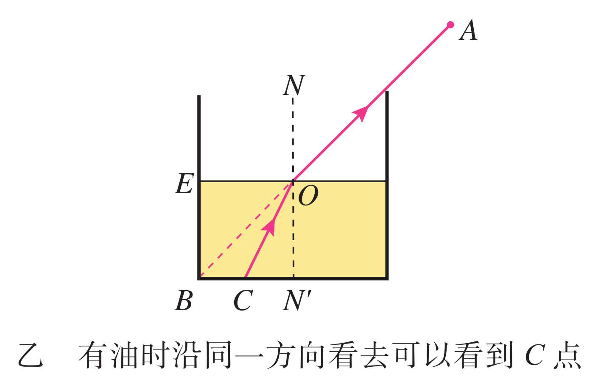
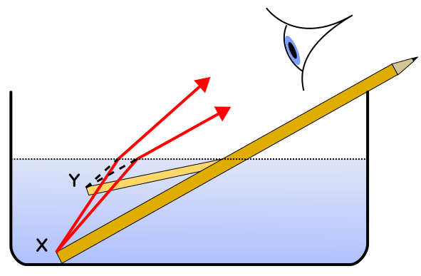
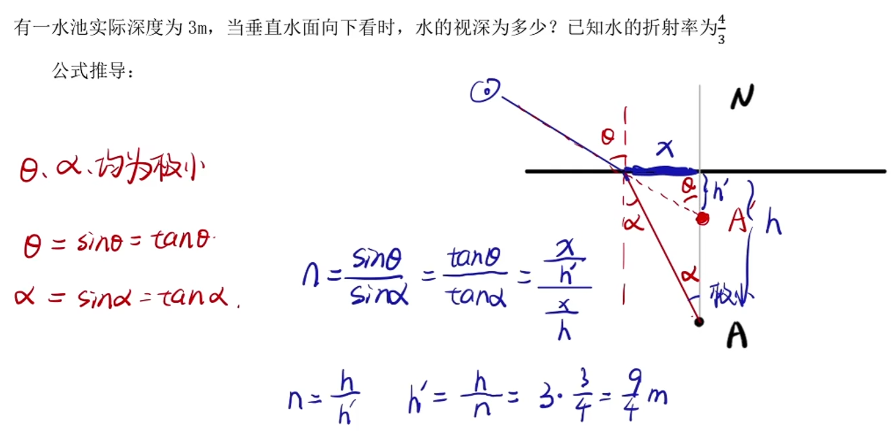
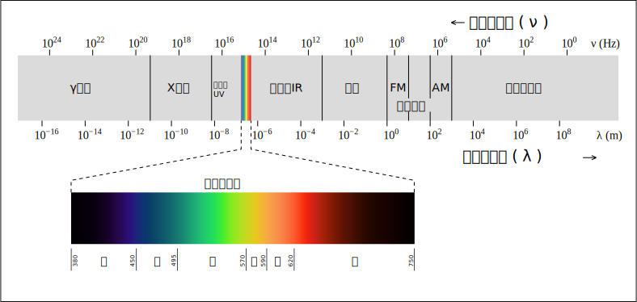
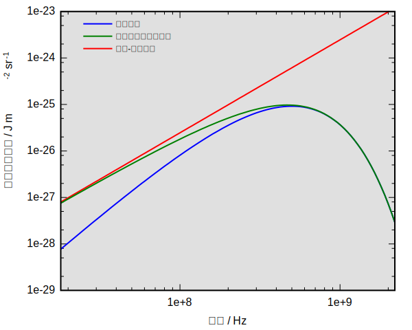
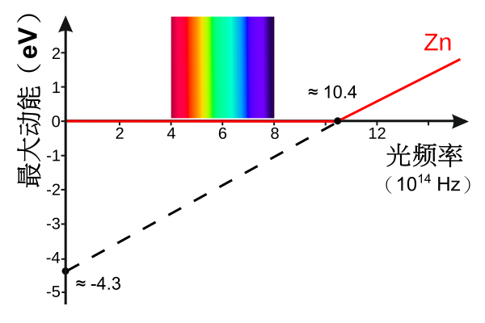
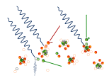

# 光学与电磁波

## 几何光学

### 光的传播

光在同种均匀介质中沿直线传播，在真空中光的传播速度为 $c=\pu{299 792 458 m/s}$，约 $\pu{3\times10^8m/s}$，不同颜色的光在真空中的传播速度相同，在其他介质中的传播速度不同。正在发光的物体叫做光源。

{ width="100%" }

以上为光的最简单三个性质，我们在初中就已经涉及，后面我们会分别展开讲解。

- 费马原理：光（或任何波）在两点间传播时，所走的路径是所需光程（或时间）为极值（通常是极小值）的路径。

- 光路可逆原理：在干涉与绕射可忽略的情况中，入射光线与反射光线的可交换性。就是在一条光径的终点，发出反方向的光，此光可沿原路径回到原来的起点。

### 光的反射

### 光的折射

折射率也称折射系数，视光学称屈光指数、屈光率，表示光在真空中的传播速度是在这种介质中传播速度的多少倍：

$$
n=\dfrac{c}{v}
$$

这个比值即为这种介质的**绝对折射率**，简称折射率，其中 $v$ 为光在这种介质中的传播速度。自然界中的物质折射率通常是大于 $1$ 的（人造材料可以实现折射率对于一定频率范围内的电磁波是负值，称为负折射率超材料）。

| 介质 | 真空 | 空气 | 水 | 水晶 | 玻璃 |
| :-: | :-: | :-: | :-: | :-: | :-: |
| 折射率 | $1$ | $1.00028$ | $1.33$ | $1.55$ | $1.5$ |

我们知道光从一个介质进入另一个介质，其频率不会发生改变，这意味着

$$
n=\dfrac{c}{v}=\dfrac{\lambda_0}{\lambda}
$$

其中 $\lambda$ 是真空中光的波长，$\lambda$ 是这束光进入这种介质后的波长，也就是说

$$
\lambda=\dfrac{\lambda_0}{n}
$$

我们知道，光从空气射到水面时，一部分光射进水中，另一部分光返回到空气中。

{ width="80%" }

入射光线与法线的夹角 $\theta_1$ 称为入射角，折射光线与法线的夹角 $\theta_2$ 称为折射角，折射定律（斯涅尔定律）指出：

$$
\dfrac{\sin\theta_1}{\sin\theta_2}=\dfrac{v_1}{v_2}=\dfrac{\lambda_1}{\lambda_1}=n_{12}
$$

式中 $n_{12}$ 是**相对折射率**，它与入射角、折射角的大小无关，只与两种介质的性质有关，

$$
n_{12}=\dfrac{n_2}{n_1}=\dfrac{\sin\theta_1}{\sin\theta_2}
$$

据此我们可以得出斯涅耳定律的最标准形式：

$$
n_1\sin\theta_1=n_2\sin\theta_2
$$

虽然折射率影响波长，但它取决于频率（颜色和能量），即折射率是波长的函数。

- 紫光频率高、波长短、折射率大，红光频率低、波长长、折射率小。

- 太阳光在斜射入棱镜后，紫光偏转角度大、红光偏转角度小，弯曲角度的差异使白光分裂成其组成颜色，这种现象称为光的色散。

{ width="80%" }

{ width="80%" }

如果一束光从一种介质射入另一种介质，我们称折射率较小的为光疏介质，折射率较大的为光密介质。存在一个临界角 $\theta_c$ 使得入射角大于这个角，则不会发生折射现象，所有关系全部向内面反射，称为**全反射**或全内反射。

{ width="100%" }

在不考虑耗损的情况下：

$$
\sin\theta_c=\dfrac{n_2}{n_1}
$$

其中 $n_2$ 是光疏介质的折射率，$n_1$ 是光密介质的折射率，当光疏介质是真空或者空气时

$$
\sin\theta_c=\dfrac{1}{n_1}
$$

全反射的现象：沸水中的气泡看起来比较亮，光纤、内窥镜。

玻璃棱镜的截面为等腰直角三角形，当光从图中所示的方向射入玻璃时，由于光的方向与玻璃面垂直，光线不发生偏折。但在玻璃内部，光射向玻璃与空气的界面时，入射角大于临界角，发生全反射。与平面镜相比，它的反射率高，几乎可达 100%。

  { width="90%" }

{ width="90%" }

注意：当发生全反射时，电磁场并非完全没有从光密介质进入光疏介质，虽然没有能量以**行进波**的形式透射进入光疏介质，但在界面处的光疏介质一侧，仍然会形成一个特殊的、非传播的电磁场，称为**倏逝波**。利用倏逝波的原理，可以制成分光器。

### 几何问题

“看起来”问题：人总是认为光源在沿着进入眼的光线的反向延长线上，而两只眼睛所确定的射线的交点为人认为光源的位置。

- 海市蜃楼与沙漠蜃景：折射与全反射。

    { width="60%" }

- 水井中多青蛙看天：洞口更小、视野更大。

    { width="50%" }

- 日出时人开太阳：人看到地平线以下的太阳。

- 岸上的人看鱼：**人看到的鱼偏浅**。

    ---

    

- 水中的鱼看人：**鱼看到的人偏高**。

    ---

    

视深问题：垂直向一深度为 $h$ 的水池看去，水的视深是多少？已知水的折射率 $n$。

虽然我们是垂直向下看的，但是因为我们用两个眼睛确定距离，且两个眼睛有一定距离，因此不妨取一极小角，用来计算视深。

## 波动光学

### 半波损失

相位变化（半波损失）： 当波从波疏介质（波速大）射向波密介质（波速小）的界面反射时，反射波会发生π的相位突变，相当于损失了半个波长。这就像一个脉冲在固定端反射时会倒相一样。反之，从波密到波疏反射，相位不变。

大学物理拓展（彩蛋2：半波损失）
在高中，我们通常不考虑反射波的相位变化。但在大学物理中，这是一个关键点。

当波从波疏介质（波速大）射向波密介质（波速小）时，反射波会发生半波损失，即相位突变π（相当于波形上下颠倒）。
实例：绳子一端固定在墙上（墙可视为“无限波密”），当波传到固定端反射时，会产生一个倒置的脉冲。这就是半波损失的体现。

> 我们发现，入射波的反射点 $b$ 是固定不动的，所以必为波节。这表明入射波与反射波在 $b$ 点的相位一定始终相反，即入射波在固定端发生反射时，相位发生了 $\pi$ 的突变。由于在波的传播中，相距半个波长的两质元的相位差为 $\pi$，所以相位为 $\pi$ 的突变，就相当于“损失”（或“附加”）了半个波长，因此通常又把这种现象称为**半波损失**。当然，这只是一种形象的说法，并非是波在实际上少传播或多传播了半个波长的距离。

反射（固定端/自由端；两介质分界面）
固定端：反射波发生“相位反转”（相当于振幅取负）。脉冲碰到固定端翻个面回来。
自由端：不反相（不倒相）。
两介质分界（两段弦，张力相同，线密度不同→v 不同）：
设从介质1（波速 v1）入射到介质2（v2），位移振幅的反射/透射系数
r = A_r/A_i = (k1 − k2)/(k1 + k2) = (v2 − v1)/(v2 + v1)
t = A_t/A_i = 2k1/(k1 + k2) = 2v2/(v1 + v2)
结论检查：
v2 ≪ v1（相当“更硬”的边界）→ r ≈ −1（近似固定端，反相）。
v2 ≫ v1（相当“更软”的边界）→ r ≈ +1（近似自由端，不反相）。

为什么会发生反射？更深层的原因是波阻抗不匹配。波阻抗是描述介质对波动阻碍作用的物理量，类似于电路中的电阻。当波从一个波阻抗为Z₁的介质入射到波阻抗为Z₂的介质时，就会在界面上发生反射和透射（折射）。

反射率与透射率：反射波能量占总能量的比例（反射率）和透射波能量占总能量的比例（透射率）取决于Z₁和Z₂的差异。差异越大，反射越强。
相位反转的本质：当波从低阻抗介质（疏介质）进入高阻抗介质（密介质）时，会发生相位反转。反之则不会。这为高中阶段“波疏/密介质”的定性描述提供了定量的物理依据。例如，乐器设计中需要考虑不同部件（如琴弦和琴马）的阻抗匹配，以实现能量的高效传递。

### 光的干涉

### 光的衍射

惠更斯原理： 介质中任一波面上的各点，都可以看作是发射子波的波源；其后任一时刻，这些子波的包络面就是新的波面。

应用1：解释反射定律。

想象一束平面波（波面为直线）以入射角θ₁射向界面。在波面AA'上的各点，当A点到达界面时，A'点还未到达。经过一段时间Δt，A点发出的子波已经以半径v₁Δt在介质1中传播，而A'点刚好到达界面B点。连接所有子波的包络面（即过B点作A点子波的切线），就得到了新的反射波面。通过简单的几何关系，可以严格证明反射角θ' = 入射角θ₁。
应用2：解释折射定律。

同样的情景，但波进入了介质2。当A点到达界面后，它发出的子波在介质2中以速度v₂传播。经过Δt，A'点到达界面B点，此时A点在介质2中的子波半径为v₂Δt。连接包络面，通过几何关系可以证明 sinθ₁ / sinθ₂ = v₁ / v₂。

单缝夫琅禾费衍射：当平行光通过一个窄缝后，在远处的屏幕上会形成明暗相间的条纹。中央明纹最宽最亮，两侧条纹亮度迅速减弱。

大学物理拓展（彩蛋5：杨氏双缝实验与波粒二象性）
杨氏双缝干涉实验是物理学史上最著名的实验之一。

经典解释：它完美地证明了光的波动性。
量子解释：当用单个光子（或电子）重复此实验时，长时间累积后依然会出现干涉条纹！这意味着单个粒子同时通过了两条缝并与自己发生了干涉。

### 光的偏振

## 电磁波

## 量子力学

### 黑体辐射

当时物理学家已有能力对热辐射的强度随波长的分布进行比较准确的测量。研究表明，对于一般材料的物体，辐射电磁波的情况除了与**温度**有关，还与材料的**种类及表面状况**有关，而黑体辐射电磁波的强度按波长的分布**只与黑体的温度有关**。它可能反映了某种具有普遍意义的客观规律，人们因此对黑体辐射进行了深入的实验及理论研究。

{ width="100%" }

- 如果某种物体能够完全吸收入射的各种波长的电磁波而不发生反射，这种物体就是绝对黑体，简称**黑体**。如果一个物体本身辐射出的电磁波远远强于其反射的，例如太阳、黑夜中的灯泡等，也可以近似看为黑体。

- 空腔壁上开一个很小的孔，射入小孔的电磁波在空腔内表面会发生多次反射和吸收，最终不能从空腔射出。这个带小孔的空腔就可以近似为一个绝对黑体。黑体虽然不反射电磁波，却可以向外辐射电磁波，这样的辐射叫作**黑体辐射**。

利用分光技术和热电偶等设备，可以测出黑体辐射电磁波的强度按波长分布的情况。随着温度的升高，一方面，各种波长的辐射强度都有增加，另一方面，辐射强度的极大值向波长较短的方向移动。

我们知道，物体中存在着不停运动的带电微粒，按照当时物理学的认识，每个带电微粒的振动都产生变化的电磁场，从而产生电磁辐射。

{ width="90%" }

英国物理学家瑞利根据经典统计力学，提出了辐射强度按波长分布的理论公式。后来，金斯修正了瑞利辐射公式中的一个数值错误，此公式被称为瑞利-金斯定律。瑞利公式在长波区与实验基本一致，但在短波区与实验严重不符。

以古典物理学理论所计算的黑体辐射强度会随辐射频率的增加，而趋向于放出无穷大之能量。奥地利物理学家埃伦费斯特用“紫外灾变”来形容经典理论的困境，这也被称为瑞利-金斯灾变。

与此同时，德国物理学家维恩基于对实验数据的经验总结，同样提出了近似公式，但是维恩公式在短波区与实验非常接近，而在长波区则与实验偏离较大。后来，德国物理学家普朗克提出新公式以改进维恩定律，提出了普朗克公式（普朗克黑体辐射公式），实际上解决了这一问题。

{ width="90%" }

普朗克尝试从电磁学、力学、统计物理学等物理学的基本理论出发，把这个公式推导出来。普朗克发现，如果想推导出这个公式，就必须假定：组成黑体的振动着的带电微粒的能量只能是某一最小能量值 $\varepsilon$ 的整数倍，这被视为是量子力学的诞辰。

他把这个不可再分的最小能量值 $\varepsilon$ 叫作**能量子**，它的表达式为：

$$
\varepsilon=h\nu
$$

在力学（特别是振动与波动）、声学、电学等，频率通常用符号 $f$ 表示。而在研究微观世界的量子力学、原子物理和光学等学科中，则惯用希腊字母 $\mu$ 来表示频率。这一惯例的建立主要是为了确保符号的清晰性，避免它与通常用来表示速度的拉丁字母 $v$ 产生混淆，因为在诸如波速公式 $v=λ\nu$ 等重要关系式中，频率与速度常需同时出现。

普朗克常量 $h$ 是一个常数，后人称之为**普朗克常量**，其值为：

$$
h=\pu{6.62607015E-34J\cdot s}
$$

普朗克对微观带电微粒能量取值的假设和宏观世界中我们对能量的认识有很大不同。宏观的能量是连续的。而普朗克的假设则认为微观粒子的能量是量子化的，或者说微观粒子的能量是分立的。这是微观与宏观世界物理规律最重要的差别之一。

阿尔伯特·爱因斯坦通过假设普朗克量子是真实的物理粒子（即我们现在所说的光子，而不仅仅是数学虚构），从物理上解决了这个问题。他们按照玻尔兹曼的方式将统计力学修改为光子集合。爱因斯坦的光子具有与其频率成正比的能量，并解释了未发表的斯托克斯定律和光电效应。普朗克提出新公式以改进维恩定律，实际上解决了这一问题。

### 光电效应原理

实验发现：

- 赫兹在研究电磁波的实验中偶然发现，接收电路的间隙如果受到光照，就更容易产生电火花。这就是最早发现的光电效应，也是赫兹细致观察的意外收获。

- 若使**锌板**带负电，用**紫外线灯**照射后，验电器张开的指针夹角会变小，说明锌板带的负电荷变少了。这意味着，紫外线会让电子从锌板表面逸出。

光束里的光子所拥有的能量与光的频率成正比。假若金属里的电子吸收了一个光子的能量，而这能量大于或等于**截止频率**（又称为**底限频率**），则此电子因为拥有了足够的能量，会从金属中逃逸出来，成为光电子。在真空里的自由电子无法吸收光子成为光电子，必须借助原子，才能维持动量守恒。

实验表明，不同金属的截止频率不同。换句话说，截止频率与金属自身的性质有关。

若能量不足，则电子会释出所吸收的能量，能量重新成为光子离开，电子能量恢复到吸收之前，无法逃逸离开金属。其中机制遵照的是一种非全有即全无的判据，光子所有能量都必须被吸收，用来克服**逸出功**，否则这能量会被重新释放。假若电子所吸收的能量能够克服逸出功，并且还有剩余能量，则这剩余能量会成为电子在被发射后的动能。

增加光束的辐照度（光束的强度）会增加光束里光子的密度，在同一段时间内激发更多的电子，但不会使得每一个受激发的电子因吸收更多的光子而获得更多的能量。换言之，光电子的能量与辐照度（光强度）无关，只与光子的能量、频率有关（频率本质就是光子所带的能量大小）。

我们知道截止频率 $\nu_c$ 的光子所带的能量为：

$$
W_0=h\nu_c
$$

这就是该金属的逸出功，而一个频率为 $\nu$ 的光子克服逸出功后，光电子的最大动能：

$$
E_{\max}=h\nu-W_0=h(\nu-\nu_c)
$$

实际物理要求动能必须是正值，因此光频率必须大于或等于截止频率，光电效应才能发生。

{ width="100%" }

光电效应具有瞬时性：

- 如果光很弱，按经典电磁理论估算，电子需要几分钟到十几分钟的时间才能获得逸出表面所需的能量，这个时间远远大于实验中产生光电流的时间。

- 应用量子物理学，不论辐照度的大小，只要入射光子的能量大于或等于逸出功（频率超过截止频率 $\nu_0$ 时），一旦这能量被金属表面的电子吸收，就可以逃逸出金属表面，成为光电子，所以开启入射光束后，在非常微小的时间间隔内，就有可能观察到光电效应。

- 精确测量表明产生电流的时间很快，即光电效应几乎是瞬时发生的，所需的时间间隔小于 $\pu{3E-9}$ 秒，这是非常微小的时间间隔，几乎可以用瞬时发射来形容。

对于光电效应的解释，爱因斯坦是在普朗克量子假说的基础上作出的。他表示，为了解释光电效应，必须假定电磁波本身的能量也是不连续的，即认为光本身就是由一个个不可分割的能量子组成的，频率为 $\nu$ 的光的能量子为 $h\nu$，这些能量子后来称为光子。上面表示光子最大初动能的式子，也被称为爱因斯坦光电效应方程。

爱因斯坦光电效应方程给出了光电子的最大初动能 $E_k$ 与入射光的频率 $\nu$ 的关系。但是，很难直接测量光电子的动能，容易测量的是遏止电压 $U_c$，因此我们就可以用光电子的初动能 $E_k=eU_c$ 得到遏止电压 $U_c$ 与光的频率 $\nu$ 和逸出功 $W_0$ 的关系：

$$
U_c=\dfrac{h}{e}\nu-\dfrac{W_0}{e}
$$

对于确定的金属，其逸出功 $W_0$ 是确定的，电子电荷 $e$ 和普朗克常量 $h$ 都是常量。上式中的遏止电压 $U_c$ 与光的频率 $\nu$ 是线性关系，$U_c-\nu$ 图像是一条斜率为 $\dfrac{h}{e}$ 的直线。

{ width="100%" }

美国物理学家密立根以精湛的技术测量光电效应中几个重要的物理量，以检验爱因斯坦光电效应方程的正确性。实验的结果为爱因斯坦的光电效应理论提供了直接的实验证据。

### 光电效应实验

阴极 K 和阳极 A 是密封在真空玻璃管中的两个电极，阴极 K 在受到光照时能够发射光电子，在两极板电压 $U$ 产生的电场的作用下，向左移动。

{ width="50%" }

阴极 K 与阳极 A 之间电压 $U$ 的大小可以调整，电源的正负极也可以对调。电源按图示极性连接时，闭合开关后，阳极 A 吸收阴极 K 发出的光电子，在电路中形成光电流。我们记录电流表与电压表的示数，绘制成图像如左（图上可见**饱和电流**、**遏止电压**），通过爱因斯坦光电效应方程计算得右图（图上可见**截止频率**）。

科学家通过实验发现了以下规律：

- 饱和电流：在光照条件不变的情况下，随着所加电压的增大，光电流趋于一个饱和值。也就是说，在电流较小时电流随着电压的增大而增大；但当电流增大到一定值之后，即使电压再增大，电流也不会再进一步增大了。

    这说明，在一定的光照条件下，单位时间内阴极 K 发射的光电子的数目是一定的，电压增加到一定值时，所有光电子都被阳极 A 吸收，这时即使再增大电压，电流也不会增大。

    实验表明，在光的频率不变的情况下，入射光越强（单位体积内光子数目更多）饱和电流越大。这说明，对于一定频率（颜色）的光，入射光越强，单位时间内发射的光电子数越多。

- 遏止电压：如果施加反向电压，也就是阴极 K 接电源正极、阳极 A 接电源负极，在光电管两极间形成使电子减速的电场，电流有可能为 $0$。使光电流减小到 $0$ 的反向电压 $U_c$ 称为遏止电压，又称为截止电压、遏制电压。

    遏止电压的存在意味着光电子具有一定的初速度，初速度的上限 $v_c$ 应该满足以下关系：

    $$
    \dfrac12m_ev_c^2=eU_c
    $$

    进一步的实验表明，同一种金属对于一定频率的光，无论光的强弱如何，遏止电压都是一样的。光的频率 $\nu$ 改变时，遏止电压 $U_c$ 也会改变。这意味着，对于同一种金属，光电子的能量只与入射光的频率有关，而与入射光的强弱无关。

### 中高能级现象

光的强度：光的强度可以用光辐射的强度定量衡量，发光强度 $I$ 单位为坎德拉 $\pu{cd}$，定义为单位面积上的光功率，即：

$$
I=\dfrac{P}{S}
$$

因此，我们可以通过衡量**单位时间通过单位横截面积内通过的光子的总能量**来衡量光的强度，即光的强度与 $n\nu$ 成正比，其中 $n$ 为光子数。也就是说，并不是光子数越多，或者频率越高，光的强度就一定越强，而是由两者共同决定的。实际人眼所判断的发光强度与这个有些许差别。

电磁波的散射：

- 传统光学散射（以瑞利散射为例）：光被看作连续的电磁波，物质由原子（或分子）构成，原子中的电子被束缚在原子核周围，可以看作一个谐振子。电磁波（例如光）的电场使原子中的束缚电子发生受迫振动，而震荡的电偶极子会向四周辐射出新的电磁波。当阳光入射于大气层时，气体分子对于阳光的瑞利散射，使得天空呈现蓝色。

- 汤姆孙散射（到量子力学的过渡）：光任然被看成电磁波，散射的目标是（单个）自由带电粒子，电磁波的电场使自由电子加速振动，加速运动的电子向外辐射电磁波，完成散射。

- 弹性散射：散射光的频率（波长）与入射光完全相同。上述两种散射都可以视为弹性散射。移动的散射体所散射的电磁波会产生多普勒效应，能量会稍微改变。

康普顿散射（或称康普顿效应）：当 X 射线或伽马射线的光子跟物质相互作用，因失去能量而导致波长变长的现象。相应的还存在逆康普顿效应——光子获得能量引起波长变短。这一波长变化的幅度被称为康普顿偏移。康普顿效应通常指物质电子云与光子的相互作用，但还有物质原子核与光子的相互作用——核康普顿效应存在。

按照经典物理学的理论，入射的电磁波引起物质内部带电微粒的受迫振动，振动着的带电微粒进而再次产生电磁波，并向四周辐射，这就是散射波。散射的 X 射线频率应该等于带电粒子受迫振动的频率，也就是入射 X 射线的频率。相应地，X 射线的波长也不会在散射中发生变化。因此，康普顿效应无法用经典物理学解释。

{ width="80%" }

康普顿用光子的模型成功地解释了这种效应。他的基本思想是：光子不仅具有能量，而且具有动量，光子的动量 $p$ 与光的波长 $\lambda$ 和普朗克常量 $h$ 有关。这三个量之间的关系式为

$$
p=\dfrac{h}{\lambda}=h\nu
$$

电子与光子发生弹性碰撞（弹性碰撞产生的非弹性散射），电子获得光子的一部分能量而反弹，失去部分能量的光子则从另一方向飞出，整个过程中总动量守恒，如果光子的剩余能量足够多的话，还会发生第二次甚至第三次弹性碰撞。

在康普顿效应中，光子动量 $p$ 减小，意味着波长 $\lambda$ 变大，因此这些光子散射后波长变大，康普顿效应让人们对光子有了更深入的认识。

{ width="60%" }

- 低能级现象：光电效应。

- 中能级现象：汤姆孙散射、康普顿散射。

- 高能级现象：成对产生、光分解作用（光解）、光致裂变。

高能的光子穿过分子，还会造成**光分解作用**（光解）：

- 光解是化合物的分子被光能辐射后化学键发生分解变化的化学反应。

- 大气中的光解作用：

    二氧化氮光解出一个处于激发态的氧原子。

    $$
    \ce{NO2 + $h\nu$ -> NO + O}
    $$

    这个氧原子会迅速与氧气结合生成臭氧。

    同时，臭氧也可以被光分解为氧气和一个处于激发态的氧原子。

    $$
    \ce{O3 + $h\nu$ -> O2 + O}
    $$

    氧原子也会和空气中的水分子作用而生成羟基自由基：

    $$
    \ce{O + H2O -> 2 HO*}
    $$

- 植物的光合作用：

    $$
    \ce{2 H2O + 2 NADP+ + 8 $h\nu$ → 2 NADPH + 2 H+ + O2}
    $$

光与物质的相互作用：康普顿散射可以在任何物质中发生。当光子从光子源发出，射入散射物质（一般指金属）时，主要是与电子发生作用。如果光子的能量相当低（与电子束缚能同数量级），则主要产生**光电效应**，原子吸收光子而产生电离。如果光子的能量相当大（远超过电子的束缚能）时，则我们可以认为光子对自由电子发生散射，而产生**康普顿效应**。如果光子能量极其大则足以轰击原子核而生成一对粒子：电子和正电子，这个现象被称为**成对产生**。

### 波粒二象性

光是一种电磁波，光在杨氏双缝实验中体现波绕射的特性。在光电效应中，光是由光子的基本粒子组成的粒子流。因为光同时具有粒子性与波动性，所以说光具有“波粒二象性”。

> 光的本性问题在上古时期就引起了人们的关注，惠更斯认为光是一种波动，并据此发展出光波动学说；牛顿认为光是一种粒子，并据此发展出光粒学。后来法拉第又发现了光和电磁的关系，后来被称为法拉第效应，他推测光是一种高频电磁振动，不需要介质也能衍生。麦克斯韦发现自生电磁波会以恒定速度传播，这个速度恰好等于光速，据此麦克斯韦得出光是一种电磁波。后来，赫兹用实验证明了电磁波的存在，测的电磁波的传播速度确实与光速相同，同时电磁波也能产生反射、折射、干涉、衍射、偏振等现象，从实验中证明了光是一种电磁波。波动理论几乎在所有的光学和电磁学现象中得到了沿着，除了光电效应，这个问题被爱因斯坦解释。后来普朗克与爱因斯坦的研究又赋予了光粒子性，将波粒二象性引入了量子力学。

在麦克斯韦的电磁理论建立之后，人们认识到光是一种电磁波，从而光的波动说被普遍接受，人们不再认为光是由粒子组成的。而爱因斯坦的光电效应理论和康普顿效应理论表明，光在某些方面确实会表现得像是由一些粒子（即一个个有确定能量和动量的“光子”）组成的。也就是说，光电效应和康普顿效应重新揭示了光的粒子性。当然，此时人们对光的粒子性的认识，是以最新的实验和量子理论为基础的，已经和牛顿时代光的微粒说根本不同，其深度远远超出后者。人们意识到，光既具有波动性，又具有粒子性。换句话说，光具有波粒二象性。此后，又经过一系列探索，人们最终建立了比较完善的，能统一描述光的波动性和粒子性的理论——量子电动力学。

电磁场是遍布整个宇宙的一种基本量子场，光子不是预先存在的实体，而是这个电磁场由于能量交换而被激发时所产生的最小能量单元，场的激发态就是粒子。一个没有被激发的、处于最低能量状态（真空态）的电磁场，不包含任何光子。而电磁波（例如光），在电磁场中的体现，就是“光子”，光子本身只是能量，因此它的能量能赋予电子，产生光电子。

- 光子的能量，反应电磁波的频率：能量正比于频率，比值为普朗克常量。

- 光子的出现概率（场强），反应电磁波的相位：场强的高速震荡产生了宏观上的波动。

- 而波动的振幅，反应了光的强度：光的强度正比于振幅的平方。

在经典物理中，光被看作是电磁波。在量子物理学中，光子则是一种基本粒子，是能量的量子化单位。现代物理学认为，宇宙最基本的构成不是粒子，也不是波，而是场。这类场被称为量子场，它是宇宙最基本的构成单元，是一种被量子化了的场。宇宙中每一种基本粒子，都对应着一种独特的量子场，每一个粒子就对应其量子场的局部激发。电子场被激发，就产生一个电子；光子场（电磁场）被激发，就产生一个光子。既然场是量子化的，它也要遵守量子力学中的不确定性原理。粒子的存在只是其在一个局部出现的概率增加，就像我们在化学中学习的电子云一样，粒子并不是一个确定的粒子，而是一处粒子出现概率高的区域。

/// details | 基本粒子标准模型
{ width="100%" }
///

标准模型告诉我们，世界由以下这些“场”构成：

- 物质场，其激发产生费米子，构成了我们世界的所有物质。

    - 夸克：组成质子和中子的东西。

    - 轻子：包括电子和 $\mu$ 子、$\tau$ 子，以及中微子。

- 力场，其激发产生玻色子（一种虚粒子），负责传递相互作用力。

    - 光子：传递电磁力。

    - 胶子：传递强核力（强互作用力）。

    - W 和 Z 玻色子：传递弱核力（弱互作用力）。

    - 希格斯场：这是一个非常特殊的场，它赋予了许多基本粒子质量。粒子在希格斯场中穿行时，受到的“阻力”越大，其表现出的质量就越大。希格斯玻色子就是这个场的激发。

        质量的产生，是源于某些基本粒子与希格斯场之间发生相互作用，从而获得质量，希格斯玻色子是希格斯场的振动。像光子一类的粒子，不与希格斯场发生作用，因此没有质量；像电子、夸克一类的粒子，与希格斯场发生相互作用，它们在希格斯场中穿行时，会受到一种“阻力”。这种与希格斯场相互作用的困难程度，就宏观地表现为这个粒子的惯性，也就是我们所说的质量。

        尽管希格斯机制已被证实，它仍旧不能给出所有质量，而只能将质量赋予某些基本粒子。例如，像质子、中子一类复合粒子的质量，只有约 $1\%$ 是归因于将质量赋予夸克的希格斯机制，剩余约 $99\%$ 是夸克的动能与强交互作用的零质量胶子的能量。

在日常生活中，我们不会注意到光是由光子构成的，这是因为普朗克常量很小，每个光子的能量很小，而我们观察到的光学现象中涉及大量的光子。然而德布罗伊则提出了**物质波**（又称德布罗意波），他大胆地假设，既然光（传统上认为是波）可以表现出粒子性（光子），那么物质（传统上认为是粒子，如电子、质子）也应该能表现出波动性。根据

$$
\nu=\dfrac{p}{h}=\dfrac{mv}{h}
$$

戴维森和 G. P. 汤姆孙分别用单晶和多晶晶体做了电子束衍射的实验，得到了衍射图样，从而证实了电子的波动性。在后来的实验中，人们还进一步观测到了电子德布罗意波的干涉现象。德布罗意提出物质波的观念被实验证实，表明电子、质子、原子等粒子不但具有粒子的性质，而且具有波动的性质。换句话说，它们和光一样，也具有波粒二象性。

我们知道，物体的动量越大，其频率越高。这种波动显然不是空间中的机械波，而是一种概率波，其描述了在空间中某一点找到这个物体的可能性（波函数振幅的平方等于在该位置找到这个粒子的概率密度）。

个物体在被观察之前，并不是一个确定的点。当我们在观察到一瞬间，整个概率波瞬间坍缩了，物体会从“概率云”的状态，随机地出现在云中概率不为零的某一个确定的位置。一旦测量完成，它的位置就变得 $100\%$ 确定（在该瞬间）。

因为普朗克常量 $h$ 很小，而动量在宏观物体上就相对极大，因此宏观上的物体，其波动频率非常快。这意味着，它的“概率云”极其集中，其尺寸远远小于一个原子核，甚至比我们能想象的任何尺度都小，比小球本身的物理尺寸显然要小得多得多。所以，对于这个小球来说，它的位置不确定性小到了可以完全忽略不计的程度。因此，它的位置在任何时候都是事实上的确定的。我们根本无法设计出任何实验来分辨出这个微小的“概率模糊”。

- 顺序测量不确定性原理：不可能在测量位置时完全不搅扰动量，反之亦然。
- 联合测量不确定性原理：不可能对于位置与动量做联合测量，即同步地测量位置与动量，只能做近似联合测量。
- 制备不确定性原理：不可能制备出量子态具有明确位置与明确动量的量子系统。

不确定性原理，又称测不准原理，是量子力学的一项基本原理，由海森堡提出。它指出，不可能同时精确地测量一个基本粒子的位置和动量。对粒子位置了解得越精确，对其动量的了解就越不精确，反之亦然。这个限制并非源于测量仪器的不完美，而是物质本身波粒二象性的内在属性。

量子力学是在普朗克、玻尔等人所建立的一个个的具体理论（它们被统称为“早期量子论”）的基础上创立的。随后，在以玻恩、海森堡、薛定谔以及英国的狄拉克和奥地利的泡利为代表的众多物理学家的共同努力下，描述微观世界行为的理论被逐步完善并最终完整地建立起来，它被称为量子力学。它继承了早期量子论的成功之处并克服了其困难和局限，最终取代了早期量子论，成为统一描述微观世界物理规律的普遍性理论。
