# 光学原理初步

## 几何光学

### 光的传播

光在同种均匀介质中沿直线传播，在真空中光的传播速度为 $c=\pu{299 792 458 m/s}$，约 $\pu{3\times10^8m/s}$，不同颜色的光在真空中的传播速度相同，在其他介质中的传播速度不同。正在发光的物体叫做光源。

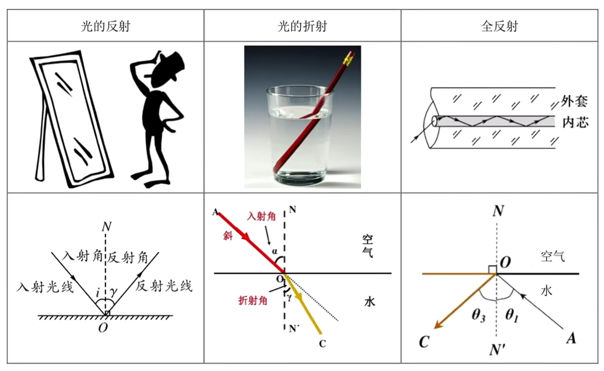{ width="100%" }

以上为光的最简单三个性质，我们在初中就已经涉及，后面我们会分别展开讲解。

- 费马原理：光（或任何波）在两点间传播时，所走的路径是所需光程（或时间）为极值（通常是极小值）的路径。

- 光路可逆原理：在干涉与绕射可忽略的情况中，入射光线与反射光线的可交换性。就是在一条光径的终点，发出反方向的光，此光可沿原路径回到原来的起点。

### 光的反射

### 光的折射

折射率也称折射系数，视光学称屈光指数、屈光率，表示光在真空中的传播速度是在这种介质中传播速度的多少倍：

$$
n=\dfrac{c}{v}
$$

这个比值即为这种介质的**绝对折射率**，简称折射率，其中 $v$ 为光在这种介质中的传播速度。自然界中的物质折射率通常是大于 $1$ 的（人造材料可以实现折射率对于一定频率范围内的电磁波是负值，称为负折射率超材料）。

| 介质 | 真空 | 空气 | 水 | 水晶 | 玻璃 |
| :-: | :-: | :-: | :-: | :-: | :-: |
| 折射率 | $1$ | $1.00028$ | $1.33$ | $1.55$ | $1.5$ |

我们知道光从一个介质进入另一个介质，其频率不会发生改变，这意味着

$$
n=\dfrac{c}{v}=\dfrac{\lambda_0}{\lambda}
$$

其中 $\lambda$ 是真空中光的波长，$\lambda$ 是这束光进入这种介质后的波长，也就是说

$$
\lambda=\dfrac{\lambda_0}{n}
$$

我们知道，光从空气射到水面时，一部分光射进水中，另一部分光返回到空气中。

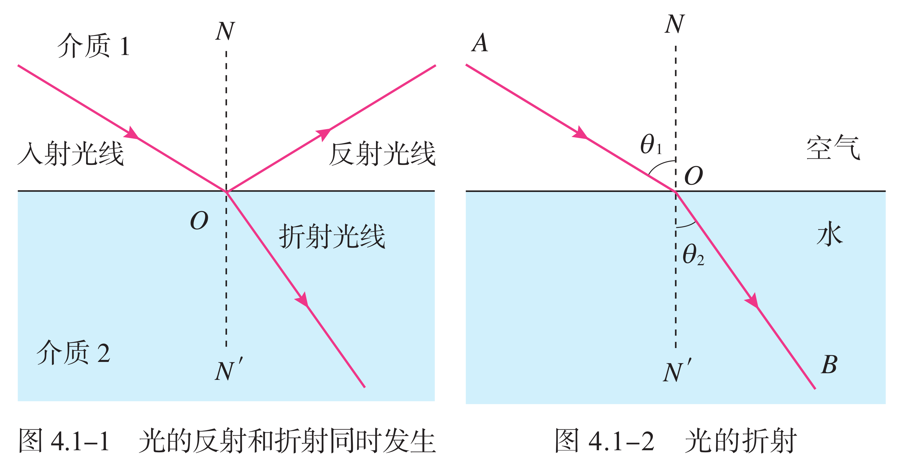{ width="80%" }

入射光线与法线的夹角 $\theta_1$ 称为入射角，折射光线与法线的夹角 $\theta_2$ 称为折射角，折射定律（斯涅尔定律）指出：

$$
\dfrac{\sin\theta_1}{\sin\theta_2}=\dfrac{v_1}{v_2}=\dfrac{\lambda_1}{\lambda_1}=n_{12}
$$

式中 $n_{12}$ 是**相对折射率**，它与入射角、折射角的大小无关，只与两种介质的性质有关，

$$
n_{12}=\dfrac{n_2}{n_1}=\dfrac{\sin\theta_1}{\sin\theta_2}
$$

据此我们可以得出斯涅耳定律的最标准形式：

$$
n_1\sin\theta_1=n_2\sin\theta_2
$$

虽然折射率影响波长，但它取决于频率（颜色和能量），即折射率是波长的函数。

- 紫光频率高、波长短、折射率大，红光频率低、波长长、折射率小。

- 太阳光在斜射入棱镜后，紫光偏转角度大、红光偏转角度小，弯曲角度的差异使白光分裂成其组成颜色，这种现象称为光的色散。

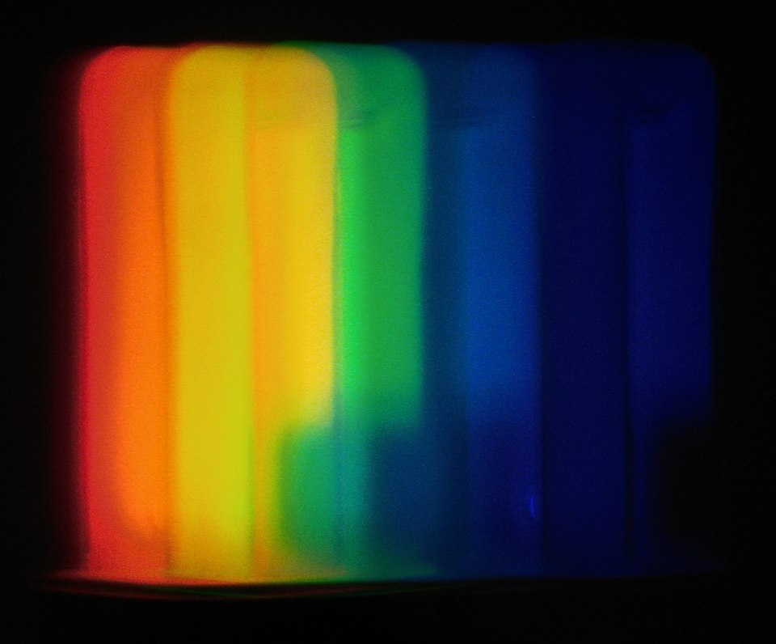{ width="80%" }

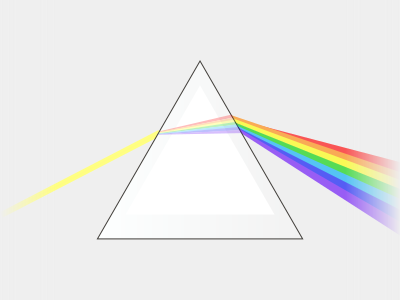{ width="80%" }

如果一束光从一种介质射入另一种介质，我们称折射率较小的为光疏介质，折射率较大的为光密介质。存在一个临界角 $\theta_c$ 使得入射角大于这个角，则不会发生折射现象，所有关系全部向内面反射，称为**全反射**或全内反射。

{ width="100%" }

在不考虑耗损的情况下：

$$
\sin\theta_c=\dfrac{n_2}{n_1}
$$

其中 $n_2$ 是光疏介质的折射率，$n_1$ 是光密介质的折射率，当光疏介质是真空或者空气时

$$
\sin\theta_c=\dfrac{1}{n_1}
$$

全反射的现象：沸水中的气泡看起来比较亮，光纤、内窥镜。

玻璃棱镜的截面为等腰直角三角形，当光从图中所示的方向射入玻璃时，由于光的方向与玻璃面垂直，光线不发生偏折。但在玻璃内部，光射向玻璃与空气的界面时，入射角大于临界角，发生全反射。与平面镜相比，它的反射率高，几乎可达 100%。

  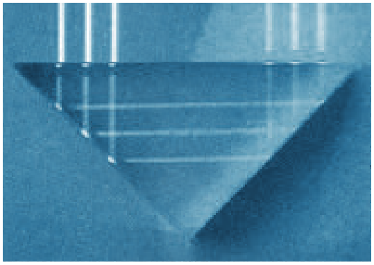{ width="90%" }

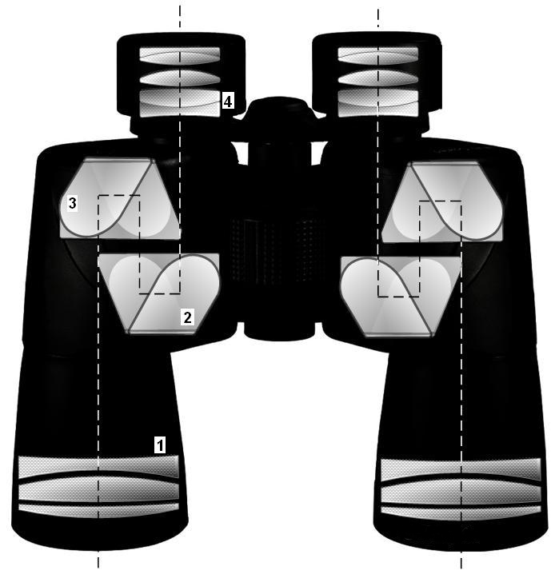{ width="90%" }

注意：当发生全反射时，电磁场并非完全没有从光密介质进入光疏介质，虽然没有能量以**行进波**的形式透射进入光疏介质，但在界面处的光疏介质一侧，仍然会形成一个特殊的、非传播的电磁场，称为**倏逝波**。利用倏逝波的原理，可以制成分光器。

### 实验：测定玻璃的折射率

实验信息：

- 实验目的：测定玻璃的折射率

- 实验器材：一块两面平行的玻璃砖，白纸，木板，大头针（4 枚），量角器（或圆规、三角板），刻度尺

实验步骤：

1. 把白纸铺在木板上。

2. 在白纸上画一直线 $aa'$ 作为界面，过 $aa'$ 上的一点 $O$ 画出界面的法线 $NN'$，并画一条线段 $AO$ 作为入射光线。

3. 把长方形玻璃砖放在白纸上，并使其长边与 $aa'$ 重合，再用直尺画出玻璃的另一边 $bb'$。

    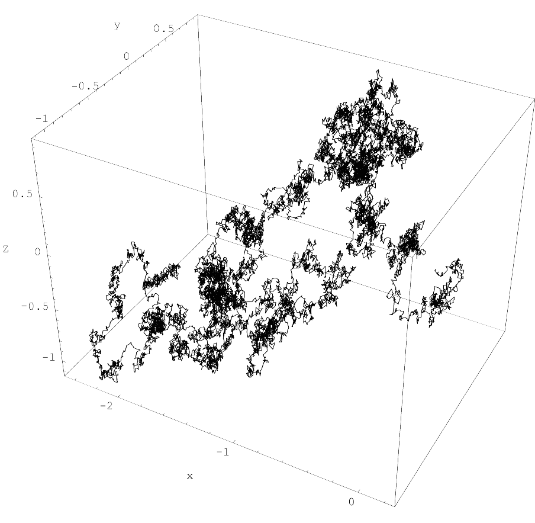{ width="40%" align=right }

4. 在线段 $AO$ 上竖直地插上两枚大头针 $P_1$、$P_2$。

5. 从玻璃砖 $bb'$ 一侧透过玻璃砖观察大头针 $P_1$、$P_2$ 的像，调整视线方向直到 $P_1$ 的像被 $P_2$ 的像挡住。再在 $bb'$ 一侧插上大头针 $P_3$、$P_4$，使 $P_3$ 能挡住 $P_1$、$P_2$ 的像，$P_4$ 能挡住 $P_1$、$P_2$ 的像及 $P_3$ 本身。

6. 移去玻璃砖，在拔掉 $P_1$、$P_2$、$P_3$、$P_4$ 的同时分别记下它们的位置，过 $P_3$、$P_4$ 作直线 $O'B$ 交 $bb'$ 于 $O'$。连接 $O$、$O'$，$OO'$ 就是玻璃砖内折射光线的方向。$\angle AON$ 为入射角，$\angle O'ON'$ 为折射角。

7. 用量角器量出入射角和折射角的度数。查出它们的正弦值，并把这些数据填入记录表格里。

8. 用上述方法分别求出入射角是 $15^\circ$、$30^\circ$、$45^\circ$、$60^\circ$ 和 $75^\circ$ 时的折射角，查出入射角和折射角的正弦值，记录在表格里。

9. 算出不同入射角时 $\dfrac{\sin i}{\sin r}$ 的值，比较一下，看它们是否接近一个常数。求出几次实验测得的 $\dfrac{\sin i}{\sin r}$ 的平均值，这就是这块玻璃的折射率。

**光的折射定律**：折射光线、入射光线、法线在同一平面内，折射光线、入射光线在法线两侧。入射角的正弦跟折射角的正弦成正比，如果用 $n$ 来表示这个比例常数，就有：

$$
\dfrac{\sin\theta_1}{\sin\theta_2}=n
$$

**注意事项**：

1. 轻拿轻放玻璃砖，手只能接触玻璃砖的毛面或棱，不能触摸光洁的光学面。严禁把玻璃砖当直尺用。

2. 实验过程中，玻璃砖在纸面上的位置不可移动。

3. 插针 $P_1$ 与 $P_2$、$P_3$ 与 $P_4$ 的间距要适当大些，以减小确定光路方向时出现的误差。

4. 实验时入射角不能太小（接近零度），否则会使测量误差加大；也不能太大（接近 $90^\circ$），否则会不易观察到 $P_1$、$P_2$ 的像。

5. 本实验中如果采用的不是两面平行玻璃砖，如采用三棱镜，半圆形玻璃砖等，只是出射光和入射光不平行，但一样能测出折射率。

### 几何问题

“看起来”问题：人总是认为光源在沿着进入眼的光线的反向延长线上，而两只眼睛所确定的射线的交点为人认为光源的位置。

- 海市蜃楼与沙漠蜃景：折射与全反射。

    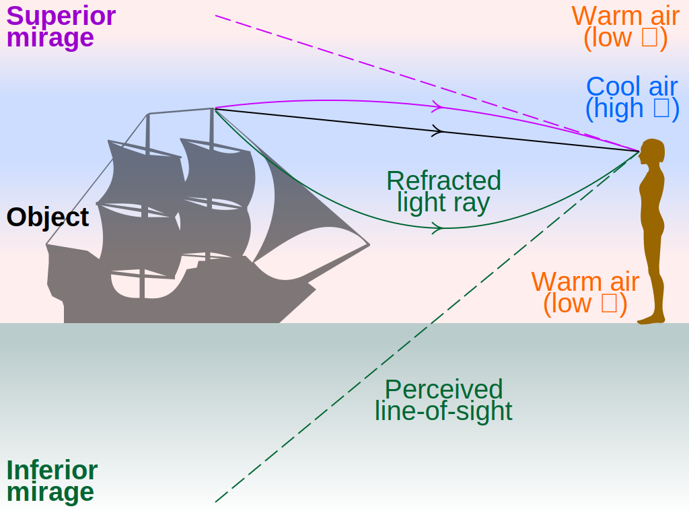{ width="60%" }

- 水井中多青蛙看天：洞口更小、视野更大。

    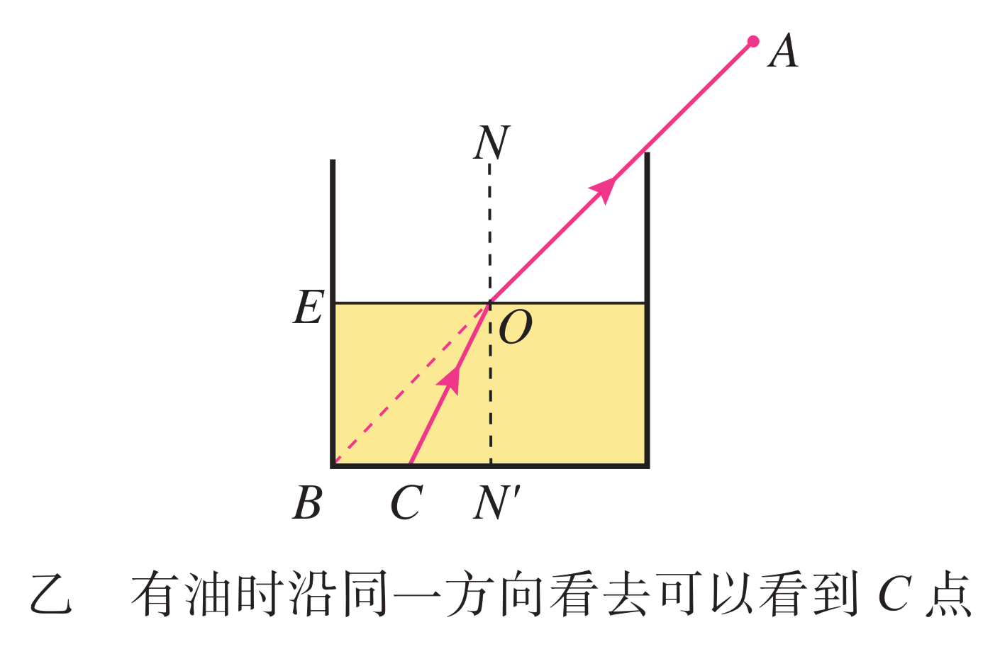{ width="50%" }

- 日出时人开太阳：人看到地平线以下的太阳。

- 岸上的人看鱼：**人看到的鱼偏浅**。

    ---

    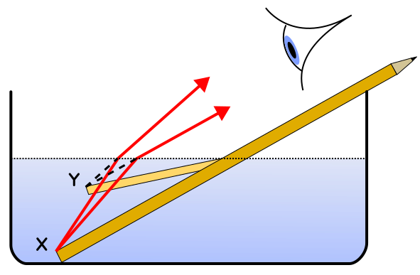

- 水中的鱼看人：**鱼看到的人偏高**。

    ---

    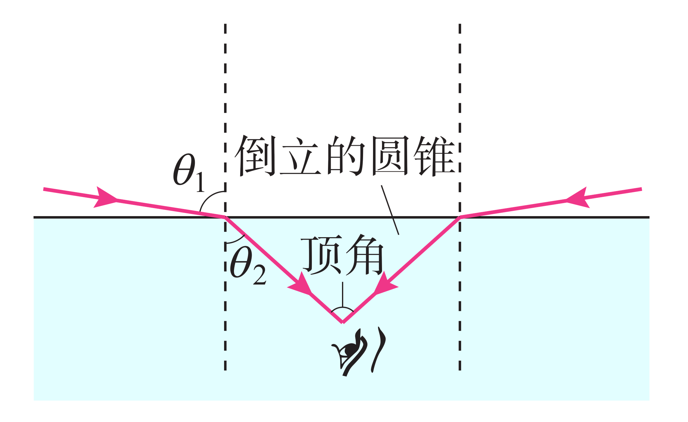

视深问题：垂直向一深度为 $h$ 的水池看去，水的视深是多少？已知水的折射率 $n$。

虽然我们是垂直向下看的，但是因为我们用两个眼睛确定距离，且两个眼睛有一定距离，因此不妨取一极小角，用来计算视深。

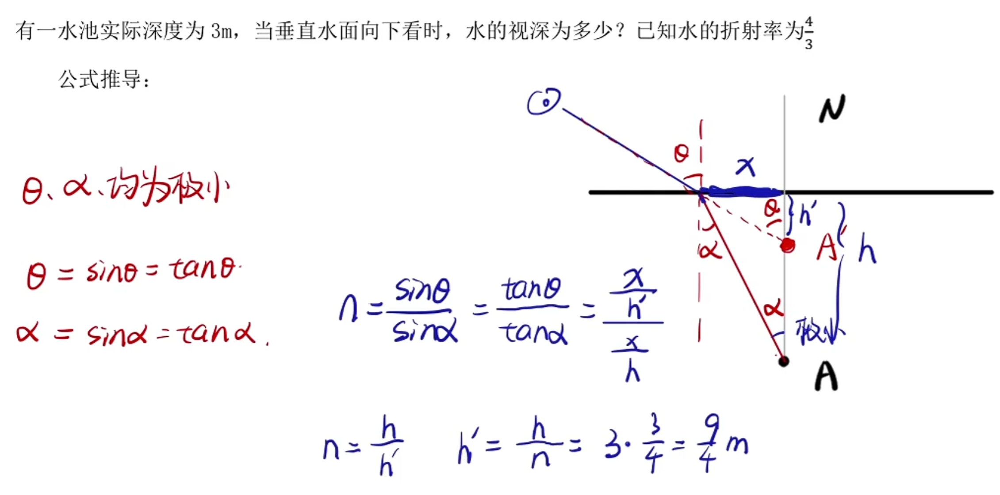

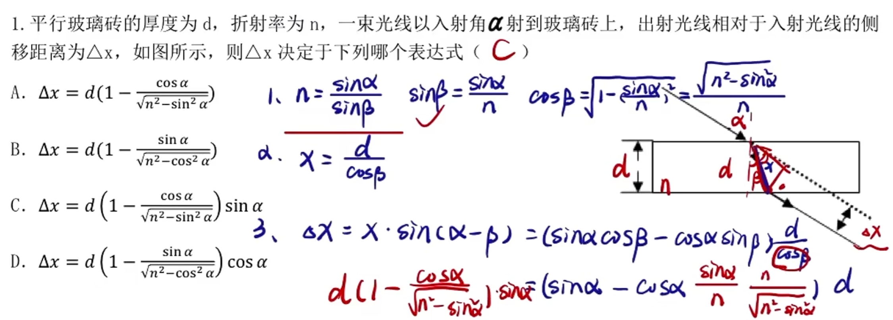

## 波动光学

> 固执于光的旧有理论的人们，最好是从它自身的原理出发，提出实验的说明。并且，如果他的这种努力失败的话，他应该承认这些事实。——托马斯·杨

### 相位突变与半波损失

在高中物理的机械波章节，我们通常只关注波的传播特征；但在**波动光学**（尤其是干涉）的压轴题或竞赛题中，反射时的**相位突变**是一个极易踩坑的“隐形杀手”。

所谓**半波损失**，是指波从**波疏介质**（波速大、折射率小）射向**波密介质**（波速小、折射率大）时，反射波的相位会发生 $\pi$ 的突变。这相当于波在反射点“平白无故”多跑（或少跑）了 **半个波长 ($\lambda/2$)**，因此被称为半波损失。

为了直观理解这个抽象的光学概念，我们可以借用机械波的**“固定端反射”**模型：

- **固定端反射（波疏 $\to$ 波密）**：
    想象一根轻绳的一端被固定在墙上（墙壁质量极大，可视为“无限波密”）。当你抖动绳子产生一个向上的脉冲传向墙壁时，你会发现**反射回来的脉冲是向下的**。
    - **物理本质**：界面处的位移必须为 0（波节），入射波和反射波必须在此处相互抵消，因此相位必须相反（差 $\pi$）。
    - **结论**：发生半波损失。

- **自由端反射（波密 $\to$ 波疏）**：
    如果绳子的一端套在一个光滑的竖直杆上（可以自由上下移动）。当你传来一个向上的脉冲，**反射回来的脉冲依然是向下的**？不，是**向上的**！
    - **物理本质**：界面处没有束缚，反射波不倒相。
    - **结论**：不发生半波损失。

> **应试口诀：疏撞密，反半波；密撞疏，相不变。**
>
> - $n_{\text{入}} < n_{\text{折}}$ （光撞墙）：有 $\lambda/2$ 损失。
> - $n_{\text{入}} > n_{\text{折}}$ （光撞气）：无损失。

菲涅耳公式的数学证明——为什么会出现“相位突变”？本质上是边界条件的数学必然。在大学物理中，我们通过**菲涅耳公式**（Fresnel Equations）来定量描述这一过程。

对于垂直入射的光波，反射波的电矢量振幅 $A'$ 与入射波振幅 $A$ 的比值（反射系数 $r$）为：

$$
r = \frac{A'}{A} = \frac{n_1 - n_2}{n_1 + n_2}
$$

其中 $n_1$ 为入射介质折射率，$n_2$ 为折射介质折射率。

- **当 $n_1 < n_2$（波疏 $\to$ 波密）**：
    分母恒正，分子 $n_1 - n_2 < 0$，导致 $r$ 为**负值**。
    在数学上，振幅变负等价于相位增加了 $\pi$（因为 $\sin(\omega t + \pi) = -\sin(\omega t)$）。**这就是半波损失的数学本质。**

- **当 $n_1 > n_2$（波密 $\to$ 波疏）**：
    分子 $n_1 - n_2 > 0$，$r$ 为**正值**，波形不倒相，无半波损失。

核心考点：薄膜干涉中的光程差。在处理**薄膜干涉**（如肥皂泡、增透膜、劈尖干涉）问题时，必须先判断反射面是否发生了半波损失，再列**光程差**公式。

$$
\delta = 2nd + \Delta \lambda
$$

- 若上下表面**都**发生（或都**不**发生）半波损失：$\Delta \lambda = 0$。
- 若**只有一个**表面发生半波损失：$\Delta \lambda = \pm \dfrac{\lambda}{2}$。

**典型案例**：空气中的肥皂膜（折射率 $n \approx 1.33$）。

- **前表面**（空气 $\to$ 膜，光疏 $\to$ 光密）：有半波损失。
- **后表面**（膜 $\to$ 空气，光密 $\to$ 光疏）：无半波损失。
- **结论**：此时的光程差公式必须加 $\lambda/2$。这就是为什么极薄的肥皂膜（$d \to 0$）在反射光下看起来是**暗**的（光程差 $\lambda/2$，干涉相消）。

### 光的干涉

干涉是两列或两列以上的波在空间中重叠时发生叠加，从而形成新波形的现象。相干性，或同调性，是指两列波相互干扰的可能性。来自同一单光源的两单色光束总是相互干扰（干涉）。若两个波源的频率和波形相同，则它们是相干的或同调的。相干的的两波物理源并不严格限单色的，它们可能是部分相干的。但来自不同物理源的光束，则互为非相干的。

激光的产生机理是受激辐射，它决定了激光本身即具有非常优秀的相干性。对于来自不同光源的两列光波，如果这两列波的振幅和相位涨落都是彼此不相关的，称这两列波不具有相干性。相反，如果两列光波来自同一点光源，则这两列波的涨落一般是彼此相关的，此时这两列波是完全相干的。

例如采用分束器将一束单色光束分成两束后，再让它们在空间中的某个区域内重叠，将会发现在重叠区域内的光强并不是均匀分布的：其明暗程度随其在空间中位置的不同而变化，最亮的地方超过了原先两束光的光强之和，而最暗的地方光强有可能为零，这种光强的重新分布被称作“干涉条纹”。在历史上，干涉现象及其相关实验是证明光的波动性的重要依据 ，但光的这种干涉性质直到十九世纪初才逐渐被人们发现，主要原因是相干光源的不易获得。

现在人们知道，两束电磁波的干涉是彼此振动的电场强度矢量叠加的结果，而由于光的波粒二象性，光的干涉也是光子自身的几率幅叠加的结果。不仅是电磁波，粒子也可以发送干涉（例如一个一个发射的电子、光子等，我们在量子力学中提到过，其实波和粒子几乎没什么区别）。

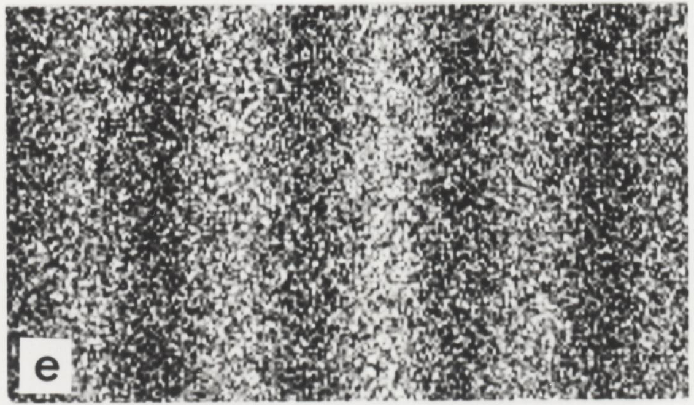{ width="60%" }

两列波在同一介质中传播发生重叠时，重叠范围内介质的质点同时受到两个波的作用。若波的振幅不大，此时重叠范围内介质质点的振动位移等于各别波动所造成位移的矢量和，这称为波的叠加原理。若两波的波峰（或波谷）同时抵达同一地点，称两波在该点同相，干涉波会产生最大的振幅，称为相长干涉（建设性干涉）；若两波之一的波峰与另一波的波谷同时抵达同一地点，称两波在该点反相，干涉波会产生最小的振幅，称为相消干涉（摧毁性干涉）。

如要从单一的不相干波源产生相干的两列波，可以采用两种不同的方法：一种称为波前分割法，即对于几何尺寸足够小的波源，让它产生的波列通过并排放置的狭缝，根据惠更斯－菲涅耳原理，这些在波前上产生的子波是彼此相干的；另一种成为波幅分割法，用半透射、半反射的半镀银镜，可以将光波一分为二，制造出透射波与反射波。如此产生的反射波和透射波来自于同一波源，并具有很高的相干性，这种方法对于扩展波源同样适用。

**薄膜干涉**：来自两个面的反射光相互叠加，发生干涉，也称薄膜干涉。通常而言，不同位置的液膜，厚度不同，因此在膜上不同的位置，来自前后两个面的反射光（即图中的实线和虚线波形代表的两列光）的路程差不同。在某些位置，这两列波叠加后相互加强，出现了亮条纹；在另一些位置，叠加后相互削弱，出现了暗条纹。

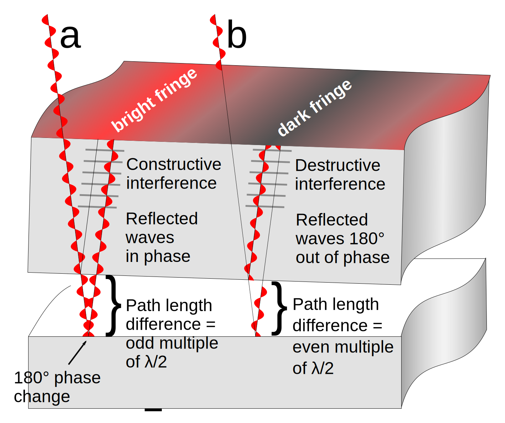{ width="80%" }

如果用另一种颜色的光做这个实验，由于光的波长不同，导致从肥皂膜的前后两面反射的光将在别的位置相互加强，所以，从肥皂膜上看到的亮条纹的位置也会不同。薄膜上不同颜色的光的条纹的明暗位置不同，相互交错，所以，看上去会有彩色条纹。

薄膜干涉在技术上有很多应用。例如，可以在光学元件的表面镀一层特定厚度的薄膜，增加光的透射或者反射，还可以利用薄膜干涉的原理对镜面或其他精密的光学平面的平滑度进行检测。

> **大学物理视野：相干长度与波列**
>
> 为什么两个普通灯泡不能发生干涉？为什么肥皂膜太厚也看不到干涉？这里涉及一个关键概念——**波列（Wave train）**。
>
> 原子发光是断续的，每一次发光只能持续约 $10^{-8}$ 秒，发出一列有限长度的波，称为波列。
>
> - **相干长度**：波列的长度就是相干长度。如果两列波的光程差超过了波列的长度，头尾不接，自然无法发生稳定的干涉。
> - 这解释了为什么**激光**（相干长度极长，可达几十公里）是做干涉实验的完美光源，而普通光源只能通过“分振幅”法（如薄膜干涉）在极薄的膜上产生干涉。

### 杨氏双缝实验

杨氏双缝干涉实验是物理学史上最著名的实验之一，它完美地证明了光的波动性。当用单个光子（或电子）重复此实验时，长时间累积后依然会出现干涉条纹！这意味着单个粒子同时通过了两条缝并与自己发生了干涉。

单缝夫琅禾费衍射：当平行光通过一个窄缝后，在远处的屏幕上会形成明暗相间的条纹。中央明纹最宽最亮，两侧条纹亮度迅速减弱。

用双缝干涉实验测量光的波长，原理公式：

$$
\dfrac{d}{\ell}=\dfrac{\lambda}{\Delta x}
$$

其中，$d$ 为双缝间距，$\ell$ 为挡板与屏幕之间的举例，而 $\Delta x$ 表示的是相邻的两个两条纹，取其中间部位的间距。我们用**测量头**来测量这个 $\Delta x$ 因为它通常是较小的，难以像 $d,\ell$ 一样用刻度尺测量。测量头的读数类似于螺旋测微器，我们不再进行讲解。

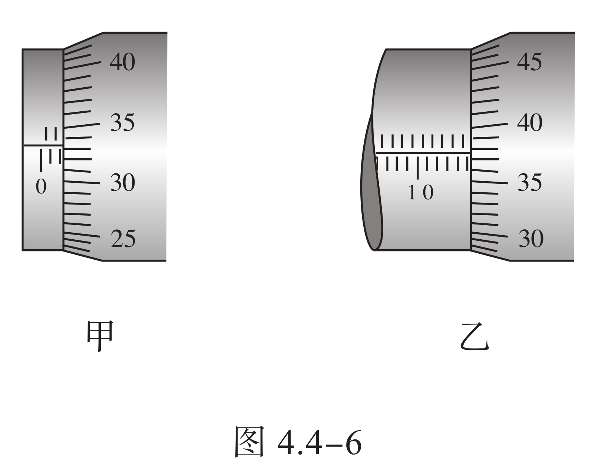{ width="40%" }

在实际操作中，为了演示更加清晰，我们基本上都是使用红色光进行实验，因为 $\Delta x$ 与 $\lambda$ 是成正比的，红光波长比较长，因此间距较大，更容易读出。类似的，我们知道，光的波长一般是比较小的，为了让 $\Delta x$ 较大，我们通常会让 $\ell$ 稍大一些（或者说 $d$ 通常是很小的），这样读数会更加方便。

1. 按如图所示安装仪器。
2. 实验前先取下双缝和单缝，打开光源，调节光源的高度和角度，使光源中心、单缝中心、双缝中心在遮光筒的中心轴线上。
3. 放好双缝和单缝，双缝和单缝平行，尽量使缝的中点位于遮光筒的轴线上。
4. 在光源和单缝之间加装滤光片，通过目镜观察单色光的干涉条纹，同时调节手轮，使分划板的中心刻线对齐某一亮（或暗）条纹的中心，记下此时手轮的读数，然后继续转动手轮使分划板移动，直到分划板的中心刻线对齐另一亮（或暗）条纹中心，再次记下此时手轮读数和移过分划板中心刻线的条纹数。
5. 将两次手轮的读数相减，求出亮（或暗）条纹间的距离，算出条纹间距，然后求出此单色光的波长。
6. 换用不用颜色的滤光片，重复步骤 3、4，并求出相应的波长。

注意事项：光源、单缝、双缝、光屏共轴，以确保光线垂直于双缝平面，从而产生清晰的干涉条纹。单缝和双缝平行（通常竖直），以确保干涉条纹是竖直的且间距均匀。

通过实验，我们发现两个相邻的条纹之间的距离是相同的，在不考虑原理的情况下，我们可以认为上面的公式能体现这一点。然而，实际上我们一般是通过原理分析出公式的，现在我们尝试根据原理来简单推导一下。

### 光的衍射

在挡板上安装一个宽度可调的狭缝，缝后放一个光屏。用单色平行光照射狭缝，我们看到，当缝比较宽时，光沿着直线通过狭缝，在屏上产生一条与缝宽相当的亮条纹。

但是，当缝调到很窄时，尽管亮条纹的亮度有所降低，但是宽度反而增大了，而且还出现了明暗相间的条纹（图 4.5-1）。这表明，光没有沿直线传播，它绕过了缝的边缘，传播到了相当宽的地方。这就是**光的衍射**现象。

图 4.5-2 是在一次实验中拍摄的屏上亮条纹的照片，上图的狭缝较窄，衍射后在屏上产生的中央亮条纹较宽。如果用**白光**做上述实验，得到的条纹是**彩色**的（图 4.5-3）。这是因为白光中包含了各种颜色的光，衍射时不同色光的亮条纹的位置不同，于是各种色光就区分开了。

在单缝衍射和圆孔衍射的照片中，都有一些亮条纹和暗条纹。这是由于来自单缝或圆孔上不同位置的光，通过缝或孔之后叠加时加强或者削弱的结果。各种不同形状的障碍物都能使光发生衍射，致使影的轮廓模糊不清，出现明暗相间的条纹（图 4.5-4）。

光在没有障碍物的均匀介质中是沿直线传播的。对衍射现象的研究表明：

- 在障碍物或狭缝的尺寸很大时，衍射现象不明显，也可以近似认为光是沿直线传播的。
- 但是，**在障碍物或狭缝的尺寸足够小的时候**，衍射现象十分明显，这时就不能说光沿直线传播了。

#### 衍射光栅

单缝衍射的条纹比较宽，而且距离中央亮条纹较远的条纹，亮度也很低。因此，无论从测量的精确度，还是从可分辨的程度上说，单缝衍射都不能达到实用要求。

实验表明，如果增加狭缝的个数，衍射条纹的宽度将变窄，亮度将增加。光学仪器中用的**衍射光栅**就是据此制成的。它是由许多等宽的狭缝等距离地排列起来形成的光学元件。

- **透射光栅**：在一块很平的玻璃上刻出一系列等距的平行刻痕，刻痕产生漫反射而不太透光，未刻的部分相当于透光的狭缝（图 4.5-5）。
- **反射光栅**：如果在高反射率的金属上刻痕，就可以做成反射光栅。

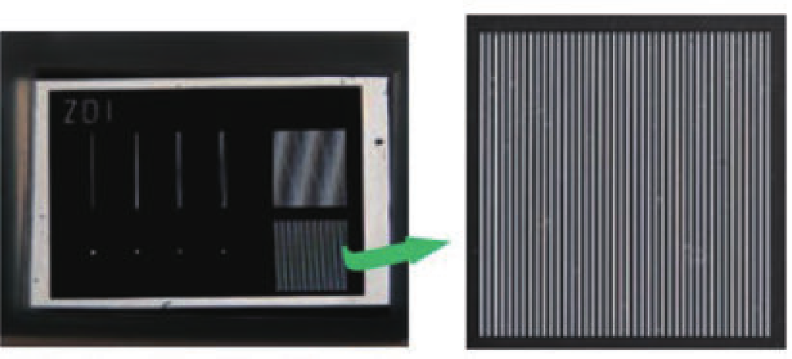{ width="80%" }

> **科学史话：泊松亮斑**
>
> 1818 年，法国的巴黎科学院为了鼓励对衍射问题的研究，悬赏征集这方面的论文。一位年轻的物理学家**菲涅耳**在论文中按照波动说深入研究了光的衍射。
>
> 当时的另一位法国科学家**泊松**是光的波动说的反对者，他按照菲涅耳的理论计算了光在圆盘后的影的问题，发现对于一定的波长、在适当的距离上，影的中心会出现一个亮斑！泊松认为这是荒谬可笑的，并认为这样就驳倒了光的波动说。
>
> 但是，就在竞赛的关键时刻，评委**阿拉果**在实验中观察到了这个亮斑（图 4.5-6），这样，泊松的计算反而支持了光的波动说。后人为了纪念这个有意义的事件，把这个亮斑称为**泊松亮斑**，也称为阿拉果亮斑。

#### X 射线衍射与 DNA 双螺旋

**X 射线衍射**：晶体中原子的排列是规则的，原子间距与 X 射线波长接近。这使得 X 射线照射在晶体上会发生明显的衍射现象。衍射图样中斑点的强度和位置包含着有关晶体的大量信息。因此，人们可以利用 X 射线衍射探测晶体的结构（图 4.5-7）。

- 1912 年，德国科学家**劳厄**观测到了这种衍射现象。在当时人们并不确信 X 射线是一种电磁波，也不确信晶体是由周期性排列的原子组成的。劳厄的观测，同时证实了 X 射线的波动性和晶体内部的原子点阵结构，被爱因斯坦誉为物理学中最美的实验。劳厄因此获得了 1914 年诺贝尔物理学奖。
- 之后，英国物理学家**布拉格父子**深入研究了利用 X 射线测量和分析晶体结构的方法。他们的工作奠定了这一技术的实验和理论基础，为此，布拉格父子共同获得了 1915 年诺贝尔物理学奖。

今天，X 射线衍射已经成为人们探测晶体和大分子结构的标准技术手段之一，被广泛应用于物理学和生物学等许多领域。这一技术所带来的最重要成果之一，就是 **DNA 双螺旋结构**的发现。

- 在 20 世纪 50 年代，生物学家已经知道 DNA 是细胞中携带遗传信息的物质，下一步就是要搞清楚 DNA 的结构，从而确定它的化学作用。
- 从 1951 年开始，英国物理学家**威尔金斯**和**富兰克林**研究了 DNA 对 X 射线的衍射，获得了一系列 DNA 纤维的 X 射线衍射图样（图 4.5-8）。
- 英国卡文迪什实验室（主任为小布拉格）的美国生物学家**沃森**和英国生物学家**克里克**则根据这些数据提出了 DNA 的双螺旋结构模型。这是生物学史上划时代的事件。它宣告了分子生物学的诞生，标志着生物学已经进入了分子水平。沃森、克里克和威尔金斯因此获得了 1962 年的诺贝尔生理学或医学奖。

> **思维拓展：巴比涅原理（互补原理）**
>
> 这是一个非常优美的原理，它指出：如果两个屏是“互补”的（例如一个黑屏上挖个圆孔，和一个透明玻璃上画个黑圆盘），那么在屏幕上（除中心点外），它们的衍射图样是**完全相同**的！
>
> 这揭示了光的波动性中“无”与“有”的辩证关系。当你看到圆孔衍射出明暗条纹时，这同时也决定了圆盘衍射的命运。这在不需要复杂积分的情况下，帮助我们定性理解了为什么圆盘（泊松亮斑）和圆孔都能产生类似的同心环条纹。

### 光的偏振

#### 机械波的偏振

波分为纵波和横波。

- **纵波**：各点的振动方向总与波的传播方向在同一直线上。
- **横波**：各点的振动方向总与波的传播方向垂直。

不同的横波，即使传播方向相同，振动方向也可能是不同的。这个现象称为**“偏振现象”**。例如，一列沿水平方向传播的横波，既可能沿上下方向振动，也可能沿左右方向振动，还可能沿其他“斜”的方向振动。横波的振动方向称为“偏振方向”。

让绳穿过一块带有狭缝的木板，先后将狭缝与振动方向平行放置及与振动方向垂直放置（图 4.6-1）。对于图 4.6-1 甲的情形，绳上的横波能穿过狭缝，而对于图 4.6-1 乙的情形则不能。如图 4.6-2，在一条弹簧上传播的纵波，无论狭缝的取向如何，波都能穿过。

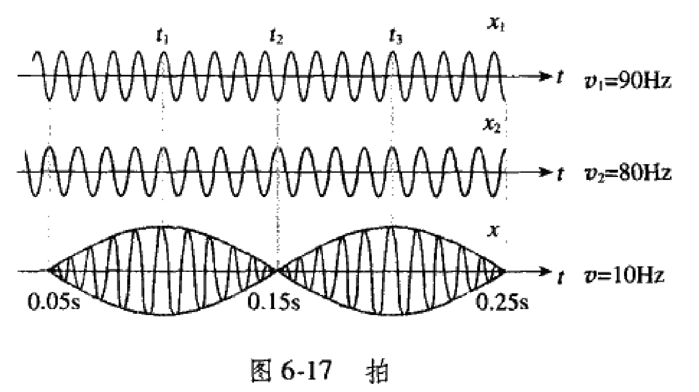{ width="100%" }

#### 光的偏振现象

光的干涉和衍射现象说明光具有波动性。光是横波还是纵波呢？研究表明，**光是一种横波**。

我们可以用与上述实验类似的方法来研究光的偏振。为此，利用“偏振片”代替图 4.6-1 中带有狭缝的木板来做光学实验。

- 偏振片由特定的材料制成，每个偏振片都有一个特定的方向，沿着这个方向振动的光波（光是传播中的电磁场，即电磁波，**“电磁波的振动方向”指的是其中电场的方向**）能顺利通过偏振片。
- 偏振方向与这个方向垂直的光不能通过，这个方向叫作**“透振方向”**。偏振片对光波的作用就像图 4.6-1 中的狭缝对于机械波的作用一样。

事实上，只要光的振动方向不与透振方向垂直，它都可以不同程度地通过偏振片，不过强度要比振动方向与透振方向平行的光弱一些。

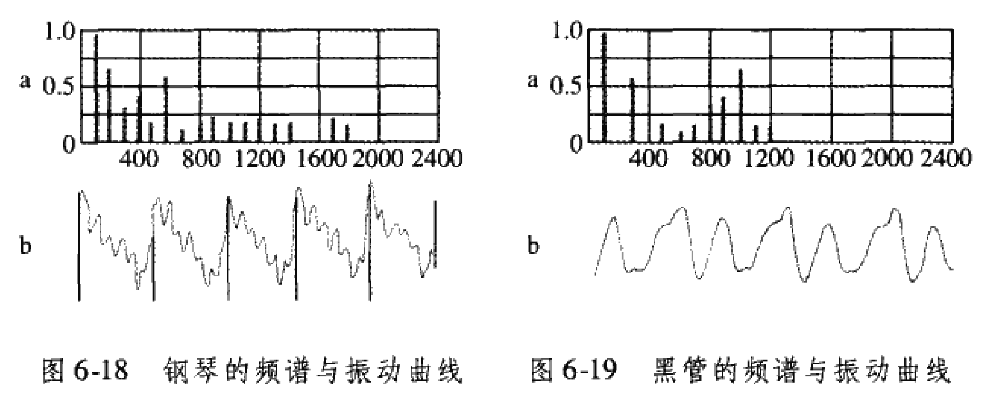{ width="80%" }

#### 自然光与偏振光

实际上，太阳以及日光灯、发光二极管等普通光源发出的光，包含着在垂直于传播方向上沿一切方向振动的光，而且沿着各个方向振动的光波的强度都相同。这种光是**“自然光”**（图 4.6-4）。

- **偏振光的产生**：自然光在通过偏振片 $P$ 时，只有振动方向与偏振片的透振方向一致的光波才能顺利通过。也就是说，通过偏振片 $P$ 的光波，在垂直于传播方向的平面上，沿着某个特定的方向振动。这种光叫作**偏振光**（polarized light）。
- **偏振片的检偏**：通过偏振片 $P$ 的偏振光照射到偏振片 $Q$ 时：
    - 如果两个偏振片的透振方向**平行**，那么，通过 $P$ 的偏振光的振动方向与偏振片 $Q$ 的透振方向一致，可以透過 $Q$（图 4.6-3 乙）；
    - 如果两个偏振片的透振方向**垂直**，那么，偏振光的振动方向跟偏振片 $Q$ 的透振方向垂直，不能透过 $Q$（图 4.6-3 丙）。

偏振光并不罕见。除了从太阳、白炽灯等光源直接发出的光以外，我们通常看到的绝大部分光，都是不同程度的偏振光。**自然光在玻璃、水面、木质桌面等表面反射时，反射光和折射光都是偏振光**（图 4.6-5），入射角变化时偏振的程度也有变化。

#### 偏振现象的应用

光的偏振现象有很多应用。例如，摄影师在拍摄池中的游鱼、玻璃橱窗里的陈列物时，由于水面和玻璃表面的反射光的干扰，景象会不清楚。如果在照相机镜头前装一片**偏振滤光片**，转动滤光片，让它的透振方向与水面和玻璃表面的反射光的偏振方向垂直，就可以减弱反射光而使水下和玻璃后的景象清晰。

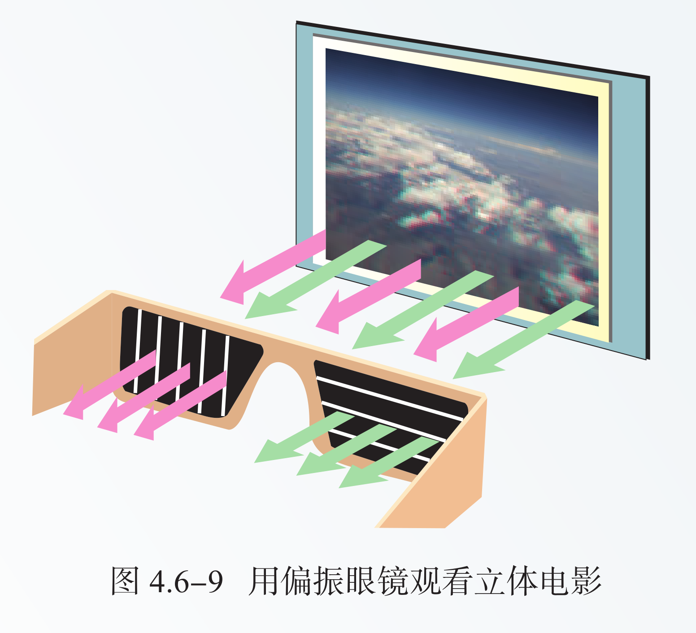{ width="60%" }

> **科学漫步：立体电影和偏振光**
>
> 观看立体电影（3D 电影）时，观众戴的眼镜就是一对透振方向互相垂直的偏振片。这个原理要从人眼看物的立体感说起。
>
> **立体感原理**：人的两只眼睛同时观察物体，不但能扩大视野，而且能判断物体的远近，产生立体感。这是由于两眼位置不同，观察物体的角度略有差异，左眼看到物体的左侧面较多，右眼看到物体的右侧面较多。这两个像经过大脑综合以后就能区分物体的前后、远近。
>
> **电影实现**：
>
> 1. **拍摄**：可以用两个镜头如人眼那样从两个不同方向同步拍摄景物的像（或者用一架摄影机交替拍摄），制成电影胶片。
> 2. **放映**：放映机前安装偏振片。左右两架放映机前的偏振片的透振方向互相垂直，因而产生的两束偏振光的偏振方向也互相垂直。
> 3. **观看**：这两束偏振光投射到银幕上再反射到观众那里，偏振方向不变。观众戴的偏振眼镜，左镜片的透振方向与左画面的偏振方向一致，右镜片与右画面一致。这样，每只眼睛只看到相应的偏振光图像，从而产生立体感。

> **进阶知识：布儒斯特角与双折射**
>
> - **布儒斯特角（Brewster's Angle）**：当光以特定角度从一种介质射向另一种介质时，反射光会变成**完全偏振光**，且偏振方向垂直于入射面。此时反射光线与折射光线互相垂直 ($\tan \theta_B = n_2/n_1$)。摄影师旋转偏振镜消除水面反光，找的就是这个角度。
> - **双折射（Birefringence）**：光不仅仅是简单的折射。在方解石等晶体中，一束光进去，会变成两束光出来（寻常光 o 光和非寻常光 e 光）。这就像光进入了一个“各向异性”的迷宫，不同方向的“路况”（折射率）是不同的，展示了晶体结构的复杂美。

### 激光及其应用

光是从物质的原子中发射出来的。原子获得能量以后处于不稳定状态，它会以光的形式把能量发射出去。

普通的光源（如白炽灯），灯丝中某个原子在什么时刻发光、在哪个方向偏振，完全是随机的，发出的光传播方向各异，频率也不一定相同，这导致不同原子发出的光没有确定的相位差。因此，普通光源发出的自然光是许多频率、相位、偏振以及传播方向各不相同的光的杂乱无章的混合。这导致两个独立的普通光源发出的光不会发生干涉。

1960 年，美国物理学家**梅曼**率先在实验室中制造出了频率相同、相位差恒定、振动方向一致的光波，这就是**激光**（laser）。迄今人类已经制造了各种类型的激光器，比如气体激光器、半导体激光器、染料激光器、宝石激光器等等。

激光的诞生是一件大事，它使得人类获得了极其理想的、自然界中不存在的光源。

#### 激光的特点与应用

1. **相干性好**
    - **特点**：激光具有确定的频率、相位差和振动方向。
    - **应用**：光纤通信。激光能像无线电波那样被调制，用来传递信息。光纤通信就是激光和光导纤维相结合的产物。今天，每时每刻都有无数激光信号承载着海量的信息在海底光缆中传输，将全世界连接成一个整体。同时，激光也使双缝干涉和衍射实验更容易完成。

2. **平行度好**
    - **特点**：传播很远的距离后仍能保持一定的强度，方向性极佳。
    - **应用**：**精确测距**。对准目标发出一个极短的激光脉冲，测量发射脉冲与收到反射回波的时间间隔，就可以求出目标的距离。利用激光测量地球到月亮的距离（大约为 $\pu{38 万 km}$），准确度可以达到厘米级别。此外，还用于房屋装修测距、武器目标指引等。

3. **亮度高**
    - **特点**：可以在很小的空间和很短的时间内集中很大的能量。
    - **应用**：**切割与医疗**。强大的激光束会聚起来照射到物体上，可以使物体的被照部分在不到千分之一秒的时间内产生几千万度的高温。
        - 工业上：利用激光束来切割、焊接，以及在很硬的材料上打孔。
        - 医学上：用激光做“光刀”来切开皮肤、切除肿瘤，还可以用激光“焊接”剥落的视网膜。

4. **科学研究工具**
    - 以激光为光源，深入研究原子、分子和固体材料的光谱。
    - 利用激光高精度光钟，实现对频率和时间的超高精度测量。
    - 现在人们还在努力实现更多种类的激光，比如频率远高于可见光、与 X 射线接近的超高频率激光。

> **前沿应用：全息照相（Holography）**
>
> 普通照相只记录了光的**强度**（振幅），丢掉了**相位**信息，所以是平面的。而全息照相利用**干涉**原理，同时记录了光的振幅和相位。
>
> - **原理**：用一束激光（参考光）和从物体反射回来的激光（物光）发生干涉，把复杂的干涉条纹记录在底片上。
> - **再现**：用激光照射这张底片，衍射出的光波能重现物体的立体影像，甚至当你打碎全息底片，每一块碎片都能还原出完整的（虽然模糊）物体像，因为每一个点都记录了整体的信息。

### 多普勒效应

电磁波也是一种波，具有波动性的光也会出现多普勒效应，但与机械波不同的是，电磁波的传播不需要介质，因此是电磁波的波源如光源和接收器的相对速度 $V$ 决定接收频率。
法国物理学家斐索独立地对来自恒星的波长偏移做了解释，指出了利用这种效应测量恒星相对速度的办法。光波频率的变化使人感觉到是颜色的变化。

当光源和接收器在同一直线上运动时，将有

$$
f'=\sqrt{\dfrac{1\pm V/c}{1\mp V/c}}\cdot f
$$

式中 $c$ 为波在真空中的波速（光速），可见，如果恒星远离我们而去，则光的谱线就向红光方向移动，称为红移；如果恒星朝向我们运动，光的谱线就向紫光方向移动，称为蓝移。

天文学家将来自其他星体的一些元素的光谱与地球上相同元素的光谱比较，发现星体光谱几乎都发生红移，这表明星体都正在远离地球向四面八方飞去，即宇宙处在膨胀之中。这一观察结果也是“大爆炸”宇宙学理论的重要证据之一。

横向多普勒效应：这是纯粹的相对论效应。即使波源的运动方向与观测方向垂直，也会因为**时间膨胀**效应而观测到频率降低。经典理论中不存在横向多普勒效应。
