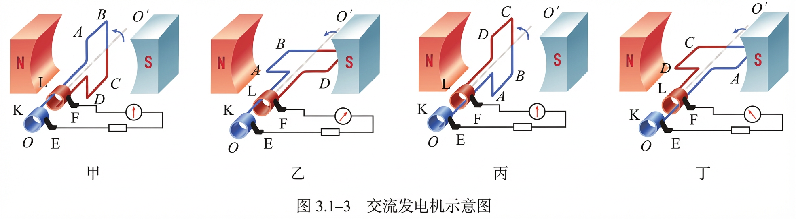
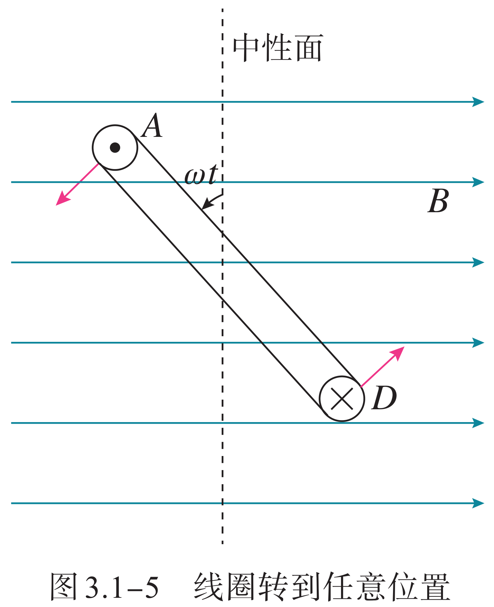
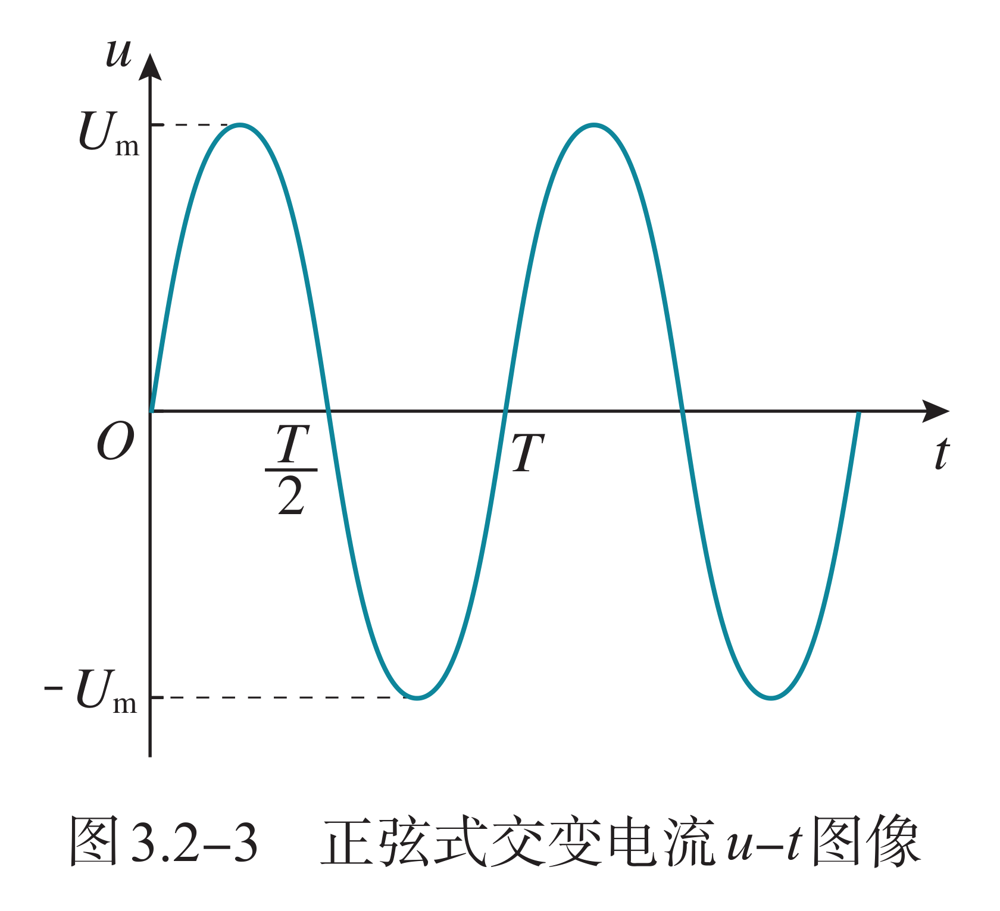
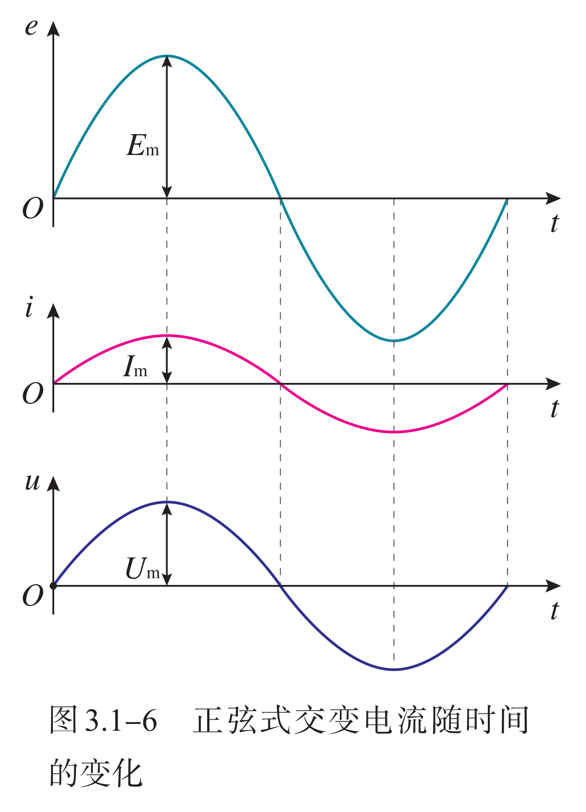
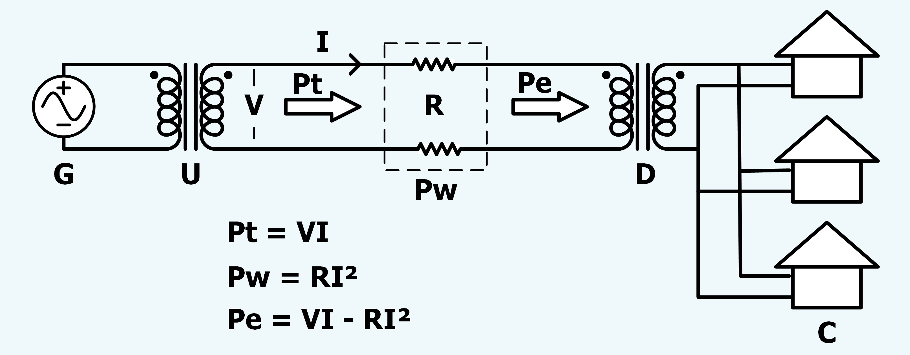

# 交流与电磁波

## 交变电流

我们已经学过了恒定电流。在恒定电流的电路中，电源的电动势不随时间变化，电路中的电流、电压也不随时间变化。

{ width="100%" }

很多用电器中的电流、电压（方向）也随时间做周期性变化，这样的电流叫作交变电流（Alternating Current，AC），简称交流。**方向**不随时间变化的电流称为直流（Direct Current，DC）。干电池供给的电流方向不随时间变化，所以属于直流。交变电流经过电子电路的处理，也能变成直流。

注意：基尔霍夫定律定律适用于直流电路和较低频率的交流电路中，而对高频率的交流电路有较大误差。

各类交流电波形具有共同特征：

1. 具有固定的频率（或作周期性的变化）。

2. 任何非简谐式的交流电都可以分解为一系列不同频率的简谐成分（傅立叶级数）。所以最基本、最重要的是简谐交流电。

3. 不同频率的简谐波在线性电路中可以各自独立、互不干扰地传播，因此可以单独地加以处理。

推迟效应：电磁波以光速传播，当其一个周期内传播距离 $\lambda$ 与电路的尺寸 $\ell$ 相当时，电路中的电流和电荷分布发生变化就不能及时地影响到整个电路，因而电路中不同部分电磁场以及电流、电荷的变化将按距离的远近落后不同的位相。如果交流电路的尺度 $\ell$ 远小于 $\lambda$，或电源发射的电磁波的频率 $f$ 比较低，或电磁变化传遍整个电路所用时间远小于交流电的周期，那么每一时刻电磁场的分布与同一时刻场源的分布关系和稳恒电路一样，只不过它们同步地缓慢变。我国采用的频率为 $\pu{50Hz}$ 的交流电，似稳条件为 $\ell \ll\pu{6 000 km}$，所以一个大城市内电路上电流的分布可以看成是似稳的。

### 交流电描述

如图所示是一种非常简化的交流发电机模型，发电机产生的电流，大小和方向都在不断地变化，是一种交变电流。

{ width="100%" }

可以根据右手定则来判断线圈运动时，因导体棒运动时，垂直于磁感线方向的速度不断变化，所以感应电动势也在变化，感应电流同时发生变化。下面是一个经典教材中的配图：

{ width="100%" }

设 $t=0$ 时线圈刚好转到中性面位置，此时导线 $AB$ 的速度方向刚好与磁感线平行，因此感应电动势为 $0$。不妨设线圈旋转的角速度为 $\omega$，$AB$ 和 $CD$ 的长度为 $\ell$，$AD$ 和 $BC$ 的长度为 $d$，则经过时间 $t$，线框转过的角度 $\theta=\omega t$，如图所示。

{ width="85%" }

| | 中性面 | 中性面垂面 |
| :-: | :-: | :-: |
| 线圈位置 | 线框与磁感线垂直 | 线框与磁感线平行
| 磁通量 | 最大 | $0$ |
| 磁通量变化率 | $0$ | 最大 |
| 电流 | $0$ | 最大 |
| 电动势 | $0$ | 最大 |
| 电流特征 | 方向改变 | 达到极值 |

线框旋转过程中，在与磁感线垂直的方向上速度为：

$$
v_{\perp}=\dfrac{1}{2}\omega d\sin\omega t
$$

根据法拉第电磁感应定律，线框上产生的感应电动势：

$$
\varepsilon=2BLv_{\perp}=\omega B\ell d\sin\omega t=\omega BS\sin\omega t
$$

其中，$S$ 表示线框的面积。不妨设

$$
\boxed{E_m=\omega BS}
$$

可知线框的电动势是随时间按正弦函数规律变化的，为

$$
\boxed{\varepsilon=E_m\sin\omega t}
$$

式中 $E_m$ 是常数，表示电动势可能达到的最大值，如果线圈匝数为 $N$，多一个系数 $N$ 即可。我们可以推导，当负载为电灯等纯电阻用电器时，负载两端的电压 $u$、流过的电流 $i$，也按正弦规律变化，即：

$$
\begin{aligned}
u&=U_m\sin\omega t\\
i&=I_m\sin\omega t
\end{aligned}
$$

这种按正弦规律变化的交变电流叫作正弦式交变电流，简称正弦式电流。正弦式电流是最简单、最基本的交变电流。电力系统中应用的大多是正弦式电流，在电子技术中也常遇到其他形式的交流。

### 交流电性质

{ width="40%" align=right }

交变电流与振动和波一样具有周期性。与任何周期性过程一样，交变电流也可以用周期或频率表示其变化的快慢。我们把交变电流完成一次周期性变化所需的时间，叫作它的周期，通常用 $T$ 表示，单位是秒。

交变电流完成周期性变化的次数与所用时间之比叫作它的频率，数值等于交变电流在单位时间内完成周期性变化的次数。频率通常用 $f$ 表示，单位是 $\pu{Hz}$ 赫兹。

$$
T=\dfrac{1}{f}=\dfrac{2\pi}{\omega}
$$

根据三角函数的知识可以知道，在

$$
\begin{cases}
\varepsilon&=E_m\sin\omega t\\
u&=U_m\sin\omega t\\
i&=I_m\sin\omega t
\end{cases}
$$

的表达式中，$\omega$ 等于频率的 $2\pi$ 倍，即：

$$
\omega=2\pi f
$$

交变电流的峰值 $I_m$ 或 $U_m$ 可以用来表示电流的强弱或电压的高低。例如，把电容器接在交流电路中，就需要知道电压的峰值。电容器所能承受的电压要高于交流电压的峰值，否则电容器就可能被击穿。

让交变电流与恒定电流分别通过大小相同的电阻，如果在交变电流的一个周期内它们产生的热量相等，而这个恒定电流的电流与电压分别为 $I,U$，我们就把 $I,U$ 叫作这一交变电流的有效值。从有效值的定义看，“有效”指的是电流热效应的等效。

理论计算表明，正弦式交变电流的有效值 $I,U$ 与峰值 $I_m,U_m$ 之间有如下关系：

$$
\boxed{\begin{cases}
I_m&=\sqrt{2}I\\
U_m&=\sqrt{2}U
\end{cases}}
$$

如果题目给的是类似矩形波的形式，具体的，在前半周期电流为 $I_a$，后半周期电流为 $I_b$，则我们取一个周期，它是一个极短的时间 $T$，列出：

$$
I_{有效}^2RT=I_a^2R\dfrac{T}{2}+I_b^2R\dfrac{T}{2}
$$

假设 $R$ 不变，并把 $T$ 约去，我们得到：

$$
I_{有效}=\sqrt{\dfrac{I_a^2+I_b^2}{2}}
$$

即电流的平方平均数。其实对于任意周期为 $T$ 的函数 $v(t)$，其有效值为：

$$
U_{有效}^2=\dfrac{1}{T}\int_0^T[u(t)]^2\d t
$$

例如对于简单的正弦电压 $u=U_m\sin\omega t$，我们根据一些简单的微积分法则：

$$
\begin{aligned}
U_{有效}&=\dfrac{1}{T}\int_0^T[U_m\sin\omega t]^2\d t\\
&=\dfrac{U_m^2}{T}\int_0^T\sin^2(\omega t)\d t
\end{aligned}
$$

我们根据三角恒等式的幂简约公式中的：

$$
\sin^2\alpha=\dfrac{1-\cos2\alpha}{2}
$$

容易发现 $\sin^2(\omega t)$ 的周期是 $2T$，可以直接积掉，也就是说：

$$
\int_0^T\sin^2(\omega t)\d t=\int_0^T\dfrac{1-\cos2\omega t}{2}\d t=\dfrac{T}{2}
$$

那么：

$$
U_{有效}=\dfrac{U_m^2}{T}\cdot\dfrac{T}{2}=\dfrac{U_m^2}{2}
$$

也就是我们前面给出的 $\sqrt{2}$ 的系数的由来了，这个方法可以用来求一般性的有效值。

交流电的功率的概念比直流功率的概念丰富得多，我们会在电磁震荡中进行一个简单的描述：

1. 交流电是随时间作用作周期性变化的，因此就有瞬时功率和平均功率的概念；

2. 由于电感和电容上的电流与电压之间存在相位差以及与电阻之间的相位差，因而有了视在功率与有功功率（即平均功率）的分别；而电路的功率因素则是衡量电路的有功功率在视在功率中所占的比重的一个重要参数。

调节电路中的阻抗，可以提高电路的功率因素，从而提高有功功率的比重。

### 变压器概述

变压器（Transformer）是由闭合铁芯和绕在铁芯上的两个线圈组成的。一个线圈与交流电源连接，叫作**原线圈**，也叫**初级线圈**；另一个线圈与负载连接，叫作**副线圈**，也叫**次级线圈**。

{ width="80%" }
/// caption
自耦变压器：自耦变压器的原副线圈共用一个线圈。
///

互感现象是变压器工作的基础。电流通过原线圈时在铁芯中激发磁场，由于电流的大小、方向在不断变化，铁芯中的磁场也在不断变化。变化的磁场在副线圈中产生感应电动势，所以尽管两个线圈之间没有导线相连，副线圈也能够输出电流。变压器能输送电能是利用了电磁感应。在原线圈上由变化的电流激发了一个变化的磁场，即电场的能量转变成磁场的能量；通过铁芯使这个变化的磁场几乎全部穿过了副线圈，于是在副线圈上产生了感应电流，磁场的能量转化成了电场的能量。

其实，变压器线圈通过电流时会发热；铁芯在交变磁场的作用下也会发热；此外，交变电流产生的磁场也不可能完全局限在铁芯内。所有这些，使得变压器工作时有能量损耗。但有些变压器的能量损耗很小，可以忽略。我们把没有能量损耗的变压器叫作**理想变压器**。理想变压器也是一个理想化模型。

在输入的交流电压一定时，原线圈、副线圈取不同的匝数，副线圈输出的电压也不一样，变压器由此得名。实验和理论分析都表明，理想变压器原、副线圈的电压之比，等于原、副线圈的匝数之比，即：

$$
\dfrac{U_1}{U_2}=\dfrac{n_1}{n_2}
$$

可以理解为根据：

$$
U_x=n_x\dfrac{\Delta\Phi}{\Delta t}
$$

在一定时间内，理想情况下不漏磁通，两个线圈 $\Delta\Phi$ 相等，则 $U$ 正比于 $n$。从能量上考虑，假设能量不损失，那么也就是说功率是不变的。这就关联到交流电的电功率问题，我们不能说电压变大了，所以能量就增多了，可以理解为升压就会降流 $U_0I_0=U_1I_1$ 即 $n_0I_0=n_1I_1$，总功率是严格不增的。

- 变压器的输出功率与输入功率之比，叫作**变压器的效率**。实际上变压器的效率都是比较高的，特别是电力设备中的巨大变压器，在满负荷工作时效率可以超过 $95\%$。所以，在精度要求不太高的情况下可应用上式来计算。如果副线圈的电压比原线圈的电压低，这样的变压器叫作**降压变压器**，反之则叫**升压变压器**。

- 变压器工作时，高压线圈匝数多而通过的电流小，可用较细的导线绕制；低压线圈匝数少而通过的电流大，应当用较粗的导线绕制。这也是判定高压线圈和低压线圈的一种方法。实际应用中需要改变交流电压的情况是很多的。大型发电机发出的交流电压为几万伏，而远距离输电却需要几十万伏以上的电压。各种用电设备所需的电压也不相同。

输入输出电压、电流、功率大小之间的制约关系： 

1. 输入电压由电源决定。

2. 输出电压由输入电压和匝数比决定。

3. 输入功率由输出功率决定

4. 输出电流由输出电压和负载决定。

5. 输入电流由输出电流和匝数比决定。

也就是说，输入的仅仅是电压，如果负载增加了，那么输入电流也会随之增加。可以将整个变压器和负载看成一整个用电器，变压器只是一个转换器。

互感器：常用于高压交流电的测量。

{ width="90%" }

在电工中常用的电流钩表（因为形状是可以开合的钩表，因此也被称为钳形电流表）就是运用的电流互感器（现在更多的使用霍尔原理，更加灵敏），其不向上面右图那样接入电路，而是直接将铁环包在导线上：

{ width="80%" }

日字形变压器：对于这种形式的变压器，题目一般会给出磁通量在两条路径上的分摊百分比，根据比值计算即可。

{ width="60%" }

在此基础之上，我们引入等效匝数的概念，例如假设右侧磁通量等分，那么定义次级线圈的有效匝数为次级线圈匝数的一半，然后当做正常的变压器来做即可。

$$
\dfrac{E_1}{E_2}=\dfrac{n_1\cdot\Delta\Phi_1}{n_2\cdot\Delta\Phi_2}
$$

多副线圈的变压器：也可以用连比来体现，而能量上，我们用 $UI$ 表示功率，用 $n$ 替换掉，就可以得到一个等式：

$$
n_0I_0=n_1I_1+n_2I_2
$$

与电阻串联的变压器问题：一般来说很难直接通过一个式子算出来，如果给出输入条件，容易发现只有电压和电流两个未知量，而且初级线圈和次级线圈的物理量是存在固定关系的，因此不妨列出等式组，解方程求出。

变压器的等效电阻：我们知道，变压器及其副线圈所在电路可以等效为原线圈所在电路中的一个用电器。我们不妨令副电路只有一个电阻 $R_0$，我们考虑求出变压器在原电路中的等效电阻 $R$，根据变压器不改变功率，

$$
\dfrac{U_1^2}{R}=\dfrac{U_2^2}{R_0}
$$

因此就可以用匝数比表示等效电阻：

$$
R=\dfrac{U_1^2}{U_2^2}R_0=\dfrac{n_1^2}{n_2^2}R_0
$$

同时，在理想变压器、纯电阻电路的动态变化（只问变化趋势）问题中，我们不妨利用归算到原线圈法，即假设变压器是 $n_1=n_2$ 的，这样就可以直接把变压器去掉，当成直接连起来分析。

我们在稳恒电流中还提到了 $\Delta U/\Delta I$ 的问题，我们利用了等效电阻、等效电源的思想，在变压器这一部分，依然有类似的性质。

- 如果问的是原电路中的，则将其他所有用电器抽象化，将变压器看作用电器，显然是可以用 $\Delta U/\Delta I=R_{不变}$ 或者 $R_{其他}$ 的，不过这里的 $R_{其他}$ 要算上变压器的等效电阻。

- 如果问的是副电路中的，则将原电路除了变压器部分看作一个等效电源，注意到这个电源对所求 $\Delta U/\Delta I$ 有一个 $k^2=n_1^2/n_2^2$ 的贡献，因此答案应该是 $R/k^2$，其中 $R$ 依然是 $R_{不变}$ 或 $R_{其他}$，而 $R_{其他}$ 此处应该计算等效电源的等效内阻 $r_{等效}=R_{原}/k^2$。

如果限制在这个理论中，我们无法直接对直流电（DC）进行变压的，但是现在的技术完全可以做到这一点，主要的方式是：先变为高频交流电（AC），进行通入高频交流电变压器，因为频率很高，这个变压器的体积可以比传统工频（50Hz）变压器做得非常小，然后再经过二极管整流和电容滤波，重新变成平滑的直流电。对于一些低要求的环境，可以直接将直流电切断通过电感和电容来降压，用电感产生的反向高电压通过二极管升压，或者直接把几个电容并联起来充电，然后通过开关迅速把它们串联起来放电。

### 感抗与容抗

电源的电动势随时间作周期性变化，使得电路中的电压、电流也随时间作周期性变化。如果电路中的电动势、电压、电流随时间作简谐变化，该电路就叫简谐交流电路或正弦交流电路，简称正弦电路。在高中我们通常只考虑正弦电路。

我们知道，电阻会对直流起阻碍作用，同样，电阻对交流也会起阻碍作用，此时我们引入阻抗的概念。

{ width="100%" }

**阻抗**：正弦交流电路中，二端网络端钮上电压的最大值（或有效值）与电流的最大值（或有效值）之比叫作该二端网络的阻抗，用字母 $Z$ 表示，单位是 $\Omega$。电容的电抗叫容抗，用 $X_c$ 表示，电感的电抗叫感抗，用 $X_L$ 表示。

- **电感器对交变电流有阻碍作用**。

    把带铁芯的线圈 $L$ 与小灯泡串联起来，先把它们接到直流电源上（甲图），再把它们接到交流电源上（乙图）。取直流电源的电压与交流电压的有效值相等，可以发现，接交流电源时灯泡要暗一些。
    
    在直流电路中，当电压一定时，影响电流强弱的只是电阻；但把线圈接入交流电路时，除了线圈自身的电阻对交变电流有阻碍作用外，还有由于线圈与交变电流之间的电磁感应作用所引起的阻碍作用，这叫**感抗**。实验和理论分析都表明，线圈的自感越大、交流的频率越高，线圈的感抗就越大。扼流圈是电工技术和电子技术常用的元件，它利用了电感器对交流的阻碍作用，分为高频扼流圈和低频扼流圈。

    **感抗**：电感的电抗，自感电动势试图抵消电流的变化。由于交流的大小和方向时刻在做周期性变化，因此当一个线圈接入交流时，就会产生电磁感应现象。

    不妨设通过电感的电流为正弦波

    $$
    i=I_m\sin\omega t
    $$

    根据电磁感应定律和自感的定义，电感两端的电压与电流的变化率成正比：

    $$
    v_L=L\dfrac{\d i}{\d t}=\omega LI_m\cos\omega t
    $$

    也就是说，电压的峰值

    $$
    V_m=\omega LI_m
    $$

    是余弦函数的系数，类比欧姆定律，这里的比例系数即为感抗：

    $$
    X_L=\dfrac{V_m}{I_m}=\omega L=2\pi fL
    $$

    这意味着，在电感中，电压超前电流 $90^\circ$。

- **交变电流能够通过电容器**，但是会受到阻碍作用。

    把小灯泡和电容器串联起来，先把它们接到直流电源上（甲图），再把它们接到交流电源上（乙图），分别观察小灯泡的发光情况。直流不能通过电容器，所以接直流电源的灯泡不亮。当电容器接到交流电源两端时，由于电容器两端电压不断变化而不断地充电和放电，电路中就有了充、放电的电流，表现为交流“通过”了电容器。

    如果把电容器从电路中取下来，使小灯泡直接与交流电源相连，小灯泡要比有电容器时更亮。这表明，电容器对交流有阻碍作用。电容器对交流阻碍作用的大小叫**容抗**。实验和理论分析都表明，电容器的电容越大，交流的频率越高，电容器对交流的阻碍作用就越小，即容抗越小。

    **容抗**：电容的电抗，电容器本身是断路，但是在交流电中，电容器通过不断充电和放电来表现出电流的流通。
    
    我们不妨设电容器两端的电压为正弦波

    $$
    v=V_m\sin\omega t
    $$

    根据电容的定义式，所以积累的电荷量为：

    $$
    q=Cv=CV_m\sin\omega t
    $$

    而电流是电荷随时间的变化率，即对电荷量求导：

    $$
    i=\dfrac{\d q}{\d t}=CV_m\omega\cos\omega t
    $$

    也就是说，电流的峰值

    $$
    I_m=\omega CV_m
    $$

    是余弦函数的系数，我们要找的是阻抗就是：

    $$
    X_c=\dfrac{V_m}{I_m}=\dfrac{1}{\omega C}=\dfrac{1}{2\pi fC}
    $$

    这意味着在电容中，电流超前电压 $90^\circ$，或者说电压滞后电流 $90^\circ$。

在大学物理和电路分析中，为了同时处理“大小”和“相位”，我们引入复数。此时通常用 $j$ 来表示复数单位，与变化的电流 $i$ 加以区分，我们在这里不讨论。

在此之后，交流电路有很多复杂的类型，很多也是大学物理才会接触到的，尤其是涉及到相位等等，会较为复杂，甚至需要使用微积分来解决。我们下面只进行一个简单的概念处理，更多内容可以自行学习。

### 电能的输送

用导线把电源和用电设备连起来，就可以输送电能了，这是电能的一个突出优点。输送电能的基本要求是可靠、保质、经济。

- 可靠，是指保证供电线路可靠地工作，故障少。

- 保质，就是保证电能的质量——电压和频率稳定。

    各种用电设备都是按照一定的工作电压设计的，电压过低或过高，用电器都不能正常工作，甚至会造成损坏。使用交流的用电器还要求频率稳定。

- 经济，则是指输电线路建造和运行的费用低，电能损耗少。

以下重点讨论怎样在输电过程中减少电能的损耗。

设输电电流为 $I$，输电线的电阻为 $r$，则输电线上的功率损失为：

$$
P_{损失}=I^2r=\paren{\dfrac{P_{输出}}{U_{输电}}}^2r
$$

由此可知，有两个途径能减少输电损耗。

- 一个途径是减小输电线的电阻。在输电距离一定的情况下，为了减小电阻，应当选用电阻率小的金属材料，例如铜、铝来制造输电线。此外，还要尽可能增加导线的横截面积。但是，导线横截面积的增加是有一定限度的。过粗的导线会耗费太多的金属材料，而且输电线太重、太粗也给铺设工程带来困难。

- 另一个途径是减小输电导线中的电流。远距离输电时，为了降低输电线路中的损耗，就要减小输电电流；为了减小输电电流，同时又要保证向用户提供一定的电功率，就要提高输电电压。现代远距离输电的电压都很高。目前我国远距离输电采用的电压有 $\pu{110 kV}$、$\pu{220 kV}$、$\pu{330 kV}$，输电干线已经采用 $\pu{500 kV}$ 和 $\pu{750 kV}$ 的超高压，西北电网甚至达到 $\pu{1 100 kV}$ 的特高压。输电电压也不是越高越好。电压越高，对输电线路绝缘性能的要求就越高，线路修建费用就会增多。输电电压越高，变压器上的电压也越高，对变压器的要求也相应提高。实际输送电能时，要综合考虑各种因素，如输送功率的大小、距离的远近、技术和经济要求等，依照不同情况选择合适的输电电压。

中国大陆的电路，有效电压为 $\pu{220V}$，峰值电压约为 $\pu{311V}$，频率为 $\pu{50Hz}$。欧洲大部分国家使用 $\pu{50Hz}$，墨西哥、美国、加拿大使用 $\pu{60Hz}$，由于历史原因，日本的电力系统包含了 $\pu{50Hz}$ 和 $\pu{60Hz}$，两者以高压直流联网。

{ width="40%" align=right }

发电厂里的交流发电机的构造复杂得多，但是基本组成部分也是两部分，即产生感应电动势的线圈（通常叫作电枢）和产生磁场的磁体。电枢转动，磁极不动的发电机，叫作旋转电枢式发电机。如果磁极转动，电枢不动，线圈中同样会产生感应电动势，这种发电机叫作旋转磁极式发电机。不论哪种发电机，转动的部分都叫转子，不动的部分都叫定子。

旋转电枢式发电机转子产生的电流，必须经过裸露的滑环和电刷引到外电路，如果电压很高，可能发生火花放电，滑环和电刷很快会烧坏。同时，转动的电枢无法做得很大，线圈匝数也不可能很多，所以产生的感应电动势也不能很高。这种发电机输出的电压一般不超过 $\pu{500 V}$。旋转磁极式发电机克服了上述缺点，能够产生几千伏到几万伏的电压，输出功率可达几百兆瓦。所以，大多数发电机是旋转磁极式的。

发电机的转子由蒸汽轮机、水轮机等带动。蒸汽轮机、水轮机等将机械能传递给发电机，发电机将机械能转化为电能，输送给外电路。发电机的转子由蒸汽轮机、水轮机等带动。蒸汽轮机、水轮机等将机械能传递给发电机，发电机将机械能转化为电能，输送给外电路。

电网供电：实际上发电厂供给的电能要经过多次转换才能到达用户，这里只讨论原理，所以把问题简化了。

{ width="100%" }

一般发电机组输出的电压在 $\pu{10 kV}$ 左右，不符合远距离送电的要求。因此，要用升压变压器升压到几百千伏后再向远距离送电。到达数百千米甚至数千千米之外的用电区之后，先在“一次高压变电站”降到 $\pu{100 kV}$ 左右，在更接近用户的地点再由“二次高压变电站”降到 $\pu{10 kV}$ 左右。然后，一部分电能送往用电量大的工业用户，另一部分经过低压
变电站降到 $\pu{220 V}$ 或 $\pu{380 V}$，送给其他用户。

现在世界各国都不采用一个电厂与一批用户的“一对一”的供电方式，而是通过网状的输电线、变电站，将许多电厂和广大用户连接起来，形成全国性或地区性的输电网络，这就是电网。采用电网送电，是输电技术的重要发展。这样可以在一次能源产地使用大容量的发电机组，降低一次能源的运输成本，获得最大的经济效益。电网可以减小断电的风险，调剂不同地区电力供需的平衡。使用电网，可以根据火电、水电、核电的特点，合理地调度电力，这就使得电气化社会的主要能源——电力的供应更加可靠，质量更高。

{ width="60%" }
/// caption
三相交流发电机接成星形电源连接星形负载
///

在历史上，随着电力系统的扩大，交流输电遇到了一些技术困难。例如，用甲、乙两台交流发电机给同一条线路供电，如果某时刻甲达到正的最大值时，乙恰好是负的最大值，它们发的在电路里恰好互相抵消，不仅电路无法工作，甚至会烧毁设备。要使电路正常工作，给同一条线路供电的所有发电机都必须同步运行，即同时达到正的最大值，同时达到负的最大值。现代的供电系统是把许多电站连成一个电网，要使电网内的许多发电机同步运行，技术上有一定困难。此外，长距离输电时，线路上的电容、电感对交变电流的影响也不能忽略，有时它们引起的电能损耗甚至大于导线电阻引起的电能损耗。

为了减少感抗和容抗，在输电这个环节可以使用直流，但发电机产生的仍是交流，用户使用的也主要是交流。为此，在送电端有专用的“整流”设备将交流变换为直流，在用户端也有专用的“逆变”设备再将直流变换为交流。制造大功率的整流和逆变设备在过去有很大困难，目前已经逐步解决，因此直流输电技术已得到应用。

## 电磁振荡

### 多普勒效应

电磁波也是一种波，具有波动性的光也会出现多普勒效应，但与机械波不同的是，电磁波的传播不需要介质，因此是电磁波的波源如光源和接收器的相对速度 $V$ 决定接收频率。

法国物理学家斐索独立地对来自恒星的波长偏移做了解释，指出了利用这种效应测量恒星相对速度的办法。光波频率的变化使人感觉到是颜色的变化。

当光源和接收器在同一直线上运动时，将有

$$
f'=\sqrt{\dfrac{1\pm V/c}{1\mp V/c}}\cdot f
$$

式中 $c$ 为波在真空中的波速（光速），可见，如果恒星远离我们而去，则光的谱线就向红光方向移动，称为红移；如果恒星朝向我们运动，光的谱线就向紫光方向移动，称为蓝移。

天文学家将来自其他星体的一些元素的光谱与地球上相同元素的光谱比较，发现星体光谱几乎都发生红移，这表明星体都正在远离地球向四面八方飞去，即宇宙处在膨胀之中。这一观察结果也是“大爆炸”宇宙学理论的重要证据之一。

横向多普勒效应：这是纯粹的相对论效应。即使波源的运动方向与观测方向垂直，也会因为**时间膨胀**效应而观测到频率降低。经典理论中不存在横向多普勒效应。
