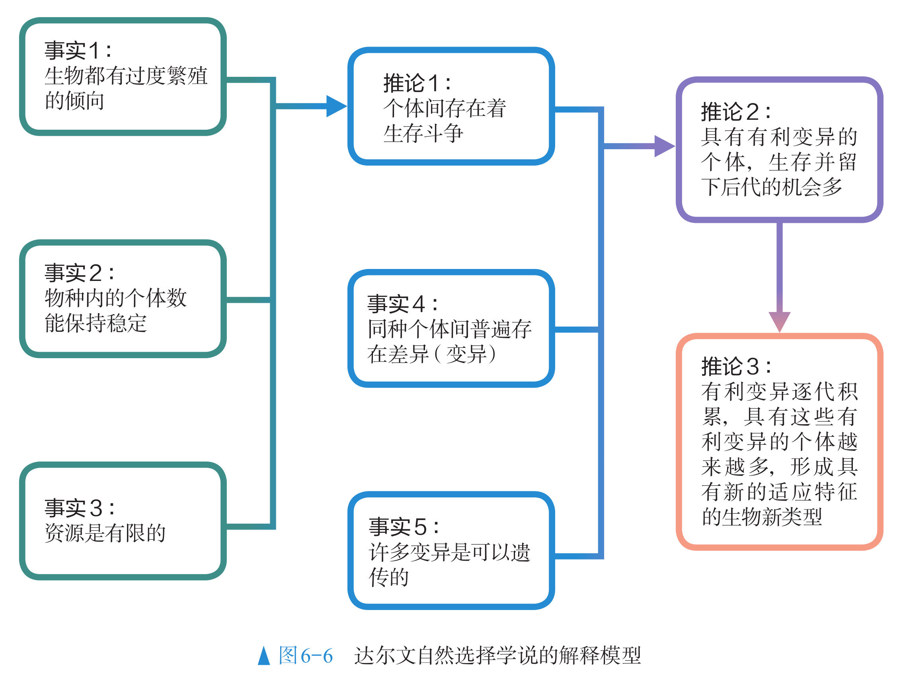
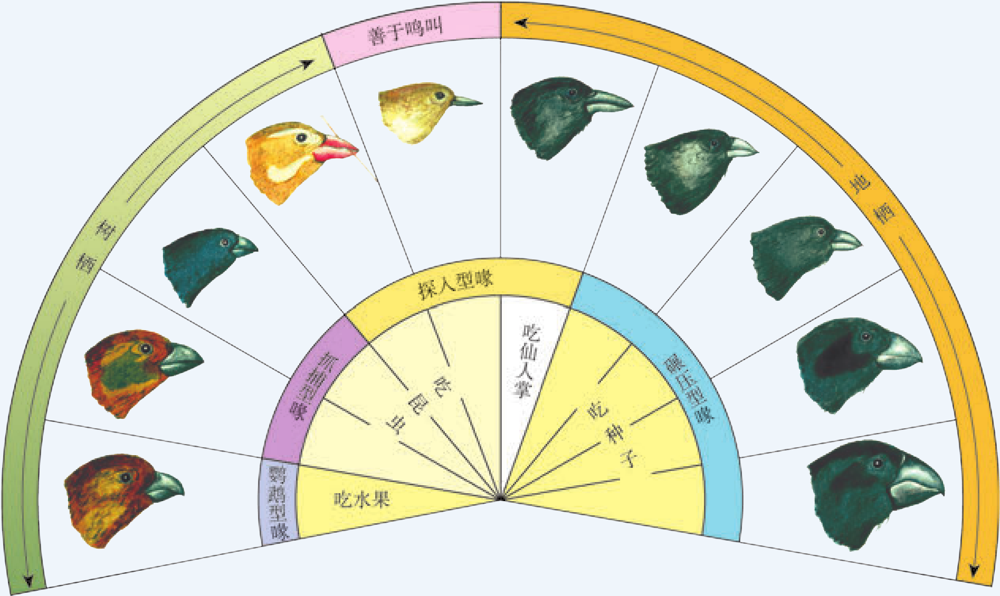
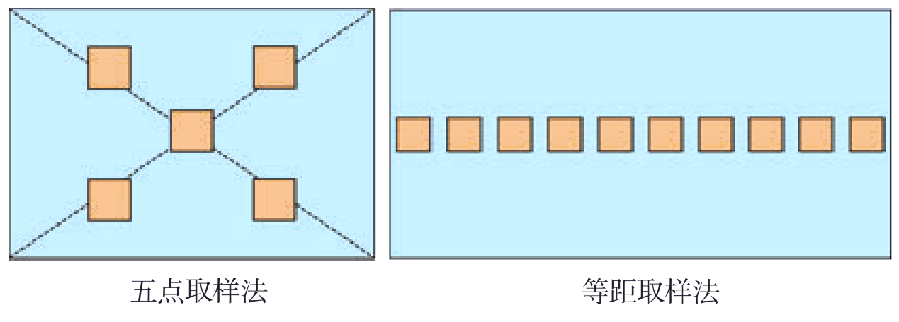
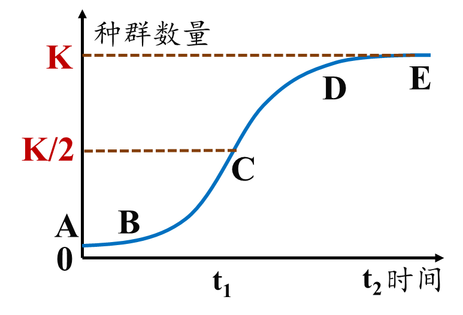
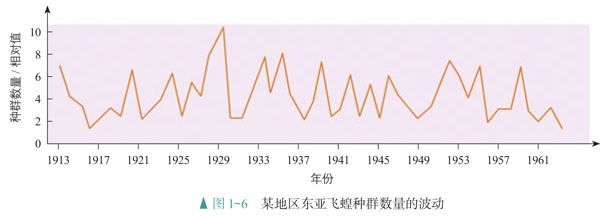
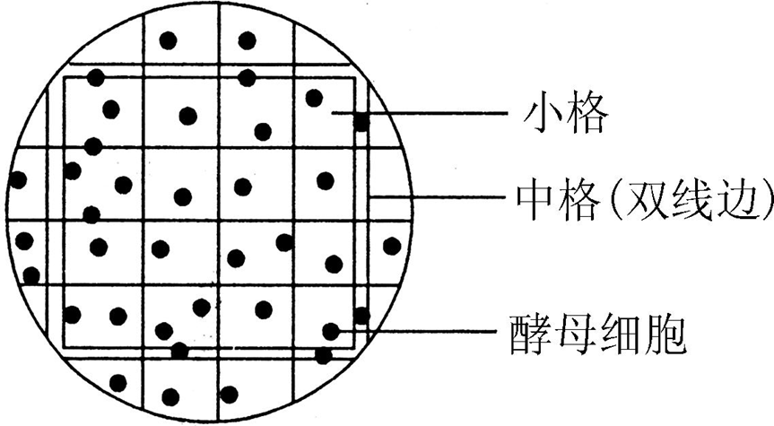
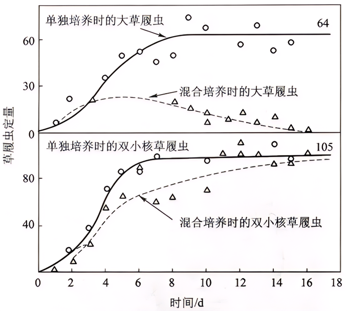
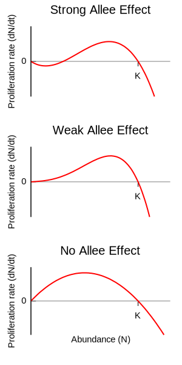

# 生态学概述

## 物种与进化

### 生态学的意义

生态学是研究生物与环境相互关系的科学，是自然科学的重要组成部分，它就是在研究生态系统的 What、How、Why，以及它的效应。

- What，就是研究生态系统的组成、结构和功能。

- How，就是研究生态系统各组分之间是如何工作的，也就是各组分之间的相互关系。

- Why，就是研究生态系统为什么会形成上述的组成、结构和功能。

生态系统的效应，是生态系统的服务功能，这主要是针对人类而言的，是现代农业的基础。生态文明建设是我国的重大战略之一。人类必须尊重自然、顺应自然、保护自然。这里的“自然”就是指生态环境。尊重自然就是要尊重生态学规律，顺应自然就是适应环境的变化，保护自然就是保护自然界的部分或整体。生态文明强调的是“和谐”而不是“妥协”，人类的能动性依然重要。生态文明并不是简单的返璞归真，而是依托当代先进的生产力，实现人与自然的和谐共生。

生态学是生态文明建设的科学支撑。生态学使人类认识了生态系统的结构、动态变化以及机制。只要尊重自然规律，在可允许的范围内操作，就可以既不损害自然，又能合理利用自然，促进自然和社会的协调。而生态文明建设会为生态学及相关学科提供发展的机会和平台，有利于推动科学的发展。

### 生态系统的组成

系统是指彼此间相互作用、相互依赖的组分有规律地结合而形成的整体。在自然界，生物个体都不是单独存在的，而是与其他同种和不同种的个体以及无机环境相互依赖、相互影响的。

- 在一定的空间范围内，同种生物的所有个体形成一个整体——**种群**，

- 不同种群相互作用形成更大的整体——**群落**，

- 群落与无机环境相互作用形成更大的整体——**生态系统**，

- 地球上所有的生态系统相互关联构成更大的整体——**生物圈**。

可见，自然界从生物个体到生物圈，可以看作各个层次的生命系统。

### 自然选择学说

适应作为一个生物学术语，包括两方面的含义：一是指生物的形态结构适合于完成一定的功能，二是指生物的形态结构及其功能适合于该生物在一定的环境中生存和繁殖。

适应是普遍存在的，是普遍性的，但是也具有相对性和局限性。

- **物种不变论**认为，各种生物都是自古以来就如此的。

- 拉马克彻底否定了物种不变论，提出当今所有的生物都是由更古老的生物进化来的，各种生物的适应性特征并不是自古以来就如此的，而是在进化过程中逐渐形成的。

    不过他认为适应的形成都是由于**用进废退和获得性遗传**：器官用得越多就越发达，比如食蚁兽的舌头之所以细长，是长期舔食蚂蚁的结果。器官废而不用，就会造成形态上的退化，比如鼹鼠长期生活在地下，视觉派不上用场，眼睛就萎缩、退化。这些因用进废退而获得的性状是可以遗传给后代的。
    
    拉马克提出的进化学说在当时是有进步意义的，但他对适应形成的解释是肤浅的，未被人们普遍接受。

- 达尔文提出的**自然选择学说**对生物的进化和适应的形成作出了合理的解释。他认为适应的来源是可遗传的变异，适应是自然选择的结果。

    { width="90%" }

    关于适应的形成，达尔文认为在一定环境的选择作用下，可遗传的有利变异会赋予某些个体生存和繁殖的优势，经过代代繁殖，群体中这样的个体就会越来越多，有利变异通过逐代积累而成为显著的适应性特征，进而出现新的生物类型。由此可见，群体中出现可遗传的有利变异和环境的定向选择是适应形成的必要条件。

    有学者认为，个体即使产生可遗传的有利变异，如果不能繁殖后代，在进化上也没有意义。因此主张将“适者生存”改为“适者繁殖”。

    达尔文以自然选择学说为核心的生物进化论使人们认识到，原来自然界的万千生物不是神灵预先设定好而永恒不变的，而是在自然选择的作用下不断发展变化的。这就使生物学第一次摆脱了神学的束缚，走上了科学的轨道。它揭示了生物界的统一性是由于所有的生物都有共同祖先，而生物的多样性和适应性是进化的结果。

受到当时科学发展水平的限制，达尔文对于遗传和变异的认识还局限于性状水平，不能科学地解释遗传和变异的本质。随着生物科学的发展，关于遗传和变异的研究，已经从性状水平深入到基因水平，人们逐渐认识到了遗传和变异的本质。关于适应以及物种的形成等问题的研究，已经从以生物个体为单位，发展到以种群为基本单位，这样就形成了以自然选择学说为核心的现代生物进化理论。

### 基因库与物种

自然选择直接作用的是生物的个体，而且是个体的表型。但是，在自然界，没有哪个个体是长生不死的，个体的表型也会随着个体的死亡而消失，决定表型的基因却可以随着生殖而世代延续，并且在群体中扩散。可见，研究生物的进化，仅研究个体和表型是不够的，还必须研究群体基因组成的变化。

种群是进化的基本单位，生活在一定区域的同种生物全部个体的集合叫作种群；一个种群中全部个体所含有的全部基因，叫作这个种群的基因库；在一个种群基因库中，某个基因占全部等位基因数的比值，叫作基因频率。

- 基因突变在自然界是普遍存在的。基因突变产生新的等位基因，这就可以使种群的基因频率发生变化。

- 达尔文曾明确指出，可遗传的变异提供了生物进化的原材料。现代遗传学研究表明，可遗传的变异来源于基因突变、基因重组和染色体变异。其中，基因突变和染色体变异统称为突变。

此外，突变的有害和有利也不是绝对的，这往往取决于生物的生存环境。

- 基因突变产生的等位基因，通过有性生殖过程中的基因重组，可以形成多种多样的基因型，从而使种群中出现多种多样可遗传的变异类型。

- 突变和重组都是随机的、不定向的，而在自然选择的作用下，具有有利变异的个体有更多的机会产生后代，种群中相应基因的频率会不断提高；相反，具有不利变异的个体留下后代的机会少，种群中相应基因的频率会下降。

因此，在自然选择的作用下，种群的基因频率会发生定向改变，导致生物朝着一定的方向不断进化。

抗药菌：一般情况下，一定浓度的抗生素会杀死细菌，但变异的细菌可能产生耐药性。在实验室连续培养细菌时，如果向培养基中添加抗生素，耐药菌有可能存活下来。滥用抗生素的现象十分普遍。

同种生物的不同种群，由于突变和选择因素的不同，其基因组成可能会朝不同的方向改变，导致种群间出现形态和生理上的差异。在遗传学和生物进化论的研究中，把能够在自然状态下相互交配并且产生可育后代的一群生物称为一个**物种**。

- 不同物种之间一般是不能相互交配的，即使交配成功，也不能产生可育的后代，这种现象叫作**生殖隔离**。例如，马和驴虽然能够交配，但是产生的后代骡是不育的，因此，马和驴之间存在生殖隔离，它们属于两个物种。

- 由于高山、河流、沙漠或其他地理上的障碍，每个物种总是分成一个个或大或小的群体，这些群体就是不同的种群，比如两个池塘中的鲤鱼就是两个种群。同种生物由于地理障碍而分成不同的种群，使得种群间不能发生基因交流的现象，叫作**地理隔离**。

地理隔离和生殖隔离都是指不同群体间的个体，在自然条件下基因不能自由交流的现象，这里统称为隔离。

- 这是达尔文在环球考察中观察到的现象：在加拉帕戈斯群岛上生活着 13 种地雀。这些地雀的喙差别很大，不同种之间存在生殖隔离。而在辽阔的南美洲大陆上，却看不到这 13 种地雀的踪影。

- 加拉帕戈斯群岛位于南美洲附近的太平洋中，由 13 个主要岛屿组成，这些岛屿与南美洲大陆的距离为数百千米。不同岛屿的环境有较大差别，比如岛的低洼地带，布满棘刺状的灌丛；而在只有大岛上才有的高地，则生长着茂密的森林。这些岛屿是 500 万年前由海底的火山喷发后形成的，比南美洲大陆的形成晚得多。

因此，可以推测这些地雀的共同祖先来自南美洲大陆，以后在各个岛屿上形成了不同的种群。

{ width="80%" }

加拉帕戈斯群岛的地雀是说明通过地理隔离形成新物种的著名实例。

- 这些地雀的祖先属于同一个物种，从南美洲大陆迁来后，逐渐分布到不同的岛屿上。由于各个岛上的地雀种群可能会出现不同的突变和基因重组，而一个种群的突变和基因重组对另一个种群的基因频率没有影响。

- 因此，不同种群的基因频率就会发生不同的变化。由于各个岛上的食物和栖息条件互不相同，自然选择对不同种群基因频率的改变所起的作用就有差别。

- 在一个种群中，某些基因被保留下来，而在另一个种群中，被保留下来的可能是另一些基因。久而久之，这些种群的基因库就会形成明显的差异，并逐渐出现生殖隔离。

- 生殖隔离一旦形成，原来属于一个物种的地雀，就成了不同的物种。由此可见，**隔离是物种形成的必要条件**。

物种形成本身表示生物类型的增加。同时，它也意味着生物能够以新的方式利用环境条件，从而为生物的进一步发展开辟新的前景。

在自然界，狮和虎是不可能相遇的。在动物园里，一般也将这两种动物分开圈养。近年来才出现将它们的幼崽放在一起饲养的做法，目的是获得有观赏价值的杂交后代——狮虎兽或虎狮兽。

### 生物进化理论

达尔文曾发现一种兰花长着细长的花距，其底部储存着花蜜。达尔文推测，这种花的形成绝不是偶然的，肯定存在这样的昆虫，它们生有同样细长的吸管似的口器，可以从花距中吸到花蜜。大约 50 年以后，研究人员果然发现了这样的蛾类昆虫。

关于捕食者在进化中的作用，美国生态学家斯坦利提出了“收割理论”：捕食者往往捕食个体数量多的物种，这样就会避免出现一种或少数几种生物在生态系统中占绝对优势的局面，为其他物种的形成腾出空间。捕食者的存在有利于增加物种多样性。

不仅不同种生物之间在进化上密切相关，生物的进化与无机环境的变化也是相互影响的。例如，地球上的原始大气中是没有氧气的，因此，最早出现的生物都是厌氧（进行无氧呼吸）的；最早的光合生物的出现，使得原始大气中有了氧气，这就为好氧生物的出现创造了前提条件。

不同物种之间、生物与无机环境之间在相互影响中不断进化和发展，这就是**协同进化**。通过漫长的协同进化过程，地球上不仅出现了千姿百态的物种，丰富多彩的基因库，而且形成了多种多样的生态系统。

生物多样性主要包括三个层次的内容：**遗传多样性**（**基因多样性**）、**物种多样性**和**生态系统多样性**。生物多样性的形成经历了漫长的进化历程。

- 就目前所掌握的证据来看，最早的生物化石是 35 亿年前的古细菌化石。在此之后大约 20 亿年的漫长岁月中，地球上的生物主要是海洋中种数不多的细菌（包括蓝细菌），它们都是原核生物。这一时期的生态系统是只有生产者和分解者的两极生态系统。

- 真核生物出现以后，有性生殖作为一种新的繁殖方式出现了。生物通过有性生殖，实现了基因重组，这就增强了生物变异的多样性，生物进化的速度明显加快，多细胞植物和动物的种类不断增多。

- 在 5.4 亿至 5.0 亿年前的寒武纪，海洋中有大量的无脊椎动物物种爆发式地迅速形成，这就是著名的寒武纪大爆发。大量的动物构成了生态系统的第三极——消费者，使生态系统具有更加复杂的结构。同热闹非凡的海洋生物世界相比，当时的陆地上却几乎没有生物。

- 大约在 4 亿年前，由于造山运动使海洋缩小，陆地扩大，一些海洋植物开始适应陆地生活，形成了原始的陆生植物，主要是蕨类植物。随后才出现了适应陆地生活的动物——原始的两栖类。

- 生物的登陆改变着陆地的环境，陆地上复杂的环境又为生物的进化提供了广阔的舞台，裸子植物和被子植物先后扮演了生产者中的主角，鸟类、哺乳类等成为地球上占优势的动物类群，复杂多样的陆地生态系统逐渐形成。

在进化过程中，许多物种由于不适应环境的变化而绝灭了。例如，在中生代“统治”地球达 1 亿年之久的各种恐龙，由于目前尚未定论的原因，在白垩纪末全部绝灭。恐龙的绝灭为哺乳类的兴盛腾出了空间，使生物进化翻开了崭新的一页。

人类也是生物进化的产物。大约 300 万年前，森林古猿的一支离开森林，告别树栖生活，走上了向现代人类进化的漫漫长路。在自然界的生存斗争中，人类凭借非凡的大脑、灵巧的双手和群体的力量，已经拥有了其他生物无可比拟的生存优势，并且对其他物种的进化产生了重要影响，不少物种由于人类活动的影响走向绝灭。我们须臾不能忘记的是，包括人类在内的所有生物都是在相互依存、相互制约中生存和发展的，人类的生存和发展始终受益于生物多样性，保护生物多样性就是保护人类自己。

以自然选择学说为核心的现代生物进化理论对自然界的生命史作出了科学的解释：

1. 适应是自然选择的结果；

2. 种群是生物进化的基本单位；

3. 突变和基因重组提供进化的原材料，自然选择导致种群基因频率的定向改变，进而通过隔离形成新的物种；

4. 生物进化的过程实际上是生物与生物、生物与无机环境协同进化的过程；

5. 生物多样性是协同进化的结果。

生物进化过程复杂而漫长，已经发生的，研究者无法目睹；将要发生的，研究者很难预知。因此，上面所概括的现代生物进化理论的要点，尽管已被学术界广为接受，却不意味着生物进化的一切奥秘都真相大白，而是仍有争论和疑点。

有些学者的研究表明，基因突变对生物适应性的影响并不是非益即害的，大量的基因突变是中性的，自然选择对这些基因突变不起作用，这些基因突变经过长期积累，会导致种群间遗传物质出现较大的差别。因此有人主张，决定生物进化方向的是中性突变的逐渐积累，而不是自然选择。更多学者则认为，基因突变并不都是中性的，有些基因突变反映在个体的性状上，与环境相适应的程度有差异，因此，不能否认自然选择的作用。

根据许多物种是在短时间内迅速形成的现象，有人提出物种形成并不都是渐变的过程，而是物种长期稳定与迅速形成新种交替出现的过程，其原因仍在探索中。

总之，生物的进化是如此复杂，现有的进化理论所不能解释的问题比已经解释的问题还要多。在这些理论中，以自然选择学说为核心的进化理论比其他学说的影响要广泛和深远，它仍然是以后各个方面研究的基础。同其他科学理论一样，生物进化理论不会停滞不前，而是在不断发展。

## 种群及其动态

### 种群的调查

种群在单位面积或单位体积中的个体数就是种群密度，种群密度是种群最基本的数量特征。濒危动物保护、农田杂草状况调查、农林害虫的监测和预报、渔业上捕捞强度的确定等，都需要对种群密度进行调查研究。

- 逐个计数法：在调查分布范围较小、个体较大的种群时，可以**逐个计数**，如调查某山坡上的珙桐密度。

- 黑光灯诱捕法：在多数情况下，逐个计数非常困难，需要采取估算的方法。例如，对于有趋光性的昆虫，可以用黑光灯（波长在 365nm 左右的紫外线）进行灯光诱捕来估算它们的种群密度。

- 样方法：估算种群密度常用的方法之一是样方法：在被调查种群的分布范围内，随机选取若干个样方，通过统计每个样方内的个体数，求得每个样方的种群密度，以所有样方种群密度的平均值作为该种群的种群密度估算值。调查草地上蒲公英的密度，农田中某种昆虫卵的密度，作物植株上蚜虫的密度、跳蝻的密度等，都可以采用样方法。

    { width="80%" }

    计数方法：样方内和相邻两边及其夹角，一般来说计上不计下，计左不计右。

    样方大小要始终：草本植物一般为 $1$ 平方米，灌木为 $16$ 平方米，乔木为 $100$ 平方米。

- 标记重捕法：许多动物的活动能力强，活动范围大，不宜用样方法来调查它们的种群密度。常用的方法之一是标记重捕法。这种方法是在被调查种群的活动范围内，捕获一部分个体，做上标记后再放回原来的环境，经过一段时间后进行重捕，根据重捕到的动物中标记个体数占总个体数的比例，来估算种群密度。

    标记重捕法的基本假设是，即使一个种群内的生物在一定空间内分布可能不均匀，但是个体之间是随机的，即在某个地方放生一部分生物，在足够长的时间（假设没有出生死亡、迁入迁出）后，这些生物一定是随机散在整个庞大的种群之中。

    据此，我们不妨记第一次捕获 $M$ 个体，重捕到 $n$ 个体，其中有 $m$ 个体是标记过的，估算种群数量 $N$。

    $$
    \dfrac{M}{N}=\dfrac{m}{n}
    $$

    因此得出种群数量的计算公式：

    $$
    N=\dfrac{Mn}{m}
    $$

    即捕捉到的数量相乘，除以重捕到的标记个体。如果要求种群密度，不要忘记除以面积。

    1. 被调查个体在调查期间没有大量迁入和迁出、出生和死亡的现象；
    2. 标志物和标志方法不能影响被标记对象的正常生命活动；
    3. 标记物不能过于醒目，否则易被捕食；
    4. 标记物不易脱落，能够维持一定的时间；
    5. 标志个体需与未标志个体混合均匀后再重捕，保证在重捕时被捕的概率相等；
    
    误差分析：通常来说需要考虑 $n,m$ 的变化，如果标记脱落，则 $m$ 偏小，$N$ 偏大；如果个体不易二次捕捉，则 $m$ 偏小，$N$ 偏大；如果标记个体死亡，则 $m$ 偏小，$N$ 偏大；如果个体未完全融入种群，则 $m$ 偏大，$N$ 偏小。

调查动物种群密度的常用方法，如样方法、标记重捕法，往往需要直接观察或捕捉个体。在调查生活在隐蔽、复杂环境中的动物，特别是猛禽和猛兽时，这些方法就不适用了。为此，科学家开发出一些不需要直接观察或捕捉，就能调查种群密度或种群数量的新方法。

- 在动物的栖息地布设若干台红外触发相机，恒温动物一靠近，就会触发相机自动拍摄照片或视频。经过一段时间，科学家利用计算机分析处理这些照片或视频，就能确定所调查动物的种群数量。运用这种方法，我国科学家持续对我国境内的东北虎、东北豹等濒危动物的数量进行监测。

- 不同动物的粪便具有不同的特征。先区分粪便来自哪种动物，再分析这种动物的粪便来自多少个个体，就可以获得种群的数量信息。例如，采集了大量大熊猫的粪便，通过分析其中的微卫星 DNA 分子标记，查明大熊猫的种群数量。

- 动物的声音也存在个体差异，成熟个体的声音特征往往可以长期保持稳定。因此，动物的声音可以作为一种非损伤、低干扰的标记，用于对不同个体进行识别，进而进行种群数量的监测。利用这种基于声音的个体识别技术，科学家成功地对鲸、长臂猿等哺乳动物以及鸮、秧鸡等鸟类开展了野外种群数量的监测。

种群密度反映了种群在一定时期的数量，但是仅靠这一特征还不能反映种群数量的变化趋势。要想知道种群数量的消长，还需要研究种群的其他数量特征。

### 密度影响因素

种群密度是种群最基本的数量特征。种群的其他数量特征是影响种群密度的重要因素，其中**出生率**和**死亡率**、**迁入率**和**迁出率**直接决定种群密度，**年龄结构**影响出生率和死亡率，**性别比例**影响出生率，进而影响种群密度。

.jpeg){ width="60%" }

- 出生率是指在单位时间内新产生的个体数目占该种群个体总数的比值。一般来说，繁殖能力强的种群出生率高，种群增长快。

- 死亡率是指在单位时间内死亡的个体数目占该种群个体总数的比值。

- 对一个种群来说，单位时间内迁入或迁出的个体占该种群个体总数的比值，分别称为迁入率或迁出率。

种群的**年龄结构**是指一个种群中各年龄期的个体数目的比例（如左图），如果样本很大的话，通常还会把年龄结构和性别比例放在一起（如右图）。**性别比例**，又称性比，是指种群中雌雄个体数目的比例。性别比例对种群密度也有一定的影响。

{ width="100%" }

男女性别比例以 100 名女婴所对应的男婴数目为结果，世界人口性别比例的正常值为 102 至 107。我国颁布禁止“非医学需要的胎儿性别鉴定”和“非医学需要的性别选择性人工流产”。

### 种群数学模型

数学模型是用来描述一个系统或它的性质的数学形式。以时间为横坐标，细菌数量为纵坐标，画出某种群的增长曲线。这样的曲线图是数学模型的另一种表现形式。同数学公式相比，它能更直观地反映出种群的增长趋势。所得出的公式和增长曲线，通常只是对理想条件下数量增长的推测。

种群的“J”形增长：

- 自然界有类似细菌在理想条件下种群增长的形式，如果以时间为横坐标，种群数量为纵坐标画出曲线来表示，曲线则大致呈“J”形。

- 对一支试管中的培养液中的酵母菌逐个计数是非常困难的，可以采用抽样检测的方法：先将盖玻片放在血细胞计数板的计数室上，用吸管吸取培养液，滴于盖玻片边缘，让培养液自行渗入。多余的培养液用滤纸吸去。稍待片刻，待酵母菌全部沉降到计数室底部，将计数板放在载物台的中央，计数一个小方格内的酵母菌数量，再以此为根据，估算试管中的酵母菌总数。

- 模型假设：在食物和空间条件充裕、气候适宜、没有天敌和其他竞争物种等条件下，种群的数量每年以一定的倍数增长，第二年的数量是第一年的 $\lambda$ 倍。

- 数学模型： $t$ 年后种群数量为 $N_t = N_0 \lambda^t$，其中 $N_0$ 为该种群的起始数量，$t$ 为时间，$N_t$ 表示 $t$ 年后该种群的数量，$\lambda$ 表示该种群数量是前一年种群数量的倍数。

.jpeg){ width="60%" }

种群的“S”形增长：

- 如果遇到资源、空间等方面的限制，种群经过一定时间的增长后，数量趋于稳定，增长曲线呈“S”形。这种类型的种群增长称为“S”形增长。

- 一定的环境条件所能维持的种群最大数量称为环境容纳量，又称 $K$ 值。

{ width="40%" }

在自然界，当一种生物迁入一个条件适宜的新分布地时，初始阶段一般会出现较快增长，但是，资源和空间总是有限的。当种群密度增大时，种内竞争就会加剧，这就会使种群的出生率降低，死亡率升高。当死亡率升高至与出生率相等时，种群的增长就会停止，有时会稳定在一定的水平。可见，种内竞争对种群数量起调节作用。

我们考虑种群数量的一些数学性质：

- 种群增长率：指单位数量的个体在单位时间内新增加的个体数，无单位。

    

    种群**增长率** $=($ 本次总数 $-$ 上次总数 $)/$ 上次总数。
    

- 种群增长速率：指单位时间内新增加的个体数(即种群数量增长曲线的斜率)，有单位，如个/年。

    

    种群**增长速率** $=($ 本次总数 $-$ 上次总数 $)/$ 时间。
    

- $\lambda\neq$ 增长速率 $\neq$ 增长率。增长率 $=\lambda-1$。在一些老的题目中，这几个量可能会混淆，甚至不符合现在的一般认知，据题分析即可。

在自然界，有的种群能够在一段时期内维持数量的相对稳定。当种群长久处于不利条件下，如遭遇人类乱捕滥杀和栖息地破坏，种群数量会出现持续性的或急剧的下降。

| J 形曲线 | S 形曲线 |
| :------: | :------: |
| 在理想条件下的种群增长 | 在资源有限环境下的种群增长 |
|  |  |
| 一般只有在实验室（或当某种群初入一条件非常适宜的新环境时如物种入侵）才会出现 | 食物不足、空间有限、种内竞争、天敌捕食、气候不适、寄生虫、传染病等 |

{ width="100%" }

对于 $S$ 曲线，理想情况下其满足逻辑斯谛方程：

$$
\dfrac{\d N}{\d t}=rN\paren{1-\dfrac{N}{K}}
$$

其中 $r$ 指的是在理想情况下，种群的瞬时增长率。这个式子指出，当 $N=\dfrac{1}{K}$ 时，瞬时增长速率最大。

环境阻力：生存斗争中被淘汰的个体量。

{ width="50%" }

注意：一般认为 S 形曲线的开始部分并非 J 形曲线，因为 S 形曲线自始至终都有环境阻力，但是因为这种阻力在前一部分并不明显，所以曲线会比较相近。在实验室中，为了制取 J 形曲线，通常会采取更换培养液的方式，这个时候 J 形曲线并不是连续的指数函数，而是若干个从头开始的 S 形曲线连在了一起，此时说这种 S 形曲线的前一部分是 J 形曲线也是合理的。但是一定注意，两种曲线起点都不是 0，而是一开始引入环境中的数量。

### 酵母菌种群数量

酵母菌是单细胞真核生物，进行出芽生殖和有性生殖，属于兼性厌氧型生物，生长周期短，增殖速度快，可以用含糖的液体培养基来培养，通过细胞计数可以测定封闭容器内的酵母菌种群随时间而发生的数量变化。其中，养分、氧气、温度和代谢废物等是影响种群数量持续增长的限制因素。

1. 操作提示

    1. 溶液要进行定量稀释，每天取样的时间要固定。

    2. 从试管中吸出培养液进行计数前，需将试管轻轻 **振荡** 几次，目的是使培养液中的酵母菌均匀分布，减小误差。

    3. 制片时，先将盖玻片放在血细胞计数板的计数室上，用吸管吸取培养液，滴于盖玻片边缘，让培养液自行渗入。多余的培养液用滤纸吸去。

    4. 制好装片后，应稍待片刻，待酵母菌全部沉降到计数室底部，再用显微镜进行观察、计数。

2. 计数提示

    1. 计数原则：显微镜计数时，对于压在小方格界线上的酵母菌，应遵循“计相邻两边及其夹角”的原则计数。

    2. 统计结果偏小的原因：取液时未摇匀，吸取的培养液中酵母菌偏少；在计数时，未统计边缘的酵母菌等。

    3. 统计结果偏大的原因：取液时未摇匀，吸取了表层的培养液；在计数时统计了四周边缘的酵母菌等。

3. 注意事项

    1. 测定的酵母菌种群数量是在恒定容积的培养基中测定的，与自然界中的种群数量变化有差异。

    2. 在进行酵母菌计数时，由于酵母菌是单细胞生物，因此必须在显微镜下计数，且不能准确计数，只能估算。

    3. 血细胞计数板必须保持干燥，否则培养液将不能渗入计数室。

    4. 清洗血细胞计数板的正确方法是浸泡和冲洗，不能用试管刷或抹布擦洗。冲洗干净后不能用纱布或吸水纸擦干，应自然晾干或烘干或用吹风机吹干。

血细胞计数板：在显微镜下直接计数是一种常用的细胞计数法（抽样检测法），一般用于单细胞微生物数量的测定，由于血球计数板上的计数室盖上盖玻片后的容积是一定的，所以可根据在显微镜下观察到的细胞数目来计算单位体积的细胞的总数目。

{ width="90%" }

- 每块计数板由 H 形凹槽分为 $2$ 个同样的计数区。

- 每个计数区分为 $9$ 个大方格。

对一支试管中的培养液中的酵母菌逐个计数是非常困难的，可以采用抽样检测的方法：先将盖玻片放在血细胞计数板的计数室上，用吸管吸取培养液，滴于盖玻片边缘，让培养液自行渗入。多余的培养液用滤纸吸去。稍待片刻，待酵母菌全部沉降到计数室底部，将计数板放在载物台的中央，计数一个小方格内的酵母菌数量，再以此为根据，估算试管中的酵母菌总数。

| 规格一：$25\times16$ 型 | 规格二：$16\times25$ 型 |
| :-: | :-: |
|  |  |
| 计四角的 $4$ 个中方格 共 $100$ 个小方格中的酵母菌数量 | 计四角和正中间的 $5$ 个中方格 共 $80$ 个小方格中的酵母菌数量 |

{ width="100%" }

{ width="90%" }

趋势分析：

1. 增长：在开始时培养液的营养充足，空间充裕，条件适宜，因此酵母菌大量繁殖，出生率高于死亡率，种群数量剧增。

2. 稳定和波动：随着酵母菌数量的不断增多，营养消耗、pH 变化、有害产物积累等，酵母菌死亡率逐渐升高，当死亡率等于出生率时，种群数量不再增长。

3. 衰退：随生存条件进一步恶化（营养物质消耗殆尽，有害代谢产物积累，pH 改变），酵母菌死亡率高于出生率，种群数量下降。

### 种群数量应用

非生物因素：在自然界，种群的数量变化受到阳光、温度、水等非生物因素的影响。非生物因素对种群数量变化的影响往往是综合性的。

- 森林中林下植物的种群密度主要取决于林冠层的郁闭度，即主要取决于林下植物受到的光照强度；

- 在温带和寒温带地区，许多植物的种子在春季萌发为新的植株，这主要是受气温升高的影响；

- 蚊类等昆虫在寒冷季节到来时一般会全部死亡，这主要是受气温降低的影响；

- 干旱缺水会使许多植物种群的死亡率升高，动物种群在寻找水源的过程中也常常发生个体的死亡，而对于东亚飞蝗来说，气候干旱正是其种群爆发式增长的主要原因。

- 春夏时节动植物种群普遍迅速增长，除气温升高外，日照延长、降水增多也是重要原因，而对于动物来说，食物日益充足也是导致种群增长的重要因素，这就涉及生物因素了。

生物因素：

- 随着种群的增长，种内竞争会加剧，从而使种群的增长受到限制，这说明种群数量的变化受到种群内部生物因素的影响。

- 在自然界，任何一个种群都与其他种群有着密切的关系，其中捕食与被捕食的关系、相互竞争的关系都是十分常见的。除顶级捕食者外，每种动植物都可能是其他某种生物的捕食对象，每种动物都需要以其他生物为食。如果食物匮乏，动物种群会出现出生率降低、死亡率升高的现象。

- 森林中不同植物竞争阳光和养分，草原上非洲狮与猎豹竞争猎物，这也会导致种群数量的变化。非洲狮和猎豹会在同一区域捕猎，有时，非洲狮会在猎豹杀死猎物后到来，赶走猎豹以获得剩余的食物；非洲狮还会杀死猎豹的幼崽，从而将猎豹的数量控制在一定范围内。

- 此外，作为宿主的动物被寄生虫寄生，细菌或病毒引起传染病，也会影响种群的出生率和死亡率等特征，进而影响种群的数量变化。

一般来说，食物和天敌等生物因素对种群数量的作用强度与该种群的密度是相关的。例如，同样是缺少食物，种群密度越高，该种群受食物短缺的影响就越大，因此，这些因素称为密度制约因素。而气温和干旱等气候因素以及地震、火灾等自然灾害，对种群的作用强度与该种群的密度无关，因此被称为非密度制约因素。例如，在遭遇寒流时，有些昆虫种群不论其种群密度高低，所有个体都会死亡。

{ width="70%" }

循环因果关系：在生物学上，许多生理或生态过程的因果关系是循环性的，也就是说，一定的事件作为引起变化的原因，所导致的结果又会成为新的条件，施加于原来作为原因的事件，使之产生新的结果，如此循环往复。

{ width="60%" }

种群研究的应用：研究种群的特征和数量变化的规律，在野生生物资源的合理利用和保护、有害生物的防治等方面都有重要意义。

- 利用人工合成的性引诱剂诱杀某种害虫的雄性个体，改变了害虫种群正常的性别比例，就会使很多雌性个体不能完成交配，从而使该种害虫的种群密度明显降低。

- 在濒危动物的保护方面，只有通过调查获知种群密度、出生率和死亡率、性别比例、年龄结构等特征，以及影响该种群数量变化的因素，才能准确了解该种群的生存状态，预测该种群的数量变化趋势，进而采取合理的保护对策。

- 在渔业上，人们总是希望每年既能捕捞较多的鱼，又不危及来年的鱼产量，也就是希望长期获得较高的捕捞量。那么，怎样确定合适的捕捞量呢？这就需要研究捕捞量与种群数量变化之间的关系。从理论上说，“S”形增长的种群在种群数量达到 $K$ 值时，出生率与死亡率相等，这时即使不捕捞，种群数量也不会增加。研究表明，中等强度的捕捞有利于持续获得较大的鱼产量，捕捞后使鱼的种群数量处在 $K/2$ 左右。

- 在有害生物的防治方面，种群研究同样具有重要意义。例如，在鼠害发生时，既适当采用化学和物理的方法控制现存害鼠的种群数量，又通过减少其获得食物的机会等方法降低其环境容纳量，才能使鼠害得到有效防治。再如，对农林害虫的防治，如果一味依赖喷洒农药的方法，既造成环境污染，又伤及害虫的天敌；有效保护或引入天敌生物，则有利于将害虫数量控制在较低的水平。

大树杜鹃是一种集中分布于我国云南高黎贡山山区的高大乔木。它的分布范围很小，很难引种到其他地方，是濒危物种。大树杜鹃林下凋落物厚，种子难以散布到土壤基质层，因此在自然环境中发芽率很低；幼苗生长缓慢，要生长很长时间才能开花；植株耐寒能力弱，在 $\pu{-2^oC}$ 环境下会死亡，幼树死亡率高。

### 种群数量曲线

存活曲线：依照物种的个体从幼体到老年所能存活的比率，所做出的统计曲线，可以反映种群在每个年龄级生存的数目。

{ width="60%" }

- Type I：这类生物大部分的死亡，是发生在这类生物最大生命期的阶段。换句话说，就是这些生物在幼儿时期较不容易死亡，成年后的种内竞争则较为激烈。譬如人类或是具有完善育幼行为的生物都属于此类。

- Type II：这类生物的死亡率无论在何种年纪，都维持一定的比率。可能具有一定照顾子代的行为，但仍不及 Type I 完善，如海鸥、水螅、松鼠等。

- Type III：这类生物在幼年时期的死亡率会很高，但是如果其年龄或是体型达到某一阶段或是程度，其死亡率就会下降许多，成年后的种内竞争则较不明显。许多会产下许多后代、生殖策略是以量取胜的生物，像是大部分的鱼类、昆虫都是此类。

生活史理论是在演化生物学与生态学中的一项核心理论框架，旨在探讨生物体在其生命周期各阶段所表现出的资源分配策略，以及不同策略差异的成因与结果。

在生活史理论中，生物体的生活史特征可归纳为七项核心指标：出生时的体型、生长模式、达到性成熟的年龄与体型、后代的数量、体型与性别比例、特定年龄与体型下的繁殖投入、特定年龄与体型下的死亡率分布、整体寿命。为适应所处的生态环境，不同生物演化出各具特征的生活史策略。在这一过程中，个体在资源有限的条件下，不同性状之间往往存在演化权衡。例如，生物体可能在演化上倾向于追求较大的体型或更长的寿命，或相反地，优先繁殖更多后代，提升种群增长速度，亦或是增强单个后代的生存概率。

我们在前面已经提到过逻辑斯谛方程：

$$
\dfrac{\d N}{\d t}=rN\paren{1-\dfrac{N}{K}}
$$

在繁殖策略方面，生活史理论常将生物划分为 r 策略与 K 策略：

- K 策略强调种群稳定与个体质量；物种后代数量较少，却在每个个体上投入更多养育资源，从而提高其存活概率；种群数量受非密度制约因素主导，恢复快但波动大。

    1. 生境相对稳定；
    2. 个体大、发育慢、寿命长；
    3. 繁殖较晚并多次繁殖；
    4. 后代数目少，个体大、存活率高；
    5. 较低繁殖能量分配和较长的世代周期。

- r 策略强调快速繁殖与种群扩张；通常一次产生大量后代，但个体存活率较低；种群数量受密度制约因素主导，恢复慢但稳定性高。

    1. 不断占领暂时性生境，迁移是种群动态过程重要组成部分；
    2. 适应于不可预测的多变环境；
    3. 发育快速、成年个体小、早熟、寿命短；
    4. 具有高生育力、后代数目多但个体小、缺乏亲体保护；
    5. 较高的繁殖能量分配和较短的世代周期。

总的来说 r 对策生物的个体较小，繁殖能力较强，但寿命较短，对环境有较强的适应能力，一般缺乏保护后代机制，竞争力弱，但具有很强的扩散能力，种群易爆发，比如老鼠。r 对策者和 K 对策者是两个不同的进化类型，但两种之间还有各种过渡类型，为 r-K 连续谱。就大类群来说，可以认为脊椎动物是 K 选择的、昆虫是 r 选择的。

{ align=right width="30%" }

阿利效应（Allee）：当种群密度过低时，种群的增长率反而会下降，甚至导致灭绝。这与传统观点（密度越高增长越快）相反，低密度时，个体搜寻配偶、合作捕食、共同防御捕食者等行为变得困难，繁殖成功率降低，最终影响种群生存。该效应在物种保护和入侵物种研究中非常重要，为确定最小可行种群规模提供了依据。 

种群的延续需要有一定的个体数量为基础。当一个种群的数量过少，种群可能会由于近亲繁殖等而衰退、消亡。我们记这个临界点为 $A$，那么可用三次增长模型给出一个简单的阿利效应的数学表达：

$$
\dfrac{\d N}{\d t}=rN\paren{\dfrac{N}{A}-1}\paren{1-\dfrac{N}{K}}
$$

群聚有利于种群的增长和存活，但过分稀疏和过分拥挤都可阻止生长，并对生殖发生负作用，每种生物都有自己的最适密度。对于一个具有阿利效应的种群来说，当种群密度低于某一阈值时，物种将会灭绝。这是因为种群密度过于稀疏时，种群个体将因难以找到配偶或因近亲繁殖等因素导致出生率减小，死亡率增加。因此许多种群，尤其那些濒危的密度稀疏种群，更容易受到阿利效应的影响。

动态、静态生命表：

- 动态生命表是通过追踪同一时期出生的生物群体（同生群）从出生到死亡全过程编制的生命表，记录各年龄阶段的存活与死亡数据，适用于短寿命物种。
- 静态生命表是通过调查某一特定时间点种群的年龄结构数据编制的生命表，反映种群瞬时生存状态，适用于世代重叠的长寿命物种。
- 主要区别：动态表采用纵向追踪法，静态表采用横向调查法；动态表适用于世代不重叠物种，静态表适用于世代重叠物种；动态表反映真实死亡率变化，静态表依赖种群稳定性假设。

我们定义集合种群为由空间上互相隔离，但功能上又有联系的若干地方种群通过扩散和定居而组成的种群，而局域种群为分布在相互隔离的斑块上的小种群。

局域种群的数量可能由于出生、死亡、迁入、迁出等原因变动很大，也可能灭绝。集合种群是在一个生境斑块中，局域种群构成的一个集合。即生境斑块中的局域种群在空间上存在隔离，彼此间通过个体扩散、相互迁移而彼此联系。尽管各局域种群数量变动很快，甚至灭亡，但从集合种群整体上来看，种群数量可能比较稳定，因为来自其他局域种群的新个体可能会迁入灭亡种群所占据的斑块。

集合种群是保护生物学所关注的热点。在生物多样性保护工作中，需要科学地考察所研究地区的空间范围、种间和种内差异，有较多以前是连续分布的物种，由于生境的破碎化而以集合种群的方式存在，物种的灭绝也往往经历了集合种群的阶段。集合种群理论揭示了人类活动所造成的物种灭绝，事实上是从局部灭绝开始的，局部灭绝的后果可能导致物种的最后灭绝。

### 种群调节机制

在自然界中，绝大部分种群处于一个相对稳定状态。

- 种群的自然平衡：生态因子的作用使种群在生物群落中，与其他生物成比例地维持在某一特定密度水平上的现象。
- 平衡密度：种群的自然平衡状态时的密度水平。
- 调节过程：由于各种因素对自然种群的制约，种群不可能无限制地增长，最终趋向于相对平衡。而密度因素是调节其平衡的重要因素。种群离开其平衡密度后又返回到这一平衡密度的过程。
- 调节因素：能使种群回到原来平衡密度的因素。

外源性调节理论：

1. 非密度制约的气候学派：认为种群可由气候所调节，认为有机体主要是受对种群得以増长的有利气候的短暂限制。 因此，种群从来就没有足够的时间増殖到生境负荷量所允许的数量水平，并不导致关于食物的竞争。
2. 密度制约的生物学派：认为种群是一个自我管理的系统，它“按其自身的性质及其环境的状况调节它们的密度”。为了维持平衡，当种群密度很高时，调节因子的作用必须加强，当密度低时，调节因子的作用就减弱，即调节因子 的作用必须受调节种群的密度所管理。同时，强调食物因素对种群调节的作用。

内源性的自动调节理论：

1. 社会性交互作用调节学说：认为社群行为是一种调节种群密度的机制。通过这种社群行为，可以限制生境中的动物数量，使食物供应和场所在种群内得到合理分配，把剩余个体从适宜生境排挤出去，使种群密度维持稳定。
2. 病理效应学说（也叫内分泌调节学说，主要适用于兽类）：认为当种群数量上升时，种内个体受到的压力（与种内其它个体为食物、配偶、空间的竞争）将明显増加，从而加强了对中枢神经系统的刺激（主要影响脑下垂体和肾上腺的功能），引起了内分泌代谢的紊乱。这种生理上的变化使个体抵抗疾病和外界不利环境的能力降低，最终导致种群的死亡率増加。
3. 遗传调节学说：认为当种群密度増加时，自然选择压力将松弛下来，结果是种群内的变异増加，许多遗传型较弱的个体也能存活下来。当条件回到正常的时候，这些低质量的个体由于自然选择压力的増加而被淘汰，于是种群数量下降，同时也就降低了种群内部的变异性。

## 群落及其演替

### 群落的组成

在相同时间聚集在一定地域中各种生物种群的集合，叫作**生物群落**，简称群落。**物种组成**是区别不同群落的重要特征，也是决定群落性质最重要的因素。不同群落的物种组成不同，物种的数目也有差别。一个群落中的物种数目，称为物种**丰富度**。

- 在群落中，有些物种不仅数量很多，它们对群落中其他物种的影响也很大，往往占据优势；还有一些物种虽然在群落中比较常见，但对其他物种的影响不大，它们就不占优势。

- 群落中的物种组成不是固定不变的。随着时间和环境的变化，原来不占优势的物种可能逐渐变得有优势；原来占优势的物种也可能逐渐失去优势，甚至从群落中消失。

种间关系一个群落中的物种不论多少，都不是随机的简单集合，而是通过复杂的种间关系，形成一个有机的整体。种间关系主要有原始合作（互惠）、互利共生、种间竞争、捕食和寄生等。

- **原始合作**：两种生物共同生活在一起时，双方都受益，但分开后，各自也能独立生活。

    **互利共生**：两种生物长期共同生活在一起，相互依存，彼此有利。

    注意：原始合作、互利共生、偏利共生等通常难以区分，高中阶段一般要求记住课本上的案例即可。

- **捕食**：一种生物以另一种生物为食的现象。

    **寄生**：一种生物从另一种生物（宿主）的体液、组织或已消化的物质中获取营养并通常对宿主产生危害的现象。

    **种间竞争**：两种或更多种生物共同利用同样的有限资源和空间而产生的相互排斥的现象。

    有一种特殊的关系，拟寄生指寄生生物侵入寄主体内吸收营养并最终导致寄主死亡的生态现象，区别于普通寄生的核心特征为寄主必然死亡。因为拟寄生会导致宿主死亡，因此这种关系也被视作一种捕食关系。

仅仅统计群落中的物种数，不足以全面了解群落的结构，因此，在统计群落中物种数目的同时，还可统计物种在群落中的相对数量。常用的统计物种相对数量的方法有两种：一是记名计算法；二是目测估计法。

- 记名计算法是指在一定面积（体积）的样地中，直接数出各个种群的个体数目，这一般用于个体较大、种群数量有限的物种。

- 目测估计法是按预先确定的多度等级来估计单位面积（体积）中的种群数量。等级的划分和表示方法有：非常多、多、较多、较少、少、很少，等等。

当放牧强度加大时，羊草就会明显减少，糙隐子草等植物便逐渐占优势，一些原来在群落中罕见的植物种类也变得常见了。如果过度放牧，碱蓬等植物就会明显占优势，群落中原有的一些植物种类会消失，草原生产力严重降低。

### 群落的结构

群落的空间结构：在群落中，各个生物种群分别占据了不同的空间，使群落形成一定的空间结构。群落的空间结构包括垂直结构
和水平结构等。

- 垂直结构：在垂直方向上，大多数群落都具有明显的分层现象。

    森林中自上而下分别有乔木、灌木和草本植物，形成群落的垂直结构。长白山北坡从山麓到山顶依次出现针阔叶混交林、针叶林、岳桦林和高山冻原。针阔叶混交林中的乔木层有红松、红皮云杉、白桦等多种植物，在林冠层生活着小杜鹃、大杜鹃、黑枕黄鹂等鸟类。

    在湖泊中有挺水层（如芦苇、莲、香蒲）、浮水层（如凤眼蓝、浮萍）和沉水层（如水车前、小眼子菜、竹叶眼子菜、黑藻）等。这些植物分别利用了湖泊中的不同空间，形成了湖泊群落的垂直结构。

    植物的分层与对光的利用有关：不同植物适于在不同的光照强度下生长。这种分层现象显著提高了群落利用阳光等环境资源的能力。除了光照，在陆生群落中，决定植物地上分层的环境因素还有温度等条件；决定植物地下分层的环境因素则是水分、无机盐等。

    群落中植物的垂直分层为动物创造了多种多样的栖息空间和食物条件，因此，动物也有分层现象。

    青鱼、草鱼、鳙鱼和鲢鱼是我国传统的四大家鱼，四大家鱼的混养就是利用了它们在池塘中占据着不同的生态位：青鱼栖息在水体的中下层，以水底的螺、蚌及水生昆虫等为食；草鱼栖息于水体的中下层或水草多的地方，主要以水草为食；鳙鱼又叫胖头鱼，生活在水体的中上层，主要以浮游动物为食，也食用部分浮游植物；鲢鱼主要以浮游植物为食，生活在水体的上层。

- 水平结构：群落的结构特征不仅表现在垂直方向上，也表现在水平方向上。由于地形的变化、土壤湿度和盐碱度的差异、光照强度的不同、生物自身生长特点的不同，以及人与动物的影响等因素，不同地段往往分布着不同的种群，同一地段上种群密度也
有差别，它们常呈镶嵌分布。

群落的季节性：由于阳光、温度和水分等随季节而变化，群落的外貌和结构也会随之发生有规律的变化。

- 有些种类的植物在早春来临时开始萌发，并迅速开花和结实，到了夏季其生活周期结束；

- 另一些种类的植物则在夏季达到生命活动的高峰，从而导致群落在春季和夏季的物种组成和空间结构发生改变。

- 大多数典型的草原鸟类和高鼻羚羊等有蹄类动物，在冬季都向南方迁移，到雪被较少、食物充足的地区生活。

- 旱獭、仓鼠等啮齿类动物在冬季会冬眠，有些动物则在炎热的夏季进入夏眠。

生态位：一个物种在群落中的地位和作用，包括所处的空间位置，占用资源的情况，以及与其他物种的关系等，称为这个物种的生态位。

- 在群落中，不同的物种各自生活在一定的空间范围内，利用特定的资源，甚至只在特殊的时间段出现（如某种食虫蝙蝠只在夜间活动），它们在群落中所起的作用以及与其他物种的关系也有差别。

- 可见，每个物种都有自己在群落中的地位或作用。因此，研究某种动物的生态位，通常要研究它的栖息地、食物、天敌以及与其他物种的关系等。

- 研究某种植物的生态位，通常要研究它在研究区域内的出现频率、种群密度、植株高度等特征，以及它与其他物种的关系等。

群落中每种生物都占据着相对稳定的生态位，这有利于不同生物充分利用环境资源，是群落中物种之间及生物与环境间协同进化的结果。

### 群落的类型

观察一个群落，首先看到的是群落外貌。根据群落的外貌和物种组成等方面的差异，可以将陆地的群落大致分为荒漠、草原、森林等类型。

荒漠生物群落：

- 在荒漠中，一眼望去，只见沙砾裸露，植被极度稀疏。荒漠分布在极度干旱区，这里降水稀少且分布不均匀，荒漠里物种少，群落结构非常简单。

- 荒漠中的生物具有耐旱的特性。植物有仙人掌属植物、骆驼刺属植物等，动物主要是爬行类、啮齿目、鸟类和蝗虫等。它们以独特的生存方式适应缺乏水分的环境。仙人掌具有肥厚的肉质茎，叶呈针状，气孔在夜晚才开放。骆驼刺植株才几厘米高，但根可长达 $\pu{15 m}$。爬行动物蜥蜴和蛇的表皮外有角质鳞片，有助于减少水分蒸发；它们的蛋壳坚硬，能保护正在发育的胚胎；它们的体温是变化的，其调节体温的方式是每天早早起来到阳光充足的地方，让身体暖和起来，待天热时退到地下等阴凉处。某些爬行动物以固态尿酸盐的形式排泄含氮废物，而不是产生需要更多水才能溶解的尿素。

草原生物群落：

- 草原主要分布在半干旱地区、不同年份或季节雨量不均匀的地区。草原上动植物的种类较少，群落结构相对简单。

- 在草原上，各种旱生多年生草本植物占优势，有的草原上有少量的灌木丛，乔木非常少见。草原上的植物往往叶片狭窄，表面有茸毛或蜡质层，能抵抗干旱。

- 草原上的动物大都有挖洞或快速奔跑的特点。由于缺水，草原上两栖类、鱼类及其他水生动物非常少见。稀树干草原上，生长着伞形树冠状乔木，动物以斑马、长颈鹿和狮子为主。

森林生物群落：

- 森林分布在湿润或较湿润的地区，群落结构非常复杂且相对稳定。

- 森林中有乔木、灌木、草本和藤本植物，还有种类繁多的动物。森林为动物提供了丰富的食物和栖息场所。因此，树栖和攀缘生活的动物种类特别多，如长臂猿、松鼠、蜂猴、犀鸟、避役和树蛙等。

- 森林中阳生植物多居上层，能吸收比较强的阳光。林下光线相对较弱，在热带雨林中，林下几乎都是散射光，仅有稀疏的光点和光斑。所以，三七、人参、黄连、半夏、贝母以及某些蕨类、苔藓等阴生植物生活在林下。阴生植物的茎细长，叶薄，细胞壁薄，机械组织不发达，但叶绿体颗粒大、呈深绿色，因此，这类植物适应在弱光条件下生存。

上述群落类型，每一类又可以分为更具体的群落类型。例如，我国典型的森林类型可以分为寒温带针叶林、温带针阔叶混交林、暖温带落叶阔叶林、亚热带常绿阔叶林、热带季雨林和热带雨林等。

- 全年高温、湿润的热带雨林中，物种丰富、群落结构复杂，乔木就分几个层次，乔木之下又有灌木层、草本层。乔木高大，最上层的高 $\pu{30 m}$ 以上。乔木往往有板状根，树的分支不发达，只在树顶形成树冠，以争夺阳光（如图所示的望天树）。藤本植物非常发达，常有大型的藤本植物交错攀缘，甚至直达树冠。林下缺少阳光，有的草本植物，如芭蕉、海芋，长有巨大的叶片，能充分利用有限的阳光。林中空气流通不畅，风媒花很少。林中很多植物具有艳丽的花朵（如海南蝴蝶兰）和鲜艳多汁的果实（如红毛丹），以吸引动物传播花粉和种子。一年四季都有开花、结果的植物；芽无鳞片。

- 我国华北等地夏季凉爽、冬季较为寒冷、雨量比较丰富，这里分布着落叶阔叶林。落叶阔叶林夏季枝叶茂密，呈绿色，冬季则树叶枯落；树冠发达，林冠往往整齐；芽具有鳞片，树皮厚，以利于度过严冬。很多树木在春季树叶没有展开前就开花，且多数是风媒花（如毛白杨、蒙古栎）。不少种类的果实有翅（如元宝槭）。在春季乔木尚未展叶期间，以及秋季落叶期间，林下的草本植物利用短暂的宝贵时光，迅速生长、开花、结果。

在我国，东部湿润地区往往随处可见森林；在内陆半干旱区，分布有大片的草原；再到西部的干旱区，则出现荒漠群落。不同群落在物种组成、群落外貌和结构上都有着不同的特点，不同群落中的生物也都有适应其环境的特征。

由此可见，某地的群落是什么类型，受水分、温度等因素的影响很大。生活在这一地区的物种能够形成群落，是因为它们都能适应所处的非生物环境。同时，群落中不同种群之间通过复杂的种间关系，相互依存、相互制约形成有机整体，从而维持种群之间的协调和平衡。

- 湿地生物群落：湿地生物群落中的动植物物种十分丰富，既有水生生物也有陆生生物，常见的有芦苇、香蒲、黑藻、金鱼藻等植物，以及鱼类、两栖类、鸟类等动物。

- 海洋生物群落：在海洋中，数量众多的微小浮游植物，浅海区生长的大型藻类（如海带、裙带菜等），以及种类繁多的动物，它们共同构成海洋生物群落。

在不同的森林群落中，生物适应环境的方式不尽相同，换句话说，每一种生物都有自己适宜的生存环境，因此有人说，群落是一定时空条件下不同物种的天然群聚。

### 群落的演替

随着时间的推移，一个群落被另一个群落代替的过程，叫作群落演替。

**初生演替**：初生演替是指在一个从来没有被植物覆盖的地面，或者是原来存在过植被、但被彻底消灭了的地方发生的演替，如在沙丘、火山岩、冰川泥上进行的演替。光裸的岩地上是怎样长出森林的呢？

1. 裸岩阶段。

2. 地衣阶段：地衣首先在裸岩上定居。地衣分泌的有机酸可加速岩石风化形成土壤的过程。于是，土壤颗粒和有机物逐渐增多。

3. 苔藓阶段：在地衣开拓的基础上，苔藓便能生长起来。苔藓比地衣长得高，更适应这里的环境，于是就逐渐扩展。苔藓的生长会进一步使岩石分解，土层加厚，有机物增多，土壤中微生物的种类也越来越丰富。

4. 草本植物阶段：在土壤能保持一定水分时，草本植物的种子就能够萌发生长。竞争的结果是较高的草本植物逐渐占据了优势。这时，各种昆虫和其他小动物开始进入这个地区。在动植物的共同作用下，土壤中的有机物越来越丰富，土壤的通气性越来越好。

5. 灌木阶段：灌木和小乔木开始生长。灌木比草本植物更为高大，“剥夺”了草本植物的阳光，逐渐取代了部分草本植物。灌木的生长起到了遮阴、避风等作用，同时提供了更为丰富的食物，于是成为许多鸟类的栖息地。物种的多样化使群落的结构较为稳定，抵御环境变化的能力增强。

6. 乔木阶段：在灌木群落所形成的湿润土壤上，各种乔木的种子萌发出来。乔木比灌木具有更强的获得阳光的能力，因而最终占据了优势，成为茂盛的树林。树林的形成进一步改善了生物生存的环境，物种进一步多样化，生物与环境之间的关系变得更加丰富多样，于是群落演替到了相对稳定的森林阶段。

在上述演替的过程中，土壤中的有机物越来越丰富，群落中物种丰富度逐渐加大，食物网越来越复杂，群落的结构也越来越复杂。

**次生演替**：次生演替是指在原有植被虽已不存在，但原有土壤条件基本保留，甚至还保留了植物的种子或其他繁殖体（如能发芽的地下茎）的地方发生的演替，如在火灾过后的草原、过量砍伐的森林、弃耕的农田上进行的演替。

1. 在弃耕的农田上，也会发生群落的演替。农田被弃耕以后，很快就会长满一年生的杂草。在杂草的覆盖下，土壤条件会得到改善，一些多年生的杂草会“接踵而至”。

2. 土壤表层的有机物逐渐增多，土壤的保水能力也逐渐增强，这将更有利于植物的生长。几年后，一些小灌木便会生长起来，并成为灌木丛。

3. 再经过一段时间，乔木开始出现。高大的乔木占据了更多的空间，灌木逐渐减少，乔木逐渐蔚然成林。

4. 在气候条件适宜的情况下，从弃耕的农田演替出树林，需要数十年时间。如果是在干旱的荒漠地区，群落的演替就很难形成树林，或许只能发展到草本植物阶段或稀疏的灌木阶段。

上述两个例子代表了演替的两种类型，这两种演替类型是根据起始条件划分的，除了演替起点的不同，初生演替与次生演替的区别还有：初生演替速度慢，趋向形成新群落，经历的阶段相对较多；次生演替速度快，趋向于恢复原来的群落，经历的阶段相对较少。这两类演替，都是从结构简单的群落发展为结构复杂的群落，群落中的物种数量和群落层次增多，土壤、光能得到更充分的利用。

影响群落演替的因素，有群落外界环境的变化，生物的迁入、迁出，群落内部种群相互关系的发展变化，以及人类的活动，等等。这些因素常常处于变化的过程中，适应变化的种群数量增长或得以维持，不适应的数量减少甚至被淘汰，因此，群落就不断地演替。无论裸岩上的群落演替，还是弃耕农田上的演替，最终都会达到一个与群落所处环境相适应的相对稳定的状态。

在某一地区，群落演替的结果往往是由环境和群落内的生物共同作用而决定的，但人类活动对群落演替的影响有时超过其他因素的影响。

## 生态系统及其稳定性

群落和它们所生活的无机环境相互关联，形成了一个统一的整体，这就是生态系统。

### 生态系统的基本结构

### 生态系统的能量流动

### 生态系统的物质循环

### 生态系统的信息传递

### 生态系统的稳定型

## 人与环境

一本生态学专著上写道：“当能预报未来时，生态学就变成一门预测性科学；当能决定未来时，生态学就变成了一门管理科学。”正如生态学巨匠马世骏后来高度概括的，生态学的实质就是协调生物与环境或个体与整体间的辩证关系，协调的实质是综合，是平衡，是和谐，是对立的统一。

### 自然资源概述

### 生态环境保护

### 对群落演替的影响

### 对生态系统的影响

### 生物多样性及其保护

### 生态工程及其实例

我国在修建青藏铁路时，不惜耗资修建了许多高架桥和涵洞。
