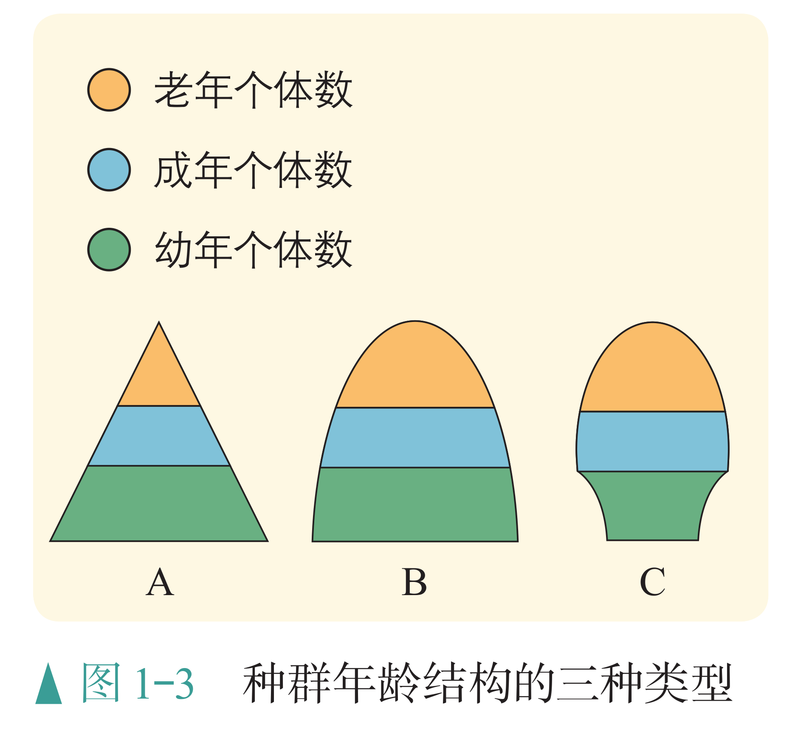
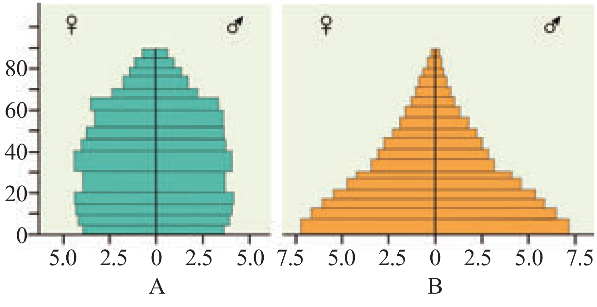
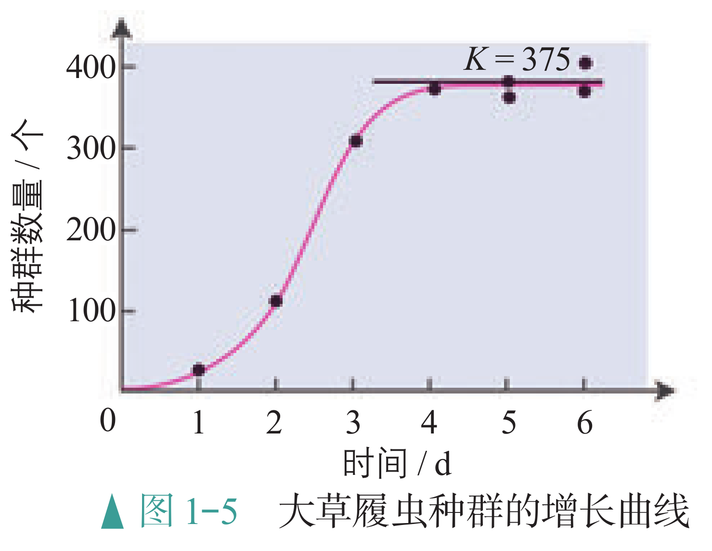

# 生态学概述

## 物种与进化

### 生态学的意义

生态学是研究生物与环境相互关系的科学，是自然科学的重要组成部分，它就是在研究生态系统的 What、How、Why，以及它的效应。

- What，就是研究生态系统的组成、结构和功能。

- How，就是研究生态系统各组分之间是如何工作的，也就是各组分之间的相互关系。

- Why，就是研究生态系统为什么会形成上述的组成、结构和功能。

生态系统的效应，是生态系统的服务功能，这主要是针对人类而言的，是现代农业的基础。生态文明建设是我国的重大战略之一。人类必须尊重自然、顺应自然、保护自然。这里的“自然”就是指生态环境。尊重自然就是要尊重生态学规律，顺应自然就是适应环境的变化，保护自然就是保护自然界的部分或整体。生态文明强调的是“和谐”而不是“妥协”，人类的能动性依然重要。生态文明并不是简单的返璞归真，而是依托当代先进的生产力，实现人与自然的和谐共生。

生态学是生态文明建设的科学支撑。生态学使人类认识了生态系统的结构、动态变化以及机制。只要尊重自然规律，在可允许的范围内操作，就可以既不损害自然，又能合理利用自然，促进自然和社会的协调。而生态文明建设会为生态学及相关学科提供发展的机会和平台，有利于推动科学的发展。

### 生态系统的组成

系统是指彼此间相互作用、相互依赖的组分有规律地结合而形成的整体。在自然界，生物个体都不是单独存在的，而是与其他同种和不同种的个体以及无机环境相互依赖、相互影响的。

- 在一定的空间范围内，同种生物的所有个体形成一个整体——**种群**，

- 不同种群相互作用形成更大的整体——**群落**，

- 群落与无机环境相互作用形成更大的整体——**生态系统**，

- 地球上所有的生态系统相互关联构成更大的整体——**生物圈**。

可见，自然界从生物个体到生物圈，可以看作各个层次的生命系统。

### 自然选择学说

适应作为一个生物学术语，包括两方面的含义：一是指生物的形态结构适合于完成一定的功能，二是指生物的形态结构及其功能适合于该生物在一定的环境中生存和繁殖。

适应是普遍存在的，是普遍性的，但是也具有相对性和局限性。

- **物种不变论**认为，各种生物都是自古以来就如此的。

- 拉马克彻底否定了物种不变论，提出当今所有的生物都是由更古老的生物进化来的，各种生物的适应性特征并不是自古以来就如此的，而是在进化过程中逐渐形成的。

    不过他认为适应的形成都是由于**用进废退和获得性遗传**：器官用得越多就越发达，比如食蚁兽的舌头之所以细长，是长期舔食蚂蚁的结果。器官废而不用，就会造成形态上的退化，比如鼹鼠长期生活在地下，视觉派不上用场，眼睛就萎缩、退化。这些因用进废退而获得的性状是可以遗传给后代的。
    
    拉马克提出的进化学说在当时是有进步意义的，但他对适应形成的解释是肤浅的，未被人们普遍接受。

- 达尔文提出的**自然选择学说**对生物的进化和适应的形成作出了合理的解释。他认为适应的来源是可遗传的变异，适应是自然选择的结果。

    { width="90%" }

    关于适应的形成，达尔文认为在一定环境的选择作用下，可遗传的有利变异会赋予某些个体生存和繁殖的优势，经过代代繁殖，群体中这样的个体就会越来越多，有利变异通过逐代积累而成为显著的适应性特征，进而出现新的生物类型。由此可见，群体中出现可遗传的有利变异和环境的定向选择是适应形成的必要条件。

    有学者认为，个体即使产生可遗传的有利变异，如果不能繁殖后代，在进化上也没有意义。因此主张将“适者生存”改为“适者繁殖”。

    达尔文以自然选择学说为核心的生物进化论使人们认识到，原来自然界的万千生物不是神灵预先设定好而永恒不变的，而是在自然选择的作用下不断发展变化的。这就使生物学第一次摆脱了神学的束缚，走上了科学的轨道。它揭示了生物界的统一性是由于所有的生物都有共同祖先，而生物的多样性和适应性是进化的结果。

受到当时科学发展水平的限制，达尔文对于遗传和变异的认识还局限于性状水平，不能科学地解释遗传和变异的本质。随着生物科学的发展，关于遗传和变异的研究，已经从性状水平深入到基因水平，人们逐渐认识到了遗传和变异的本质。关于适应以及物种的形成等问题的研究，已经从以生物个体为单位，发展到以种群为基本单位，这样就形成了以自然选择学说为核心的现代生物进化理论。

### 基因库与物种

自然选择直接作用的是生物的个体，而且是个体的表型。但是，在自然界，没有哪个个体是长生不死的，个体的表型也会随着个体的死亡而消失，决定表型的基因却可以随着生殖而世代延续，并且在群体中扩散。可见，研究生物的进化，仅研究个体和表型是不够的，还必须研究群体基因组成的变化。

种群是进化的基本单位，生活在一定区域的同种生物全部个体的集合叫作种群；一个种群中全部个体所含有的全部基因，叫作这个种群的基因库；在一个种群基因库中，某个基因占全部等位基因数的比值，叫作基因频率。

- 基因突变在自然界是普遍存在的。基因突变产生新的等位基因，这就可以使种群的基因频率发生变化。

- 达尔文曾明确指出，可遗传的变异提供了生物进化的原材料。现代遗传学研究表明，可遗传的变异来源于基因突变、基因重组和染色体变异。其中，基因突变和染色体变异统称为突变。

此外，突变的有害和有利也不是绝对的，这往往取决于生物的生存环境。

- 基因突变产生的等位基因，通过有性生殖过程中的基因重组，可以形成多种多样的基因型，从而使种群中出现多种多样可遗传的变异类型。

- 突变和重组都是随机的、不定向的，而在自然选择的作用下，具有有利变异的个体有更多的机会产生后代，种群中相应基因的频率会不断提高；相反，具有不利变异的个体留下后代的机会少，种群中相应基因的频率会下降。

因此，在自然选择的作用下，种群的基因频率会发生定向改变，导致生物朝着一定的方向不断进化。

抗药菌：一般情况下，一定浓度的抗生素会杀死细菌，但变异的细菌可能产生耐药性。在实验室连续培养细菌时，如果向培养基中添加抗生素，耐药菌有可能存活下来。滥用抗生素的现象十分普遍。

同种生物的不同种群，由于突变和选择因素的不同，其基因组成可能会朝不同的方向改变，导致种群间出现形态和生理上的差异。在遗传学和生物进化论的研究中，把能够在自然状态下相互交配并且产生可育后代的一群生物称为一个**物种**。

- 不同物种之间一般是不能相互交配的，即使交配成功，也不能产生可育的后代，这种现象叫作**生殖隔离**。例如，马和驴虽然能够交配，但是产生的后代骡是不育的，因此，马和驴之间存在生殖隔离，它们属于两个物种。

- 由于高山、河流、沙漠或其他地理上的障碍，每个物种总是分成一个个或大或小的群体，这些群体就是不同的种群，比如两个池塘中的鲤鱼就是两个种群。同种生物由于地理障碍而分成不同的种群，使得种群间不能发生基因交流的现象，叫作**地理隔离**。

地理隔离和生殖隔离都是指不同群体间的个体，在自然条件下基因不能自由交流的现象，这里统称为隔离。

- 这是达尔文在环球考察中观察到的现象：在加拉帕戈斯群岛上生活着 13 种地雀。这些地雀的喙差别很大，不同种之间存在生殖隔离。而在辽阔的南美洲大陆上，却看不到这 13 种地雀的踪影。

- 加拉帕戈斯群岛位于南美洲附近的太平洋中，由 13 个主要岛屿组成，这些岛屿与南美洲大陆的距离为数百千米。不同岛屿的环境有较大差别，比如岛的低洼地带，布满棘刺状的灌丛；而在只有大岛上才有的高地，则生长着茂密的森林。这些岛屿是 500 万年前由海底的火山喷发后形成的，比南美洲大陆的形成晚得多。

因此，可以推测这些地雀的共同祖先来自南美洲大陆，以后在各个岛屿上形成了不同的种群。

{ width="80%" }

加拉帕戈斯群岛的地雀是说明通过地理隔离形成新物种的著名实例。

- 这些地雀的祖先属于同一个物种，从南美洲大陆迁来后，逐渐分布到不同的岛屿上。由于各个岛上的地雀种群可能会出现不同的突变和基因重组，而一个种群的突变和基因重组对另一个种群的基因频率没有影响。

- 因此，不同种群的基因频率就会发生不同的变化。由于各个岛上的食物和栖息条件互不相同，自然选择对不同种群基因频率的改变所起的作用就有差别。

- 在一个种群中，某些基因被保留下来，而在另一个种群中，被保留下来的可能是另一些基因。久而久之，这些种群的基因库就会形成明显的差异，并逐渐出现生殖隔离。

- 生殖隔离一旦形成，原来属于一个物种的地雀，就成了不同的物种。由此可见，**隔离是物种形成的必要条件**。

物种形成本身表示生物类型的增加。同时，它也意味着生物能够以新的方式利用环境条件，从而为生物的进一步发展开辟新的前景。

在自然界，狮和虎是不可能相遇的。在动物园里，一般也将这两种动物分开圈养。近年来才出现将它们的幼崽放在一起饲养的做法，目的是获得有观赏价值的杂交后代——狮虎兽或虎狮兽。

### 生物进化理论

达尔文曾发现一种兰花长着细长的花距，其底部储存着花蜜。达尔文推测，这种花的形成绝不是偶然的，肯定存在这样的昆虫，它们生有同样细长的吸管似的口器，可以从花距中吸到花蜜。大约 50 年以后，研究人员果然发现了这样的蛾类昆虫。

关于捕食者在进化中的作用，美国生态学家斯坦利提出了“收割理论”：捕食者往往捕食个体数量多的物种，这样就会避免出现一种或少数几种生物在生态系统中占绝对优势的局面，为其他物种的形成腾出空间。捕食者的存在有利于增加物种多样性。

不仅不同种生物之间在进化上密切相关，生物的进化与无机环境的变化也是相互影响的。例如，地球上的原始大气中是没有氧气的，因此，最早出现的生物都是厌氧（进行无氧呼吸）的；最早的光合生物的出现，使得原始大气中有了氧气，这就为好氧生物的出现创造了前提条件。

不同物种之间、生物与无机环境之间在相互影响中不断进化和发展，这就是**协同进化**。通过漫长的协同进化过程，地球上不仅出现了千姿百态的物种，丰富多彩的基因库，而且形成了多种多样的生态系统。

生物多样性主要包括三个层次的内容：**遗传多样性**（**基因多样性**）、**物种多样性**和**生态系统多样性**。生物多样性的形成经历了漫长的进化历程。

- 就目前所掌握的证据来看，最早的生物化石是 35 亿年前的古细菌化石。在此之后大约 20 亿年的漫长岁月中，地球上的生物主要是海洋中种数不多的细菌（包括蓝细菌），它们都是原核生物。这一时期的生态系统是只有生产者和分解者的两极生态系统。

- 真核生物出现以后，有性生殖作为一种新的繁殖方式出现了。生物通过有性生殖，实现了基因重组，这就增强了生物变异的多样性，生物进化的速度明显加快，多细胞植物和动物的种类不断增多。

- 在 5.4 亿至 5.0 亿年前的寒武纪，海洋中有大量的无脊椎动物物种爆发式地迅速形成，这就是著名的寒武纪大爆发。大量的动物构成了生态系统的第三极——消费者，使生态系统具有更加复杂的结构。同热闹非凡的海洋生物世界相比，当时的陆地上却几乎没有生物。

- 大约在 4 亿年前，由于造山运动使海洋缩小，陆地扩大，一些海洋植物开始适应陆地生活，形成了原始的陆生植物，主要是蕨类植物。随后才出现了适应陆地生活的动物——原始的两栖类。

- 生物的登陆改变着陆地的环境，陆地上复杂的环境又为生物的进化提供了广阔的舞台，裸子植物和被子植物先后扮演了生产者中的主角，鸟类、哺乳类等成为地球上占优势的动物类群，复杂多样的陆地生态系统逐渐形成。

在进化过程中，许多物种由于不适应环境的变化而绝灭了。例如，在中生代“统治”地球达 1 亿年之久的各种恐龙，由于目前尚未定论的原因，在白垩纪末全部绝灭。恐龙的绝灭为哺乳类的兴盛腾出了空间，使生物进化翻开了崭新的一页。

人类也是生物进化的产物。大约 300 万年前，森林古猿的一支离开森林，告别树栖生活，走上了向现代人类进化的漫漫长路。在自然界的生存斗争中，人类凭借非凡的大脑、灵巧的双手和群体的力量，已经拥有了其他生物无可比拟的生存优势，并且对其他物种的进化产生了重要影响，不少物种由于人类活动的影响走向绝灭。我们须臾不能忘记的是，包括人类在内的所有生物都是在相互依存、相互制约中生存和发展的，人类的生存和发展始终受益于生物多样性，保护生物多样性就是保护人类自己。

以自然选择学说为核心的现代生物进化理论对自然界的生命史作出了科学的解释：

1. 适应是自然选择的结果；

2. 种群是生物进化的基本单位；

3. 突变和基因重组提供进化的原材料，自然选择导致种群基因频率的定向改变，进而通过隔离形成新的物种；

4. 生物进化的过程实际上是生物与生物、生物与无机环境协同进化的过程；

5. 生物多样性是协同进化的结果。

生物进化过程复杂而漫长，已经发生的，研究者无法目睹；将要发生的，研究者很难预知。因此，上面所概括的现代生物进化理论的要点，尽管已被学术界广为接受，却不意味着生物进化的一切奥秘都真相大白，而是仍有争论和疑点。

有些学者的研究表明，基因突变对生物适应性的影响并不是非益即害的，大量的基因突变是中性的，自然选择对这些基因突变不起作用，这些基因突变经过长期积累，会导致种群间遗传物质出现较大的差别。因此有人主张，决定生物进化方向的是中性突变的逐渐积累，而不是自然选择。更多学者则认为，基因突变并不都是中性的，有些基因突变反映在个体的性状上，与环境相适应的程度有差异，因此，不能否认自然选择的作用。

根据许多物种是在短时间内迅速形成的现象，有人提出物种形成并不都是渐变的过程，而是物种长期稳定与迅速形成新种交替出现的过程，其原因仍在探索中。

总之，生物的进化是如此复杂，现有的进化理论所不能解释的问题比已经解释的问题还要多。在这些理论中，以自然选择学说为核心的进化理论比其他学说的影响要广泛和深远，它仍然是以后各个方面研究的基础。同其他科学理论一样，生物进化理论不会停滞不前，而是在不断发展。

## 种群及其动态

### 种群密度及其调查

种群在单位面积或单位体积中的个体数就是种群密度，种群密度是种群最基本的数量特征。濒危动物保护、农田杂草状况调查、农林害虫的监测和预报、渔业上捕捞强度的确定等，都需要对种群密度进行调查研究。

- 逐个计数法：在调查分布范围较小、个体较大的种群时，可以**逐个计数**，如调查某山坡上的珙桐密度。

- 黑光灯诱捕法：在多数情况下，逐个计数非常困难，需要采取估算的方法。例如，对于有趋光性的昆虫，可以用黑光灯（波长在 365nm 左右的紫外线）进行灯光诱捕来估算它们的种群密度。

- 样方法：估算种群密度常用的方法之一是样方法：在被调查种群的分布范围内，随机选取若干个样方，通过统计每个样方内的个体数，求得每个样方的种群密度，以所有样方种群密度的平均值作为该种群的种群密度估算值。调查草地上蒲公英的密度，农田中某种昆虫卵的密度，作物植株上蚜虫的密度、跳蝻的密度等，都可以采用样方法。

    { width="80%" }

    计数方法：样方内和相邻两边及其夹角，一般来说计上不计下，计左不计右。

- 标记重捕法：许多动物的活动能力强，活动范围大，不宜用样方法来调查它们的种群密度。常用的方法之一是标记重捕法。这种方法是在被调查种群的活动范围内，捕获一部分个体，做上标记后再放回原来的环境，经过一段时间后进行重捕，根据重捕到的动物中标记个体数占总个体数的比例，来估算种群密度。

调查动物种群密度的常用方法，如样方法、标记重捕法，往往需要直接观察或捕捉个体。在调查生活在隐蔽、复杂环境中的动物，特别是猛禽和猛兽时，这些方法就不适用了。为此，科学家开发出一些不需要直接观察或捕捉，就能调查种群密度或种群数量的新方法。

- 在动物的栖息地布设若干台红外触发相机，恒温动物一靠近，就会触发相机自动拍摄照片或视频。经过一段时间，科学家利用计算机分析处理这些照片或视频，就能确定所调查动物的种群数量。运用这种方法，我国科学家持续对我国境内的东北虎、东北豹等濒危动物的数量进行监测。

- 不同动物的粪便具有不同的特征。先区分粪便来自哪种动物，再分析这种动物的粪便来自多少个个体，就可以获得种群的数量信息。例如，采集了大量大熊猫的粪便，通过分析其中的微卫星 DNA 分子标记，查明大熊猫的种群数量。

- 动物的声音也存在个体差异，成熟个体的声音特征往往可以长期保持稳定。因此，动物的声音可以作为一种非损伤、低干扰的标记，用于对不同个体进行识别，进而进行种群数量的监测。利用这种基于声音的个体识别技术，科学家成功地对鲸、长臂猿等哺乳动物以及鸮、秧鸡等鸟类开展了野外种群数量的监测。

种群密度反映了种群在一定时期的数量，但是仅靠这一特征还不能反映种群数量的变化趋势。要想知道种群数量的消长，还需要研究种群的其他数量特征。

### 种群密度的影响因素

种群密度是种群最基本的数量特征。种群的其他数量特征是影响种群密度的重要因素，其中**出生率**和**死亡率**、**迁入率**和**迁出率**直接决定种群密度，**年龄结构**影响出生率和死亡率，**性别比例**影响出生率，进而影响种群密度。

- 出生率是指在单位时间内新产生的个体数目占该种群个体总数的比值。一般来说，繁殖能力强的种群出生率高，种群增长快。

- 死亡率是指在单位时间内死亡的个体数目占该种群个体总数的比值。

- 对一个种群来说，单位时间内迁入或迁出的个体占该种群个体总数的比值，分别称为迁入率或迁出率。

种群的**年龄结构**是指一个种群中各年龄期的个体数目的比例（如左图），如果样本很大的话，通常还会把年龄结构和性别比例放在一起（如右图）。**性别比例**，又称性比，是指种群中雌雄个体数目的比例。性别比例对种群密度也有一定的影响。

{ width="75%" }

{ width="100%" }
图左（1-3）中 A 为增长型年龄结构；B 为稳定型年龄结构；C 为衰退型年龄结构。

男女性别比例以 100 名女婴所对应的男婴数目为结果，世界人口性别比例的正常值为 102 至 107。我国颁布禁止“非医学需要的胎儿性别鉴定”和“非医学需要的性别选择性人工流产”。

利用人工合成的性引诱剂诱杀某种害虫的雄性个体，改变了害虫种群正常的性别比例，就会使很多雌性个体不能完成交配，从而使该种害虫的种群密度明显降低。

### 种群数量及其模型

数学模型是用来描述一个系统或它的性质的数学形式。以时间为横坐标，细菌数量为纵坐标，画出某种群的增长曲线。这样的曲线图是数学模型的另一种表现形式。同数学公式相比，它能更直观地反映出种群的增长趋势。所得出的公式和增长曲线，通常只是对理想条件下数量增长的推测。

种群的“J”形增长：

- 自然界有类似细菌在理想条件下种群增长的形式，如果以时间为横坐标，种群数量为纵坐标画出曲线来表示，曲线则大致呈“J”形。

- 对一支试管中的培养液中的酵母菌逐个计数是非常困难的，可以采用抽样检测的方法：先将盖玻片放在血细胞计数板的计数室上，用吸管吸取培养液，滴于盖玻片边缘，让培养液自行渗入。多余的培养液用滤纸吸去。稍待片刻，待酵母菌全部沉降到计数室底部，将计数板放在载物台的中央，计数一个小方格内的酵母菌数量，再以此为根据，估算试管中的酵母菌总数。

- 模型假设：在食物和空间条件充裕、气候适宜、没有天敌和其他竞争物种等条件下，种群的数量每年以一定的倍数增长，第二年的数量是第一年的 $\lambda$ 倍。

- 数学模型： $t$ 年后种群数量为 $N_t = N_0 \lambda^t$，其中 $N_0$ 为该种群的起始数量，$t$ 为时间，$N_t$ 表示 $t$ 年后该种群的数量，$\lambda$ 表示该种群数量是前一年种群数量的倍数。

种群的“S”形增长：

- 如果遇到资源、空间等方面的限制，种群经过一定时间的增长后，数量趋于稳定，增长曲线呈“S”形。这种类型的种群增长称为“S”形增长。

- 一定的环境条件所能维持的种群最大数量称为环境容纳量，又称 $K$ 值。

    { width="40%" }

- 在自然界，当一种生物迁入一个条件适宜的新分布地时，初始阶段一般会出现较快增长，但是，资源和空间总是有限的。当种群密度增大时，种内竞争就会加剧，这就会使种群的出生率降低，死亡率升高。当死亡率升高至与出生率相等时，种群的增长就会停止，有时会稳定在一定的水平。可见，种内竞争对种群数量起调节作用。

{ width="100%" }

在自然界，有的种群能够在一段时期内维持数量的相对稳定。当种群长久处于不利条件下，如遭遇人类乱捕滥杀和栖息地破坏，种群数量会出现持续性的或急剧的下降。种群的延续需要有一定的个体数量为基础。当一个种群的数量过少，种群可能会由于近亲繁殖等而衰退、消亡。

### 种群数量的影响因素

非生物因素：在自然界，种群的数量变化受到阳光、温度、水等非生物因素的影响。非生物因素对种群数量变化的影响往往是综合性的。

- 森林中林下植物的种群密度主要取决于林冠层的郁闭度，即主要取决于林下植物受到的光照强度；

- 在温带和寒温带地区，许多植物的种子在春季萌发为新的植株，这主要是受气温升高的影响；

- 蚊类等昆虫在寒冷季节到来时一般会全部死亡，这主要是受气温降低的影响；

- 干旱缺水会使许多植物种群的死亡率升高，动物种群在寻找水源的过程中也常常发生个体的死亡，而对于东亚飞蝗来说，气候干旱正是其种群爆发式增长的主要原因。

- 春夏时节动植物种群普遍迅速增长，除气温升高外，日照延长、降水增多也是重要原因，而对于动物来说，食物日益充足也是导致种群增长的重要因素，这就涉及生物因素了。

生物因素：

- 随着种群的增长，种内竞争会加剧，从而使种群的增长受到限制，这说明种群数量的变化受到种群内部生物因素的影响。

- 在自然界，任何一个种群都与其他种群有着密切的关系，其中捕食与被捕食的关系、相互竞争的关系都是十分常见的。除顶级捕食者外，每种动植物都可能是其他某种生物的捕食对象，每种动物都需要以其他生物为食。如果食物匮乏，动物种群会出现出生率降低、死亡率升高的现象。

- 森林中不同植物竞争阳光和养分，草原上非洲狮与猎豹竞争猎物，这也会导致种群数量的变化。非洲狮和猎豹会在同一区域捕猎，有时，非洲狮会在猎豹杀死猎物后到来，赶走猎豹以获得剩余的食物；非洲狮还会杀死猎豹的幼崽，从而将猎豹的数量控制在一定范围内。

- 此外，作为宿主的动物被寄生虫寄生，细菌或病毒引起传染病，也会影响种群的出生率和死亡率等特征，进而影响种群的数量变化。

一般来说，食物和天敌等生物因素对种群数量的作用强度与该种群的密度是相关的。例如，同样是缺少食物，种群密度越高，该种群受食物短缺的影响就越大，因此，这些因素称为密度制约因素。而气温和干旱等气候因素以及地震、火灾等自然灾害，对种群的作用强度与该种群的密度无关，因此被称为非密度制约因素。例如，在遭遇寒流时，有些昆虫种群不论其种群密度高低，所有个体都会死亡。

种群研究的应用：研究种群的特征和数量变化的规律，在野生生物资源的合理利用和保护、有害生物的防治等方面都有重要意义。

- 在濒危动物的保护方面，只有通过调查获知种群密度、出生率和死亡率、性别比例、年龄结构等特征，以及影响该种群数量变化的因素，才能准确了解该种群的生存状态，预测该种群的数量变化趋势，进而采取合理的保护对策。

- 在渔业上，人们总是希望每年既能捕捞较多的鱼，又不危及来年的鱼产量，也就是希望长期获得较高的捕捞量。那么，怎样确定合适的捕捞量呢？这就需要研究捕捞量与种群数量变化之间的关系。从理论上说，“S”形增长的种群在种群数量达到 $K$ 值时，出生率与死亡率相等，这时即使不捕捞，种群数量也不会增加。研究表明，中等强度的捕捞有利于持续获得较大的鱼产量，捕捞后使鱼的种群数量处在 $K/2$ 左右。

- 在有害生物的防治方面，种群研究同样具有重要意义。例如，在鼠害发生时，既适当采用化学和物理的方法控制现存害鼠的种群数量，又通过减少其获得食物的机会等方法降低其环境容纳量，才能使鼠害得到有效防治。再如，对农林害虫的防治，如果一味依赖喷洒农药的方法，既造成环境污染，又伤及害虫的天敌；有效保护或引入天敌生物，则有利于将害虫数量控制在较低的水平。

大树杜鹃是一种集中分布于我国云南高黎贡山山区的高大乔木。它的分布范围很小，很难引种到其他地方，是濒危物种。大树杜鹃林下凋落物厚，种子难以散布到土壤基质层，因此在自然环境中发芽率很低；幼苗生长缓慢，要生长很长时间才能开花；植株耐寒能力弱，在 $\pu{-2^oC}$ 环境下会死亡，幼树死亡率高。

## 群落及其演替

### 群落的基本结构

### 群落的主要类型

### 群落的演替

## 生态系统及其稳定性

群落和它们所生活的无机环境相互关联，形成了一个统一的整体，这就是生态系统。

### 生态系统的基本结构

### 生态系统的能量流动

### 生态系统的物质循环

### 生态系统的信息传递

### 生态系统的稳定型

## 人与环境

一本生态学专著上写道：“当能预报未来时，生态学就变成一门预测性科学；当能决定未来时，生态学就变成了一门管理科学。”正如生态学巨匠马世骏后来高度概括的，生态学的实质就是协调生物与环境或个体与整体间的辩证关系，协调的实质是综合，是平衡，是和谐，是对立的统一。

### 自然资源概述

### 生态环境保护

### 对群落演替的影响

### 对生态系统的影响

### 生物多样性及其保护

### 生态工程及其实例

我国在修建青藏铁路时，不惜耗资修建了许多高架桥和涵洞。
