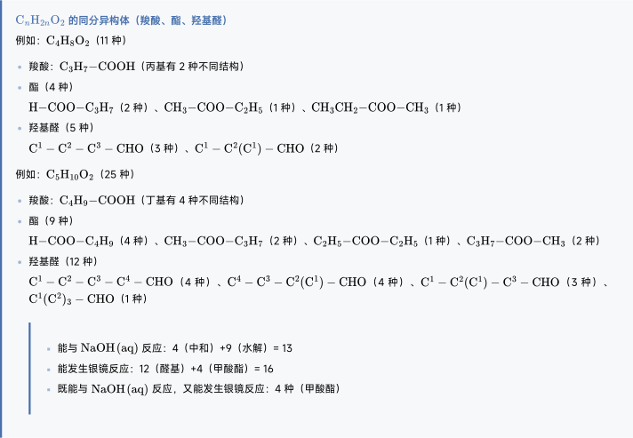
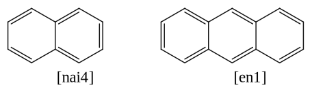
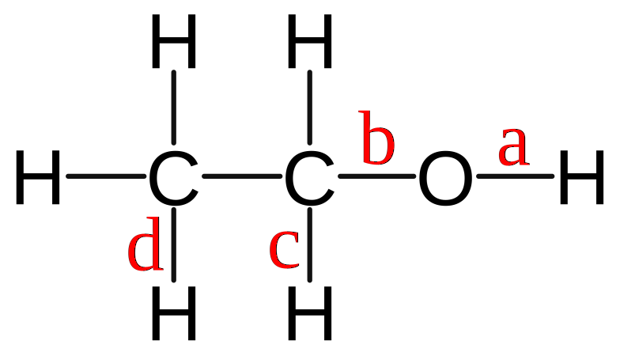

# 烃及烃的衍生物

$$
\gdef\phh{\htmlStyle{display:inline-block;vertical-align:middle;}{\includegraphics[height=3.1em]{../Ph_1.svg}}}
\gdef\phx#1{\htmlStyle{display:inline-block;vertical-align:middle;}{\includegraphics[height=3.1em]{../Ph_2.svg}}\!\ce{#1}}
\gdef\chem#1#2{\htmlStyle{display:inline-block;vertical-align:middle;}{\includegraphics[height=#2]{../#1.svg}}}
$$

## 按照物质

### 烷烃概述

我们熟悉的甲烷（$\ce{CH4}$）是最简单的有机化合物。其分子中的碳原子以最外层的 $4$ 个电子分别与 $4$ 个氢原子的电子形成了 $4$ 个 $\ce{C - H}$ 共价键。

实验数据表明，甲烷分子并非平面结构，而是呈正四面体空间构型。

- 碳原子位于正四面体的中心。
- $4$ 个氢原子分别位于 $4$ 个顶点。
- $4$ 个 $\ce{C - H}$ 键的长度和强度完全相同，任意两个 $\ce{C - H}$ 键之间的夹角均为 $\pu{109.5^\circ C}$。

与甲烷结构相似的有机化合物还有很多，随着分子中碳原子数的增加，还有乙烷、丙烷、丁烷等一系列有机化合物。这些化合物的碳链呈锯齿状或折线形。

烷烃分子中的碳原子都采取 $\text{sp3}$ 杂化，形成四面体结构；碳原子以 $\sigma$ 键与其他碳原子或氢原子结合；每个碳原子形成 $4$ 个共价单键；除甲烷外，烷烃分子中既有极性键，又有非极性键。

**烷烃**是只含有碳和氢两种元素，且分子中的碳原子之间都以单键结合，碳原子的剩余价键均与氢原子结合，使每个碳原子的化合价都达到“饱和”的一类链状有机化合物。

烷烃是一类最基础的有机化合物，广泛存在于自然界中。生活中的一些常见物质，如天然气、液化石油气、汽油、柴油、凡士林、石蜡等，主要成分都是烷烃。

烷烃的通式：如果链状烷烃中的碳原子数为 $n$，则氢原子数为 $2n+2$。其分子式可以用通式 $\ce{C_{n}H_{2n+2}}$ 表示。

| 碳原子数 | 名称  | 分子式           | 结构简式              |
| :------: | :---: | ------------ | ------------------ |
| $1$      | 甲烷  | $\ce{CH4}$      | $\ce{CH4}$           |
| $2$      | 乙烷  | $\ce{C2H6}$     | $\ce{CH3CH3}$        |
| $3$      | 丙烷  | $\ce{C3H8}$     | $\ce{CH3CH2CH3}$     |
| $4$      | 丁烷  | $\ce{C4H10}$    | $\ce{CH3(CH2)2CH3}$   |
| $11$     | 十一烷 | $\ce{C11H24}$   | $\ce{CH3(CH2)9CH3}$   |

丁烷甲烷、乙烷和丙烷的结构各只有一种，但丁烷（$\ce{C4H10}$）有两种同分异构体：

| 化合物   | 结构       | 熔点               | 沸点               |
| :------: | :--------: | :----------------: | :----------------: |
| 正丁烷   | 直链结构   | $\pu{-138.4^\circ C}$ | $\pu{-0.5^\circ C}$  |
| 异丁烷   | 带有支链   | $\pu{-159.4^\circ C}$ | $\pu{-11.6^\circ C}$ |

二者组成相同，但分子中原子的结合顺序不同，因此性质存在差异，是两种不同的化合物。

随着碳原子数的增加，烷烃的同分异构体数目迅速增多。例如，戊烷（$\ce{C5H12}$）有 $3$ 种同分异构体，己烷（$\ce{C6H14}$）有 $5$ 种，而癸烷（$\ce{C10H22}$）则有 $75$ 种之多。同分异构现象的广泛存在也是有机物种类繁多的重要原因之一。

烷烃的物理性质：

- 溶解性：烷烃均为难溶于水的无色物质。

- 熔沸点和密度：一般随着分子中碳原子数的增加（相对分子质量增大）而升高。

- 常温下，含 $1\sim4$ 个碳原子的烷烃为气态，之后逐渐转为液态，再到固态。

- 对于同分异构体，分支越多，沸点越低。

烷烃的化学性质：

- 在光照条件下，甲烷与氯气（$\ce{Cl2}$）发生一系列取代反应，甲烷分子中的氢原子逐步被氯原子取代，生成一系列产物。

- 反应现象：混合气体颜色逐渐变浅，试管壁出现油状液滴，试管内水面上升。

| 步骤 | 反应方程式 | 产物名称 | 沸点 |
| :-: | - | :-: | :-: |
| $1$ | $\ce{CH4 + Cl2 ->[\text{光}] CH3Cl + HCl}$ | 一氯甲烷 | $\pu{-24.2^\circ C}$ |
| $2$ | $\ce{CH3Cl + Cl2 ->[\text{光}] CH2Cl2 + HCl}$ | 二氯甲烷/二氯代烷 | $\pu{39.8^\circ C}$ |
| $3$ | $\ce{CH2Cl2 + Cl2 ->[\text{光}] CHCl3 + HCl}$ | 三氯甲烷/氯仿 | $\pu{61.7^\circ C}$ |
| $4$ | $\ce{CHCl3 + Cl2 ->[\text{光}] CCl4 + HCl}$ | 四氯甲烷/四氯化碳 | $\pu{76.5^\circ C}$ |

- 产物性质：这 $4$ 种氯代产物均不溶于水，其中三氯甲烷和四氯甲烷为重要的工业有机溶剂。

在通常情况下，烷烃的化学性质较稳定，与强酸、强碱或高锰酸钾（$\ce{KMnO4}$）等强氧化剂不发生反应，但在特定条件下，烷烃也会发生反应。

**氧化反应**：烷烃可在空气中完全燃烧，生成二氧化碳和水，并放出大量热，因此常用作燃料。

- 甲烷燃烧：$\ce{CH4 + 2O2 ->[\text{点燃}] CO2 + 2H2O}$。

- 丙烷燃烧：$\ce{C3H8 + 5O2 ->[\text{点燃}] 3CO2 + 4H2O}$。

高温分解：烷烃在一定条件（加热、加压、催化剂）下发生分解反应，可生成碳原子数较少的烷烃和烯烃，高温下还可能生成碳单质和氢气。

$$
\ce{C16H34 ->[加热加压][\cat] C8H18 + C8H16}\tag{\scriptsize\text{石油的裂化}}
$$

卤代烃：

- 氟利昂：化学式 $\ce{CCl2F2}$，是一种曾经常用的制冷剂。
- 状态：常温下卤代烃除 $\ce{CH3Cl}$、$\ce{CH3CH2Cl}$、$\ce{CH2=CHCl}$ 等少数是气体外，大多数为液体或固体。
- 溶解度：卤代烃不溶于水，可溶于有机溶剂。某些卤代烃本身是很好的有机溶剂。
- 密度：高于同碳原子数的烃，除脂肪烃的一氯代物和一氟代物密度比水小，其余的密度都比水大。密度随着烃基中碳原子数目的增加而减小，卤代烃的密度随碳原子数目的增加而减小。
- 熔沸点：熔沸点大于同碳个数的烃，随碳原子数增多，沸点依次升高（碳原子数相同时，支链越多沸点越低）。

溴乙烷：

- 物理性质：溴乙烷是无色液体，沸点为 $38.4\,^\circ\mathrm{C}$，密度比水大，难溶于水，可溶于多种有机溶剂。

- 溴乙烷的结构：分子式：$\ce{C2H5Br}$，结构简式：$\ce{CH3CH2Br}$。

- 在溴乙烷分子中，由于**溴原子的电负性比碳原子的大**，使 $\ce{C-Br}$ 的电子向 $\ce{Br}$ 原子偏移，进而使碳原子带部分正电荷（$\delta^+$），$\ce{Br}$ 原子带部分负电荷（$\delta^-$），这样就形成一个极性较强的共价键：$\ce{C^{\delta^+}-Br^{\delta^-}}$，其键长大而键能较小。因此在化学反应中，$\ce{C-Br}$ **较易断裂**，使碳原子与带负电荷的基团结合，$\ce{Br}$ 原子被其他原子或原子团所取代，生成负离子离去。

### 烯烃概述

乙烯的分子式为 $\ce{C2H4}$，其结构式为 $\ce{CH2 = CH2}$。

乙烯分子中含有碳碳双键（$\ce{C = C}$），这使得其在组成和结构上与只含碳碳单键和碳氢键的烷烃有较大差异。碳碳双键的存在使得乙烯表现出较活泼的化学性质。

由于其分子中的氢原子数少于同碳原子数的烷烃（乙烷 $\ce{C2H6}$），碳原子的价键没有全部被氢原子“饱和”，因此乙烯属于 **不饱和烃**。乙烯是一个平面型分子，所有 $6$ 个原子都处于同一平面内。

乙烯是一种无色、略带气味的气体，具有以下物理特性：

- **沸点**：$\pu{-104 ^oC}$；
- **熔点**：$\pu{-169 ^oC}$；
- **密度**：$\pu{1.25 g/L}$（比空气略小）。

由于密度小于空气，乙烯在实验室中可通过向下排空气法收集。

烯烃的化学性质：化学性质主要由碳碳双键（$\ce{C = C}$）决定。

### 醇酚概述

醇是羟基 $\ce{-OH}$ 直接与碳原子相连的有机物，按照所连的基团可以分为脂肪醇、脂环醇与芳香醇。

- 甲醇（$\ce{CH2OH}$ 木精）：无色、具有挥发性的液体易溶于水，沸点为 。甲醇有毒，误服会损伤视神经，甚至致人死亡。

- 乙二醇、丙三醇都是无色、粘稠、有甜味的液体，都易溶于水和乙醇，是重要的化工原料。

    - 乙二醇是汽车发动机防冻液的主要化学成分，也是合成涤纶等高分子化合物的主要原料。

    - 丙三醇具有很强的吸水能力，可用于制造日用化妆品。

物理性质：

- 沸点：

    饱和一元醇的熔沸点随分子中碳原子数的递增而逐渐增大。

    相对分子质量相近的醇和烷烃相比，醇的沸点远远高于烷烃的沸点（氢键的影响）。

    碳原子数相同时，羟基个数越多，醇的沸点越高。

- 溶解性：

    醇在水中的溶解度一般随分子中 碳原子数的增加而降低。
    
    羟基越多，溶解度越大。理解：烷基是憎水基，羟基是亲水基，接的烷基越多，使得羟基形成氢键导致溶解度增加的效果减弱，因此溶解性降低。

    甲醇、乙醇、丙醇、乙二醇、丙三醇等低级醇（碳数比较少的醇）可与水以任意比例混溶。

- 密度：醇的密度比水的密度小。

### 醛酮概述

甲醛：俗名蚁醛，最简单的醛类物质，是一种无色、有强烈刺激性气味的气体，易溶于水，质量分数为 $35\%\sim40\%$ 的水溶液叫做福尔马林，具有防腐和杀菌能力，常作防腐杀菌剂（消毒、浸制标本）；制药（农药、消毒剂），香料，染料；制造酚醛树脂、脲醛树脂、维纶等。

苯甲醛：苯甲醛是最简单的芳香醛，俗称苦杏仁油，是一种有苦杏仁味的无色液体。

分子中含相同碳原子数的饱和一元醛与饱和一元酮的分子式相同，结构不同，互为同分异构体。

### 羧酸概述

羧酸的物理性质：

- **溶解性**：分子中碳原子数在 4 以下的羧酸能与水互溶。随着分子中碳原子数的增加，一元羧酸在水中的溶解度迅速减小，甚至不溶于水（高级脂肪酸是不溶于水的蜡状固体）。
- **沸点**：羧酸分子间可以形成氢键，由于羧酸分子形成氢键的机会比相对分子质量相近的醇多，羧酸的沸点比相应的醇的沸点高，并且随着分子中碳原子数的增加，一元羧酸的沸点逐渐升高。

常见羧酸：

- **甲酸**（最简单的羧酸）：俗称蚁酸，是一种无色、有刺激性气味的液体，有腐蚀性，能与水、乙醇等互溶。甲酸在工业上可用作还原剂，在医疗上可用作消毒剂。甲酸中既有醛基，又有羧基，所以甲酸既具有醛的性质（银镜反应、与氢氧化铜反应、与高锰酸钾反应），又具有羧酸的性质（酸的通性、酯化反应）。
- **乙酸**：具有强烈刺激性气味的液体，纯净的乙酸又称为冰醋酸。
- **苯甲酸**：俗称安息香酸，是一种无色晶体，易升华，微溶于水，易溶于乙醇。其钠盐是常用的食品防腐剂。
- **乙二酸**：俗称草酸，是无色透明晶体，通常含有结晶水，可溶于水和乙醇，以钠盐或钙盐形式广泛存在于植物中。草酸钙难溶于水，是人体肾结石和膀胱结石的主要成分。乙二酸是化学分析中常用的还原剂。

### 胺腈概述

胺可以看作是氨分子中的氢原子被烃基取代的衍生物。胺的分子结构与氨气相似，都是三角锥形。

- 根据氨分子中一个、两个或三个氢原子被烃基取代的情况，将胺分为伯胺（一级胺）、仲胺（二级胺）、叔胺（三级胺）。

- 根据分子中氮原子所连烃基种类不同，胺可分为脂肪胺（如乙胺）和芳香胺（如苯胺）。

物理性质：

- 低级脂肪胺在常温下为气体，如甲胺、二甲胺、三甲胺、乙胺等，其他低级胺为液体。相对分子质量低的胺具有氨的气味，如三甲胺有鱼腥气味。

- 胺可形成分子间氢键，故沸点比相对分子质量相近的烷烃高，比相应的醇和羧酸低。低级胺能与水形成氢键而易溶于水，随着相对分子质量的增加，溶解度降低。

- 芳香胺是无色液体或固体，有特殊臭味，有毒，使用时应注意，避免芳香胺接触皮肤或吸入人体内而中毒。

## 按照官能团

有机化学中，碳氢化合物被划分为两类：脂肪族化合物和芳香族化合物。芳香族化合物指含有苯环或其它芳香环的烃类，而脂肪族化合物则与其相对，是指结构上不含芳香环的烃类。

烃又称碳氢化合物，是仅由碳和氢组成的有机化合物，包括**脂肪烃**（烷烃、烯烃、炔烃）及**芳香烃**，是许多其他有机化合物的基体。

杂原子指除去 $\ce{C}$ 和 $\ce{H}$ 的任何原子。某碳原子与杂原子成几条键，就处于几级氧化程度。
单键算 $1$ 根，双键算 $2$ 根，三键算 $3$ 根，下文中我们简记用 Z0, Z1, Z2, Z3 表示。

- 相同氧化程度的官能团之间，通常只需通过简单的非氧化还原反应（如水解、醇解、胺解、脱水等）即可相互转化。

- 不同氧化程度的官能团之间，其转化则必须使用氧化剂或还原剂。

注意：氧化程度与形式化的氧化态不同，氧化程度只关心碳与杂原子的成键数。

### Z0：脂肪烃

脂肪烃碳原子以**直链**、**支链**或**环状**排列，脂肪烃可以是烷烃、烯烃或炔烃。

| | 描述 | 通式 |
| :-: | - | -: |
| **烷烃** | 碳原子之间全部以单键结合 | $\ce{C_nH_{2n+2}}$（$n\ge1$） |
| **烯烃** | 分子中含有一个或多个碳碳双键 | $\ce{C_nH_{2n}}$（$n\ge2$） |
| **炔烃** | 分子中含有一个或多个碳碳三键 | $\ce{C_nH_{2n-2}}$（$n\ge2$） |

常温下，碳原子数 $\le4$ 时为气体；随碳原子数增多，熔沸点升高，密度增大，均难溶于水。

---

- **取代反应**：分子中的一个原子或原子团被其他原子或原子团取代。

    $$
    \begin{align}
    \ce{CH3CH3 + Cl2 &->[光照] CH3CH2Cl + HCl}\\
    \ce{CH3CH3 + \underset{液态溴}{Br2} &->[光照] CH3CH2Br + HBr}
    \end{align}
    $$

---

- **加成反应**：有双键或三键的物质中，重键打开，原来重键两端的原子各连接上一个新的基团。

    - 与卤素反应：将乙烯通入盛有溴的四氯化碳溶液（或溴水）的试管中，可以观察到溴的红棕色褪去。反应中，乙烯双键中的一个键断裂，两个溴原子分别加到两个价键不饱和的碳原子上，生成无色的 $1,2$-二溴乙烷（**工业上制备二氯代烃**）。

        $$
        \ce{CH2=CH2 + \underset{溴水}{Br2} -> CH2Br-CH2Br}
        $$

        其中 1,2-溴代乙烷 $\ce{CH2Br-CH2Br}$ 是无色液体，难溶于水，溶于四氯化碳。因此可使溴水或其四氯化碳溶液褪色，且不分层，该反应常用于：

        1.  **检验不饱和键**：检验物质中是否含有碳碳双键或三键。
        2.  **除去烯烃**：例如除去乙烷中混有的乙烯。

    - 与氢气反应：乙烯可以与氢气在催化剂和加热的条件下发生加成反应，生成乙烷。

        $$
        \ce{CH2 = CH2 + H2 ->[\text{催化剂}][\Delta] CH3-CH3}
        $$

        类似也可以与卤化氢反应（**工业制备单卤代烃**）：

        $$
        \ce{CH2 = CH2 + HCl ->[\text{催化剂}][\Delta] CH3-CH2Cl}
        $$

        也可以与氢氰酸反应，实现**实现碳链增长**：

        $$
        \ce{CH2 = CH2 + HCN ->[\text{催化剂}][\Delta] CH3-CH2CN}
        $$

    - 与水反应：乙烯与水在酸性催化剂作用下生成乙醇。

        工业上可以利用乙烯与水的加成反应制取乙醇（**工业制备一元醇**）。该反应需要在催化剂、加热和加压的条件下进行。

        $$
        \ce{CH2 = CH2 + H2O ->[\text{催化剂}][\text{加热、加压}] CH3CH2OH}
        $$

        乙烯分子中的碳碳双键（$\ce{C=C}$）在催化剂作用下断裂，与水分子中的氢原子和羟基（$\ce{OH}$）结合生成乙醇。

        通常使用酸性催化剂，如磷酸（$\ce{H3PO4}$）或硫酸（$\ce{H2SO4}$），以促进双键的开裂和加成反应的进行。

        反应过程中需严格控制水的用量，过量水可能引发副反应，生成醚（$\ce{(C2H5)2O}$）等副产物。此外，反应生成的乙醇浓度较低，需通过蒸馏等后续工艺提纯。

    - 炔烃同样可以加成，但是通常需要条件。

        $$
        \begin{align}
        \ce{CH#CH + HCl &->[\cat][\heat] CH2=CHCl}\\
        \ce{CH#CH + H2O &->[\cat][\heat] \underset{CH2=CH-OH}{CH3CHO}}
        \end{align}
        $$

!!! note "互变异构"
    其中 $(3)$ 符合**互变异构**（酮-烯醇互变异构），发生反应：

    $$
    \ce{CH2=CH-OH -> CH3CHO}
    $$

    该反应平衡常数较大，反应较为完全。

- 1,3-二烯烃的加成反应：

    $$
    \begin{align}
    \ce{CH2=CH-CH=CH2 + Br2 &->[高温][1,4-加成] ClCH2-CH(Cl)-CH=CH2}\\
    \ce{CH2=CH-CH=CH2 + Br2 &->[低温][1,2-加成] ClCH2-CH=CH-CH2Cl}
    \end{align}
    $$

---

- **加聚反应**：经加成反应形成高聚物的过程称为加成聚合反应，是含有不饱和键单体 $\pi$ 键断裂后加成聚合起来的反应。

    $$
    \begin{align}
    \ce{n CH2=CH2 &->[催化剂] \underset{聚乙烯}{\poly{CH2-CH2}}}\\
    \ce{n CH2\bond{3}CH2 &->[催化剂] \underset{聚乙炔}{\poly{CH2=CH2}}}
    \end{align}
    $$

- 二烯烃加聚：

    $$
    \ce{n CH2=CH-CH=CH2 ->[一定条件] \poly{CH2-CH=CH-CH2}}
    $$

- 烯烃共聚：

    $$
    \ce{n CH2=CH2 + n CH2=CH-CH3 ->[一定条件] \poly{CH2-CH2-CH(CH3)-CH2}}
    $$

---

- **氧化反应**：几乎所有的烃都可以燃烧。

    $$
    \begin{align}
    \ce{C2H4 + 3 O2 &->[点燃] 2 CO2 + 2 H2O}\\
    \ce{C_xH_y + $\left(x+\dfrac{y}{4}\right)$ O2 &->[点燃] x CO2 + \dfrac{y}{2} H2O}
    \end{align}
    $$

    完全燃烧：生成二氧化碳（$\ce{CO2}$）和水（$\ce{H2O}$）：

    不完全燃烧：氧气不足时，可能生成一氧化碳（$\ce{CO}$）或炭黑（$\ce{C}$）。
    
- 与高锰酸钾反应：

    与醇的催化氧化类似（：

    $$
    \begin{align}
    \ce{CH2=CH2 &->[KMnO4][H+] CO2}\\
    \ce{R-CH=CH2 &->[KMnO4][H+] R-COOH}\\
    \ce{(CH3)2C=C(CH3) &->[KMnO4][H+] CH3C(O)CH3}
    \end{align}
    $$

    此反应常用于检验碳碳双键的存在。

    而炔烃的高锰酸钾氧化也类似（内部炔烃、末端炔烃、乙炔）：

    $$
    \begin{align}
    \ce{R-C#C-R' &->[KMnO4][H+] R-COOH + R'-COOH}\\
    \ce{R-C#C-H &->[KMnO4][H+] R-COOH + H2O + CO2}\\
    \ce{H-C#C-H &->[KMnO4][H+] H2O + 2CO2}
    \end{align}
    $$

    值得注意的是，以上描述的是强氧化条件（酸性、加热），如果使用温和的氧化条件，例如冷、稀、中性或碱性的高锰酸钾溶液（拜耳试剂），反应则完全不同：

    双键不会断裂，而是在双键的位置加上两个羟基，生成邻二醇。

    $$
    \ce{CH2=CH2 ->[冷、稀 KMnO4] HO-CH2-CH2-OH}
    $$

### Z0：芳香烃

**芳香烃**简称芳烃，为苯及其只含碳与氢的衍生物的总称，指分子结构中含有一个或者多个苯环的烃类化合物，最简单和最重要的芳香烃是苯及其同系物。芳烃可分为：**单环芳烃**、**稠环芳烃**，而具有链状的芳香烃一般称之为**脂芳烃**。

{ width="70%" }

**苯**，为最简单的一种芳香烃，芳香族化合物皆由其衍生而成。苯结构是一个平面正六边形分子，碳原子以 $\text{sp2}$ 轨道键结，所以任二键互成 $\pu{120^o}$。苯的含碳量很高，在空气中燃烧产生明亮并带有浓烟的火焰。

- 无色透明液体，有特殊气味；
- 微溶于水，能与多种有机溶剂互溶；
- 沸点 $80^\circ\mathrm{C}$，熔点 $5.5^\circ\mathrm{C}$，常温下密度为 $0.88\mathrm{g/cm^3}$；
- 易挥发，有毒，具有致癌性。

- **凯库勒式**：凯库勒年提出了苯环单键、双键交替排列、无限共轭的结构。后来，他又提出了苯中的双键并不是固定的，而是会借由共振，产生介于单键与双键之间的键长，以圆圈型的符号表示代表苯中电子的未定域化。

- **鲍林式**：苯环的另一种常见画法是内部带有圆圈的正六边形，圆圈强调了 $6$ 个 $\pi$ 电子的离域作用和电子云的均匀分布，这很好的解释了碳碳键长均等性和苯环的完全对称性。但是这种方式用来表示其他芳香体系，如两个稠合的苯环，萘，容易造成误解。

化学性质：

- **取代反应**：苯可以发生的取代反应有**卤代反应**、**硝化反应**、**磺化反应**等。

    $$
    \begin{align}
    \ce{\phh + \underset{液态溴}{Br2} &->[FeBr3] \phx{Br} + HBr}\\
    \ce{\phh + \underset{HNO3}{HO-NO2} &->[浓硫酸][50\sim60\pu{^oC}] \underset{硝基苯}{\phx{NO2}} + H2O}\\
    \ce{\phh + \underset{H2SO4}{HO-SO3H} &<=>[浓硫酸][70\sim80\pu{^oC}] \underset{苯磺酸}{\phx{SO3H}} + H2O}
    \end{align}
    $$

- **加成反应**：苯与氢气加成反应生成环己烷，与氯气加成生成 $\ce{C6H6Cl6}$（六六六，一种农药）。

    $$
    \ce{\phh + 3H2 ->[Ni][180\sim250\pu{^oC}] \chem{C6H12}{3.1em}}
    $$

    $$
    \ce{\phh + 3Cl2 ->[光照] \chem{C6H6Cl6}{3.1em}}
    $$

苯的同系物：分子里含有一个苯环的烃，通式为 $\ce{C_nH_{2n-6}}$（$n\ge6$）。

- 由于苯环和侧链的相互影响，使苯的同系物也有一些化学性质跟苯不同。甲苯比苯活泼的多，可以与高锰酸钾反应。

- 同时，甲苯中的甲基活化了苯的邻、对位，和浓硝酸、浓硫酸混合酸发生更彻底的硝化反应（苯的硝化通常只进行一步），生成 2,4,6-三硝基甲苯（简称三硝基甲苯，TNT 是一种难溶于水的淡黄色针状晶体）。

    $$
    \ce{\phx{CH3} + 3HO-NO2 ->[浓硫酸][\heat] 3H2O + \chem{TNT}{6.2em}}
    $$

- 我们知道 TNT 是一种烈性炸药，平时比较稳定，即使受热或撞击也不易爆炸，但是在有敏感的起爆剂如雷酸汞 $\ce{Hg(ONC)2}$ 等引爆的情况下，就能发生猛烈的爆炸。

**氧化反应**：对于苯的同系物，和苯环直接相连的碳原子上有氢原子时（苄基氢），能被酸性高锰酸钾溶液氧化，使酸性高锰酸钾溶液褪色。

$$
\ce{\phx{CH(R)(R')} ->[KMnO4][H+] \phx{COOH}}
$$

这样直接将其他支链扔掉，氧化为苯甲酸；如果苯上有其他支链，则同样氧化。

**卤代反应**：在光照条件下，甲苯与氯气发生取代反应时，氯原子取代甲基上的氢原子。反应后可能的有机产物是甲基上的氢原子分别被 $1$ 个、$2$ 个或 $3$ 个氯原子取代所生成的氯甲基苯。

在氯化铁的催化下，甲苯与氯发生取代反应生成的一氯代甲苯主要有两种：邻氯甲苯和对氯甲苯。甲基的存在活化了苯环上处于甲基邻位和对位的氢原子，使相应的碳氢键更容易断裂，发生取代反应。

**稠环芳香烃**：又称多环芳香烃，是由两个或两个以上的苯环通过共用相邻的碳原子而形成的芳香烃。

{ width="50%" }

- 萘^[nai4]^是一种无色片状晶体，有特殊的气味，不溶于水、易升华，有毒性，可以用来杀菌、防蛀、驱虫。

- 蒽^[en1]^是一种无色晶体，易升华，是生成染料的重要原料。

### Z1：卤代烃

卤代烃的官能团为碳卤键（卤素原子），通式为 $\ce{RX}$，除 $\ce{CH3Cl}$ 外基本上都为液体或固体。卤代烃通常也不溶于水、可溶于有机溶剂，密度、沸点都大于相应的烃。

- **取代反应**：卤代烃在水溶液中，在氢氧化钠的作用下发生**水解反应**。

    $$
    \ce{CH3CH2Br + NaOH ->[水][\heat] CH3CH2OH + NaBr}
    $$

- **消去反应**：卤代烃在乙醇等有机溶液中，在氢氧化钠的作用下发生消去反应，脱下一卤一氢。

    $$
    \ce{CH3CH2Br + NaOH ->[乙醇][\heat] CH2=CH2 ^ + NaBr + H2O}
    $$

- 检验卤代烃中的卤素原子：

    $$
    \ce{RX ->[NaOH(aq)][\heat] NaX(OH-) ->[HNO3] NaX(H+) ->[AgNO3] AgX}
    $$

    根据沉淀颜色判断氯、溴、碘离子。

### Z1：醇和酚

**醇**是羟基 $\ce{-OH}$ 与烃基相连的化合物，通式为 $\ce{ROH}$，而根据羟基所连接碳原子的类型，分为伯醇 $\ce{R-CH2-OH}$、仲醇 $\ce{R-CH(R1)-OH}$、叔醇 $\ce{R-C(R1)(R2)-OH}$，前面的更容易被氧化，我们将在催化氧化处详细解释。

一般来说，饱和一元烃随分子中碳原子数增加，沸点逐渐升高。分子中羟基越多，越容易形成更多的氢键，沸点越高，且远远高于相近分子量的烷烃。同样因为氢键，醇的水溶性好，甲醇、乙醇、丙醇均与水互溶。

{ width="40%" }

在乙醇 $\ce{CH3CH2OH}$ 中，因为氧原子电负性强，电子云密度大，因此 $a,b$ 两键容易断裂，同时也活化了 $c,d$ 两键，容易发生如下化学反应：

- **置换反应**：与活泼金属反应，例如与钠的反应，此反应现象没有与水的反应剧烈：

    $$
    \ce{2CH3CH2OH + 2Na -> 2CH3CH2ONa + H2 ^}
    $$

    产物乙醇钠在水中强烈水解。

- **取代反应**：与氢溴酸等发生反应，断掉 $b$ 键，羟基与氢原子结合，生成卤代烃。

    $$
    \ce{CH3CH2OH + HBr ->[\heat] CH3CH2Br + H2O}
    $$

- **聚合反应**：分子间可以脱水，一个脱去羟氢，一个脱去羟基。

    $$
    \ce{CH3CH2\boxed{\ce{OH + H}}OCH3CH2 ->[浓硫酸][\pu{140^oC}] \underset{乙醚}{CH3CH2OCH3CH2} + H2O}
    $$

- **消去反应**：分子内 $b,d$ 断裂，发生经典的消去反应。

    $$
    \ce{CH3CH2OH ->[浓硫酸][\pu{170^oC}] CH2=CH2 ^ + H2O}
    $$

- **酯化反应**：我们将在酯化反应一节中详细解释，酸去羟基醇去氢。

    $$
    \ce{CH3CO\boxed{\ce{OH + H}}OCH3CH2 <=>[浓硫酸][\heat] \underset{乙酸乙酯}{CH3COOCH3CH2} + H2O}
    $$

- **氧化反应**：在铜或银的催化下，与氧气反应（实际上是与氧化铜反应）生成乙醛。

    $$
    \ce{2CH3CH2OH + O2 ->[Cu][\heat] 2CH3CHO + 2H2O}
    $$

    同时，乙醇能被酸性高锰酸钾溶液直接氧化为乙酸。

!!! note "醇的催化氧化"
    与羟基相连的碳称为 $\ce{\alpha-C}$，与 $\ce{\alpha-C}$ 相连的氢称为 $\ce{\alpha-H}$。

    - 如果醇没有 $\ce{\alpha-H}$（叔醇），那么无法被催化氧化。

    - 如果有一个 $\ce{\alpha-H}$（仲醇），那么可以被氧化为酮。

        $$
        \ce{OH-CH(R1)(R2) -> O=C(R1)(R2)}
        $$

    - 如果有两个 $\ce{\alpha-H}$（伯醇）或者是甲醇，那么可以被氧化生成醛。

        $$
        \ce{R-CH2OH -> R-CHO}
        $$

    - 伯醇、醛可以被酸性高锰酸钾溶液氧化为酸。

- 特殊的，如果一个碳原子上连了两个羟基，那么其脱掉一分子水变为醛或酮，更特殊的，如果连了三个羟基那么变为羧酸。

    甲醛（$\ce{HCHO}$）是唯一一个在水溶液中主要以偕二醇形式存在的简单醛。

    $$
    \ce{H2C=O + H2O <=> \underset{甲二醇}{H2C(OH)2}}
    $$

    在水溶液中，超过 $99.9\%$ 的甲醛是以甲二醇的形式存在的。这是因为甲醛的羰基碳位阻最小，且反应性很高，容易被水攻击。

**酚**是羟基与苯环直接相连形成的化合物，最简单的酚为本分 $\ce{C6H6O}$。

$$
\phx{OH}
$$

纯净的苯酚是无色晶体，易溶于乙醇等有机溶剂，常温下在水中溶解度不大，温度高于 $\pu{65^oC}$ 时能与水混溶。久置的苯酚呈粉红色，是部分苯酚被空气中的氧气氧化所致。

- **酸性**：与醇类似，羟基和苯环互相作用，羟基容易解离出氢离子，俗称石炭酸，酸性比碳酸弱，苯酚水溶液不能使酸碱指示剂变色。

    $$
    \ce{\phx{OH} <=> H+ + \phx{O-}}
    $$

    类似可以推出与钠、氢氧化钠的反应。

- **取代反应**：与甲苯类似，与溴水反应，生成 2,4,6-三溴苯酚（简称三溴苯酚）。

    $$
    \ce{\phx{OH} + \underset{溴水}{3Br2} -> \chem{C6H6Br3O}{6.2em} v + 3HBr}
    $$

- **加成反应**：镍作为催化剂加热，与氢气反应加成，生成环己醇。

    $$
    \ce{\phx{OH} + 3 H2 ->[Ni][\heat] \chem{C6H12O}{3.1em}}
    $$

- 酚遇 $\ce{FeCl3}$ 变为紫色，称为显色反应。苯酚易被 $\ce{O2},\ce{KMnO4(H+)}$ 氧化。

| 基团 | 醇羟基 | 酚羟基 | 羧基 |
| - | :-: | :-: | :-: |
| 酸碱性 | 中性 | 弱酸性 | 弱酸性 |
| 与 $\ce{Na}$ | 反应 | 反应 | 反应 |
| 与 $\ce{NaOH}$ | 不反应 | 反应 | 反应 |
| 与 $\ce{Na2CO3}$ | 不反应 | 反应 | 反应 |
| 与 $\ce{NaHCO3}$ | 不反应 | 不反应 | 反应 |

### Z1：醚和胺

**醚**：通式为 $\ce{R1-O-R2}$，称为醚键。

**胺**：通式为 $\ce{R-NH2}$，其中 $\ce{-NH2}$ 称为氨基。胺的化学性质与氨气类似，具有一定的碱性。

$$
\ce{\phx{NH2} + HCl -> \phx{NH3Cl}}
$$

### Z2：醛和酮

**醛**：通式为 $\ce{RCHO}$，最简单的醛为甲醛 $\ce{HCHO}$，下面以乙醛 $\ce{CH3CHO}$ 为例。

{ width=100px }

- **氧化反应**：

    新制氢氧化铜即为斐林试剂，需要在碱性环境中加热，产生砖红色的氧化亚铁沉淀。

    $$
    \ce{CH3CHO + 2Cu(OH)2 ->[\text{加热}] CH3COOH + Cu2O v + 2H2O}
    $$

    银镜反应：

    - 利用醛基的还原性，将银离子还原为金属银，银在试管内壁形成光亮的银镜，称为银镜反应，可用于在玻璃表面镀银制镜。

        $$
        \begin{align}
        \ce{2 Ag+ + 2 OH- &-> Ag2O + H2O}\\
        \ce{Ag2O + H2O + 4NH3 &-> 2[Ag(NH3)2]OH}\\
        \ce{CH3CHO + 2[Ag(NH3)2]OH &-> H2O + 2Ag v + 3NH3 \\&\qquad + CH3COONH4}\\
        \end{align}
        $$

        简记为：水银铵，123，再加一个羧酸铵。

    - 试管内壁必须洁净、银氨溶液现用现配、醛用量不宜太多，如乙醛一般一滴。

    - 水浴加热，不可用酒精灯直接加热、银镜可用稀硝酸浸泡洗涤除去。

    酸性高锰酸钾，以及重铬酸钾等强氧化剂可以将醛，甚至是醇直接氧化到酸。

    $$
    \ce{CH3CHO + \underset{溴水}{Br2} + H2O -> CH3COOH + 2HBr}
    $$

    工业上常用这个反应来制取乙酸。

    $$
    \ce{CH3CHO + O2 ->[催化剂] CH3COOH}
    $$

- **加成反应**：由于碳氧双键（羰基）的存在，可以与氢气、氢氰酸等发生加成带，正电的结合在氧上。

    $$
    \begin{align}
    \ce{CH3CHO + H2 &->[催化剂][\heat] CH3CH2OH}\\
    \ce{CH3CHO + HCN &->[催化剂] CH3CH(CN)(OH)}
    \end{align}
    $$

**酮**，通式为 $\ce{R1-C(=O)-R2}$，最简单的酮是丙酮 $\ce{CH3C(O)CH3}$。

- **加成反应**：由于碳氧双键（羰基）的存在，可以与氢气、氢氰酸等发生加成带，正电的结合在氧上。

    $$
    \begin{align}
    \ce{CH3C(O)CH3 + H2 &->[催化剂][\heat] CH3CH(OH)CH3}\\
    \ce{CH3C(O)CH3 + HCN &->[催化剂] CH3C(OH)(CN)CH3}\\
    \ce{CH3C(O)CH3 + RNH2 &->[催化剂][\heat] CH3C(OH)(NHR)CH3}
    \end{align}
    $$

### Z3：羧酸和腈

有机酸是指一些具有酸性的有机化合物，最常见的有机酸是羧酸（$\ce{R-COOH}$），其酸性源于羧基（$\ce{-COOH}$）。磺酸（$\ce{R-SO3H}$）、亚磺酸（$\ce{R-SOOH}$）、硫羧酸（$\ce{R-SH}$）等也属于有机酸。

**羟酸**，通式为 $\ce{RCOOH}$，甲酸 $\ce{HCOOH}$ 又称蚁酸，乙酸又称醋酸为醋的主要成分，苯甲酸用于防腐和药物，乙二酸 $\ce{HOOCCOOH}$ 称为草酸。

- **酸性**：羧酸通常为弱酸，羧基可以解离出氢离子。

    $$
    \ce{RCOOH <=> H+ + RCOO-}
    $$

- **取代反应**：与醇发生酯化反应，生成酯；类似的，与胺反应，生成酰胺。

    $$
    \ce{RCO\boxed{\ce{OH + H}}OR' <=>[浓硫酸][\heat] RCOOR' + H2O}
    $$

    简记为，酸去羟基醇去氢。

    $$
    \ce{RCO\boxed{\ce{OH + H}}NHR ->[\heat] RCONHR + H2O}
    $$

    简记为，酸去羟基胺去氢。

- **还原反应**：羧酸可以被强还原剂（如四氢化锂铝 $\ce{LiAlH4}$）还原为醇。该反应通常在无水条件下进行。

    $$
    \ce{R-COOH ->[LiAlH4][\text{无水}] R-CH2OH}
    $$

- **$\alpha-\ce{H}$ 被取代反应**：羧酸分子中与羧基相邻的 $\alpha-\ce{H}$ 较活泼，易被卤素取代。常见如卤素（$\ce{Cl2}$）在催化剂作用下取代 $\alpha-\ce{H}$，生成 $\alpha$-卤代羧酸。

    $$
    \ce{R-CH2COOH + Cl2 ->[\text{催化剂}][\heat] R-CHClCOOH + HCl}
    $$

**酯**是羧酸分子中的羟基被 $\ce{-OR'}$ 取代后的产物，$\ce{RCOOR'}$ 可称为某酸（由 $\ce{R}$ 决定）某酯（由 $\ce{R'}$ 决定）。

- **水解反应**：在酸性条件下，浓硫酸催化；碱性条件下加热即可反应。

    $$
    \begin{align}
    \ce{RCOOR' &+ H2O <=>[浓硫酸][\heat] RCOOH + HOR'}\\
    \ce{RCOOR' &+ NaOH ->[\heat] RCOONa + HOR'}
    \end{align}
    $$

    用脂肪与氢氧化钾反应，即可得到高级脂肪酸的钠盐，得到肥皂，称为皂化反应。

**酰胺**是羧酸分子中的羟基被氨基 $\ce{-NH2}$ 取代后的产物，通式为 $\ce{RCONH2}$。

- **水解反应**：一般条件下不反应，在强酸强碱存在时，加热可水解。

    $$
    \begin{align}
    \ce{RCONH2 + H3O+ &->[\heat] RCOOH + NH4+}\\
    \ce{RCONH2 + OH- &->[\heat] RCOO- + NH3}
    \end{align}
    $$

**酰卤**是羧酸分子中的羟基被卤素原子取代后的产物，通式为 $\ce{RCOX}$。

**腈**，含有氰基的有机化合物，通式为 $\ce{R-C#N}$ 或 $\ce{R-CN}$。

## 有机化学实验

### 乙烯的制取

反应原理：

$$
\ce{CH3CH2OH ->[浓硫酸][\pu{170^oC}] CH2=CH2 ^ + H2O}
$$

{ width=30% }

1. 乙醇和浓硫酸的体积比为 $1:3$，加入沸石或碎瓷片防止暴沸。

2. 浓硫酸起催化剂和脱水剂的作用，制得的乙烯中可能混有 $\ce{CO2},\ce{SO2}$ 等。

3. 为了除去产品中的上述杂志和挥发的乙醇，可用 $\ce{NaOH}$ 溶液除去。

### 乙炔的制取

反应原理：

$$
\ce{CaC2 + 2H2O -> CH#CH + Ca(OH)2}
$$

{ width=30% }

1. 碳化钙是电石的主要成分，反应后可能有 $\ce{H2S},\ce{PH3}$ 等杂志，可用 $\ce{CuSO4}$ 溶液除去。

    

2. 制取乙炔不能使用启普发生器 或具有启普发生器原理的装置，原因如下：

    1. 碳化钙与水反应剧烈，不能随时停止；
    2. 反应过程中放出大量的热，易使得启普发生器炸裂；
    3. 生成的氢氧化钙呈糊状，易堵塞球形漏斗。

3. 为了得到平稳的乙炔气流，常用饱和食盐水代替水，用分液漏斗控制滴加速度。

### 溴苯的制取

反应原理：

$$
\ce{\phh + \underset{液态溴}{Br2} ->[FeBr3] \phx{Br} + HBr}
$$

- 把苯和少量液态溴放在烧瓶里，加入少量铁屑，铁屑与溴反应生成 $\ce{FeBr3}$ 作为催化剂。

- 常温下，反应生成的溴化氢遇水蒸气生成白雾，烧瓶底部产生溴苯，溴苯的密度比水大、且不溶于水，溴溶解在溴苯中，使溴苯呈现褐色。

- 不能通过将产物气体通入 $\ce{AgNO3}$ 溶液产生淡黄色沉淀来判断反应的发生，因为产物中含有杂质 $\ce{Br2}$ 蒸气（可用 $\ce{CCl4}$ 洗气）。

### 苯的硝化反应

反应原理：

$$
\ce{\phh + \underset{HNO3}{HO-NO2} ->[浓硫酸][50\sim60\pu{^oC}] \phx{NO2} + H2O}
$$

- 在试管内先加入少量浓硝酸和浓硫酸，摇匀并冷却到 $50\sim60\pu{^oC}$ 左右，在 $60\pu{^oC}$ 的水浴中加热，慢慢滴加少量苯，继续加热可以看到有一种油状物产生，即硝基苯 $\ce{C6H5NO2}$。

- 硝基苯是一种没有颜色的油状液体，有苦杏仁味，密度比水大，难溶于水，易溶于乙醇和乙醚，有毒。

    $$
    \ce{PhNO2 + 3Fe + 6HCl -> PhNH2 + 3FeCl2 + 2H2O}
    $$

    硝基苯可以被还原为苯胺，苯胺是重要的工业原料。

### 乙酸乙酯的制取

反应原理：

$$
\ce{CH3COOH + HOCH2CH3 <=>[浓硫酸][\heat] CH3COOCH2CH3 + H2O}
$$

{ width=30% }

1. 试剂的加入顺序为乙醇、浓硫酸和冰醋酸（乙酸），不能先加浓硫酸，浓硫酸作催化剂、吸水剂。
2. 导气管不能插入饱和碳酸钠溶液中，防止倒吸，饱和碳酸钠溶液的作用：吸收乙醇、中和乙酸、降低乙酸乙酯的溶解度。

## 有机推理推断

### 反应类型总结

**取代反应**：有机物分子里的某些原子或原子团被其他原子或原子团所替代的反应。

- **卤代反应**：

    以烷烃为代表的 $\text{sp3}$ 杂化的碳上的氢原子的光卤代。

    苯与甲苯的卤代：

    - 苯和液态溴在三溴化铁催化下可以发生反应，生成溴苯。

    - 在三氯化铁的催化下，甲苯与氯反应生成邻氯甲苯或对氯甲苯（光照情况下甲基发生光卤代）。

    苯酚稀溶液的试管里逐滴加入过量饱和的溴水，产生白色沉淀。

    醇与浓的氢卤酸，生成卤代烃和水。

- **硝化反应**与**磺化反应**：

    苯与浓硝酸在浓硫酸催化下反应生成硝基苯。

    笨与浓硫酸反应生成苯磺酸。

    甲苯与浓硝酸在浓硫酸催化下反应主要生成三硝基甲苯（甲基的邻对位）。

- **脱水反应**与**水解反应**：

    醇分子间脱水成醚：$\ce{R-OH + HO-R' -> R-O-R'}$。

    酯化反应与合成酰胺反应：酸脱羟基，醇 / 氨去氢。

    酯类的水解：在酸或碱催化的条件下，酯可以发生水解反应生成相应的酸和醇。酯的水解反应是酯化反应的逆反应。在碱性条件下，化学平衡正向移动，使酯的水解程度加大。
    
    油脂的碱性水解又称为**皂化反应**。酰胺的水解，如果是碱性水解则生成氨气。

    卤代烃在水溶液中与氢氧化钠反应生成醇和卤化钠（注意在醇溶液中发生消去反应生成水和烯烃）。

    多糖、蛋白质等大分子有机物的脱水与水解。

**加成反应**：有机物分子中的不饱和键两端的两个原子与其他原子或原子团直接结合，生成新的化合物的反应叫做加成反应。

- 碳碳双键、三键等 $\pi$ 键、离域大 $\pi$ 键：烯烃、炔烃、苯的加成。

- 碳氧双键（醛与酮）的加成：生成醇，为经典的还原反应。

- 油脂的氢化或硬化：油脂生成脂肪。

- 注意烯醇与醛（例如乙醛、乙烯醇）的互变异构。

**聚合反应**：详见高分子。

- **缩聚反应**：通过取代反应实现的聚合反应。

- **加聚反应**：通过加成反应实现的聚合反应。

**消去反应**：以醇为代表的羟基 $+\beta-\ce{H}$，马氏规则。

**氧化反应**：脱氢加氧为氧化。

- 燃烧。

- 醇的催化氧化：羟氢 $+\alpha-\ce{H}$。

- 醛到酸的氧化，注意甲醛有两个醛基。

- 溴水、液态溴、酸性高锰酸钾溶液详见试剂。

### 常见试剂总结

| 反应条件                 | 反应类型                             |
| ------------------------ | :----------------------------------: |
| 氢氧化钠、水溶液、加热   | 卤代烃、酯酰胺的水解                 |
| 氢氧化钠、醇溶液、加热   | 卤代烃的消去                         |
| 浓硝酸、（浓硫酸）、加热 | 苯环上的硝化反应                     |
| 浓硫酸、加热             | 醇的消去反应或酯化反应及酯的水解反应 |
| 氯气、液态溴、铁         | 苯环上的取代反应                     |
| 氧气、铜、加热           | 醇羟基的催化氧化                     |
| 银氨溶液、新制氢氧化铜   | 醛基的催化氧化                       |
| 氢气、镍催化             | 碳碳双键三键、醛酮、苯环与氢气的加成 |

### 非课本有机物
