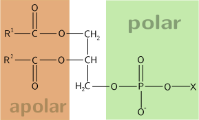
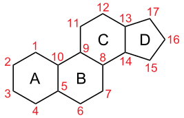

# 有机物的分类

## 按照物质

### 烷烃概述

我们熟悉的甲烷（$\ce{CH4}$）是最简单的有机化合物。其分子中的碳原子以最外层的 $4$ 个电子分别与 $4$ 个氢原子的电子形成了 $4$ 个 $\ce{C - H}$ 共价键。

实验数据表明，甲烷分子并非平面结构，而是呈正四面体空间构型。

- 碳原子位于正四面体的中心。
- $4$ 个氢原子分别位于 $4$ 个顶点。
- $4$ 个 $\ce{C - H}$ 键的长度和强度完全相同，任意两个 $\ce{C - H}$ 键之间的夹角均为 $\pu{109.5^\circ C}$。

与甲烷结构相似的有机化合物还有很多，随着分子中碳原子数的增加，还有乙烷、丙烷、丁烷等一系列有机化合物。这些化合物的碳链呈锯齿状或折线形。

烷烃分子中的碳原子都采取 $\text{sp3}$ 杂化，形成四面体结构；碳原子以 $\sigma$ 键与其他碳原子或氢原子结合；每个碳原子形成 $4$ 个共价单键；除甲烷外，烷烃分子中既有极性键，又有非极性键。

**烷烃**是只含有碳和氢两种元素，且分子中的碳原子之间都以单键结合，碳原子的剩余价键均与氢原子结合，使每个碳原子的化合价都达到“饱和”的一类链状有机化合物。

烷烃是一类最基础的有机化合物，广泛存在于自然界中。生活中的一些常见物质，如天然气、液化石油气、汽油、柴油、凡士林、石蜡等，主要成分都是烷烃。

烷烃的通式：如果链状烷烃中的碳原子数为 $n$，则氢原子数为 $2n+2$。其分子式可以用通式 $\ce{C_{n}H_{2n+2}}$ 表示。

| 碳原子数 | 名称  | 分子式           | 结构简式              |
| :------: | :---: | ------------ | ------------------ |
| $1$      | 甲烷  | $\ce{CH4}$      | $\ce{CH4}$           |
| $2$      | 乙烷  | $\ce{C2H6}$     | $\ce{CH3CH3}$        |
| $3$      | 丙烷  | $\ce{C3H8}$     | $\ce{CH3CH2CH3}$     |
| $4$      | 丁烷  | $\ce{C4H10}$    | $\ce{CH3(CH2)2CH3}$   |
| $11$     | 十一烷 | $\ce{C11H24}$   | $\ce{CH3(CH2)9CH3}$   |

丁烷甲烷、乙烷和丙烷的结构各只有一种，但丁烷（$\ce{C4H10}$）有两种同分异构体：

| 化合物   | 结构       | 熔点               | 沸点               |
| :------: | :--------: | :----------------: | :----------------: |
| 正丁烷   | 直链结构   | $\pu{-138.4^\circ C}$ | $\pu{-0.5^\circ C}$  |
| 异丁烷   | 带有支链   | $\pu{-159.4^\circ C}$ | $\pu{-11.6^\circ C}$ |

二者组成相同，但分子中原子的结合顺序不同，因此性质存在差异，是两种不同的化合物。

随着碳原子数的增加，烷烃的同分异构体数目迅速增多。例如，戊烷（$\ce{C5H12}$）有 $3$ 种同分异构体，己烷（$\ce{C6H14}$）有 $5$ 种，而癸烷（$\ce{C10H22}$）则有 $75$ 种之多。同分异构现象的广泛存在也是有机物种类繁多的重要原因之一。

烷烃的物理性质：

- 溶解性：烷烃均为难溶于水的无色物质。

- 熔沸点和密度：一般随着分子中碳原子数的增加（相对分子质量增大）而升高。

- 常温下，含 $1\sim4$ 个碳原子的烷烃为气态，之后逐渐转为液态，再到固态。

- 对于同分异构体，分支越多，沸点越低。

烷烃的化学性质：

- 在光照条件下，甲烷与氯气（$\ce{Cl2}$）发生一系列取代反应，甲烷分子中的氢原子逐步被氯原子取代，生成一系列产物。

- 反应现象：混合气体颜色逐渐变浅，试管壁出现油状液滴，试管内水面上升。

| 步骤 | 反应方程式 | 产物名称 | 沸点 |
| :-: | - | :-: | :-: |
| $1$ | $\ce{CH4 + Cl2 ->[\text{光}] CH3Cl + HCl}$ | 一氯甲烷 | $\pu{-24.2^\circ C}$ |
| $2$ | $\ce{CH3Cl + Cl2 ->[\text{光}] CH2Cl2 + HCl}$ | 二氯甲烷/二氯代烷 | $\pu{39.8^\circ C}$ |
| $3$ | $\ce{CH2Cl2 + Cl2 ->[\text{光}] CHCl3 + HCl}$ | 三氯甲烷/氯仿 | $\pu{61.7^\circ C}$ |
| $4$ | $\ce{CHCl3 + Cl2 ->[\text{光}] CCl4 + HCl}$ | 四氯甲烷/四氯化碳 | $\pu{76.5^\circ C}$ |

- 产物性质：这 $4$ 种氯代产物均不溶于水，其中三氯甲烷和四氯甲烷为重要的工业有机溶剂。

在通常情况下，烷烃的化学性质较稳定，与强酸、强碱或高锰酸钾（$\ce{KMnO4}$）等强氧化剂不发生反应，但在特定条件下，烷烃也会发生反应。

**氧化反应**：烷烃可在空气中完全燃烧，生成二氧化碳和水，并放出大量热，因此常用作燃料。

- 甲烷燃烧：$\ce{CH4 + 2O2 ->[\text{点燃}] CO2 + 2H2O}$。

- 丙烷燃烧：$\ce{C3H8 + 5O2 ->[\text{点燃}] 3CO2 + 4H2O}$。

高温分解：烷烃在一定条件（加热、加压、催化剂）下发生分解反应，可生成碳原子数较少的烷烃和烯烃，高温下还可能生成碳单质和氢气。

$$
\ce{C16H34 ->[加热加压][催化剂] C8H18 + C8H16}\tag{\scriptsize\text{石油的裂化}}
$$

卤代烃：

- 氟利昂：化学式 $\ce{CCl2F2}$，是一种曾经常用的制冷剂。
- 状态：常温下卤代烃除 $\ce{CH3Cl}$、$\ce{CH3CH2Cl}$、$\ce{CH2=CHCl}$ 等少数是气体外，大多数为液体或固体。
- 溶解度：卤代烃不溶于水，可溶于有机溶剂。某些卤代烃本身是很好的有机溶剂。
- 密度：高于同碳原子数的烃，除脂肪烃的一氯代物和一氟代物密度比水小，其余的密度都比水大。密度随着烃基中碳原子数目的增加而减小，卤代烃的密度随碳原子数目的增加而减小。
- 熔沸点：熔沸点大于同碳个数的烃，随碳原子数增多，沸点依次升高（碳原子数相同时，支链越多沸点越低）。

溴乙烷：

- 物理性质：溴乙烷是无色液体，沸点为 $38.4\,^\circ\mathrm{C}$，密度比水大，难溶于水，可溶于多种有机溶剂。

- 溴乙烷的结构：分子式：$\ce{C2H5Br}$，结构简式：$\ce{CH3CH2Br}$。

- 在溴乙烷分子中，由于**溴原子的电负性比碳原子的大**，使 $\ce{C-Br}$ 的电子向 $\ce{Br}$ 原子偏移，进而使碳原子带部分正电荷（$\delta^+$），$\ce{Br}$ 原子带部分负电荷（$\delta^-$），这样就形成一个极性较强的共价键：$\ce{C^{\delta^+}-Br^{\delta^-}}$，其键长大而键能较小。因此在化学反应中，$\ce{C-Br}$ **较易断裂**，使碳原子与带负电荷的基团结合，$\ce{Br}$ 原子被其他原子或原子团所取代，生成负离子离去。

### 烯烃概述

乙烯的分子式为 $\ce{C2H4}$，其结构式为 $\ce{CH2 = CH2}$。

乙烯分子中含有碳碳双键（$\ce{C = C}$），这使得其在组成和结构上与只含碳碳单键和碳氢键的烷烃有较大差异。碳碳双键的存在使得乙烯表现出较活泼的化学性质。

由于其分子中的氢原子数少于同碳原子数的烷烃（乙烷 $\ce{C2H6}$），碳原子的价键没有全部被氢原子“饱和”，因此乙烯属于 **不饱和烃**。乙烯是一个平面型分子，所有 $6$ 个原子都处于同一平面内。

乙烯是一种无色、略带气味的气体，具有以下物理特性：

- **沸点**：$\pu{-104 ^oC}$；
- **熔点**：$\pu{-169 ^oC}$；
- **密度**：$\pu{1.25 g/L}$（比空气略小）。

由于密度小于空气，乙烯在实验室中可通过向下排空气法收集。

烯烃的化学性质：化学性质主要由碳碳双键（$\ce{C = C}$）决定。

### 醇酚概述

醇是羟基 $\ce{-OH}$ 直接与碳原子相连的有机物，按照所连的基团可以分为脂肪醇、脂环醇与芳香醇。

- 甲醇（$\ce{CH2OH}$ 木精）：无色、具有挥发性的液体易溶于水，沸点为 。甲醇有毒，误服会损伤视神经，甚至致人死亡。

- 乙二醇、丙三醇都是无色、粘稠、有甜味的液体，都易溶于水和乙醇，是重要的化工原料。

    - 乙二醇是汽车发动机防冻液的主要化学成分，也是合成涤纶等高分子化合物的主要原料。

    - 丙三醇具有很强的吸水能力，可用于制造日用化妆品。

物理性质：

- 沸点：

    饱和一元醇的熔沸点随分子中碳原子数的递增而逐渐增大。

    相对分子质量相近的醇和烷烃相比，醇的沸点远远高于烷烃的沸点（氢键的影响）。

    碳原子数相同时，羟基个数越多，醇的沸点越高。

- 溶解性：

    醇在水中的溶解度一般随分子中 碳原子数的增加而降低。

    羟基越多，溶解度越大。理解：烷基是憎水基，羟基是亲水基，接的烷基越多，使得羟基形成氢键导致溶解度增加的效果减弱，因此溶解性降低。

    甲醇、乙醇、丙醇、乙二醇、丙三醇等低级醇（碳数比较少的醇）可与水以任意比例混溶。

- 密度：醇的密度比水的密度小。

### 醛酮概述

甲醛：俗名蚁醛，最简单的醛类物质，是一种无色、有强烈刺激性气味的气体，易溶于水，质量分数为 $35\%\sim40\%$ 的水溶液叫做福尔马林，具有防腐和杀菌能力，常作防腐杀菌剂（消毒、浸制标本）；制药（农药、消毒剂），香料，染料；制造酚醛树脂、脲醛树脂、维纶等。

苯甲醛：苯甲醛是最简单的芳香醛，俗称苦杏仁油，是一种有苦杏仁味的无色液体。

分子中含相同碳原子数的饱和一元醛与饱和一元酮的分子式相同，结构不同，互为同分异构体。

### 羧酸概述

羧酸的物理性质：

- **溶解性**：分子中碳原子数在 4 以下的羧酸能与水互溶。随着分子中碳原子数的增加，一元羧酸在水中的溶解度迅速减小，甚至不溶于水（高级脂肪酸是不溶于水的蜡状固体）。
- **沸点**：羧酸分子间可以形成氢键，由于羧酸分子形成氢键的机会比相对分子质量相近的醇多，羧酸的沸点比相应的醇的沸点高，并且随着分子中碳原子数的增加，一元羧酸的沸点逐渐升高。

常见羧酸：

- **甲酸**（最简单的羧酸）：俗称蚁酸，是一种无色、有刺激性气味的液体，有腐蚀性，能与水、乙醇等互溶。甲酸在工业上可用作还原剂，在医疗上可用作消毒剂。甲酸中既有醛基，又有羧基，所以甲酸既具有醛的性质（银镜反应、与氢氧化铜反应、与高锰酸钾反应），又具有羧酸的性质（酸的通性、酯化反应）。
- **乙酸**：具有强烈刺激性气味的液体，纯净的乙酸又称为冰醋酸。
- **苯甲酸**：俗称安息香酸，是一种无色晶体，易升华，微溶于水，易溶于乙醇。其钠盐是常用的食品防腐剂。
- **乙二酸**：俗称草酸，是无色透明晶体，通常含有结晶水，可溶于水和乙醇，以钠盐或钙盐形式广泛存在于植物中。草酸钙难溶于水，是人体肾结石和膀胱结石的主要成分。乙二酸是化学分析中常用的还原剂。

### 胺腈概述

胺可以看作是氨分子中的氢原子被烃基取代的衍生物。胺的分子结构与氨气相似，都是三角锥形。

- 根据氨分子中一个、两个或三个氢原子被烃基取代的情况，将胺分为伯胺（一级胺）、仲胺（二级胺）、叔胺（三级胺）。

- 根据分子中氮原子所连烃基种类不同，胺可分为脂肪胺（如乙胺）和芳香胺（如苯胺）。

物理性质：

- 低级脂肪胺在常温下为气体，如甲胺、二甲胺、三甲胺、乙胺等，其他低级胺为液体。相对分子质量低的胺具有氨的气味，如三甲胺有鱼腥气味。

- 胺可形成分子间氢键，故沸点比相对分子质量相近的烷烃高，比相应的醇和羧酸低。低级胺能与水形成氢键而易溶于水，随着相对分子质量的增加，溶解度降低。

- 芳香胺是无色液体或固体，有特殊臭味，有毒，使用时应注意，避免芳香胺接触皮肤或吸入人体内而中毒。

## 按照官能团

有机化学中，碳氢化合物被划分为两类：脂肪族化合物和芳香族化合物。芳香族化合物指含有苯环或其它芳香环的烃类，而脂肪族化合物则与其相对，是指结构上不含芳香环的烃类。

烃又称碳氢化合物，是仅由碳和氢组成的有机化合物，包括**脂肪烃**（烷烃、烯烃、炔烃）及**芳香烃**，是许多其他有机化合物的基体。

杂原子指除去 $\ce{C}$ 和 $\ce{H}$ 的任何原子。某碳原子与杂原子成几条键，就处于几级氧化程度。
单键算 $1$ 根，双键算 $2$ 根，三键算 $3$ 根，下文中我们简记用 Z0，Z1，Z2，Z3 表示。

- 相同氧化程度的官能团之间，通常只需通过简单的非氧化还原反应（如水解、醇解、胺解、脱水等）即可相互转化。

- 不同氧化程度的官能团之间，其转化则必须使用氧化剂或还原剂。

注意：氧化程度与形式化的氧化态不同，氧化程度只关心碳与杂原子的成键数。

### Z0：脂肪烃

脂肪烃碳原子以**直链**、**支链**或**环状**排列，脂肪烃可以是烷烃、烯烃或炔烃。

| | 描述 | 通式 |
| :-: | - | -: |
| **烷烃** | 碳原子之间全部以单键结合 | $\ce{C_nH_{2n+2}}$（$n\ge1$） |
| **烯烃** | 分子中含有一个或多个碳碳双键 | $\ce{C_nH_{2n}}$（$n\ge2$） |
| **炔烃** | 分子中含有一个或多个碳碳三键 | $\ce{C_nH_{2n-2}}$（$n\ge2$） |

常温下，碳原子数 $\le4$ 时为气体；随碳原子数增多，熔沸点升高，密度增大，均难溶于水。

---

- **取代反应**：分子中的一个原子或原子团被其他原子或原子团取代。

    $$
    \begin{align}
    \ce{CH3CH3 + Cl2 &->[光照] CH3CH2Cl + HCl}\\
    \ce{CH3CH3 + \underset{液态溴}{Br2} &->[光照] CH3CH2Br + HBr}
    \end{align}
    $$

---

- **加成反应**：有双键或三键的物质中，重键打开，原来重键两端的原子各连接上一个新的基团。

    - 与卤素反应：将乙烯通入盛有溴的四氯化碳溶液（或溴水）的试管中，可以观察到溴的红棕色褪去。反应中，乙烯双键中的一个键断裂，两个溴原子分别加到两个价键不饱和的碳原子上，生成无色的 $1,2$-二溴乙烷（**工业上制备二氯代烃**）。

        $$
        \ce{CH2=CH2 + \underset{溴水}{Br2} -> CH2Br-CH2Br}
        $$

        其中 1,2-溴代乙烷 $\ce{CH2Br-CH2Br}$ 是无色液体，难溶于水，溶于四氯化碳。因此可使溴水或其四氯化碳溶液褪色，且不分层，该反应常用于：

        1. **检验不饱和键**：检验物质中是否含有碳碳双键或三键。
        2. **除去烯烃**：例如除去乙烷中混有的乙烯。

    - 与氢气反应：乙烯可以与氢气在催化剂和加热的条件下发生加成反应，生成乙烷。

        $$
        \ce{CH2 = CH2 + H2 ->[\text{催化剂}][\Delta] CH3-CH3}
        $$

        类似也可以与卤化氢反应（**工业制备单卤代烃**）：

        $$
        \ce{CH2 = CH2 + HCl ->[\text{催化剂}][\Delta] CH3-CH2Cl}
        $$

        也可以与氢氰酸反应，实现**实现碳链增长**：

        $$
        \ce{CH2 = CH2 + HCN ->[\text{催化剂}][\Delta] CH3-CH2CN}
        $$

    - 与水反应：乙烯与水在酸性催化剂作用下生成乙醇。

        工业上可以利用乙烯与水的加成反应制取乙醇（**工业制备一元醇**）。该反应需要在催化剂、加热和加压的条件下进行。

        $$
        \ce{CH2 = CH2 + H2O ->[\text{催化剂}][\text{加热、加压}] CH3CH2OH}
        $$

        乙烯分子中的碳碳双键（$\ce{C=C}$）在催化剂作用下断裂，与水分子中的氢原子和羟基（$\ce{OH}$）结合生成乙醇。

        通常使用酸性催化剂，如磷酸（$\ce{H3PO4}$）或硫酸（$\ce{H2SO4}$），以促进双键的开裂和加成反应的进行。

        反应过程中需严格控制水的用量，过量水可能引发副反应，生成醚（$\ce{(C2H5)2O}$）等副产物。此外，反应生成的乙醇浓度较低，需通过蒸馏等后续工艺提纯。

    - 炔烃同样可以加成，但是通常需要条件。

        $$
        \begin{align}
        \ce{CH#CH + HCl &->[催化剂][\triangle] CH2=CHCl}\\
        \ce{CH#CH + H2O &->[催化剂][\triangle] \underset{CH2=CH-OH}{CH3CHO}}
        \end{align}
        $$

---

- **互变异构**：其中 $(3)$ 符合**互变异构**（酮-烯醇互变异构），发生反应：

    $$
    \ce{CH2=CH-OH -> CH3CHO}
    $$

    该反应平衡常数较大，反应较为完全。

- 1,3-二烯烃的加成反应：

    $$
    \begin{align}
    \ce{CH2=CH-CH=CH2 + Br2 &->[高温][1,4-加成] ClCH2-CH(Cl)-CH=CH2}\\
    \ce{CH2=CH-CH=CH2 + Br2 &->[低温][1,2-加成] ClCH2-CH=CH-CH2Cl}
    \end{align}
    $$

---

- **加聚反应**：经加成反应形成高聚物的过程称为加成聚合反应，是含有不饱和键单体 $\pi$ 键断裂后加成聚合起来的反应。

    $$
    \begin{align}
    \ce{n CH2=CH2 &->[催化剂] \underset{聚乙烯}{\poly{CH2-CH2}}}\\
    \ce{n CH2\bond{3}CH2 &->[催化剂] \underset{聚乙炔}{\poly{CH2=CH2}}}
    \end{align}
    $$

- 二烯烃加聚：

    $$
    \ce{n CH2=CH-CH=CH2 ->[一定条件] \poly{CH2-CH=CH-CH2}}
    $$

- 烯烃共聚：

    $$
    \ce{n CH2=CH2 + n CH2=CH-CH3 ->[一定条件] \poly{CH2-CH2-CH(CH3)-CH2}}
    $$

---

- **氧化反应**：几乎所有的烃都可以燃烧。

    $$
    \begin{align}
    \ce{C2H4 + 3 O2 &->[点燃] 2 CO2 + 2 H2O}\\
    \ce{C_xH_y + $\left(x+\dfrac{y}{4}\right)$ O2 &->[点燃] x CO2 + \dfrac{y}{2} H2O}
    \end{align}
    $$

    完全燃烧：生成二氧化碳（$\ce{CO2}$）和水（$\ce{H2O}$）：

    不完全燃烧：氧气不足时，可能生成一氧化碳（$\ce{CO}$）或炭黑（$\ce{C}$）。

- 与高锰酸钾反应：

    与醇的催化氧化类似（：

    $$
    \begin{align}
    \ce{CH2=CH2 &->[KMnO4][H+] CO2}\\
    \ce{R-CH=CH-R' &->[KMnO4][H+] R-COOH + R'COOH}\\
    \ce{(CH3)2C=C(CH3)2 &->[KMnO4][H+] CH3C(O)CH3}
    \end{align}
    $$

    此反应常用于检验碳碳双键的存在。

    而炔烃的高锰酸钾氧化也类似（内部炔烃、末端炔烃、乙炔）：

    $$
    \begin{align}
    \ce{R-C#C-R' &->[KMnO4][H+] R-COOH + R'-COOH}\\
    \ce{R-C#C-H &->[KMnO4][H+] R-COOH + H2O + CO2}\\
    \ce{H-C#C-H &->[KMnO4][H+] H2O + 2CO2}
    \end{align}
    $$

    值得注意的是，以上描述的是强氧化条件（酸性、加热），如果使用温和的氧化条件，例如冷、稀、中性或碱性的高锰酸钾溶液（拜耳试剂），反应则完全不同：

    双键不会断裂，而是在双键的位置加上两个羟基，生成邻二醇。

    $$
    \ce{CH2=CH2 ->[冷、稀 KMnO4] HO-CH2-CH2-OH}
    $$

### Z0：芳香烃

**芳香烃**简称芳烃，为苯及其只含碳与氢的衍生物的总称，指分子结构中含有一个或者多个苯环的烃类化合物，最简单和最重要的芳香烃是苯及其同系物。芳烃可分为：**单环芳烃**、**稠环芳烃**，而具有链状的芳香烃一般称之为**脂芳烃**。

{ width="70%" }

**苯**，为最简单的一种芳香烃，芳香族化合物皆由其衍生而成。苯结构是一个平面正六边形分子，碳原子以 $\text{sp2}$ 轨道键结，所以任二键互成 $\pu{120^o}$。苯的含碳量很高，在空气中燃烧产生明亮并带有浓烟的火焰。

- 无色透明液体，有特殊气味；
- 微溶于水，能与多种有机溶剂互溶；
- 沸点 $80^\circ\mathrm{C}$，熔点 $5.5^\circ\mathrm{C}$，常温下密度为 $0.88\mathrm{g/cm^3}$；
- 易挥发，有毒，具有致癌性。

- **凯库勒式**：凯库勒年提出了苯环单键、双键交替排列、无限共轭的结构。后来，他又提出了苯中的双键并不是固定的，而是会借由共振，产生介于单键与双键之间的键长，以圆圈型的符号表示代表苯中电子的未定域化。

- **鲍林式**：苯环的另一种常见画法是内部带有圆圈的正六边形，圆圈强调了 $6$ 个 $\pi$ 电子的离域作用和电子云的均匀分布，这很好的解释了碳碳键长均等性和苯环的完全对称性。但是这种方式用来表示其他芳香体系，如两个稠合的苯环，萘，容易造成误解。

化学性质：

- **取代反应**：苯可以发生的取代反应有**卤代反应**、**硝化反应**、**磺化反应**等。

    $$
    \begin{align}
    \ce{C6H6 + \underset{液态溴}{Br2} &->[FeBr3] C6H5Br + HBr}\\
    \ce{C6H6 + \underset{HNO3}{HO-NO2} &->[浓硫酸][50\sim60\pu{^oC}] \underset{硝基苯}{C6H5NO2} + H2O}\\
    \ce{C6H6 + \underset{H2SO4}{HO-SO3H} &<=>[浓硫酸][70\sim80\pu{^oC}] \underset{苯磺酸}{C6H5SO3H} + H2O}
    \end{align}
    $$

- **加成反应**：苯与氢气加成反应生成环己烷，与氯气加成生成 $\ce{C6H6Cl6}$（六六六，一种农药）。

    $$
    \ce{C6H6 + 3H2 ->[Ni][180\sim250\pu{^oC}] C6H12}
    $$

    $$
    \ce{C6H6 + 3Cl2 ->[光照] 3.1em}
    $$

苯的同系物：分子里含有一个苯环的烃，通式为 $\ce{C_nH_{2n-6}}$（$n\ge6$）。

- 由于苯环和侧链的相互影响，使苯的同系物也有一些化学性质跟苯不同。甲苯比苯活泼的多，可以与高锰酸钾反应。

- 同时，甲苯中的甲基活化了苯的邻、对位，和浓硝酸、浓硫酸混合酸发生更彻底的硝化反应（苯的硝化通常只进行一步），生成 2,4,6-三硝基甲苯（简称三硝基甲苯，TNT 是一种难溶于水的淡黄色针状晶体）。

    $$
    \ce{C6H5CH3 + 3HO-NO2 ->[浓硫酸][\triangle] 3H2O + \text{TNT}}
    $$

- 我们知道 TNT 是一种烈性炸药，平时比较稳定，即使受热或撞击也不易爆炸，但是在有敏感的起爆剂如雷酸汞 $\ce{Hg(ONC)2}$ 等引爆的情况下，就能发生猛烈的爆炸。

- 硝基苯可以轻松被还原：

    $$
    \ce{C6H5NO2 ->[Fe/HCl] C6H5NH2}
    $$

**氧化反应**：对于苯的同系物，和苯环直接相连的碳原子上有氢原子时（苄基氢），能被酸性高锰酸钾溶液氧化，使酸性高锰酸钾溶液褪色。

$$
\ce{C6H5-CH(R)(R') ->[KMnO4][H+] C6H5COOH}
$$

这样直接将其他支链扔掉，氧化为苯甲酸；如果苯上有其他支链，则同样氧化。

**卤代反应**：在光照条件下，甲苯与氯气发生取代反应时，氯原子取代甲基上的氢原子。反应后可能的有机产物是甲基上的氢原子分别被 $1$ 个、$2$ 个或 $3$ 个氯原子取代所生成的氯甲基苯。

在氯化铁的催化下，甲苯与氯发生取代反应生成的一氯代甲苯主要有两种：邻氯甲苯和对氯甲苯。甲基的存在活化了苯环上处于甲基邻位和对位的氢原子，使相应的碳氢键更容易断裂，发生取代反应。

| | 液态溴 | 溴水 | 溴的四氯化碳溶液 | 酸性高锰酸钾溶液 |
| :-: | - | - | - | - |
| 烷烃 | 与溴蒸气在光照条件下发生取代反应 | 不反应，发生萃取褪色 | 不反应，互溶不褪色 | 不反应 |
| 烯烃、炔烃 | 常温加成褪色 | 常温加成褪色 | 常温加成褪色 | 氧化褪色 |
| 苯 | 催化条件下可发生取代反应 | 不反应，发生萃取褪色 | 不反应，互溶不褪色 | 有 $\alpha-\ce{H}$ 可以氧化褪色 |

**稠环芳香烃**：又称多环芳香烃，是由两个或两个以上的苯环通过共用相邻的碳原子而形成的芳香烃。

{ width="50%" }

- 萘^[nai4]^是一种无色片状晶体，有特殊的气味，不溶于水、易升华，有毒性，可以用来杀菌、防蛀、驱虫。

- 蒽^[en1]^是一种无色晶体，易升华，是生成染料的重要原料。

### Z1：卤代烃

卤代烃的官能团为碳卤键（卤素原子），通式为 $\ce{RX}$，除 $\ce{CH3Cl}$ 外基本上都为液体或固体。卤代烃通常也不溶于水、可溶于有机溶剂，密度、沸点都大于相应的烃。

- **取代反应**：卤代烃在水溶液中，在氢氧化钠的作用下发生**水解反应**。

    $$
    \ce{CH3CH2Br + NaOH ->[水][\triangle] CH3CH2OH + NaBr}
    $$

- **消去反应**：卤代烃在乙醇等有机溶液中，在氢氧化钠的作用下发生消去反应，脱下一卤一氢。

    $$
    \ce{CH3CH2Br + NaOH ->[乙醇][\triangle] CH2=CH2 ^ + NaBr + H2O}
    $$

- 检验卤代烃中的卤素原子：

    $$
    \ce{RX ->[NaOH(aq)][\triangle] NaX(OH-) ->[HNO3] NaX(H+) ->[AgNO3] AgX}
    $$

    根据沉淀颜色判断氯、溴、碘离子。

光卤代拓展：**有机物的光卤代反应（Photo-halogenation）** 是有机化学中非常基础且重要的一类反应。它通常指的是烷烃或带有烷基侧链的化合物，在光照（$h\nu$）条件下，分子中的氢原子被卤素原子（通常是氯或溴）取代的过程。该反应的核心机制是**自由基链式取代反应（Free Radical Chain Substitution）**。

通式：

$$
\ce{R-H + X2 ->[h\nu\text{ or }\Delta] R-X + HX}
$$

其中，$X_2$ 通常为 $Cl_2$ 或 $Br_2$。$F_2$ 反应太剧烈难以控制，$I_2$ 反应吸热且可逆，通常不发生。如果在反应中生成了手性中心，产物的立体化学特征是什么？

1. **中间体构型：** 烷基自由基（$R\cdot$）通常是 $\mathrm{sp^2}$ 杂化的平面结构（或快速翻转的浅金字塔），未成对电子占据 $p$ 轨道。

2. **进攻方向：** 卤素分子可以从平面的**上方**或**下方**以等概率进攻。

3. **结果：**如果反应产生了一个新的手性碳，通常得到**外消旋体（Racemic mixture）**（一对对映异构体的等量混合物）；如果分子中原本已有手性中心，且该中心未参与反应，则生成非对映异构体混合物。

自由基链式反应：这是理解光卤代的关键。以**甲烷氯代**生成一氯甲烷为例，反应分为三个阶段：

- **第一阶段：链引发**。

    在紫外光（UV）或高温作用下，卤素分子发生**均裂（Homolytic Cleavage）**，生成两个高活性的卤素自由基。$Cl\cdot$ 表示带有单电子的氯自由基，极不稳定，反应活性极高。

    $$
    \ce{Cl-Cl ->[h\nu] 2 Cl*}
    $$

- **第二阶段：链增长**。这是反应的主体部分，是一个循环过程。

    **夺氢（RDS）：** 氯自由基攻击烷烃，夺取一个氢原子，生成氯化氢和烷基自由基。这一步通常是**决速步（Rate Determining Step）**。

    $$
    \ce{Cl* + CH4 -> HCl + CH3*}
    $$

    **夺卤：** 烷基自由基攻击另一个氯分子，夺取一个氯原子，生成产物卤代烃，并再生出一个新的氯自由基。

    $$
    \ce{CH3* + Cl2 -> CH3Cl + Cl*}
    $$

    生成的 $\ce{Cl*}$ 可以回到第一步继续反应，形成链式循环。理论上一个光子引发产生的自由基可以循环成千上万次。

- **第三阶段：链终止**。当两个自由基碰撞结合时，链反应停止。

    $$
    \ce{Cl* + Cl* -> Cl2}
    $$

    $$
    \ce{CH3* + Cl* -> CH3Cl}
    $$

    $$
    \ce{CH3* + CH3* -> CH3-CH3}
    $$

卤素的活性与热力学：不同卤素在该反应中的表现差异巨大，主要取决于键能和反应的热效应。

1. **氟 ($\ce{F_2}$)：**反应极度放热，几乎是爆炸性的。$\ce{F*}$ 极其活泼，选择性极差，通常会打断 $\ce{C-C}$ 键，实验室很少直接进行光氟代。

2. **氯 ($\ce{Cl_2}$)：**反应放热，速度快。$\ce{Cl*}$ 活性较高，但选择性中等（既能取代一级氢，也能取代二级、三级氢，得到混合物）。

3. **溴 ($\ce{Br_2}$)：**反应放热较少（夺氢步骤甚至是吸热的），速度较慢。$\ce{Br*}$ 活性较低，但**选择性极高**（倾向于取代最稳定的碳自由基对应的氢）。

4. **碘 ($\ce{I_2}$)：**夺氢步骤是强吸热的，反应难以正向进行，且生成的 $\ce{HI}$ 还原性强，会将 $\ce{R-I}$ 还原回 $\ce{R-H}$。

当烷烃分子中有不同类型的氢（一级 $1^\circ$、二级 $2^\circ$、三级 $3^\circ$）时，卤素取代哪里**核心原则：** 反应速率取决于**中间体烷基自由基的稳定性**。

- **氯代（低选择性）：**

    - 虽然 $3^\circ$ 氢反应最快，但 $\ce{Cl*}$ 太活泼（“饿不择食”），加上 $1^\circ$ 氢的数量通常更多，所以氯代通常得到各种异构体的混合物。

    - 哈蒙德假说（Hammond's Postulate）解释：氯代夺氢放热，过渡态出现早，结构像反应物，对自由基稳定性不敏感。

- **溴代（高选择性）：**

    - $\ce{Br*}$ 比较“挑食”。由于夺氢步骤吸热，过渡态出现晚，结构非常接近中间体烷基自由基。因此，反应速率极度依赖自由基的稳定性。

    - **结论：** 如果想在分子的特定位置（特别是三级碳或苄位/烯丙位）引入卤素，**首选溴代**。

烯丙位/苄位卤代：这是非常有用的反应。因为烯丙基自由基和苄基自由基由于 $p-\pi$ 共轭效应而异常稳定。因此，即使在温和条件下（如 N-溴代丁二酰亚胺 NBS，低浓度 $\ce{Br2}$，光照），也能高选择性地发生在烯丙位或苄位上，而双键或苯环本身不被破坏。例如：用 NBS/CCl4/hv 处理甲苯，可以得到苄基溴。

芳环的侧链卤代：在光照或加热条件下，卤代发生在烷基侧链上（遵循自由基机理）。这与铁粉催化下的芳环亲电取代卤代（生成邻/对位卤代芳烃）有本质区别，是两种完全不同的机理。

### Z1：醇和酚

**醇**是羟基 $\ce{-OH}$ 与烃基相连的化合物，通式为 $\ce{ROH}$，而根据羟基所连接碳原子的类型，分为伯醇 $\ce{R-CH2-OH}$、仲醇 $\ce{R-CH(R1)-OH}$、叔醇 $\ce{R-C(R1)(R2)-OH}$，前面的更容易被氧化，我们将在催化氧化处详细解释。

{ width="40%" }

一般来说，饱和一元烃随分子中碳原子数增加，沸点逐渐升高。分子中羟基越多，越容易形成更多的氢键，沸点越高，且远远高于相近分子量的烷烃。同样因为氢键，醇的水溶性好，甲醇、乙醇、丙醇均与水互溶。

| | 物理性质 | 用途 |
| :-: | - | - |
| 乙醇 | 无色、有特殊香味的液体，易挥发，与水任意比例互溶 | 燃料；化工原料；有机溶剂；消毒剂 |
| 甲醇（木醇） | 无色液体、熔点低、易挥发、易溶于水 | 化工生产、车用燃料 |
| 乙二醇、丙三醇（甘油） | 无色、黏稠的液体，与水任意比例互溶 | 化工原料、化妆品、防冻液 |

在乙醇 $\ce{CH3CH2OH}$ 中，因为氧原子电负性强，电子云密度大，因此 $a,b$ 两键容易断裂，同时也活化了 $c,d$ 两键，容易发生如下化学反应：

- **置换反应**：与活泼金属反应，例如与钠的反应，此反应现象没有与水的反应剧烈：

    $$
    \ce{2CH3CH2OH + 2Na -> 2CH3CH2ONa + H2 ^}
    $$

    

    据此，我们可以得出，乙醇可以视作一种比水还弱的弱酸，因此该反应的产物乙醇钠在水中会强烈水解。此外，这个反应本质上属于置换反应，有些教材会说因为有有机物参与所以是取代反应，这其实是泛化的取代反应，实际上的取代反应需要一个过程（详见有机化学机理部分），而这个反应本质上还是钠与乙醇“电离”出的氢离子反应，没有取代的过程，因此严格来说不属于取代反应。

- **取代反应**：与氢溴酸等发生反应，断掉 $b$ 键，羟基与氢原子结合，生成卤代烃。

    $$
    \ce{CH3CH2OH + HBr ->[\triangle][浓硫酸] CH3CH2Br + H2O}
    $$

    此反应逆过来就是卤代烃的水解，但是该反应不是可逆反应，因为正向需要浓硫酸、加热，反向需要氢氧化钠水溶液，反应条件不同，不能同时发生，不是可逆反应。

- **聚合反应**：分子间可以脱水，一个脱去羟氢，一个脱去羟基。

    $$
    \ce{CH3CH2\boxed{\ce{OH + H}}OCH3CH2 ->[浓硫酸][\pu{140^oC}] \underset{乙醚}{CH3CH2OCH3CH2} + H2O}
    $$

- **消去反应**：分子内 $b,d$ 断裂，发生经典的消去反应。

    $$
    \ce{CH3CH2OH ->[浓硫酸][\pu{170^oC}] CH2=CH2 ^ + H2O}
    $$

- **酯化反应**：我们将在酯化反应一节中详细解释，酸去羟基醇去氢。

    $$
    \ce{CH3CO\boxed{\ce{OH + H}}OCH3CH2 <=>[浓硫酸][\triangle] \underset{乙酸乙酯}{CH3COOCH3CH2} + H2O}
    $$

- **氧化反应**：在铜或银的催化下，与氧气反应（实际上是与氧化铜反应）生成乙醛。

    $$
    \ce{2CH3CH2OH + O2 ->[Cu][\triangle] 2CH3CHO + 2H2O}
    $$

    同时，乙醇能被酸性高锰酸钾溶液直接氧化为乙酸。

    醇的催化氧化：与羟基相连的碳称为 $\ce{\alpha-C}$，与 $\ce{\alpha-C}$ 相连的氢称为 $\ce{\alpha-H}$。

    - 如果醇没有 $\ce{\alpha-H}$（叔醇），那么无法被催化氧化。

    - 如果有一个 $\ce{\alpha-H}$（仲醇），那么可以被氧化为酮。

        $$
        \ce{OH-CH(R1)(R2) -> O=C(R1)(R2)}
        $$

    - 如果有两个 $\ce{\alpha-H}$（伯醇）或者是甲醇，那么可以被氧化生成醛。

        $$
        \ce{R-CH2OH -> R-CHO}
        $$

    - 伯醇、醛可以被酸性高锰酸钾溶液氧化为酸。

- 特殊的，如果一个碳原子上连了两个羟基，那么其脱掉一分子水变为醛或酮，更特殊的，如果连了三个羟基那么变为羧酸。

    甲醛（$\ce{HCHO}$）是唯一一个在水溶液中主要以偕二醇形式存在的简单醛。

    $$
    \ce{H2C=O + H2O <=> \underset{甲二醇}{H2C(OH)2}}
    $$

    在水溶液中，超过 $99.9\%$ 的甲醛是以甲二醇的形式存在的。这是因为甲醛的羰基碳位阻最小，且反应性很高，容易被水攻击。

**酚**是羟基与苯环直接相连形成的化合物，最简单的酚为本分 $\ce{C6H6O}$。

$$
C6H5OH
$$

纯净的苯酚是无色晶体，易溶于乙醇等有机溶剂，常温下在水中溶解度不大，温度高于 $\pu{65^oC}$ 时能与水混溶。久置的苯酚呈粉红色，是部分苯酚被空气中的氧气氧化所致。

- **酸性**：与醇类似，羟基和苯环互相作用，羟基容易电离出氢离子，俗称石炭酸，酸性比碳酸弱，苯酚水溶液不能使酸碱指示剂变色。

    $$
    \ce{C6H5OH <=> H+ + C6H5O-}
    $$

    类似可以推出与钠、氢氧化钠的反应。

- **取代反应**：与甲苯类似，与溴水反应，生成 2,4,6-三溴苯酚（简称三溴苯酚）。

    $$
    \ce{C6H5OH + \underset{溴水}{3Br2} -> C6H6Br3O v + 3HBr}
    $$

- **加成反应**：镍作为催化剂加热，与氢气反应加成，生成环己醇。

    $$
    \ce{C6H5OH + 3 H2 ->[Ni][\triangle] C6H12O}
    $$

- 苯酚的工业制取：苯与氯气反应生成氯苯，然后在碱性溶液中水解得到苯酚。

- 酚遇 $\ce{FeCl3}$ 变为紫色，称为显色反应。苯酚易被 $\ce{O2},\ce{KMnO4(H+)}$ 氧化。

| 基团 | 醇羟基 | 酚羟基 | 羧基 |
| - | :-: | :-: | :-: |
| 酸碱性 | 中性 | 弱酸性 | 弱酸性 |
| 与 $\ce{Na}$ | 反应 | 反应 | 反应 |
| 与 $\ce{NaOH}$ | 不反应 | 反应 | 反应 |
| 与 $\ce{Na2CO3}$ | 不反应 | 反应 | 反应 |
| 与 $\ce{NaHCO3}$ | 不反应 | 不反应 | 反应 |

### Z1：醚和胺

**醚**：通式为 $\ce{R1-O-R2}$，称为醚键。

**胺**：通式为 $\ce{R-NH2}$，其中 $\ce{-NH2}$ 称为氨基。胺的化学性质与氨气类似，具有一定的碱性。

$$
\ce{C6H5NH2 + HCl -> C6H5NH3Cl}
$$

### Z2：醛和酮

**醛**：通式为 $\ce{RCHO}$，最简单的醛为甲醛 $\ce{HCHO}$，下面以乙醛 $\ce{CH3CHO}$ 为例。

| 名称 | 结构简式 | 状态 | 溶解性 |
| :-: | :-: | :- | :-: |
| 甲醛 | $\ce{HCHO}$ | 气态，有刺激性气味 | 易溶于水 |
| 乙醛 | $\ce{CH3CHO}$ | 液体，有刺激性气味 | 易溶于水、苯 |
| 苯甲醛 | $\ce{C6H5CHO}$ | 液体，苦杏仁味 | 微溶于水 |
| 丙酮 | $\ce{CH3COCH3}$ | 液体，有特殊气味 | 与水任意比例互溶 |

- **氧化反应**：

    新制氢氧化铜即为斐林试剂，需要在碱性环境中加热，产生砖红色的氧化亚铁沉淀。

    $$
    \ce{CH3CHO + 2Cu(OH)2 ->[\text{加热}] CH3COOH + Cu2O v + 2H2O}
    $$

    银镜反应：

    - 利用醛基的还原性，将银离子还原为金属银，银在试管内壁形成光亮的银镜，称为银镜反应，可用于在玻璃表面镀银制镜。

        $$
        \begin{align}
        \ce{2 Ag+ + 2 OH- &-> Ag2O + H2O}\\
        \ce{Ag2O + H2O + 4NH3 &-> 2[Ag(NH3)2]OH}\\
        \ce{CH3CHO + 2[Ag(NH3)2]OH &-> H2O + 2Ag v + 3NH3 \\&\qquad + CH3COONH4}\\
        \end{align}
        $$

        简记为：水银铵，123，再加一个羧酸铵。

    - 试管内壁必须洁净、银氨溶液现用现配、醛用量不宜太多，如乙醛一般一滴。

    - 水浴加热，不可用酒精灯直接加热、银镜可用稀硝酸浸泡洗涤除去。

    酸性高锰酸钾，以及重铬酸钾等强氧化剂可以将醛，甚至是醇直接氧化到酸。

    $$
    \ce{CH3CHO + \underset{溴水}{Br2} + H2O -> CH3COOH + 2HBr}
    $$

    工业上常用这个反应来制取乙酸。

    $$
    \ce{CH3CHO + O2 ->[催化剂] CH3COOH}
    $$

- **加成反应**：由于碳氧双键（羰基）的存在，可以与氢气、氢氰酸等发生加成带，正电的结合在氧上。

    $$
    \begin{align}
    \ce{CH3CHO + H2 &->[催化剂][\triangle] CH3CH2OH}\\
    \ce{CH3CHO + HCN &->[催化剂] CH3CH(CN)(OH)}
    \end{align}
    $$

- 乙醛的工业制取：

    用硫酸汞做催化剂，乙炔与水加成得到乙醛。

    用 $\ce{PbCl2}$ 和 $\ce{CuCl2}$ 做催化剂，乙烯直接被空气或氧气氧化得到乙醛。

**酮**，通式为 $\ce{R1-C(=O)-R2}$，最简单的酮是丙酮 $\ce{CH3C(O)CH3}$。

- **加成反应**：由于碳氧双键（羰基）的存在，可以与氢气、氢氰酸等发生加成带，正电的结合在氧上。

    $$
    \begin{align}
    \ce{CH3C(O)CH3 + H2 &->[催化剂][\triangle] CH3CH(OH)CH3}\\
    \ce{CH3C(O)CH3 + HCN &->[催化剂] CH3C(OH)(CN)CH3}\\
    \ce{CH3C(O)CH3 + RNH2 &->[催化剂][\triangle] CH3C(OH)(NHR)CH3}
    \end{align}
    $$

| | 银镜反应 | 斐林试剂 |
| 反应溶液 | 新制银氨溶液 | 新制 $\ce{Cu(OH)2}$ 悬浊液 |
| 反应现象 | 产生光亮银镜 | 产生砖红色沉淀 |
| 定量关系 | $\ce{R-CHO}\sim2\ce{Ag}$ | $\ce{R-CHO}\sim2\ce{Cu(OH)2}\sim\ce{Cu2O}$ |
| 加热方式 | 水浴加热 | 直接加热煮沸 |
| 反应环境 | 银氨溶液显强碱性 | 必须 $\ce{NaOH}$ 过量 |
| 仪器洗涤 | 用稀硝酸浸泡 | 用稀硝酸浸泡 |

醛和酮的还原性和醛的氧化性：

- 能被酸性高锰酸钾溶液、溴水、氧气等强氧化剂氧化。

- 能被银氨溶液、斐林试剂等弱氧化剂氧化。

- 酮羰基只能被氧气氧化，不能被其他氧化剂氧化。

- 醛基可被氧化为羧基，也可以被氢气还原为醇羟基。

注意：甲醛分子中相当于有两个 $\ce{-CHO}$，因此反应时，消耗的氧化剂数量翻倍。

| 氧化过程 | $\ce{R-CH2OH}$ | $\ce{<=>[氧化][还原]}$ | $\ce{R-CHO}$ | $\ce{->[氧化]}$ | $\ce{R-COOH}$ |
| :-: | :-: | :-: | :-: | :-: | :-: |
| 相对分子质量 | $M_r$ | | $M_r-2$ | | $M_r+14$ |

### Z3：羧酸和腈

有机酸是指一些具有酸性的有机化合物，最常见的有机酸是羧酸（$\ce{R-COOH}$），其酸性源于羧基（$\ce{-COOH}$）。磺酸（$\ce{R-SO3H}$）、亚磺酸（$\ce{R-SOOH}$）、硫羧酸（$\ce{R-SH}$）等也属于有机酸。

**羟酸**，通式为 $\ce{RCOOH}$，甲酸 $\ce{HCOOH}$ 又称蚁酸，乙酸又称醋酸为醋的主要成分，苯甲酸用于防腐和药物，乙二酸 $\ce{HOOCCOOH}$ 称为草酸。

- **酸性**：羧酸通常为弱酸，羧基可以电离出氢离子。

    $$
    \ce{RCOOH <=> H+ + RCOO-}
    $$

- **取代反应**：与醇发生酯化反应，生成酯；类似的，与胺反应，生成酰胺。

    $$
    \ce{RCO\boxed{\ce{OH + H}}OR' <=>[浓硫酸][\triangle] RCOOR' + H2O}
    $$

    简记为，酸去羟基醇去氢。

    $$
    \ce{RCO\boxed{\ce{OH + H}}NHR ->[\triangle] RCONHR + H2O}
    $$

    简记为，酸去羟基胺去氢。

- **还原反应**：羧酸可以被强还原剂（如四氢化锂铝 $\ce{LiAlH4}$）还原为醇。该反应通常在无水条件下进行。

    $$
    \ce{R-COOH ->[LiAlH4][\text{无水}] R-CH2OH}
    $$

- **$\alpha-\ce{H}$ 被取代反应**：羧酸分子中与羧基相邻的 $\alpha-\ce{H}$ 较活泼，易被卤素取代。常见如卤素（$\ce{Cl2}$）在催化剂作用下取代 $\alpha-\ce{H}$，生成 $\alpha$-卤代羧酸。

    $$
    \ce{R-CH2COOH + Cl2 ->[\text{催化剂}][\triangle] R-CHClCOOH + HCl}
    $$

- 乙酸的工业制取：

    烷烃在氧气、一定的温度和压强下直接氧化为乙酸。

    $$
    \ce{2CH3CH2CH2CH3 + 5O2 ->[催化剂][加温、加压] 4CH3COOH + 2 H2O}
    $$

    乙烯被氧气氧化生成乙醛，乙醛再被氧化生成乙酸。

- **脱羧反应**定义为：

    $$
    \ce{R-COOH -> R-H + CO2}
    $$

    这一类反应通常需要加热，而且对结构有一定要求。

    1. $\beta$-酮酸脱羧：羧基的 $\beta$-位上有一个羰基（$\ce{C=O}$）。

        这是最经典、最容易发生脱羧反应的结构，这类化合物通常只需要加热就可以顺利脱羧，不需要任何催化剂。

        例子：乙酰乙酸 $\ce{CH3-C(O)-CH2-COOH}$ 加热脱羧生成丙酮和二氧化碳。

    2. 丙二酸及其衍生物：一个碳原子上连接着两个羧基，一般脱去一个羧基，保留另一个。

        对于一个羧基而言，另一个羧基提供了 $\beta$ 位上的羰基，例如丙二酸：

        $$
        \ce{HOOC-CH2-HOOC ->[\triangle] CH3-COOH + CO2}
        $$

    3. 脂肪族羧酸钠盐在生石灰（$\ce{CaO}$）催化下脱羧：

        $$
        \ce{R-COONa + 2NaOH ->[CaO][\triangle] R-H + Na2CO3}
        $$

**酯**是羧酸分子中的羟基被 $\ce{-OR'}$ 取代后的产物，$\ce{RCOOR'}$ 可称为某酸（由 $\ce{R}$ 决定）某酯（由 $\ce{R'}$ 决定）。

- **水解反应**：在酸性条件下，浓硫酸催化；碱性条件下加热即可反应。

    $$
    \begin{align}
    \ce{RCOOR' &+ H2O <=>[浓硫酸][\triangle] RCOOH + HOR'}\\
    \ce{RCOOR' &+ NaOH ->[\triangle] RCOONa + HOR'}
    \end{align}
    $$

    用脂肪与氢氧化钾反应，即可得到高级脂肪酸的钠盐，得到肥皂，称为皂化反应。

- **酯交换**（酯的醇解）：酯化与酯的合成可逆，因此酯可以醇解。

    $$
    \ce{R1COOR2 + R3OH <=> R1COOR3 + R2OH}
    $$

**酰胺**是羧酸分子中的羟基被氨基 $\ce{-NH2}$ 取代后的产物，通式为 $\ce{RCONH2}$。

**酰卤**是羧酸分子中的羟基被卤素原子取代后的产物，通式为 $\ce{RCOX}$。

- **水解反应**：一般条件下不反应，在强酸强碱存在时，加热可水解。

    $$
    \begin{align}
    \ce{RCONH2 + H3O+ &->[\triangle] RCOOH + NH4+}\\
    \ce{RCONH2 + OH- &->[\triangle] RCOO- + NH3}
    \end{align}
    $$

**腈**，含有氰基的有机化合物，通式为 $\ce{R-C#N}$ 或 $\ce{R-CN}$。

- **水解反应**：几乎所有的 $\ce{R-CN}$ 都可以在酸性条件下加热水解生成羧酸，除非 $\ce{R}$ 上有更为敏感的基团，或者其位阻非常大。

    $$
    \ce{R-CN + 2H2O + H+ -> R-COOH + NH4+}
    $$

## 脂质

### 脂类

脂类又称脂质，是一组广泛的有机化合物，包括脂油脂、固醇、脂溶性维生素、磷脂等。脂类不溶于水而易溶于脂肪溶剂（醇、醚、氯仿、苯）等非极性有机溶剂，主要生理功能包括储存能量、膜的讯息传导、作为细胞膜的结构成分。

脂质可以广义定义为疏水性或双亲性小分子；某些脂质因为其双亲性的特质（兼具亲水性与疏水性），能在水溶液环境中形成囊泡、脂质体或膜等构造。

脂类包含油脂，而非其同义词；脂肪属于脂类的一种。

### 脂肪酸

| 饱和脂肪酸 | 不饱和脂肪酸 | 反式不饱和脂肪酸 |
| ---------- | ------------ | ---------------- |
|  |  |  |
| 硬脂酸：$\ce{C17H35COOH}$。 软脂酸：$\ce{C15H31COOH}$。 | 油酸：$\ce{C17H33COOH}$。 亚油酸：$\ce{C17H31COOH}$。 |

口诀：软 $15$、硬 $17$、油酸不饱 $17$ 烯；亚油酸再多一个烯；最后均含一羧基。

### 磷脂与糖脂

磷脂：

- 也称磷脂质，是含有磷酸的脂类，属于复合脂。磷脂为两性分子，一端为亲水的含氮或磷的头，另一端为疏水（亲油）的长烃基链。

    { width="50%" }

- 由于此原因，磷脂分子亲水端相互靠近，疏水端相互靠近，常与蛋白质、糖脂、胆固醇等其他分子共同构成脂双分子层，即细胞膜的结构，是细胞中所有膜状构造的主要成分。

糖脂：

- 糖脂是通过糖苷键连接的碳水化合物的脂质，它们的作用是保持膜的稳定性并促进细胞识别。 在所有真核细胞膜的表面上发现这些碳水化合物。

    { width="50%" }

- 它们从磷脂双层延伸到细胞外的含水环境中; 磷脂双层作为特定化学物质的识别位点，有助于保持膜的稳定性并使细胞彼此附着以形成组织。

### 油脂和脂肪

油脂，即油和脂，在口语上，油指常温下呈液态的油脂，脂指常温下呈固态的脂，植物性甘油三酯多为油，动物性甘油三酯多为脂。脂肪通常指甘油三酯类，也就是油和脂，狭义上、尤其是口语上特指固态的脂。

脂肪的化学结构是甘油三酯，为非极性物质，以非水合形式贮存，是体内储量最大、产能最多的能源物质。甘油三酯由甘油和脂肪酸组成；其中甘油的分子比较简单，而脂肪酸的种类和长短却不相同，包括饱和脂肪酸、单不饱和脂肪酸、多不饱和脂肪酸。

在细胞里，三酸甘油酯可以自由穿过细胞膜，原因是其无极性，与组成细胞膜的类脂双层不产生反应。

注意：油脂不是高分子化合物。油脂是甘油（丙三醇）与三个高级脂肪酸通过酯化反应形成的酯：

{ width="70%" }

三个脂肪酸 $\ce{RCOOH},\ce{R'COOH},\ce{R''COOH}$ 可能为相同（简单甘油酯）、相异或部份相异（混合甘油酯）的烷基。

油脂作为一种酯，可以发生经典的酸性和碱性水解，油脂在碱性溶液中水解反应又称**皂化反应**，产物甘油与硬脂酸钠称为皂化液，皂化液经饱和食盐水盐析即可析出高级脂肪酸的钠盐，再经过一系列处理可以得到肥皂。

油脂的氢化：不饱和程度较高、熔点较低的液态油，通过催化加氢可提高饱和程度，转化为半固态脂肪这个过程称为油脂的氢化，也称油脂的硬化。制得的油脂叫人造脂肪，通常又称为硬化油。硬化油不易被空气氧化变质，便于储存和运输，可以制造肥皂和人造奶油的原料。

### 甾体和固醇

**腺甾烷**另译甾烷，或称甾核，由三个环己烷和一个环戊烷共四个烃环融合而成。

{ width="40%" }

腺甾烷的衍生物：

| 腺甾烷 | 雄烷 | 雌烷 | 孕烷 | 胆烷 |
| :-: | :-: | :-: | :-: | :-: |
| 胆固醇 | 睾酮 | 雌二醇 | 孕酮 | 胆酸 |

类固醇又称甾体、类甾醇，其特征是有一个四环的母核（甾核）。必须注意的是，类固醇的意思是类似固醇，其不一定属于醇类；为避免名称中类与醇在上下文中造成误解或歧义，常改称甾体。

固醇属于类固醇的一个子群，固醇是最早发现的类固醇化合物，自然界中分布甚广。广义上的固醇，包括最简单的腺甾醇；而狭义上的固醇，还需在 $17$ 号 $\ce{C}$上有一个约 $8\sim10$ 碳原子的烃侧链。

### 洗涤剂去污

1. 肥皂的去污作用：

    普通的肥皂约含质量分数 $70\%$ 的高级脂肪酸的钠盐，$30\%$ 的水和少量的盐。有些肥皂内还加有填充剂、香料及染料等。肥皂的去污作用主要是高级脂肪酸的钠盐的作用。从结构上看，高级脂肪酸钠的分子可以分为两部分，一部分是极性的 $\ce{-COONa}$ 或 $\ce{—COO-}$，这一部分可溶于水，叫做亲水基。另一部分是非极性的链状的烃基 $\ce{—R}$，这一部分在结构上跟水的差别很大，不能溶于水，叫做憎水基。憎水基具有亲油的性质。在洗涤的过程中，污垢中的油脂跟肥皂接触后，高级脂肪酸钠分子的烃基就插入油滴内。而易溶于水的羧基部分伸在油滴外面，插入水中。这样油滴就被肥皂分子包围起来。再经摩擦、振动，大的油滴便分散成小的油珠，最后脱离被洗的纤维织品，而分散到水中形成乳浊液，从而达到洗涤的目的。

2. 合成洗涤剂：

    根据对肥皂去污原理的研究，人们认识到凡是分子的两端分别具有亲水基和憎水基的物质都有一定的去污能力。因此，可以利用人工合成的方法来合成具有这种结构的物质作为洗涤剂。这就是人们日常所用的合成洗涤剂。目前，常用的合成洗涤剂的主要成分是烷基苯磺酸钠或烷基磺酸钠。其中亲水基都是极性基团 $\ce{—SO3Na}$，式中 $\ce{R}$ 一般是含十个以上碳原子的烃基。烃基含碳原子太少时，憎水作用太弱，使得憎水基跟油的结合力不强。相反地，烃基含碳原子太多时，就不容易溶于水。所以烃基太大或太小都不能很好地达到去污的目的。

## 糖类

糖类，指的是一系列多羟基醛或多羟基酮及其缩聚物，或者其衍生物的总称。

以前所有分子式可写成 $\ce{C_m(H2O)_n}$ 的化学物质皆被称为**碳水化合物**，但是现在生物化学理解上的糖类是指除了碳数不为一和二的「碳水化合物」。

### 单糖概述

单糖因无法水解为更小的碳水化合物，因此是糖类中最小的分子。它们是一些具有两个或者更多羟基的醛或酮类化合物。

单糖是新陈代谢中的主要燃料，能提供能量（当中以葡萄糖最主）及用于生物合成。单糖未需即时使用的话，细胞会先将其转换成较省空间的形式，通常为多糖。在包括人类的许多动物中，这种储存方式是糖原，特别在肝脏及肌肉细胞。在植物中，则储存成淀粉。

戊糖又称五碳糖，是含有 $5$ 个碳原子的单糖，分子式为 $\ce{C5H10O5}$。

- 在 $1$ 号碳上有醛基的称为五碳醛糖（戊醛糖）。

- 在 $2$ 号碳上有酮基的称为五碳酮糖（戊酮糖）。

己糖又称六碳糖，是含有 $6$ 个碳原子的单糖，分子式为 $\ce{C6H12O6}$。

- 在 $1$ 号碳上有醛基的称为六碳醛糖（己醛糖）。

- 在 $2$ 号碳上有酮基的称为六碳酮糖（己酮糖）。

| | 1 | 2 | 3 | 4 |
| :-: | :-: | :-: | :-: | :-: |
| 戊糖 |  核糖 |  阿拉伯糖 |  木糖 |  来苏糖 |
| 己糖 |  葡萄糖 |  半乳糖 |  果糖 |  山梨糖 |

单糖发生的反应：

- 单糖经氢化还原，可以得到糖醇。

- 发酵反应：$\ce{C6H12O6 ->[酒化酶] 2C2H5OH + 2CO2 ^}$。

- 呼吸作用：$\ce{C6H12O6 + 6O2 ->[酶] 6CO2 + 6H2O}$。

### 双糖概述

由两个连接成一起的单糖组成的糖类，称为双糖，双糖化学式为 $\ce{C12H22O11}$。

双糖是由两个单糖单元通过脱水反应，形成一种称为糖苷键的共价键连接而成。在脱水过程中，一分子单糖脱除氢原子，而另一分子单糖脱除羟基。

虽然双糖种类繁多，但大多数并不常见。

- 麦芽糖，由两分子**葡萄糖**形成。

- 乳糖，由一分子**葡萄糖**与一分子**半乳糖**形成，广泛的存在于天然产物中。

- 蔗糖，由一分子**葡萄糖**与一分子**果糖**形成，是存量最为丰富的双糖，它们是植物体内存在最主要的糖类。

双糖还可分类为还原性双糖与非还原性双糖：

- 通过两个单糖分子的半缩醛（酮）羟基脱去一分子水而相互连接。这样的双糖，分子中已没有半缩醛（酮）羟基存在，因此其中任何一个单糖部分都不能再由环式转变成醛（酮）式。

- 还原糖：若两分子单糖结合后所形成的双糖分子之结构仍具有一个游离的半缩醛羟基，在碱性溶液中具有还原性，则该双糖属于还原糖，例如**乳糖**、**麦芽糖**等。还原糖可使用斐林试剂进行检测，会生成砖红色沉淀。

- 非还原糖：非还原糖的分子结构中没有游离的半缩醛羟基，因此不具还原性。常见的例子有**蔗糖**和**海藻糖**等。与还原糖相比，非还原糖的化学反应性较低，因此在生物体储存糖类时其较高的稳定性可能为一优势。

### 多糖概述

寡糖和多糖都是由单糖单元通过糖苷键组成的长链分子，分子式可以表示为 $\ce{(C6H10O5)_n}$，两者的区别在于其链上单糖单元的数量。

- 寡糖又称低聚糖，是指由少量单糖聚合而成的碳水化合物，定义上寡糖可以表示 $3\sim10$ 个单糖单元或 $2\sim6$ 个单糖单元，后者寡糖也包含了双糖。

- 多糖由多个单糖分子脱水聚合，以糖苷键连接而成，可形成直链或者有分支的长链，水解后得到相应的单糖和寡糖。例如用来储存能量的淀粉和糖原，以及用来组成生物结构的纤维素和甲壳素。

- 同时，按照单糖单元的种类，可以将多糖分为均一多糖（由一种单糖分子缩合而成的多糖）和不均一多糖（由不同的单糖分子缩合而成的多糖）。

多糖：

- 淀粉 $\ce{(C6H10O5)n}$，由通过糖苷键连接的大量葡萄糖单元组成，由于淀粉呈粉状，且分散在水中会向下沉淀，故名淀粉，是人类饮食中最常见的碳水化合物。

    纯淀粉为一种白色、无味、无臭的粉末，不溶于冷水或酒精。淀粉因分子内氢键卷曲成螺旋结构的不同，可分为直链淀粉（糖淀粉）和支链淀粉（胶淀粉）。

    直链淀粉遇碘呈蓝色，支链淀粉遇碘呈紫红色。这是由于淀粉螺旋中央空穴恰能容下碘分子，由于范德华力，两者形成一种蓝黑色错合物。单独的碘分子与三碘阴离子（$\ce{I^3-}$）都能使淀粉变蓝。

    淀粉可以在稀酸（如稀硫酸）加热或酶的催化下水解，经多步最终生成麦芽糖，注意麦芽糖是淀粉酶分解淀粉产生的双糖。

    | 水解状态   | 加入银氨溶液水浴加热的现象 | 加入新制氯化铜的现象 | 加入碘水的现象 |
    |:----------:|:--------------------------:|:--------------------:|:--------------:|
    | 未水解     | 无明显现象                 | 无明显现象           | 溶液变蓝       |
    | 部分水解   | 产生银镜                   | 产生砖红色沉淀       | 溶液变蓝       |
    | 完全水解   | 产生银镜                   | 产生砖红色沉淀       | 无明显现象     |

    验证⽔解产物时，⾸先要加⼊氢氧化钠溶液中和后再进⾏实验。

- 糖原 $\ce{(C6H10O5)_n}$ 由葡萄糖脱水缩合作用而成，主要生物学功能是作为动物和真菌的能量储存物质。

    肌糖原只能供给肌肉细胞所用，不能提升血糖浓度。

    肝糖原负责补充血糖使之维持稳定浓度；可以分解成葡萄糖，并释放到血液，供给肌肉以及其他器官，是提供身体的能量来源。

- 纤维素 $\ce{(C6H10O5)_n}$，由葡萄糖组成，是地球上最丰富的有机聚合物，是自然界中分布最广、含量最多的一种多糖，是组成植物细胞壁的主要成分。反刍动物因在瘤胃中含有可分泌纤维素酶的微生物，如纤维杆菌、纤维素单胞菌、瘤胃球菌等而可以消化纤维素。

- 几丁质 $\ce{(C8H13O5N)_n}$ 是一种含氮的多糖，由多数经 N-乙酰修饰的 D-葡糖胺及少数 D-葡糖胺形成线性的聚合物，也称为聚 N-乙酰基-D-葡糖胺。存于节肢动物外骨骼、软体动物骨骼、真菌以及某些藻类细胞壁中。

寡糖有类似水溶性膳食纤维的功能，能促进肠蠕动，改善便秘、腹泻等问题。原因是人体小肠只能不完全消化寡糖，因此寡糖未能消化的部份会让肠道的菌落利用，因而改变肠道生态，使人体消化道菌丛生态正常化，并增加有益菌数，帮助改善肠的正常消化及运动，减少毒素吸收、预防肠癌、肠炎等的发生率，且能改善血脂水平。虽然寡糖甜甜的，但因为分子较大，细菌不容易分解利用，所以不会引起蛀牙。而且因为寡糖是难消化性，摄取后血糖值不会增高，对于糖尿病患及怕胖又想吃甜者可适量摄取。

### 纤维素用途

1. 制造纤维素硝酸酯。

    棉花和浓硝酸浓硫酸在一定条件下，生成以纤维素三硝酸酯为代表的火棉（含氮量 $12.5\%\sim13.8\%$），而含氮量低（$10.5\%\sim12\%$）的称为胶棉。

    火棉遇火迅速燃烧，在密闭容器中发生爆炸，可用作无烟火药；胶棉也易于燃烧，但并不爆炸。

2. 制造纤维素乙酸酯：纤维素乙酸酯俗称醋酸纤维，是由棉花跟乙酸酐（$\ce{(CH3CO)2O}$）的混合物在一定条件下反应制得的。

3. 制造黏胶纤维：是纤维素依次用 $\ce{NaOH}$ 浓溶液和 $\ce{CS2}$ 处理，再把生成物溶于 $\ce{NaOH}$ 稀溶液中即形成黏胶液。

4. 造纸。

## 煤与石油的利用

烃的自然界主要来源是石油和天然气、

天然气的主要成分是甲烷，通常甲烷体积分数可达 $80\%\sim98\%$，通常还含有乙烷、丙烷、二氧化碳、氮气等。天然气是一种优良的气体燃料。

石油是当今主要的能源，也是主要的化工原料。通过石油炼制，可以得到汽油、煤油、柴油等各种烃。用石油产品和石油气作为原料来生产化工产品的工业简称石油化工。

利用石油产品作为原料，通过化工过程可以制造合成纤维、合成橡胶、塑料以及农药化肥等，石油称为工业的血液。

石油中绝大部分元素为碳和氢，同时含有少量的硫、氧、氮等。石油的大部分是液态烃，其中溶有气态烃和固态烃。

从油田里开采出来的没有经过加工处理的石油叫做原油，原油成分复杂，含有水、氯化钙、氯化镁等盐类。原油需要先经过脱水、脱盐等处理过程，才能进行炼制。

| 石油炼制方法 | 目的 | 原理 | 原料 |
| :-: | - | - | - |
| <no-wrap>常压分馏（物理）</no-wrap> | 获得以燃料油为常压主的不同石油分馏产品 | 用蒸发和冷凝的方法将原油分成不同沸点范围的馏分 | 原油 |
| 减压分馏（物理） | 获得以润滑油为主的不同石油产品 | 通过减压降低重油的沸点，从重油中分离出不同沸点范围的馏分 | 重油 |
| 催化裂化（化学） | 提高汽油的产量和质量 | 在加热、加压和催化剂存在的条件下，将相对分子质量大、沸点高的烃裂解成相对分子质量小、沸点低的烃 | 重油、凡士林、石蜡 |
| 裂解（化学） | 获得有机化工原料 | 又称深度裂化，在更高温度下，深度裂化，使长链烃断裂成相对分子质量小的气态烃或液态烃 | 煤油和柴油 |
| 催化重整（化学） | 获得芳香烃和提高汽油的质量 | 在催化剂作用下，把汽油中的直链烷烃转化为芳香烃和具有支链的异构烷烃 | 汽油 |

### 煤的利用

煤在工业上曾经是获得芳香烃的重要来源，不同的煤含碳量不同，通常可以分为无烟煤（$95\%$）、烟煤（$70\sim80\%$）、褐煤（$50\sim70\%$）、泥煤（$50\sim60\%$）。煤除了碳以外，还含有少量的硫、磷、氢、氮、氧、硅、铝、钙、铁等元素。

#### 煤的气化

生成水煤气的反应：

$$
\ce{C + H2O(g) ->[高温] CO + H2}
$$

通常认为煤气的主要成分就是一氧化碳和氢气，这里假定煤气就是水煤气。

#### 煤的液化

直接液化：煤与氢气在一定条件下生成液体染料。

间接液化：先转化为水煤气，然后再催化剂的作用下合成烃、醇等产品。

#### 煤的干馏

高温干馏：把烟煤放在容器里隔绝空气加强热（$\pu{1000^oC}$ 以上），会有气体放出，这些气体经过冷却：

- 凝结出水，水中溶解有氨气，称为粗氨水。

- 还有一种黑褐色粘稠油状物（煤焦油），含有多种芳香族化合物（有数百种物质），可以通过分馏进行分离。

 | 分馏温度（$\pu{^oC}$） | 主要物质 | 用途 |
 | :-: | - | :-: |
 | $<170$ | 苯、甲苯等苯的同系物 | 炸药、燃料、农药 |
 | $170\sim230$ | 酚类和萘 | 燃料、农药、医药 |
 | $>230$ | 复杂的芳香族化合物 | 合成材料 |
 | 剩下的粘稠黑色物质 | 沥青 | 铺路、建筑材料 |

- 向外溢出的气体很溶液燃烧，称为焦炉（煤）气，主要成分是氢气和甲烷，还有少量一氧化碳、二氧化碳、乙烯、氮气等。

高温干馏得到的煤焦油较少，把温度降到 $500\sim600^\circC$ 称为低温干馏，低温干馏得到的煤焦油中还含有烷烃、烯烃和环烷烃，低温干馏适用于褐煤。

### 石油的分馏

石油的分馏：根据沸点不同分离得到汽油、煤油、柴油等轻质油。

经过脱水、脱盐的石油主要是烃类的混合物，没有固定的沸点。在烃分子里，一般含碳数越少沸点越低，含碳数越多沸点越高，不断加热和冷凝就可以把石油分成不同沸点范围的蒸馏产物，称为石油的分馏，分馏出来的各个成分叫做馏分，每一种馏分仍然是多种烃的混合物。

经过常压加热炉、常压分馏炉后，从分馏塔底部流出的称为重油，可以再加以分馏，但是在高温下，烃受热会分解，同时还会产生碳化结晶损坏设备，因此通常采用减压蒸馏的方法。外界压强越小，物质的沸点越低，仍然在减压分馏塔底部流出的称为渣油。润滑油馏分还要进行加工，脱去凡士林、石蜡等，经精制才能得到各种润滑油。渣油经过处理，可以制造沥青，或者焦化制取石油焦。

| 分馏产品 | 碳原子数 | 沸点范围（$\pu{^oC}$） | 用途 |
| :-: | :-: | :-: | - |
| 溶剂油 | $5\sim6$ | $30\sim150$ | 作有机溶剂 |
| 汽油 | $5\sim11$ | $<220$ | 汽车等汽油机燃料 |
| 航空煤油 | $10\sim15$ | $150\sim250$ | 喷气式飞机燃料 |
| 煤油 | $11\sim16$ | $180\sim310$ | 照明灯燃料 |
| 柴油 | $15\sim18$ | $200\sim360$ | 重型汽车、轮船、拖拉机等柴油机染料 |
| 润滑油 | $16\sim20$ | $>360$ | 润滑剂、防锈剂 |
| 凡士林 | 液态烃和固态烃的混合物 | $>360$ | 润滑剂、防锈剂、制药膏 |
| 石蜡 | $20\sim30$ | $>360$ | 绝缘材料 |
| 沥青 | $30\sim40$ | $>360$ | 铺路、建筑材料 |
| 石油焦 | 主要成分是碳 | $>360$ | 制电极、生成碳化硅等 |

### 石油的裂化

裂化是将分子量大的烃断裂成分子量相对较小的烃的过程，例如：

$$
\ce{C16H34 ->[加热加压][催化剂] C8H18 + C8H16}
$$

可以将重油转化为类似汽油的饱和烃和不饱和烃的混合物。

### 石油的裂解

有些裂化产物还会继续分解，生成饱和或不饱和气态烃，得到乙烯、丙烯、甲烷等重要的化工原料，称为裂解即深度裂化。

$$
\begin{align}
\ce{C8H18 &->[加热加压][催化剂] C4H10 + C4H8}\\
\ce{C4H10 &->[加热加压][催化剂] C2H4 + C2H6}\\
\ce{C4H10 &->[加热加压][催化剂] CH4 + C3H6}\\
\end{align}
$$

实际生产过程中，热裂化过程如果温度过高，会发生结焦现象，影响生成的进行，因此通常使用催化剂，成为催化裂化。

### 石油的重整

石油的分馏与裂化不能得到苯和甲苯的芳香烃，这些曾经是从煤的干馏得到的，现在工业用石油的催化重整来大量生产。

重整就是把汽油里直链烃类的分子结构重新进行调整，使他们转化为芳香烃或具有支链的烷烃异构体，通常是在催化剂加热的条件下进行，根据催化剂的种类称为铂重整、铼重整等。

## 生物化学分子

### 氨基酸

氨基酸，是构成蛋白质的基本单位，赋予蛋白质特定的分子结构形态，使其分子具有生化活性。不同的氨基酸脱水缩合形成肽，其缩合产生的酰胺键称肽键。肽虽然和蛋白质在化学本质上除了聚合的长度外没什么不同，但是往往不像蛋白质有多级构造与特定功能。

{ width="50%" }

$\alpha$ 氨基酸的结构式

根据氨基连结在羧酸中碳原子的位置，可将氨基酸分为 $\alpha,\beta,\gamma,\delta,\dots$ 等类型，在生物化学中，若无明示，氨基酸通常默认 $\alpha$ 氨基酸，即胺基和羧基直接连接在同一个 $\ce{-CH-}$ 结构上的氨基酸，其通式是 $\ce{H2N-CHR-COOH}$。

{ width="100%" }

天然的氨基酸都是无色结晶，熔点约在 $\pu{230^oC}$ 以上，都能溶于强酸或强碱溶液中，除胱胺酸、酪胺酸、二碘甲状腺素外，均易溶于水；除脯胺酸和羟脯胺酸外，均难溶于乙醇和乙醚。
具有两性，有碱性（二元胺基一元羧酸）、酸性（一元胺基二元羧酸）、中性（一元胺基一元羧酸）三种类型。大多数氨基酸都呈显不同程度的酸性或碱性，呈显中性的较少，所以既能与酸结合成盐，也能与碱结合成盐。

### 蛋白质

蛋白质，常简称蛋白，由一个或多个由 $\alpha$-氨基酸残基组成的长链条组成。$\alpha$-氨基酸分子呈线性排列，相邻 $\alpha$-氨基酸残基的羧基和氨基通过肽键连接在一起，最后经过折叠形成有功能的立体结构。蛋白质的 $\alpha$-氨基酸序列是由对应基因所编码。

蛋白质、肽、多肽这些名词的含义在一定程度上有重叠，经常容易混淆。蛋白质通常指具有完整生物学功能并有稳定结构的分子；而肽则通常指一段较短的氨基酸寡聚体，常常没有稳定的三维结构。然而，蛋白质和肽之间的界限很模糊，通常以 $20\sim30$ 个残基为界。多肽可以指任何长度的氨基酸线性单链分子，但常常表示缺少稳定的三级结构。

氨基酸的侧链是构成蛋白质结构的重要元素，它们具有不同的化学性质，因此对于蛋白质的功能至关重要。多肽链中的氨基酸之间是通过脱水反应所形成的肽键来互相连接；一旦形成肽键成为蛋白质的一部分，氨基酸就被称为残基，而连接在链的碳、氮、氧原子被称为主链或蛋白质骨架。

{ width="80%" }

由于氨基酸的非对称性（两端分别具有氨基和羧基），蛋白质链具有方向性。蛋白质链的起始端有自由的氨基，被称为 $\ce{N}$ 端或氨基端；尾端则有自由的羧基，被称为 $\ce{C}$ 端或羧基端。

大多数的蛋白质都自然折叠为一个特定的三维结构，这一特定结构被称为天然状态。虽然多数蛋白可以通过本身氨基酸序列的性质进行自我折叠，但还是有许多蛋白质需要分子伴侣的帮助来进行正确的折叠。生物化学家常常用以下四个方面来表示蛋白质的结构：

- 蛋白质一级结构：组成蛋白质多肽链的线性氨基酸序列，一个蛋白质是一个聚酰胺。

- 蛋白质二级结构：依靠不同氨基酸之间的基团间的氢键形成的稳定结构，因为二级结构是局部的，不同的二级结构的许多区域可存在于相同的蛋白质分子。

- 蛋白质三级结构：通过多个二级结构元素在三维空间的排列所形成的一个蛋白质分子的三维结构，是单个蛋白质分子的整体形状。蛋白质的三级结构大都有一个疏水核心来稳定结构，具有稳定作用的还有氢键和二硫键。三级结构常常可以用折叠一词来表示。三级结构控制蛋白质的基本功能。

- 蛋白质四级结构：由几个蛋白质分子（多肽链），通常称为蛋白质亚基所形成的结构，在功能上作为一个蛋白质复合体。

{ width="100%" }

蛋白质并不完全是刚性分子，许多蛋白质在执行生物学功能时可以在多个相关结构中相互转换。在进行功能型结构重排时，这些相关的三级或四级结构通常被定义为不同构象，而这些结构之间的转换就被称为构象变换。例如，酶的构象变换常常是由底物结合到活性位点所导致。在溶液中，所有的蛋白质都会发生结构上的动态变化，主要表现为热振动和与其他分子之间碰撞所导致的运动。

变性作用：

- 物理因素：加热、加压、搅拌、振荡、紫外线照射、X 射线、超声波等。

- 化学因素：强酸、强碱、尿素、重金属盐、非生理浓度的盐类、有机溶剂（甲醛，酒精，苯甲酸等）。

变性为不可逆的化学过程，引起蛋白质结构的改变，形成沉淀，并引起生理活性的消失、易受蛋白脢的水解。变性作用破坏了蛋白质的二级、三级、四级结构，一般不会影响其初级结构。⼄醇、碘酒杀菌消毒的原理是使细菌、病毒蛋⽩质变性死亡，⻝物加热烹调使蛋⽩质变性，利于酶发挥作⽤使其消化。

### 核酸

核酸的单体结构为核苷酸，每个核苷酸由一个核苷（一个五碳糖、一个含氮碱基）和一个或多个磷酸基团组成。

{ width="90%" }

- 如果其五碳糖是脱氧核糖，则此单体的聚合物是脱氧核糖核酸 DNA。

- 如果其五碳糖是核糖，则此单体的聚合物是核糖核酸 RNA。

{ width="90%" }

核酸的结构可分为一级结构、二级结构、三级结构和四级结构。

碱基互补配对：

| 胞嘧啶、鸟嘌呤 之间生成三条氢键 | 腺嘌呤、胸腺嘧啶 之间生成两条氢键 |
| :---------------------------------: | :-----------------------------------: |
|              |                |

最终形成脱氧核糖核酸的形式如下：

{ width="90%" }
