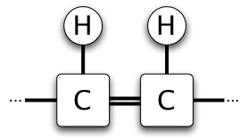
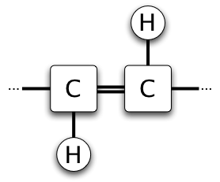
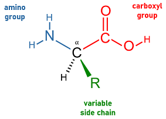
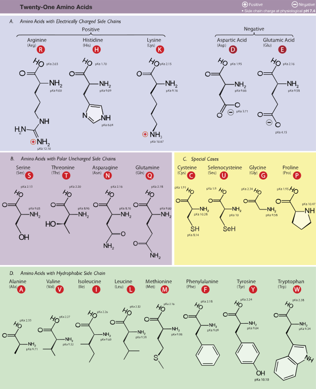
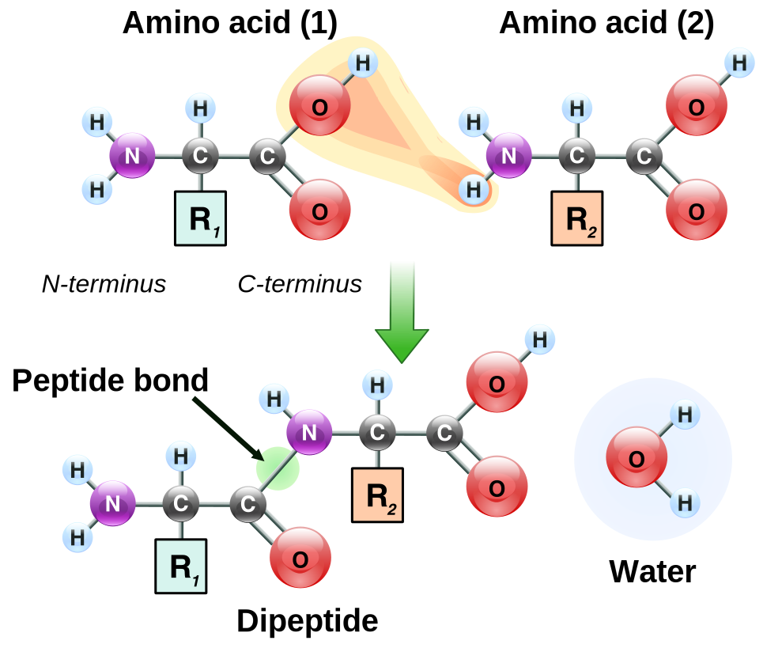
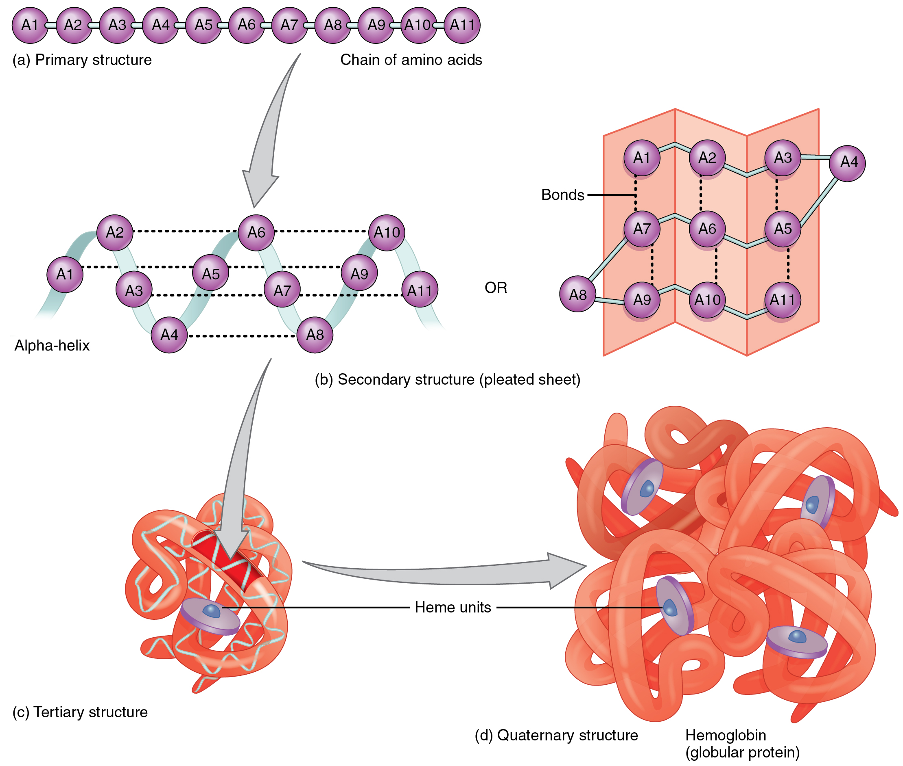
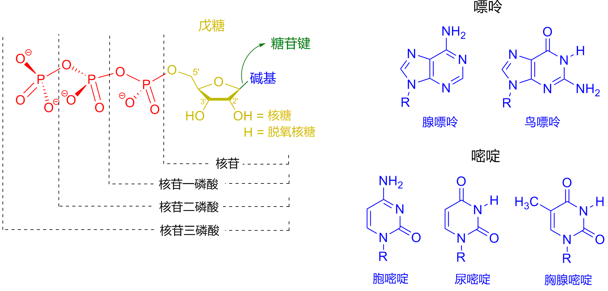
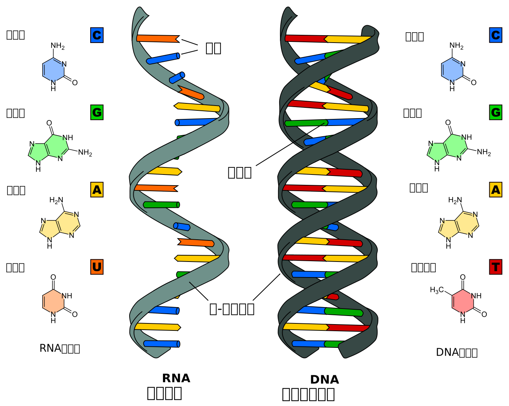

# 生物有机大分子

$$
\gdef\phh{\htmlStyle{display:inline-block;vertical-align:middle;}{\includegraphics[height=3.1em]{../Ph_1.svg}}}
\gdef\phx#1{\htmlStyle{display:inline-block;vertical-align:middle;}{\includegraphics[height=3.1em]{../Ph_2.svg}}\ce{#1}}
\gdef\chem#1#2{\htmlStyle{display:inline-block;vertical-align:middle;}{\includegraphics[height=#2]{../#1.svg}}}
\gdef\chemb#1#2{\htmlStyle{display:inline-block;}{\includegraphics[height=#2]{../#1.svg}}}
$$

## 脂质

### 脂类

脂类又称脂质，是一组广泛的有机化合物，包括脂油脂、固醇、脂溶性维生素、磷脂等。脂类不溶于水而易溶于脂肪溶剂（醇、醚、氯仿、苯）等非极性有机溶剂，主要生理功能包括储存能量、膜的讯息传导、作为细胞膜的结构成分。

脂质可以广义定义为疏水性或双亲性小分子；某些脂质因为其双亲性的特质（兼具亲水性与疏水性），能在水溶液环境中形成囊泡、脂质体或膜等构造。

脂类包含油脂，而非其同义词；脂肪属于脂类的一种。

### 脂肪酸

| 饱和脂肪酸 | 不饱和脂肪酸 | 反式不饱和脂肪酸 |
| ---------- | ------------ | ---------------- |
|  |  |  |
| 硬脂酸：$\ce{C17H35COOH}$。 软脂酸：$\ce{C15H31COOH}$。 | 油酸：$\ce{C17H33COOH}$。 亚油酸：$\ce{C17H31COOH}$。 |

口诀：软 $15$、硬 $17$、油酸不饱 $17$ 烯；亚油酸再多一个烯；最后均含一羧基。

### 磷脂与糖脂

磷脂：

- 也称磷脂质，是含有磷酸的脂类，属于复合脂。磷脂为两性分子，一端为亲水的含氮或磷的头，另一端为疏水（亲油）的长烃基链。

    { width="50%" }

- 由于此原因，磷脂分子亲水端相互靠近，疏水端相互靠近，常与蛋白质、糖脂、胆固醇等其他分子共同构成脂双分子层，即细胞膜的结构，是细胞中所有膜状构造的主要成分。

糖脂：

- 糖脂是通过糖苷键连接的碳水化合物的脂质，它们的作用是保持膜的稳定性并促进细胞识别。 在所有真核细胞膜的表面上发现这些碳水化合物。

    { width="50%" }

- 它们从磷脂双层延伸到细胞外的含水环境中; 磷脂双层作为特定化学物质的识别位点，有助于保持膜的稳定性并使细胞彼此附着以形成组织。

### 油脂和脂肪

油脂，即油和脂，在口语上，油指常温下呈液态的油脂，脂指常温下呈固态的脂，植物性甘油三酯多为油，动物性甘油三酯多为脂。脂肪通常指甘油三酯类，也就是油和脂，狭义上、尤其是口语上特指固态的脂。

脂肪的化学结构是甘油三酯，为非极性物质，以非水合形式贮存，是体内储量最大、产能最多的能源物质。甘油三酯由甘油和脂肪酸组成；其中甘油的分子比较简单，而脂肪酸的种类和长短却不相同，包括饱和脂肪酸、单不饱和脂肪酸、多不饱和脂肪酸。

在细胞里，三酸甘油酯可以自由穿过细胞膜，原因是其无极性，与组成细胞膜的类脂双层不产生反应。

注意：油脂不是高分子化合物。油脂是甘油（丙三醇）与三个高级脂肪酸通过酯化反应形成的酯：

{ width="70%" }

三个脂肪酸 $\ce{RCOOH},\ce{R'COOH},\ce{R''COOH}$ 可能为相同（简单甘油酯）、相异或部份相异（混合甘油酯）的烷基。

油脂作为一种酯，可以发生经典的酸性和碱性水解，油脂在碱性溶液中水解反应又称**皂化反应**，产物甘油与硬脂酸钠称为皂化液，皂化液经饱和食盐水盐析即可析出高级脂肪酸的钠盐，再经过一系列处理可以得到肥皂。

油脂的氢化：不饱和程度较高、熔点较低的液态油，通过催化加氢可提高饱和程度，转化为半固态脂肪这个过程称为油脂的氢化，也称油脂的硬化。制得的油脂叫人造脂肪，通常又称为硬化油。硬化油不易被空气氧化变质，便于储存和运输，可以制造肥皂和人造奶油的原料。

### 甾体和固醇

**腺甾烷**另译甾烷，或称甾核，由三个环己烷和一个环戊烷共四个烃环融合而成。

{ width="40%" }

腺甾烷的衍生物：

| 腺甾烷 | 雄烷 | 雌烷 | 孕烷 | 胆烷 |
| :-: | :-: | :-: | :-: | :-: |
| 胆固醇 | 睾酮 | 雌二醇 | 孕酮 | 胆酸 |

类固醇又称甾体、类甾醇，其特征是有一个四环的母核（甾核）。必须注意的是，类固醇的意思是类似固醇，其不一定属于醇类；为避免名称中类与醇在上下文中造成误解或歧义，常改称甾体。

固醇属于类固醇的一个子群，固醇是最早发现的类固醇化合物，自然界中分布甚广。广义上的固醇，包括最简单的腺甾醇；而狭义上的固醇，还需在 $17$ 号 $\ce{C}$上有一个约 $8\sim10$ 碳原子的烃侧链。

$$
\begin{aligned}
& \quad \ce{\chemb{Testosteron}{6em} & \small{睾酮}\\
->[芳香化酶] & \quad \chemb{Estradiol}{6em} & \small{雌二醇}\\
->[戊酸酯化] & \quad \chemb{Estradiol_valerate}{6em}} & \small{戊酸雌二醇}\\
\end{aligned}
$$

### 洗涤剂去污

1. 肥皂的去污作用：

    普通的肥皂约含质量分数 $70\%$ 的高级脂肪酸的钠盐，$30\%$ 的水和少量的盐。有些肥皂内还加有填充剂、香料及染料等。肥皂的去污作用主要是高级脂肪酸的钠盐的作用。从结构上看，高级脂肪酸钠的分子可以分为两部分，一部分是极性的 $\ce{-COONa}$ 或 $\ce{—COO-}$，这一部分可溶于水，叫做亲水基。另一部分是非极性的链状的烃基 $\ce{—R}$，这一部分在结构上跟水的差别很大，不能溶于水，叫做憎水基。憎水基具有亲油的性质。在洗涤的过程中，污垢中的油脂跟肥皂接触后，高级脂肪酸钠分子的烃基就插入油滴内。而易溶于水的羧基部分伸在油滴外面，插入水中。这样油滴就被肥皂分子包围起来。再经摩擦、振动，大的油滴便分散成小的油珠，最后脱离被洗的纤维织品，而分散到水中形成乳浊液，从而达到洗涤的目的。

2. 合成洗涤剂：

    根据对肥皂去污原理的研究，人们认识到凡是分子的两端分别具有亲水基和憎水基的物质都有一定的去污能力。因此，可以利用人工合成的方法来合成具有这种结构的物质作为洗涤剂。这就是人们日常所用的合成洗涤剂。目前，常用的合成洗涤剂的主要成分是烷基苯磺酸钠或烷基磺酸钠。其中亲水基都是极性基团 $\ce{—SO3Na}$，式中 $\ce{R}$ 一般是含十个以上碳原子的烃基。烃基含碳原子太少时，憎水作用太弱，使得憎水基跟油的结合力不强。相反地，烃基含碳原子太多时，就不容易溶于水。所以烃基太大或太小都不能很好地达到去污的目的。

## 糖类

糖类，指的是一系列多羟基醛或多羟基酮及其缩聚物，或者其衍生物的总称。

以前所有分子式可写成 $\ce{C_m(H2O)_n}$ 的化学物质皆被称为**碳水化合物**，但是现在生物化学理解上的糖类是指除了碳数不为一和二的「碳水化合物」。

### 单糖概述

单糖因无法水解为更小的碳水化合物，因此是糖类中最小的分子。它们是一些具有两个或者更多羟基的醛或酮类化合物。

单糖是新陈代谢中的主要燃料，能提供能量（当中以葡萄糖最主）及用于生物合成。单糖未需即时使用的话，细胞会先将其转换成较省空间的形式，通常为多糖。在包括人类的许多动物中，这种储存方式是糖原，特别在肝脏及肌肉细胞。在植物中，则储存成淀粉。

戊糖又称五碳糖，是含有 $5$ 个碳原子的单糖，分子式为 $\ce{C5H10O5}$。

- 在 $1$ 号碳上有醛基的称为五碳醛糖（戊醛糖）。

- 在 $2$ 号碳上有酮基的称为五碳酮糖（戊酮糖）。

己糖又称六碳糖，是含有 $6$ 个碳原子的单糖，分子式为 $\ce{C6H12O6}$。

- 在 $1$ 号碳上有醛基的称为六碳醛糖（己醛糖）。

- 在 $2$ 号碳上有酮基的称为六碳酮糖（己酮糖）。

| | 1 | 2 | 3 | 4 |
| :-: | :-: | :-: | :-: | :-: |
| 戊糖 |  核糖 |  阿拉伯糖 |  木糖 |  来苏糖 |
| 己糖 |  葡萄糖 |  半乳糖 |  果糖 |  山梨糖 |

单糖发生的反应：

- 单糖经氢化还原，可以得到糖醇。

- 发酵反应：$\ce{C6H12O6 ->[酒化酶] 2C2H5OH + 2CO2 ^}$。

- 呼吸作用：$\ce{C6H12O6 + 6O2 ->[酶] 6CO2 + 6H2O}$。

### 双糖概述

由两个连接成一起的单糖组成的糖类，称为双糖，双糖化学式为 $\ce{C12H22O11}$。

双糖是由两个单糖单元通过脱水反应，形成一种称为糖苷键的共价键连接而成。在脱水过程中，一分子单糖脱除氢原子，而另一分子单糖脱除羟基。

虽然双糖种类繁多，但大多数并不常见。

- 麦芽糖，由两分子**葡萄糖**形成。

- 乳糖，由一分子**葡萄糖**与一分子**半乳糖**形成，广泛的存在于天然产物中。

- 蔗糖，由一分子**葡萄糖**与一分子**果糖**形成，是存量最为丰富的双糖，它们是植物体内存在最主要的糖类。

双糖还可分类为还原性双糖与非还原性双糖：

- 通过两个单糖分子的半缩醛（酮）羟基脱去一分子水而相互连接。这样的双糖，分子中已没有半缩醛（酮）羟基存在，因此其中任何一个单糖部分都不能再由环式转变成醛（酮）式。

- 还原糖：若两分子单糖结合后所形成的双糖分子之结构仍具有一个游离的半缩醛羟基，在碱性溶液中具有还原性，则该双糖属于还原糖，例如**乳糖**、**麦芽糖**等。还原糖可使用斐林试剂进行检测，会生成砖红色沉淀。

- 非还原糖：非还原糖的分子结构中没有游离的半缩醛羟基，因此不具还原性。常见的例子有**蔗糖**和**海藻糖**等。与还原糖相比，非还原糖的化学反应性较低，因此在生物体储存糖类时其较高的稳定性可能为一优势。

### 多糖概述

寡糖和多糖都是由单糖单元通过糖苷键组成的长链分子，分子式可以表示为 $\ce{(C6H10O5)_n}$，两者的区别在于其链上单糖单元的数量。

- 寡糖又称低聚糖，是指由少量单糖聚合而成的碳水化合物，定义上寡糖可以表示 $3\sim10$ 个单糖单元或 $2\sim6$ 个单糖单元，后者寡糖也包含了双糖。

- 多糖由多个单糖分子脱水聚合，以糖苷键连接而成，可形成直链或者有分支的长链，水解后得到相应的单糖和寡糖。例如用来储存能量的淀粉和糖原，以及用来组成生物结构的纤维素和甲壳素。

- 同时，按照单糖单元的种类，可以将多糖分为均一多糖（由一种单糖分子缩合而成的多糖）和不均一多糖（由不同的单糖分子缩合而成的多糖）。

多糖：

- 淀粉 $\ce{(C6H10O5)n}$，由通过糖苷键连接的大量葡萄糖单元组成，由于淀粉呈粉状，且分散在水中会向下沉淀，故名淀粉，是人类饮食中最常见的碳水化合物。

    纯淀粉为一种白色、无味、无臭的粉末，不溶于冷水或酒精。淀粉因分子内氢键卷曲成螺旋结构的不同，可分为直链淀粉（糖淀粉）和支链淀粉（胶淀粉）。

    直链淀粉遇碘呈蓝色，支链淀粉遇碘呈紫红色。这是由于淀粉螺旋中央空穴恰能容下碘分子，由于范德华力，两者形成一种蓝黑色错合物。单独的碘分子与三碘阴离子（$\ce{I^3-}$）都能使淀粉变蓝。

    淀粉可以在稀酸（如稀硫酸）加热或酶的催化下水解，经多步最终生成麦芽糖，注意麦芽糖是淀粉酶分解淀粉产生的双糖。

    | 水解状态   | 加入银氨溶液水浴加热的现象 | 加入新制氯化铜的现象 | 加入碘水的现象 |
    |:----------:|:--------------------------:|:--------------------:|:--------------:|
    | 未水解     | 无明显现象                 | 无明显现象           | 溶液变蓝       |
    | 部分水解   | 产生银镜                   | 产生砖红色沉淀       | 溶液变蓝       |
    | 完全水解   | 产生银镜                   | 产生砖红色沉淀       | 无明显现象     |

    验证⽔解产物时，⾸先要加⼊氢氧化钠溶液中和后再进⾏实验。

- 糖原 $\ce{(C6H10O5)_n}$ 由葡萄糖脱水缩合作用而成，主要生物学功能是作为动物和真菌的能量储存物质。

    肌糖原只能供给肌肉细胞所用，不能提升血糖浓度。

    肝糖原负责补充血糖使之维持稳定浓度；可以分解成葡萄糖，并释放到血液，供给肌肉以及其他器官，是提供身体的能量来源。

- 纤维素 $\ce{(C6H10O5)_n}$，由葡萄糖组成，是地球上最丰富的有机聚合物，是自然界中分布最广、含量最多的一种多糖，是组成植物细胞壁的主要成分。反刍动物因在瘤胃中含有可分泌纤维素酶的微生物，如纤维杆菌、纤维素单胞菌、瘤胃球菌等而可以消化纤维素。

- 几丁质 $\ce{(C8H13O5N)_n}$ 是一种含氮的多糖，由多数经 N-乙酰修饰的 D-葡糖胺及少数 D-葡糖胺形成线性的聚合物，也称为聚 N-乙酰基-D-葡糖胺。存于节肢动物外骨骼、软体动物骨骼、真菌以及某些藻类细胞壁中。

寡糖有类似水溶性膳食纤维的功能，能促进肠蠕动，改善便秘、腹泻等问题。原因是人体小肠只能不完全消化寡糖，因此寡糖未能消化的部份会让肠道的菌落利用，因而改变肠道生态，使人体消化道菌丛生态正常化，并增加有益菌数，帮助改善肠的正常消化及运动，减少毒素吸收、预防肠癌、肠炎等的发生率，且能改善血脂水平。虽然寡糖甜甜的，但因为分子较大，细菌不容易分解利用，所以不会引起蛀牙。而且因为寡糖是难消化性，摄取后血糖值不会增高，对于糖尿病患及怕胖又想吃甜者可适量摄取。

### 纤维素用途

1. 制造纤维素硝酸酯。

    棉花和浓硝酸浓硫酸在一定条件下，生成以纤维素三硝酸酯为代表的火棉（含氮量 $12.5\%\sim13.8\%$），而含氮量低（$10.5\%\sim12\%$）的称为胶棉。

    火棉遇火迅速燃烧，在密闭容器中发生爆炸，可用作无烟火药；胶棉也易于燃烧，但并不爆炸。

2. 制造纤维素乙酸酯：纤维素乙酸酯俗称醋酸纤维，是由棉花跟乙酸酐（$\ce{(CH3CO)2O}$）的混合物在一定条件下反应制得的。

3. 制造黏胶纤维：是纤维素依次用 $\ce{NaOH}$ 浓溶液和 $\ce{CS2}$ 处理，再把生成物溶于 $\ce{NaOH}$ 稀溶液中即形成黏胶液。

4. 造纸。

## 蛋白质

### 氨基酸

氨基酸，是构成蛋白质的基本单位，赋予蛋白质特定的分子结构形态，使其分子具有生化活性。不同的氨基酸脱水缩合形成肽，其缩合产生的酰胺键称肽键。肽虽然和蛋白质在化学本质上除了聚合的长度外没什么不同，但是往往不像蛋白质有多级构造与特定功能。

{ width="50%" }

$\alpha$ 氨基酸的结构式

根据氨基连结在羧酸中碳原子的位置，可将氨基酸分为 $\alpha,\beta,\gamma,\delta,\dots$ 等类型，在生物化学中，若无明示，氨基酸通常默认 $\alpha$ 氨基酸，即胺基和羧基直接连接在同一个 $\ce{-CH-}$ 结构上的氨基酸，其通式是 $\ce{H2N-CHR-COOH}$。

{ width="100%" }

天然的氨基酸都是无色结晶，熔点约在 $\pu{230^oC}$ 以上，都能溶于强酸或强碱溶液中，除胱胺酸、酪胺酸、二碘甲状腺素外，均易溶于水；除脯胺酸和羟脯胺酸外，均难溶于乙醇和乙醚。
具有两性，有碱性（二元胺基一元羧酸）、酸性（一元胺基二元羧酸）、中性（一元胺基一元羧酸）三种类型。大多数氨基酸都呈显不同程度的酸性或碱性，呈显中性的较少，所以既能与酸结合成盐，也能与碱结合成盐。

### 蛋白质

蛋白质，常简称蛋白，由一个或多个由 $\alpha$-氨基酸残基组成的长链条组成。$\alpha$-氨基酸分子呈线性排列，相邻 $\alpha$-氨基酸残基的羧基和氨基通过肽键连接在一起，最后经过折叠形成有功能的立体结构。蛋白质的 $\alpha$-氨基酸序列是由对应基因所编码。

蛋白质、肽、多肽这些名词的含义在一定程度上有重叠，经常容易混淆。蛋白质通常指具有完整生物学功能并有稳定结构的分子；而肽则通常指一段较短的氨基酸寡聚体，常常没有稳定的三维结构。然而，蛋白质和肽之间的界限很模糊，通常以 $20\sim30$ 个残基为界。多肽可以指任何长度的氨基酸线性单链分子，但常常表示缺少稳定的三级结构。

氨基酸的侧链是构成蛋白质结构的重要元素，它们具有不同的化学性质，因此对于蛋白质的功能至关重要。多肽链中的氨基酸之间是通过脱水反应所形成的肽键来互相连接；一旦形成肽键成为蛋白质的一部分，氨基酸就被称为残基，而连接在链的碳、氮、氧原子被称为主链或蛋白质骨架。

{ width="80%" }

由于氨基酸的非对称性（两端分别具有氨基和羧基），蛋白质链具有方向性。蛋白质链的起始端有自由的氨基，被称为 $\ce{N}$ 端或氨基端；尾端则有自由的羧基，被称为 $\ce{C}$ 端或羧基端。

大多数的蛋白质都自然折叠为一个特定的三维结构，这一特定结构被称为天然状态。虽然多数蛋白可以通过本身氨基酸序列的性质进行自我折叠，但还是有许多蛋白质需要分子伴侣的帮助来进行正确的折叠。生物化学家常常用以下四个方面来表示蛋白质的结构：

- 蛋白质一级结构：组成蛋白质多肽链的线性氨基酸序列，一个蛋白质是一个聚酰胺。

- 蛋白质二级结构：依靠不同氨基酸之间的基团间的氢键形成的稳定结构，因为二级结构是局部的，不同的二级结构的许多区域可存在于相同的蛋白质分子。

- 蛋白质三级结构：通过多个二级结构元素在三维空间的排列所形成的一个蛋白质分子的三维结构，是单个蛋白质分子的整体形状。蛋白质的三级结构大都有一个疏水核心来稳定结构，具有稳定作用的还有氢键和二硫键。三级结构常常可以用折叠一词来表示。三级结构控制蛋白质的基本功能。

- 蛋白质四级结构：由几个蛋白质分子（多肽链），通常称为蛋白质亚基所形成的结构，在功能上作为一个蛋白质复合体。

{ width="100%" }

蛋白质并不完全是刚性分子，许多蛋白质在执行生物学功能时可以在多个相关结构中相互转换。在进行功能型结构重排时，这些相关的三级或四级结构通常被定义为不同构象，而这些结构之间的转换就被称为构象变换。例如，酶的构象变换常常是由底物结合到活性位点所导致。在溶液中，所有的蛋白质都会发生结构上的动态变化，主要表现为热振动和与其他分子之间碰撞所导致的运动。

变性作用：

- 物理因素：加热、加压、搅拌、振荡、紫外线照射、X 射线、超声波等。

- 化学因素：强酸、强碱、尿素、重金属盐、非生理浓度的盐类、有机溶剂（甲醛，酒精，苯甲酸等）。

变性为不可逆的化学过程，引起蛋白质结构的改变，形成沉淀，并引起生理活性的消失、易受蛋白脢的水解。变性作用破坏了蛋白质的二级、三级、四级结构，一般不会影响其初级结构。⼄醇、碘酒杀菌消毒的原理是使细菌、病毒蛋⽩质变性死亡，⻝物加热烹调使蛋⽩质变性，利于酶发挥作⽤使其消化。

## 核酸

### 核酸的结构

核酸的单体结构为核苷酸，每个核苷酸由一个核苷（一个五碳糖、一个含氮碱基）和一个或多个磷酸基团组成。

{ width="90%" }

- 如果其五碳糖是脱氧核糖，则此单体的聚合物是脱氧核糖核酸 DNA。

- 如果其五碳糖是核糖，则此单体的聚合物是核糖核酸 RNA。

{ width="90%" }

核酸的结构可分为一级结构、二级结构、三级结构和四级结构。

碱基互补配对：

| 胞嘧啶、鸟嘌呤 之间生成三条氢键 | 腺嘌呤、胸腺嘧啶 之间生成两条氢键 |
| :---------------------------------: | :-----------------------------------: |
|              |                |

最终形成脱氧核糖核酸的形式如下：

{ width="90%" }

### 特殊的碱基

$\text{5-BrdU}$（5-溴尿嘧啶脱氧核糖核苷）：

- $\text{5-BrdU}$ 是一种**合成的**核苷类似物，其结构特征为胸腺嘧啶的 5 号位甲基被溴原子取代，形成溴代嘧啶环。

- $\text{5-BrdU}$ 与胸腺嘧啶（$\text{T}$）竞争，与腺嘌呤（$\text{A}$）配对，可以通过免疫荧光染色显示增殖细胞（绿色荧光）。

二腺嘌呤（$\text{Z}$）：

- $\text{Z}$ 是一种嘌呤类碱基，与腺嘌呤（$\text{A}$）相比，在 2 号位位置多了一个氨基（$\ce{-NH2}$），使得它与胸腺嘧啶（$\text{T}$）配对时能形成三个氢键（$\text{A}$ 与 $\text{T}$ 仅有两个氢键），显著增强了碱基对的稳定性。

- $\text{Z}$ 最早于 1977 年在蓝细菌噬菌体 S-2L 的基因组中被苏联科学家发现，其完全取代了腺嘌呤，成为噬菌体 DNA 的组成碱基。近年研究发现，含有 $\text{Z}$ 基因组的噬菌体分布广泛。$\text{Z}$ 基因组的合成系统（如 PurZ 酶）可能起源于古菌，并通过水平基因转移传播至噬菌体。

- $\text{Z}$ 与腺嘌呤（$\text{A}$）竞争，与胸腺嘧啶（$\text{T}$）配对，其引入改变了 DNA 的理化性质，可能影响蛋白质与 DNA 的相互作用。从而 $\text{Z}$-DNA 对细菌的限制性内切酶具有抗性，因为宿主酶无法识别 $\text{Z}$-$\text{T}$ 配对，从而保护噬菌体基因组不被切割。$\text{Z}$ 的合成涉及多酶系统。

次黄嘌呤（$\text{I}$）：

- 次黄嘌呤是嘌呤的衍生物，其结构与腺嘌呤相似，但缺少氨基（$\ce{-NH2}$），取而代之的是酮基（$\ce{C=O}$）。

- $\text{I}$ 可以与 $\text{A}$、$\text{U}$、$\text{C}$ 三个碱基配对（摆动配对），这加强了密码子的简并性，提高了翻译效率。次黄嘌呤可能参与 DNA 错配修复，但其在 DNA 中的异常积累也会导致双链不稳定。

### 碱基配对计算

根据查戈夫法则，一条双链 DNA 分子中，**嘌呤碱基数**等于**嘧啶碱基数**（即 $\mathrm{A + G = T + C}$）。

沃森-克里克规则认为，腺嘌呤（A）必须与胸腺嘧啶（T）配对，鸟嘌呤（G）必须与胞嘧啶（C）配对，由于现在发现还有很多不同的碱基，这条规则已经不适用，但是一定范围内可以这样认为。
