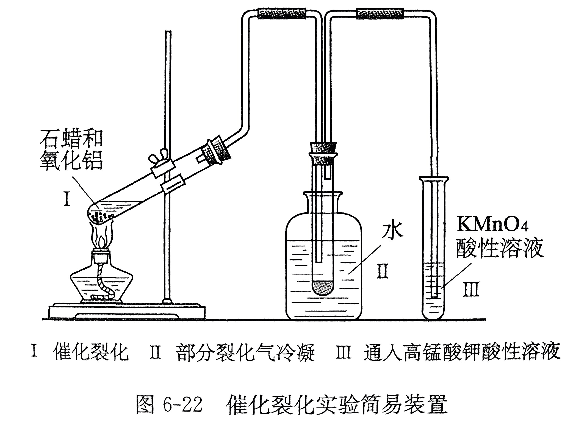

# 煤与石油的利用

烃的自然界主要来源是石油和天然气、

天然气的主要成分是甲烷，通常甲烷体积分数可达 $80\%\sim98\%$，通常还含有乙烷、丙烷、二氧化碳、氮气等。天然气是一种优良的气体燃料。

石油是当今主要的能源，也是主要的化工原料。通过石油炼制，可以得到汽油、煤油、柴油等各种烃。用石油产品和石油气作为原料来生产化工产品的工业简称石油化工。

利用石油产品作为原料，通过化工过程可以制造合成纤维、合成橡胶、塑料以及农药化肥等，石油称为工业的血液。

## 煤的利用

煤在工业上曾经是获得芳香烃的重要来源，不同的煤含碳量不同，通常可以分为无烟煤（$95\%$）、烟煤（$70\sim80\%$）、褐煤（$50\sim70\%$）、泥煤（$50\sim60\%$）。煤除了碳以外，还含有少量的硫、磷、氢、氮、氧、硅、铝、钙、铁等元素。

### 煤的气化

生成水煤气的反应：

$$
\ce{C + H2O(g) ->[高温] CO + H2}
$$

通常认为煤气的主要成分就是一氧化碳和氢气，这里假定煤气就是水煤气。

### 煤的液化

直接液化：煤与氢气在一定条件下生成液体染料。

间接液化：先转化为水煤气，然后再催化剂的作用下合成烃、醇等产品。

### 煤的干馏

高温干馏：把烟煤放在容器里隔绝空气加强热（$\pu{1000^oC}$ 以上），会有气体放出，这些气体经过冷却：

- 凝结出水，水中溶解有氨气，称为粗氨水。

- 还有一种黑褐色粘稠油状物（煤焦油），含有多种芳香族化合物（有数百种物质），可以通过分馏进行分离。

    | 分馏温度（$\pu{^oC}$） | 主要物质 | 用途 |
    | :-: | - | :-: |
    | $<170$ | 苯、甲苯等苯的同系物 | 炸药、燃料、农药 |
    | $170\sim230$ | 酚类和萘 | 燃料、农药、医药 |
    | $>230$ | 复杂的芳香族化合物 | 合成材料 |
    | 剩下的粘稠黑色物质 | 沥青 | 铺路、建筑材料 |

- 向外溢出的气体很溶液燃烧，称为焦炉（煤）气，主要成分是氢气和甲烷，还有少量一氧化碳、二氧化碳、乙烯、氮气等。

高温干馏得到的煤焦油较少，把温度降到 $500\sim600^\circC$ 称为低温干馏，低温干馏得到的煤焦油中还含有烷烃、烯烃和环烷烃，低温干馏适用于褐煤。

## 石油的利用

石油中绝大部分元素为碳和氢，同时含有少量的硫、氧、氮等。石油的大部分是液态烃，其中溶有气态烃和固态烃。

从油田里开采出来的没有经过加工处理的石油叫做原油，原油成分复杂，含有水、氯化钙、氯化镁等盐类。原油需要先经过脱水、脱盐等处理过程，才能进行炼制。

| 石油炼制方法           | 目的                                   | 原理                                                                 | 原料                   |
|------------------------|----------------------------------------|----------------------------------------------------------------------|------------------------|
| 常压分馏（物理）       | 获得以燃料油为常压主的不同石油分馏产品 | 用蒸发和冷凝的方法将原油分成不同沸点范围的馏分                         | 原油                   |
| 减压分馏（物理）       | 获得以润滑油为主的不同石油产品         | 通过减压降低重油的沸点，从重油中分离出不同沸点范围的馏分               | 重油                   |
| 催化裂化（化学）       | 提高汽油的产量和质量                   | 在加热、加压和催化剂存在的条件下，将相对分子质量大、沸点高的烃裂解成相对分子质量小、沸点低的烃 | 重油、凡士林、石蜡     |
| 裂解（化学）           | 获得有机化工原料                       | 又称深度裂化，在更高温度下，深度裂化，使长链烃断裂成相对分子质量小的气态烃或液态烃           | 煤油和柴油             |
| 催化重整（化学）       | 获得芳香烃和提高汽油的质量             | 在催化剂作用下，把汽油中的直链烷烃转化为芳香烃和具有支链的异构烷烃                         | 汽油                   |

### 石油的分馏

石油的分馏：根据沸点不同分离得到汽油、煤油、柴油等轻质油。

经过脱水、脱盐的石油主要是烃类的混合物，没有固定的沸点。在烃分子里，一般含碳数越少沸点越低，含碳数越多沸点越高，不断加热和冷凝就可以把石油分成不同沸点范围的蒸馏产物，称为石油的分馏，分馏出来的各个成分叫做馏分，每一种馏分仍然是多种烃的混合物。

经过常压加热炉、常压分馏炉后，从分馏塔底部流出的称为重油，可以再加以分馏，但是在高温下，烃受热会分解，同时还会产生碳化结晶损坏设备，因此通常采用减压蒸馏的方法。外界压强越小，物质的沸点越低，仍然在减压分馏塔底部流出的称为渣油。润滑油馏分还要进行加工，脱去凡士林、石蜡等，经精制才能得到各种润滑油。渣油经过处理，可以制造沥青，或者焦化制取石油焦。

| 分馏产品 | 碳原子数 | 沸点范围（$\pu{^oC}$） | 用途 |
| :-: | :-: | :-: | - |
| 溶剂油 | $5\sim6$ | $30\sim150$ | 作有机溶剂 |
| 汽油 | $5\sim11$ | $<220$ | 汽车等汽油机燃料 |
| 航空煤油 | $10\sim15$ | $150\sim250$ | 喷气式飞机燃料 |
| 煤油 | $11\sim16$ | $180\sim310$ | 照明灯燃料 |
| 柴油 | $15\sim18$ | $200\sim360$ | 重型汽车、轮船、拖拉机等柴油机染料 |
| 润滑油 | $16\sim20$ | $>360$ | 润滑剂、防锈剂 |
| 凡士林 | 液态烃和固态烃的混合物 | $>360$ | 润滑剂、防锈剂、制药膏 |
| 石蜡 | $20\sim30$ | $>360$ | 绝缘材料 |
| 沥青 | $30\sim40$ | $>360$ | 铺路、建筑材料 |
| 石油焦 | 主要成分是碳 | $>360$ | 制电极、生成碳化硅等 |

### 石油的裂化

裂化是将分子量大的烃断裂成分子量相对较小的烃的过程，例如：

$$
\ce{C16H34 ->[加热加压][\cat] C8H18 + C8H16}
$$

可以将重油转化为类似汽油的饱和烃和不饱和烃的混合物。

### 石油的裂解

有些裂化产物还会继续分解，生成饱和或不饱和气态烃，得到乙烯、丙烯、甲烷等重要的化工原料，称为裂解即深度裂化。

$$
\begin{align}
\ce{C8H18 &->[加热加压][\cat] C4H10 + C4H8}\\
\ce{C4H10 &->[加热加压][\cat] C2H4 + C2H6}\\
\ce{C4H10 &->[加热加压][\cat] CH4 + C3H6}\\
\end{align}
$$

实际生产过程中，热裂化过程如果温度过高，会发生结焦现象，影响生成的进行，因此通常使用催化剂，成为催化裂化。

### 石油的重整

石油的分馏与裂化不能得到苯和甲苯的芳香烃，这些曾经是从煤的干馏得到的，现在工业用石油的催化重整来大量生产。

重整就是把汽油里直链烃类的分子结构重新进行调整，使他们转化为芳香烃或具有支链的烷烃异构体，通常是在催化剂加热的条件下进行，根据催化剂的种类称为铂重整、铼重整等。
