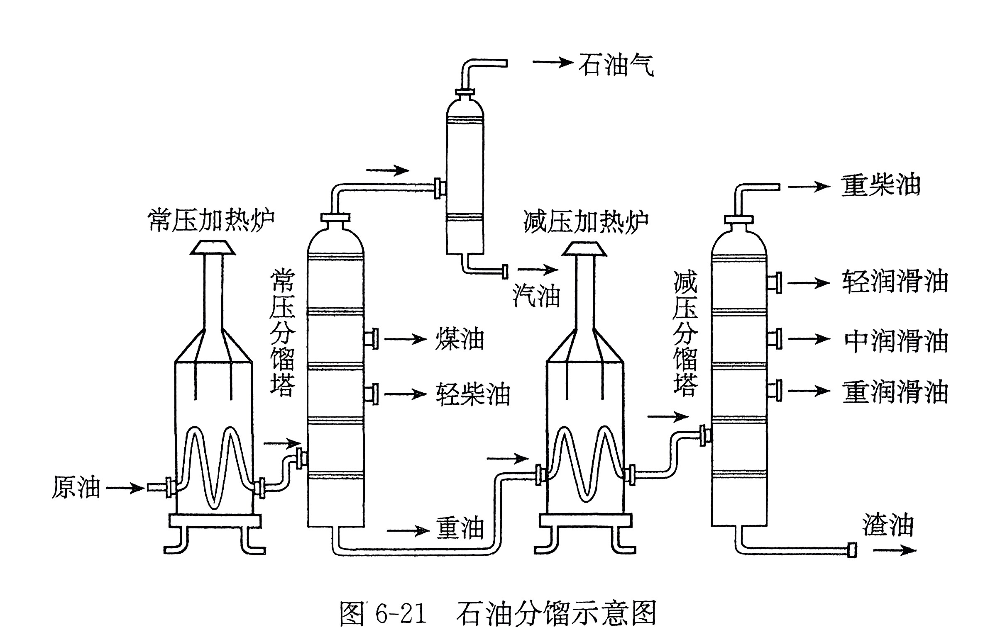

# 有机合成高分子

**聚合反应**：

- 乙烯可以和自己聚合，生成环丁烷、环己烷等；当聚合的长度足够长，就难以形成环，即聚乙烯。

- 在适当的温度、压强和催化剂存在的条件下，乙烯分子中碳碳双键的一个键断裂，分子间通过碳原子相互结合形成很长的碳链，生成相对分子质量很大的聚合物——聚乙烯。

    $$
    \ce{n CH2=CH2 ->[催化剂] \underset{聚乙烯}{\poly{CH2-CH2}}}
    $$

像这样，由相对分子质量小的化合物分子相互结合成相对分子质量大的聚合物的反应叫做**聚合反应**。乙烯的聚合反应同时也是加成反应，这样的反应又被称为**加成聚合反应**，简称**加聚反应**。

*   **单体**：能合成高分子化合物的小分子物质，如乙烯（$\ce{CH2=CH2}$）。
*   **链节**：聚合物中重复的结构单元，如聚乙烯中的 “$-\ce{CH2-CH2}-$”。
*   **聚合度**：链节的数目 $n$。
*   **聚合物（高分子化合物）**：反应的生成物，如聚乙烯（$\ce{-[CH2-CH2]_n-}$）。

## 3. 羰醛缩合反应

羰基化合物分子中在羰基邻位碳原子上的氢原子（α-H）受羰基吸引电子作用的影响，具有一定的活泼性，分子内含有α-H的醛在一定条件下可以发生加成反应，生成β-羟基醛，该产物易失水，得到α,β-不饱和醛。

