# 有机物及其结构

## 有机化学

### 有机化合物

与无机物相比，有机物普遍具有以下性质：

* 物理性质：大多熔点较低，且难溶于水，易溶于汽油、乙醇、苯等有机溶剂。  
* 热稳定性：大多数有机物易燃，受热会分解。  
* 化学反应：有机物的化学反应较为复杂，常伴有副反应，许多反应需在加热、光照或催化剂作用下进行。

### 碳的成键特点

碳原子有四个价电子，使其不易失去或得到电子形成离子，故与各非金属元素之间形成共价键，但是有机物不一定就只能是共价化合物，离子化合物如有机酸盐等。

碳原子在有机物中，通常与四个原子直接相连，即配位数为 $4$，与一个碳原子相连的原子既可以是碳原子、也可以是其他原子，碳原子的这种独特的成键能力，是有机化合物多样性的根本原因。

!!! note "为什么硅没有形成硅基有机化合物？"
    1. 碳碳单键稳定性强，增强了有机物的稳定性。

    2. 碳的原子半径小，更容易形成双键和三键，增加了有机物的多样性。

    3. 碳具有适中的电负性，可以与很多非金属原子形成共价键，使有机物更稳定。

    4. 同样，原子半径小，空间位阻小，可以连接多个基团，形成复杂的、紧凑的三维结构。

碳原子间的共价键可以是：单键（$\ce{C - C}$）、双键（$\ce{C = C}$）、三键（$\ce{C # C}$）。

**碳骨架**：多个碳原子之间可以结合成碳链（包括直链和支链）或碳环，构成有机物分子链的碳骨架。 多个碳原子之间可以结合形成碳链，碳链既可以是一条直链，也可以带有支链；碳原子间也可以结合成碳环，环上的碳原子还可以连接支链。

- 饱和碳原子：单键碳原子。

- 不饱和碳原子：双键碳原子、三键碳原子、苯环碳原子。

含有不饱和键的有机化合物分子由于双键或三键中有**部分键**容易断裂；双键或三键两端的碳原子还可以结合其他原子或原子团，一般易于发生加成反应（苯环结构具有特殊性）。

### 不饱和度

不饱和度的定义：

$\Omega=$ 重键数 $+$ 最简环数

也就是说，一个不饱和度，也就是少了一对氢原子，例如，$\ce{C=C}$ 不饱和度为 $1$，$\ce{C#C}$ 为 $2$。

同时，不饱和度 $\Omega$ 也可以通过分子式求出：

$$
\begin{aligned}
\Omega(\ce{C_xH_y})&=\dfrac{(2x+2)-y}{2}\\
\Omega(\ce{C_xH_ySi_aX_m})&=\dfrac{2(x+a)+2-(y+m)}{2}\\
\Omega(\ce{C_xH_yO_qS_p})&=\dfrac{(2x+2)-y}{2}\\
\Omega(\ce{C_xH_yN_b})&=\dfrac{2(x+b)+2-(y+b)}{2}\\&=\dfrac{2x+2-y+b}{2}
\end{aligned}
$$

- 卤素原子 $\ce{X}$ 视为氢原子、硅视为碳原子。

- $\ce{C-O}$ 和 $\ce{C=O}$ 不影响不饱和度，硫也是。

- 一个苯环 $=$ 三个双键一个环，不饱和度为 $4$。

应用：

- 根据图算出不饱和度，又知道了除了氢原子个数以外的，直接通过不饱和度求氢原子数。

## 有机化合物

### 有机物的表示

| | 表示方式 | 示例 |
|  :-:  | - |  :-:  |
| 分子式 | 用元素符号表示物质的分子组成 | $\ce{CH4}$ |
| 最简式（实验式） | 用元素符号表示化合物中各元素原子个数的最简整数比 | $\ce{CH2O}$ |
| 电子式 | 在元素符号周围用「$\cdot$」或「$\times$」表示原子的最外层电子的成键情况 | 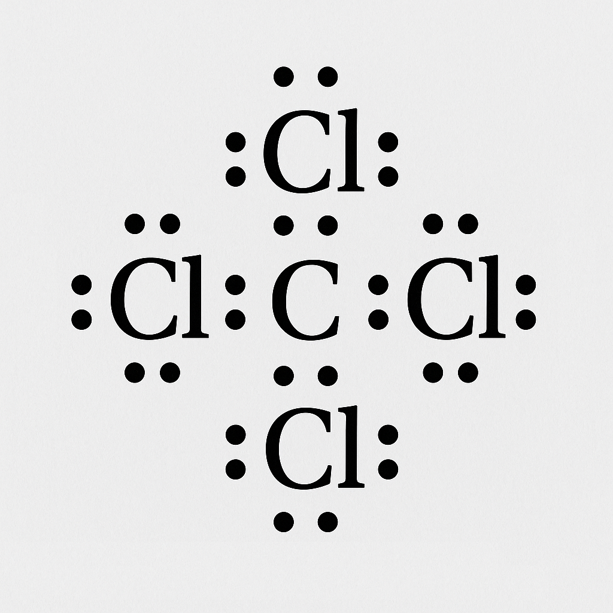{ width="200" } |
| 结构式 | 用短线「$\ce{-}$」来表示 1 个共价键，将所有原子连接起来 | { width="200" } |
| 结构简式 | 省略结构式中的单键「$\ce{-}$」，将与碳原子相连的其他原子写在其旁边，在右下角注明其个数 | $\ce{CH3CH = CH2}$ |
| 键线式 | 省略结构简式中与碳原子直接相连的氢原子，每个拐点或端点均表示一个碳原子，不足的用氢原子补足 | 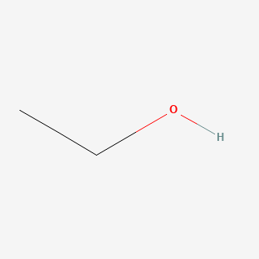{ width="200" } |
| 球棍模型 | 小球表示原子，短棍表示化学键 | 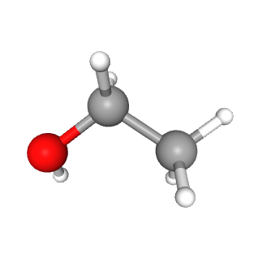{ width="200" } |
| <pre>空间填充模型</pre> | 用不同体积的小球表示不同大小的原子，相对大小关系应与原子实际相对大小关系一致 | 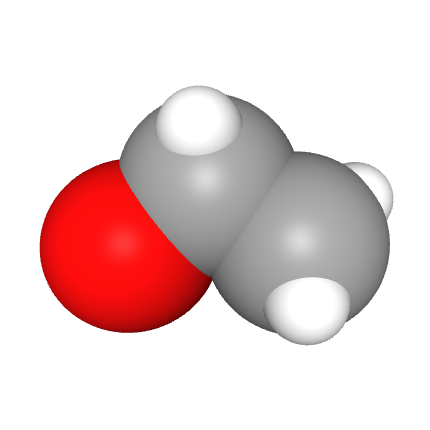{ width="200" } |

- 书写结构简式时，同一个碳原子上的相同原子或原子团可以合并，相邻且相同的原子团亦可以合并。

- 结构简式不能表示有机化合物的真实空间结构。

### 有机物的分类

同系物：结构相似，在分子组成上相差一个或若干个 $\ce{CH2}$ 原子团的化合物互称为同系物。烷烃就是一个同系物系列。

| 类别 | 通式 |
| :-: | - |
| 链烷烃 | $\ce{C_n H_{2n+2} (n \ge 1)}$ |
| 单烯烃 | $\ce{C_n H_{2n} (n \ge 2)}$ |
| 环烷烃 | $\ce{C_n H_{2n} (n \ge 3)}$ |
| 炔烃 | $\ce{C_n H_{2n-2} (n \ge 2)}$ |
| 二烯烃 | $\ce{C_n H_{2n-2} (n \ge 4)}$ |
| 苯及其同系物 | $\ce{C_n H_{2n-6} (n \ge 6)}$ |

- 同系物因组成和结构相似，化学性质相似，而物理性质如熔沸点、密度，一般呈规律性变化。

- 同系物定义中的「结构相似」是指碳链和成键方式相同、官能团相同、官能团数目相同、官能团与其他原子的连接
方式相同等。

| 类别 | 官能团名称 | 官能团结构 | 类别 | 官能团名称 | 官能团结构 |
| :-: | :-: | :-: | :-: | :-: | :-: |
| 烯烃 | 碳碳双键 | $\ce{C=C}$ | 炔烃 | 碳碳三键 | $\ce{C#C}$ |
| 卤代烃 | 碳卤键 | $\ce{-X}$ | 醇/酚 | 醇羟基/酚羟基 | $\ce{-OH}$ |
| 醚 | 醚键 | $\ce{-O-}$ | 胺 | 氨基 | $\ce{-NH2}$ |
| 醛 | 醛基 | $\ce{-CHO}$ | 酮 | 酮羰基 | $\ce{-CO-}$ |
| 羧酸 | 羧基 | $\ce{-COOH}$ | 酯 | 酯基 | $\ce{-COOR}$ |
| 酰胺/酰卤 | 酰胺/酰卤基 | $\ce{-CONH2/-COX}$ | 腈 | 氰基 | $\ce{-CN}$ |

### 有机物的命名

俗称命名法：

- 给予复杂分子的简单名称，并不考虑分子的真实结构、功能。

- 很多时候，有机化合物的俗称来源于它们被首次分离时所来源的有机体的名称，例如蚁酸。

习惯命名法：

- 根据碳原子数量：

    十以下：依次用甲、乙、丙、丁、戊、己、庚、辛、壬、癸表示。

    十以上：用中文数字表示。

- 碳原子数相同时：正（直链无支链的烷烃）、异（带有一个支链的烷烃）、新（带有两个支链的烷烃），正戊烷的主链是丁烷。

国际纯粹与应用化学联合会（IUPAC）发展了一套**系统命名法**，这是一套可以给予任意一个化合物一个唯一的名称的规则，这种名称可以直接地从其化学结构上推导出来。反过来，从系统名称也可以推出一个分子的结构。系统命名的问题在于，除了最简单的分子外，其他分子的名称都荒诞地不能读出来。在日常的演讲或写作中，化学家往往会漠视它们，使用系统和俗称命名法的混合。

系统名称可以分为三个部分：其一描述了碳氢骨架，其二描述了官能团，还有一个阐释了官能团在碳氢骨架上的位置。

1. 定主链：

    定主链要遵循「长」「多」原则：
    
    以最长的连续碳链为主链，以此主链决定烷烃的基本名称。
    
    当有几个相同长度的不同碳链时，选择含支链最多的一个作为主链。

    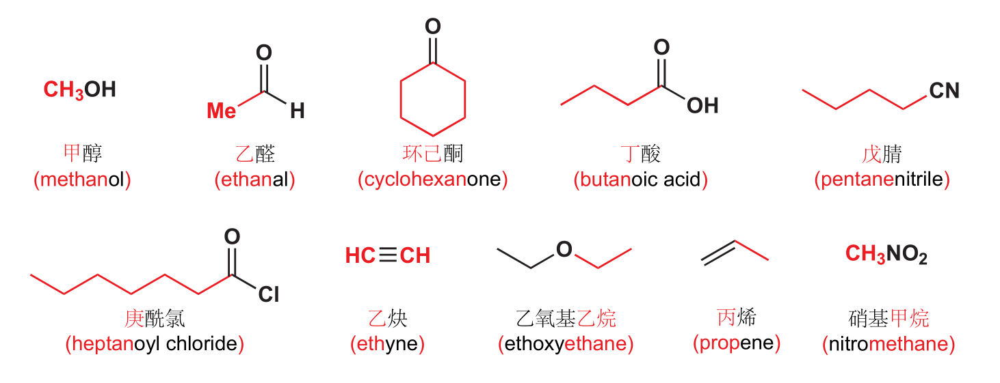

2. 定编号：

    以阿拉伯数字表示取代基或官能团的位置编号，以中文数字表示取代基个数，阿拉伯数字与汉字间以短横线「$-$」分开。

    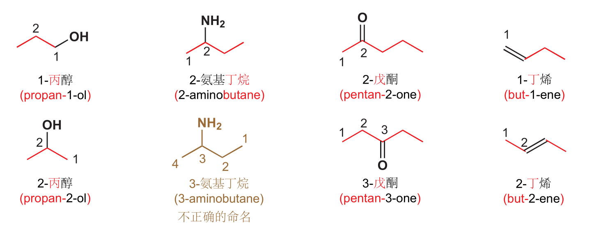

    多个取代基，编号位要遵循「近」「简」「小」 原则：

    - 首先考虑「近」：以 离支链较近 的一端给主链碳原子编号。

    - 同「近」考虑「简」：有两个不同的支链，且分别处于距主链两端同近的位置则从支链较简单的一端开始编号。

    - 同「近」同「简」考虑「小」：若有两个相同的支链，且分别处于距主链两端同近的位置，而中间还有其他支链，从主链的两个方向编号，可得到两种不同的编号序列，两序列中各支链位次和最小者即为正确的编号。

    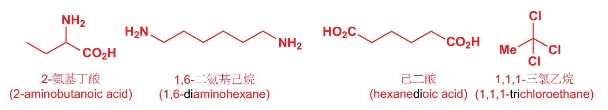

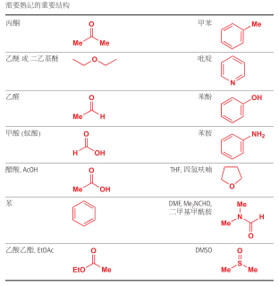{width="100%"}

- 对于烯烃和炔烃：

    单烯烃、单炔烃：主链必须是含有碳碳双键或碳碳三键的最长碳链、从距离碳碳双键或碳碳三键最近的一端开始编号，先写取代基的位置和名称，再写碳碳双键或碳碳三键的位置。

    若分子中同时含有碳碳双键与碳碳三键，可用某烯炔作结尾，并给予双键、三键尽可能低的位号，如果位号有选择时，使双键位号比三键小，书写时先烯后炔。

    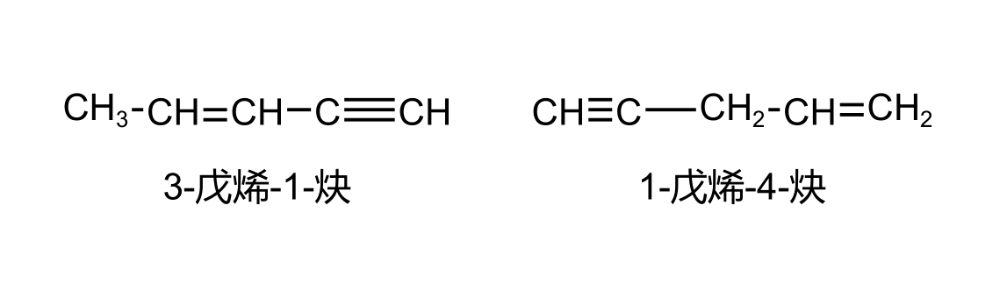

    多烯烃、多炔烃：将含有碳碳双键或碳碳三键最多的最长碳链作为主链，称为「某几烯」或「某几炔」，从距离碳碳双键或碳碳三键最近的一端开始，将支链作为取代基，写在「某几烯」或「某几炔」的前面，并用阿拉伯数字标明碳碳双键或碳碳三键的位置，写出有机物的名称。

- 对于环状化合物：环状化合物的命名通常选择环作为母体，从环上连有最简单取代基的碳原子开始编号

    并没有链端，但我们可以用编号显示两个基团间的距离——从带有其中一个官能团的碳原子开始，沿环计数。这个规则在碳氢骨架是链状或环状时可使用，但很多骨架还带有分支。我们可以将支链视作官能团处理。

    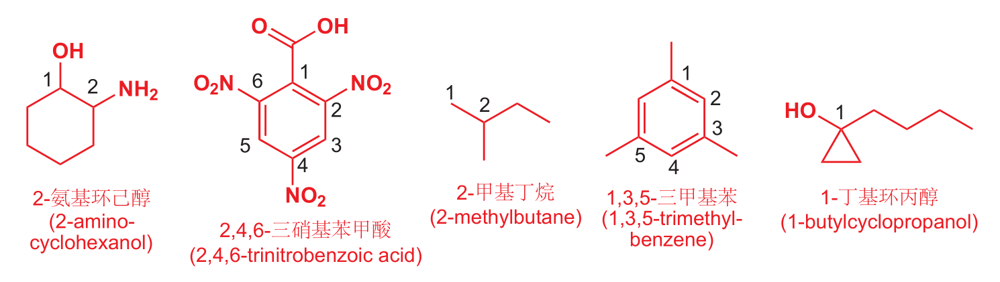

    以苯环作为命名的母体，苯环上的侧链烷基为取代基进行命名，如苯环上的一个氢原子被甲基取代称为甲苯，苯环上的一个氢原子被乙基取代称为乙苯。当苯环上有两个取代基时，根据取代基在苯环上的相对位置，可分别用「邻」（1,2-二取代）「间」（1,3-二取代）「对」（1,4-二取代）来表示，当苯环上有三个相同取代基时，根据取代基在苯环上的相对位置，可分别用「连」（1,2,3-三取代）「偏」（1,2,4-三取代）「均」（1,3,5-三取代）来表示。

    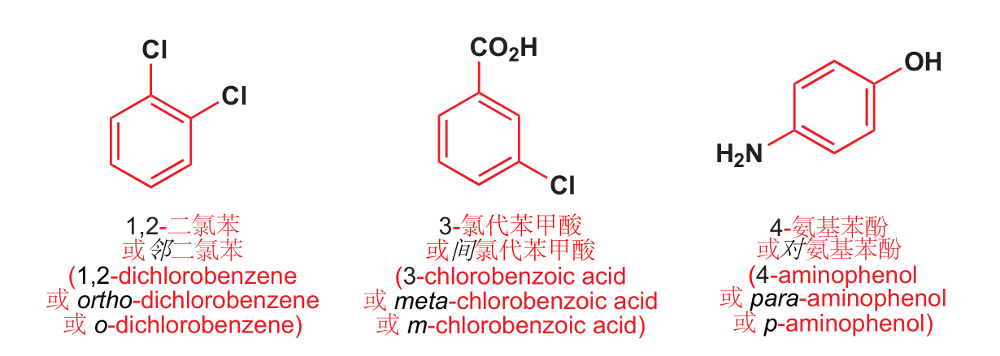

    当苯环上连接不饱和基团或虽为饱和基团，但体积较大或结构比较复杂时，可将苯作为取代基。

- 对于烃的衍生物：卤素原子、硝基、亚硝基等，将官能团作为取代基，仍以烷烃为母体，按烷烃的命名原则来命名。

    将含有官能团的最长主链作为母体化合物：将含有母体官能团的最长碳链作为主链，将支链作为取代基，根据主链的碳原子数称为某醇、醛、酮、酸、酰卤、酰胺、腈等。
    
    酯的命名：酯是羧酸与醇脱水缩合形成的产物，命名时先把羧酸名称放在前面，将醇的名称放在后面，先删去「醇」字，而后加上「酯」字。
    
    含多种官能团的烃衍生物的系统命名：当分子中含有多种官能团时，首先要确定一个主官能团，确定主官能团的顺序是羧酸、酯、酰胺/卤、醛、酮、醇、酚、胺、醚、烯、炔。然后，选择含有主官能团及尽可能含较多官能团的最长碳链为主链。

## 有机经典问题

### 同分异构现象

化合物具有相同的分子式，但具有不同结构的现象，称为同分异构现象。具有这种现象的化合物互称为同分异构体。

- **碳链异构**：碳链骨架不同。

    > $\ce{CH3CH2CH2CH3}$ 和 $\ce{CH3CH(CH3)2}$

- **位置异构**：官能团或取代基在碳骨架（碳链或碳环）上位置不同。

    > $\ce{CH2=CHCH2CH3}$ 和 $\ce{CH3CH=CHCH3}$
    >
    > $\ce{CH3CH2CH2OH}$ 和 $\ce{CH3CH(OH)CH3}$
    >
    > $\ce{CH3OCH2CH2CH3}$ 和 $\ce{CH3CH2OCH2CH3}$
    >
    > $\ce{R1COOR2}$ 和 $\ce{R2COOR1}$ ($R1 \neq R2$，且均为烃基)

- **官能团异构**：官能团不同。

    > $\ce{CH3CH2OH}$ 和 $\ce{CH3OCH3}$
    > 
    > $\ce{CH3CH2CHO}$ 和 $\ce{CH3COCH3}$
    > 
    > $\ce{CH3COOH}$ 和 $\ce{HCOOCH3}$
    > 

- **顺反异构**：原子或原子团在碳碳双键上的位置不同。

    > 从复杂基团到简单的为正方向，当两侧均为同一方向，为顺，反之为反

    > 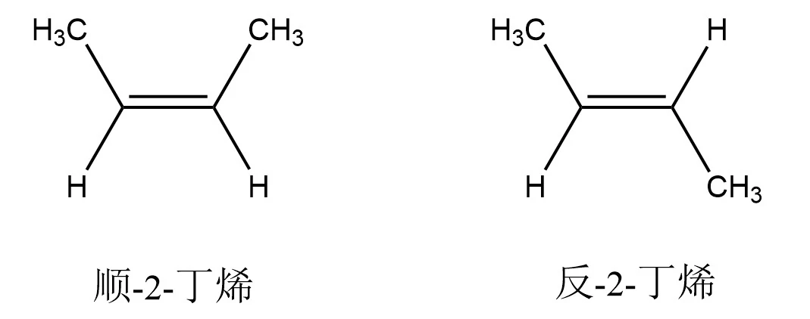{ width="70%" }

    > 双键上的碳原子及与其直接相连的原子位于同一平面，碳碳双里中任意一个双键碳原子上连接 2 个相同的原子或原子团时，不存在顺反异构

- **对映异构**：互为镜像且不能重叠的结构，即存在手性碳原子便存在对映异构。

    > 手性碳原子：饱和碳的周围接了 $4$ 个两两不同的原子或原子团

    > 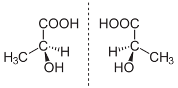{ width="60%" }

注意：题目中如问给定结构的物质的同分异构体数目，需要扣除该物质本身。

### 原子共面问题

可能出现的题目要求：

- 「碳原子」、「所有原子」。

- 「一定」、「可能」、「至少」、「最多」。

- 「共线」、「共面」。

选定主体结构：

- 凡出现苯环结构形式的原子共面问题，以苯的结构为主体

- 凡出现碳碳双键、碳碳三键结构形式的原子共面问题，以乙烯、乙炔的结构为主体。

- 画出有机化合物的**结构式**，观察原子的共线、共面情况。

- 单键可以旋转，双键、三键不可以旋转。

注意：

- 结构中出现饱和原子，则不可能所有原子共平面。
- 结构中每出现一个碳碳双键，至少有 $6$ 个原子共面。
- 结构中每出现一个碳碳三键，至少有 $4$ 个原子共线。
- 结构中每出现一个苯环，至少有 $12$ 个原子共面。

### 烷烃异构问题

烷烃的同分异构书写常用**减碳法**。

- 三注意：注意要选择最长的碳链作主链；注意要找出对称轴；注意要保证每次减掉碳原子后的碳链仍为主链。
- 三原则：对称性原则、有序性原则、互补性原则。
- 四顺序：
    1. 主链由长到短：选取最长的碳链为主链，再逐步减少主链的碳原子数，余下的碳原子作为取代基。
    2. 取代基由整到散余下的碳原子先作为一个取代基，再逐步拆散为多个小取代基。当有多个取代基存在时，应按连接在同一碳原子、
    相邻碳原子、相间碳原子…的顺序依次移动，避免漏项
    3. 位置由心到边不到端：把取代基连在主链上，由主链的对称中心开始，逐步向一边移动，但注意不要移到端点
    4. 排列由对、邻到间：两个取代基可以相对(连在同一个碳原子上)、相邻（分别连在相邻的两个碳原子上）和相间（分别连在不相邻的
    两个碳原子上）。

- 注意：利用减碳法书写同分异构体时应注意保证减掉碳原子后的碳链仍为主链，如甲基连在主链的端点碳原子上、乙基连在主链
的二号碳原子上，均会改变主链，导致书写重复。

- 具有官能团的有机化合物同分异构体的书写：书写步骤为先确定可能含有的官能团类别，之后按照烷烃同分异构体的书写方法分别写出除官能团外的碳链异构，然后再移动官能团的位
置，最后按照碳原子形成四个共价键的原则，把氢原子补齐。

烷烃的同分异构计数没参考 [OEIS A000602](https://oeis.org/A000602) 给出下面的几组，详见 [Luogu P6598 烷烃计数](https://www.luogu.com.cn/problem/P6598)。

| $\ce{CH4}$ | $\ce{C2H6}$ | $\ce{C3H8}$ | $\ce{C4H10}$ | $\ce{C5H12}$ | $\ce{C6H14}$ |
| :-: | :-: | :-: | :-: | :-: | :-: |
| $1$ | $1$ | $1$ | $2$ | $3$ | $5$ |

烷基的同分异构计数参考 [OEIS A000598](https://oeis.org/A000598) 给出下面的几组，详见 [LOJ 6538 烷基计数](https://loj.ac/problem/6538)。

| $\ce{-CH3}$ | $\ce{-C2H5}$ | $\ce{-C3H7}$ | $\ce{-C4H9}$ | $\ce{-C5H11}$ | $\ce{-C6H13}$ |
| :-: | :-: | :-: | :-: | :-: | :-: |
| $1$ | $1$ | $2$ | $4$ | $8$ | $17$ |

### 一元取代计数

等效氢法：

- 有机化合物分子中有几种不同化学环境的氢原子，则其一元取代物就有几种同分异构体。

    - 同一碳原子上的氢原子是等效的，如 $\ce{CH4}$ 分子中的 $4$ 个氢原子是等效的。
    - 同一碳原子所连的相同基团上的氢原子是等效的，如新戊烷分子中的 $4$ 个甲基等效，各甲基上的氢原子完全等效，即新戊烷分子中的 $12$ 个氢原子是等效的。
    - 处于镜面对称位置上的氢原子是等效的，如丁烷分子中有种 $2$ 等效氢原子。

- 我们常在结构式中，用 $1,2,3$ 来标记等效的氢，以此计数。

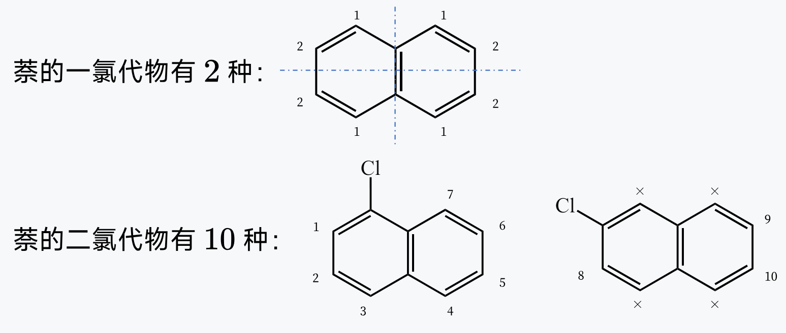

### 二元取代计数

确定链状烷烃**二取代物**的同分异构体数目时，可首先固定一个取代基，再按照顺序移动另一个取代基以确定同分异构体数目，下面以确定 $\ce{CH3CH2CH3}$ 的二氯代物的数目为例

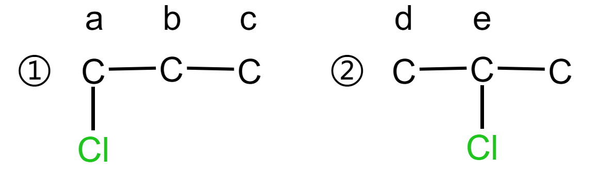{ width="50%" }

1. 先固定 $1$ 个氯原子，有 $2$ 种（如上图 ① 和 ②）。

2. 然后移动第 $2$ 个氯原子：

    - 结构 ① 中有 $3$ 种（在 $a, b, c$ 位置取代）。
    - 结构 ② 中有 $2$ 种（在 $d, e$ 位置取代）。
    - 其中，在 ① 的 $b$ 位置取代与在 ② 的 $d$ 位置取代后得到的产物（1,2-二氯丙烷）重复。
    - 故 $\ce{CH3CH2CH3}$ 的二氯代物共有 $3 + 2 - 1 = 4$ 种。

3. 通过上述案例可以得到：

    - 形如 $\ce{C3X2}$ 的二取代物有 $4$ 种。
    - 形如 $\ce{C3XY}$ 的二取代物有 $5$ 种。
    - 形如 $\ce{C4X2}$ 的二取代物有 $9$ 种。
    - 形如 $\ce{C4XY}$ 的二取代物有 $12$ 种。

4. 确定苯环上的二、三取代物的同分异构体数目时（不考虑基团异构），也可以采用类似定一移一法的方法，可以得到：

    - 苯环上二取代的同分异构体数目有 $3$ 种。
    - 苯环上三取代 $\ce{C6H3X3}$ 的同分异构体数目有 $3$ 种。
    - 苯环上三取代 $\ce{C6H3X2Y}$ 的同分异构体数目有 $6$ 种。
    - 苯环上三取代 $\ce{C6H3XYZ}$ 的同分异构体数目有 $10$ 种。

如苯环上有多个相同的取代基，可将其视为 $\ce{H}$，移动其他取代基计算同分异构体。

### 烷基取代计数

将有机物分子拆分为烃基和官能团两部分，根据烃基异构体的数目，确定有机物分子的数目。如分子式为 $\ce{C4H10O}$ 属于醇的同分异构体，可改写成 $\ce{C4H9—OH}$，共有 $4$ 种结构；分子式为 $\ce{C5H10O}$ 属于醛的同分异构体，可改写成 $\ce{C4H9-CHO}$，共有 $4$ 种结构

## 经典有机理论

### 马氏规则

当不对称烯烃与含氢的化合物（$\ce{H2},\ce{HCl}$ 等）加成时，氢原子主要加到连有较多氢原子的碳原子上（马氏规则），在过氧化物存在的情况下，氢原子主要加在连有较少氢原子的碳原子上（反马氏规则）。
