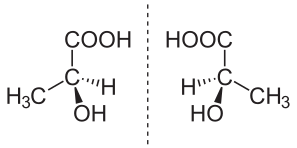

# 有机物及其结构

## 有机物的概念

### 有机化合物

与无机物相比，有机物普遍具有以下性质：

* 物理性质：大多熔点较低，且难溶于水，易溶于汽油、乙醇、苯等有机溶剂。  
* 热稳定性：大多数有机物易燃，受热会分解。  
* 化学反应：有机物的化学反应较为复杂，常伴有副反应，许多反应需在加热、光照或催化剂作用下进行。

### 碳的成键特点

碳原子有四个价电子，使其不易失去或得到电子形成离子，故与各非金属元素之间形成共价键，但是有机物不一定就只能是共价化合物，离子化合物如有机酸盐等。

碳原子在有机物中，通常与四个原子直接相连，即配位数为 $4$，与一个碳原子相连的原子既可以是碳原子、也可以是其他原子，碳原子的这种独特的成键能力，是有机化合物多样性的根本原因。

!!! note "为什么硅没有形成硅基有机化合物？"
    1. 碳碳单键稳定性强，增强了有机物的稳定性。

    2. 碳的原子半径小，更容易形成双键和三键，增加了有机物的多样性。

    3. 碳具有适中的电负性，可以与很多非金属原子形成共价键，使有机物更稳定。

    4. 同样，原子半径小，空间位阻小，可以连接多个基团，形成复杂的、紧凑的三维结构。

碳原子间的共价键可以是：单键（$\ce{C - C}$）、双键（$\ce{C = C}$）、三键（$\ce{C # C}$）。

**碳骨架**：多个碳原子之间可以结合成碳链（包括直链和支链）或碳环，构成有机物分子链的碳骨架。 多个碳原子之间可以结合形成碳链，碳链既可以是一条直链，也可以带有支链；碳原子间也可以结合成碳环，环上的碳原子还可以连接支链。

- 饱和碳原子：单键碳原子。

- 不饱和碳原子：双键碳原子、三键碳原子、苯环碳原子。

含有不饱和键的有机化合物分子由于双键或三键中有**部分键**容易断裂；双键或三键两端的碳原子还可以结合其他原子或原子团，一般易于发生加成反应（苯环结构具有特殊性）。

### 有机物的表示

| | 表示方式 | 示例 |
|  :-:  | - |  :-:  |
| 分子式 | 用元素符号表示物质的分子组成 | $\ce{CH4}$ |
| 最简式（实验式） | 用元素符号表示化合物中各元素原子个数的最简整数比 | $\ce{CH2O}$ |
| 电子式 | 在元素符号周围用「$\cdot$」或「$\times$」表示原子的最外层电子的成键情况 | { width="200" } |
| 结构式 | 用短线「$\ce{-}$」来表示 1 个共价键，将所有原子连接起来 | { width="200" } |
| 结构简式 | 省略结构式中的单键「$\ce{-}$」，将与碳原子相连的其他原子写在其旁边，在右下角注明其个数 | $\ce{CH3CH = CH2}$ |
| 键线式 | 省略结构简式中与碳原子直接相连的氢原子，每个拐点或端点均表示一个碳原子，不足的用氢原子补足 | { width="200" } |
| 球棍模型 | 小球表示原子，短棍表示化学键 | { width="200" } |
| 空间填充模型 | 用不同体积的小球表示不同大小的原子，相对大小关系应与原子实际相对大小关系一致 | { width="200" } |

- 书写结构简式时，同一个碳原子上的相同原子或原子团可以合并，相邻且相同的原子团亦可以合并。

- 结构简式不能表示有机化合物的真实空间结构。

### 同分异构现象

同分异构现象：化合物具有相同的分子式，但具有不同结构的现象，称为同分异构现象。具有这种现象的化合物互称为同分异构体。

- **碳链异构**：碳链骨架不同。

    > $\ce{CH3CH2CH2CH3}$ 和 $\ce{CH3CH(CH3)2}$

- **位置异构**：官能团或取代基在碳骨架（碳链或碳环）上位置不同。

    > $\ce{CH2=CHCH2CH3}$ 和 $\ce{CH3CH=CHCH3}$
    >
    > $\ce{CH3CH2CH2OH}$ 和 $\ce{CH3CH(OH)CH3}$
    >
    > $\ce{CH3OCH2CH2CH3}$ 和 $\ce{CH3CH2OCH2CH3}$
    >
    > $\ce{R1COOR2}$ 和 $\ce{R2COOR1}$ ($R1 \neq R2$，且均为烃基)

- **官能团异构**：官能团不同。

    > $\ce{CH3CH2OH}$ 和 $\ce{CH3OCH3}$
    > 
    > $\ce{CH3CH2CHO}$ 和 $\ce{CH3COCH3}$
    > 
    > $\ce{CH3COOH}$ 和 $\ce{HCOOCH3}$
    > 

- **顺反异构**：原子或原子团在碳碳双键上的位置不同。

    > 从复杂基团到简单的为正方向，当两侧均为同一方向，为顺，反之为反

    > { width="70%" }

    > 双键上的碳原子及与其直接相连的原子位于同一平面，碳碳双里中任意一个双键碳原子上连接 2 个相同的原子或原子团时，不存在顺反异构

- **对映异构**：互为镜像且不能重叠的结构，即存在手性碳原子便存在对映异构。

    > 手性碳原子：饱和碳的周围接了 4 个两两不同的原子或原子团

    > { width="60%" }

同系物：结构相似，在分子组成上相差一个或若干个 $\ce{CH2}$ 原子团的化合物互称为同系物。烷烃就是一个同系物系列。

## 有机物的反应

### 燃烧反应

有机物的燃烧反应是有机化学中的重要内容，通常生成 $\ce{CO2}$ 和 $\ce{H2O}$。以下介绍含碳氢有机物 $\ce{C_xH_y}$ 和含碳氢氧有机物 $\ce{C_xH_yO_z}$ 的燃烧方程式书写方法。

对于只含碳、氢、氧的有机物，其完全燃烧的化学反应可依据原子守恒定律进行配平。例如：

烃（$\ce{C_xH_y}$）的燃烧：

$$
\ce{C_xH_y + \left(x + \frac{y}{4}\right) O2 ->[点燃] xCO2 + \frac{y}{2}H2O}
$$
  
含氧烃（$\ce{C_xH_yO_z}$）的燃烧：

$$
\ce{C_xH_yO_z + \left(x + \frac{y}{4} - \frac{z}{2}\right) O2 ->[点燃] xCO2 + \frac{y}{2}H2O}
$$

## 有机物的命名

### 杂质引入的来源

在乙烯的相关反应或有机物燃烧中，可能引入新杂质，如二氧化碳（$\ce{CO2}$），影响产物纯度。

- **工业制备乙醇**：若反应条件控制不当（如温度过高或原料不纯），可能发生副反应，生成 $\ce{CO2}$。
- **不完全燃烧**：氧气不足时，生成 $\ce{CO}$ 或 $\ce{C}$，同时可能混入 $\ce{CO2}$。

### 杂质控制方法

- **优化反应条件**：精确控制温度（如 $\pu{250 ^oC}$ 至 $\pu{300 ^oC}$）和压力（如 $\pu{6 MPa}$ 至 $\pu{8 MPa}$），减少副反应。
- **原料纯化**：确保乙烯和水的纯度，降低杂质引入。
- **催化剂选择**：使用高效专一性催化剂（如 $\ce{H3PO4}$），抑制副产物生成。

## 有机物的计数

### 同分异构书写

### 烷烃的计数

烷烃的同分异构计数没有一个简洁的公式，我们参考 [OEIS A000602](https://oeis.org/A000602) 给出下面的几组：

| $\ce{CH_4}$ | $\ce{C_2H_6}$ | $\ce{C_3H_8}$ | $\ce{C_4H_{10}}$ | $\ce{C_5H_{12}}$ | $\ce{C_6H_{14}}$ |
| :-: | :-: | :-: | :-: | :-: | :-: |
| $1$ | $1$ | $1$ | $2$ | $3$ | $5$ |

| $\ce{C_7H_{16}}$ | $\ce{C_8H_{18}}$ | $\ce{C_9H_{20}}$ | $\ce{C_{10}H_{22}}$ | $\ce{C_{11}H_{24}}$ | $\ce{C_{12}H_{26}}$ |
| :-: | :-: | :-: | :-: | :-: | :-: |
| $9$ | $18$ | $35$ | $75$ | $159$ | $355$ |

更多信息？详见 [Luogu P6598 烷烃计数](https://www.luogu.com.cn/problem/P6598)。

### 卤代烃的计数
