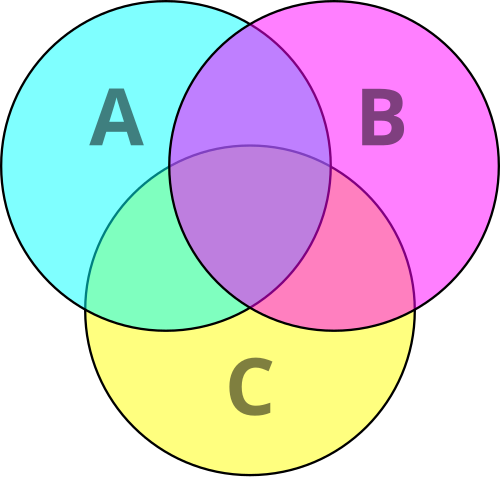
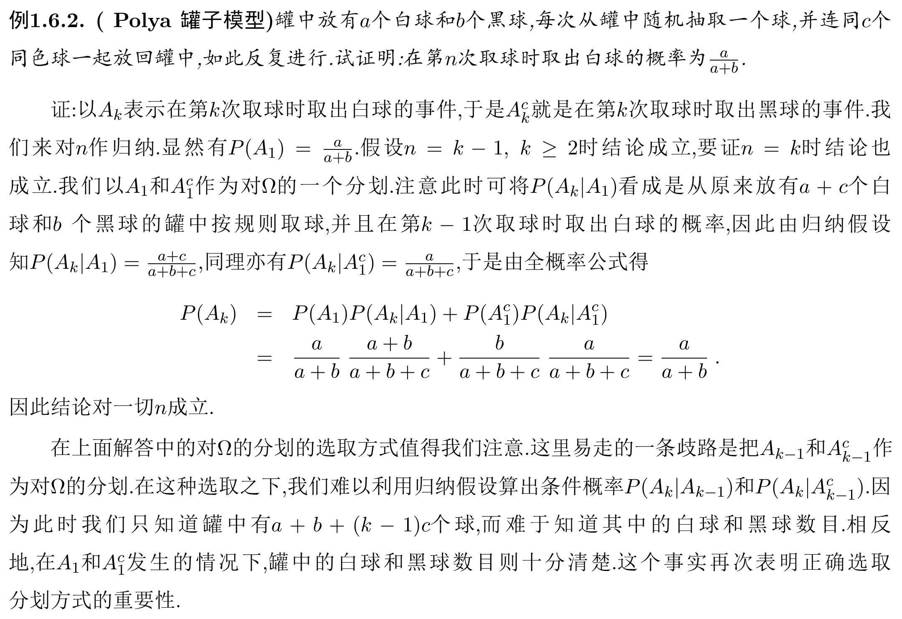
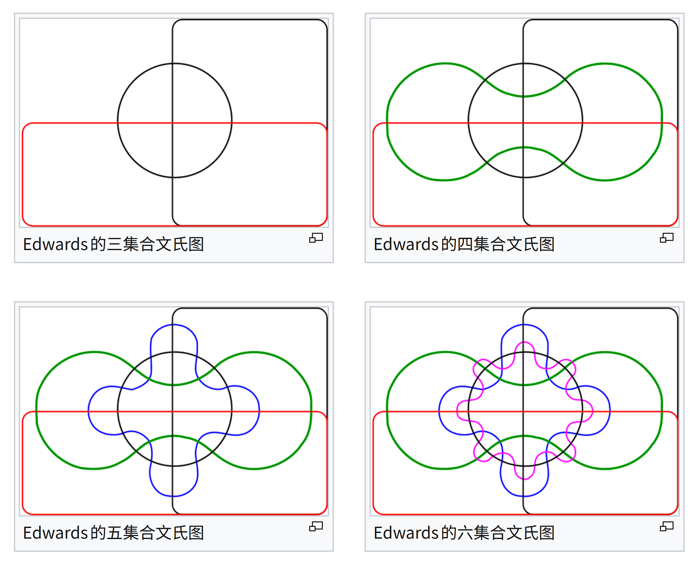
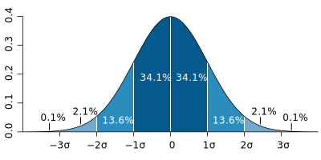

# 统计学概述

## 敘述统计学

统计学是在资料分析的基础上，研究测定、收集、整理、归纳和分析反映数据资料，以便给出正确消息的科学。敘述统计，是统计学中，来描绘或总结观察量的基本情况的统计总称。其与统计推断相对应。

- 研究者可以透过对数据资料的图像化处理，将资料摘要变为图表，以直观了解整体资料分布的情况。通常会使用的工具是频数分布表与图示法，如折线图、直方图、饼图、散点图等。

- 研究者也可以透过分析数据资料，以了解各变量内的观察值集中与分散的情况。运用的工具有：**集中量数**，如平均数、中位数、众数、几何平均数、调和平均数，与**变异量数**，如全距、平均差、标准差、相对差、四分差。

    在推论统计中，测量样本的集中量数与变异量数都是变量的无偏估计值，但是以平均数、方差、标准差的有效性最高。数据的次数分配情况，往往会呈现正态分布。

- 为了表示测量数据与正态分布偏离的情况，会使用偏度、峰度这两种统计数据。

- 为了解个别观察值在整体中所占的位置，会需要将观察值变换为**相对量数**，如百分等级、标准分数、四分位数等。

统计学中，统计推断与描述统计相对应。统计推断的结果常用来决定下一步的作法，可能是要做更深入的试验或问卷，或是是决定是否要实行某项方案。

推断统计学，或称统计推断，指统计学中，研究如何根据样本数据去推断总体数量特征的方法。它是在对样本数据进行描述的基础上，对统计总体的未知数量特征做出以概率形式表述的推断。更概括地说，是在一段有限的时间内，通过对一个随机过程的观察来进行推断的。

### 期望与方差

算术平均数 $A_n$：

$$
\bar x=\dfrac1n\sum_{i=1}^nx_i
$$

**离散型随机变量**：

设离散型随机变量 $X$ 的概率分布为 $p_i = P\{ X = x_i \}$，若和式

$$
\sum x_i p_i
$$

绝对收敛，则称其值为 $X$ 的**期望**，记作 $EX$。

**连续型随机变量**：

设连续型随机变量 $X$ 的密度函数为 $f(x)$，若积分

$$
\int_{\mathbb{R}} xf(x) \text{d} x
$$

绝对收敛，则称其值为 $X$ 的**期望**，记作 $EX$。

**期望的性质**：

- 期望的线性性（据此可以通过变换计算平均数）：

    $$
    E(ax+by+c)=aEx+bEy+c
    $$

- 若随机变量 $X,Y$ 的期望存在且 $X,Y$ 相互独立，则有

    $$
    E(XY) = EX \cdot EY
    $$

    注意：上述性质中的独立性**并非必要**条件。

我们常见的序列方差：

$$
DX=\dfrac1n\sum_{i=1}^n(X_i-\bar X)^2
$$

推广到一般的随机变量：

设随机变量 $X$ 的期望 $EX$ 存在且期望

$$
DX=E\left[(X - EX)^2\right]=\sum p_i(X_i-EX)^2
$$

也存在，则称上式的值为随机变量 $X$ 的**方差**，记作 $DX$ 或 $VX$。

拆开平方即可得到：

$$
DX=E(X^2)-(EX)^2
$$

方差也有类似线性性的变换：

$$
\begin{aligned}
V(ax+b)&=E\left[(ax+b)^2\right]-\left[E(ax+b)\right]^2\\
&=a^2E(x^2)+2abEx+b^2-\left[a^2(Ex)^2+2abEx+b^2\right]\\
&=a^2\left[E(x^2)-(Ex)^2\right]\\
&=a^2V(x)
\end{aligned}
$$

这暗示了方程描述离散程度的性质。

方差的算术平方根称为标准差，记作 $\sigma(X) = \sqrt{DX}$。

### 百分位数

若将一组数据从小到大排序，并计算相应的累计百分点，则某百分点所对应数据的值，就称为这百分点的百分位数，以 $P_{k}$ 表示第 $k$ 百分位数。

准确定义：$P_{k}$ 表示至少有 $k\%$ 的资料小于或等于这个数，而同时也至少有 $(100-k)\%$ 的资料大于或等于这个数。

特殊的：

| 百分位数 | 意义 |
| -: | :-: |
| $P_0$ | 最小值 |
| $Q_1=P_{25}$ | 第一个四分位数，下四分位数 |
| $Q_2=P_{50}$ | 第二个四分位数，中位数 |
| $Q_3=P_{75}$ | 第三个四分位数，上四分位数 |
| $P_{100}$ | 最大值 |

百分位数的计算方法：

1. 将数据从小到大排序为 $x_1,x_2,\dots,x_n$。

2. 计算 $i=n\cdot p\%$：

    - 如果 $i$ 不是整数，则取 $x_{\lceil i\rceil}$ 为 $p\%$ 分位数。

    - 否则，取 $(x_i+x_{i+1})/2$ 为 $p\%$ 分位数。

3. 特别的，规定 $0$ 分位数为最小值，$100\%$ 分位数为最大值。

另外的，$P_{75}$ 与 $P_{25}$ 的差称为四分位距。

### 统计图形

统计图形，又称为统计图、统计学图形、图解方法、图解技术、图解分析方法或图解分析技术，是指统计学领域当中用于可视化定量数据的信息图形。有时，人们也把统计图形与各种统计学表格统称为统计图表或统计学图表。

统计学与数据分析过程可大致分为两个组成部分：定量分析方法（Quantitative techniques）和图解分析方法（graphical techniques）。定量分析方法是指那套产生数值型或表格型输出的统计学操作程序；比如，包括假设检验、方差分析、点估计、信赖区间以及最小二乘法回归分析。这些手段以及与此类似的其他技术方法全都颇具价值，属于是经典分析方面的主流。

另一方面，还有一大套我们一般称之为图解分析方法的统计学工具。这些工具包括散点图、直方图、概率图（probability plot）、残差图（residual plot）（residual plot）、箱形图、块图以及双标图。探索性数据分析（Exploratory data analysis，EDA）就密切地依赖于这些手段以及与此类似的其他技术方法。图解分析操作程序不仅仅是在EDA背景下才使用的工具；在检验假设、模型选择、统计模型验证（统计模型验证）、估计量（estimator）选择、关系确定、因素效应判定以及离群值检出方面，此类图解分析工具还可以作为最佳捷径，用来深入认识数据集。此外，优质的统计图形还可以作为一种令人信服的沟通手段，用来向他人传达存在于数据之中的基本讯息。

频率分布直方图：横轴表示数据，纵轴表示频率除以组距。数据分组可以是等距的，也可以是不等距的，要根据数据的特点而定。有时为了方便，往往按等距分组，或者除了第一和最后的两段，其他各段按等距分组。因此，图像中矩形的面积就是频率，频率等于频数除以总数。

干叶图（也称茎叶图）是一种显示所有数据的统计图表。在干叶图中，每一个数据分为“干”（茎）和“叶”两个部分。然后，决定干将代表什么，叶将代表什么。在普遍情况，叶包含数字的最后一个数字，干包含所有其他数字。在数量庞大时，数值可以四舍五入到用于叶的特定位置值（例如数百个位置）。舍五入位置值左边的剩余数字用作。

文氏图（Venn diagram），或译温氏图、Venn 图、范恩图、维恩图、维恩图解、范氏图、韦恩图、卞氏图表等，是在集合论（或者类的理论）数学分支中，在不太严格的意义下用以表示集合（或类）的一种图解。它们用于展示在不同的事物群组（集合）之间的数学或逻辑联系，尤其适合用来表示集合（或）类之间的“大致关系”，它也常常被用来帮助推导（或理解推导过程）关于集合运算（或类运算）的一些规律。

{ width="60%" }

在文氏图法中，如果有论域，则以一个矩形框（的内部区域）表示论域；各个集合（或类）就以圆／椭圆（的内部区域）来表示。两个圆／椭圆相交，其相交部分表示两个集合（或类）的公共元素，两个圆／椭圆不相交（相离或相切，而实际上在文氏图中相切是没有什么意义的，因为文氏图是以图形的内部区域来表示的）则说明这两个集合（或类）没有公共元素。

{ width="90%" }

欧拉图可能在外观上同文氏图是一致的。它们之间的区别只在于它们的应用领域中，就是说在被分割的全集的类型中。欧拉图展示对象的特定集合，文氏图的概念更一般的适用于可能的联系。文氏图和欧拉图没有合并的原因可能是，欧拉的版本是早在 $100$ 多年前就出现了的，欧拉已经有了足够多的成就了，而维恩只留下了这么一个图。在欧拉图和文氏图之间的区别只是在想法上，欧拉图要展示特定集合之间的联系，而文氏图要包含所有可能的组合。

{ width="90%" }

## 概率分布

概率分布简称分布，广义地，它指：随机变量的概率性质——当我们说概率空间中的两个随机变量 $X$ 和 $Y$ 具有同样的分布时，我们是无法用概率 $P$ 来区别他们的。

但是，不能认为同分布的随机变量是相同的随机变量。事实上即使 $X$ 与 $Y$ 同分布，也可以没有任何点 $\omega$ 使得 $X(\omega)=Y(\omega)$。在这个意义下，可以把随机变量分类，每一类称作一个分布，其中的所有随机变量都同分布。

狭义地，它是指随机变量的概率分布函数：对于随机变量 $X$，称函数 $F(x)$ 为随机变量 X 的 分布函数。记作 $X \sim F(x)$。

$$
F(x) = P( X \leq x )
$$

分布函数具有以下性质：

- 右连续性：$F(x) = F(x + 0)$。

- 单调性：在 $\mathbb{R}$ 上单调递增（非严格）。

- $F(-\infty) = 0,F(+\infty) = 1$。

同时我们可以证明，满足上述要求的函数都是某个随机变量的分布函数。因此，分布函数与随机变量之间一一对应。具有相同分布函数的随机变量一定是同分布的，因此可以用分布函数来描述一个分布，但更常用的描述手段是概率密度函数。

用更简要的语言来说，同分布是一种等价关系，每一个等价类就是一个分布。需注意的是，通常谈到的离散分布、均匀分布、伯努利分布、正态分布、泊松分布等，都是指各种类型的分布，而不能视作一个分布。

分布函数的值域是离散的，比如只取整数值的随机变量就是属于离散分布的。离散型均匀分布是一种离散型概率分布，其所有可能的观察值数量为有限整数，且每一个观察值的出现概率皆相同。离散型均匀分布的一个例子是掷公平骰子，其可能的观察值为 $1,2,3,4,5,6$，而每一个数字的出现概率都是 1/6。但若同时丢二个均匀骰子，将其值相加，就不属于离散型均匀分布，因为各个和的概率不同。

虽然离散型均匀分布常用来描述观察值为连续整数的分布，例如前述的掷骰子范例，但实际上可以在任意有限集合上定义离散型均匀分布，例如随机置换就是由已知长度的置换中均匀随机产生的组合，而均匀生成树则是从给定图的生成树集合中均匀随机抽样得到的生成树。

离散分布，即分布函数的值域是离散的，比如只取整数值的随机变量就是属于离散分布的。因为涉及到离散的函数，通常就会有非常复杂的定义和公式，不像离散的还可以用数列和组合的方法，因此高中阶段通常只涉及连续型均匀分布和正态分布。

连续型均匀分布（continuous uniform distribution）或矩形分布（rectangular distribution）的随机变量 $x$ ，在其值域之内的每个等长区间上取值的概率皆相等。其概率密度函数在该变量的值域内为常数。

### 伯努利分布

伯努利分布又名两点分布或者 0-1 分布，是一个离散型概率分布。伯努利试验是只有两种可能结果（成功或失败）的单次随机试验，若伯努利试验成功，则伯努利随机变量取值为 $1$。若伯努利试验失败，则伯努利随机变量取值为 $0$。记其成功概率为 $p$，失败概率为 $q=1-p$。

### 泊松分布

泊松分布，又称 Poisson 分布、帕松分布、布瓦松分布、布阿松分布、普阿松分布、波以松分布、卜氏分布、帕松小数法则等，泊松分布适合于描述单位时间内随机事件发生的次数的概率分布。如某一服务设施在一定时间内受到的服务请求的次数，电话交换机接到呼叫的次数、汽车站台的候客人数、机器出现的故障数、自然灾害发生的次数、DNA 序列的变异数、放射性原子核的衰变数、激光的光子数分布等等。（单位时间内发生的次数，可以看作事件发生的频率，类似物理的频率。

Poisson 近似是二项分布的一种极限形式。其强调如下的试验前提：一次抽样的概率值 $p$ 相对很小，而抽取次数 $n$ 值又相对很大。因此泊松分布又被称之为罕有事件分布。泊松分布指出，如果随机一次试验出现的概率为 $p$ ，那么在 $n$ 次试验中出现 $k$ 次的概率按照泊松分布应该为：

$$
f(n,k,p)={\frac {(n\cdot p)^{k}}{e^{n\cdot p}\cdot k!}}
$$

其中，数学常数 $e=2.71828...$。

### 二项分布

只有“成功”和“失败”两种可能结果，每次重复时成功概率不变的独立随机试验称作伯努利试验，例如上述的掷硬币出现正面或反面、对产品进行抽样检查时抽到正品或次品。二项分布描述在进行独立随机试验时，每次试验都有相同概率“成功”的情况下，获得成功的总次数。

$$
f_n(k)={n \choose k}p^{k}(1-p)^{n-k}\quad (k=0,1,\ldots ,n)
$$

其中 $n$ 为正整数、$0\le p\le 1$，则称 $x$ 服从参数为 $n,p$ 的二项分布，记为 $x\sim B(n,k)$。根据二项式定理，对其所有项求和，就会得到一。

### 负二项分布

负二项分布是一种描述在一系列独立同分布的伯努利试验中，成功次数达到指定次数 $r$ 时失败次数的离散概率分布。比如，如果我们定义掷骰子随机变量 $x$ 值为 $x=1$ 时成功，所有 $x\neq1$ 为失败，这时我们反复掷骰子直到 $1$ 出现 $3$ 次（$r=3$），此时非 $1$ 数字出现次数的概率分布即为负二项分布。当 $r$ 是整数时的负二项分布又称帕斯卡分布，其概率质量函数为：

$$
f(k;r,p)=\dbinom{k+r-1}{r-1} p^r(1-p)^k,\quad k=0,1,2,\dots
$$

其中 $k$ 是失败的次数， $r$ 是成功的次数， $p$ 是事件成功的概率。在负二项分布的概率质量函数中，由于 $k+r$ 次伯努利试验为独立同分布，每个成功 $r$ 次、失败 $k$ 次的事件的概率为 $p^r(1-p)^k$。由于第 $r$ 次成功一定是最后一次试验，所以应该在 $k+r-1$ 次试验中选择 $r-1$ 次成功，使用排列组合二项系数获取所有可能的选择数。

### 超几何分布

超几何分布是统计学上一种离散概率分布。它描述了由有限个对象中抽出 $n$ 个对象，成功抽出 $k$ 次指定种类的对象的概率（抽出不放回），记为 $X\sim H(n,K,N)$。例如在有 $N$ 个样本，其中 $K$ 个是不及格的。超几何分布描述了在该 $N$ 个样本中抽出 $n$ 个，其中 $k$ 个是不及格的个数：

$$
f(k;n,K,N)=\dfrac{\dbinom{K}{k}\dbinom{N-K}{n-k}}{\dbinom{N}{n}}
$$

上式可如此理解：$\dbinom{N}{n}$ 表示所有在 $N$ 个样本中抽出 $n$ 个的方法数目。$\dbinom{K}{k}$ 表示在 $K$ 个样本中，抽出 $k$ 个的方法数目。剩下来的样本都是及格的，而及格的样本有 $N-K$ 个，剩下的抽法便有 $\dbinom{N-K}{n-k}$。若 $n=1$，超几何分布退化为伯努利分布。

### 正态分布

正态分布，物理学中通称高斯分布，其密度函数的曲线呈对称钟形，因此又被称之为钟形曲线。

正态分布的概率密度函数中以平均值 $\mu$、标准差 $\sigma$ 为参数，正态分布的数学期望值或期望 $\mu$ ,可解释为位置参数，决定了分布的位置；其方差 $\sigma ^{2}$ 的平方根或标准差 $\sigma$ 可解释尺度参数，决定了分布的幅度。

{ width="60%" }

中心极限定理指出，在特定条件下，一个具有有限均值和方差的随机变量的多个样本（观察值）的平均值本身就是一个随机变量，其分布随着样本数量的增加而收敛于正态分布。

因此，许多与独立过程总和有关的物理量，例如测量误差，通常可被近似为正态分布。正态分布是一种理想分布，许多典型的分布，比如成年人的身高、汽车轮胎的运转状态、人类的智商值（IQ），都属于或者说至少接近正态分布。

同样按照连续分布的定义，正态概率密度函数具有和普通概率密度函数类似的性质。

正态分布是自然科学与行为科学中的定量现象的一个方便模型。各种各样的心理学测试分数和物理现象比如光子计数都被发现近似地服从正态分布。尽管这些现象的根本原因经常是未知的，理论上可以证明：如果把许多小作用加起来看做一个变量，那么这个变量服从正态分布。

正态分布出现在许多区域统计：例如，采样分布均值是近似正态分布的，即使被采样的样本的原始群体分布并不服从正态分布。另外，正态分布信息熵在所有的已知均值及方差的分布中最大，这使得它作为一种均值以及方差已知的分布的自然选择。正态分布是在统计以及许多统计测试中最广泛应用的一类分布。在概率论，正态分布是几种连续以及离散分布的极限分布。

正态分布中一些值得注意的量：

- 密度函数关于平均值对称。

- 平均值与其众数（statistical mode）以及中位数（median）为同一数值。

- 函数曲线下 $68.268949\%$ 的面积在平均数左右的一个标准差范围内。

- $95.449974\%$ 的面积在平均数左右两个标准差 $2 \sigma$ 的范围内。

- $99.730020\%$ 的面积在平均数左右三个标准差 $3 \sigma$ 的范围内。

- $99.993666\%$ 的面积在平均数左右四个标准差 $4 \sigma$ 的范围内。

- 函数曲线的拐点（inflection point）为离平均数一个标准差距离的位置。

正态分布的一些性质：

- **线性变换不变性**：若 $X \sim N(\mu, \sigma^2)$ 且 $a$ 与 $b$ 是实数，那么 $aX + b \sim N(a \mu + b, a^2 \sigma^2)$。

- **独立可加性**：如果 $X \sim N(\mu_1, \sigma_1^2)$ 与 $Y \sim N(\mu_2, \sigma_2^2)$ 是统计独立的正态随机变量，那么：

    $$
    X + Y \sim N(\mu_1 + \mu_2, \sigma_1^2 + \sigma_2^2)
    $$

    特别地，若 $X$ 与 $Y$ 的方差相等，则 $U = X + Y$ 与 $V = X - Y$ 相互独立。

- 如果 $X \sim N(0, \sigma_1^2)$ 和 $Y \sim N(0, \sigma_2^2)$ 是独立正态随机变量，那么：

    - 它们的积 $XY$ 服从概率密度函数为 $p$ 的分布：

        $$
        p(z) = \frac{1}{\pi \sigma_1 \sigma_2} K_0 \left( \frac{|z|}{\sigma_1 \sigma_2} \right)
        $$

        其中 $K_0$ 是修正贝塞尔函数（modified Bessel function）。

    - 它们的比符合柯西分布，满足 $X/Y \sim \text{Cauchy}(0, \sigma_1 / \sigma_2)$。

- 如果 $X_1, \dots, X_n$ 为独立标准正态随机变量，那么 $X_1^2 + \dots + X_n^2$ 服从自由度为 $n$ 的卡方分布，记作 $X_1^2 + \dots + X_n^2 \sim \chi^2(n)$。

我们定义 $\mu=0,\sigma=1$ 的正态分布 $N(0,1)$ 为标准正态分布。在高中大部分正态分布题目中，核心的两个要素就是（1）读懂题目中的符号（2）熟练使用对称性。我们知道正态分布 $N(\mu,\sigma^2)$ 是关于 $x=\mu$ 高度对称的，而且我们通常会讨论 $\mu\pm k\sigma$，只需要分多段，利用对称性解决即可。

### 中心极限定理

中心极限定理（central limit theorem，简作 CLT）是概率论中的一组定理。在概率论中，中心极限定理 (CLT) 确定的为，在许多情况下，对于独立并同样分布的随机变量，即使原始变量本身不是正态分布，标准化样本均值的抽样分布也趋向于标准正态分布。这组定理是数理统计学和误差分析的理论基础，指出了大量随机变量之和近似服从正态分布的条件。

> 中心极限定理有着有趣的历史。这个定理的第一版被法国数学家棣莫弗发现，他在1733年发表的卓越论文中使用正态分布去估计大量抛掷硬币出现正面次数的分布。这个超越时代的成果险些被历史遗忘，所幸著名法国数学家拉普拉斯在1812年发表的巨著 Théorie Analytique des Probabilités中拯救了这个默默无名的理论。
>
> 拉普拉斯扩展了棣莫弗的理论，指出二项分布可用正态分布逼近。但同棣莫弗一样，拉普拉斯的发现在当时并未引起很大反响。直到十九世纪末中心极限定理的重要性才被世人所知。1901年，俄国数学家里雅普诺夫用更普通的随机变量定义中心极限定理并在数学上进行了精确的证明。如今，中心极限定理被认为是（非正式地）概率论中的首席定理。
> Tijms (2004, p.169)

中心极限定理指出，随着随机变量数量的增加，许多具有有限方差的独立的且相同分布的随机变量的总和将趋于正态分布。渐进分布（Asymptotic distribution）是指某种特定分布的大样本性质，即在样本量足够大时的极限分布。

所谓大样本是指在能够满足中心极限定理要求的情况下，使抽样分布趋向于正态分布的样本容量。但大样本的具体数目应该根据总体分布情况，采用的估计方法和对估计精度的要求所需被具体地予以的确定，较难使用一个具体的数值进行界定。

在金融工程领域，样本的概率分布未必能够呈现出严格的正态分布，往往呈现出有偏的渐进正态分布；在金融参数估计时，一般也需要通过对渐进分布的研究确定恰当的统计量，这是统计量的大样本性质以及渐进分布显得尤为重要。

在数学中，本福特定律（Benford's law）描述了真实数字数据集中首位数字的频率分布。一堆从实际生活得出的数据中，以 $1$ 为首位数字的数的出现概率约为总数的三成，接近直觉得出之期望 $1/9$ 的 $3$ 倍。推广来说，越大的数，以它为首几位的数出现的概率就越低。它可用于检查各种数据是否有造假。

## 推论统计学

### 置信区间

在统计学中，一个概率样本的置信区间（confidence interval，CI），是对产生这个样本的总体的参数分布（parametric distribution）中的某一个未知参数值，以区间形式给出的估计。相对于点估计（point estimation）用一个样本统计量来估计参数值，置信区间还蕴含了估计的精确度的信息。在现代机器学习中越来越常用的置信集合（confidence set）概念是置信区间在多维分析的推广。

置信区间在频率学派中间使用，其在贝叶斯统计中的对应概念是可信区间（credible interval）（credible interval）。两者建立在不同的概念基础上的，贝叶斯统计将分布的位置参数视为随机变量，并对给定观测到的数据之后未知参数的后验分布进行描述，故无论对随机样本还是已观测数据，构造出来的可信区间，其可信水平都是一个合法的概率；而置信区间的置信水平，只在考虑随机样本时可以被理解为一个概率。

初学者常犯一个概念性错误，是将基于观测到的数据所同样构造的置信区间的置信水平，误认为是它包含真实未知参数的真实值的概率。正确的理解是：置信水平只有在描述这个同样构造置信区间的过程（或称方法）的意义下才能被视为一个概率。一个基于已经观测到的数据所构造出来的置信区间，其两个端点已经不再具有随机性，因此，类似的构造的间隔将会包含真正的值的比例在所有值中，其包含未知参数的真实值的概率是0或者1，但我们不能知道是前者还是后者。

置信区间及置信水平常被误解，出版的研究也显示出既使是专业的科学家也常做出错误的诠释。

以 95% 的置信区间来说，建构出一个置信区间，不代表分布的参数有 95% 的概率会落在该置信区间内（也就是说该区间有 95% 的概率涵盖了分布参数）。依照严格的频率学派诠释，一旦置信区间被建构完全，此区间不是涵盖了参数就是没涵盖参数，已经没有概率可言。95% 概率指的是建构置信区间步骤的可靠性，不是针对一个特定的区间。

**95% 置信区间不代表有 95% 的样本资料落在此置信区间。**置信区间不是样本参数的可能值的确定范围，虽然它常被启发为可能值的范围。从一个实验中算出的一个 95% 置信区间，不代表从不同实验得到的样本参数有 95% 落在该区间中。区间估计是一种估计方法，是指以点估计的值为中心加减一个误差值，而这个上下限内就构成一个区间，而且还要估算一下区间的可信程度。这个区间也被称为预测区间。

统计学的假设检验中，显著性差异（或统计学意义，statistical significance）是对数据差异性的评价，当某次实验的结果在零假设下不大可能发生时，就认为该结果具有显著性差异。更准确而言，譬如某项研究设定了一个数值 $\alpha$（显著性水平），表示零假设本来正确但却被拒绝的出错概（并非零假设为真的概率、备择假设为假的概率、实验再现失败率），然后用 $p$ 值表示零假设条件为真时得到某结果或更极端结果的概率。当 $p\leq \alpha$ 时，就可以认为结果具有统计学意义，或数据之间具有了显著性差异。显著性水平应当在开始数据收集前就设定，通常习惯设定为 $5\%$ 或更低，因研究的具体学科领域而异。

在任何涉及到从总体中抽取样本的实验或观察性研究中，观察到的结果都有可能只不过是由抽样误差产生的。但是，如果一个观察结果的 $p$ 值小于（或等于）显著性水平 $\alpha$，研究者就可以得出“该结果能反映总体的特征”的结论，并拒绝零假设。

显著性差异的原因可能是：参与比对的数据是来自不同实验对象，如比－西一般能力测验中，大学学历被试组的成绩与小学学历被试组之间，会存在显著性差异；也可能是因为实验处理对实验对象造成了改变，因而前测、后测的数据会有显著性差异。例如，记忆术研究发现，被试者学习某记忆法前的成绩，和学习记忆法后的记忆成绩会有显著性差异，则这一差异很可能来自于这种记忆法对被试记忆能力的改变。

### 统计学抽样

在统计学中，抽样（Sampling）是一种推论统计方法，它是指从目标总体（Population，或称为母群）中抽取一部分个体作为样本（Sample），通过观察样本的某一或某些属性，依据所获得的数据对总体的数量特征得出具有一定可靠性的估计判断，从而达到对总体的认识。

- **简单随机抽样**：从总体中随机地抽取样本，使得每一个容量为样本都有相同的概率被抽中。每个样本单位被抽中的概率相等，样本的每个单位完全独立，彼此间无一定的关联性和排斥性。简单随机抽样是其它各种抽样形式的基础。通常只是在总体单位之间差异程度较小和数目较少时，才采用这种方法。在统计学的不同技术中需要使用随机数，比如在从统计总体中抽取有代表性的样本的时候，或者在将实验动物分配到不同的试验组的过程中，或者在进行蒙特卡罗模拟法计算的时候等等。

- **等距抽样**（也称系统抽样）：将总体中的所有单位按一定顺序排列，在规定的范围内随机地抽取一个单位作为初始单位，然后按事先规定好的规则确定其他样本单位。

- **分层抽样**：分层抽样是从统计总体抽取样本方法，将抽样单位按某种特征或某种规则划分为不同的层，然后从不同的层中独立、随机地抽取样本。从而保证样本的结构与总体的结构比较相近，从而提高估计的精度。当总体内的子总体之间的差异较大，对每个子总体分别进行分层抽样调查，会令统计调查结果更为准确。子总体的分层必须为互斥，即每个总体的成员均只能属于一个分层。之后，可对每个子总体进行简单随机抽样或系统抽样。这样可令调查的代表性改善。

- **整群抽样**（又称群集抽样）：将总体中若干个单位合并为组，抽样时直接抽取群，然后对中选群中的所有单位全部实施调查。抽样时只需群的抽样框，可简化工作量，缺点是估计的精度较差。

统计学中，重抽样（或重采样，resampling）可指下列几种方法：

- 使用样本数据的子集（刀切法）或从数据中有放回地随机抽样（自助法），来估计样本统计量（如中位数、方差、百分位数）的精度。

    统计学中，刀切法（jackknife）是一种重抽样方法，常用于对统计量的方差和偏差的估计。样本的刀切法估计量是指将样本去除每个元素后重新计算估计量，再将这些估计量取平均值。刀切法是自助法的一个线性近似。“刀切法”的名字由美国数学家约翰·图基提出，意在说明本方法像便携式小刀一样简单但实用，可解决多种统计问题。给定一个大小为 $n$ 的样本，刀切法的估计量可以通过聚合每个大小为 $n-1$ 子样本得出。

- 在进行显著性检验时交换数据的标签（称为置换检验，或精确检验、随机化检验、重随机化检验）。

- 使用样本的随机子集来验证模型（称为交叉验证）。交叉验证，有时亦称循环估计，是一种统计学上将数据样本切割成较小子集的实用方法。于是可以先在一个子集上做分析，而其它子集则用来做后续对此分析的确认及验证。一开始的子集被称为训练集。而其它的子集则被称为验证集或测试集。交叉验证的目的，是用来给模型作训练的新数据，测试模型的性能，以便减少诸如过拟合和选择偏差等问题，并给出模型如何在一个独立的数据集上通用化（即，一个未知的数据集，如实际问题中的数据）。

报告主要结果时必须一并报导效应值……如果测量值的单位在实际面上是有意义的（例如每人每日抽烟的香烟根数），则我们建议采用非标准化的效应值（例如回归系数或平均值差异）而不是标准化的效应值（例如相关系数）。—  L. Wilkinson and APA Task Force on Statistical Inference (1999, p. 599)

### 假设检验

假设检验（hypothesis testing）是推论统计中用于检验现有数据是否足以支持特定假设的方法。一旦能估计未知参数，就会希望根据结果对未知的真正参数值做出适当的推论。

欲检验统计上假设的正确性的为零假设（Null hypothesis，记作 $H_0$），零假设通常由研究者决定，反映研究者对未知参数的看法。相对于零假设的其他有关参数之论述是备择假设（Alternative hypothesis，记作 $H_a$ 或 $H_1$），它通常反映了执行检验的研究者对参数可能数值的另一种（对立的）看法（换句话说，备择假设通常才是研究者最想证明的）。

假设检验的过程，可以用法庭的审理来说明。先想象现在法庭上有一名被告，假设该被告是清白的，而检察官必须要提出足够的证据去证明被告的确有罪。

在证明被告有罪前，被告是被假设为清白的。

- 假设被告清白的假设，就相当于零假设。

- 假设被告有罪的假设，则是备择假设。

- 而检察官提出的证据，是否足以确定该被告有罪，则要经过检验。这样子的检验过程就相当于用 $T$ 检验或 $Z$ 检验去检视研究者所搜集到的统计资料。

女士品茶是一个有关假设检验的著名例子。统计学家费希尔的一个女同事，也是藻类学家的缪丽·布里斯托尔（Muriel Bristol），她声称可以判断在奶茶中是先加入茶还是先加入牛奶。费希尔提议给她八杯奶茶。缪丽已知其中四杯先加茶，四杯先加牛奶，但随机排列，而她要说出这八杯奶茶中，哪些先加牛奶，哪些先加茶，检验统计量（Test statistic）是确认正确的次数。零假设是她无法判断奶茶中的茶先加入还是牛奶先加入，备择假设为她有此能力。

若单纯以概率考虑（即缪丽没有判断的能力）下，八杯都正确的概率为 $1/70$（因为 $8$ 选 $4$ 的组合数是 $70$），约 $1.43\%$，因此“拒绝域”为八杯的结果都正确。而测试结果为缪丽八杯的结果都正确，在统计上是相当显著的结果。也就是说，几乎可以排除她只是恰好猜对结果的可能。

在推论统计学中，零假设（Null hypothesis，又译虚无假设、原假设，符号：$H_0$）是做统计检验时的一类假设。

零假设的内容一般是希望能证明为错误的假设，与零假设相对的是备择假设，即希望通过证伪零假设而证明正确的另一种假说。从数学上来看，零假设和备择假设的地位是相等的，但是在统计学的实际运用中，常常需要强调一类假设为应当或期望实现的假设，例如在相关性检验中，一般会取“两者之间无关联”作为零假设，而在独立性检验中，一般会取“两者之间非独立”作为零假设。

如果一个统计检验的结果拒绝（reject）零假设（结论不支持零假设），而实际上真实的情况属于零假设，那么称这个检验犯了第一类错误。反之，如果检验结果支持零假设，而实际上真实的情况属于备择假设，那么称这个检验犯了第二类错误。通常的做法是，在保持第一类错误出现的机会在某个特定水平上的时候（即显著性差异值或 $\alpha$ 值），尽量减少第二类错误出现的概率。

备择假设（Alternative hypothesis，记作 $H_a$ 或 $H_1$），是做统计检验时的一类假说。假设检验依样本证据判断对统计假说的真伪。其中零假设（Null hypothesis，记作 $H_0$），通常由研究者决定，反映研究者对未知参数的看法，而站在零假设立场对立面的即为备择假设，需要透过统计检验来证明备择假设为真。当有充足证据拒绝零假设时，即可接受备择假设；而若无充足证据证明备择假设为真时，则“不拒绝”零假设。备择假设和零假设是统计检验中使用的两种假设类型。统计检验是一种基于数据得出结论或做出判断的正式方法。在统计假设检验中，零假设和备择假设是两个互斥的陈述。

显著性差异检验中被检验的陈述称为零假设。显著性检验旨在评估反对零假设的证据强度。通常，零假设是“无效应”或“无差异”的陈述。零假设通常表示为 $H_0$。

被检验的假设（即备择假设）与零假设相对应。备择假设通常以 $H_a$ 或 $H_1$ 表示。

在统计假设检验中，要证明备择假设为真，必须证明数据与零假设相矛盾。也就是说，必须有足够的证据反对零假设，以证明备择假设为真。举例来说，某条溪流的水质经多年观测后，研究者对“数据前半段与后半段的水质无差异”的零假设进行检验，并以“数据后半段的水质较差”作为备择假设进行验证。

若将统计假设检验视为法庭审判中的判决，则零假设对应于被告立场（被告无罪），而备择假设则处于检察官的对立立场（被告有罪）。被告在被证明有罪前皆属无罪，因此在假设检验中，零假设最初亦被推定为真。要证明检察官的指控成立，必须提出足以定罪的有力证据；这相当于假设检验中需达到充分的统计显著性。

以不同性别是否影响工作薪资为例。其零假设是：“男性与女性的平均薪资没有显著差异”，而备择假设是：“男性与女性的平均薪资有着显著差异”。

在假设检验中，有一种假说称为“零假设”，记为 $H_0$。假说检验的目的是利用统计的方式，推翻零假设的成立，也就是备择假设（Alternative hypothesis，记作 $H_a$ 或 $H_1$）成立。

假设检验涉及选择两个相互竞争的命题，称为零假设（Null hypothesis），用 $H_0$ 表示，另一种备择假设（Alternative hypothesis），用 $H_1$ 表示。

如果测试结果与现实相符，则做出了正确的决定。但是，如果测试结果与实际不符，则发生错误。发生错误的情况有两种：零假设为真，而我们拒绝 $H_0$；另一方面，备择假设 $H_1$ 为真，而我们不拒绝 $H_0$。两种错误分别称为：第一类错误、第二类错误。

- **第一类错误**：若零假设事实上成立，但统计检验的结果拒绝零假设（接受备择假设），这种错误称为第一类错误。

- **第二类错误**：若零假设事实上不成立，但统计检验的结果不拒绝零假设，这种错误称为第二类错误。

### 等距抽样概述

假设从容量为 $N$（很大）的总体中抽取容量为 $n$ 的样本，我们可以按下列步骤进行系统抽样：

1. 先将总体的 $N$ 个个体编号。

2. 确定分段间隔 $k$，对编号进行分段。

    - 当 $\dfrac{N}{n}$ 是整数时，取 $k=\dfrac{N}{n}$。

    - 当 $\dfrac{N}{n}$ 不是整数时，假设余数为 $r$（$0<r<n$），可随机地从 $N$ 个个体中剔除余数 $r$ 个个体，此时取 $k=\dfrac{N-r}{n}$。

3. 在第一段用简单随机抽样确定第 $1$ 个个体的编号 $\ell$（$\ell\le k$）。

4. 将编号为 $\ell, \ell+k, \ell+2k, \dots, \ell+(n-1)k$ 的个体抽出。

我们知道 $\ell, \ell + k, \ell + 2k, \dots, \ell + (n - 1)k$ 是以 $\ell$ 为首项、以 $k$ 为公差的等差数列，设第 $n$ 段抽到的编号为 $a_n$，则 $a_n = \ell + (n - 1)k$。故系统抽样也叫等距抽样。

### 分层抽样概述

当总体是由差异明显的几部分（层）构成时，如果我们用简单随机抽样或系统抽样，有可能抽取的数据全部来自同一部分（层）。为了避免这种情况发生，我们可以按各层所占的比例一层一层抽，即为分层抽样。

分层抽样的步骤：

1. **分层**：将总体分成互不交叉的层。
2. **确定抽样比**：总体 $N$，样本容量 $n$，则抽样比例为 $\dfrac{n}{N}$。
3. **分层抽样**：在各层中按抽样比例 $\dfrac{n}{N}$ 独立地进行简单随机抽样。
4. **汇合样本**：将各层抽取的样本合并为最终样本。

例如：第一层 $X$ 有 $n$ 个元素，第二层 $Y$ 有 $m$ 个元素。

容易得出：

$$
\bar a=\dfrac{n\bar X+m\bar Y}{n+m}
$$

对于方差会麻烦一点：

$$
\begin{aligned}
D(a)&=E(a^2)-(Ea)^2\\
&=\dfrac{nE(X^2)+mE(Y^2)}{n+m}-\left(\dfrac{nEX+mEY}{n+m}\right)^2\\
&=\dfrac{nD(x)+mD(Y)}{n+m}+\dfrac{nm(EX-EY)^2}{(n+m)^2}
\end{aligned}
$$

## 相关及回归分析

在统计学和计量经济学中，对一个变量或参数符号上方加一个“帽子”符号（$\hat{}$，英文称作 hat 或 circumflex），通常表示该参数的估计值（Estimated Value）或预测值（Predicted Value）。

具体来说，它的含义包括以下几个方面：

**参数估计（Estimator）：**

如果 $\beta$ 是总体中的真实参数（通常是未知的），那么 $\hat{\beta}$（读作 "beta hat"）表示基于样本数据计算出的参数估计量。

例如：在回归分析中，总体方程为 $Y = a + bX + \varepsilon$，实际估计出的方程为 $\hat{Y} = \hat{a} + \hat{b}X$。

**预测值（Predicted Value）：**

对于因变量 $Y$，$\hat{Y}$（读作 "y hat"）表示模型根据自变量 $X$ 预测出来的数值，即拟合值。它通常与实际观测值 $Y$ 不同。

**区别总体与样本：**

“帽子”符号明确区分了理论上的真实总体参数（无帽子，如 $\beta$）和基于样本计算出的样本统计量（有帽子，如 $\hat{\beta}$）。

**举例：**

- $\hat{\sigma}^2$：总体方差的估计值（样本方差）。

- $\hat{y}_i$：第 $i$ 个观测值的拟合值或预测值。

这种符号修饰方式在数学、工程和经济学中广泛使用，用于区分“理论真值”和“数据估值”。

### 回归分析

对于随机变量 $X, Y$，称

$$
E((X - EX)(Y - EY))
$$

为 $X$ 与 $Y$ 的**协方差**，记作 $\operatorname{Cov}(X, Y)$。

对于随机变量 $X, Y, Z$ 有：

$$
\operatorname{Cov}(X, Y) = \operatorname{Cov}(Y, X)
$$

对任意常数 $a, b$，有：

$$
\operatorname{Cov}(aX + bY, Z) = a \cdot \operatorname{Cov}(X, Z) + b \cdot \operatorname{Cov}(Y, Z)
$$

同时协方差与方差也有如下联系：

$$
DX = \operatorname{Cov}(X, X)
$$

$$
D(X + Y) = DX + 2 \operatorname{Cov}(X, Y) + DY
$$

不难看出 $D(X + Y) = DX + DY$ 当且仅当 $\operatorname{Cov}(X, Y) = 0$，它的一个**充分而不必要**条件是 $X,Y$ 独立：

$$
\operatorname{Cov}(X, Y) = E((X - EX)(Y - EY)) = E(X - EX) E(Y - EY) = 0
$$

关于协方差：你可能会发现协方差的性质与向量内积的运算性质在形式上高度一致。

在泛函分析的视角下，对于给定的概率空间，其上的全体随机变量构成一个线性空间，而协方差是这个空间上的一个内积，标准差则是由该内积导出的范数。

检验数据的相关性（只有相关性高才有求回归直线的价值）：
$$r = \frac{\sum_{i=1}^{n} (x_i - \bar{x})(y_i - \bar{y})}{\sqrt{\sum_{i=1}^{n} (x_i - \bar{x})^2} \sqrt{\sum_{i=1}^{n} (y_i - \bar{y})^2}} = \frac{\sum_{i=1}^{n} x_i y_i - n\bar{x}\bar{y}}{\sqrt{\sum_{i=1}^{n} x_i^2 - n\bar{x}^2} \sqrt{\sum_{i=1}^{n} y_i^2 - n\bar{y}^2}}$$

$|r| \le 1$ 恒成立，当 $r$ 趋近于 1 时正相关性很高，当 $r$ 趋近于 $-1$ 时负相关性很高，当 $r$ 趋近于 0 时相关性较弱。

求 $\hat{y} = \hat{b}x + \hat{a}$ 满足最小化 $\sum_{i=1}^{n} (y_i - \hat{y}_i)^2$，称 $\hat{y} = \hat{b}x + \hat{a}$ 为这组数据的回归直线。有：
$$\hat{b} = \frac{\sum_{i=1}^{n} (x_i - \bar{x})(y_i - \bar{y})}{\sum_{i=1}^{n} (x_i - \bar{x})^2} = \frac{\sum_{i=1}^{n} x_i y_i - n\bar{x}\bar{y}}{\sum_{i=1}^{n} x_i^2 - n\bar{x}^2}$$
$$\hat{a} = \bar{y} - \hat{b}\bar{x}$$

对于 $y = ce^{dx}$ 一类的函数常两边取对数后用回归曲线拟合：$\ln \hat{y} = \hat{d}x + \ln \hat{c}$。

### 独立性检验

$$\chi^2 = \frac{(a + b + c + d)(ad - bc)^2}{(a + b)(c + d)(a + c)(b + d)}$$

$\chi^2$ 越大，两者相关性越强。注意 $\chi^2$ 分子为 5 次式，而分母为 4 次式，这意味着样本数目数量级越大时得出的两者相关性强的结论往往更可靠，这与常识相吻合。

### 相关系数

对于随机变量 $X, Y$，称

$$
\frac{ \operatorname{Cov}(X, Y)}{ \sigma(X)\sigma(Y) }
$$

为 $X$ 与 $Y$ 的 Pearson 相关系数，记作 $\rho_{X,Y}$。

Pearson 相关系数描述了两个随机变量之间线性关联的紧密程度。

- 不难证明 $|\rho_{X,Y}| \leq 1$.

- $|\rho_{X,Y}|$ 越大，则 $X$ 与 $Y$ 之间的线性关联程度越强。

- 当 $\rho_{X,Y} = 0$ 时我们称随机变量 $X$ 与 $Y$ **不相关**，此时 $X$ 和 $Y$ 之间不存在线性关系。

且 $|\rho_{X,Y}| = 1$ 仅可能出现在以下两种情况：

- 当存在实数 $a$ 和正实数 $b$ 使得 $P(X = a + bY) = 1$ 时，有 $\rho_{X,Y} = 1$。

- 当存在实数 $a$ 和负实数 $b$ 使得 $P(X = a + bY) = 1$ 时，有 $\rho_{X,Y} = -1$。

两随机变量不相关只是表明他们之间没有线性关联，并不代表没有其他形式的联系。

因此两随机变量 $X, Y$ 不相关是他们相互独立的**必要而不充分**条件，而 $\operatorname{Cov}(X, Y) = 0$ 的充要条件是 $X, Y$ 不相关。
