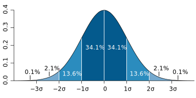

# 随机变量

提示：高中这一部分涉及的非常浅，并且一般的讲解也没有逻辑和思维可言，如果你想要更深刻的了解这些内容，又不想过于深入，建议你阅读 [Prob-Stat](http://staff.ustc.edu.cn/~zwp/teach/Prob-Stat/probstat.htm)，以及我爬取的这个课程的[讲义](https://huggingface.co/datasets/RainPPR/whk/resolve/main/math/%E6%A6%82%E7%8E%87%E8%AE%BA%E4%B8%8E%E6%95%B0%E7%90%86%E7%BB%9F%E8%AE%A1%E8%AE%B2%E4%B9%89.pdf)和[课件](https://huggingface.co/datasets/RainPPR/whk/resolve/main/math/USTC_Prob_Stat_Complete.pdf)。

## 随机变量的概念

### 随机变量

随机变量是用来表示随机试验结果的变量，通常用大写字母 $X,Y,Z$ 或小写希腊字母 $\xi,\eta,\zeta$ 表示。

随机函数是一个特殊的实函数，对于任意 $e\in S$，都有唯一一个对应 $X(e)$，如图。


随机变量实质上是样本空间上的函数，可作为因变量，满足其值不大于某数的状况都是事件。我们称随机变量这个函数的值域为随机变量的取值范围，或值域。

随机变量在不同的条件下由于偶然因素影响，其可能取各种随机变量不同的值，具有不确定性和随机性，但这些取值落在某个范围的概率是一定的，此种变量称为随机变量。随机变量可以是离散型的，也可以是连续型的。如分析测试中的测定值就是一个以概率取值的随机变量，被测定量的取值可能在某一范围内随机变化，具体取什么值在测定之前是无法确定的，但测定的结果是确定的，多次重复测定所得到的测定值具有统计规律性。随机变量与模糊变量的不确定性的本质差别在于，后者的测定结果仍具有不确定性，即模糊性。

随机变量按其值域（根据定义，随机变量是一个函数）是否可数分为**离散型**和**连续型**两种。

### 示性函数

对于样本空间 $\Omega$ 上的事件 $A$，定义随机变量

$$
I_A(\omega) = \begin{cases}
    1, & \omega \in A \\
    0, & \omega \notin A
\end{cases}
$$

称 $I_A$ 是事件 $A$ 的**示性函数**，根据定义可以求得其期望 $EI_A = P(A)$。

### 离散型随机变量

如果随机变量 $X$ 的取值是有限的或者是可数无穷尽的值：$X(S)=\{x_1, x_2, \cdots, x_n\}$ 则称 $X$ 为离散随机变量。

设 $X$ 为离散型随机变量，其所有可能的取值为 $x_1, x_2, \cdots$，则我们可以用一系列形如 $P\{ X = x_i \} = p_i$ 的等式来描述 $X$，这就是概率**分布列**。

| \(X\) | \(x_1\) | \(x_2\) | \(\cdots\) | \(x_n\) |
|:-----:|:-------:|:-------:|:----------:|:-------:|
| \(P\) | \(p_1\) | \(p_2\) | \(\cdots\) | \(p_n\) |

### 连续型随机变量

- 如果 $X$ 的取值遍布一区间甚至是整个数线 $X(S)=[a,b]$ 则称 $X$ 为连续随机变量。

- 设 $X$ 为连续型随机变量，考察 $P\{ X = x \}$ 往往是无意义的（因为这一概率很可能是 $0$）。

为什么说概率「很可能」是 $0$？考虑这样的随机变量 $X$：它以 $1/2$ 的概率取 $0$，以 $1/2$ 的概率服从开区间 $(0, 1)$ 上的均匀分布。显然 X 满足连续型随机变量的定义。对任何实数 $r \in (0, 1)$，不难得到 $P\{ X = r \} = 0$，但同时有 $P\{ X = 0 \} = 1/2$。

另一方面，设 $X \sim F(x)$，则

$$
P( l < x \leq l + \Delta x ) = F(l + \Delta x) - F(l)
$$

一个自然的想法是用极限：

$$
\lim\limits_{\Delta x \to 0^+} \frac{F(l + \Delta x) - F(l)}{\Delta x}
$$

来描述 $X$ 取值为 $l$ 的可能性，这个式子就是我们熟知的导数，于是问题转化为寻找一个非负函数 $f(x)$ 使得：

$$
F(x) = \int_{-\infty}^{x} f(x) \text{d} x
$$

若这样的 $f(x)$ 存在，则称之为 $X$ 的**密度函数**。

### 随机变量的独立性

前面讨论了随机事件的独立性。由于随机变量和随机事件紧密联系，我们还可以类似地给出随机变量独立性的定义。

定义：

- 若随机变量 $X, Y$ 满足对任意的 $x, y \in \mathbb{R}$ 都有

    $$
    P( X \leq x, Y \leq y ) = P( X \leq x ) P( Y \leq y )
    $$

    则称随机变量 $X, Y$ 独立。

- 中学课本中对随机变量独立性的定义是用形如 $P(X = \alpha)$ 的概率定义的，但由于连续性随机变量取特定值的概率通常是 $0$，故在更一般的情形下借助分布函数定义才是更加明智的选择。

性质

- 若随机变量 $X,Y$ 相互独立，则对于任意函数 $f, g$，随机变量 $f(X)$ 与 $g(Y)$ 相互独立。

- 有时候我们会研究相互独立的随机变量 $X,Y$ 的某一函数 $f(X, Y)$（如 $XY^2$）的分布。

- 尽管 $X$ 与 $Y$ 是独立的，但不能想当然地认为对 $Y$ 的某一取值 $y$，$f(X, y)$ 与 $f(X, Y)$ 服从同样的分布。

- 根据 Qwen2.5-Max，这混淆了条件分布与无条件分布，错误认为独立性允许直接替换随机变量为常数而不改变分布。实际上，独立性仅保证边缘分布的分离，而非函数分布的等价性。

## 随机变量的数字特征

### 期望

算术平均数 $A_n$：

$$
\bar x=\dfrac1n\sum_{i=1}^nx_i
$$

**离散型随机变量**：

设离散型随机变量 $X$ 的概率分布为 $p_i = P\{ X = x_i \}$，若和式

$$
\sum x_i p_i
$$

绝对收敛，则称其值为 $X$ 的**期望**，记作 $EX$。

**连续型随机变量**：

设连续型随机变量 $X$ 的密度函数为 $f(x)$，若积分

$$
\int_{\mathbb{R}} xf(x) \text{d} x
$$

绝对收敛，则称其值为 $X$ 的**期望**，记作 $EX$。

**期望的性质**：

- 期望的线性性（据此可以通过变换计算平均数）：

    $$
    E(ax+by+c)=aEx+bEy+c
    $$

- 若随机变量 $X,Y$ 的期望存在且 $X,Y$ 相互独立，则有

    $$
    E(XY) = EX \cdot EY
    $$

    注意：上述性质中的独立性**并非必要**条件。

### 方差

我们常见的序列方差：

$$
DX=\dfrac1n\sum_{i=1}^n(X_i-DX)^2
$$

推广到一般的随机变量：

设随机变量 $X$ 的期望 $EX$ 存在且期望

$$
DX=E\left[(X - EX)^2\right]=\sum p_i(X_i-EX)^2
$$

也存在，则称上式的值为随机变量 $X$ 的**方差**，记作 $DX$ 或 $VX$。

拆开平方即可得到：

$$
DX=E(X^2)-(EX)^2
$$

方差也有类似线性性的变换：

$$
\begin{aligned}
V(ax+b)&=E\left[(ax+b)^2\right]-\left[E(ax+b)\right]^2\\
&=a^2E(x^2)+2abEx+b^2-\left[a^2(Ex)^2+2abE_x+b^2\right]\\
&=a^2\left[E(x^2)-(Ex)^2\right]\\
&=a^2V(x)
\end{aligned}
$$

这暗示了方程描述离散程度的性质。

方差的算术平方根称为标准差，记作 $\sigma(X) = \sqrt{DX}$。

### 协方差

对于随机变量 $X, Y$，称

$$
E((X - EX)(Y - EY))
$$

为 $X$ 与 $Y$ 的**协方差**，记作 $\operatorname{Cov}(X, Y)$。

对于随机变量 $X, Y, Z$ 有：

$$
\operatorname{Cov}(X, Y) = \operatorname{Cov}(Y, X)
$$

对任意常数 $a, b$，有：

$$
\operatorname{Cov}(aX + bY, Z) = a \cdot \operatorname{Cov}(X, Z) + b \cdot \operatorname{Cov}(Y, Z)
$$

同时协方差与方差也有如下联系：

$$
DX = \operatorname{Cov}(X, X)
$$

$$
D(X + Y) = DX + 2 \operatorname{Cov}(X, Y) + DY
$$

不难看出 $D(X + Y) = DX + DY$ 当且仅当 $\operatorname{Cov}(X, Y) = 0$，它的一个**充分而不必要**条件是 $X,Y$ 独立：

$$
\operatorname{Cov}(X, Y) = E((X - EX)(Y - EY)) = E(X - EX) E(Y - EY) = 0
$$

关于协方差：你可能会发现协方差的性质与向量内积的运算性质在形式上高度一致。

在泛函分析的视角下，对于给定的概率空间，其上的全体随机变量构成一个线性空间，而协方差是这个空间上的一个内积，标准差则是由该内积导出的范数。

### 相关系数

对于随机变量 $X, Y$，称

$$
\frac{ \operatorname{Cov}(X, Y)}{ \sigma(X)\sigma(Y) }
$$

为 $X$ 与 $Y$ 的 Pearson 相关系数，记作 $\rho_{X,Y}$。

Pearson 相关系数描述了两个随机变量之间线性关联的紧密程度。

- 不难证明 $|\rho_{X,Y}| \leq 1$.

- $|\rho_{X,Y}|$ 越大，则 $X$ 与 $Y$ 之间的线性关联程度越强。

- 当 $\rho_{X,Y} = 0$ 时我们称随机变量 $X$ 与 $Y$ **不相关**，此时 $X$ 和 $Y$ 之间不存在线性关系。

且 $|\rho_{X,Y}| = 1$ 仅可能出现在以下两种情况：

- 当存在实数 $a$ 和正实数 $b$ 使得 $P(X = a + bY) = 1$ 时，有 $\rho_{X,Y} = 1$。

- 当存在实数 $a$ 和负实数 $b$ 使得 $P(X = a + bY) = 1$ 时，有 $\rho_{X,Y} = -1$。

两随机变量不相关只是表明他们之间没有线性关联，并不代表没有其他形式的联系。

因此两随机变量 $X, Y$ 不相关是他们相互独立的**必要而不充分**条件，而 $\operatorname{Cov}(X, Y) = 0$ 的充要条件是 $X, Y$ 不相关。

### Markov 不等式

设 $X$ 是一个取值非负的随机变量，则对任意正实数 $a$ 有

$$
P\{ X \geq a \} \leq \frac{EX}{a}
$$

事实上，由于 Markov（马尔可夫）不等式本身并没有用到随机变量除期望外的与分布有关的任何信息，因此直接应用这个不等式得到的约束通常很松。

证明：

记 $I$ 为事件 $X \geq a$ 的示性函数，则有

$$
I \leq \frac{X}{a}
$$

这是根据下去整的性质，进而：

$$
P\{ X \geq a \} = EI \leq \frac{EX}{a}
$$

## 随机变量的应用

### 信息熵

信息熵描述了存储数据所占用的空间下限，若实际可用的空间低于这个下限则必然损失信息。

对随机变量 $X$，定义信息熵为：

$$
H(X)=-\sum_{x}P(X=x)\log_2 P(X=x)
$$

定义中对数底数为 $2$ 是因为计算机中存储的信息每位只有 $2$ 种取值：$0$ 和 $1$。

例如设 $X$ 服从 $\{1,2,\dots,n\}$ 上的均匀分布，则其信息熵为：

$$
H(X)=-\sum_{i=1}^n\frac{1}{n}\log_2\frac{1}{n}=\log_2 n
$$

所以我们至少需要 $\log_2 n$ 位来存储 $1$ 到 $n$ 的整数。

### 频率分布直方图

横轴表示数据，纵轴表示频率除以组距。

数据分组可以是等距的，也可以是不等距的，要根据数据的特点而定。

有时为了方便，往往按等距分组，或者除了第一和最后的两段，其他各段按等距分组。

因此，图像中矩形的面积就是频率，频率等于频数除以总数。

### 百分位数和四分位数

若将一组数据从小到大排序，并计算相应的累计百分点，则某百分点所对应数据的值，就称为这百分点的百分位数，以 $P_{k}$ 表示第 $k$ 百分位数。

准确定义：$P_{k}$ 表示至少有 $k\%$ 的资料小于或等于这个数，而同时也至少有 $(100-k)\%$ 的资料大于或等于这个数。

特殊的：

| 百分位数 | 意义 |
| -: | :-: |
| $P_0$ | 最小值 |
| $Q_1=P_{25}$ | 第一个四分位数，上四分位数 |
| $Q_2=P_{50}$ | 第二个四分位数，中位数 |
| $Q_3=P_{75}$ | 第三个四分位数，下四分位数 |
| $P_{100}$ | 最大值 |

百分位数的计算方法：

1. 将数据从小到大排序为 $x_1,x_2,\dots,x_n$。
2. 计算 $i=n\cdot p\%$：
    - 如果 $i$ 不是整数，则取 $x_{\lceil i\rceil}$ 为 $p\%$ 分位数。
    - 否则，取 $(x_i+x_{i+1})/2$ 为 $p\%$ 分位数。
3. 特别的，规定 $0$ 分位数为最小值，$100\%$ 分位数为最大值。

另外的，$P_{75}$ 与 $P_{25}$ 的差称为四分位距。

## 概率分布

### 概率分布函数

概率分布简称分布，广义地，它指：随机变量的概率性质——当我们说概率空间中的两个随机变量 $X$ 和 $Y$ 具有同样的分布时，我们是无法用概率 $P$ 来区别他们的。

但是，不能认为同分布的随机变量是相同的随机变量。事实上即使 $X$ 与 $Y$ 同分布，也可以没有任何点 $\omega$ 使得 $X(\omega)=Y(\omega)$。在这个意义下，可以把随机变量分类，每一类称作一个分布，其中的所有随机变量都同分布。

狭义地，它是指随机变量的概率分布函数：对于随机变量 $X$，称函数 $F(x)$ 为随机变量 X 的 分布函数。记作 $X \sim F(x)$。

$$
F(x) = P( X \leq x )
$$

分布函数具有以下性质：

- 右连续性：$F(x) = F(x + 0)$。

- 单调性：在 $\mathbb{R}$ 上单调递增（非严格）。

- $F(-\infty) = 0,F(+\infty) = 1$。

同时我们可以证明，满足上述要求的函数都是某个随机变量的分布函数。因此，分布函数与随机变量之间一一对应。具有相同分布函数的随机变量一定是同分布的，因此可以用分布函数来描述一个分布，但更常用的描述手段是概率密度函数。

用更简要的语言来说，同分布是一种等价关系，每一个等价类就是一个分布。需注意的是，通常谈到的离散分布、均匀分布、伯努利分布、正态分布、泊松分布等，都是指各种类型的分布，而不能视作一个分布。

分布函数的值域是离散的，比如只取整数值的随机变量就是属于离散分布的。离散型均匀分布是一种离散型概率分布，其所有可能的观察值数量为有限整数，且每一个观察值的出现概率皆相同。离散型均匀分布的一个例子是掷公平骰子，其可能的观察值为 $1,2,3,4,5,6$，而每一个数字的出现概率都是 1/6。但若同时丢二个均匀骰子，将其值相加，就不属于离散型均匀分布，因为各个和的概率不同。

虽然离散型均匀分布常用来描述观察值为连续整数的分布，例如前述的掷骰子范例，但实际上可以在任意有限集合上定义离散型均匀分布，例如随机置换就是由已知长度的置换中均匀随机产生的组合，而均匀生成树则是从给定图的生成树集合中均匀随机抽样得到的生成树。

离散分布，即分布函数的值域是离散的，比如只取整数值的随机变量就是属于离散分布的。因为涉及到离散的函数，通常就会有非常复杂的定义和公式，不像离散的还可以用数列和组合的方法，因此高中阶段通常只涉及连续型均匀分布和正态分布。

连续型均匀分布（英语：continuous uniform distribution）或矩形分布（rectangular distribution）的随机变量 $x$ ，在其值域之内的每个等长区间上取值的概率皆相等。其概率密度函数在该变量的值域内为常数。

### 伯努利分布

伯努利分布又名两点分布或者 0-1 分布，是一个离散型概率分布。伯努利试验是只有两种可能结果（成功或失败）的单次随机试验，若伯努利试验成功，则伯努利随机变量取值为 $1$。若伯努利试验失败，则伯努利随机变量取值为 $0$。记其成功概率为 $p$，失败概率为 $q=1-p$。

### 泊松分布

泊松分布，又称 Poisson 分布、帕松分布、布瓦松分布、布阿松分布、普阿松分布、波以松分布、卜氏分布、帕松小数法则等，泊松分布适合于描述单位时间内随机事件发生的次数的概率分布。如某一服务设施在一定时间内受到的服务请求的次数，电话交换机接到呼叫的次数、汽车站台的候客人数、机器出现的故障数、自然灾害发生的次数、DNA 序列的变异数、放射性原子核的衰变数、激光的光子数分布等等。（单位时间内发生的次数，可以看作事件发生的频率，类似物理的频率。

Poisson 近似是二项分布的一种极限形式。其强调如下的试验前提：一次抽样的概率值 $p$ 相对很小，而抽取次数 $n$ 值又相对很大。因此泊松分布又被称之为罕有事件分布。泊松分布指出，如果随机一次试验出现的概率为 $p$ ，那么在 $n$ 次试验中出现 $k$ 次的概率按照泊松分布应该为：

$$
f(n,k,p)={\frac {(n\cdot p)^{k}}{e^{n\cdot p}\cdot k!}}
$$

其中，数学常数 $e=2.71828...$。

### 二项分布

只有“成功”和“失败”两种可能结果，每次重复时成功概率不变的独立随机试验称作伯努利试验，例如上述的掷硬币出现正面或反面、对产品进行抽样检查时抽到正品或次品。二项分布描述在进行独立随机试验时，每次试验都有相同概率“成功”的情况下，获得成功的总次数。

$$
f_n(k)={n \choose k}p^{k}(1-p)^{n-k}\quad (k=0,1,\ldots ,n)
$$

其中 $n$ 为正整数、$0\le p\le 1$，则称 $x$ 服从参数为 $n,p$ 的二项分布，记为 $x\sim B(n,k)$。根据二项式定理，对其所有项求和，就会得到一。

### 负二项分布

负二项分布是一种描述在一系列独立同分布的伯努利试验中，成功次数达到指定次数 $r$ 时失败次数的离散概率分布。比如，如果我们定义掷骰子随机变量 $x$ 值为 $x=1$ 时成功，所有 $x\neq1$ 为失败，这时我们反复掷骰子直到 $1$ 出现 $3$ 次（$r=3$），此时非 $1$ 数字出现次数的概率分布即为负二项分布。当 $r$ 是整数时的负二项分布又称帕斯卡分布，其概率质量函数为：

$$
f(k;r,p)=\dbinom{k+r-1}{r-1} p^r(1-p)^k,\quad k=0,1,2,\dots
$$

其中 $k$ 是失败的次数， $r$ 是成功的次数， $p$ 是事件成功的概率。在负二项分布的概率质量函数中，由于 $k+r$ 次伯努利试验为独立同分布，每个成功 $r$ 次、失败 $k$ 次的事件的概率为 $p^r(1-p)^k$。由于第 $r$ 次成功一定是最后一次试验，所以应该在 $k+r-1 次试验中选择 $r-1$ 次成功，使用排列组合二项系数获取所有可能的选择数。

### 超几何分布

超几何分布是统计学上一种离散概率分布。它描述了由有限个对象中抽出 $n$ 个对象，成功抽出 $k$ 次指定种类的对象的概率（抽出不放回），记为 $X\sim H(n,K,N)$。例如在有 $N$ 个样本，其中 $K$ 个是不及格的。超几何分布描述了在该 $N$ 个样本中抽出 $n$ 个，其中 $k$ 个是不及格的个数：

$$
f(k;n,K,N)=\dfrac{\dbinom{K}{k}\dbinom{N-K}{n-k}}{\dbinom{N}{n}}
$$

上式可如此理解：$\dbinom{N}{n}$表示所有在 $N$ 个样本中抽出 $n$ 个的方法数目。$\dbinom{K}{k}$ 表示在 $K$ 个样本中，抽出 $k$ 个的方法数目。剩下来的样本都是及格的，而及格的样本有 $N-K$ 个，剩下的抽法便有 $\dbinom{N-K}{n-k}$。若 $n=1$，超几何分布退化为伯努利分布。

### 几何分布

几何分布指的是以下两种离散型概率分布中的一种：

1. 在伯努利试验中，得到一次成功所需要的试验次数 $X$，$X\in\{ 1, 2, 3, \dots \}$。
2. 在得到第一次成功之前所经历的失败次数 $Y=X-1$，$Y\in\{ 0, 1, 2, 3, \dots \}$。

如果每次试验的成功概率是 $p$，那么 $k$ 次试验中，第 $k$ 次才得到成功的概率是，

$$
f(k)=(1-p)^{k-1}p,\quad k=1,2,3,\dots
$$

上式描述的是取得一次成功所需要的试验次数。而另一种形式，也就是第一次成功之前所失败的次数，可以写为，

$$
f(k)(1-p)^{k}p,\quad k=0,1,2,3,\dots
$$

两种情况产生的序列都是几何数列。这是几何分布的名字来源。比如，假设不停地掷骰子，直到得到 $1$。投掷次数是随机分布的，取值范围是无穷集合 $\{ 1, 2, 3, \dots \}$，并且是一个 $p={\dfrac {1}{6}}$ 的几何分布。

### 正态分布

正态分布，物理学中通称高斯分布，其密度函数的曲线呈对称钟形，因此又被称之为钟形曲线。

正态分布的概率密度函数中以平均值 $\mu$、标准差 $\sigma$ 为参数，正态分布的数学期望值或期望 $\mu$ ,可解释为位置参数，决定了分布的位置；其方差 $\sigma ^{2}$ 的平方根或标准差 $\sigma$ 可解释尺度参数，决定了分布的幅度。

```python exec="1" html="1"
from io import StringIO

import numpy as np
import matplotlib.pyplot as plt 

def make_gauss(N, sig, mu):
    return lambda x: N/(sig * (2*np.pi)**.5) * np.e ** (-(x-mu)**2/(2 * sig**2))

ax = plt.figure().add_subplot(1,1,1)
x = np.arange(-5, 5, 0.01)
s = np.sqrt([0.2, 1, 5, 0.5])
m = [0, 0, 0, -2] 
c = ['b','r','y','g']

for sig, mu, color in zip(s, m, c): 
    gauss = make_gauss(1, sig, mu)(x)
    ax.plot(x, gauss, color, linewidth=2)

plt.xlim(-5, 5)
plt.ylim(0, 1)
plt.legend(['0.2', '1.0', '5.0', '0.5'], loc='best')

buffer = StringIO()
plt.savefig(buffer, format="svg")
print(buffer.getvalue())

```

中心极限定理指出，在特定条件下，一个具有有限均值和方差的随机变量的多个样本（观察值）的平均值本身就是一个随机变量，其分布随着样本数量的增加而收敛于正态分布。

因此，许多与独立过程总和有关的物理量，例如测量误差，通常可被近似为正态分布。正态分布是一种理想分布，许多典型的分布，比如成年人的身高、汽车轮胎的运转状态、人类的智商值（IQ），都属于或者说至少接近正态分布。

同样按照连续分布的定义，正态概率密度函数具有和普通概率密度函数类似的性质。

正态分布是自然科学与行为科学中的定量现象的一个方便模型。各种各样的心理学测试分数和物理现象比如光子计数都被发现近似地服从正态分布。尽管这些现象的根本原因经常是未知的，理论上可以证明：如果把许多小作用加起来看做一个变量，那么这个变量服从正态分布。

正态分布出现在许多区域统计：例如，采样分布均值是近似正态分布的，即使被采样的样本的原始群体分布并不服从正态分布。另外，正态分布信息熵在所有的已知均值及方差的分布中最大，这使得它作为一种均值以及方差已知的分布的自然选择。正态分布是在统计以及许多统计测试中最广泛应用的一类分布。在概率论，正态分布是几种连续以及离散分布的极限分布。



正态分布中一些值得注意的量：

- 密度函数关于平均值对称。

- 平均值与其众数（statistical mode）以及中位数（median）为同一数值。

- 函数曲线下 $68.268949\%$ 的面积在平均数左右的一个标准差范围内。

- $95.449974\%$ 的面积在平均数左右两个标准差 $2 \sigma$ 的范围内。

- $99.730020\%$ 的面积在平均数左右三个标准差 $3 \sigma$ 的范围内。

- $99.993666\%$ 的面积在平均数左右四个标准差 $4 \sigma$ 的范围内。

- 函数曲线的拐点（inflection point）为离平均数一个标准差距离的位置。

正态分布的一些性质：

- **线性变换不变性**：若 $X \sim N(\mu, \sigma^2)$ 且 $a$ 与 $b$ 是实数，那么 $aX + b \sim N(a \mu + b, a^2 \sigma^2)$。

- **独立可加性**：如果 $X \sim N(\mu_1, \sigma_1^2)$ 与 $Y \sim N(\mu_2, \sigma_2^2)$ 是统计独立的正态随机变量，那么：

    $$
    X + Y \sim N(\mu_1 + \mu_2, \sigma_1^2 + \sigma_2^2)
    $$

    特别地，若 $X$ 与 $Y$ 的方差相等，则 $U = X + Y$ 与 $V = X - Y$ 相互独立。

- 如果 $X \sim N(0, \sigma_1^2)$ 和 $Y \sim N(0, \sigma_2^2)$ 是独立正态随机变量，那么：

    - 它们的积 $XY$ 服从概率密度函数为 $p$ 的分布：

        $$
        p(z) = \frac{1}{\pi \sigma_1 \sigma_2} K_0 \left( \frac{|z|}{\sigma_1 \sigma_2} \right)
        $$

        其中 $K_0$ 是修正贝塞尔函数（modified Bessel function）。

    - 它们的比符合柯西分布，满足 $X/Y \sim \text{Cauchy}(0, \sigma_1 / \sigma_2)$。

- 如果 $X_1, \dots, X_n$ 为独立标准正态随机变量，那么 $X_1^2 + \dots + X_n^2$ 服从自由度为 $n$ 的卡方分布，记作 $X_1^2 + \dots + X_n^2 \sim \chi^2(n)$。
