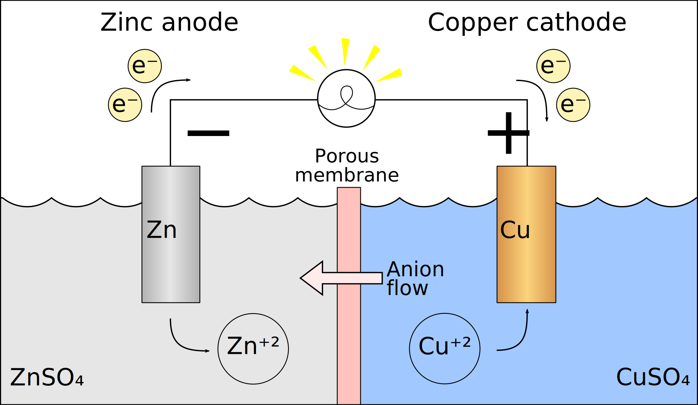
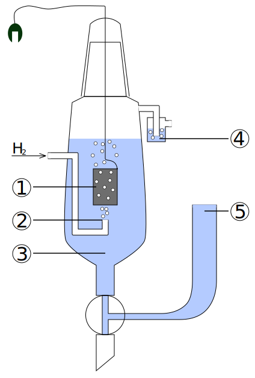

# 氧化还原与电化学

## 氧化还原反应

### 氧化和还原

氧化还原反应：

- **定义**：有化合价变化的反应。

- **本质**：电子的转移（得失或偏移）。

其中，化合价有：

|   元素   |                 化合价规律                 |
| :------: | :----------------------------------------: |
| $\ce{H}$ | 一般显 $+1$ 价 在金属氢化物中显 $-1$ 价 |
| $\ce{O}$ |  一般显 $-2$ 价 在过氧化物中显 $-1$ 价  |
| $\ce{F}$ |          只显 $-1$ 价（没有正价）          |

特殊物质化合价：

|               物质               |                物质                |              物质               |                   物质                   |
| :------------------------------: | :--------------------------------: | :-----------------------------: | :--------------------------------------: |
| $\ce{K2\val{Fe}{+4}O4}$ 高铁酸钾 | $\ce{K2\val{Cr}{+6}_2O7}$ 重铬酸钾 | $\ce{K\val{Mn}{+7}O4}$ 高锰酸钾 | $\ce{\val{O}{+2}\val{F}{-1}_2}$ 二氟化氧 |
|      $\ce{\val{B}{+3}_2H6}$      |       $\ce{\val{Si}{+4}H4}$        |      $\ce{\val{C}{+4}H4}$       |        $\ce{\val{S}{+6}_2O8^2-}$         |

氧化还原反应的特征：

- 氧化反应和还原反应是在一个反应中同时发生的。

- 氧化反应伴随着化合价的升降，且升降总数相等。

反应物和生成物：

- **氧化剂**得电子，化合价降低，以自己的氧化能力将还原剂氧化，自身发生还原反应，被还原后生成还原产物。

- **还原剂**失电子，化合价升高，以自己的还原能力将氧化剂还原，自身发生氧化反应，被氧化后生成氧化产物。

简记为：**升失氧化还原剂，降得还原氧化剂**。

- **歧化反应**：相同的反应物或元素，其一化合价上升，另一下化合价下降；常发生在碱性环境中。

- **归中反应**：两个或多个含有某元素而化合价不同的反应物，得到化合价相同的单一产物；常发生在酸性环境中。

对于反应的判断，有以下性质：

- 所有置换反应都是氧化还原反应。

- 有单质参与的化合或分解反应都是氧化还原反应。

总结规律如下：

1. **电子守恒**：价态有升有降，且升降总数相等。

2. **能不变就不变**：
    - 相近转化，能不相交就不相交。

    - 同时一个元素化合价不变的原子不参与氧化还原反应。

    - 相邻价态不反应。

3. **强者先行**：假设法，例如 $\ce{Cl2}$ 先氧化 $\ce{FeI2}$ 中的碘离子。

### 氧化剂和还原剂

|        氧化剂         |   还原产物   |     |        氧化剂         |   还原产物   |
| :-------------------: | :----------: | :-: | :-------------------: | :----------: |
| $\ce{HClO,Cl2,KClO3}$ |  $\ce{Cl-}$  |     | $\ce{KMnO4,MnO2(H+)}$ | $\ce{Mn^2+}$ |
|    $\ce{O2,H2O2}$     |  $\ce{H2O}$  |     |   $\ce{H2SO4(浓)}$    |  $\ce{SO2}$  |
|    $\ce{HNO3(浓)}$    |  $\ce{NO2}$  |     |    $\ce{HNO3(稀)}$    |  $\ce{NO}$   |
|      $\ce{Br2}$       |  $\ce{Br-}$  |     |       $\ce{I2}$       |  $\ce{I-}$   |
|     $\ce{Fe^3+}$      | $\ce{Fe^2+}$ |     |      $\ce{Ag+}$       |  $\ce{Ag}$   |

|     还原剂     |   氧化产物   |     |      还原剂       |   氧化产物    |
| :------------: | :----------: | :-: | :---------------: | :-----------: |
| $\ce{S2-,H2S}$ |   $\ce{S}$   |     | $\ce{SO2,SO3^2-}$ | $\ce{SO4^2-}$ |
|   $\ce{NH3}$   | $\ce{N2,NO}$ |     |    $\ce{H2O2}$    |   $\ce{O2}$   |
|  $\ce{CO,C}$   |  $\ce{CO2}$  |     |     $\ce{I-}$     |   $\ce{I2}$   |

氧化性和还原性：

1. 同种元素：
    - 最高价态只降不升，最低价态只升不降。

    - 一般价态越高氧化性越强，价态越低氧化性越弱。

2. 互补性：单质氧化性越强，其对应的离子还原性越弱。
    - （金属）活动性顺序：

        氧化性：$\ce{Ag+ > Fe^3+ > Cu^2+ > H+ > \dots > Fe^2+ > \dots}$

        还原性：$\ce{Au < Ag < Cu < (H) < \dots < Fe < \dots}$

    - （非金属）活动性顺序：

        氧化性：$\ce{F2 > Cl2 > Br2 > I2 > S}$。

        还原性：$\ce{F- < Cl- < Br- < I- < S^2-}$。

3. 根据反应条件与反应现象：
    - 与同一类反应物反应，条件越低越强。

    - 与同一类反应物反应，反应越剧烈越强。

4. 不是很不准确的（存疑）：
    - 通常价位变化越大越强（反例：硝酸）。

    - 通常浓度越大越强，酸性越强氧化性越强（对于 $\ce{ClO-,MnO4-,NO3-}$ 等含氧酸）。

5. 根据反应方程式判断：
    - 两强制两弱：氧化剂氧化性大于氧化产物，还原剂还原性大于还原产物。

    - 不能说氧化剂氧化性大于还原剂，只能说某一条件下某物质表现了氧化性或还原性。

6. 有还原性不一定表现还原性，有强氧化性也不一定表现氧化性。

常见物质氧化性、还原性顺序表：

- 氧化性：$\ce{MnO4- > Cl2 > Br2 > Fe^3+ > I2 > SO2 > S}$。

- 还原性：$\ce{Mn^2+ < Cl- < Br- < Fe^2+ < I- < SO3^2- < S2-}$。

- 上表使用方法，找到左上、右下两组为反应物，找到对应左下、右上为产物。

### 方程式配平

用箭头表示电子的转移，依据是得电子数等于失电子数。

1. 标化合价升降。

2. 根据化合价升降守恒配平变价元素。

3. 根据原子守恒、电荷守恒配平其他元素和物质。

{ width="70%" }

{ width="70%" }

转移电子数为一条线上的，只考虑得到的电子数或者失去的电子数。

### 亚甲基蓝

亚甲蓝又称亚甲基蓝，注意亚甲（基）蓝并无亚甲基。

- 分析化学中用亚甲蓝作为氧化还原反应滴定的指示剂，会比碘液更好。

- 亚甲蓝的水溶液在氧化性环境中呈蓝色，但遇还原剂会被还原成无色形态，也是一种氧化还原指示剂。

- 其亚甲蓝因为有还原性，注射液被用来治疗正铁血红蛋白血症，也用于解救硝基苯、亚硝酸盐和氰化物中毒等。

- 蓝瓶实验也是以亚甲蓝的变色为基础的。可以用来检验水的溶氧量，反应是会令亚甲蓝液更蓝。

另外注意甲紫溶液（又称龙胆紫，详见生物）与亚甲蓝不同，应注意勿混用。

## 电化电池概述

电化电池又称电化学电池、化学电池，是一种能够从化学反应中**产生电能**或**利用电能**引起化学反应的装置。

按此定义，电化电池分为两种类型：

- **原电池**：包含伏打电池、伽伐尼电池，是产生电能与电流的电化学电池，即发生化学反应（氧化还原反应）将化学能转为电能的装置。

- **电解池**：又称电解电池，是利用电能通过电解等方式产生化学反应的电化学电池，即输入电能引发化学反应的装置。

高中电化学的核心是导线中电子的运动，无论哪种电池，**阳极永远发生氧化反应，阴极永远发生还原反应**。

### 原电池

原电池又称一次电池、初级反应电池，意指不可充电电池，是化学电池的一种，以化学能转变为电能而提供电力，且只可放电一次，当内里的化学物质全部起了化学作用后便不能再能提供电能，也不能将外部提供的电力储起，因此完全放电后便不可再用，这是因为其电化反应不可逆转。有别于可以反复多次充电（储起外部提供的电力）后再放电的蓄电池（二次电池、可充电电池）。

原电池售价及生产成本一般较便宜，例如常用的碱性电池，但若成本以整体寿命计算则不及一般的蓄电池便宜。

通常情况下的原电池特指**伽伐尼电池**（或称**伏打电池**），其进行氧化还原反应将化学能转为电能，而提供电能的电化电池，属于一种原电池。

{ width="80%" }

{ width="80%" }

典型伽伐尼电池可由两种不同的金属与一种电解质组成，也可由两个半电池间以盐桥或多孔物相连而成；在表示的时候通常阳极在左，阴极在右。

原电池的组成：

1. 闭合回路：连接不同两极，放在电解液中。

2. 自发的氧化还原反应：电极与电解液，或电极附着物。

负极：

- 还原剂，失电子，发生氧化反应，阳极。

- 活动性通常较强，通常是固体溶解（反例铅酸蓄电池）。

- 吸引阴离子。

正极：

- 氧化剂，得电子，发生还原反应，阴极。

- 活动性通常较弱，通常有气体生成或电极增重。

- 吸引阳离子。

盐桥：

- 通常是琼脂、高浓度盐，离子从盐桥流出，起到联通电路的作用。

- 作用是隔离两极产物，防止电流不稳定；控制离子流动速率，从而控制反应速率。

- 多次使用后将其浸泡在饱和盐（氯化钠、氯化钾等）溶液中。

设计原电池：

- 确定方程式，确定电极，确定电解液。

- 惰性电极：只提供反应场所，不进行反应，通常是不活泼的。

电极方程式：

- 海水能导电，起电解质作用；如果直接电解海水，则考虑氯离子或其溶解的氧气。

- 碳化纤维素纸，增强导电性。

- 玻璃陶瓷、微晶玻璃：传导离子，防水。

- 光电效率与电子空穴呈正比。

### 电解池

电解池又称电解电池，是用于电解的装置，可以将电能转化为化学能，使某些平常情况下无法自发的化学反应得以发生。

电解池一般由电解液和两个电极组成，电解液可以是盐类的水溶液也可以是熔融的盐类。当在电极上加上外加电场时，电解液中的离子会被带相反电荷的电极所吸引，靠近该电极，进而在该电极上发生得电子或失去电子的还原或氧化反应。电解池的重要应用例子包括电解水、电解食盐水、电解熔融的氧化铝制取铝等过程。

电解池通常使用的电流都达数百安培，材料的电镀和金属的精炼也通过电解池进行。

{ width="90%" }

- 与电源的正极相连的电极为阳极，阳极带正电荷，吸引带负电的离子在阳极上失去电子，形成气体逸出。

- 与电源负极相连的电极为阴极，阴极带负电荷，吸引带正电的离子在阴极上得到电子，还原后生成金属或气体。

对于钠、镁、铝等较活泼金属的化合物，其中的金属离子很难得到电子还原成单质，故一般的还原法无法获得金属，可在电解池中通过外加电场促使还原反应发生。

电解池的组成：

- 电源连接两极，放入电解液。

- 阳离子流向负极（阴极），阴离子流向正极（阳极）。

- 不自发可以设计为电解池，自发可以加速反应。

- 阴极做惰性电极，阳极反应失电子。

电解池回复：跑了什么加什么。

阳极上阴离子放电：还原性顺序，活泼电极 $>\ce{S^2}>\ce{SO_3^2-}>\ce{I-}>$ $\ce{Br-}>\ce{Cl-}>\ce{OH-}>$ 含氧酸根 $>\ce{F-}$。

阴极上阳离子放电：金属活动顺序，$\ce{Ag+ > Hg+ > Fe^{3+} > Cu^{2+}}>$ $\ce{H+ > Pb^{2+} > Sn^{2+} > Fe^{2+}}>$ $\ce{Zn^{2+} > H+(H2O) > Al^{3+} > Mg^{2+}}>$ $\ce{Na+ > Ca^{2+} > K+}$。

实际情况可能有所不同，例如浓度也会影响放电顺序，高浓度可能先放电。

总反应：

- 电解溶质型：$\ce{CuCl2 ->[通电] Cu + Cl2}$。

- 电解各半成酸型：$\ce{2CuSO4 + 2H2O ->[通电] 2Cu + O2 + 2H2SO4}$。

- 电解各半成碱型：$\ce{2NaCl + 2H2O ->[通电] H2 + Cl2 + 2NaOH}$。

- 电解水型：$\ce{2H2O ->[通电] 2H2 + O2}$。

以水电解出来的氢离子、氢氧根为起点的，中学阶段体现具体的放电离子。

电解混合溶液：

- 方法一：列出所有反应，按照比例加起来。

- 方法二：组合法，将所有可能反应的离子凑在一起，凑出互不干扰的若干项，把他们的反应直接加起来。

### 电化学的核心理论与定量描述

电化学是研究**化学能与电能相互转化**规律及其物质在电场作用下发生化学变化的科学。其核心在于**电子的转移**，本质上是氧化还原反应在空间上的分离，通过外电路进行电子交换。以下根据提供的材料，详细展开讲解电化学的核心理论与定量描述：

标准氢电极是电化学中衡量所有电极电势的**通用基准**。

- **构造与条件**：它由一个镀有铂黑（增大表面积并催化反应）的惰性铂电极组成，浸泡在 $H^+$ 活度为 $1\text{ mol/L}$ 的酸性溶液中，并持续通入压力为 $1\text{ bar}$（或 $1\text{ atm}$）的纯氢气，维持在 $298\text{ K}$ ($25^\circ\text{C}$)。

    { width="40%" }

- **电极反应**：其半反应式为 $\text{2H}^+(aq) + 2e^- \rightleftharpoons \text{H}_2(g)$。
- **基准值**：科学界规定，在任何温度下，**标准氢电极的电极电势被定义为精确的 0 V**。

    |         电极反应 (还原反应) | 标准电极电势 E° |
    | --------------------------: | :-------------- |
    |        $\ce{K+ + e- <=> K}$ | $\pu{-2.92 V}$  |
    | $\ce{Ca^{2+} + 2e- <=> Ca}$ | $\pu{-2.87 V}$  |
    | $\ce{Mg^{2+} + 2e- <=> Mg}$ | $\pu{-2.37 V}$  |
    | $\ce{Al^{3+} + 3e- <=> Al}$ | $\pu{-1.66 V}$  |
    | $\ce{Zn^{2+} + 2e- <=> Zn}$ | $\pu{-0.76 V}$  |
    | $\ce{Fe^{2+} + 2e- <=> Fe}$ | $\pu{-0.44 V}$  |
    |     $\ce{2H+ + 2e- <=> H2}$ | $\pu{0 V}$      |
    | $\ce{Cu^{2+} + 2e- <=> Cu}$ | $\pu{+0.34 V}$  |
    |      $\ce{Ag+ + e- <=> Ag}$ | $\pu{+0.80 V}$  |

标准电极电势反映了物质在标准状态下**得电子（被还原）倾向的强弱**。

- **定义**：指电极处于标准状态（溶质浓度 $1\text{ M}$，气体压力 $1\text{ bar}$）下，与标准氢电极组成电池时测得的电势差，有时也称为**标准还原电位**。
- **物理意义**：$E^\ominus$ 越正，代表该电对的氧化态物质氧化性越强（越易得电子）；$E^\ominus$ 越负，则还原态物质的还原性越强。
- **标准电池电动势（$E^\ominus_{cell}$）**：由正极（阴极）和负极（阳极）的标准电极电位计算得出：**$E^\ominus_{cell} = E^\ominus_{cathode} - E^\ominus_{anode}$**。

电化学能与热力学状态函数吉布斯自由能（$\Delta G$）通过电子转移紧密耦合，这是**联系热力学与电化学的桥梁**。

- **理论基础**：在恒温恒压下，系统吉布斯自由能的减少量等于系统对外所做的**最大有用功**（即电功 $W_{elec}$）。
- **核心公式**：**$\Delta G = -nFE$**。
    - 其中 $n$ 是反应转移的电子物质的量，$F$ 为法拉第常数（约 $96485\text{ C/mol}$），$E$ 为电池电动势。
- **自发性判据**：当 $E > 0$ 时，$\Delta G < 0$，反应在热力学上是**自发的**。
- **与平衡常数（$K$）的关系**：根据热力学关系 $\Delta G^\ominus = -RT \ln K$，可导出：**$E^\ominus_{cell} = \frac{RT}{nF} \ln K$**。这说明标准电动势直接决定了反应的平衡限度。

能斯特方程描述了**电极电势（或电池电动势）随反应物组成（浓度、分压）和温度变化**的定量关系。

- **普遍形式**：**$E = E^\ominus - \frac{RT}{nF} \ln Q$**。
    - 其中 $Q$ 是反应商，代表生成物与反应物相对活度（或浓度、分压）的乘积比。
- **298.15 K ($25^\circ\text{C}$) 简化形式**：使用常用对数 $\log_{10}$ 简化为：**$E = E^\ominus - \frac{0.0592\text{ V}}{n} \log Q$**。
- **应用逻辑**：氧化态浓度升高（或还原态浓度降低）会使电极电势升高，反之降低。该方程允许计算非标准状态下的精确电压。

电化学极化是指当有电流流过电极时，电极电势偏离其热力学平衡电势的现象。这种偏离产生的差值称为**过电位（$\eta$）**。

- **基本类型**：
    - **活化极化（又称电化学极化）**：由于电极反应中电荷转移步骤（需克服活化能能垒）的迟缓性引起的极化。
    - **浓差极化**：由于反应物或产物在电极表面与溶液本体之间存在扩散速度限制，导致电极表面离子浓度发生改变而引起的极化。
    - **电阻极化（欧姆极化）**：由于电解质、电极材料或接触界面的内阻引起的电压降。
- **定量描述**：
    - **Butler-Volmer 方程**：描述了电流密度与过电位之间的基本动力学关系。
    - **Tafel 方程**：在强极化区，过电位与电流密度的对数呈线性关系（$\eta = a + b \log |i|$），常用于分析电极反应机理。
- **后果**：极化会导致电解时能量损耗（表现为热量），并使还原电势降低、反应速率减慢。在工业上，通过控制极化（如控制 pH、增大电极表面积等）可优化反应效率。

### 电化学综合装置

电化学综合装置是中学化学及竞赛中的高阶核心考点，其本质在于**电子流的守恒**与**离子流的定向迁移**。这类装置通常将原电池原理与电解原理结合，利用膜技术实现物质的精准分离与合成。

在多池串联系统中，无论装置如何复杂，其核心破题法则是：**整个串联电路中，各电极通过的电子物质的量 $n(e^-)$ 必须处处相等**。

1. 外接电源与电解池的串联：该模型存在明确的外接直流电源，驱动多个电解池协同工作。
    - **电极判定**：与电源正极相连的为**阳极**（发生氧化反应，失电子）；与电源负极相连的为**阴极**（发生还原反应，得电子）。串联电路中间的电极则根据电子流向判定，电子流出端为阳极，流入端为阴极。
    - **原理分析**：电源提供驱动力，迫使各池中非自发的氧化还原反应发生。
    - **计算依据**：所有阳极失去的电子总数 = 所有阴极得到的电子总数 = 电源输出的电子总数。

2. 原电池与电解池的串联：若装置无外接电源但有多个池子相连，则必然是一个池子作为**原电池（电源）**，驱动其余**电解池（用电器）**。
    - **识别原电池**：通常具有显著的活泼性差异电极、通入燃料与氧化剂（燃料电池）、或能自发进行氧化还原反应。
    - **连线法则**：原电池的**负极连接电解池的阴极**（提供电子）；原电池的**正极连接电解池的阳极**（回收电子），简称“**负接阴，正接阳**”。
    - **能量转化**：原电池将化学能转化为电能，电解池将电能转化为化学能。

离子交换膜是现代电化学装置的“灵魂”，主要由高分子特殊材料制成。

1. 隔膜的核心功能
    - **分隔作用**：防止两极产物直接接触（如防止 $H_2$ 与 $Cl_2$ 混合爆炸，或防止 $Cl_2$ 与 $NaOH$ 反应）。
    - **选择性透过**：仅允许特定离子通过，起到平衡电荷、闭合内回路的作用。
    - **物质制备与提纯**：利用离子的定向移动，在特定区域富集目标产物。

2. 膜的类型与通过性
    - **阳离子交换膜（CEM）**：只允许阳离子（如 $Na^+, H^+$）通过，阻止阴离子和气体。
    - **阴离子交换膜（AEM）**：只允许阴离子（如 $Cl^-, OH^-$）通过，阻止阳离子和气体。
    - **质子交换膜（PEM）**：专门设计用于仅允许质子（$H^+$）通过。
    - **双极膜（BPM）**：在直流电场作用下，将中间层的水催化解离为 $H^+$ 和 $OH^-$ 并分别向两极迁移。判定口诀为“**阳对阴，阴对阳**”——面向阳极的一侧是阴膜（释放 $OH^-$），面向阴极的一侧是阳膜（释放 $H^+$）。

多室电解池通过引入多张膜将装置分为多个功能腔室，常见模型包括“双膜三室”或“三膜四室”。

1. 功能区域深度解析：复杂的多室装置通常包含以下区域。
    - **原料区（进料区）**：通常位于中间室，负责提供目标产物所需的阴、阳离子（如盐类溶液）。在电场作用下，离子由原料室向两边移动，实现“**浓变稀**”。
    - **产品区（合成区/富集区）**：目标产物最终生成的区域。例如，原料区的阴离子与阳极产生的 $H^+$ 会合生成酸，该室即为**酸产品室**；原料区的阳离子与阴极产生的 $OH^-$ 会合生成碱，该室即为**碱产品室**。
    - **主料区（反应区/电极区）**：发生氧化还原反应并插入电极的区域，离子浓度变化最剧烈。
    - **辅料区/缓冲区（中转区）**：在复杂装置中用于维持电荷平衡、调节 pH 或防止强腐蚀性产物直接破坏膜，常充入导电且稳定的电解质（如硫酸钠）。

2. “三室/四室”模型实例分析
    - **制备次磷酸（$H_3PO_2$）**：利用三膜四室装置。阳极区产生 $H^+$ 通过阳膜进入**产品室**，原料室中的 $H_2PO_2^-$ 通过阴膜进入**产品室**，两者结合生成产品。
    - **海水的淡化**：在电场力作用下，中间**原料室**的 $Na^+$ 向阴极迁移，$Cl^-$ 向阳极迁移，中间室留下的即为淡水。

电化学综合装置的创新点在于实现原本难以进行的转化。

- **创新应用**：包括电有机合成（如合成己二腈）、微生物脱盐电池（同时处理废水与产电）、以及利用浓度差发电的浓差电池。
- **计算依据**：
    1. **电子守恒**：$n(e^-)$ 是连接所有极板产物的桥梁。
    2. **电中性原则**：各腔室溶液必须保持电中性，流入电荷量 = 流出电荷量，据此可判断跨膜离子的数量。
    3. **原子守恒**：结合电极反应式列比例计算产物量。

### 与有机物相关的电化学

与有机物相关的电化学，特别是**电有机合成（Electroorganic Synthesis）**，是现代化学中一个极具前景的领域。它直接利用**电子（Electron）**作为“绿色试剂”来驱动化学反应，避免了使用昂贵或高毒性的化学氧化还原剂，具有高原子经济性、精准可控及安全性高等优点。

在有机电化学中，判断反应发生的极位及电子转移数有一套简便的“得失氢/氧”经验规律：

- **氧化反应（阳极发生）**：表现为**加氧、脱氢**或失去电子。例如，醇转化为醛、羧酸脱羧偶联等。
- **还原反应（阴极发生）**：表现为**加氢、脱氧**或得到电子。例如，二氧化碳还原为甲酸、腈加氢还原等。
- **电子转移数计算**：在复杂有机物中，可按“**1个氢原子对应1个电子，1个氧原子对应2个电子**”计算。例如，乙醇 ($CH_3CH_2OH$) 氧化为乙酸 ($CH_3COOH$) 过程中失去了2个H、得到了1个O，故总共失去 $2 \times 1 + 2 = 4$ 个电子。

典型的有机电解合成反应：

1. 柯尔贝电解：这是最经典的阳极氧化反应，用于构建碳-碳键。

- **原理**：羧酸盐在阳极失去电子，发生脱羧反应形成自由基，随后两个自由基偶联生成烷烃。
- **反应式**：$2RCOO^- - 2e^- \rightarrow R-R + 2CO_2 \uparrow$。
- **应用**：通常在中性或弱酸性环境下使用铂电极，是制备长链烷烃的高效方法。

1. 己二腈的电合成：己二腈是制造尼龙-66的关键原料，工业上常利用丙烯腈的电解还原制备。
    - **阴极还原反应**：$2CH_2=CHCN + 2H^+ + 2e^- = NC(CH_2)_4CN$。
    - **阳极反应**：通常为水的放电析氧：$H_2O - 2e^- = \frac{1}{2}O_2 \uparrow + 2H^+$。
    - **总反应**：$2CH_2=CHCN + H_2O \xrightarrow{电解} NC(CH_2)_4CN + \frac{1}{2}O_2 \uparrow$。

2. 二氧化碳（$CO_2$）电化学还原：利用电化学手段将 $CO_2$ 转化为特定的有机物或燃料，是碳捕获与利用的重要途径。
    - **制甲酸**：$CO_2 + 2H^+ + 2e^- \xrightarrow{Sn} HCOOH$。
    - **制乙烯**：$2CO_2 + 12H^+ + 12e^- \xrightarrow{Cu} C_2H_4 + 4H_2O$。
    - **制乙醇**：$2CO_2 + 12H^+ + 12e^- \xrightarrow{Cu} C_2H_5OH + 3H_2O$。

有机电解常能诱导一些传统热化学难以实现的中间体路径。

- **阳极氧化诱导成环**：若分子两端分别为 $-OH$ 和 $C-H$，在阳极失去电子和质子后，可形成 $R_1-O-R_2$ 型的环醚。
- **高张力环开环重排**：1-苄基环丙醇在阳极氧化下，叔醇羟基会形成**烷氧自由基**，随后由于三元环巨大的张力能释放，发生 $\beta$-断裂，最终重组为包含苯环和五元环酮的**茚酮衍生物**。
- **自由基中间体（SET）**：许多反应遵循单电子转移（SET）历程，生成活泼的自由基或自由基阳离子，这是电有机合成选择性高的重要原因。

有机物相关的化学电源：

1. 微生物燃料电池（MFC）：利用微生物作为催化剂，在阳极氧化废水中的有机污染物（如葡萄糖、苯酚）并产生电能。
    - **负极（阳极）**：$C_6H_{12}O_6 + 6H_2O - 24e^- = 6CO_2 \uparrow + 24H^+$。
    - **正极（阴极）**：$O_2 + 4H^+ + 4e^- = 2H_2O$。

2. 直接有机燃料电池：
    - **甲醇/乙醇燃料电池**：燃料在负极被氧化。以甲醇为例，酸性条件下产物为 $CO_2$（$2CH_3OH + 2H_2O - 12e^- = 2CO_2 + 12H^+$），碱性条件下产物为 $CO_3^{2-}$。

3. 有机二次电池：有机物参与的蓄电池通常涉及**氧化态-还原态互变**的官能团，如**醌-酚互变反应**。
    - **电荷平衡**：这种反应涉及多个电子和质子的转移，常使用导电聚合物（如聚乙炔、聚苯胺）作为电极材料。

5电有机合成的现代前沿技术：

- **间接电解（间接电合成）**：加入氧化还原介体（如 TEMPO 或金属盐），让电极先与介体反应，再由介体在溶液中氧化/还原有机底物，解决了电极钝化和底物溶解度差的问题。
- **流体电合成（Flow Electrosynthesis）**：采用微流体通道电解槽，使底物连续流过电极表面，极大地提高了生产效率和反应稳定性。
- **离子液体的应用**：离子液体既是溶剂又是支持电解质，具有宽电化学窗口和良好的热稳定性，能显著提高某些有机反应的选择性。

### 以电镀、电解精炼、废水处理为代表的与电解相关的工业应用

电解原理在现代工业中具有极其广泛的应用，通过将电能转化为化学能，可以实现物质的提纯、表面防护以及环境治理。以下根据提供的材料，详细展开讲解以**电镀、电解精炼、废水处理**为代表的工业应用：

**电镀**是利用电解原理在某些金属（或非金属）表面镀上一薄层其他金属或合金的过程，主要目的是**增强金属的抗腐蚀能力、增加表面硬度或美观度**。

- **电镀池的构成**：
    - **阴极**：待镀的金属制品（镀件），如铁钉或铁匙。
    - **阳极**：镀层金属，如锌片或银板（活性电极）。
    - **电镀液**：含有镀层金属阳离子的盐溶液，如 $ZnSO_4$ 或 $AgNO_3$ 溶液。
- **铁镀锌（白铁皮）的反应原理**：
    - **阳极反应**：$Zn - 2e^- = Zn^{2+}$（锌片溶解）。
    - **阴极反应**：$Zn^{2+} + 2e^- = Zn$（锌沉积在铁件表面）。
- **工艺特点**：
    - **“一多、一少、一不变”**：即阴极镀层金属增多，阳极镀层金属减少，电解质溶液的浓度理论上保持不变。
    - **表面预处理**：镀件必须先进行碱洗（除油污）和酸洗（除锈），以确保镀层附着牢固。
- **防护优势**：镀锌铁（白铁皮）即使镀层破损，由于锌比铁活泼，在形成的微电池中**锌作负极（阳极）被牺牲，而铁作正极（阴极）受到保护**。相比之下，镀锡铁（马口铁）破损后，铁作负极，腐蚀反而会加速。

**电解精炼**是利用电解手段提纯粗金属的过程，使产品达到极高的纯度（如精铜纯度可达 99.95% 以上）。

- **装置设置**：
    - **阳极**：粗铜（含 Zn、Fe、Ni、Ag、Au、Pt 等杂质）。
    - **阴极**：精铜（高纯度铜薄片）。
    - **电解液**：硫酸酸化的 $CuSO_4$ 溶液。
- **反应过程与除杂机理**：
    - **阳极（氧化反应）**：主反应为 $Cu - 2e^- = Cu^{2+}$。同时，比铜活泼的金属（如 **Zn、Fe、Ni**）也会失去电子变成阳离子进入溶液。
    - **阴极（还原反应）**：溶液中的 $Cu^{2+}$ 优先得到电子析出纯铜：$Cu^{2+} + 2e^- = Cu$。由于活泼金属离子（如 $Zn^{2+}$）的得电子能力比 $Cu^{2+}$ 弱，它们会留在溶液中而不析出。
    - **阳极泥**：比铜不活泼的金属（如 **Ag、Au、Pt**）不能失去电子溶解，而是以单质形式沉积在电解槽底部形成“阳极泥”，可进一步回收贵金属。
- **注意事项**：由于阳极溶解的不只是铜，而阴极只析出铜，长期电解后**溶液中 $Cu^{2+}$ 的浓度会逐渐减小**，需定期补充或调整电解液。

电解法通过电极反应产生具有高度活性的物质，或利用氧化还原反应将有毒物质转化为低毒、无毒或沉淀态，实现废水净化。

- **酸性重铬酸钾（$Cr_2O_7^{2-}$）废水处理**：
    - **电极设置**：通常使用**铁板作阳极**，石墨或铁板作阴极。
    - **阳极反应**：铁失去电子产生亚铁离子：$Fe - 2e^- = Fe^{2+}$。
    - **溶液内反应**：产生的 $Fe^{2+}$ 在酸性条件下将剧毒的 $Cr(VI)$ 还原为低毒的 $Cr^{3+}$： $Cr_2O_7^{2-} + 6Fe^{2+} + 14H^+ = 2Cr^{3+} + 6Fe^{3+} + 7H_2O$。
    - **沉淀去除**：阴极上 $H^+$ 放电产生 $H_2$，导致**溶液 pH 值升高**。随着碱性增强，$Cr^{3+}$ 和 $Fe^{3+}$ 分别转化为 **$Cr(OH)_3$ 和 $Fe(OH)_3$ 沉淀**而被除去。
- **其他废水处理应用**：
    - **电浮选凝聚法**：利用阳极产生的 $Fe(OH)_3$ 胶体吸附悬浮颗粒，同时利用阴极产生的 $H_2$ 气泡将污染物带到水面形成浮渣除去。
    - **氰化物处理**：可在碱性条件下通电或加入氧化剂，将 $CN^-$ 氧化为无害物质。

电解工业应用的核心逻辑：

1. **阳极行为**：若为活性金属电极（如电镀中的镀层金、精炼中的粗金属、处理废水中的铁），阳极金属溶解进入溶液；若为惰性电极，则溶液中的阴离子放电。
2. **阴极行为**：溶液中的阳离子竞争放电，氧化性越强（金属活动性越弱）的离子越优先析出。
3. **电荷守恒与离子迁移**：电子“不下水”，电流在溶液中靠阴阳离子的定向移动维持，阳离子向阴极移动，阴离子向阳极移动。
4. 电极反应一定变价，变价过程不一定在电极上发生，也有可能与电极产物反应。

### 以次氯酸钠和氢氧化亚铁的实验室制备为代表的实验室电解实验

在实验室中，电解是实现“电能转化为化学能”的核心手段，通过将不自发的氧化还原反应强行推动，可以高效制备一些在常规化学反应中性质不稳定或易受干扰的物质。以下详细展开讲解以**次氯酸钠（$NaClO$）**和**氢氧化亚铁（$Fe(OH)_2$）**为代表的实验室电解制备实验：

次氯酸钠是漂白液的主要有效成分，由于其性质较次氯酸更稳定，常用于杀菌消毒。实验室制备次氯酸钠本质上是**电解饱和食盐水**（氯碱工业原理）的变体。不同于工业上使用“离子交换膜”来分离产物，实验室制备 $NaClO$ 需要让两极产物充分接触并发生反应。

- **电解过程**：
    - **阳极（惰性电极，如石墨）**：溶液中的 $Cl^-$ 失去电子被氧化为 $Cl_2$。 $2Cl^- - 2e^- = Cl_2 \uparrow$
    - **阴极（惰性电极，如石墨或铁棒）**：水中的 $H^+$ 得到电子被还原为 $H_2$，同时在阴极区产生 $OH^-$。 $2H_2O + 2e^- = H_2 \uparrow + 2OH^-$
- **后续二次反应**：阳极产生的 $Cl_2$ 不经过隔膜，直接与阴极产生的 $NaOH$ 发生歧化反应： $Cl_2 + 2NaOH = NaCl + NaClO + H_2O$
- **总反应方程式**： $NaCl + H_2O \xrightarrow{电解} NaClO + H_2 \uparrow$

典型的实验室简易装置是在一个竖直的容器内设置上下两个电极。**下电极接正极（阳极）**，这样产生的 $Cl_2$ 气泡在上升过程中能更充分地与溶液中的 $OH^-$ 接触并反应。

- **温度控制**：应在较低温度下进行。若温度过高（如超过 70℃），$Cl_2$ 与碱反应会生成 $NaClO_3$（氯酸钠）副产物，导致产率下降。
- **搅拌**：通过搅拌可以加速 $Cl_2$ 的溶解和中和，提高反应效率。

$Fe(OH)_2$ 的制备难点在于其极强的还原性，极易被溶液中的溶解氧或空气氧化为红褐色的 $Fe(OH)_3$。电解法通过原位产生 $Fe^{2+}$ 和保护性气流，能较长时间观察到白色沉淀。

该实验通过使用**活性电极（铁电极）**作为阳极，在电解过程中通过电极溶解来提供 $Fe^{2+}$。

- **电极反应**：
    - **阳极（必须为铁电极）**：铁失去电子溶解。 $Fe - 2e^- = Fe^{2+}$
    - **阴极（石墨或铁）**：水中的 $H^+$ 放电产生 $H_2$。 $2H_2O + 2e^- = H_2 \uparrow + 2OH^-$
- **沉淀生成**：阳极生成的 $Fe^{2+}$ 与阴极产生的 $OH^-$ 在溶液中汇合生成 $Fe(OH)_2$ 沉淀。 $Fe^{2+} + 2OH^- = Fe(OH)_2 \downarrow$
- **总电解反应**： $Fe + 2H_2O \xrightarrow{电解} Fe(OH)_2 \downarrow + H_2 \uparrow$

核心防氧化措施（实验成功的关键）：

- **预处理电解液**：使用前需将 $NaCl$ 或 $NaOH$ 电解质溶液**加热煮沸**，以除去其中溶解的 $O_2$。
- **液封保护**：在电解液上方覆盖一层密度比水小、且不溶于水的有机溶剂（如**苯、植物油或煤油**），以彻底隔绝空气。
    - 注意：不宜使用四氯化碳（$CCl_4$），因为其密度比水大，会沉入底部，无法起到液封作用。
- **气流保护**：阴极产生的 $H_2$ 气泡会充满容器上方空间，提供一种还原性或惰性氛围，进一步防止 $Fe(OH)_2$ 被氧化。

在电极间的溶液中会观察到**白色絮状沉淀**生成。如果由于操作不慎接触了氧气，白色沉淀会迅速变为**灰绿色**，最终转化为**红褐色**的 $Fe(OH)_3$。

实验室电解实验的核心逻辑总结：

1. **电极选择**：制备 $NaClO$ 时两极均用惰性电极（石墨）；制备 $Fe(OH)_2$ 时阳极必须用铁电极。
2. **溶液复原与平衡**：电解后的溶液浓度会发生变化。对于 $Fe(OH)_2$ 的制备，由于消耗了溶剂水且阳极铁溶解，电解质溶液实际上处于复杂的动态平衡中。
3. **安全性**：涉及 $Cl_2$ 产生时需设置尾气吸收装置（如 $NaOH$ 溶液），防止有毒气体污染环境。涉及 $H_2$ 产生时，应注意防范爆炸风险。

### 金属的腐蚀与防护

金属的腐蚀与防护是电化学领域的重要应用。金属腐蚀不仅造成巨大的经济损失，还可能引发安全事故，因此深入理解其机理并采取有效的防护措施具有重要意义。以下是关于金属腐蚀与防护的详细展开讲解：

**金属腐蚀**是指金属或合金与周围的气体或液体发生氧化还原反应而引起损耗的现象。

- **本质**：金属原子失去电子被氧化变为金属阳离子的过程，反应通式为：$M - ne^- = M^{n+}$。
- **分类：**
    1. **化学腐蚀**：金属直接与接触到的干燥气体（如 $O_2$、$Cl_2$、$SO_2$ 等）或非电解质液体（如石油）发生化学反应。其特点是**无电流产生**，反应速率受温度影响极大。
    2. **电化学腐蚀**：不纯的金属或合金与电解质溶液接触时发生原电池反应，较活泼的金属失去电子被氧化。其特点是**有微弱电流产生**，且腐蚀速率通常远快于化学腐蚀。

钢铁的腐蚀是最常见的电化学腐蚀，通常在潮湿空气形成的电解质水膜中进行。根据水膜酸碱性的不同，分为以下两类：

1. 析氢腐蚀
    - **发生条件**：钢铁表面的水膜**酸性较强**（$pH \le 4.3$）。
    - **负极（Fe）**：$Fe - 2e^- = Fe^{2+}$（发生氧化反应）。
    - **正极（C）**：$2H^+ + 2e^- = H_2 \uparrow$（发生还原反应）。
    - **总反应**：$Fe + 2H^+ = Fe^{2+} + H_2 \uparrow$。

2. 吸氧腐蚀（主要形式）
    - **发生条件**：水膜**酸性很弱或呈中性**。
    - **负极（Fe）**：$2Fe - 4e^- = 2Fe^{2+}$。
    - **正极（C）**：$O_2 + 2H_2O + 4e^- = 4OH^-$。
    - **总反应**：$2Fe + O_2 + 2H_2O = 2Fe(OH)_2$。
    - **后续反应**：$Fe(OH)_2$ 进一步被空气中的氧气氧化生成 $Fe(OH)_3$（$4Fe(OH)_2 + O_2 + 2H_2O = 4Fe(OH)_3$），最后脱水形成**铁锈**（主要成分为 $Fe_2O_3 \cdot xH_2O$）。铁锈疏松多孔，不能阻止内部金属继续被腐蚀。

判断金属腐蚀速率由快到慢的一般顺序为：

1. **电解池的阳极**（外加电源加速氧化）。
2. **原电池的负极**（活泼金属作为负极被牺牲）。
3. **化学腐蚀**。
4. **原电池的正极**（受到保护）。
5. **电解池的阴极**（受到强制保护）。

此外，**电解质溶液的浓度**越大、**金属活动性差别**越大、**环境湿度**越高，腐蚀速率通常越快。

防护的本质是**阻止金属发生氧化反应**，主要策略包括：

1. 改变金属组成（内因防护）：在金属中添加其他元素制成耐腐蚀合金。例如在普通钢中加入铬（Cr）和镍（Ni）制成**不锈钢**。铬能在表面形成一层极其致密的 $Cr_2O_3$ 氧化膜，具有自修复能力。

2. 覆盖保护层（物理隔绝）
    - **非金属涂层**：喷漆、涂油脂、覆盖塑料或搪瓷。
    - **金属镀层（电镀）：**
        - **镀锌（白铁皮）**：锌比铁活泼，若镀层破损，锌作为负极先被腐蚀，铁仍受保护。
        - **镀锡（马口铁）**：锡比铁不活泼，仅起屏障作用。若镀层破损，铁作为负极会发生剧烈的电化学腐蚀。
    - **表面化学处理**：如**发蓝（烤蓝）**使钢铁表面生成一层致密的 $Fe_3O_4$ 薄膜；或对铝进行**阳极氧化**处理以增厚氧化铝保护层。

3. 电化学保护法（主动干预）
    - **牺牲阳极法（原电池原理）**：将还原性更强的金属（如**镁合金或锌块**）连接在被保护的钢铁设备上。活泼金属作为负极（阳极）被氧化损耗，而钢铁设备作为正极（阴极）得到保护。常用于保护船体、地下管道、锅炉内壁。
    - **外加电流法（电解池原理）**：将被保护的金属设备（如钢闸门）连接到直流电源的**负极**使其成为阴极，同时使用惰性电极作为辅助阳极。通电后，电子被强制流向金属设备，抑制其腐蚀。

金属腐蚀并不总是负面的，其原理也可服务于人类：

- **食品保鲜**：铁粉作为**双吸剂**，利用其吸氧腐蚀消耗包装袋内的氧气和水分。
- **生活取暖**：**暖贴**利用铁粉、活性炭、食盐等发生吸氧腐蚀释放的热量供人取暖。
- **工业蚀刻**：利用 $FeCl_3$ 溶液的氧化性来**腐蚀印刷电路板**上的铜。

### 铁铜等金属的腐蚀与防护

含碳铁的腐蚀：

- 铁的锈蚀是一个电化学过程，在水和空气存在的情况下，铁的表面形成弱阳极和阴极，最终生成铁锈（水合三氧化二铁，$\ce{Fe2O3*xH2O}$）。

- 在阳极，铁被氧化，失去电子并形成亚铁离子。这通常发生在应力区域或缺氧的位置。

- **析氢腐蚀**：在酸性环境中，铁表面发生氧化反应，生成亚铁离子（$\ce{Fe^2+}$）并释放电子，同时氢离子（$\ce{H+}$）在阴极处接受电子生成氢气（$\ce{H2}$）。这种腐蚀通常发生在酸性溶液中，腐蚀速率较快。

- **吸氧腐蚀**：在中性或碱性环境中，铁表面发生氧化反应生成亚铁离子（$\ce{Fe^2+}$），而氧气在阴极处与水反应生成氢氧根离子（$\ce{OH-}$）。最终，亚铁离子与氢氧根离子结合生成氢氧化亚铁（$\ce{Fe(OH)2}$），进一步氧化形成铁锈。

- 锈的形成是一个涉及铁的氧化和氧的还原的多步过程，在最终稳定的锈形成之前会产生中间产物。

不锈钢：

- 不锈钢的耐腐蚀性源于其表面形成的钝化层，该钝化层主要由氧化铬（$\ce{Cr2O3}$）组成。

- 这层膜薄、不可见、附着性好，并且在氧气存在的情况下具有自修复能力。即使存在钝化层，不锈钢也可能发生电化学腐蚀，尤其是在存在像氯离子这样的侵蚀性离子（导致点蚀）或在特定的应力和环境条件下（应力腐蚀开裂）。

- 不锈钢优异的耐腐蚀性归功于其形成钝化保护层的能力。然而，这种钝化并非绝对的，并且可能被特定的腐蚀性环境或条件所克服。不锈钢中的铬与氧气反应形成屏障。这个屏障阻止了进一步的反应。然而，某些物质，如氯化物，可以穿透或破坏这个屏障，导致局部腐蚀。

- 钝化层可能由于局部化学或机械损伤，或者由于低溶解氧或高酸度等因素而破坏。不同牌号的不锈钢由于其成分和热处理的不同而表现出不同的耐腐蚀性。

淬火：一种通过快速冷却金属材料来提高其硬度和强度的热处理工艺，通常用于钢铁材料。其目的是改变材料的内部组织结构，使其获得更高的机械性能。

- **基本过程**：将金属加热到临界温度以上（通常是奥氏体化温度），在该温度下保持一段时间后迅速冷却到室温以下，常用冷却介质包括水、油或空气。
- **组织变化**：快速冷却过程中，奥氏体转变为马氏体，这是淬火硬化的主要原因。马氏体具有高硬度和高强度，但韧性较低。
- **应用**：用于提高工具、模具和机械零件的硬度和耐磨性，同时改善材料的抗疲劳性能。
- **注意事项**：冷却速度过快可能导致材料开裂，因此淬火后通常需要进行回火处理，以减少内应力并提高韧性。

烤蓝：也称发蓝或氧化处理，是一种通过在金属表面形成氧化膜来提高抗腐蚀能力的表面处理工艺，同时赋予金属蓝黑色的外观。

- **基本原理**：通过化学或热处理方法使金属表面氧化，生成一层致密的氧化膜（如氧化铁 $\ce{Fe3O4}$），从而隔绝空气和水分，减缓腐蚀。
- **工艺流程**：包括清洗金属表面、加热或化学处理以形成氧化膜、水洗去除残留物质，以及浸油以增强抗腐蚀性能。
- **特点**：提高金属抗腐蚀能力，增强表面装饰性，常用于枪械、工具和机械零件的处理，不改变金属的尺寸和机械性能。
- **应用**：广泛用于枪械表面处理、工具和机械零件的防锈处理，以及装饰性金属制品的表面处理。
- **局限性**：烤蓝层较薄，耐磨性较差，在强酸、强碱或高湿度环境中抗腐蚀效果有限，需定期涂抹防锈油以延长使用寿命。

铝的腐蚀：

- 在水分和氧气存在的情况下，铝的表面会形成一层薄的氧化膜（三氧化二铝），这层膜在某些条件下作为保护屏障，使铝具有一定的耐腐蚀性。

- 虽然铝由于其氧化膜而具有固有的耐腐蚀性，但在特定的环境条件下或与异种金属接触时，这种钝化作用可能会受到损害。铝容易与氧气反应形成保护层。然而，腐蚀性环境会溶解这层膜，并且在电解质中与不太活泼的金属接触会迫使铝优先腐蚀。

- 当 pH 值过低或过高或氯离子浓度过高时，氧化膜会变得不稳定。

铜的腐蚀：

- 在有水、氧气和二氧化碳的环境中，产生铜锈（碱式碳酸铜 $\ce{Cu2(OH)2CO3}$），又称铜绿。

- 铜以类似于其他金属的电化学过程与氧气反应。然而，它与环境中特定化学物质（如硫化合物）的反应为其腐蚀行为增加了另一个维度。

锌的腐蚀：

- 在与钢发生电偶腐蚀时，锌优先腐蚀，从而保护钢。其作为牺牲阳极的能力是保护其他金属的关键特性。锌的反应性使其能够腐蚀，但这种腐蚀的产物有时可能具有保护作用。它在电化学序列中的位置使其比铁更活泼，使其能够牺牲自己来保护钢铁。

- 在大气腐蚀中，锌与氧气、水和二氧化碳反应形成一层保护性的碳酸锌。然而，在含有硫氧化物的空气中，腐蚀速率较高，因为硫酸锌和亚硫酸锌是水溶性的且不具有保护性。

- 锌的腐蚀行为高度依赖于环境。虽然它在清洁的空气中形成保护层，但酸性或富含硫的环境会加速其腐蚀。

## 化学电池

### 碱性锌锰电池

**碱性锌锰电池**（Alkaline Zinc-Manganese Battery）是传统酸性锌锰干电池（勒克朗杜电池）的重大改进型，是目前日常生活中使用最广泛的一次电池（不可充电电池）。它因其优异的放电性能、高容量和较长的储存寿命，成为了普通干电池的理想升级换代产品。

碱性锌锰电池的结构与传统干电池有所不同，主要是为了增大反应接触面积并提高导电性：

- **负极材料**：采用**锌粉**（Zn），而非传统电池的锌筒。使用锌粉能显著增加反应的表面积，从而使电池具备大电流放电的能力。
- **正极材料**：由**二氧化锰**（MnO₂）和**石墨**粉组成。二氧化锰作为正极反应物，石墨则起到导电剂的作用。
- **电解质**：使用高导电性能的**氢氧化钾**（KOH）溶液，而非传统电池的氯化铵。
- **外壳**：通常采用不锈钢等金属外壳，且由于负极改装在电池内部，使得电池不易发生电解质泄漏（漏液）。

在放电过程中，化学能直接转化为电能，其两极反应如下：

1. **负极（氧化反应）**：锌失去电子，在碱性环境下生成氢氧化锌。

    $$
    Zn + 2OH^- - 2e^- \rightarrow Zn(OH)_2
    $$

    也有部分资料将其产物简写为 ZnO 和 H₂O。

2. **正极（还原反应）**：二氧化锰获得电子，被还原为碱式氧化锰（氢氧化氧锰）。

    $$
    2MnO_2 + 2H_2O + 2e^- \rightarrow 2MnO(OH) + 2OH^-
    $$

    二氧化锰在此作为去极剂，通过氧化产生的氢来消除极化现象。

3. **电池总反应**：

    $$
    Zn + 2MnO_2 + 2H_2O \rightarrow Zn(OH)_2 + 2MnO(OH)
    $$

相比于传统的普通锌锰电池，碱性电池在性能上有显著提升：

- **高比能量与高容量**：其容量和放电时间通常是普通干电池的几倍。
- **大电流放电**：由于内阻较小且负极表面积大，它在电动玩具、相机闪光灯等高功率设备中表现优异。
- **储存寿命长**：金属材料在碱性电解质中的稳定性更高，自放电率低，可长期保存。
- **放电平稳**：在较长时间内能保持相对稳定的工作电压（额定电压约为 1.5 V）。
- **防漏液性能好**：负极内置于中心的设计及碱性介质的特性，降低了腐蚀外壳导致漏液的风险。

应用与环保：

- **应用领域**：广泛用于遥控器、电子玩具、手电筒、收音机、钟表及各种便携式消费电子产品。
- **环保提示**：虽然现代碱性电池大多为无汞设计，但由于废旧电池中仍含有重金属、酸和碱等物质，随意丢弃会对生态环境造成危害，因此应按规定投入“有害垃圾”收集箱进行回收处理。

| 特性         | 普通锌锰电池（酸性）   | 碱性锌锰电池               |
| :----------- | :--------------------- | :------------------------- |
| **电解质**   | $NH_4Cl$, $ZnCl_2$     | $KOH$                      |
| **负极形态** | 锌筒（兼作容器）       | 锌粉                       |
| **能量性能** | 较低，电压下降快       | 较高，比能量大，放电平稳   |
| **防漏性能** | 差（锌筒被腐蚀易穿孔） | 优（不锈钢外壳且负极居中） |
| **主要用途** | 低耗电器具             | 高耗电及连续放电器具       |

### 纽扣锌银电池

**纽扣式锌银电池**（Zinc-Silver Oxide Battery），俗称银锌电池，是一种高性能的**一次电池**（不可充电），以其体积小巧、能量密度高和放电电压极度平稳而著称。

纽扣锌银电池通常被设计成扁平的圆柱形（即纽扣状），以适应小型电子设备的空间需求。其主要构造包括：

- **负极材料**：采用**锌（Zn）**。为了增加反应表面积，有时也使用锌粉。
- **正极材料**：由**氧化银（$\text{Ag}_2\text{O}$）**组成。在某些高能型号中，也可能使用过氧化银（$\text{AgO}$）作为正极活性物质。
- **电解质**：通常使用高导电性的**氢氧化钾（KOH）**或**氢氧化钠（NaOH）**溶液。
- **隔板与外壳**：内部含有浸泡了电解质溶液的隔板，外层包裹着金属外壳。

在放电过程中，化学能自发地转化为电能。两极的半反应及总反应如下：

1. **负极（氧化反应）**：锌原子失去电子，在碱性环境下与氢氧根离子结合。

    $$
    \text{Zn} + 2\text{OH}^- - 2\text{e}^- = \text{Zn(OH)}_2
    $$

2. **正极（还原反应）**：氧化银获得电子，被还原为金属银。

    $$
    \text{Ag}_2\text{O} + \text{H}_2\text{O} + 2\text{e}^- = 2\text{Ag} + 2\text{OH}^-
    $$

3. **电池总反应**：将正负极反应合并，可得总反应方程式：

    $$
    \text{Zn} + \text{Ag}_2\text{O} + \text{H}_2\text{O} = \text{Zn(OH)}_2 + 2\text{Ag}
    $$

纽扣锌银电池在性能上具有显著的特征：

- **放电电压极稳**：在整个电池放电周期内，其工作电压（约为 **1.5 V - 1.6 V**）波动极小。这对于需要精准电压供应的精密仪器至关重要。
- **能量密度高**：单位体积内能提供的能量远高于普通碱性电池，使其能以极小的体积提供持久的动力。
- **储存寿命长**：该电池具有优异的密封性能和较低的自放电率，可长期保存而不易失效。
- **适用于小电流连续放电**：它能够提供稳定、微弱且持久的电流，非常适合那些不需要瞬间爆发力但需长时间运行的设备。

应用领域与局限性：

- **典型应用**：广泛用于**电子手表、助听器、照相机、计算器**、精密电子测试仪器以及航天、火箭、潜艇等特种领域。
- **局限性**：由于**银（Ag）的价格昂贵**，这种电池的生产成本显著高于普通的碱性锌锰电池。此外，它属于一次性电池，用完即废，不可充电（虽然有银锌蓄电池作为二次电池存在，但常见的纽扣型多为一次性设计）。

**总结对比：**纽扣锌银电池凭借其**高能、稳压、微型化**的特点，成为了小型精密电子设备不可或缺的动力源。但在使用完毕后，因其含有重金属等成分，应按规定投入“有害垃圾”收集箱进行回收，以保护生态环境。

### 铅酸蓄电池

**铅酸蓄电池**（Lead-Acid Battery）是电化学领域中最经典且应用最广泛的**二次电池**（可充电电池）之一。它通过可逆的化学反应实现化学能与电能的相互转化，具有电压稳定、性价比高和瞬间放电电流大等显著特点。

铅酸蓄电池的构造较为复杂，主要由以下几部分组成：

- **负极材料**：采用海绵状的**金属铅**（Pb）。
- **正极材料**：在铅锑合金（或铅钙合金）的栅架上涂覆**二氧化铅**（PbO₂）。
- **电解质溶液**：采用质量分数约为 30% 的**稀硫酸**（H₂SO₄）溶液，其密度通常在 $1.24 \sim 1.30 \text{ g} \cdot \text{cm}^{-3}$ 之间。
- **隔离板与壳体**：极板之间设有橡胶或微孔塑料制成的隔离板，以防止正负极接触导致短路并减小内阻；外壳由耐酸、耐热、耐震的绝缘材料制成。

铅酸蓄电池的工作原理核心可以概括为“一切都奔向**硫酸铅**（PbSO₄）”。

1. 放电过程（原电池反应）：放电时，电池将化学能转化为电能。两极的活性物质均与硫酸反应生成硫酸铅。
    - **负极（氧化反应）**：铅失去电子，与溶液中的硫酸根离子结合。

        $$
        \text{Pb(s)} + \text{SO}_4^{2-}(\text{aq}) - 2\text{e}^- = \text{PbSO}_4(\text{s})
        $$

    - **正极（还原反应）**：二氧化铅获得电子，并在酸性环境下还原为硫酸铅和水。

        $$
        \text{PbO}_2(\text{s)} + 4\text{H}^+(\text{aq}) + \text{SO}_4^{2-}(\text{aq}) + 2\text{e}^- = \text{PbSO}_4(\text{s}) + 2\text{H}_2\text{O(l)}
        $$

    - **放电总反应**：

        $$
        \text{Pb(s)} + \text{PbO}_2(\text{s)} + 2\text{H}_2\text{SO}_4(\text{aq}) = 2\text{PbSO}_4(\text{s}) + 2\text{H}_2\text{O(l)}
        $$

2. 充电过程（电解池反应）：充电时，外接直流电源将电能转化为化学能储存在电池内。其反应为放电反应的逆过程。

- **阴极（还原反应，连电源负极）**：

    $$
    \text{PbSO}_4(\text{s)} + 2\text{e}^- = \text{Pb(s)} + \text{SO}_4^{2-}(\text{aq})
    $$

- **阳极（氧化反应，连电源正极）**：

    $$
    \text{PbSO}_4(\text{s)} + 2\text{H}_2\text{O(l)} - 2\text{e}^- = \text{PbO}_2(\text{s)} + 4\text{H}^+(\text{aq}) + \text{SO}_4^{2-}(\text{aq})
    $$

- **充电总反应**：

    $$
    2\text{PbSO}_4(\text{s)} + 2\text{H}_2\text{O(l)} = \text{Pb(s)} + \text{PbO}_2(\text{s)} + 2\text{H}_2\text{SO}_4(\text{aq})
    $$

关键特性与表现：

- **电压输出**：单格铅酸蓄电池的额定电压约为 **2.0 V**。汽车电瓶通常由 6 组单电池串联而成，以提供 **12 V** 的电压。
- **电解液浓度变化**：放电过程中硫酸被消耗，溶液密度减小；充电过程中硫酸生成，密度增加。因此，通过测量硫酸的密度可以判断电池的充电程度。
- **优缺点对比**：
    - **优点**：制造工艺成熟、成本低廉、电压稳定、安全性好且能输出极大的瞬间电流（适用于车辆启动）。
    - **缺点**：比能量低（单位质量提供的电能少）、体积大且沉重、循环寿命受极板硫化影响、含有强酸和重金属铅，环保压力大。

应用与维护：

- **典型应用**：广泛用于汽车启动电源、电动自行车动力源、不间断电源（UPS）以及电力系统储能。
- **技术进步**：旧型电池需常加水维护，而现代**免维护铅酸蓄电池**采用铅钙合金栅架，减少了充电时的水分分解析出，且密封性好，寿命可达数年。
- **环保要求**：废旧铅蓄电池含有铅、酸等有害物质，随意丢弃会严重污染土壤和水源，必须进行专业回收利用。

### 锂电池与锂离子电池

锂电池家族在现代电化学领域占据核心地位，根据工作性质和材料组成，通常分为**锂一次电池**（锂金属电池）和**锂二次电池**（锂离子电池）两大类。锂元素具有金属性强、密度小（0.534 $\pu{g/cm^3}$）、电化势高的物理特性，使其成为制造高比能量电池的理想材料。

锂一次电池主要指以**金属锂或锂合金**为负极材料，使用非水电解质溶液的电池。由于金属锂极其活泼，这类电池必须在无水、无氧环境下生产，且通常不可充电。

- **锂碘电池（$\ce{Li-I_2}$）**：
    - **核心组成**：负极为金属锂，正极是聚2-乙烯吡啶（$\ce{P2VP}$）和碘的复合物，电解质是固态薄膜状的碘化锂。
    - **反应原理**：负极发生氧化反应（$\ce{2Li \rightarrow 2Li+ + 2e-}$），正极发生还原反应（$\ce{P2VP \cdot nI_2 + 2Li+ + 2e- \rightarrow 2LiI + P2VP \cdot (n-1)I_2}$）。
    - **应用特点**：该电池具有能量大、寿命极长（可达10年以上）、电压稳定等特点，常用于植入人体的**心脏起搏器**。

锂离子电池（Lithium-ion Battery, LIB）不含金属态的锂，而是利用**锂离子（$\ce{Li+}$）**在正负极材料层状结构中的“穿梭”来完成电荷转移，这一过程被称为**“摇椅式”工作原理**。

1. **基本构成**：
    - **负极材料**：多采用**嵌锂石墨**（$\ce{Li_xC_y}$），其具有能吸附锂原子的层状结构。
    - **正极材料**：一般为含锂的过渡金属氧化物，如钴酸锂、锰酸锂或磷酸铁锂。
    - **电解质**：通常为无机盐（如 $\ce{LiPF_6}$ 或 $\ce{LiClO_4}$）溶解在非水有机溶剂（如碳酸酯类）中形成的溶液。

2. **反应原理（以放电为例）**：
    - **负极反应**：$\ce{Li_xC_y - xe- \rightarrow xLi+ + C_y}$（锂离子从石墨中脱嵌进入电解质并失去电子）。
    - **正极反应**：$\ce{Li_{1-x}MO2 + xLi+ + xe- \rightarrow LiMO2}$（锂离子嵌入正极材料晶格）。
    - **总反应**：$\ce{Li_xC_y + Li_{1-x}MO2 \rightleftharpoons C_y + LiMO2}$。

锂离子电池的性能（能量密度、安全性、寿命）主要取决于正极材料的选择。

1. 钴酸锂电池（LCO, $\ce{LiCoO2}$）
    - **结构与特性**：具有层状结构，锂离子在 $\ce{CoO_2}$ 层间嵌入与脱嵌。
    - **优势**：这是最早商业化的技术，工艺成熟，**电压平台高**，能量密度也较高，设备表现强劲。
    - **局限**：**成本极高**（钴资源稀缺）；热稳定性较差，高温或过充时层状结构易崩塌并释放氧气，引发热失控风险。
    - **应用**：广泛用于手机、笔记本电脑等小型消费电子产品。

2. 三元锂电池（NCM/NCA）
    - **结构与特性**：通过镍（Ni）、钴（Co）和锰（Mn）或铝（Al）的协同作用来平衡性能。其中镍负责容量，钴稳定结构，锰/铝提高热稳定性。
    - **优势**：**能量密度极高**，续航能力强；**低温表现好**，在寒冷环境下电量衰减较慢。
    - **局限**：热稳定性较差（约200°C易分解），安全性略逊于磷酸铁锂；成本受钴价波动大。
    - **应用**：目前乘用电动车的主流选择。

3. 磷酸铁锂电池（LFP, $\ce{LiFePO4}$）
    - **结构与特性**：具有**橄榄石结构**，这是一种非常坚固的三维晶体结构。
    - **优势**：
        - **安全性极高**：$\ce{PO_4^{3-}}$ 中的 P-O 键结合力强，即使发生短路或穿刺也极难释放氧气，不会轻易起火。
        - **寿命长**：充放电循环次数通常可达 2000-3000 次以上。
        - **成本低**：不含贵重金属，原料铁和磷资源丰富。
    - **局限**：能量密度相对较低；低温环境下锂离子扩散速率下降，导致续航缩水明显。
    - **应用**：电动公交车、储能电站以及对安全性要求极高的乘用车。

锂及其电池在使用和发生事故时有特殊的处理要求：

- **严禁用水灭火**：金属锂与水反应会生成氢气并剧烈放热，泼水灭火反而会导致爆炸。
- **严禁使用 $\ce{CO_2}$ 灭火器**：锂与镁性质相似，能在 $\ce{CO_2}$ 中继续燃烧（$\ce{4Li + CO_2 \rightarrow 2Li_2O + C}$）。
- **正确处置**：锂电池失火应使用**干燥沙土**或专用干粉灭火剂盖灭。

### 镍镉电池与镍氢电池

根据提供的源文件，电化学中的镍系电池主要包括**镍镉电池**和**镍氢电池**。这两类电池均属于**二次电池（蓄电池）**，其核心特征是放电后可以通过充电使活性物质再生，从而循环使用。

镍镉电池是一种经典的碱性蓄电池，曾广泛应用于便携式设备和航天领域。

- **构造与材料**：
    - **负极**：金属镉 ($Cd$)。
    - **正极**：氢氧化氧镍 ($NiOOH$，镍为 +3 价)。
    - **电解质**：氢氧化钾 ($KOH$) 溶液。
    - **结构**：常采用“卷轴式”(jelly-roll) 设计，能够提供比同尺寸碱性电池大得多的电流。
- **电极反应（放电过程）**：
    - **负极（氧化反应）**：$Cd + 2OH^- - 2e^- = Cd(OH)_2$。
    - **正极（还原反应）**：$2NiOOH + 2H_2O + 2e^- = 2Ni(OH)_2 + 2OH^-$。
    - **放电总反应**：$Cd + 2NiOOH + 2H_2O = Cd(OH)_2 + 2Ni(OH)_2$。
- **主要特点与应用**：
    - **优势**：充放电循环次数多（约 1000 次），维护方便。
    - **劣势**：镉是剧毒重金属，废弃后会严重污染环境，且存在明显的“记忆效应”。
    - **航天应用**：我国“神舟”飞船的轨道舱和推进舱曾使用“太阳能电池阵—镍镉蓄电池组”系统，以满足阴影区飞行时的能量需求。

镍氢电池是在 20 世纪 80 年代为克服镍镉电池的污染和能量密度限制而研制成功的，现已广泛用于手机、电脑及混合动力汽车。

- **构造与材料**：
    - **负极**：**储氢合金 ($M$)**，如镧镍合金 ($LaNi_5$)。该合金能通过原子空隙吸附大量氢原子形成金属氢化物 ($MH$)。
    - **正极**：氢氧化氧镍 ($NiOOH$)。
    - **电解质**：强碱性溶液（$KOH$ 或 $NaOH$）。
- **电极反应（放电过程）**：
    - **负极（氧化反应）**：$MH + OH^- - e^- = M + H_2O$。
    - **正极（还原反应）**：$NiOOH + H_2O + e^- = Ni(OH)_2 + OH^-$。
    - **放电总反应**：$MH + NiOOH = M + Ni(OH)_2$。
- **主要特点**：
    - 额定电压通常为 **1.2 V**。
    - **环保性**：不含镉，被视为绿色环保电池。
    - **性能**：能量密度高、寿命长、记忆效应极小。

镍氢电池可根据工作压力分为**高压镍氢电池**和**低压镍氢电池**。

**低压镍氢电池 (Low-Pressure Ni-MH)**：

- **原理**：利用**储氢合金 ($M$)** 作为负极材料。氢以原子状态储存在合金晶格中（形成 $MH$），这使得氢气的平衡分压非常低（如 $LaNi_5$ 在室温下吸/放氢压力约为 0.152~0.4 MPa）。
- **应用**：由于其安全、便携且不需要高压容器，广泛应用于**日常民用电子产品**（如手机电池、AA/AAA 充电电池）和混合动力汽车。

**高压镍氢电池 (High-Pressure Ni-H₂)**：

- **原理**：这种电池有时也被称为**镍氢气电池**。在早期航天技术中，它直接使用**气态氢气**作为负极反应物。
- **构造**：由于氢气在室温下难以液化，必须储存在高压钢瓶或容器内。这种电池通常包含一个压力容器，放电时氢气被消耗，充电时氢气再生并使内部压强升高。
- **反应式（气相形式）**：
    - **负极**：$H_2 + 2OH^- - 2e^- = 2H_2O$。
    - **正极**：$2NiOOH + 2H_2O + 2e^- = 2Ni(OH)_2 + 2OH^-$。
    - **总反应**：$H_2 + 2NiOOH = 2Ni(OH)_2$。
- **应用**：主要用于**航天卫星、空间站**等高可靠性、长寿命的领域，因为它们能承受极端温度且过充/过放能力极强，但因体积大、成本高，基本不用于民用。

| 电池类型             | 负极活性物质     | 环境影响 | 存储压力        | 主要用途                 |
| :------------------- | :--------------- | :------- | :-------------- | :----------------------- |
| **镍镉 (Ni-Cd)**     | 金属镉 ($Cd$)    | 高污染   | 常压            | 早期便携工具、航天       |
| **低压镍氢 (Ni-MH)** | 储氢合金 ($MH$)  | 绿色环保 | 低压 (原子吸附) | 手机、汽车、日常充电电池 |
| **高压镍氢 (Ni-H₂)** | 气态氢气 ($H_2$) | 绿色环保 | 高压 (气态存储) | 卫星、空间站、特殊军用   |

### 燃料电池

**燃料电池**（Fuel Cell）是一种连续地将燃料和氧化剂的化学能直接转化为电能的化学电源。它与传统的干电池或蓄电池不同，其反应物（燃料与氧化剂）不是储存在电池内部，而是由外部装备连续提供，同时反应产物被不断排出，从而使电池能持续地输出电能。

燃料电池本质上是一个**能量转换器**，它利用自发的氧化还原反应，通过特定的装置使氧化反应与还原反应在两个不同的区域进行。

- **负极（Anode）**：通入燃料（还原剂，如 $\ce{H2}$、$\ce{CH4}$、$\ce{CH3OH}$ 等），发生**氧化反应**，释放电子。
- **正极（Cathode）**：通入氧化剂（通常为 $\ce{O2}$ 或空气），发生**还原反应**，吸收电子。
- **电子流向**：电子经外电路从负极流向正极形成电流。
- **电解质/隔膜**：用于传导离子并分隔燃料与氧化剂，防止其直接接触发生燃烧。

氢氧燃料电池（$\ce{H2-O2}$）是目前研究最成熟、应用最广泛的燃料电池。根据电解质环境的不同，其电极反应有所差异：

1. 酸性电解质环境（如质子交换膜电池）：在此环境下，传导的离子是质子（$\ce{H+}$）。
    - **负极反应**：$\ce{2H2 - 4e- = 4H+}$。
    - **正极反应**：$\ce{O2 + 4H+ + 4e- = 2H2O}$。
    - **总反应**：$\ce{2H2 + O2 = 2H2O}$。

2. 碱性电解质环境（如 $\ce{KOH}$ 溶液）：在此环境下，传导的离子是氢氧根（$\ce{OH-}$）。
    - **负极反应**：$\ce{2H2 + 4OH- - 4e- = 4H2O}$。
    - **正极反应**：$\ce{O2 + 2H2O + 4e- = 4OH-}$。
    - **总反应**：$\ce{2H2 + O2 = 2H2O}$。

除氢气外，甲醇、甲烷等碳氢化合物也是理想的燃料。

- **甲醇燃料电池 (DMFC)**：甲醇呈液态，更易于储存和运输。
    - **酸性负极**：$\ce{CH3OH + H2O - 6e- = CO2 + 6H+}$。
    - **碱性负极**：$\ce{CH3OH + 8OH- - 6e- = CO3^2- + 6H2O}$。
- **甲烷燃料电池**：
    - **碱性负极**：$\ce{CH4 + 10OH- - 8e- = CO3^2- + 7H2O}$。

高温型燃料电池通常使用非水体系，适应性强，效率极高。

- **熔融碳酸盐燃料电池 (MCFC)**：使用熔融的碱金属碳酸盐作为电解质，传导离子为 $\ce{CO3^2-}$。
    - **正极反应**：$\ce{O2 + 2CO2 + 4e- = 2CO3^2-}$。
- **固体氧化物燃料电池 (SOFC)**：使用固体陶瓷（如 $\ce{ZrO2}$）作为电解质，传导离子为 $\ce{O^2-}$。
    - **负极反应**（以 $\ce{H2}$ 为例）：$\ce{2H2 + 2O^2- - 4e- = 2H2O}$。

微生物燃料电池 (MFC) 是一种利用微生物的代谢过程作为催化剂，将有机物（如葡萄糖）中的化学能转化为电能的装置。微生物附着在阳极表面，将有机底物氧化，产生的电子通过外电路流向阴极，质子通过质子交换膜移向阴极。

燃料电池的优势与局限：

1. 主要优点
    - **能量转化效率高**：能量转化率可超过 80%（相比之下，火力发电仅为 30%-40%）。
    - **环境友好**：如氢氧燃料电池的产物仅为水，几乎零排放、无污染。
    - **供电稳定且易调节**：能适应用电器负载的变化，且不需要长时间充电。

2. 面临的挑战
    - **成本高昂**：通常需要使用铂（Pt）等贵金属作为电极催化剂。
    - **燃料储运难**：尤其是氢气的制取成本高、储存和运输存在困难。
    - **技术成熟度**：尽管在航天、军事领域应用广泛，但在民用汽车等领域的商业化仍处于成长期。

### 浓差电池

**浓差电池（Concentration Cell）**是一种特殊类型的原电池，其产生电势的驱动力并非源于不同化学物质之间的反应倾向，而是源于物质的**浓度差异**。当两个完全相同的电极浸入溶质相同但浓度不同的电解质溶液中时，由于浓度梯度的存在，系统会产生使电荷转移以达到浓度平衡的趋势，从而产生电流。

- **构造特点**：由两个相同的半电池组成，电极材料相同，电解质种类也相同，仅活性物质（如金属离子或气体分压）的浓度不同。两池之间通常用**离子交换膜**或**盐桥**隔开。
- **反应自发方向**：浓差电池的运行总是倾向于使系统向平衡态移动，即最终使两池的浓度趋于一致。
- **电极判断逻辑**：
    - **负极（阳极）**：位于**低浓度**侧（$c_{low}$）。金属原子更容易失去电子变成离子进入溶液，发生氧化反应，使该侧浓度升高。
    - **正极（阴极）**：位于**高浓度**侧（$c_{high}$）。溶液中的离子更容易获得电子沉积在电极上，发生还原反应，使该侧浓度降低。

由于两极材料完全相同，其**标准电极电势差 $E^\ominus$ 等于 0**。根据能斯特方程，其电动势 $E$ 的计算公式如下： $$E = E^\ominus - \frac{RT}{nF} \ln \frac{c_{low}}{c_{high}} = \frac{RT}{nF} \ln \frac{c_{high}}{c_{low}}$$ 在 $298.15\text{ K}$ ($25^\circ\text{C}$) 下，使用常用对数简化为： $$E = \frac{0.0592\text{ V}}{n} \log \frac{c_{high}}{c_{low}}$$

- **物理意义**：只要 $c_{high} \neq c_{low}$，电池电动势 $E$ 就不为 0。随着反应进行，浓度差减小，$E$ 逐渐下降；当两池浓度相等时，$E = 0$，电流消失。

为了保持各电极区域溶液的电中性，阴、阳离子会在内电路发生定向移动：

- **阴离子**：向**负极**（低浓度侧）迁移。
- **阳离子**：向**正极**（高浓度侧）迁移。例如，在银浓差电池中，右侧高浓度池的 $NO_3^-$ 会通过阴离子交换膜进入左侧低浓度池。

从热力学角度看，高浓度溶液自发扩散到低浓度溶液是一个**熵增**过程。浓差电池通过外电路强制电子转移，将这一扩散过程中释放的吉布斯自由能（$\Delta G = -nFE$）转化为电能。

实际应用与常见现象：

- **缝隙腐蚀（负面效应）**：在金属部件的微小缝隙处，由于氧气难以进入，缝隙内外的氧气浓度不同，形成“氧浓差电池”。缝隙内（低氧区）作为**负极**被加速腐蚀，这是工程中金属锈蚀的重要原因之一。
- **pH 计与传感器**：pH 计的玻璃电极利用已知浓度的内参比溶液与待测溶液之间的氢离子浓度差产生电势，通过测量电动势精准反推待测液的 pH 值。
- **生物膜电位**：神经细胞膜内外的离子（如 $Na^+$、$K^+$）浓度差产生静息电位，本质上也是一种生物体内的浓差电池。
- **海水淡化模拟**：工业上可利用浓差电池作为电源，驱动电解池进行电渗析淡化海水。

### 物质循环转化型电池

**物质循环转化型电池**（Substance Cycle Conversion Battery）并非单一的商业化产品名称，而是一个涵盖了多种前沿储能技术的学术与工程范畴。它主要指那些**通过活性物质在氧化态与还原态之间进行可逆的化学或电化学循环**，从而实现能量存储与释放的系统。

其核心逻辑在于打破传统固态电极（如锂离子电池中的嵌入式电极）的物理限制，利用流体循环或多相化学反应来分离“功率”与“容量”，在长时储能和电网调峰领域具有极高的应用价值。

根据活性物质的存在形态和循环机制，物质循环转化型电池主要可分为两大类：

1. 氧化还原液流电池：这是最典型的循环转化电池。其活性物质通常溶解在电解液中，储存在外部储罐内，通过泵送进入电堆进行反应。
    - **工作机制**：活性物质在电极表面仅发生电子转移，不发生相变，通过液体的物理循环实现能量存储。
    - **代表系统：全钒液流电池**。其正极使用 $VO^{2+}/VO_2^+$ 电对，负极使用 $V^{2+}/V^{3+}$ 电对。
        - **充电时**：阳极（正极） $VO^{2+}$ 被氧化为 $VO_2^+$，阴极（负极） $V^{3+}$ 被还原为 $V^{2+}$。
        - **放电时**：过程相反，储液罐中的离子被泵回电堆释放电能。
    - **热力学本质**：电池电动势 $E$ 遵循能斯特方程 $E = E^\ominus - \frac{RT}{nF} \ln Q$。由于活性物质是流动的，系统的**容量取决于储罐体积**，而**功率取决于电堆面积**，两者实现了完全解耦。

2. 化学链储能技术：这类技术更接近工业化学合成，利用金属及其氧化物的可逆氧化还原循环来存储化学能。
    - **工作机制**：基于 $Me \rightleftharpoons MeO_x$（金属/金属氧化物）的循环。
        - **充电（还原过程）**：利用电能或高温热能将金属氧化物还原为金属（如 $Fe_2O_3 \xrightarrow{\text{能量}} Fe + O_2$）。
        - **放电（氧化过程）**：金属与氧气或水蒸气反应重新生成氧化物，释放热能或转化为电能。
    - **工业关联**：本质上是炼铁工业逆过程的能量存储版本，与高炉炼铁的热力学原理高度相关。

物质循环型电池的性能瓶颈通常集中在动力学、传质和稳定性三个方面：

- **氧化还原电对的动力学平衡**：电荷转移速度直接决定了电池的功率密度。为了加速反应，通常需要引入碳纳米管或贵金属修饰电极作为催化剂，以降低反应能垒（$E_a$）。
- **物质传递与质量守恒**：与固态电池不同，循环型电池受对流扩散方程控制。活性物质的浓度场受雷诺数（$Re$）和施密特数（$Sc$）影响，这决定了电池的极限电流密度。此外，液体循环产生的“泵损”（Pumping Loss）也是系统能量效率平衡的关键。
- **循环稳定性与副反应**：
    - **歧化反应**：某些过渡金属离子在特定 pH 下会发生自身氧化还原，导致容量衰减。
    - **析氢/析氧反应 (HER/OER)**：这是水系循环电池最核心的竞争反应。设计时必须严格控制电位窗口，确保工作电位在水的分解电压之内。

| 特性          | 传统固态电池 (如锂离子电池)         | 物质循环转化电池 (如液流电池)           |
| :------------ | :---------------------------------- | :-------------------------------------- |
| **能量载体**  | 嵌入式晶格离子（如 $Li^+$）         | 流动离子/化学分子/金属颗粒              |
| **容量/功率** | **耦合**（容量由极片厚度/质量决定） | **解耦**（容量由储罐大小/物质总量决定） |
| **主要局限**  | 电极应力失效、枝晶生长              | 泵损、循环能量效率、活性物质溶解度      |
| **应用场景**  | 消费电子、电动汽车                  | **长时储能、电网调峰**、工业热能存储    |

目前的研发重点在于提升能量密度和降低成本：

1. **高浓度电解液设计**：寻找高溶解度的有机或无机配合物，以克服溶剂溶解度带来的能量密度限制。
2. **多电子转移机理**：探索一次反应可交换 2-4 个电子的有机分子或配合物，实现容量的指数级提升。
3. **热化学耦合系统**：在化学链储能中，研究如何高效回收循环过程中的反应热（$Q = \Delta H$），将其直接转化为电力，实现能源利用最大化。
4. **新型循环体系**：如“CuCl-$H_2O$ 热电循环制氢”或“$Fe-HCO_3-H_2O$ 物质循环”，这些体系将电化学与热化学步骤结合，实现了物质与能量的双重循环转化。

物质循环转化型电池的精髓在于**“化学转化”与“物质输运”的深度协同**，通过精确控制化学位能实现大规模能量吞吐。

### 微生物电池

**微生物电池（Microbial Fuel Cell, MFC）**，又称微生物燃料电池，是一种利用微生物将有机物中的化学能直接转化成电能的生物电化学装置。它的核心在于利用微生物的代谢过程（如细胞呼吸、TCA 循环）作为催化剂，将有机物氧化并“拦截”产生的电子，使其通过外电路形成电流。

微生物电池的基本构造通常包括**阳极室**（厌氧环境）、**阴极室**、**外电路**以及连接两极室的**质子交换膜（PEM）**。

- **阳极（Anode）：发生氧化反应。** 微生物附着在阳极表面，在厌氧条件下代谢有机物（如葡萄糖、乙酸、废水中的污染物）。代谢产生的电子（$e^-$）被微生物捕获并传递给电池阳极，随后经外电路流向阴极。
- **阴极（Cathode）：发生还原反应。** 电子通过外电路到达阴极，与从阳极迁移过来的质子（$H^+$）以及电子受体（通常为空气中的氧气）结合生成水。
- **质子交换膜（PEM）**：其作用是防止阴极的氧化剂（氧气）扩散到阳极破坏厌氧环境，同时允许 $H^+$ 穿过以维持电荷平衡。

微生物电池的反应方程式取决于作为燃料的有机物种类及介质环境：

- **以葡萄糖（$C_6H_{12}O_6$）为燃料**：
    - **负极（阳极）**：$C_6H_{12}O_6 + 6H_2O - 24e^- = 6CO_2 \uparrow + 24H^+$
    - **正极（阴极）**：$6O_2 + 24H^+ + 24e^- = 12H_2O$
    - **总反应**：$C_6H_{12}O_6 + 6O_2 = 6CO_2 + 6H_2O$
- **以乙酸（$CH_3COOH$）或乙酸盐为燃料**：
    - **负极（阳极）**：$CH_3COO^- + 2H_2O - 8e^- = 2CO_2 \uparrow + 7H^+$
- **处理含苯酚（$C_6H_6O$）废水**：
    - **负极（阳极）**：$C_6H_6O + 11H_2O - 28e^- = 6CO_2 \uparrow + 28H^+$

微生物如何将电子跨越细胞膜传递给固体阳极是该技术的核心难点，主要存在三种机制：

1. **直接电子传递（DET）**：微生物通过外膜细胞色素或导电菌毛（纳米线）直接与电极接触并传递电子。
2. **介体电子传递（MET）**：微生物利用内源性（如黄素、吩嗪）或外源性（如亚甲基蓝）氧化还原介体作为“摆渡车”运送电子。
3. **纳米线引导**：某些细菌伸展出导电的蛋白质纤维，实现长距离电子传输。

微生物脱盐电池：这是高中化学中常见的创新考点。它在微生物燃料电池的基础上增加了中间的**脱盐室**，利用产生的电势驱动离子迁移。负极氧化有机物产生电子，海水（脱盐室）中的阴离子（如 $Cl^-$）向负极移动，阳离子（如 $Na^+$）向正极移动，从而实现废水处理、产电和海水淡化三重目的。

关键考点与影响因素：

- **温度敏感性**：由于催化剂是活体微生物，温度过高（如煮沸）会导致蛋白质变性，使细菌彻底失活，电池停止工作。
- **pH 环境**：不同的微生物对酸碱度有特定要求。例如硫酸盐还原菌在强碱性下无法生存。
- **材料要求**：阳极需具备良好的生物相容性、导电性和大表面积（如石墨、碳纳米管）；阴极则常需非贵金属催化剂来提高氧还原效率。
- **优势**：能量回收（变废为宝）、环境适应性强、可作为实时生物传感器监测 BOD（生化需氧量）。
- **挑战**：功率密度较低（受限于微生物代谢速率）、内阻较大、高性能膜材料成本高。

目前，微生物电池正从实验室规模向污水处理厂集成、海洋观测设备供电以及受污染土壤的生物修复等领域拓展。
