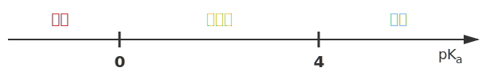

# 溶液行为

## 基本概念

### 电解质

电解质：在水溶液中**或**熔融状态下导电的**化合物**。

非电解质：在水溶液中**和**熔融状态下都不导电的**化合物**。

- 常见的电解质：酸、碱、盐、金属氧化物、水。

- 常见的非电解质：非金属氧化物（除了水）、$\ce{NH3}$、部分有机物。

- 注意，单质和混合物无权参与电解质和非电解质的分类。

导电能力的比较：

- 与离子浓度成正比。
- 与离子电荷量成正比。
- 与离子的摩尔质量成反比。

注意区分：能导电的物质有酸碱盐的水溶液、熔融的碱性氧化物、石墨和金属、$\ce{Fe(OH)3}$ 胶体。

强电解质：

- 在水中完全电离的电解质，称为强电解质。

- 常见的强电解质有：强酸、强碱、大部分盐、活泼金属氧化物（$\ce{Na2O,Na2O2,CaO}$）。

- 六大强酸：氢氯酸 $\ce{HCl}$、氢溴酸 $\ce{HBr}$、氢碘酸 $\ce{HI}$、硫酸 $\ce{H2SO4}$、硝酸 $\ce{HNO3}$、高氯酸 $\ce{HClO4}$。

- 高氯酸是自然界最强的含氧酸，详见原子周期律部分。

- 四大强碱：$\ce{KOH,NaOH,Ca(OH)2,Ba(OH)2}$。

弱电解质：

- 在水中不完全电离的电解质，称为弱电解质。

- 常见的弱电解质有：弱酸、弱碱、极少数盐（$\ce{HgCl2,HgCl,(CH3COO)2Pb}$ 醋酸铅）、不活泼金属氧化物、水。

- 要注意的是，氢氧化镁 $\ce{Mg(OH)2}$ 属于中强碱，其属于强电解质还是弱电解质有争议。

### 离子反应

反应的分类：

- 根据反应形式，分为：化合反应、分解反应、置换反应、复分解反应。

- 根据电子转移，分为：氧化还原反应、非氧化还原反应。

- 根据能量变化，分为：吸热反应、放热反应等。

离子反应：在水溶液中，有离子参与（生成或消耗）的反应，称为离子反应。

存在有复分解、氧化还原、水解等类型，其中复分解反应反应条件为：

生成物有难溶物质（沉淀）、挥发性物质（气体）、弱电解质（水、醋酸等）。

例如：

$$
\ce{CH3COONa + HCl = NaCl + CH3COOH}
$$

也是强酸制弱酸的体现。

离子反应方程式的书写四步法：

1. 写化学方程式。
2. 拆强酸强碱可溶盐（注意不溶的即使是强电解质也不能拆）。
3. 删掉左右相同的，系数最简。
4. 检查原子守恒、电荷守恒。

不可以拆的物质如：

- 难溶物质、弱电解质、气体、单质、氧化物。
- 浓硫酸不拆，浓硝酸、浓盐酸可以拆。
- 微溶物如氢氧化钙，做生成物不拆，反应物清拆浊不拆。

注意一定要符合客观事实。

### 电离常数

溶解平衡是一种关于化合物溶解的化学平衡。

- 溶解的固体可以是共价化合物或离子化合物，离子化合物会在溶于水时电离为离子。

- 我们此处只讲解离子化合物，离子化合物的溶解平衡也可以称为电离平衡。

对于一般的反应：

$$
\ce{A_xB_y(aq) <=> xA^y+ (aq) + yB^x+ (aq)}
$$

定义其达到平衡时电离常数：

$$
K_d=\dfrac{\con{A^y+}^x\con{B^x+}^y}{\con{A_xB_y}}
$$

特别的，如果该物质为固体不溶物，则定义其溶度积（这与活度有关，高中不考虑）。电离常数通常用于配合平衡，例如 $\ce{Fe^3+}$ 与 $\ce{CN-}$ 的平衡。

### 酸碱理论

酸碱电离理论（电离酸碱理论）：酸在水中能产生氢离子（$\ce{H+}$），碱在水中能产生氢氧根离子（$\ce{OH-}$）。该理论适用于水溶液，便于区分强酸/强碱与弱酸/弱碱。

$$
\ce{HCl -> H+ + Cl-}
$$

$$
\ce{NaOH -> Na+ + OH-}
$$

酸碱质子理论（质子酸碱理论）：酸被定义为质子（$\ce{H+}$）供体，碱为质子受体。该理论不局限于水溶液，可处理溶剂中发生的质子转移反应，并引入共轭酸-碱对的概念。

$$
\ce{HCl + H2O -> H3O+ + Cl-}
$$

$$
\ce{NH3 + H2O <=> NH4+ + OH-}
$$

酸碱电子理论（路易斯酸碱理论）：酸是电子对受纳体，碱是电子对给体。该理论范围最广，可解释不涉及质子转移的配位、加成反应等（如路易斯酸为空轨道或正电中心）。

$$
\ce{BF3 + :NH3 -> F3B-NH3}
$$

$$
\ce{Ag+ + :NH3 -> [Ag(NH3)]+}
$$

简要比较：酸碱电离理论只适用于水溶液的电离过程；酸碱质子理论扩展到所有质子转移反应；酸碱电子理论最通用，可描述所有以电子对相互作用为主的酸碱反应。

### 活度与盐效应

在高中阶段，我们计算平衡常数时，直接使用各物质的浓度。这实际上是基于一个“理想溶液”的模型。在理想溶液中，溶质分子之间、溶质与溶剂分子之间的相互作用力被忽略不计。

然而，在真实的、尤其是浓度较高的溶液中，离子间的相互作用力（吸引和排斥）变得不可忽略。这种相互作用会束缚离子的自由运动，使其表现出的“有效浓度”低于其实际浓度。为了修正这种偏差，我们引入了**活度**的概念。

- **活度**：可以理解为物质的“有效浓度”。活度 = 活度系数（$\gamma$）$\times$ 浓度（$c$）。

- **活度系数**（$\gamma$）：是衡量真实溶液偏离理想溶液程度的参数。对于稀溶液，离子间距大，相互作用弱，$\gamma$ 接近于 $1$，此时活度 $\approx$ 浓度，因此高中阶段使用浓度进行计算是合理的近似。但对于浓溶液，离子间作用增强，$\gamma$ 会显著偏离 $1$，此时必须使用活度才能准确描述化学平衡。

利用活度，我们可以解释盐效应：加入不含共同离子的“无关”盐类所产生的影响。

**盐效应**：在难溶电解质的饱和溶液中，加入一种不含有共同离子的强电解质（即惰性盐），导致难溶电解质溶解度增大的现象。核心原理是离子氛和活度的概念。

- 在纯水中，$\ce{AgCl}$ 溶解产生的 $\ce{Ag+}$ 和 $\ce{Cl-}$ 离子之间存在静电吸引力，这种吸引力会促使它们重新结合成 $\ce{AgCl}$ 沉淀。

- 当我们加入一种惰性盐，比如硝酸钾时，溶液中充满了大量的 $\ce{K+}$ 和 $\ce{NO3-}$ 离子。这些惰性离子会在 $\ce{Ag+}$ 和 $\ce{Cl-}$ 离子周围形成一个带相反电荷的“离子氛”。

- 这个离子氛部分地屏蔽了 $\ce{Ag+}$ 和 $\ce{Cl-}$ 之间的静电吸引力，使得它们结合成 $\ce{AgCl}$ 沉淀的趋势变弱了。从热力学角度看，惰性盐增加了溶液的离子强度，导致离子的活度系数减小。

- 溶度积常数 $K_{sp}$ 是由活度决定的，当活度系数 $\gamma$ 减小时，为了维持 $K_{sp}$ 不变，离子的摩尔浓度 $c$ 就必须增大，难溶电解质的溶解度增大。

注意：

- 盐效应通常比较微弱，远不如同离子效应显著。

- 盐效应与同离子效应的作用方向相反：同离子效应使溶解度降低，盐效应使溶解度升高。

- 当惰性盐浓度非常高时，可能会出现盐析效应，即盐离子与水分子大量水合，导致溶剂水减少，反而使溶质溶解度下降。这在高分子、蛋白质溶液中尤其明显。

## 弱电解质

### 水的电离

我们知道水是一种特殊的弱电解质：

$$
\ce{H2O + H2O <=> H3O+ + OH-}
$$

这称为水的自偶电离，可以理解为氢离子（仅仅是一个质子）太小，通常会和一个水分子结合，在高中阶段通常简写为：

$$
\ce{H2O(l) <=> H+(aq) + OH-(aq)};\quad\Delta H>0
$$

我们知道水作为纯液体，其浓度视为 $1$，可以得到**水的电离常数**：

$$
K_w=\con{H+}\con{OH-}
$$

在常温下 $K_w=\pu{1E-14}$，也就是说 $\con{H+}=\con{OH-}=\pu{1E-7}$。而在接近沸腾的水中，一般取 $\pu{E-12}$ 左右。

{ width="100%" }

在这一部分中，我们考虑六个经典问题（三个定性、两个定量和一个备注）：

1. **越热越电离**：温度越高，平衡正向移动，平衡常数增大，纯水中 $\con{H+},\con{OH-}$ 均增大，平衡常数仅仅是温度的函数。

2. **酸碱抑制水的电离**：加入酸或碱，温度不变、平衡常数不变，$\con{H+}$ 或 $\con{OH-}$ 增大但不抵消，平衡逆向移动。

3. **水解促进水的电离**：加入弱酸或弱碱对应的正盐，温度不变、平衡常数不变，氢离子或氢氧根被消耗，平衡逆向移动。

    注意：如果不是正盐，则同时会发生电离和水解，此时需要比较电离和水解的强弱。例如，对于 $\ce{NaHCO3}$，因为其水溶液呈碱性，故水解作用强于电离，故其会促进水的电离。

    对于酸式盐：若电离更强，则相当于酸，故会抑制水的电离，其水溶液呈酸性；若水解更强，则相当于盐，故会促进水的电离，其水溶液成碱性。

4. **质子守恒**：由水电离出的氢离子和氢氧根物质的量相等，故浓度相等。

5. **任何溶液中** $\con{H+}\cdot\con{OH-}=K_w$。

6. **备注**：溶液中的 $\ce{H+}/\ce{OH-}$ 与水电离出的氢离子和氢氧根物质的量不一定相等。此处会有一些计算题，但是我们放到 $\pH$ 定义之后再讲。

水的电离是很弱的，对于强酸、强碱的溶液，在不是很稀的情况下一般可以直接忽略水的电离对溶液的影响。即使是稀溶液，或者弱酸、弱碱的溶液，通常也会忽略水的电离所产生的影响。但是要注意，在极端情况下，仍然是要考虑水的电离的，这是一个常见错误。

### 溶液酸碱性

我们定义：

$$
\pH=-\lg[\ce{H+}]
$$

$$
\pOH=-\lg[\ce{OH-}]
$$

实际上，任何一个物理量的负对数都可以定义其的 $p$ 运算。

- 溶液的酸碱性的充要条件是 $\con{H+})$ 和 $\con{OH-}$ 的大小关系，因此只需要比较 $\pH$ 与 $\pOH$ 即可，纯水一定满足 $\pH=\pOH$。常温下纯水 $\pH=\pOH=7$，任意温度下任意溶液 $\pH+\pOH=pK_w$。

- 酸与酸溶液混合不一定是酸性，例如亚硫酸与氢硫酸溶液混合后发生归中反应

    $$
    \ce{H2SO3 + 2H2S -> 3S v + 3H2O}
    $$

    如果物质的量比例恰好为 $3:2$，则所得溶液接近中性。

在酸碱平衡中，常有两个问题：

- **稀释问题**：通常是加溶剂，配制成体积为原溶液若干倍的新溶液。

    对于强酸强碱溶液，在一定范围内，每稀释十倍，溶液 $\pH$ 加一或减一。

    对于弱酸弱碱溶液，因为溶液中存在未电离的分子，稀释过程中电离平衡正向移动，因此相同 $\pH$ 的弱酸稀释同样的倍数所得新溶液 $\pH$ 会比强酸小，同理弱碱稀释也会比强碱大。

    注意：**不过分**，当溶液接近中性后，再进行稀释，因为水的电离此时提供了大部分的氢离子，因此溶液 $\pH$ 只会趋近于 $7$。

- **混合问题**：等体积混合、一定体积比混合。

    不考虑发生其他反应，强酸与强酸混合、强碱与强碱混合，只需要用总的氢离子或氢氧根浓度加和，除以总体积即可。注意：有的题目中会明确指出体积不具有加和性，此时需要通过题目给出的方式求出混合后的体积，或者定性判断混合后的体积比体积加和小，如果没有提到可以默认具有加和性。

    注意：**抓主要矛盾**，强碱与强碱溶液混合，不应使用氢离子浓度加和，因为此时溶液中氢氧根浓度远大于氢离子浓度，而应当用主要的氢氧根浓度加和。

我们应该明确的几点：

- 若某溶液中由水电离出的氢离子浓度低于该温度下的纯水，则溶质对水的电离起抑制作用，溶质应当为酸或碱。

- 若某溶液中由水电离出的氢离子浓度高于该温度下的纯水，则溶质对水的电离起促进作用，溶质应当为弱酸或弱碱的盐。

- 某酸碱溶液常温下 $\pH$ 之和为 $14$，则对水的电离的抑制作用相同。

- 任何酸碱溶液，若 $\pH$ 相同，则不论强弱对水的电离的抑制作用相同。

**抓唯一**：升高温度，强酸溶液中 $\pH$ 基本不变，强碱溶液中 $\pOH$ 基本不变。

- 这一点经常与水的电离中第一个定量问题联合出题，即由水电离出的氢离子与氢氧根浓度相等，题目通常会将这个浓度作为已知量或待求量。

- 常温下，由水电离出的氢离子浓度为 $\pu{10^-11 mol/L}$，则由水电离出的氢氧根浓度也为 $\pu{10^-11 mol/L}$，因此溶质对水的电离有抑制作用，为酸或碱。若溶质为强酸，则氢氧根浓度近似等于后者，则氢离子浓度为 $\pu{10^-3 mol/L}$，溶液的 $\pH=3$；若溶质为强碱，则氢离子浓度近似等于前者，溶液的 $\pH=11$。

- 常温下，由水电离出的氢离子浓度为 $\pu{10^-3 mol/L}$，则由水电离出的氢氧根浓度也为 $\pu{10^-3 mol/L}$，因此溶质对水的电离有促进作用，为弱酸或弱碱的盐。若溶质为弱酸的正盐，则氢氧根浓度近似等于后者，则氢离子浓度为 $\pu{10^-11 mol/L}$，溶液的 $\pH=11$；若溶质为弱碱的正盐，则氢离子浓度近似等于前者，溶液的 $\pH=3$。

- 反过来，如果溶液中 $\pH=3$ 或 $\pH=11$，讨论溶质是强酸强碱还是弱酸或弱碱的盐，则水电离出的氢离子浓度为 $\pu{10^-3 mol/L}$ 或 $\pu{10^-11 mol/L}$。

注意：我们称一定浓度的溶液，指的是用一定物质的量的溶质加水配制成一定体积的溶液，例如在 $\ce{NaHCO3}$ 溶液中，应当有

$$
\con{CO3^2-}+\con{HCO3^-}+\con{H2CO3}=\con{Na+}
$$

这也称为物料守恒，我们将在三大守恒中详细解释。

### 酸碱的电离

我们知道 $K_a,K_b$ 仅和温度有关，即仅仅是温度的函数，因为电离吸热，因此温度越高电离常数越小，电离度越小，我们会在图像和趋势部分详细说明。

<div class="grid cards" markdown>

- 对于一元弱酸的电离：

    $$
    \ce{HA <=> H+ + A-}
    $$

    定义其电离平衡常数：

    $$
    K_a=\dfrac{\con{H+}\con{A-}}{\con{HA}}
    $$

    在某一溶液中：

    $$
    \pH=pK_a+\lg\dfrac{\con{A-}}{\con{HA}}
    $$

    其中 $pK_a$ 反应了这种弱酸内在酸性的强弱，与该溶液的 $\pH$ 无关。

- 对于一元弱碱的电离：

    $$
    \ce{BOH <=> B+ + OH-}
    $$

    定义其电离平衡常数：

    $$
    K_b=\dfrac{\con{B+}\con{OH-}}{\con{BOH}}
    $$

    在某一溶液中：

    $$
    \pOH=pK_b+\lg\dfrac{\con{B+}}{\con{BOH}}
    $$

    其中 $pK_b$ 反应了这种弱碱内在碱性的强弱，与该溶液的 $\pH$ 无关。

</div>

亨德森—哈塞尔巴尔赫方程的推导：

$$
\begin{aligned}
\pH&=-\lg\con{H+}\\
&=-\lg\paren{\dfrac{\con{H+}\con{A-}}{\con{HA}}\cdot\dfrac{\con{HA}}{\con{A-}}}\\
&=pK_a+\lg\dfrac{\con{A-}}{\con{HA}}
\end{aligned}
$$

对于弱碱 $\ce{BOH}$ 也进行类似的操作即可。

{ width="100%" }

- 这种两种含有相同离子的盐（或酸、碱）溶于水时，它们的溶解度都会降低，这种现象叫做**同离子效应**，其本质是平衡的移动。

- 电离平衡右移，电解质分子的浓度不一定减小（加入醋酸），离子的浓度也不一定增大（加入与离子反应的物质）。

- 电离平衡右移，电离程度不一定增大（加入醋酸）。

我们知道 $K_a$ 越大酸性越强，但是 $pK_a$ 越小。

{ width="90%" }

|    酸    |      化学式       |  $pK_a$  |     |   酸   |    化学式     | $pK_a$ |
| :------: | :---------------: | :------: | --- | :----: | :-----------: | :----: |
| *氟锑酸* |   $\ce{HSbF6}$    | $-25.00$ |     |  磷酸  | $\ce{H3PO4}$  | $2.12$ |
|  *魔酸*  | $\ce{FSO3H-SbF5}$ | $-19.20$ |     | 柠檬酸 | $\ce{C6H8O7}$ | $3.09$ |
|  高氯酸  |   $\ce{HClO4}$    | $-10.00$ |     |  碳酸  | $\ce{H2CO3}$  | $6.35$ |
|   盐酸   |    $\ce{HCl}$     | $-8.00$  |     | 硫化氢 |  $\ce{H2S}$   | $7.00$ |
|   硫酸   |   $\ce{H2SO4}$    | $-3.00$  |     | 次氯酸 |  $\ce{HOCl}$  | $7.50$ |
|   硝酸   |    $\ce{HNO3}$    | $-2.00$  |     |   水   |  $\ce{H2O}$   |  $14$  |

- 多元弱酸分步电离，以 $\ce{H2A}$ 为例：

    $$
    \ce{H2A <=> H+ + HA-};\quad K_{a1}=\dfrac{\con{H+}\con{HA-}}{\con{H2A}}
    $$

    $$
    \ce{HA- <=> H+ + A^2-};\quad K_{a2}=\dfrac{\con{H+}\con{A^2-}}{\con{HA-}}
    $$

    对于 $n$ 元弱酸，一般各级电离越来越弱，即

    $$
    K_{a1}\gg K_{a2}>K_{a3}>\dots>K_{an}
    $$

    因此一般只需要考虑一级电离即可。

- 多元弱碱一步电离，以 $\ce{B(OH)2}$ 为例：

    $$
    \ce{B(OH)2 <=> B^2+ + 2OH-};\quad K_b=\dfrac{\con{B^2+}\con{OH-}^2}{\con{B(OH)2}}
    $$

    实际上其电离过程也分为多步，只不过高中阶段视为一步。

- 注意：对于 $\ce{H2A -> HA- -> A^2-}$，除了均为完全反应、均为可逆反应外，还存在第一步完全、第二步可逆的情况，此时溶液中 $\ce{H2A}$ 电离完全，仅需要考虑后一步的平衡即可。

例题：常温下，$\pH=a$ 的稀盐酸（$\ce{HCl}$）与 $\pH=b$ 的氨水（$\ce{NH3*H2O}$）等体积混合，恰好完全反应，问 $\alpha(\ce{NH3*H2O})$。

我们知道，对于 $\pH=a$ 的稀盐酸，其氢离子浓度为 $10^{-a}\space\pu{mol/L}$，因为氨水可以看作氨气溶于水，氨气与氯化氢的反应是 $1:1$ 的，因此氨水的浓度也为 $10^{-a}\space\pu{mol/L}$，而氨水的 $\pH=b$ 也就是说 $\pOH=b-14$，列出方程

$$
\begin{aligned}
\con{OH-}&=\alpha(\ce{NH3*H2O})\con{NH3*H2O}\\
10^{b-14}&=\alpha(\ce{NH3*H2O})\cdot10^{-a}
\end{aligned}
$$

因此

$$
\alpha(\ce{NH3*H2O})=10^{a+b-14}
$$

电离度 $\alpha$：电离平衡的转化率，以反应

$$
\ce{HAc <=> H+ + Ac-}
$$

为例，设其平衡常数：

$$
K_a=\dfrac{\con{H+}\con{Ac-}}{\con{HAc}}
$$

设转化率为 $\alpha$，醋酸浓度为 $c$，则转化了 $c\alpha$，因此

$$
K_a=\dfrac{c^2\alpha^2}{c-c\alpha}
$$

因为电离度 $\alpha$ 很小，我们取 $c\approx c-c\alpha$，则

$$
K_a\approx c\alpha^2
$$

因此也有

$$
\alpha\approx\sqrt{\dfrac{K_a}{c}}
$$

这可以推广到各种反应程度很低的反应。

### 盐类的水解

在酸碱质子理论中，酸是质子的给予体，碱是质子的接受体。从这个角度看，盐类水解并非一个独立的新概念。所谓弱酸根离子的水解，本质上就是它作为一种碱（共轭碱）与水发生的酸碱反应。

我们在试验中发现，氯化铵、醋酸钠等盐的水溶液不成中性，这类盐不能提供氢离子、氢氧根，但是却可以接受氢离子、氢氧根。我们定义这种盐电离出的离子，与水电离出的氢离子、氢氧根结合，生成弱电解质的过程，为盐类的水解。因此，盐的水解能促进水的电离。

水解通常是微弱的、可逆的，多元弱酸根分布水解，多元弱碱阳离子一步水解（实际上也是多步，但是通常可以忽略不计，因此高中阶段没有特殊说明，默认弱碱相关的电离和水解都是一步完成的）。

在盐类的水解中有以下几句口诀：有弱才水解、无弱不水解、双弱双水解、越弱越水解、越热越水解、越稀越水解，具体来说，

1. 谁强显谁性：强酸强碱盐显中性，强酸弱碱盐显酸性，弱酸强碱盐显碱性。

2. 越弱越水解：比较酸碱性强弱，等温等浓度，测量正盐水溶液的 $\pH$。

3. 越热越水解：水解是酸碱中和的逆过程，中和是放热的，水解是吸热的，温度越高水解越完全。

4. 越稀越水解：冲稀过程中，水解程度加大，但是酸、碱性变弱，此时应当考虑水的电离。

双水解：当阴阳离子都能水解时，两人分别结合水电离出的氢离子和氢氧根，互相促进，水解程度加大；如果水解产物可以脱离溶液环境（例如沉淀、气体），那么称为互促完全双水解。利用互促完全双水解，我们可以实现一些除杂的操作，同时也可以出现一些离子共存、蒸干产物问题。

双水解的常见应用有，氢氧化铁胶体的制备（铁 III 离子的水解）、明矾净水（铝离子的水解）、碱洗去油污加热促进水解，同时还有一些注意事项例如，铵态氮肥与石灰不能同时施用，碳酸钠溶液不能用磨口玻璃塞，硫酸铁溶液加入稀硫酸防水解，制备一定浓度的氯化铝溶液要混合盐酸等。

在蒸干问题上，例如碳酸氢钠蒸干得到碳酸钠固体（自身热稳定性差，受热易分解）、亚硫酸钠蒸干混有硫酸钠（自身易被空气中的氧气氧化）、氯化镁蒸干得到氢氧化镁（水解变质），至于氯化镁晶体的制备，我们通常会在氯化氢氛围内蒸干，抑制其水解。

盐的水溶液 $\pH$ 比较：比较对应酸或碱的强弱，例如

$$
\ce{A- + H2O <=> HA + OH-};\quad K_h=\dfrac{\con{HA}\con{OH-}}{\con{A-}}
$$

可以看为一元弱碱，那么就有 $\ce{Na2CO3} > \ce{NaHCO3} > \ce{CH3COONa}$。

特别注意的是，高价过渡金属在水溶液中一般不以简单离子形态存在，通常会以完全水解或者部分水解的形式存在。

### 沉淀溶解平衡

离子积，是沉淀的反应商，用符号 $Q_c$ 表示。对于难溶盐 $\ce{A_xB_y}$ 的电离：

$$
\ce{A_xB_y(s) <=> xA^y+ + yB^x+}
$$

定义一个状态时的离子积：

$$
Q_c=\con{A^y+}^x\con{B^x+}^y
$$

离子积是沉淀溶解的一个状态，不能反应该沉淀的性质。而溶度积，是沉淀的溶解平衡常数，用符号 $K_{sp}$ 表示。

对于难溶盐，定义其溶度积为其电离平衡时的离子积（平衡常数）：

$$
K_{sp}=\con{A^y+}^x\con{B^x+}^y
$$

在温度一定时，每一难溶盐类化合物的 $K_{sp}$ 皆为一特定值。溶度积的大小反映了**难溶电解质**的溶解能力，可用实验方法测定。溶度积常数仅适用于难溶电解质的**饱和溶液**，对易溶的电解质不适用。

难溶盐的电离平衡：

- 当 $Q_c<K_{sp}$ 时：平衡向右移动，电离出离子。

- 当 $Q_c=K_{sp}$ 时：达到平衡状态，为动态平衡。

- 当 $Q_c>K_{sp}$ 时：平衡向左移动，产生出沉淀。

沉淀溶解平衡，是在溶液行为中一个较为特殊的存在：

1. 沉淀溶解平衡方程式要写聚集状态，尤其是沉淀要用 $(s)$ 固体注明，但是如果判断题中没有写，一般也不会算错。

2. 固体和溶液同时存在时，才会有沉淀溶解平衡。其截止点为饱和溶液，低于截止点则倾向于完全电离。

3. **同离子效应**：例如 $\ce{CaCO3}$ 在 $\ce{CaCl2}$ 或 $\ce{Na2CO3}$ 溶液中，溶解度降低。

4. 大部分沉淀溶解平衡 $\Delta H>0$，越热越溶解。经典的反例是 $\ce{Ca(OH)2}$ 越热越不易溶解。溶解度定义是：每 $\pu{100g}$ 溶剂（通常是水）中最多可以溶解的溶质的质量。

5. 溶度积常数 $K_{sp}$ 仅是温度 $T$ 的函数。$K_{sp}$ 越大，溶解度不一定越大。两难溶物类型一样，以 $\pu{mol/L}$ 为单位的溶解度与 $K_{sp}$ 成正相关。

6. 以 $\ce{CaCO3}$ 为例，沉淀溶解平衡时，$\con{Ca^2+}$ 略大于 $\con{CO3^2-}$，因为 $\ce{CO3^2-}$ 会水解。

沉淀的产生和溶解：

1. 沉淀产生的条件是 $Q_c>K_{sp}$。

2. 沉淀溶解以 $\ce{CaCO3}$ 为例，溶解出 $\ce{CO3^2-}$ 与加入的盐酸反应，沉淀溶解平衡正向移动，沉淀溶解。

3. 强制弱的反例 $\ce{CuSO4 + H2S -> CuS + H2SO4}$ 是因为 $\ce{CuS}$ 的 $K_{sp}$ 极小，氢离子无法从中抢夺生成 $\ce{HS-}$，故无法溶解。加入稀硝酸，将硫氧化后可以溶解。

4. **沉淀优先问题**：类型一样比较 $K_{sp}$，类型不一样通过计算比较。沉淀的顺序与 $K_{sp}$、类型、离子浓度都是有关的，必须要全部确定才可以得出沉淀顺序。总的来说，先达到 $K_{sp}$ 先沉，浓度差异不大的情况下 $K_{sp}$ 小的先沉。

5. **沉淀转化问题**：到达另一沉淀的 $K_{sp}$ 后沉淀转化，在浓度差别不大的情况下，溶解度大的可以转化为溶解度小的，即 $K_{sp}$ 大的可以转化为 $K_{sp}$ 小的。

6. **沉淀完全问题**：规定离子浓度小于 $\pu{E-5 mol/L}$ 即为沉淀完全。将这个值带入 $K_{sp}$ 得到另一离子浓度即为最少加入的浓度。

7. **分布沉淀问题**：规定先沉的已经沉淀完全，后沉的未开始沉淀，则为分布沉淀。将 $\pu{E-5 mol/L}$ 带入某一沉淀 $K_{sp}$，算出离子浓度后带入另一离子，判断浓度是否满足未沉淀即可。

经典应用：分离铁、铜离子，加入氧化铜、氢氧化铁、碳酸铜等，增加铜离子浓度，使铜离子先沉淀；或者将亚铁离子氧化为铁离子，然后调节 $\pH$ 使其分布沉淀。

制备过渡金属碳酸盐：直接加入碳酸钠溶液中，则可能会因为碱性过强产生金属氢氧化物沉淀；因此通常与碳酸氢铵反应，应当为将碳酸氢铵稀溶液逐滴加入金属阳离子的盐溶液中，并不断搅拌。

### 类盐的水解

在「盐类的水解」一节中，我们讨论的是常见的酸碱盐水解。而**类盐**（salt-like compounds）是由活泼金属阳离子与非金属多原子阴离子形成的化合物，其水解行为更为剧烈，产物也更加丰富。

类盐水解的本质是**强碱性阴离子夺取水分子中的质子**，生成对应的氢化物或烃类气体，同时金属阳离子与 $\ce{OH-}$ 结合形成氢氧化物。这与普通盐类水解（弱酸根/弱碱阳离子的部分水解）在反应程度上有本质区别——类盐水解通常是**彻底的、不可逆的**，因为产物（气体逸出、沉淀生成）脱离了溶液体系，推动反应向右进行。

#### 类盐的分类体系

类盐按阴离子种类可分为以下几类：

- **碳化物**（$\ce{C2^2-}$、$\ce{C^4-}$、$\ce{C3^4-}$）：如 $\ce{CaC2}$、$\ce{Al4C3}$、$\ce{Mg2C3}$

- **氮化物**（$\ce{N^3-}$）：如 $\ce{Mg3N2}$、$\ce{Li3N}$

- **磷化物**（$\ce{P^3-}$）：如 $\ce{Ca3P2}$、$\ce{AlP}$

- **硅化物**（$\ce{Si^4-}$）：如 $\ce{Mg2Si}$

- **硫化物**（$\ce{S^2-}$）：如 $\ce{Na2S}$、$\ce{Al2S3}$

- **氢化物**（$\ce{H-}$）：如 $\ce{NaH}$、$\ce{CaH2}$（特殊，见下文）

#### 碳化物的水解

碳化物是类盐水解中最典型的一类。根据碳阴离子的骨架结构，碳化物水解产物各不相同：

1. **乙炔型碳化物**（$\ce{C2^2-}$）：晶体中两个碳以三键相连，水解时夺取两个 $\ce{H+}$，三键完整保留，生成乙炔。

    $$
    \ce{CaC2 + 2H2O -> CH#CH ^ + Ca(OH)2}
    $$

    其他代表物：$\ce{BaC2}$、$\ce{SrC2}$、$\ce{Na2C2}$。反应放热，$\Delta H \approx \pu{-120 kJ/mol}$。

2. **甲烷型碳化物**（$\ce{C^4-}$）：碳以孤立的单碳阴离子存在，夺取四个 $\ce{H+}$，生成甲烷。

    $$
    \ce{Al4C3 + 12H2O -> 4Al(OH)3 v + 3CH4 ^}
    $$

    其他代表物：$\ce{Be2C}$。这是实验室制取极纯甲烷的方法之一。

3. **丙二烯型碳化物**（$\ce{C3^4-}$）：三个碳原子形成累积双键骨架，夺取四个 $\ce{H+}$，生成丙二烯。

    $$
    \ce{Mg2C3 + 4H2O -> 2Mg(OH)2 v + C3H4 ^}
    $$

判断碳化物类型的规律：看碳阴离子的骨架结构——**骨架不变**，水解时只加氢，不断键。

#### 氮化物的水解

氮化物中氮以 $\ce{N^3-}$ 形式存在，夺取三个 $\ce{H+}$，生成氨气：

$$
\ce{Mg3N2 + 6H2O -> 3Mg(OH)2 v + 2NH3 ^}
$$

实验现象：产生刺激性气味气体，溶液变浑浊（$\ce{Mg(OH)2}$ 难溶），可用湿润红色石蕊试纸检验（变蓝）。

生活应用：镁条在空气中燃烧时，除与氧气反应外，还与氮气反应生成 $\ce{Mg3N2}$，加水后会闻到氨味。

#### 磷化物的水解

磷化物中磷以 $\ce{P^3-}$ 形式存在，夺取三个 $\ce{H+}$，生成磷化氢：

$$
\ce{Ca3P2 + 6H2O -> 3Ca(OH)2 v + 2PH3 ^}
$$

$$
\ce{AlP + 3H2O -> Al(OH)3 v + PH3 ^}
$$

$\ce{PH3}$ 是剧毒气体，有蒜臭味。磷化铝是常用的粮仓熏蒸杀虫剂，吸收空气中水分后缓慢释放 $\ce{PH3}$ 杀死害虫。

#### 硅化物的水解

硅化物中硅以 $\ce{Si^4-}$ 形式存在，夺取四个 $\ce{H+}$，生成硅烷：

$$
\ce{Mg2Si + 4HCl -> 2MgCl2 + SiH4 ^}
$$

硅烷（$\ce{SiH4}$）是一种在空气中会**自燃**的气体，水面上冒出气泡并伴随轻微爆鸣和火光。硅烷是半导体工业的重要原料。

#### 硫化物的水解

普通硫化物如 $\ce{Na2S}$ 溶于水只是部分水解（溶液显碱性）。但当 $\ce{S^2-}$ 遇到易水解的金属阳离子（如 $\ce{Al^3+}$）时，发生彻底的互促双水解：

$$
\ce{Al2S3 + 6H2O -> 2Al(OH)3 v + 3H2S ^}
$$

这是一个典型的彻底双水解反应，生成沉淀和臭鸡蛋气味气体。因此**硫化铝不能在水溶液中制备**，只能通过干法合成。

#### 离子型氢化物的水解（特殊情形）

离子型氢化物（如 $\ce{NaH}$、$\ce{CaH2}$）的水解是类盐水解中的**特例**——它打破了「价态守恒（非氧化还原）」的规律。

在离子型氢化物中，活泼金属迫使氢原子接受电子，氢显 $-1$ 价（$\ce{H-}$，氢负离子）。遇水时，$-1$ 价的 $\ce{H-}$ 与水中 $+1$ 价的 $\ce{H+}$ 发生**归中反应**（氧化还原反应），生成 $0$ 价的氢气：

$$
\ce{CaH2 + 2H2O -> Ca(OH)2 + 2H2 ^}
$$

$$
\ce{NaH + H2O -> NaOH + H2 ^}
$$

$\ce{CaH2}$ 反应剧烈且释放大量氢气，在野外常被用作便携式氢气发生剂；$\ce{CaH2}$ 和 $\ce{NaH}$ 也是有机化学实验室中常用的强力干燥剂。

#### 水解产物的判断规律

面对一个不认识的「活泼金属 $+$ 非金属」二元化合物（通式 $\ce{A_xB_y}$），判断其水解产物只需三步：

1. **标化合价**：确定非金属元素 $\ce{B}$ 的负化合价（假设为 $-n$ 价）。

2. **配质子**：让非金属 $\ce{B}$ 结合 $n$ 个来自水的 $\ce{H+}$，写出气体产物 $\ce{BH_n}$。

3. **剩金属**：金属 $\ce{A}$ 和水剩下的 $\ce{OH-}$ 结合，写出 $\ce{A(OH)_m}$。

4. 检查是否为氢化物：如果是离子型氢化物，则生成氢气 $\ce{H2}$。

这一判断方法的核心原理来自酸碱质子理论：非金属阴离子对应的共轭酸（如 $\ce{NH3}$、$\ce{PH3}$、$\ce{CH4}$）酸性极其微弱，因此这些阴离子是「超级强碱」，在水中会极其强烈地夺取水分子中的 $\ce{H+}$。

## 做题方法

### 三大守恒

离子浓度大小问题，分为定性和定量两种，定性的以电中性（电荷守恒）、原子守恒（物料守恒），及其推演出来的质子守恒为基础；定量的，最简单的是由酸碱性推断 $\ce{H+},\ce{OH-}$ 的浓度大小，然后在程序上，通过三大守恒的思想，进行进一步判断。

质子守恒：

{ width="90%" }

三大守恒式及其书写：

- 电荷守恒：溶液呈电中性，溶液中所有阳离子所带的正电荷总数等于所有阴离子所带的负电荷总数。

    电荷守恒的书写是最简单的一种，其核心是要找到溶液中所有的离子，尤其不能忘记氢离子、氢氧根。然后将阳离子、阴离子分成两边，用对应电荷数（的绝对值）最为系数，相加浓度之和相等。

- 物料守恒（原子守恒）：特定原子（或原子团）的物质的量在反应前后保持不变。

    物料守恒的书写稍微有一些难度，应当注意的是，有的时候不一定能写出来物料守恒，这种情况下，如果题目再去判断浓度关系式，除了电荷守恒以外，这种通常是错误的。

    物料守恒的重点在于，不一定只有原子、元素可以守恒，原子团也可以例如醋酸根。同时，我们经常写出来的是一个比例式，是根据电离后，某些弱电解质还会水解或继续电离，此时两个物质大概率是两个物质，根据混合比例求出，当然也可以是一个物质中的固有比例。

- 质子守恒：溶液中由水电离出的 $\ce{H+}$ 和 $\ce{OH-}$ 浓度相等，或者酸失去的质子等于碱得到的质子。

    质子守恒是最高级的守恒，但是某种意义上，可以通过电荷守恒和物料守恒推导出质子守恒，只需要将与氢氧元素无关的离子，例如钠离子、铝离子，消去即可。

    更高级的质子守恒写法是，直接根据 $\ce{H+}$，减去每产生某种物质消耗多少，加上每产生某种物质产生多少，等于 $\ce{OH-}$ 即水电离的，直接写出质子守恒。

三大守恒除了在离子浓度大小和关系比较外，还有一些有趣的用处，下面给出一些经典例题：

- 向 $\ce{NH4HSO4}$ 溶液中加入 $\ce{NaOH}$ 至中性，问离子浓度大小顺序。我们发现很难直接得出，于是我们考虑构建一种中介状态，即若等物质的量混合，我们发现应该有：

    $$
    \con{Na+} = \con{SO4^2-} > \con{NH4+} > \con{H+} > \con{OH-}
    $$

    此时溶液是显酸性的，为了让他显碱性，我们再稍微加一点（此时酸性不会很强）氢氧化钠，于是便可以写出：

    $$
    \con{Na+} > \con{SO4^2-} > \ce{NH4+} > \con{H+} = \con{OH-}
    $$

    注意，此时应当假设溶液没有过稀，即除了氢离子、氢氧根，离子浓度都应当在 $10^{-5}$ 以上，反例是如果离子浓度都是 $10^{-9}$ 这种极端数据，显然氢离子、氢氧根应当是最多的。

- 等体积等浓度的 $\ce{NaCl}$ 和 $\ce{NaF}$ 溶液中，总的离子浓度大小关系？我们列出电荷守恒：

    $$
    \con{Na+} + \con{H+} = \con{F-} + \con{OH-}
    $$

    $$
    \con{Na+} + \con{H+} = \con{Cl-} + \con{OH-}
    $$

    我们发现溶液中的总离子浓度，就是左边加上右边，那么也就是左边的两倍，因为 $\con{Na+}$ 是一样的，因此只需要比较 $\con{H+}$ 就可以了。因为 $\ce{NaF}$ 是强碱弱酸盐，溶液显碱性，氢离子浓度小，所以 $\ce{NaF}$ 溶液中总离子浓度小于 $\ce{NaCl}$ 溶液。

- 在 $\pu{25^oC}$ 时将 $\pu{0.02 mol/L}$ 的氢氰酸和 $\pu{0.01 mol/L}$ 的氢氧化钠溶液等体积混合，混合溶液 $\pH=9$ 问 $K_a(\ce{HCN})$。我们发现题设情景相当于等体积等浓度（$\pu{0.005 mol/L}$）的氢氰酸、氰化钠溶液混合，那么总的 $\con{Na+}=\pu{0.005 mol/L}$，列出三大守恒：

    $$
    \con{HCN} + \con{CN-} = 2\con{Na+}
    $$

    $$
    \con{H+} + \con{Na+} = \con{OH-} + \con{CN-}
    $$

    $$
    \con{H+} + \dfrac{\con{HCN}-\con{CN-}}{2} = \con{OH-}
    $$

    带入钠离子浓度即可解出求 $K_a$ 所需的浓度。

### 浓度大小比较

离子浓度、微粒浓度大小的比较，尤其是氢离子和氢氧根浓度的大小（也就是酸碱性）的比较问题，通常涉及定性判断和定量判断，一般来说，可以先用定性确定大部分离子的浓度大小关系。

在大部分简单题中，甚至是不需要定量判断的（也可能是不会给数据），但是一些较难的题，可能会给出数据，有一些是根据数据计算才能判断大小，而还会有一些题，是根据计算会得出与我们一般定性方法不同的结论，这种情况下需要按照题目所给出的数据来。总的来说，标准就是如果给了数据就一定要带进去算一下一些经典的数值，尤其是一些数据看起来和平时做题遇到的数值，在量级上面有很大差异的。

首先，我们以一般的 $\ce{NaHA}$ 为例，首先我们要讨论酸 $\ce{H2A}$ 的类型：

- 如果 $\ce{H2A}$ 是二元强酸：那么 $\ce{NaHA}$ 只会电离出 $\ce{H+}$，因此相当于一元强酸，溶液显酸性、抑制水的电离。

- 如果 $\ce{H2A}$ 第一级电离完全，第二级电离可逆（或者说 $\ce{H2A}$ 是强酸 $\ce{HA-}$ 是弱酸），那么与上面的类似，它会几乎完全电离产生 $\ce{H+}$ 和 $\ce{A-}$，溶液显酸性。

- 如果 $\ce{H2A}$ 是经典的二元弱酸，那么我们考虑下面两个过程：

    $$
    \ce{HA- <=> H+ + A^2-};\quad K_{a2}
    $$

    $$
    \ce{HA- + H2O <=> OH- + H2A};\quad K_{h2}
    $$

    那么，只需要判断这两个平衡常数的大小关系即可，也就是说我们可以判断 $K_{a1}\cdot K_{a2}$ 和 $\ce{K_w}$ 的大小关系，如果 $K_{a1}\cdot K_{a2}>K_w$ 那么显酸性，否则显碱性。

    常见的显酸性的盐有 $\ce{NaHSO3},\ce{NaHC2O4},\ce{NaH2PO4}$，显碱性的物质有 $\ce{NaHCO3},\ce{NaHS},\ce{Na2HPO4}$，特别的，对于磷酸这样的三元酸，我们考虑这三步电离和水解：

    $$
    \ce{H3PO4 <=>[$K_{a1}$][$K_{h3}$] H2PO4- <=>[$K_{a2}$][$K_{h2}$] HPO4^2- <=>[$K_{a3}$][$K_{h1}$] PO4^3-}
    $$

将 $\ce{HA,NaA}$ 等体积混合，如果 $\ce{HA}$ 是弱酸，那么考虑下面两个反应：

$$
\ce{HA <=> H+ + A-};\quad K_a
$$

$$
\ce{A- + H2O <=> HA + OH-};\quad K_h
$$

因此，如果 $K_a^2>Kw$ 则显酸性，否则显碱性。大部分弱酸在这个情境下，都是显酸性的，显碱性的常见酸是 $\ce{HCN}$ 氢氰酸。

对于一般的定性问题，我们认为强酸比弱酸更酸，强碱比弱碱更碱；多元酸比一元酸更强，且元数越多酸性越强；还有如下近似，电离通常比水解更强，即酸总比强酸弱碱盐更酸（实际上这确实是不准确的）、碱总比强碱弱酸盐更碱。

我们有下面的顺序，等体积、等浓度 $\pH$ 由大到小排序（第三行是相等）：

$$
\begin{array}{rrrr}
\ce{H2SO4} & \ce{HCl} & \ce{HAc} \\[0.5em]
\ce{(NH4)2SO4} & \ce{NH4Cl} \\[0.5em]
\ce{Na2SO4} & \ce{NaCl} \\[0.5em]
\ce{NaAc} & \ce{NaHCO3} & \ce{NaClO} & \ce{Na2CO3} \\[0.5em]
\ce{NH3`H2O} & \ce{NaOH} & \ce{Ba(OH)2}
\end{array}
$$

在此之后，我们如果想要定量判断，就需要用到三大守恒。例如，我们设想向醋酸钠溶液中不断加入氢氧化钠固体，问溶液离子浓度的变化趋势：

$$
\begin{array}{r|l}
\con{Na+} > \con{AC-} > \con{OH-} > \con{H+} & \downarrow \\[0.5em]
\con{Na+} > \con{AC-} = \con{OH-} > \con{H+} & \downarrow \\[0.5em]
\con{Na+} > \con{OH-} > \con{AC-} > \con{H+} & \downarrow \\[0.5em]
\con{Na+} = \con{OH-} > \con{AC-} = \con{H+} & \downarrow \\[0.5em]
\con{OH-} > \con{Na+} > \con{H+} > \con{AC-}
\end{array}
$$

最后溶液会无限趋近于 *纯* 的氢氧化钠溶液，因此最后一个一定是氢氧化钠溶液的离子浓度大小顺序（再加上无限小的醋酸根）。

我们运用定性的方法，并结合“等效”和“守恒”思想，来分析混合溶液中的粒子浓度大小。核心步骤如下：

1. **等效思想（先反应）**：判断混合时是否发生反应。如果发生，先假设反应完全，确定反应后的主要溶质。将复杂的“混合问题”等效转换为“单一溶液”或“缓冲溶液”问题。

2. **守恒思想（后分析）**：利用电荷守恒、物料守恒、质子守恒建立各粒子浓度之间的等量关系。

3. **定性判断（贯穿始终）**：根据弱电解质的电离、盐类的水解是微弱的，以及题目给出的酸碱性信息（$\pH > 7$ 或 $\pH < 7$）来进行大小的粗略和精细判断。

```md {admonition="note" title="将 $\pH=12$ 的氨水与 $\pH=2$ 的盐酸溶液等体积混合"}
**第一步：等效转换**

- **氨水**：$\pH=12$，是弱碱溶液，说明 $\con{OH-} = \pu{E-2 mol/L}$。因为氨水是弱碱，电离微弱，故原始浓度 $\con{NH3*H2O} \gg \pu{E-2 mol/L}$。

- **盐酸**：$\pH=2$，是强酸溶液，说明 $\con{H+} = \con{HCl} = \pu{E-2 mol/L}$。

- **混合反应**：

    $$
    \ce{NH3*H2O + HCl -> NH4Cl + H2O}
    $$

    由于 $\con{NH3*H2O} \gg \con{HCl}$，等体积混合时，**氨水过量**。

- **反应后溶质**：反应消耗了全部的 $\ce{HCl}$，生成了等量的 $\ce{NH4Cl}$，同时还有大量剩余的 $\ce{NH3*H2O}$。因此，混合后的溶液等效于一个 **$\ce{NH3*H2O}$ 和 $\ce{NH4Cl}$ 的混合溶液**，且 $\con{NH3*H2O} \gg \con{NH4Cl}$。这是一个碱性缓冲溶液。

**第二步：守恒与定性分析**

- **溶液中所有粒子**：$\ce{NH3*H2O}$ (分子)、$\ce{NH4+}$、$\ce{Cl-}$、$\ce{OH-}$、$\ce{H+}$。

- **浓度排序**：
    1. **最大浓度**：$\con{NH3*H2O}$。因为氨水大量过量，是体系中最主要的。

    2. **比较 $\con{NH4+}$ 和 $\con{Cl-}$**：$\ce{Cl-}$ 完全来自于 $\ce{HCl}$，混合后浓度稀释一半，为 $\pu{0.5E-2 mol/L}$。$\ce{NH4+}$ 主要来自于反应生成的 $\ce{NH4Cl}$，其量与消耗的 $\ce{HCl}$ 相等。因此，$\con{NH4+} \approx \con{Cl-}$。
        - **精细比较**：利用**电荷守恒**：$\con{NH4+} + \con{H+} = \con{Cl-} + \con{OH-}$。
        - 因为溶液氨水过量，呈碱性，所以 $\con{OH-} > \con{H+}$。
        - 移项得：$\con{NH4+} - \con{Cl-} = \con{OH-} - \con{H+} > 0$。
        - 因此，**$\con{NH4+} > \con{Cl-}$**，尽管二者非常接近。

    3. **比较 $\con{Cl-}$ 和 $\con{OH-}$**：$\con{Cl-} = \pu{0.5E-2 mol/L}$。混合后是碱性缓冲液，$\pH$ 比 $12$ 降低，但仍是强碱性（例如 $\pH \approx 10$），所以 $\con{OH-}$ 远小于 $\pu{E-2 mol/L}$。因此，**$\con{Cl-} > \con{OH-}$**。

    4. **比较 $\con{OH-}$ 和 $\con{H+}$**：溶液呈碱性，**$\con{OH-} > \con{H+}$**。

**结论**：

$$
\con{NH3*H2O} > \con{NH4+} > \con{Cl-} > \con{OH-} > \con{H+}
$$
```

```md {admonition="note" title="将 $\pu{0.2 mol/L}$ 的 $\ce{NH4NO3}$ 溶液与 $\pu{0.1 mol/L}$ 的 $\ce{NaOH}$ 溶液等体积混合（$\pH > 7$）"}
**第一步：等效转换**

- **混合反应**：

    $$
    \ce{NH4+ + OH- -> NH3*H2O}
    $$

- **物质的量**：等体积 $V$ 混合，$n(\ce{NH4+}) = 0.2V$，$n(\ce{OH-}) = 0.1V$。$\ce{OH-}$ 是少量，完全反应。

- **反应后**：
    - 生成的 $n(\ce{NH3*H2O}) = 0.1V$
    - 剩余的 $n(\ce{NH4+}) = 0.2V - 0.1V = 0.1V$
    - 未参与反应的 $n(\ce{NO3-}) = 0.2V$ 和 $n(\ce{Na+}) = 0.1V$

- **等效溶液**：混合后总体积为 $2V$，溶液等效于 **$\pu{0.05 mol/L}$ $\ce{NH3*H2O}$、$\pu{0.05 mol/L}$ $\ce{NH4NO3}$ 和 $\pu{0.05 mol/L}$ $\ce{NaNO3}$ 的混合溶液**。这是一个 $\con{NH3*H2O} \approx \con{NH4+}$ 的缓冲体系。

**第二步：守恒与定性分析**

- **溶液中所有粒子**：$\ce{NO3-}$、$\ce{NH4+}$、$\ce{Na+}$、$\ce{NH3*H2O}$、$\ce{OH-}$、$\ce{H+}$。

- **浓度排序**：
    1. **比较主要离子/分子**：根据等效转换的计算：
        - $\con{NO3-} = 0.2V / 2V = \pu{0.1 mol/L}$
        - $\con{Na+} = 0.1V / 2V = \pu{0.05 mol/L}$
        - **物料守恒（N元素）**：$\con{NH4+} + \con{NH3*H2O} = 0.2V / 2V = \pu{0.1 mol/L}$。

    2. **利用 $\pH > 7$**：溶液呈碱性，说明氨水的电离 ($\ce{NH3*H2O <=> NH4+ + OH-}$) 程度大于铵根的水解 ($\ce{NH4+ + H2O <=> NH3*H2O + H+}$)。这意味着体系中 **$\ce{NH4+}$ 的消耗比 $\ce{NH3*H2O}$ 的消耗要多**（或者说 $\ce{NH3*H2O}$ 的生成比 $\ce{NH4+}$ 的生成多）。
        - 因此，相比于反应结束时设想的 $\pu{0.05 M}$，实际上 $\con{NH4+}$ 会略微 **小于** $\pu{0.05 M}$，而 $\con{NH3*H2O}$ 会略微 **大于** $\pu{0.05 M}$。

        - **精细比较**：利用**电荷守恒**：$\con{Na+} + \con{NH4+} + \con{H+} = \con{NO3-} + \con{OH-}$。

        - 代入已知浓度：$0.05 + \con{NH4+} + \con{H+} = 0.1 + \con{OH-}$。

        - 整理得：$\con{NH4+} = 0.05 + \con{OH-} - \con{H+}$。

        - 因为 $\pH > 7$，$\con{OH-} > \con{H+}$，所以 $\con{OH-} - \con{H+} > 0$。

        - 结论是 **$\con{NH4+} > \pu{0.05 mol/L}$**。（_注：此处定性判断与守恒计算出现矛盾，以**电荷守恒**为准_）。

        - 既然 $\con{NH4+} > \pu{0.05 mol/L}$，根据物料守恒 $\con{NH4+} + \con{NH3*H2O} = \pu{0.1 mol/L}$，则必然有 **$\con{NH3*H2O} < \pu{0.05 mol/L}$**。

    3. **组合排序**：
        - $\con{NO3-} = \pu{0.1 mol/L}$ (最大)
        - $\con{NH4+}$ 略大于 $\pu{0.05 mol/L}$
        - $\con{Na+}$ 等于 $\pu{0.05 mol/L}$
        - $\con{NH3*H2O}$ 略小于 $\pu{0.05 mol/L}$
        - 所以 $\con{NO3-} > \con{NH4+} > \con{Na+} > \con{NH3*H2O}$。

    4. **比较 $\con{OH-}$ 和 $\con{H+}$**：已知 $\pH > 7$，故 **$\con{OH-} > \con{H+}$**。它们是电离/水解产生的，浓度远小于主要粒子。

**结论**：

$$
\con{NO3-} > \con{NH4+} > \con{Na+} > \con{NH3*H2O} > \con{OH-} > \con{H+}
$$
```

```md {admonition="note" title="将 $\pu{0.2 mol/L}$ 此处为 $\ce{CH3COONa}$ 与 $\pu{0.1 mol/L}$ $\ce{HCl}$ 溶液等体积混合（$\pH < 7$）"}
**第一步：等效转换**

- **混合反应**：

    $$
    \ce{CH3COO- + H+ -> CH3COOH}
    $$

- **物质的量**：等体积 $V$ 混合，$n(\ce{CH3COO-}) = 0.2V$，$n(\ce{H+}) = 0.1V$。$\ce{H+}$ 是少量，完全反应。

- **反应后**：
    - 生成的 $n(\ce{CH3COOH}) = 0.1V$
    - 剩余的 $n(\ce{CH3COO-}) = 0.2V - 0.1V = 0.1V$
    - 未参与反应的 $n(\ce{Na+}) = 0.2V$ 和 $n(\ce{Cl-}) = 0.1V$

- **等效溶液**：混合后总体积为 $2V$，溶液等效于 **$\pu{0.05 mol/L}$ $\ce{CH3COOH}$、$\pu{0.05 mol/L}$ $\ce{CH3COONa}$ 和 $\pu{0.05 mol/L}$ $\ce{NaCl}$ 的混合溶液**。这是一个 $\con{CH3COOH} \approx \con{CH3COO-}$ 的缓冲体系。

**第二步：守恒与定性分析**

- **溶液中所有粒子**：$\ce{Na+}$、$\ce{CH3COO-}$、$\ce{Cl-}$、$\ce{CH3COOH}$、$\ce{H+}$、$\ce{OH-}$。

- **浓度排序**：
    1. **比较主要离子/分子**：
        - $\con{Na+} = 0.1V / 2V = \pu{0.1 mol/L}$
        - $\con{Cl-} = 0.1V / 2V = \pu{0.05 mol/L}$
        - **物料守恒（乙酸根）**：$\con{CH3COO-} + \con{CH3COOH} = 0.2V / 2V = \pu{0.1 mol/L}$。

    2. **利用 $\pH < 7$**：溶液呈酸性，说明醋酸的电离 ($\ce{CH3COOH <=> CH3COO- + H+}$) 程度大于醋酸根的水解 ($\ce{CH3COO- + H2O <=> CH3COOH + OH-}$)。这意味着体系中 **$\ce{CH3COOH}$ 的消耗比 $\ce{CH3COO-}$ 要多**。
        - 因此，$\con{CH3COO-}$ 会略微 **大于** $\pu{0.05 M}$，而 $\con{CH3COOH}$ 会略微 **小于** $\pu{0.05 M}$。

        - **精细比较**：利用**电荷守恒**：$\con{Na+} + \con{H+} = \con{Cl-} + \con{CH3COO-} + \con{OH-}$。

        - 代入已知浓度：$0.1 + \con{H+} = 0.05 + \con{CH3COO-} + \con{OH-}$。

        - 整理得：$\con{CH3COO-} = 0.05 + \con{H+} - \con{OH-}$。

        - 因为 $\pH < 7$，$\con{H+} > \con{OH-}$，所以 $\con{H+} - \con{OH-} > 0$。

        - 结论是 **$\con{CH3COO-} > \pu{0.05 mol/L}$**。

        - 既然 $\con{CH3COO-} > \pu{0.05 mol/L}$，根据物料守恒，则必然有 **$\con{CH3COOH} < \pu{0.05 mol/L}$**。

    3. **组合排序**：
        - $\con{Na+} = \pu{0.1 mol/L}$ (最大)
        - $\con{CH3COO-}$ 略大于 $\pu{0.05 mol/L}$
        - $\con{Cl-}$ 等于 $\pu{0.05 mol/L}$
        - $\con{CH3COOH}$ 略小于 $\pu{0.05 mol/L}$
        - 所以 $\con{Na+} > \con{CH3COO-} > \con{Cl-} > \con{CH3COOH}$。

    4. **比较 $\con{H+}$ 和 $\con{OH-}$**：已知 $\pH < 7$，故 **$\con{H+} > \con{OH-}$**。它们浓度很小。

**结论**：

$$
\con{Na+} > \con{CH3COO-} > \con{Cl-} > \con{CH3COOH} > \con{H+} > \con{OH-}
$$
```

```md {admonition="note" title="将 $\pu{0.1 mol/L}$ $\ce{NaCN}$ 与 $\pu{0.1 mol/L}$ $\ce{HCN}$ 溶液等体积混合（$\pH > 7$）"}
**第一步：等效转换**

- **混合反应**：无明显化学反应，只是混合稀释。

- **等效溶液**：混合后总体积为 $2V$，溶液等效于 **$\pu{0.05 mol/L}$ $\ce{NaCN}$ 和 $\pu{0.05 mol/L}$ $\ce{HCN}$ 的混合溶液**。这是一个典型的缓冲溶液。

**第二步：守恒与定性分析**

- **溶液中所有粒子**：$\ce{Na+}$、$\ce{CN-}$、$\ce{HCN}$、$\ce{OH-}$、$\ce{H+}$。

- **浓度排序**：
    1. **比较主要离子/分子**：
        - $\con{Na+}$ 是旁观离子，浓度恒定为 $0.1V / 2V = \pu{0.05 mol/L}$。
        - **物料守恒（氰基）**：$\con{CN-} + \con{HCN} = (0.1V + 0.1V) / 2V = \pu{0.1 mol/L}$。

    2. **利用 $\pH > 7$**：溶液呈碱性，说明氰根的水解 ($\ce{CN- + H2O <=> HCN + OH-}$) 程度大于 $\ce{HCN}$ 的电离 ($\ce{HCN <=> H+ + CN-}$)。这意味着体系中 **$\ce{CN-}$ 的消耗比 $\ce{HCN}$ 要多**。
        - 因此，$\con{HCN}$ 会略微 **大于** $\pu{0.05 M}$，而 $\con{CN-}$ 会略微 **小于** $\pu{0.05 M}$。

        - **精细比较**：利用**电荷守恒**：$\con{Na+} + \con{H+} = \con{CN-} + \con{OH-}$。

        - 代入 $\con{Na+}$：$0.05 + \con{H+} = \con{CN-} + \con{OH-}$。

        - 整理得：$\con{CN-} = 0.05 + \con{H+} - \con{OH-}$。

        - 因为 $\pH > 7$，$\con{H+} < \con{OH-}$，所以 $\con{H+} - \con{OH-} < 0$。

        - 结论是 **$\con{CN-} < \pu{0.05 mol/L}$**。

        - 既然 $\con{CN-} < \pu{0.05 mol/L}$，根据物料守恒，则必然有 **$\con{HCN} > \pu{0.05 mol/L}$**。

    3. **组合排序**：
        - $\con{HCN}$ 略大于 $\pu{0.05 mol/L}$
        - $\con{Na+}$ 等于 $\pu{0.05 mol/L}$
        - $\con{CN-}$ 略小于 $\pu{0.05 mol/L}$
        - 所以 $\con{HCN} > \con{Na+} > \con{CN-}$。

    4. **比较 $\con{OH-}$ 和 $\con{H+}$**：已知 $\pH > 7$，故 **$\con{OH-} > \con{H+}$**。它们浓度很小。

**结论**：

$$
\con{HCN} > \con{Na+} > \con{CN-} > \con{OH-} > \con{H+}
$$
```

### 图像与应用

酸碱电离平衡常数对元素化合物的指导意义：

- 比较酸的强弱：比较其 $K_a$ 或 $K_{a1}$，例如 $\ce{HAc}>\ce{H2CO3}>\ce{HClO}>\ce{HCO3^-}$。

- 比较获得氢离子能力的强弱：比较其 $K_a$，例如 $\ce{Ac-}>\ce{HCO3^-}>\ce{ClO-}>\ce{CO3^2-}$。

- 例如将二氧化碳通入次氯酸钠溶液中，只能生成碳酸氢钠而不能生产碳酸钠。

一元强酸（$\ce{HCl}$）与一元弱酸（$\ce{CH3COOH}$）的比较：

- 等体积等浓度：

    { width="100%" }

    { width="100%" }

- 等体积等 $\pH$：

    { width="100%" }

    { width="100%" }

判断 $\dfrac{\con{A}}{\con{B}}$ 的变化：

1. 一个变大、一个变小。

2. 联系平衡常数，如 $K_a,K_b,K_w$ 等。

3. 极端假设法。

### 酸碱中和滴定

一定物质的量浓度的溶液配制：

1. 计算、验漏。
2. 称量或量取。
3. 溶解和稀释。
4. 冷却至室温。
5. 移液至容量瓶内。
6. 洗涤玻璃棒和烧杯。
7. 定容。
8. 翻转摇匀。
9. 装瓶、贴标签。

注意事项：

- 容量瓶一定要指定容量，例如 $\pu{1000mL}$ 容量瓶。

- 定容至刻度线下 $\pu{1\sim2cm}$ 后用胶头滴管滴加。

滴定是利用某些反应终点现象变化明显的反应，例如沉淀反应、中和反应、颜色反应等等，用已知浓度的溶液（称为标准液），滴定测定未知浓度的溶液（称为待测液）。以酸碱中和滴定为例：

$$
c(待测)=\dfrac{V(标准)}{V(待测)}c(标准)
$$

该实验成功的关键是，准确测定标准液、待测液体积，准确判断滴定终点；由于中学阶段涉及的滴定实验，所用试剂的量通常很小，因此只要这三项有一个不准确，就会造成很大的误差。

滴定实验中需要用到的仪器有：酸式滴定管、碱式滴定管、滴定管夹或蝴蝶夹、铁架台、锥形瓶。其中，

- 酸式滴定管通常用来盛酸性液体，还可以用来盛中性液体、氧化性液体（氢氟酸除外）、有机液体，例如酸性高锰酸钾溶液等，不能用来盛碱性液体，因为玻璃遇到强碱或生成黏性物质；

- 碱式滴定管通常用来盛碱性液体，还可以用来盛中性液体，不能用来盛酸性液体、氧化性液体、有机液体等，因为他们会腐蚀橡胶管。

- 此外，还有一种用聚四氟乙烯制成的滴定管，它几乎可以用于盛放任何液体（尽管通常也不要混装），甚至是氢氟酸（氢氟酸的法定容器就是聚四氟乙烯制成的）。

通常来说，滴定管的规格主要是 $\pu{25mL}$ 和 $\pu{50mL}$，分度值为 $\pu{0.1mL}$，读数时需要估读一位。与量筒不同的是，滴定管的零刻度线在最上方，读数时需仔细注意。另外注意，滴定管的最大刻度线位于滴定管底部，但不是滴定管的最后一块容积，也就是说，如果现在的刻度是 $\pu{10mL}$，规格是 $\pu{25mL}$，那么将滴定管内的所有液体放干净，放出来的液体体积是至少有，或者说大于 $\pu{15mL}$ 的。

此外，滴定管通常来说，可以从任何刻度开始读数，但是其读数一定要滴定前后各读数一次。有的时候，我们通常会在滴定前标定到 $\pu{0.00mL}$ 刻度线处，这样既可以方便读数，有的时候题目要求分析这样做可以让结果更准确的原因，可能是因为刻度线如果不均匀，从同一刻度开始滴定，会稍微准确一些。

洗涤和润洗：滴定管在使用前需要先用蒸馏水清洗干净，称为洗涤，然后用待测液润洗 $2\sim 3$ 次，避免残留的蒸馏水使滴定管内盛放的液体稀释，或者挂壁。此外，有一个容易出坑的点是，滴定管内盛放的液体，虽然通常是标准液，但是如果题目明确指出或者暗示，是将待测液放入滴定管，那么需要按照这个来。常见的说法有，用已知浓度的氢氧化钠溶液滴定未知浓度的盐酸溶液，用酸式滴定管。

排气泡：对于酸式滴定管，旋转活塞，使溶液快速流出的同时，使气泡排除；对于碱式滴定管，使尖嘴向上，并挤压小球后上部的橡皮管，使溶液快速流出的同时，使气泡排除。

滴定操作：在锥形瓶下垫一张白纸，左手控制滴定管的活塞，右手轻轻摇动锥形瓶，不要把瓶中的液体摇晃洒出来，眼睛紧紧注视锥形瓶内的颜色变化。当滴入最后半滴，溶液发生颜色变化或沉淀发生颜色变化，且半分钟不变色，说明到达滴定终点。

操作注意事项：滴速先快后慢，接近终点时，应一滴一摇；滴定过程中，瓶口不能碰滴定管下端尖嘴；读数时，视线、刻度线、凹液面最低处在同一水平线上。

测量溶液的 $\pH$：

- 常见 $\pH$ 试剂的变色范围。

    { width="80%" }

- 广泛 $\pH$ 试纸：
    - 试纸不能用水湿润，即使是测量蒸馏水的 $\pH$。

    - 比色卡对照，只能读整数，有小数比色卡称为精密 $\pH$ 试纸。

    - 无法用试纸测量的：本身颜色过深、强氧化性漂白或强腐蚀性。

- 用强酸滴定碱，可以用甲基橙；用强碱滴定酸，可以用酚酞；强酸和强碱反应，甲基橙和酚酞都可以；无论如何，不要选择石蕊作为指示剂；如果有更先进的设备，电位滴定法几乎永远优于视觉观察。

{ width="80%" }

背诵化学指示剂颜色变化确实容易混淆，但只要掌握**规律**和**口诀**，其实非常简单。

这里有几种针对甲基橙（Methyl Orange）和甲基红（Methyl Red）的高效记忆法，任选一种适合你的即可：

核心规律：统统都是“酸红碱黄”。首先，不要把它们分开背，甲基橙和甲基红在颜色变化的大方向上是**完全一样**的！

- **酸性环境（$\pH$ 小）：红色**
- **碱性环境（$\pH$ 大）：黄色**

**口诀 1：酸红碱黄**

想象一下：

- **酸**很危险，像是红灯（**红**色）。
- **碱**比较温和像光，或者联想“碱黄”（捡黄豆），变成了**黄**色。

| 指示剂     | 谁更酸？ | 变色范围 (pH) | < 范围 (酸) | 范围内 (中) | > 范围 (碱) |
| :--------- | :------- | :------------ | :---------- | :---------- | :---------- |
| **甲基橙** | 更酸     | **3.1 ~ 4.4** | **红**      | **橙**      | **黄**      |
| **甲基红** | 稍酸     | **4.4 ~ 6.2** | **红**      | **橙**      | **黄**      |

终极背诵口诀（背这个就够了）：

> **甲基兄弟是一家，酸红碱黄不分家。** **三一四四是甲橙，四四六二是甲红。**

**避坑指南：**千万不要和**石蕊**（酸红碱蓝）或**酚酞**（酸无碱红）搞混。

- 看到“甲基”，就想“酸红碱黄”。
- 看到“酚酞”，就想“脸红”（只有碱性才红）。

**电位滴定法（Potentiometric Titration）** 是一种通过测量滴定过程中电池电动势（电位）的变化来确定滴定终点的容量分析方法。与传统的指示剂法（依靠颜色变化）不同，它依靠的是电化学信号。

电位滴定法基于**能斯特方程（Nernst Equation）**。在滴定过程中，我们将两根电极插入被测溶液中，构成一个原电池：

- **指示电极（Indicator Electrode）：** 其电位随被测离子浓度的变化而变化。
- **参比电极（Reference Electrode）：** 其电位保持恒定，不随溶液成分变化（如饱和甘汞电极 SCE 或 银/氯化银电极）。

随着滴定剂（Titrant）的加入，被测离子的浓度发生变化，导致指示电极的电位发生变化。

- 在滴定初期和后期，浓度变化引起的电位变化较平缓。
- 在**化学计量点（Equivalence Point）**附近，被测离子浓度发生数量级的突变（称为**滴定突跃**），导致电池电动势发生急剧变化。

通过记录电位（$E$）随滴定剂体积（$V$）的变化，找出电位突变最大的点，即为滴定终点。根据反应类型的不同，需要选择不同的**指示电极**：

| 滴定反应类型     | 指示电极                            | 参比电极                        | 备注                                        |
| :--------------- | :---------------------------------- | :------------------------------ | :------------------------------------------ |
| **酸碱滴定**     | 玻璃电极 (Glass Electrode)          | 饱和甘汞电极 (SCE) 或 Ag / AgCl | 响应 $\ce{H+}$ 浓度                         |
| **氧化还原滴定** | 铂电极 (Pt Electrode)               | 饱和甘汞电极 (SCE)              | 铂作为惰性导体传递电子                      |
| **沉淀滴定**     | 银电极 (Ag) 或 离子选择性电极 (ISE) | 双液接甘汞电极                  | 防止参比电极液漏出干扰测定（如 $\ce{Cl-}$） |
| **络合滴定**     | 离子选择性电极 (ISE) 或 汞电极      | 饱和甘汞电极 (SCE)              | 响应金属离子浓度                            |

主要应用类型：

1. 酸碱滴定 (Acid-Base Titration)
    - 最常见，使用 pH 玻璃电极。
    - **特长：** 可以分辨多元酸（如磷酸 $H_3PO_4$）的多个解离步骤，曲线上会出现多个突跃点。也可以滴定极弱的酸或碱（非水溶液滴定）。

2. 氧化还原滴定 (Redox Titration)
    - 使用铂电极。
    - 例子：用 $KMnO_4$ 滴定 $Fe^{2+}$，或者碘量法。电位取决于溶液中氧化态和还原态物质浓度的比值。

3. 沉淀滴定 (Precipitation Titration)
    - 通常涉及银离子，使用银电极。
    - 例子：用 $AgNO_3$ 滴定卤素离子 ($Cl^-, Br^-, I^-$)。可以同时测定混合卤素离子（因为 $K_{sp}$ 不同，会出现分步沉淀和多个突跃）。

4. 络合滴定 (Complexometric Titration)
    - 使用离子选择性电极（ISE）。
    - 例子：EDTA 滴定金属离子（如 $Ca^{2+}, Mg^{2+}$）。

优点：

1. **适用于有色或浑浊溶液：** 对于深色废液、浑浊果汁等，肉眼无法观察指示剂颜色变化，电位法不受影响。
2. **准确度高：** 避免了人眼对颜色判断的主观误差（尤其是在颜色变化不敏锐时）。
3. **可用于微量分析：** 灵敏度较高。
4. **能解决难点滴定：** 如弱酸弱碱滴定、非水溶液滴定、连续滴定（混合物分析）。
5. **易于自动化：** 现代自动电位滴定仪可以自动加液、自动记录数据、自动计算终点。

缺点：

1. **设备成本较高：** 需要电位计和电极。
2. **操作耗时：** 手动操作时，需要逐点记录数据并绘图（自动滴定仪解决了这个问题）。
3. **维护要求：** 电极（尤其是玻璃电极和参比电极）需要精心维护、清洗和活化。

电位滴定法是分析化学中一种非常重要且精密的手段。它将化学反应与电信号结合，使得滴定分析不再依赖于肉眼观察，特别适合处理复杂基质（如药物、环境水样、石油产品）中的成分分析。对于现代实验室而言，**全自动电位滴定仪**已成为标准配置。
