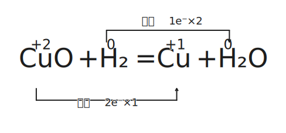
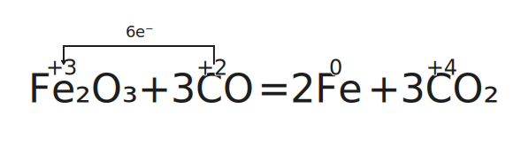
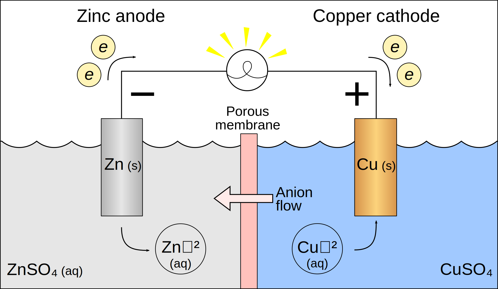
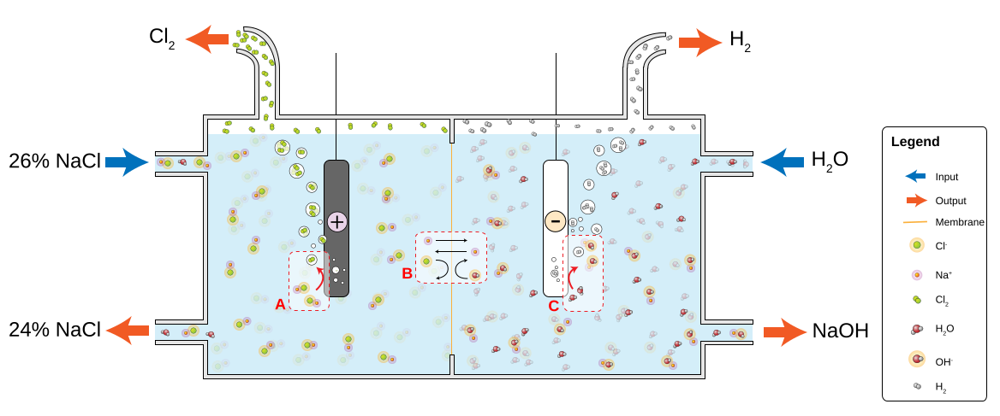
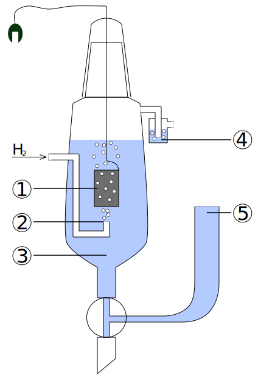

# 电化学

电化电池又称电化学电池、化学电池，是一种能够从化学反应中**产生电能**或**利用电能**引起化学反应的装置。

按此定义，电化电池分为两种类型：

- 原电池：包含伏打电池、伽伐尼电池，是产生电能与电流的电化学电池，即发生化学反应（氧化还原反应）将化学能转为电能的装置。

- 电解池：又称电解电池，是利用电能且通过电解等方式产生化学反应的电化学电池，即输入电能引发化学反应的装置。

高中电化学的核心是导线中电子的运动。# 氧化还原反应

## 氧化还原反应

### 氧化还原概述

- 定义：有化合价变化的反应。
- 本质：电子的转移（得失或偏移）。

其中，化合价有：

| 元素 | 化合价规律 |
| :-: | :-: |
| $\ce{H}$ | 一般显 $+1$ 价 在金属氢化物中显 $-1$ 价 |
| $\ce{O}$ | 一般显 $-2$ 价 在过氧化物中显 $-1$ 价 |
| $\ce{F}$ | 只显 $-1$ 价（没有正价） |

特殊物质化合价：

| 物质 | 物质 | 物质 | 物质 |
| :-: | :-: | :-: | :-: |
| $\ce{K2\val{Fe}{+4}O4}$ 高铁酸钾 | $\ce{K2\val{Cr}{+6}_2O7}$ 重铬酸钾 | $\ce{K\val{Mn}{+7}O4}$ 高锰酸钾 | $\ce{\val{O}{+2}\val{F}{-1}_2}$ 二氟化氧 |
| $\ce{\val{B}{+3}_2H6}$ | $\ce{\val{Si}{+4}H4}$ | $\ce{\val{C}{+4}H4}$ | $\ce{\val{S}{+6}_2O8^2-}$ |

氧化还原反应反应的特征：

- 氧化反应和还原反应是在一个反应中同时发生的。

- 氧化反应反应伴随着化合价的升降，且升降总数相等。

反应物和生成物：

- 氧化剂得电子，化合价降低，以自己的氧化能力将还原剂氧化，自身发生还原反应，被还原后生成还原产物。

- 还原剂失电子，化合价升高，以自己的还原能力将氧化剂还原，自身发生氧化反应，被氧化后生成氧化产物。

简记为：升失氧化还原剂，降得还原氧化剂。

- 歧化反应：一样的反应物或元素，其一化合价上升，另一下化合价降；常发生在碱性环境中。

- 归中反应：两个或多个含有某元素而化合价不同的反应物，得到化合价相同的单一产物；常发生在酸性环境中。

对于反应的判断，有性质：

- 所有置换反应都是氧化还原反应。

- 有单质参与的化合或分解反应都是氧化还原反应。

总结规律如下：

- 电子守恒：价态有升有降，且升降总数相等。

- 能不变就不变：

    - 相近转化、能不相交就不相交。

    - 同时一个元素化合价不变的原子不参与氧化还原反应。

    - 相邻价态不反应。

- 强者先行：假设法，例如 $\ce{Cl2}$ 先氧化 $\ce{FeI2}$ 中的碘离子。

### 氧化剂和还原剂

| 氧化剂 | 还原产物 | | 氧化剂 | 还原产物 |
| :-: | :-: | :-: | :-: | :-: |
| $\ce{HClO,Cl2,KClO3}$ | $\ce{Cl-}$ | | $\ce{KMnO4,MnO2(H+)}$ | $\ce{Mn^2+}$ |
| $\ce{O2,H2O2}$ | $\ce{H2O}$ | | $\ce{H2SO4(浓)}$ | $\ce{SO2}$ |
| $\ce{HNO3(浓)}$ | $\ce{NO2}$ | | $\ce{HNO3(稀)}$ | $\ce{NO}$ |
| $\ce{Br2}$ | $\ce{Br-}$ | | $\ce{I2}$ | $\ce{I-}$ |
| $\ce{Fe^3+}$ | $\ce{Fe^2+}$ | | $\ce{Ag+}$ | $\ce{Ag}$ |

| 还原剂 | 氧化产物 | | 还原剂 | 氧化产物 |
| :-: | :-: | :-: | :-: | :-: |
| $\ce{S2-,H2S}$ | $\ce{S}$ | | $\ce{SO2,SO3^2-}$ | $\ce{SO4^2-}$ |
| $\ce{NH3}$ | $\ce{N2,NO}$ | | $\ce{H2O2}$ | $\ce{O2}$ |
| $\ce{CO,C}$ | $\ce{CO2}$ | | $\ce{I-}$ | $\ce{I2}$ |

氧化性和还原性：

1. 同种元素：

    - 最高价态只降不升，最低价态只升不降。

    - 一般价态越高氧化性越强，价态越低氧化性越弱。

2. 互补性：单质氧化性越强，其对应的离子还原性越弱。

    - （金属）活动性顺序：

        氧化性：$\ce{Ag+ > Fe^3+ > Cu^2+ > H+ > \dots > Fe^2+ > \dots}$

        还原性：$\ce{Au < Ag < Cu < (H) < \dots < Fe < \dots}$

    - （非金属）活动性顺序：

        氧化性：$\ce{F2 > Cl2 > Br2 > I2 > S}$。

        还原性：$\ce{F- < Cl- < Br- < I- < S^2-}$。

3. 根据反应条件与反应现象：

    - 与同一类反应物反应，条件越低越强。

    - 与同一类反应物反应，反应越剧烈越强。

4. 不是很不准确的（存疑）：

    - 通常价位变化越大越强（反例：硝酸）。

    - 通常浓度越大越强，酸性越强氧化性越强（对于 $\ce{ClO-,MnO4-,NO3-}$ 等含氧酸）。

5. 根据反应方程式判断：

    - 两强制两弱：氧化剂氧化性大于氧化产物，还原剂还原性大于还原产物。

    - 不能说氧化剂氧化性大于还原剂，只能说某一条件下某物质表现了氧化性或还原性。

6. 有还原性不一定表现还原性，有强氧化性也不一定表现氧化性。

常见物质氧化性、还原性顺序表：

- 氧化性：$\ce{MnO4- > Cl2 > Br2 > Fe^3+ > I2 > SO2 > S}$。

- 还原性：$\ce{Mn^2+ < Cl- < Br- < Fe^2+ < I- < SO3^2- < S2-}$。

- 上表使用方法，找到左上、右下两组为反应物，找到对应左下、右上为产物。

### 方程式配平

用箭头表示电子的转移，依据是得电子数等于失电子数。

1. 标化合价升降。
2. 根据化合价升降守恒配平变价元素。
3. 根据原子守恒、电荷守恒配平其他元素和物质。

{ width="70%" }
/// caption
双线桥
///

{ width="70%" }
/// caption
单线桥
///

转移电子数为一条线上的，只考虑得到的电子数或者失去的电子数。

### 亚甲基蓝

亚甲蓝又称亚甲基蓝，注意亚甲（基）蓝并无亚甲基。

- 分析化学中用亚甲蓝作为氧化还原反应滴定的指示剂，会比碘液更好。

- 亚甲蓝的水溶液在氧化性环境中呈蓝色，但遇还原剂会被还原成无色形态，也是一种氧化还原指示剂。

- 其亚甲蓝因为有还原性，注射液被用来治疗正铁血红蛋白血症，也用于解救硝基苯、亚硝酸盐和氰化物中毒等。

- 蓝瓶实验也是以亚甲蓝的变色为基础的。可以用来检验水的溶氧量，反应是会令亚甲蓝液更蓝。

另外注意甲紫溶液（又称龙胆紫，详见生物）与亚甲蓝不同，应注意勿混用。

## 原电池

### 原电池的定义

原电池又称一次电池、初级反应电池，意指不可充电电池，是化学电池的一种，以化学能转变为电能而提供电力，且只可放电一次，当内里的化学物质全部起了化学作用后便不能再能提供电能，也不能将外部提供的电力储起，因此完全放电后便不可再用，这是因为其电化反应不可逆转。有别于可以反复多次充电（储起外部提供的电力）后再放电的蓄电池（二次电池、可充电电池）。

原电池售价及生产成本一般较便宜，例如常用的碱性电池，但若成本以整体寿命计算则不及一般的蓄电池便宜。

通常情况下的原电池特指**伽伐尼电池**（或称**伏打电池**），其进行氧化还原反应将化学能转为电能，而提供电能的电化电池，属于一种原电池。

{ width="80%" }
/// caption
一个经典的由盐桥相连的原电池
///

{ width="80%" }
/// caption
一个经典的由多孔物相连的原电池
///

典型伽伐尼电池可由两种不同的金属与一种电解质组成，也可由两个半电池间以盐桥或多孔物相连而成；在表示的时候通常阳极在左，阴极在右。

### 原电池的组成

### 电极方程式

更多请见电池概述。

## 电解池

### 电解池的定义

电解池又称电解电池，是用于电解的装置，可以将电能转化为化学能，使某些平常情况下无法自发的化学反应得以发生。

电解池一般由电解液和两个电极组成，电解液可以是盐类的水溶液也可以是熔融的盐类。当在电极上加上外加电场时，电解液中的离子会被带相反电荷的电极所吸引，靠近该电极，进而在该电极上发生得电子或失去电子的还原或氧化反应。电解池的重要应用例子包括电解水、电解食盐水、电解熔融的氧化铝制取铝等过程。

电解池通常使用的电流都达数百安培，材料的电镀和金属的精炼也通过电解池进行。

{ width="90%" }

- 与电源的正极相连的电极为阳极，阳极带正电荷，吸引带负电的离子在阳极上失去电子，形成气体逸出。

- 与电源负极相连的电极为阴极，阴极带负电荷，吸引带正电的离子在阴极上得到电子，还原后生成金属或气体。

对于钠、镁、铝等较活泼金属的化合物，其中的金属离子很难得到电子还原成单质，故一般的还原法无法获得金属，可在电解池中通过外加电场促使还原反应发生。

### 电解池的组成

### 阴阳放电顺序

## 拓展内容

### 标准氢电极

标准氢电极（简称 SHE），是构成标准电极电势（$E^0$）基准的工作电极。

{ align=right width="30%" }

$$
\ce{2H+(aq) + 2e- -> H2(g)}
$$

这个半反应是在镀有铂黑的处于标准状态（气体压强为 $1$ 大气压、$c(\ce{H+})=\pu{1mol/L}$）的铂电极上发生的。

在 $\pu{25^oC}$ 时，它的绝对电位大约为 $\pu{4.44\pm0.02V}$，但为了给所有电极反应的电动势设立一个基准值，在任意温度下氢电极的标准电极电势都定义为零，其他电极的电势都是相对于标准氢电极而确定的。

镀一层铂黑是为了：

- 更好地吸附氢气到表面上，同样能够加快反应速率。

- 增大总的表面积。这会增大了反应的性能，加快反应速率。

干扰：

- 由于铂电极有极高的吸附性，避免电极与溶液和有机物或是大气中的氧气接触是很重要的。

- 其他一些能使催化剂中毒的物质包括：含硫和含砷的物质、胶体、生物碱以及一些生物体中的物质。

### 标准电极电势

标准电极电势是可逆电极在标准状态及平衡态时的电势，也就是标准态时的平衡电势。

设 $E_{cell}^{o}$ 为电池的标准电位，可由阳极和阴极的标准电极电位计算而来:

$$
E_{cell}^{o}=E_{cathode}^{o}-E_{anode}^{o}
$$

### 电化学极化

这种作用将电极与电解质隔离，妨碍两者之间的反应以及电荷交换。造成的即刻后果:

- 还原电势降低，反应速率降低并可能停止。

- 电流转变为热量，而不是所希望的化学功。

- 电化学电池的自放电增长。

在电极和电解液界面上产生隔离性阻碍，从而影响反应机制以。

## 电化学的应用

### 二氧化碳还原

二氧化碳电化学还原反应是使用电化学手段将二氧化碳（$\ce{CO2}$）还原的反应，可以得到特定的有机物或燃料（选择性催化），它是碳捕获与利用的最有前途手段之一。

$$
\ce{CO2 + 2 H+ + 2 e− ->[Sn] HCOOH}
$$

$$
\ce{CO2 + 2 H+ + 2 e− ->[Ag] CO + H2O}
$$

$$
\ce{CO2 + 8 H+ + 8 e− ->[Cu] CH4 + 2 H2O}
$$

$$
\ce{2 CO2 + 12 H+ + 12 e− ->[Cu] C2H4 + 4 H2O}
$$

$$
\ce{2 CO2 + 12 H+ + 12 e− ->[Cu] C2H5OH + 3 H2O}
$$

### 阳极钝化处理

阳极处理是电解钝化处理的一种，用来增加金属零件表面氧化层的厚度。

- 阳极层最常用来保护铝合金，也有其他例如钛、锌、镁等。一般铝合金很容易氧化，氧化层虽然有一定钝化作用，但长期暴露依旧会剥落、丧失保护作用，阳极处理利用其容易氧化的特性，以电化学方法控制生成一层致密的氧化层，以防止铝材进一步氧化。

- 增加表面的机械性质（但是不能增加铝材的强度），产生各种色泽增进美观的。在电子回路中金属零件被放置于阳极，阳极处理使金属零件较不易腐蚀及磨损，且使底漆更能完整附着上零件，阳极处理提供多种表面修饰的效果，如镀上较厚且多孔的表面使染料更容易被吸收，或是较薄的透明层以增加反光能力。

含铁的金属通常不会用电解来处理，而是置于硝酸中做阳极处理，或用发烟硝酸来形成一层黑硬的氧化铁。

### Kolbe 电解

Kolbe（柯尔贝）电解是羧酸盐电解时以自由基机理发生脱羧二聚生成烷烃的反应。

$$
\ce{2RCOO- + 2H2O -> R-R + 2CO2 + 2OH- + H2}
$$

一般以高浓度的羧酸钠盐作原料，在中性或弱酸性环境中进行电解。电极以铂制成，阳极产生烷烃和二氧化碳，阴极产生氢氧化钠和氢气。羧酸的碳数最好适中，一般在 $10$ 个左右。反应的副产物有低碳烷烃、酯和醇等。

### 电镀技术

### 氯碱工业

如制取铝的霍尔-埃鲁法，其基本反应是电解熔融的氧化铝制得单质铝：冰晶石、氧化铝和氟化铝的混合溶液加上直流电压后，带正电的铝离子会聚集在阴极附近，获得电子生成单质铝，而氧离子则在石墨或焦炭制成的阳极附近失去电子，生成氧原子。

### 电化腐蚀

伽伐尼腐蚀（galvanic corrosion），意译为电偶腐蚀或电化腐蚀，是指当两种不同的金属相接（电气连接），并同时与电解质（例如盐水等）接触时，会形成伽伐尼电池，因电化学作用造成的金属腐蚀现象。
