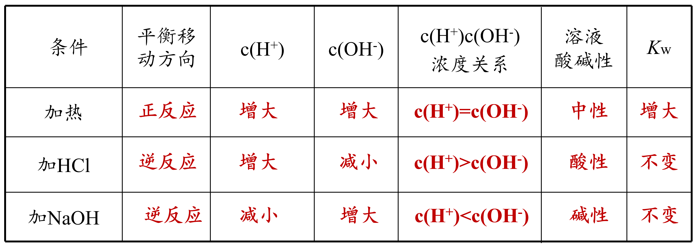
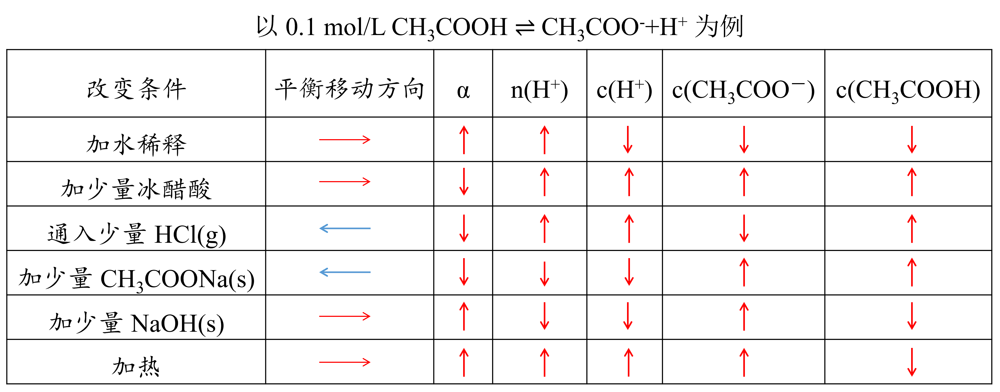
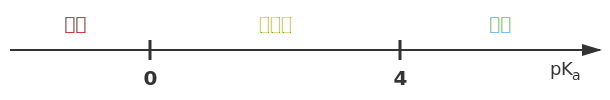
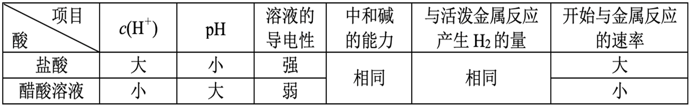
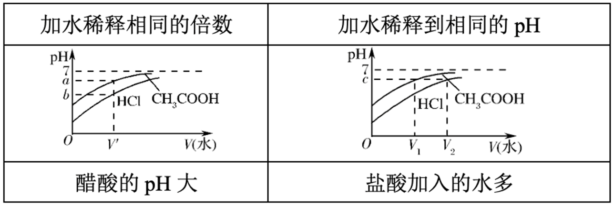
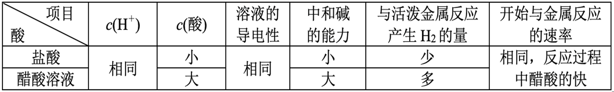
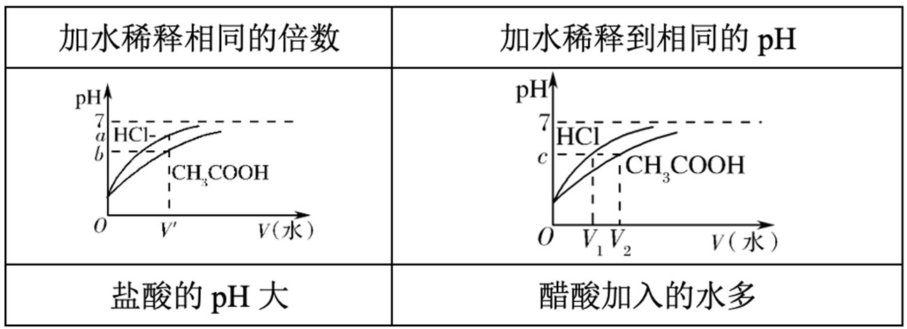

# 溶液行为

## 基本概念

### 电解质

电解质：在水溶液中**或**熔融状态下导电的**化合物**。

非电解质：在水溶液中**和**熔融状态下都不导电的**化合物**。

- 常见的电解质：酸、碱、盐、金属氧化物、水。

- 常见的非电解质：非金属氧化物（除了水）、$\ce{NH3}$、部分有机物。

- 注意，单质和混合物无权参与电解质和非电解质的分类。

导电能力的比较：

- 与离子浓度成正比。
- 与离子电荷量成正比。
- 与离子的摩尔质量成反比。

注意区分：能导电的物质有酸碱盐的水溶液、熔融的碱性氧化物、石墨和金属、$\ce{Fe(OH)3}$ 胶体。

强电解质：

- 在水中完全电离的电解质，称为强电解质。

- 常见的强电解质有：强酸、强碱、大部分盐、活泼金属氧化物（$\ce{Na2O,Na2O2,CaO}$）。

- 六大强酸：氢氯酸 $\ce{HCl}$、氢溴酸 $\ce{HBr}$、氢碘酸 $\ce{HI}$、硫酸 $\ce{H2SO4}$、硝酸 $\ce{HNO3}$、高氯酸 $\ce{HClO4}$。

- 高氯酸是自然界最强的含氧酸，详见原子周期律部分。

- 四大强碱：$\ce{KOH,NaOH,Ca(OH)2,Ba(OH)2}$。

弱电解质：

- 在水中不完全电离的电解质，称为弱电解质。

- 常见的弱电解质有：弱酸、弱碱、极少数盐（$\ce{HgCl2,HgCl,(CH3COO)2Pb}$ 醋酸铅）、不活泼金属氧化物、水。

- 要注意的是，氢氧化镁 $\ce{Mg(OH)2}$ 属于中强碱，其属于强电解质还是弱电解质有争议。

### 离子反应

反应的分类：

- 根据反应形式，分为：化合反应、分解反应、置换反应、复分解反应。

- 根据电子转移，分为：氧化还原反应、非氧化还原反应。

- 根据能量变化，分为：吸热反应、放热反应等。

离子反应：在水溶液中，有离子参与（生成或消耗）的反应，称为离子反应。

存在有复分解、氧化还原、水解等类型，其中复分解反应反应条件为：

生成物有难溶物质（沉淀）、挥发性物质（气体）、弱电解质（水、醋酸等）。

例如：

$$
\ce{CH3COONa + HCl = NaCl + CH3COOH}
$$

也是强酸制弱酸的体现。

离子反应方程式的书写四步法：

1. 写化学方程式。
2. 拆强酸强碱可溶盐（注意不溶的即使是强电解质也不能拆）。
3. 删掉左右相同的，系数最简。
4. 检查原子守恒、电荷守恒。

不可以拆的物质如：

- 难溶物质、弱电解质、气体、单质、氧化物。
- 浓硫酸不拆，浓硝酸、浓盐酸可以拆。
- 微溶物如氢氧化钙，做生成物不拆，反应物清拆浊不拆。

注意一定要符合客观事实。

### 电离常数

溶解平衡是一种关于化合物溶解的化学平衡。

- 溶解的固体可以是共价化合物或离子化合物，离子化合物会在溶于水时电离为离子。

- 我们此处只讲解离子化合物，离子化合物的溶解平衡也可以称为电离平衡。

对于一般的反应：

$$
\ce{A_xB_y(aq) <=> xA^y+ (aq) + yB^x+ (aq)}
$$

定义其达到平衡时电离常数：

$$
K_d=\dfrac{\con{A^y+}^x\con{B^x+}^y}{\con{A_xB_y}}
$$

特别的，如果该物质为固体不溶物，则定义其溶度积（这与活度有关，高中不考虑）。电离常数通常用于配合平衡，例如 $\ce{Fe^3+}$ 与 $\ce{CN-}$ 的平衡。

### 酸碱理论

酸碱电离理论（电离酸碱理论）：酸在水中能产生氢离子（$\ce{H+}$），碱在水中能产生氢氧根离子（$\ce{OH-}$）。该理论适用于水溶液，便于区分强酸/强碱与弱酸/弱碱。

$$
\ce{HCl -> H+ + Cl-}
$$

$$
\ce{NaOH -> Na+ + OH-}
$$

酸碱质子理论（质子酸碱理论）：酸被定义为质子（$\ce{H+}$）供体，碱为质子受体。该理论不局限于水溶液，可处理溶剂中发生的质子转移反应，并引入共轭酸-碱对的概念。

$$
\ce{HCl + H2O -> H3O+ + Cl-}
$$

$$
\ce{NH3 + H2O <=> NH4+ + OH-}
$$

酸碱电子理论（路易斯酸碱理论）：酸是电子对受纳体，碱是电子对给体。该理论范围最广，可解释不涉及质子转移的配位、加成反应等（如路易斯酸为空轨道或正电中心）。

$$
\ce{BF3 + :NH3 -> F3B-NH3}
$$

$$
\ce{Ag+ + :NH3 -> [Ag(NH3)]+}
$$

简要比较：酸碱电离理论只适用于水溶液的电离过程；酸碱质子理论扩展到所有质子转移反应；酸碱电子理论最通用，可描述所有以电子对相互作用为主的酸碱反应。

## 弱电解质

### 水的电离

我们知道水是一种特殊的弱电解质：

$$
\ce{H2O + H2O <=> H3O+ + OH-}
$$

这称为水的自偶电离，可以理解为氢离子（仅仅是一个质子）太小，通常会和一个水分子结合，在高中阶段通常简写为：

$$
\ce{H2O(l) <=> H+(aq) + OH-(aq)};\quad\Delta H>0
$$

我们知道水作为纯液体，其浓度视为 $1$，可以得到**水的电离常数**：

$$
K_w=\con{H+}\con{OH-}
$$

在常温下 $K_w=\pu{1E-14}$，也就是说 $\con{H+}=\con{OH-}=\pu{1E-7}$。而在接近沸腾的水中，一般取 $\pu{E-12}$ 左右。

{ width="100%" }

在这一部分中，我们考虑六个经典问题（三个定性、两个定量和一个备注）：

1. **越热越电离**：温度越高，平衡正向移动，平衡常数增大，纯水中 $\con{H+},\con{OH-}$ 均增大，平衡常数仅仅是温度的函数。

2. **酸碱抑制水的电离**：加入酸或碱，温度不变、平衡常数不变，$\con{H+}$ 或 $\con{OH-}$ 增大但不抵消，平衡逆向移动。

3. **水解促进水的电离**：加入弱酸或弱碱对应的正盐，温度不变、平衡常数不变，氢离子或氢氧根被消耗，平衡逆向移动。

    注意：如果不是正盐，则同时会发生电离和水解，此时需要比较电离和水解的强弱。例如，对于 $\ce{NaHCO3}$，因为其水溶液呈碱性，故水解作用强于电离，故其会促进水的电离。

    对于酸式盐：若电离更强，则相当于酸，故会抑制水的电离，其水溶液呈酸性；若水解更强，则相当于盐，故会促进水的电离，其水溶液成碱性。

4. **质子守恒**：由水电离出的氢离子和氢氧根物质的量相等，故浓度相等。

5. **任何溶液中** $\con{H+}\cdot\con{OH-}=K_w$。

6. **备注**：溶液中的 $\ce{H+}/\ce{OH-}$ 与水电离出的氢离子和氢氧根物质的量不一定相等。此处会有一些计算题，但是我们放到 $\pH$ 定义之后再讲。

水的电离是很弱的，对于强酸、强碱的溶液，在不是很稀的情况下一般可以直接忽略水的电离对溶液的影响。即使是稀溶液，或者弱酸、弱碱的溶液，通常也会忽略水的电离所产生的影响。但是要注意，在极端情况下，仍然是要考虑水的电离的，这是一个常见错误。

### 溶液酸碱性

我们定义：

$$
\pH=-\lg[\ce{H+}]
$$

$$
\pOH=-\lg[\ce{OH-}]
$$

实际上，任何一个物理量的负对数都可以定义其的 $p$ 运算。

- 溶液的酸碱性的充要条件是 $\con{H+})$ 和 $\con{OH-}$ 的大小关系，因此只需要比较 $\pH$ 与 $\pOH$ 即可，纯水一定满足 $\pH=\pOH$。常温下纯水 $\pH=\pOH=7$，任意温度下任意溶液 $\pH+\pOH=pK_w$。

- 酸与酸溶液混合不一定是酸性，例如亚硫酸与氢硫酸溶液混合后发生归中反应

    $$
    \ce{H2SO3 + 2H2S -> 3S v + 3H2O}
    $$

    如果物质的量比例恰好为 $3:2$，则所得溶液接近中性。

在酸碱平衡中，常有两个问题：

- **稀释问题**：通常是加溶剂，配制成体积为原溶液若干倍的新溶液。

    对于强酸强碱溶液，在一定范围内，每稀释十倍，溶液 $\pH$ 加一或减一。
    
    对于弱酸弱碱溶液，因为溶液中存在未电离的分子，稀释过程中电离平衡正向移动，因此相同 $\pH$ 的弱酸稀释同样的倍数所得新溶液 $\pH$ 会比强酸小，同理弱碱稀释也会比强碱大。

    注意：**不过分**，当溶液接近中性后，再进行稀释，因为水的电离此时提供了大部分的氢离子，因此溶液 $\pH$ 只会趋近于 $7$。

- **混合问题**：等体积混合、一定体积比混合。

    不考虑发生其他反应，强酸与强酸混合、强碱与强碱混合，只需要用总的氢离子或氢氧根浓度加和，除以总体积即可。注意：有的题目中会明确指出体积不具有加和性，此时需要通过题目给出的方式求出混合后的体积，或者定性判断混合后的体积比体积加和小，如果没有提到可以默认具有加和性。

    注意：**抓主要矛盾**，强碱与强碱溶液混合，不应使用氢离子浓度加和，因为此时溶液中氢氧根浓度远大于氢离子浓度，而应当用主要的氢氧根浓度加和。

我们应该明确的几点：

- 若某溶液中由水电离出的氢离子浓度低于该温度下的纯水，则溶质对水的电离起抑制作用，溶质应当为酸或碱。

- 若某溶液中由水电离出的氢离子浓度高于该温度下的纯水，则溶质对水的电离起促进作用，溶质应当为弱酸或弱碱的盐。

- 某酸碱溶液常温下 $\pH$ 之和为 $14$，则对水的电离的抑制作用相同。

- 任何酸碱溶液，若 $\pH$ 相同，则不论强弱对水的电离的抑制作用相同。

**抓唯一**：升高温度，强酸溶液中 $\pH$ 基本不变，强碱溶液中 $\pOH$ 基本不变。

- 这一点经常与水的电离中第一个定量问题联合出题，即由水电离出的氢离子与氢氧根浓度相等，题目通常会将这个浓度作为已知量或待求量。

- 常温下，由水电离出的氢离子浓度为 $\pu{10^-11 mol/L}$，则由水电离出的氢氧根浓度也为 $\pu{10^-11 mol/L}$，因此溶质对水的电离有抑制作用，为酸或碱。若溶质为强酸，则氢氧根浓度近似等于后者，则氢离子浓度为 $\pu{10^-3 mol/L}$，溶液的 $\pH=3$；若溶质为强碱，则氢离子浓度近似等于前者，溶液的 $\pH=11$。

- 常温下，由水电离出的氢离子浓度为 $\pu{10^-3 mol/L}$，则由水电离出的氢氧根浓度也为 $\pu{10^-3 mol/L}$，因此溶质对水的电离有促进作用，为弱酸或弱碱的盐。若溶质为弱酸的正盐，则氢氧根浓度近似等于后者，则氢离子浓度为 $\pu{10^-11 mol/L}$，溶液的 $\pH=11$；若溶质为弱碱的正盐，则氢离子浓度近似等于前者，溶液的 $\pH=3$。

- 反过来，如果溶液中 $\pH=3$ 或 $\pH=11$，讨论溶质是强酸强碱还是弱酸或弱碱的盐，则水电离出的氢离子浓度为 $\pu{10^-3 mol/L}$ 或 $\pu{10^-11 mol/L}$。

注意：我们称一定浓度的溶液，指的是用一定物质的量的溶质加水配制成一定体积的溶液，例如在 $\ce{NaHCO3}$ 溶液中，应当有

$$
\con{CO3^2-}+\con{HCO3^-}+\con{H2CO3}=\con{Na+}
$$

这也称为物料守恒，我们将在三大守恒中详细解释。

### 酸碱的电离

- 对于一元弱酸的电离：

    $$
    \ce{HA <=> H+ + A-}
    $$

    定义其电离平衡常数：

    $$
    K_a=\dfrac{\con{H+}\con{A-}}{\con{HA}}
    $$

    在某一溶液中：

    $$
    \pH=pK_a+\lg\dfrac{\con{A-}}{\con{HA}}
    $$

    其中 $pK_a$ 反应了这种弱酸内在酸性的强弱，与该溶液的 $\pH$ 无关。

- 对于一元弱碱的电离：

    $$
    \ce{BOH <=> B+ + OH-}
    $$

    定义其电离平衡常数：

    $$
    K_b=\dfrac{\con{B+}\con{OH-}}{\con{BOH}}
    $$

    在某一溶液中：

    $$
    \pOH=pK_b+\lg\dfrac{\con{B+}}{\con{BOH}}
    $$

    其中 $pK_b$ 反应了这种弱碱内在碱性的强弱，与该溶液的 $\pH$ 无关。

我们知道 $K_a,K_b$ 仅和温度有关，即仅仅是温度的函数，因为电离吸热，因此温度越高电离常数越小，电离度越小，我们会在图像和趋势部分详细说明。

亨德森—哈塞尔巴尔赫方程的推导：

$$
\begin{aligned}
\pH&=-\lg\con{H+}\\
&=-\lg\paren{\dfrac{\con{H+}\con{A-}}{\con{HA}}\cdot\dfrac{\con{HA}}{\con{A-}}}\\
&=pK_a+\lg\dfrac{\con{A-}}{\con{HA}}
\end{aligned}
$$

对于弱碱 $\ce{BOH}$ 也进行类似的操作即可。

{ width="100%" }

- 这种两种含有相同离子的盐（或酸、碱）溶于水时，它们的溶解度都会降低，这种现象叫做**同离子效应**，其本质是平衡的移动。

- 电离平衡右移，电解质分子的浓度不一定减小（加入醋酸），离子的浓度也不一定增大（加入与离子反应的物质）。

- 电离平衡右移，电离程度不一定增大（加入醋酸）。

我们知道 $K_a$ 越大酸性越强，但是 $pK_a$ 越小。

{ width="90%" }

| 酸 | 化学式 | $pK_a$ | | 酸 | 化学式 | $pK_a$ |
| :-: | :-: | :-: | - | :-: | :-: | :-: |
| *氟锑酸* | $\ce{HSbF6}$ | $-25.00$ | | 磷酸 | $\ce{H3PO4}$ | $2.12$ |
| *魔酸* | $\ce{FSO3H-SbF5}$ | $-19.20$ | | 柠檬酸 | $\ce{C6H8O7}$ | $3.09$ |
| 高氯酸 | $\ce{HClO4}$ | $-10.00$ | | 碳酸 | $\ce{H2CO3}$ | $6.35$ |
| 盐酸 | $\ce{HCl}$ | $-8.00$ | | 硫化氢 | $\ce{H2S}$ | $7.00$ |
| 硫酸 | $\ce{H2SO4}$ | $-3.00$ | | 次氯酸 | $\ce{HOCl}$ | $7.50$ |
| 硝酸 | $\ce{HNO3}$ | $-2.00$ | | 水 | $\ce{H2O}$ | $14$ |

- 多元弱酸分步电离，以 $\ce{H2A}$ 为例：

    $$
    \ce{H2A <=> H+ + HA-};\quad K_{a1}=\dfrac{\con{H+}\con{HA-}}{\con{H2A}}
    $$

    $$
    \ce{HA- <=> H+ + A^2-};\quad K_{a2}=\dfrac{\con{H+}\con{A^2-}}{\con{HA-}}
    $$

    对于 $n$ 元弱酸，一般各级电离越来越弱，即

    $$
    K_{a1}\gg K_{a2}>K_{a3}>\dots>K_{an}
    $$

    因此一般只需要考虑一级电离即可。

- 多元弱碱一步电离，以 $\ce{B(OH)2}$ 为例：

    $$
    \ce{B(OH)2 <=> B^2+ + 2OH-};\quad K_b=\dfrac{\con{B^2+}\con{OH-}^2}{\con{B(OH)2}}
    $$

    实际上其电离过程也分为多步，只不过高中阶段视为一步。

- 注意：对于 $\ce{H2A -> HA- -> A^2-}$，除了均为完全反应、均为可逆反应外，还存在第一步完全、第二步可逆的情况，此时溶液中 $\ce{H2A}$ 电离完全，仅需要考虑后一步的平衡即可。

例题：常温下，$\pH=a$ 的稀盐酸（$\ce{HCl}$）与 $\pH=b$ 的氨水（$\ce{NH3*H2O}$）等体积混合，恰好完全反应，问 $\alpha(\ce{NH3*H2O})$。

我们知道，对于 $\pH=a$ 的稀盐酸，其氢离子浓度为 $10^{-a}\space\pu{mol/L}$，因为氨水可以看作氨气溶于水，氨气与氯化氢的反应是 $1:1$ 的，因此氨水的浓度也为 $10^{-a}\space\pu{mol/L}$，而氨水的 $\pH=b$ 也就是说 $\pOH=b-14$，列出方程

$$
\begin{aligned}
\con{OH-}&=\alpha(\ce{NH3*H2O})\con{NH3*H2O}\\
10^{b-14}&=\alpha(\ce{NH3*H2O})\cdot10^{-a}
\end{aligned}
$$

因此

$$
\alpha(\ce{NH3*H2O})=10^{a+b-14}
$$

### 图像与应用

酸碱电离平衡常数对元素化合物的指导意义：

- 比较酸的强弱：比较其 $K_a$ 或 $K_{a1}$，例如 $\ce{HAc}>\ce{H2CO3}>\ce{HClO}>\ce{HCO3^-}$。

- 比较获得氢离子能力的强弱：比较其 $K_a$，例如 $\ce{Ac-}>\ce{HCO3^-}>\ce{ClO-}>\ce{CO3^2-}$。

- 例如将二氧化碳通入次氯酸钠溶液中，只能生成碳酸氢钠而不能生产碳酸钠。

一元强酸（$\ce{HCl}$）与一元弱酸（$\ce{CH3COOH}$）的比较：

- 等体积等浓度：

    { width="100%" }

    { width="100%" }

- 等体积等 $\pH$：

    { width="100%" }

    { width="100%" }

判断 $\dfrac{\con{A}}{\con{B}}$ 的变化：

1. 一个变大、一个变小。

2. 联系平衡常数，如 $K_a,K_b,K_w$ 等。

3. 极端假设法。

### 电离度

电离度 $\alpha$：电离平衡的转化率，以反应

$$
\ce{HAc <=> H+ + Ac-}
$$

为例，设其平衡常数:

$$
K_a=\dfrac{\con{H+}\con{Ac-}}{\con{HAc}}
$$

设转化率为 $\alpha$，醋酸浓度为 $c$，则转化了 $c\alpha$，因此

$$
K_a=\dfrac{c^2\alpha^2}{c-c\alpha}
$$

因为电离度 $\alpha$ 很小，我们取 $c\approx c-c\alpha$，则

$$
K_a\approx c\alpha^2
$$

因此也有

$$
\alpha\approx\sqrt{\dfrac{K_a}{c}}
$$

这可以推广到各种反应程度很低的反应。

### 三大守恒

利用守恒思想：

电荷守恒：溶液中所有阳离子所带的正电荷总数等于所有阴离子所带的负电荷总数。

物料守恒（原子守恒）：某一特定元素的原子在溶液中以不同形式存在的总量保持不变。

质子守恒：溶液中由水电离出的H⁺和OH⁻浓度相等，或者酸失去的质子等于碱得到的质子。

1.  **电荷守恒**：溶液呈电中性，阳离子所带正电荷总数等于阴离子所带负电荷总数。
    *   **例**：Na₂CO₃溶液中：`c(Na⁺) + c(H⁺) = c(HCO₃⁻) + 2c(CO₃²⁻) + c(OH⁻)` （注意CO₃²⁻带2个单位负电荷）
2.  **物料守恒**：特定原子（或原子团）的物质的量在反应前后保持不变。
    *   **例**：0.1 mol/L Na₂CO₃溶液中：`c(Na⁺) = 2c(CO₃²⁻)总`，即`c(Na⁺) = 2[c(CO₃²⁻) + c(HCO₃⁻) + c(H₂CO₃)]`
3.  **质子守恒**：溶液中酸失去的质子（H⁺）数等于碱得到的质子数。它可以通过电荷守恒和物料守恒推导出来，是最高级、最直接的守恒关系。
    *   **推导例**：Na₂CO₃溶液
        *   电荷守恒：`c(Na⁺) + c(H⁺) = c(HCO₃⁻) + 2c(CO₃²⁻) + c(OH⁻)`
        *   物料守恒：`c(Na⁺) = 2c(CO₃²⁻)总 = 2[c(CO₃²⁻) + c(HCO₃⁻) + c(H₂CO₃)]`
        *   将物料守恒代入电荷守恒，消去`c(Na⁺)`，整理得：`c(OH⁻) = c(H⁺) + c(HCO₃⁻) + 2c(H₂CO₃)`。这就是质子守恒式。

## 盐的平衡

### 盐的水解

在酸碱质子理论中，酸是质子的给予体，碱是质子的接受体。从这个角度看，盐类水解并非一个独立的新概念。所谓弱酸根离子的水解，本质上就是它作为一种碱（共轭碱）与水发生的酸碱反应。

### 沉淀溶解

离子积，是沉淀的反应商，用符号 $Q_{sp}$ 表示。

- 对于难溶盐 $\ce{A_xB_y}$ 的电离：

    $$
    \ce{A_xB_y(s) <=> xA^y+ + yB^x+}
    $$

    定义一个状态时的离子积：

    $$
    Q_{sp}=\con{A^y+}^x\con{B^x+}^y
    $$

- 离子积是沉淀溶解的一个状态，不能反应该沉淀的性质。

溶度积，是沉淀的溶解平衡常数，用符号 $K_{sp}$ 表示。

- 对于难溶盐，定义其溶度积为其电离平衡时的离子积（平衡常数）：

    $$
    K_{sp}=\con{A^y+}^x\con{B^x+}^y
    $$

- 在温度一定时，每一难溶盐类化合物的 $K_{sp}$ 皆为一特定值。

- 溶度积的大小反映了**难溶电解质**的溶解能力，可用实验方法测定。溶度积常数仅适用于难溶电解质的**饱和溶液**，对易溶的电解质不适用。

难溶盐的电离平衡：

- 当 $Q_{sp}<K_{sp}$ 时：平衡向右移动，电离出离子。

- 当 $Q_{sp}=K_{sp}$ 时：达到平衡状态，为动态平衡。

- 当 $Q_{sp}>K_{sp}$ 时：平衡向左移动，产生出沉淀。

## 补充内容

### 活度与盐效应

在高中阶段，我们计算平衡常数时，直接使用各物质的浓度。这实际上是基于一个“理想溶液”的模型。在理想溶液中，溶质分子之间、溶质与溶剂分子之间的相互作用力被忽略不计。

然而，在真实的、尤其是浓度较高的溶液中，离子间的相互作用力（吸引和排斥）变得不可忽略。这种相互作用会束缚离子的自由运动，使其表现出的“有效浓度”低于其实际浓度。为了修正这种偏差，我们引入了**活度**的概念。

- **活度**：可以理解为物质的“有效浓度”。活度 = 活度系数（$\gamma$）$\times$ 浓度（$c$）。

- **活度系数**（$\gamma$）：是衡量真实溶液偏离理想溶液程度的参数。对于稀溶液，离子间距大，相互作用弱，$\gamma$ 接近于 $1$，此时活度 $\approx$ 浓度，因此高中阶段使用浓度进行计算是合理的近似。但对于浓溶液，离子间作用增强，$\gamma$ 会显著偏离 $1$，此时必须使用活度才能准确描述化学平衡。

利用活度，我们可以解释盐效应：加入不含共同离子的“无关”盐类所产生的影响。

**盐效应**：在难溶电解质的饱和溶液中，加入一种不含有共同离子的强电解质（即惰性盐），导致难溶电解质溶解度增大的现象。核心原理是离子氛和活度的概念。

- 在纯水中，$\ce{AgCl}$ 溶解产生的 $\ce{Ag+}$ 和 $\ce{Cl-}$ 离子之间存在静电吸引力，这种吸引力会促使它们重新结合成 $\ce{AgCl}$ 沉淀。

- 当我们加入一种惰性盐，比如硝酸钾时，溶液中充满了大量的 $\ce{K+}$ 和 $\ce{NO3-}$ 离子。这些惰性离子会在 $\ce{Ag+}$ 和 $\ce{Cl-}$ 离子周围形成一个带相反电荷的“离子氛”。

- 这个离子氛部分地屏蔽了 $\ce{Ag+}$ 和 $\ce{Cl-}$ 之间的静电吸引力，使得它们结合成 $\ce{AgCl}$ 沉淀的趋势变弱了。从热力学角度看，惰性盐增加了溶液的离子强度，导致离子的活度系数减小。

- 溶度积常数 $K_{sp}$ 是由活度决定的，当活度系数 $\gamma$ 减小时，为了维持 $K_{sp}$ 不变，离子的摩尔浓度 $c$ 就必须增大，难溶电解质的溶解度增大。

注意：

- 盐效应通常比较微弱，远不如同离子效应显著。

- 盐效应与同离子效应的作用方向相反：同离子效应使溶解度降低，盐效应使溶解度升高。

- 当惰性盐浓度非常高时，可能会出现盐析效应，即盐离子与水分子大量水合，导致溶剂水减少，反而使溶质溶解度下降。这在高分子、蛋白质溶液中尤其明显。
