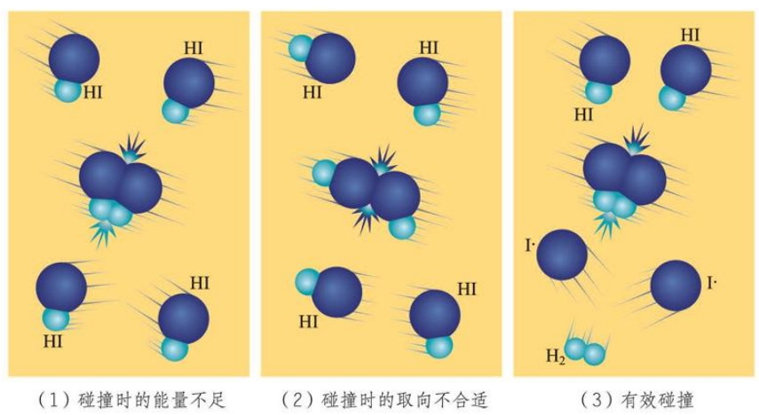

# 反应速率

## 基本概念

### 反应速率

对于溶液 $\ce{(aq)}$ 或气体 $\ce{(g)}$，定义：

$$
v(B)=\dfrac{|\Delta c(B)|}{\Delta t}
$$

这个式子表示一定时间内，**某一物质**浓度的变化率。

单位通常为 $\pu{mol/(L*s)}$ 或 $\pu{mol/(L*min)}$，$1\pu{mol/(L*s)}=60\pu{mol/(L*min)}$。

在高中阶段，反应速率只是反应在某一个阶段的平均速率，瞬时速率高中通常不考虑。

我们知道：在同一个方程式中 $v$ 正比于其化学计量数，即：

$$
\ce{nA + mB -> pC + qD}
$$

$$
\dfrac{v(A)}{n}=\dfrac{v(B)}{m}=\dfrac{v(C)}{p}=\dfrac{v(D)}{q}
$$

也就是说，对于一个反应，我们可以用这个比值来反映这个反应的速率大小（比值法）。

其本质就是，速率大小的比较，理论上需要化为一个物质的速率（归一法），而我们假设方程式中存在一个化学计量数恒为 $1$ 的物质，用其来反应反应的速率大小即可。

比较速率时勿忘同时比较数值和单位，或者说单位统一后再只比较数值。

### 三段式

判断是否有计算，如果有，那么直接列出三段式。

| 浓度（$\pu{mol/L}$） | $\ce{\alpha A}$ | $\ce{+}$ | $\ce{\beta B}$ | $\ce{<=>}$ | $\gamma C$ |
| :-: | :-: | :-: | :-: | :-: | :-: |
| **起**始浓度 | $a_1$ | | $b_1$ | | $c_1$ |
| **转**化浓度 | $-a_2$ | | $-b_2$ | | $+c_2$ |
| **平**衡浓度 | $a_3$ | | $b_3$ | | $c_3$ |

有性质：

- 变化量关系：

    $$
    \begin{cases}
    a_3&=a_1+(-a_2)\\
    b_3&=b_1+(-b_2)\\
    c_3&=c_1+(+c_2)
    \end{cases}
    $$

- 比值关系：

    $$
    a_2:b_2:c_2=\alpha:\beta:\gamma
    $$

    $$
    \dfrac{a_2}{\alpha}=\dfrac{b_2}{\beta}=\dfrac{c_2}{\gamma}
    $$

三段式计算反应速率：如果采用物质的量列三段式，且反应过程已知体积和时间，将体积、时间与**体积时间的乘积**都标在三段式方程式的旁边，方便从物质的量变化量直接算出化学反应速率。

- 物理量统一原则：

    不管这几个量（上面的例子中是九个）是物质的量还是物质的量浓度，上面的关系都是成立的。当然，所有的量要么都用物质的量，要么都用物质的量浓度，不能混乱。

- 物质的量先行原则：

    题目给出的条件中，只要存在一条有关**物质的量**（而非物质的量浓度）的信息，则量均采用物质的量表示；反之，如果所有信息都是物质的量浓度信息，均采用物质的量浓度。

    原理是物质的量通常更容易带到方程式计算中。

### 气体体系反应

定义：

- 发生在**一个容器**中。

- 定义**体系的体积**为**容器的体积**。

- 对于固体和液体，其物质的量浓度未定义。

- 混合气体模型为均一稳定的**混合物**，而不是各组分各自占据一块体积。

- 混每种气体的分子在容器内部都是无处不在的，每种气体实际占据的体积就是整个容器的容积。

在气体体系中，通常有一些假设：

- 气体体系反应中的气体均为理想气体，满足 $pV = nRT$（详见热力学）。

- 气体体系中，反应的或生成的固体或液体对容器体积影响忽略不计（即使是不恒容容器）。

### 溶液体系反应

定义：

- 发生在**一杯水溶液**中。

- 定义**体系的体积**为**溶液的体积**。

- 对于不溶的固体（如沉淀）和气体，其物质的量浓度未定义。

在溶液体系中，通常有一些假设：

- 溶液体系中，生成沉淀或气体等对水溶液体积的影响忽略不计。

- 加入溶液会影响物质的量浓度，反应物的物质的量浓度可能影响反应速率．因此添加溶液时，即使添加溶液中的离子全是反应物无关项，还是会影响反应速率，因为原反应物离子浓度降低了。

## 速率大小理论

### 速率影响因素

内因：物质本身的内在性质。

外因：

- 反应物的浓度、压强、接触面积：

    对于溶液，通常浓度越大，反应速率越大。

    对于气体，通常压强越大，反应速率越大。

    对于固体，通常接触面积越大，反应速率越大。

- 温度和催化剂等：升高温度、使用催化剂，反应速率增大。

- 其他因素：溶剂，光波、电磁波、超声波等。

通常的：

- 既是起点又是终点的物质是催化剂。

- 反应过程中被生成后又被消耗是中间产物。

- 只出不进是生成物，只进不出是反应物。

- 有进有出既可能是催化剂也可能是中间产物。

### 惰性气体体系

- 根据 $p=cRT$，我们容易推得：

    $$
    \begin{aligned}
    p&=cRT\\
    &=(c_1+c_2+\dots)RT\\
    &=c_1RT+c_2RT+\dots\\
    &=p_1+p_2+\dots
    \end{aligned}
    $$

    同时，设温度相同，则：

    $$
    \dfrac{p_分}{p_总} = \dfrac{n_分}{n_总} = x_分
    $$
    
    某组分气体分压等于容器总压乘以该组分气体的物质的量分数。

- 因此，我们知道，温度一定且**组分一定**，气体的分压与容器总压成正比，同时气体的分压与其物质的量浓度成正比，因此，总压强越大、物质的量浓度越大，化学反应速率越大。

- **恒温恒容**的容器中，有一气体为基础的反应正在进行，现在向容器充入惰性气体，反应速率如何变化？

    答案：不变。
    
    解析：虽然 $p_总$ 升高，$c_总$ 升高，然而每个参与反应的气体物质的量不变，容积不变，因此物质的量浓度不变。于是，反应速率不变。或者说，$c=n/V$，根据气体的体积就是容器的容积，因此物质的量浓度并没有改变。

- **恒温恒压**的容器中，有一气体为基础的反应正在进行，现在向容器充入惰性气体，反应速率如何变化？

    答案：变小。
    
    解析：充入气体后，根据 $pV = nRT$，$n$ 增多，$p$ 不变，因此 $V$ 变大。每个参与反应的气体物质的量不变，容积变大，因此物质的量浓度均变小。于是，反应速率变小。这里因为每个气体反应物的物质的量浓度均变小，因此分压也均变小，失去的这一部分总压被充入的惰性气体的分压弥补，**总压强不变**。

### 催化剂分析

催化剂：

- 催化剂是能改变化学反应速率而在反应前后本身的质量和化学性质不变的物质。

- 由于催化剂的质量和化学性质在反应前后不变，反应历程中必定既包含有催化剂参与的反应，又包括使得催化剂在生成的反应。

- 催化剂通常通过参与反应改变反应历程、改变反应的活化能来改变化学反应速率。

- 催化剂不能改变化学反应的平衡常数，也不能改变化学平衡的转化率。

- 催化剂是加入的物质然后参与反应最后又被生成，而中间产物是被生成的物质然后又被消耗，注意区分两者。

- 催化剂具有选择性，对于某一反应活性很强的催化剂对于另外的反应不一定具有催化作用。

- 工业上可以用于选择恰当的催化剂来调控反应，提高生产效率。

- 催化剂的活性与自身成分、粒径、合成方法等因素以及反应温度、压强等条件的影响。

- 通常情况下，催化剂发挥作用需要控制在活性温度范围内。

- 有些物质的存在可能会使催化剂明显失效，这种现象称为催化剂中毒。

- 最常见的强催化剂：铂、铂炭（活性炭）。

注意：

- 与催化剂相反，能减慢反应速率的物质称为抑制剂。过去曾用的负催化剂一词已不被国际纯粹与应用化学联合会（IUPAC）所接受[^noteiupac1]，而必须改用抑制剂一词，催化剂一词仅指能加快反应速率的物质。

[^noteiupac1]: 详见 [IUPAC Gold Book C00876](https://goldbook.iupac.org/terms/view/C00876) 相关内容。

- 催化剂指一种提高反应速率而不改变总体标准反应中吉布斯能量变化的物质，而使用催化剂参与反应的过程称为催化。催化剂既是反应物又是反应产物。当添加的物质降低反应速率时，不应使用催化剂和催化一词。

- 尽管如此，现在的高中课本仍然认为，催化剂也可以是减慢化学反应速率的物质，我们可以认为催化剂的作用原理是降低化学反应的活化能，但是抑制剂的作用原理通常不是提高活化能。

- 在实际应用中，减缓用的催化剂通常很少见，因此如果题目说使用了催化剂，可以默认是加快了反应速率；如果在选择题问「催化剂是否均加快反应速率」则判否，这里应当考虑抑制剂作为催化剂的一种。

### 有效碰撞理论

大多数化学反应并不是经过简单碰撞就能完成的，而往往经过多个反应步骤才能实现，

$$
\boxed{\ce{2HI -> H2 + I2}}
=\begin{cases}
\ce{2HI &-> H2 + 2I.}\\
\ce{2I. &-> I2}
\end{cases}
$$

每一步反应都成为**基元反应**。这里的 $\ce{I.}$ 是带有单电子的原子，这种带有单电子的原子或原子团称作**自由基**。自由基的反应活性极强，稳定性极差，寿命极短。

{ width="80%" }

基元反应发生的条件：

1. 反应物的分子发生碰撞。

2. 反应物的分子碰撞时的能量足够。

3. 反应物的分子碰撞时的取向合适时。

只有那些碰撞时能量足够，且取向合适的碰撞可以触发基元反应，这样的碰撞称作**有效碰撞**，发生有效碰撞的分子称作**活化分子**，活化分子具有的平均能量与反应物分子具有的平均能量差称作反应的**活化能**。

### 过渡态理论

基元反应从反应物到产物的变化过程中要经历一个中间状态，这个状态称为过渡态。

$$
\ce{AB + C -> [A\cdots B\cdots C] -> A + BC}
$$

过渡态是反应过程中具有最高能量的一种结构状态，过渡态能量与反应物的平均能量的差值相当于活化能。

注意过渡态不等于化学键完全断开，通常是一种似断非断的感觉，实验研究已证实过渡态确实存在。

### 质量作用定律​

对于基元反应：

$$
\ce{a A + b B B -> c C + d D}
$$

其「反应进度浓度瞬时速率」$v$ 与 $c^a(\ce A)c^b(\ce B)$ 成正比，即

$$
v = kc^a(\ce A)c^b(\ce B)
$$

其中的 $k$ 称作**反应速率常数**，与反应物浓度无关，与温度、催化剂、固体表面积性质等有关，不同化学反应也有不同的反应速率常数。

注意到，如果我们对一个可逆反应用正逆两次质量作用定律，以及两次阿伦尼乌斯方程，就可以得到平衡常数 $K=\dfrac{k_正}{k_逆}$。

### 阿伦尼乌斯方程

在质量作用定律​中，我们定义了一个速率常数 $k$，阿伦尼乌斯方程指出：

阿伦尼乌斯公式提出的反应速率常数与温度之间关系的经验公式：

$$
k=A\operatorname{exp}\left(-\dfrac{E_a}{RT}\right)
$$

- $A$ 称作指前因子（阿伦尼乌斯常数），是一个常数。

- $\operatorname{exp}(x)$ 的含义为 $e^x$。

- $E_a$ 为反应的活化能，单位为焦尔每摩尔（$\pu{J/mol}$）或千焦每摩尔（$\pu{kJ/mol}$），在温度变化范围不大时被视为常数。

- $R$ 为理想气体常数。

- $T$ 为绝对温标下的温度，单位为开尔文（K）。

该经验公式表明：

- 因为 $E_a>0$ 是朴素的，因此温度越高，反应速率常数增大，反应速率通常随之提高。

- 活化能越高，温度升高时反应速率增加得越快，反应速率对温度越敏感；高温对活化能高的反应有利，低温对活化能低的反应有利。

- 对于一个 $E_{a 正}> E_{a 逆}$ 的反应（吸热反应），若温度升高，正逆反应的速率均增大，但是 $k_正$ 增大的幅度更大，所以 $v_正$ 增大的倍数也更大，所以反应正向移动，同时化学平衡常数 $K$ 也增大。
