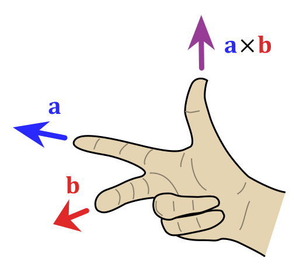

# 空间向量

## 基本概念

### 空间向量

我们推导平面向量的基本性质：

|  | 平面向量 | 空间向量 |
| :-: | :-: | :-: |
| <pre>基底分解</pre> | $\bm a=(x,y)=x\bm e_1+y\bm e_2$ | $\bm a=(x,y,z)=x\bm e_1+y\bm e_2+z\bm e_3$ |
| 线性运算 | $\lambda\bm a=\lambda(x,y)=(\lambda x,\lambda y)$ | $\lambda\bm a=\lambda(x,y,z)=(\lambda x,\lambda y,\lambda z)$ |
| 向量点积 | $(x_1,y_1)\cdot(x_2,y_2)=x_1x_2+y_1y_2$ | $(x_1,y_1,z_1)\cdot(x_2,y_2,z_2)=x_1x_2+y_1y_2+z_1z_2$ |
| 点积意义 | $\bm a_1\cdot\bm a_2=\lvert\bm a_1\rvert\cdot\lvert\bm a_2\rvert\cos\theta$ | $\bm a_1\cdot\bm a_2=\lvert\bm a_1\rvert\cdot\lvert\bm a_2\rvert\cos\theta$ |
| 向量的模 | $\lvert\bm a\rvert=\sqrt{\bm a\cdot\bm a}=\sqrt{x^2+y^2}$ | $\lvert\bm a\rvert=\sqrt{\bm a\cdot\bm a}=\sqrt{x^2+y^2+z^2}$ |

### 空间坐标系

直角坐标系也可以推广至三维空间与高维空间。

{ width="40%" }

在原本的二维直角坐标系，再添加一个垂直于 $x$ 轴、$y$ 轴的坐标轴，称为 $z$ 轴。

- 如果几何体存在互相垂直的三条棱，但是它们不交于一点，那么我们可以将它们平移到某一顶点，

- 如果几何体不存在三条棱两两垂直，但是存在侧棱垂直于底面，那么我们需要在底面上找到两条互相垂直的直线作为 $x$ 轴和 $y$ 轴，而垂直于底面的侧棱作为 $z$ 轴。

- 如果几何体不存在侧棱垂直于底面，但是存在侧面垂直于底面，我们可以利用面面垂直的性质定理找出线面垂直。

- 有时候我们会遇到空间几何中的动点问题，若动点在坐标轴上，则设出该动点坐标；若动点不在坐标轴上，而是在某线段上，则应该利用向量来表示该线段，从而得到动点坐标。

{ width="100%" }

建系方法：

- 高中一律建右手系，即 $\det(\bm i,\bm j,\bm k)=1$ 的坐标系，从形式上来看是一个逆时针的圈。判断规则（右手规则）：伸出右手，拇指指向 $x$ 轴正方向，食指指向 $y$ 轴正方向，中指指向 $z$ 轴正方向。如果这三个方向匹配，则为右手系。

- 注意：左手系与右手系的区别主要体现在涉及定向或手性的向量运算中，例如叉乘、旋转、行列式等，仅在一部分电脑程序中常用，因为以屏幕左上角为原点，横向为 $x$ 轴、纵向为 $y$ 轴、$z$ 轴表示深度延伸向屏幕内部的坐标系，为左手系。

- 或者用手的旋转：将右手四指（拇指除外）从 $x$ 轴方向弯向 $y$ 轴方向（转角小于 $\pi$），如果拇指所指的方向与 $z$ 轴方向在 $Oxy$ 平面同侧，则称此坐标系为右手坐标系，简称右手系；否则，称为左手坐标系，简称左手系。

- 非正交建系，注意此时向量的点乘（夹角）可能发生改变，但平行性不变。

- 建系的基本规则：以图形底面为 $x,y$ 平面，$y$ 轴向上延伸，尽可能的（优先把底面上的）把点放在坐标轴上、尽可能的（把底面的边线）轮廓线放在坐标轴上。

柱坐标系：如果把空间直角坐标系的坐标平面 $Oxy$ 换成极坐标系，得到的就是柱坐标系。

### 平面方程

我们知道，平面上的任意一个向量垂直于法向量，因此可以用一个法向量和平面上任意一点确定一个平面。

假设 $M_0(x_0,y_0,z_0)$ 在平面 $\alpha$ 上，平面法向量 $\bm n=(A,B,C)$，我们知道平面上任意一点 $M(x,y,z)$ 满足：

$$
\overrightarrow{MM_0}\cdot\bm n=0
$$

化简开得到一个简洁的式子：

$$
A(x-x_0)+B(y-y_0)+C(z-z_0)=0
$$

这个成为点法式方程，展开后得到一般式方程：

$$
Ax+By+Cz+D=0
$$

其中，

$$
D=-(Ax_0+By_0+Cz_0)
$$

我们知道如果 $D=0$ 那么意味着平面过原点。

平面外一点 $P(x_1,y_1,z_1)$ 到平面 $Ax+By+Cz+D=0$ 的距离为：

$$
\text{dis}=\dfrac{Ax_1+By_1+Cz_1+D}{\sqrt{A^2+B^2+C^2}}
$$

快速写出平面方程：直接写出点法式方程，观察展开。

类似的，我们还有截距式方程：

$$
\dfrac{x}{a}+\dfrac{y}{b}+\dfrac{z}{c}=1
$$

### 基本定理

类似平面向量基本定理的，有：若基底 $\bm e_1,\bm e_2,\bm e_3$ 不共面，则对于空间内任一向量 $\bm a$，存在唯一实数 $x,y,z$ 使得 $\bm a=x\bm e_1+y\bm e_2+z\bm e_3$。

我们类似平面向量共线的定义，若 $\bm e_3$ 可以表示为 $\lambda\bm e_1+\mu\bm e_2$，则称 $\bm e_3$ 与 $\bm e_1,\bm e_2$ 共面。

本质还是张成空间。

## 空间中的距离

本质是通过向量在某个方向上的投影来解题。

### 点与点的距离

根据毕达哥拉斯定理：

$$
|P_1P_2|=|\overrightarrow{P_1P_2}|=\sqrt{(x_1-x_2)^2+(y_1-y_2)^2+(z_1-z_2)^2}
$$

### 点与面的距离

如何确定一个平面？

- 三个点确定一个平面。
- 一个点和两个向量确定一个平面。
- 一个点和一个法向量确定一个平面。

其中，使用法向量最好用，因为只需要两个变量、五个参数即可确定一个平面。

什么是法向量？三维平面的法线，或称**法向量**是垂直于该平面的三维向量。曲面在某点 P 处的法线为垂直于该点切平面的向量，一个平面存在无限个法向量。因为法向量是垂直于平面内每一条直线的，因此法向量与平面内直线的点积为零。

因此，我们问题是，给点一个点 $A$ 和一个法向量 $\bm n$，求出确定的平面 $\alpha$ 外一点 $P$ 到这个平面的距离。

/// note | 一个朴素方法
是不推荐使用的，但是很 trivial 的。

我们对于点 $P$，做其到平面 $\alpha$ 的垂线，设垂足为 $P'$ 点。

我们知道此时 $PP'\bot\alpha$，也就是说 $PP'$ 与 $\bm n$ 共线，其中 $\bm n$ 表示一个法向量。

同时我们还知道平面上的点满足 $AP'\bot\bm n$，由此可以列出若干个关系式，解之即可。
///

我们直接连接点 $P$ 和点 $A$，则 $\overrightarrow{AP}$ 在 $\bm n$ 上的投影即为点到平面的距离：

$$
\begin{aligned}
|AP'|&=|\overrightarrow{AP}|\cos\theta\\
&=|\overrightarrow{AP}|\times\dfrac{|\overrightarrow{AP}\cdot\bm n|}{|\overrightarrow{AP}|\cdot|\bm n|}\\
&=\dfrac{|\overrightarrow{AP}\cdot\bm n|}{|\bm n|}
\end{aligned}
$$

即点到直线的距离为 $d=\dfrac{|\overrightarrow{AP}\cdot\bm n|}{|\bm n|}$。

根据下面进阶的部分，也可以表示为（设 $\bm a=\overrightarrow{PA}$ 以此类推）：

$$
d=\left|\dfrac{\det(\bm a,\bm b,\bm c)}{\left|\bm a\times\bm b+\bm b\times\bm c+\bm c\times\bm a\right|}\right|
$$

### 点与线的距离

给定直线 $AB$ 外一点 $C$，做 $C$ 到 $AB$ 的垂线，垂足为 $D$，求 $|CD|$。

/// note | 一个朴素方法
我们知道此时，$AB\bot CD$，即 $\overrightarrow{AB}\cdot\overrightarrow{CD}=0$。

同时，$D$ 在直线 $AB$ 上，即 $\overrightarrow{AD}=\lambda\cdot\overrightarrow{AB}$。

解之即可。
///

利用向量的知识，我们知道：

$$
|CD|=|AC|\cdot\sin\theta
$$

另外，

$$
\cos\theta=\dfrac{\overrightarrow{AC}\cdot\overrightarrow{AB}}{|AC|\cdot|AB|}
$$

解之即可。

### 线与线的距离

给定 $AB$ 和 $CD$ 为两条没有交点的直线，求其距离。

/// note | 一个朴素方法
我们知道其距离可以表示为：

- $AB$ 上一点 $M$ 和 $CD$ 上一点 $N$ 的 $|MN|$。
- 且 $MN\bot AB,MN\bot CD$。

设 $\overrightarrow{AM}=\lambda\cdot\overrightarrow{AB},\overrightarrow{CN}=\mu\cdot\overrightarrow{CD}$。

那么我们就可以用两个未知数表示出 $M,N$ 的坐标，那么就可以列出：

$$
\begin{aligned}
\overrightarrow{MN}\cdot\overrightarrow{AB}&=0\\
\overrightarrow{MN}\cdot\overrightarrow{CD}&=0
\end{aligned}
$$

解之即可。
///

我们发现这个距离其实就是两个直线任意两个点连线在公共法向量上的投影。

我们列出公共法向量 $\bm n$ 的表达式：

$$
\begin{aligned}
\bm n\cdot\overrightarrow{AB}&=0\\
\bm n\cdot\overrightarrow{CD}&=0
\end{aligned}
$$

令 $\bm n$ 的某一维为 $1$ 即可解出 $\bm n$ 的表示。

然后根据投影长度：

$$
d=\dfrac{|\overrightarrow{AC}\cdot\bm n|}{|\bm n|}
$$

其中 $AC$ 可以替换为 $AD,BC,BD$ 等。

### 面与面的距离

给定 $A\in\alpha,B\in\beta$ 两点和公共法向量 $\bm n$，求确定的平面间的距离。

/// note | 一个朴素方法
我们做出 $\beta$ 内一点 $C$，满足 $BC\bot\bm n$，列出方程：

$$
BC\bot\bm n,AC\parallel\bm n
$$

即：

$$
\overrightarrow{BC}\cdot\bm n=0,\overrightarrow{AC}=\lambda\cdot\bm n
$$

解之即可。
///

我们直接找 $A$ 点到平面 $\beta$ 的距离：

$$
d=\dfrac{|\overrightarrow{AB}\cdot\bm n|}{|\bm n|}
$$

### 线与面的距离

同理，直接令线上一点即可：

$$
d=\dfrac{|\overrightarrow{AB}\cdot\bm n|}{|\bm n|}
$$

补充：上面的竖线表示绝对值，下面的竖线表示向量的模。

## 空间中的角度

### 线与线的夹角

线线角的一般方法：

- 如果是共面直线，通过平面几何知识求解。

- 如果是异面直线，可以通过平移将其移到一个平面内。

- 通常根据中位线或者平行四边形解决。

我们将一条线平移到另一条线的平面内，容易知道夹角即为：

$$
\cos\theta=\dfrac{|\overrightarrow{AB}\cdot\overrightarrow{CD}|}{|AB|\cdot|CD|}
$$

根据 $\cos$ 的性质，注意要加绝对值。

### 线与面的夹角

注意到线与平面法向量夹角的余弦容易求得：

$$
\sin\theta=\cos\left(\dfrac\pi2-\theta\right)=\dfrac{|\overrightarrow{AB}\cdot\bm n|}{|\overrightarrow{AB}|\cdot|\bm n|}
$$

根据诱导公式可得。

三垂线定理：平面内有一条直线，如果平面外一条直线在这个平面上的射影，垂直于平面内的直线，那么平面外的这条直线与平面内的直线垂直。

### 面与面的夹角

即半平面的夹角，注意到这个一定是与两法向量夹角互补的：

$$
\theta=\dfrac{|\bm n_1\cdot\bm n_2|}{|\bm n_1|\cdot|\bm n_2|}
$$

注意绝对值。

一般方法：

- 从交线上一点做垂线，过两个交点。

- 从一个面上一点做交线的垂线，然后从垂足做垂线到另一个面。

{ width="100%" }

## 空间向量进阶

### 法向量叉乘

对于 $ABC$ 决定的面，我们随便取其组成两个不同的向量。

例如 $\overrightarrow{AB}=(x_1,y_1,z_1),\overrightarrow{AC}=(x_2,y_2,z_2)$。

我们将其坐标表示横着写两遍，取中间四个数，交叉相乘再相减。

$$
x_1\quad\boxed{y_1\quad z_1\quad x_1\quad y_1}\quad z_1
$$

$$
x_2\quad\boxed{y_2\quad z_2\quad x_2\quad y_2}\quad z_2
$$

法向量即为：

$$
\bm n=(y_1z_2-z_1y_2,z_1x_2-x_1z_2,x_1y_2-y_1x_2)
$$

或者可以直接叉乘（线性代数）：

空间中任意两个向量 $\bm A,\bm B$，规定其夹角为 $\alpha$，则其叉乘为一个向量，他的大小为 $|\bm A|\cdot|\bm b|\sin\alpha$，方向又右手定则决定：

{ width="70%" }

1. 反交换律：$a \times b = -b \times a$。
2. 系数结合律：$(\lambda a) \times b = \lambda(a \times b) = a \times (\lambda b)$。
3. 左分配律：$a \times (b + c) = a \times b + a \times c$。
4. 右分配律：$(b + c) \times a = b \times a + c \times a$。

三维空间中两个向量：

\[
\bm{a} = \begin{pmatrix}x_1 \\ y_1 \\ z_1\end{pmatrix}, \quad \bm{b} = \begin{pmatrix}x_2 \\ y_2 \\ z_2\end{pmatrix}
\]

的叉积定义为：

\[
\bm{a} \times \bm{b} = \begin{pmatrix}
y_1z_2 - z_1y_2 \\
z_1x_2 - x_1z_2 \\
x_1y_2 - y_1x_2
\end{pmatrix}
\]

使用行列式：

\[
\begin{vmatrix}
i & j & k \\
x_1 & y_1 & z_1 \\
x_2 & y_2 & z_2
\end{vmatrix}
\]

具体展开为：

\[
\bm{n} = \begin{vmatrix}y_1 & z_1 \\ y_2 & z_2\end{vmatrix} \bm{i} -\begin{vmatrix}x_1 & z_1 \\ x_2 & z_2\end{vmatrix} \bm{j} +\begin{vmatrix}x_1 & y_1 \\ x_2 & y_2\end{vmatrix} \bm{k}
\]

### 张成空间法

在 $N$ 维的单纯性（$N$ 维椎体）中，从原点出发张成的 $N$ 维单纯性的体积为：

$$
V=\dfrac{1}{n!}\left|\det(\bm v_1,\bm v_2,\dots,\bm v_N)\right|
$$

例如，在二维空间中，三角形的面积：

$$
V=\dfrac{1}{2}\left|\det(\bm v_1,\bm v_2)\right|=\dfrac{1}{2}\left|\bm v_1\times\bm v_2\right|
$$

在三维空间其张成的平行六面体体积，就是一个混合积：

$$
V=\dfrac{1}{6}\left|\det(\bm v_1,\bm v_2,\bm v_3)\right|=\dfrac{1}{6}\left|\bm v_1\cdot(\bm v_2\times \bm v_3)\right|
$$

另外，三维空间中 $N$ 棱锥的底面面积可以用（注意选定顶点后，保证底面为平面图形）：

$$
S=\dfrac{1}{2}\left|\sum_{i=1}^N\bm v_i\times \bm v_{i+1}\right|
$$

其中 $\bm v_{n+1}=\bm v_1$来表示，然后用前面讲的点到直线的距离即可。

$$
V = \dfrac{1}{6} \left| \bm{v}_1 \cdot \left( \sum_{i=1}^{n} \bm{v}_i \times \bm{v}_{i+1} \right) \right|
$$

来自 Qwen3-235B-A22B 的一个我并不理解的公式。

四点共面问题：

- 我们用一个行列式表示：

    $$
    \begin{vmatrix}
    x_1&y_1&z_1&1\\
    x_2&y_2&z_2&1\\
    x_3&y_3&z_3&1\\
    x_4&y_4&z_4&1
    \end{vmatrix}=0
    $$

- 更加直观的做法是：

    对于四点 $A,B,C,D$，取任意三对向量，例如 $\bm b=\overrightarrow{AB},\bm c,\bm d$ 以此类推。
    
    课内解法是判断三点确定的面的法向量与另一个点确定的一个直线是否垂直，我们知道令 $\bm n=\bm b\times\bm c$ 即为法向量，那么只需要判断 $\bm n\cdot\bm d=0$ 即可，这就是一个混合积。
    
    容易理解的是，若 $\bm b,\bm c,\bm d$ 张成的平行六面体体积为零，即 $\det(\bm b,\bm c,\bm d)=0$ 则四点共面。混合积相当于先叉乘再点乘，也就是两者等价。

### 齐次坐标

齐次坐标是一种用 $n+1$ 维向量表示 $n$ 维向量的方法，它统一了平移、旋转、投影等变换为矩阵乘法，简化来讲，用 $(x,y,z,w)$ 表示：

- 若 $w=0$，则 $(x,y,z,0)$ 表示**向量** $(x,y,z)$。

- 对于非零实数 $w$，$(x,y,z,w)$ 表示点 $(x/w,y/w,z/w)$，即**透视除法**。

- 特殊的若 $w=1$，则 $(x,y,z,1)$ 表示**点** $(x,y,z)$。

我们将其带入平移矩阵：

$$
T=\begin{bmatrix}
1&0&0&t_x\\
0&1&0&t_y\\
0&0&1&t_z\\
0&0&0&1
\end{bmatrix}
$$

我们用这个矩阵去乘以一个齐次坐标，容易发现向量（$w=0$）是无法平移的，而点是可以平移的。同样，以前的矩阵用 $0$ 和 $1$ 填充即可：

-   **平移** `T(tx, ty, tz)`

    ---

    $$
    \begin{bmatrix}
    1 & 0 & 0 & t_x \\
    0 & 1 & 0 & t_y \\
    0 & 0 & 1 & t_z \\
    0 & 0 & 0 & 1
    \end{bmatrix}
    $$

-   **缩放** `S(sx, sy, sz)`

    ---

    $$
    \begin{bmatrix}
    s_x & 0 & 0 & 0 \\
    0 & s_y & 0 & 0 \\
    0 & 0 & s_z & 0 \\
    0 & 0 & 0 & 1
    \end{bmatrix} $$

-   **绕 $X$ 轴旋转** `Rx(θ)`

    ---

    $$ \begin{bmatrix} 1 & 0 & 0 & 0 \\ 0 & \cos\theta & -\sin\theta & 0 \\ 0 & \sin\theta & \cos\theta & 0 \\ 0 & 0 & 0 & 1 \end{bmatrix} $$

-   **绕 $Y$ 轴旋转** `Ry(θ)`

    ---

    $$
    \begin{bmatrix}
    \cos\theta & 0 & \sin\theta & 0 \\
    0 & 1 & 0 & 0 \\
    -\sin\theta & 0 & \cos\theta & 0 \\
    0 & 0 & 0 & 1
    \end{bmatrix} $$
    
-   **绕 $Z$ 轴旋转** `Rz(θ)`

    ---

    $$
    \begin{bmatrix}
    \cos\theta & -\sin\theta & 0 & 0 \\
    \sin\theta & \cos\theta & 0 & 0 \\
    0 & 0 & 1 & 0 \\
    0 & 0 & 0 & 1
    \end{bmatrix}
    $$
    
-   罗德里格（Rodrigues）旋转公式

    ---

    不会。

## [todo]

### 双垂直定理

### 双余弦定理

### 双正弦定理

### 空间余弦定理

- 空间第一余弦定理：如图，$AE\perp BC,DF\perp BC$，则二面角 $A-BC-D$ 的大小 $\theta$ 满足

    $$
    \cos\theta=\frac{AE^2+EF^2+FD^2-AD^2}{2AE\cdot FD}
    $$

- 空间第二余弦定理：空间中两直线 $AB,CD$ 的夹角 $\theta$ 满足

    $$
    \cos\theta=\frac{|AD^2+BC^2-AC^2-BD^2|}{2AB\cdot CD}
    $$

