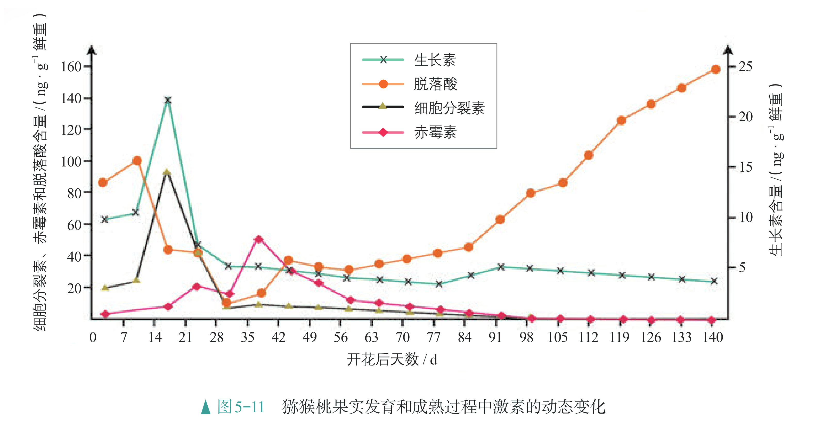
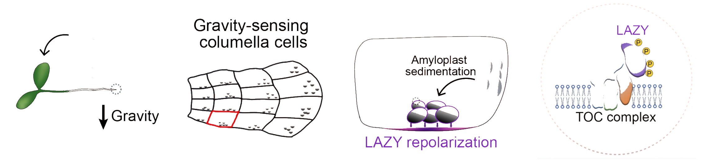

# 植物概述

## 植物的调节

高等植物是由很多细胞组成的高度复杂的有机体，它的正常生长发育需要各个器官、组织、细胞之间的协调和配合。植物生长发育的调控，是由基因表达调控、激素调节和环境因素调节共同完成的。

植物细胞里储存着全套基因，但是某个细胞的基因如何表达则会根据需要作调整。植物的生长、发育、繁殖、休眠，都处在基因适时选择性表达的调控之下。

对于多细胞植物体来说，细胞与细胞之间、器官与器官之间的协调，需要通过激素传递信息。激素作为信息分子，会影响细胞的基因表达，从而起到调节作用。同时，激素的产生和分布是基因表达调控的结果，也受到环境因素的影响。

在个体层次，植物生长、发育、繁殖、休眠，实际上，是植物响应环境变化，调控基因表达以及激素产生、分布，最终表现在器官和个体水平上的变化。

### 生长素的发现

我国宋代著作《种艺必用》中，记载了一种促进空中压条生根的方法：“凡嫁接矮果及花，用好黄泥晒干，筛过，以小便浸之。又晒干，筛过，再浸之。又晒又浸，凡十余次。以泥封树枝……则根生。”

单子叶植物，特别是禾本科植物胚芽外的锥形套状物叫作胚芽鞘，它能保护生长中的胚芽。种子萌发时，胚芽鞘首先钻出地面，出土后还能进行光合作用。

- 19 世纪末，达尔文和他的儿子，设计了实验来探讨植物向光性的原因。实验发现，在受到单侧光照射时，金丝雀草（一种禾本科植物）胚芽鞘会向光弯曲生长；如果去掉胚芽鞘的尖端，或者用锡箔罩子把尖端罩上，则不发生弯曲；如果罩上的是尖端下面的一段，胚芽鞘仍会弯向光源生长。

    达尔文根据实验提出，胚芽鞘的尖端受单侧光刺激后，向下面的伸长区传递了某种“影响”，造成伸长区背光面比向光面生长快，因而使胚芽鞘出现向光性弯曲。

- 1913 年，鲍森·詹森的实验证明，胚芽鞘尖端产生的“影响”可以透过琼脂片传递给下部。

- 1918 年，拜尔的实验证明，胚芽鞘的弯曲生长，是因为尖端产生的影响在其下部分布不均匀。

- 取一段玉米胚芽鞘，切去顶端 $\pu{2mm}$，使胚芽鞘不再产生生长素。在上端放一块含有生长素的琼脂，下端放一块不含生长素的琼脂（胚芽鞘形态学上端朝上）。过一段时间检测，发现下端的琼脂块逐渐有了生长素。

这些实验初步证明尖端产生的影响可能是一种化学物质，这种化学物质在胚芽鞘尖端以下部位的分布不均匀造成了胚芽鞘的弯曲生长。

{ width="85%" }
/// caption
达尔文的实验示意图
///

{ width="98.5%" }
/// caption
鲍森·詹森的实验示意图
///

{ width="60%" }
/// caption
拜尔的实验示意图
///

{ width="75%" }
/// caption
实验前$\kern{5em}$实验后
///

- 1926 年，荷兰科学家温特做了以下实验：把切下的燕麦胚芽鞘尖端放在琼脂块上，几小时后，移去尖端，将琼脂切成小块；再将经处理过的琼脂块放在切去尖端的燕麦胚芽鞘一侧，结果胚芽鞘会朝对侧弯曲生长。如果放上的是没有接触过胚芽鞘尖端的琼脂块，胚芽鞘则既不生长也不弯曲。

    温特的实验进一步证明胚芽鞘的弯曲生长确实是由一种化学物质引起的。温特认为这可能是一种和动物激素类似的物质，并把这种物质命名为生长素。

    { width="100%" }

- 1934 年，科学家首先从人尿中分离出与生长素作用相同的化学物质——吲哚乙酸（IAA）。但是，由于生长素在植物体内含量极少，直到 

- 1946 年人们才从高等植物中将其分离出来，并确认它也是 IAA。进一步研究发现，植物体内具有与 IAA 相同效应的物质还有苯乙酸（PAA）、吲哚丁酸（IBA）等，它们都属于生长素。

生长素的发现使人们认识到，植物的向光性是由生长素分布不均匀造成的：单侧光照射后，胚芽鞘背光一侧的生长素含量多于向光一侧，因而引起两侧的生长不均匀，从而造成向光弯曲。关于植物向光性生长的原因，目前还有争议。有学者根据一些实验结果提出，植物向光性生长，是由单侧光照射引起某些抑制生长的物质分布不均匀造成的。

- 生长素主要的合成部位是芽、幼嫩的叶和发育中的种子。在这些部位，色氨酸经过一系列反应可转变成生长素。

    在胚芽鞘、芽、幼叶和幼根中，生长素只能从形态学上端运输到形态学下端，而不能反过来运输，也就是只能单方向地运输，称为极性运输。
    
    极性运输是一种主动运输，需要载体（向下出细胞需要通过载体参与），而载体的分布可以受到重力、光照等的影响，从而决定了这种极性运输是单向、向下的。而光照对这种载体的影响，导致了其偏向一侧，从而生长素运输过程中，产生了分布不均匀的现象，从而导致向光性的产生。
    
    在成熟组织中，生长素可以通过输导组织进行非极性运输。生长素的非极性运输和其他有机物的运输没有区别。

- 生长素在植物体各器官中都有分布，但相对集中分布在生长旺盛的部分，如胚芽鞘、芽和根尖的分生组织、形成层、发育中的种子和果实等处。

    在植物体内，生长素在细胞水平上起着促进细胞伸长生长、诱导细胞分化等作用；在器官水平上则影响器官的生长、发育，如促进侧根和不定根发生，影响花、叶和果实发育等。

- 生长素在植物体内起作用的方式和动物体内激素起作用的方式基本相似，它不像酶那样催化细胞代谢，也不为细胞提供能量，而是给细胞传达信息，起着调节细胞生命活动的作用。

    生长素首先与细胞内某种蛋白质——生长素受体特异性结合，引发细胞内发生一系列信号转导过程，进而诱导特定基因的表达，从而产生效应。

{ width="60%" }

研究发现，生长素所发挥的作用，因浓度、植物细胞的成熟情况和器官的种类不同而有较大的差异。一般情况下，生长素在浓度较低时促进生长，在浓度过高时则会抑制生长。

拓展：生长素与细胞膜上的受体结合，激活了膜上的质子泵，质子泵将细胞内的 $\ce{H+}$ 泵到细胞壁中，导致细胞壁酸化。酸性环境激活了细胞壁中的一种叫做“扩展蛋白”的酶，这种酶能打断连接纤维素的化学键，使细胞壁变得松散。最后，细胞内的膨压驱动细胞“吹气球”一样变大，从而实现伸长。

顶端优势：顶芽产生的生长素逐渐向下运输，枝条上部的侧芽处生长素浓度较高，侧芽的发育受到抑制，植株因而表现出顶端优势。去掉顶芽后，（此处理论不准确，实际上的原理相当复杂）侧芽处的生长素浓度降低，于是侧芽萌动、加快生长。顶端优势原理在农业生产和园艺上得到广泛利用。

- 农民会适时摘除棉花的顶芽以促进侧芽的发育，从而使它多开花、多结果。

- 园艺师会适时修剪景观树木，让树木发出更多的侧枝，使树型圆润、丰满。

幼嫩的细胞对生长素敏感，衰老细胞则比较迟钝；不同器官对生长素的敏感程度也不一样。

### 植物激素概述

在我国宋元时期某著作中写道：“红柿摘下未熟，每篮用木瓜两三枚放入，得气即发，并无涩味。”成熟的果实中富含乙烯，它可以对邻近的果实产生影响。

在发现生长素之后，人们又陆续发现了赤霉素、细胞分裂素、脱落酸和乙烯等物质。人们把这类由植物体内产生，能从产生部位运送到作用部位，对植物的生长发育有显著影响的微量有机物，叫作植物激素。植物激素作为信息分子，几乎参与调节植物生长、发育过程中的所有生命活动。

- 1926 年，科学家观察到，当水稻感染了赤霉菌后，会出现植株疯长的现象，病株往往比正常植株高 50% 以上，并且结实率大大降低，因而称为恶苗病。研究者将赤霉菌培养基的滤液喷施到水稻幼苗上，发现这些幼苗虽然没有感染赤霉菌，但也出现恶苗病的症状。
    
- 1935 年，科学家从培养基滤液中分离出致使水稻患恶苗病的物质，称之为赤霉素（简称 GA）。到 20 世纪 50 年代，科学家发现被子植物体内存在赤霉素。

- 此后，科学家进一步研究，不但发现赤霉素在植物中普遍存在，而且知道了植物体内的赤霉素包括许多种。后来，科学家发现了植物体内还有其他植物激素，并逐渐弄清楚了这些植物激素的生理作用。

其他植物激素（五类植物激素、第六类植物激素）的合成部位和主要生理作用：

- 赤霉素（主要在在幼芽、幼根和未成熟的种子等部位合成）：促进细胞伸长，从而引起植株增高；促进细胞分裂与分化；促进种子萌发、开花和果实发育。

- 细胞分裂素（主要在根尖合成）：促进细胞分裂；促进芽的分化、侧枝发育、叶绿素合成。

- 乙烯（在植物体各个部位都可能合成）：促进果实成熟；促进开花；促进叶、花、果实脱落。

- 脱落酸（在根冠、萎蔫的叶片等部位合成）：抑制细胞分裂；促进气孔关闭；促进叶和果实的衰老和脱落；维持种子休眠。

- 油菜素内酯（第六类植物激素）：促进茎、叶细胞的扩展和分裂，促进花粉管生长、种子萌发等。

植物激素在植物内的含量虽然微少，但是在调节植物生长发育上的作用却非常重要。例如在菜豆未成熟的种子中，赤霉素含量较高，但也不到种子质量的亿分之一。

一般来说，植物激素对植物生长发育的调控，是通过调控细胞分裂、细胞伸长、细胞分化和细胞死亡等方式实现的。

- 在植物的生长发育和适应环境变化的过程中，某种激素的含量会发生变化；同时，各种植物激素并不是孤立地起作用，而是多种激素共同调控植物的生长发育和对环境的适应。

    生长素主要促进细胞核的分裂，而细胞分裂素主要促进细胞质的分裂，二者协调促进细胞分裂的完成，表现出协同作用。

    在调节种子萌发的过程中，赤霉素促进萌发，脱落酸抑制萌发，二者作用效果相反。

    { width="100%" }

    不同激素在代谢上还存在着相互作用，例如，当生长素浓度升高到一定值时，就会促进乙烯的合成；乙烯含量的升高，反过来会抑制生长素的作用。

- 在植物各器官中同时存在着多种植物激素，决定器官生长、发育的，往往不是某种激素的绝对含量，而是不同激素的相对含量。

    黄瓜茎端的脱落酸与赤霉素的比值较高，有利于分化形成雌花，比值较低则有利于分化形成雄花。

- 在植物生长发育过程中，不同种激素的调节还往往表现出一定的顺序性。

    { width="100%" }

    在猕猴桃果实的发育过程中，细胞分裂素、生长素、赤霉素、脱落酸等激素的含量会像接力一样按照次序出现高峰，调节着果实的发育和成熟。

拓展内容：将 Phytohormone 翻译为植物激素是有争议的，更严谨的，应当叫做“植物生长调节物质”。

1. 植物没有“腺体”，几乎所有活细胞在特定条件下都能产生某种或多种激素，作用范围可远可近，甚至可以作用于自身。这是一个“去中心化”的分布式调节网络。

2. 动物激素作用高度专一，靶细胞上有它的特异性受体。而植物激素的“一专多能”现象非常普遍。比如，生长素既能促进顶端优势，又能促进生根，还能促进果实发育。它的作用取决于浓度、作用部位、细胞的发育阶段以及与其他激素的相互作用。

3. 运输方式不同：动物激素依赖血液循环。植物激素则可以通过薄壁细胞间的扩散、韧皮部或木质部长距离运输，方式更加多样和灵活。

在众多植物激素中，五大激素只是相对重要的一些，实际上这个网络组成相当复杂，还有油菜素内酯、茉莉酸、水杨酸、独脚金内酯等等。它们之间不是简单的协同或拮抗关系，而是一个极其复杂的调控网络，是一种信号交叉或交互对话。

以顶端优势为例，其实际原理是植物激素比例的比率不同，相互作用的最终结果。当实验结果无法用两种激素的简单拮抗或协同解释时，可能还存在其他激素的共同调节，或是多种激素综合作用的结果。

### 植物生长调节剂

植物体内的激素含量非常少，提取困难。人们在多年的研究和实践中，发现一些人工合成的化学物质，具有与植物激素相似的化学性质。这些由人工合成的，对植物的生长、发育有调节作用的化学物质，称为植物生长调节剂。植物生长调节剂具有原料广泛、容易合成、效果稳定等优点，在农林园艺生产上得到广泛的应用。

植物生长调节剂种类很多，我国目前正在使用的就有几十种。不过，从分子结构来看，主要有两大类：一类分子结构和生理效应与植物激素的类似，如吲哚丁酸；另一类分子结构与植物激素的差别较大，但具有与植物激素类似的生理效应，如 $\alpha$-萘乙酸（NAA）、矮壮素等。

- 在玫瑰葡萄种植过程中，合理施用人工合成的赤霉素、细胞分裂素类物质，可以提高葡萄结果率和单果质量，提高果实无核化程度。但如果施用不合理，可能会造成果实空心等问题。

- 在用传统方法生产啤酒时，大麦芽是不可缺少的原材料。利用大麦芽，实质是利用其中的 $\alpha$-淀粉酶。有人用赤霉素处理大麦，可以使大麦种子无须发芽就能产生 $\alpha$-淀粉酶。

- 对西瓜、草莓、葡萄等使用一定浓度的膨大剂（也叫膨大素），会使水果长势加快、个头变大，加快水果成熟，使其提前上市。但使用膨大剂的水果与正常水果相比，口感较差，汁水较少，甜味不足，而且不宜长时间储存。

- 在蔬菜、水果上残留的一些植物生长调节剂会损害人体健康。可以延长马铃薯、大蒜、洋葱储藏期的青鲜素（抑制发芽）可能有副作用。

由于植物生长调节剂的使用效果与浓度、使用时期、使用方法等都有密切关系，如果使用不当，不仅达不到预期目的，反而会造成损失。植物生长调节剂不是营养物质，也不是万灵药，只有配合浇水、施肥等措施，适时施用，才能发挥效果。

乙烯利是一种植物生长调节剂，工业品为液体。当溶液 $\pH<3.5$ 时，它比较稳定；但随着溶液 $\pH$ 升高，它会分解释放出乙烯。乙烯对水果有催熟作用，还可以进一步诱导水果自身产生乙烯，加速水果成熟。乙烯利对皮肤、黏膜有一定的刺激性，操作时需要做好防护措施，并在通风良好的环境进行。乙烯利遇到明火可燃烧，需要注意防火。

植物生长调节剂种类繁多，在生产上首先需要根据实际情况，选择恰当的植物生长调节剂；还要综合考虑施用目的、效果和毒性，调节剂残留、价格和施用是否方便等因素。对于某种植物生长调节剂来说，施用浓度、时间、部位以及施用时植物的生理状态和气候条件等，都会影响施用效果，施用不当甚至会影响生产。

植物生长调节剂应用领域广，对于提高作物产量、改善产品品质等，都起到很好的作用。新的植物生长调节剂不断被发现和使用；植物生长调节剂的应用范围更加广泛，在生产中发挥着越来越重要的作用。

我国对于植物生长调节剂的生产、销售和使用都有明确的规定。在我国，植物生长调节剂属于农药管理范围，只有取得农药登记并获得生产许可的植物生长调节剂产品，才能生产、经营和使用。

### 环境因素调节

植物的生长发育过程始终在环境因素的影响、调节下完成。光在植物生长、发育的全过程中都起调节作用。温度、重力等其他环境因素也参与调节植物的生长发育。

- 在单侧光的照射下，植物朝向光源方向生长的现象叫作向光性。

- 少数植物（如烟草和莴苣）的种子需要在有光的条件下才能萌发，有些植物（如早熟禾、毛蕊花）的种子在有光条件下萌发得好一些，还有一些植物（如洋葱、番茄）的种子萌发，则受光的抑制。

    研究发现，萌发需要光的种子一般较小，储藏的营养物质也很少。

- 豆芽是在黑暗的环境中培育的，它的细胞中不含叶绿素，茎（实际上很大一部分是下胚轴）比在光下要长很多。豆芽一旦见光，就会发生形态变化并长成豆苗。

- 很多植物的开花与昼夜长短有关。例如，菠菜只有白天长度超过 13 小时才开花；菊、水稻则要在白天短于一定的时长才开花。当然，也有不少植物的开花与昼夜长短没有关系，如黄瓜、棉花、向日葵等。

    注意：此处的“白天长度”并不严谨，实际上植物感应的关键不是光照时间的长短，而是连续黑暗期的长短。但是因为一天的时长相对固定，因此昼夜变化就近似为了白天长度。

在自然界中，种子萌发，植株生长、开花、衰老，等等，都会受到光的调控。植物的向光性生长，实际上也是植物对光刺激的反应。光作为一种信号，影响、调控植物生长、发育的全过程。

植物能够对光作出反应，表明植物可以感知光信号，并据此调整生长发育。植物具有能接收光信号的分子，光敏色素是其中的一种。光敏色素主要吸收红光和远红光。植物体内除了光敏色素，还有感受蓝光的受体。可以认为，环境中的红光、蓝光，对于植物的生长发育来说，是非常关键的。

光敏色素是一类蛋白质（色素—蛋白复合体），分布在植物的各个部位，其中在分生组织的细胞内比较丰富。在受到光照射时，光敏色素的结构会发生变化，这一变化的信息会经过信息传递系统传导到细胞核内，影响特定基因的表达，从而表现出生物学效应。

光对植物生长发育的调节作用尤为重要，而除了光，温度、重力等环境因素也会参与调节植物的生长发育。

- 随着昼夜交替，气温午高夜低，植物的代谢也会有旺盛和缓慢之分。植物的所有生理活动都是在一定的温度范围内进行，温度可以通过影响种子萌发、植株生长、开花结果和叶的衰老、脱落等生命活动，从而参与调节植物的生长发育。此外，植物分布的地域性很大程度上就是由温度决定的。

    温带地区，树木年复一年地加粗，构成一圈圈的年轮，表现出季节周期性变化。年轮形成的原因是：在春夏季细胞分裂快、细胞体积大，在树干上形成颜色较浅的带；在秋冬季细胞分裂慢、细胞体积较小，树干上形成颜色较深的带。

    有些植物在生长期需要经历一段时期的低温之后才能开花。这种经历低温诱导促使植物开花的作用，称为春化作用。冬小麦、冬大麦、蕙兰等就是这样。

- 重力是调节植物生长发育和形态建成的重要环境因素。植物根向地、茎背地生长，就是在重力的调节下形成的。植物的根、茎中具有感受重力的物质和细胞，可以将重力信号转换成运输生长素的信号，造成生长素分布的不均衡，从而调节植物的生长方向。

    { width="100%" }

    “淀粉—平衡石假说”是被普遍承认的一种解释重力对植物生长调节的机制。这种假说认为，植物对重力的感受是通过体内一类富含“淀粉体”的细胞，即平衡石细胞来实现的。例如，当根的放置方向发生改变时，平衡石细胞中的“淀粉体”就会沿着重力方向沉降，引起植物体内一系列信号分子的改变，如通过影响生长素的运输导致生长素沿着重力刺激的方向不对称分布，从而造成重力对植物生长的影响。

- 花期调控技术：人工控制花期，可以使得植物提前或延后开花。人工控制花期主要的途径有温度处理、光照处理、生长调节剂处理及栽培措施处理等四种。利用温度调控促进花芽发育或抑制花芽发育等措施，可以起到提早或延迟花期的作用。利用控制光照时间长短、施用植物生长调节剂等措施，也可以达到同样的效果。通过调节花卉的种植期，采用适当的修剪、摘心、水肥控制等措施，也可有效地调控花期。
