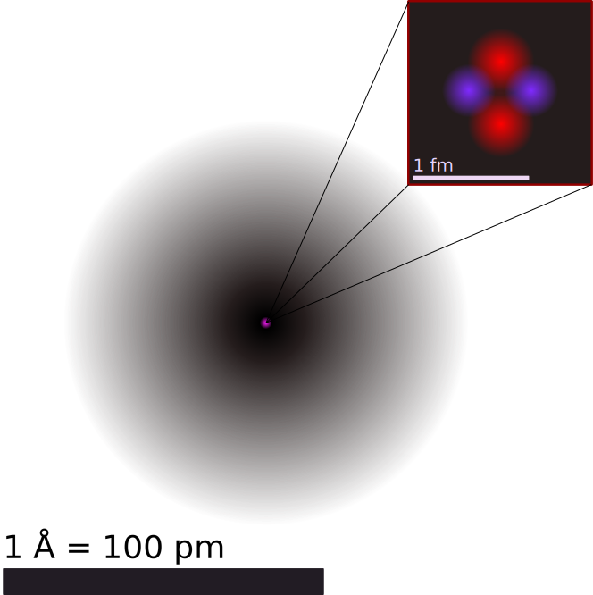

# 原子与元素

## 核物理初步

### 射线与放射性

1895 年年末，德国物理学家**伦琴**发现了一种新的射线——**X 射线**（即伦琴射线）。它具有一定的辐射性。现在我们知道，X 射线是原子内层电子跃迁时发射的波长很短的电磁波。

法国物理学家**贝克勒尔**对荧光研究了多年，他决定研究荧光与 X 射线的关系。1896 年年初，他选择了在日光照晒时能发出荧光的铀盐——硫酸铀酰钾做实验材料。他用黑纸把照相底片包住，放到这种铀盐的下面，在阳光下曝晒了几小时。底片显影后，发现了铀盐在底片上的黑色轮廓，表示底片已经感“光”。阳光是不能透过黑纸的，贝克勒尔认为，这种铀盐受到阳光照射后除了能够发出可见的荧光外，还能发射 X 射线，是 X 射线透过黑纸使底片感光。再次准备实验的时候遇到了几个阴天，贝克勒尔只好把准备好的铀盐和包好的底片一起放进了抽屉。几天以后，贝克勒尔在检查底片时意外发现底片又已经感光。这个事实使贝克勒尔认为铀盐本身能够发射一种神秘的射线，正是这种射线导致了底片感光。贝克勒尔进一步用不发荧光的其他铀化合物进行实验，发现也能使底片感光。铀化合物发出的射线也像 X 射线一样能穿透多种物质。他还发现，只要有铀元素存在，不论是什么化合物，就一定有这种贯穿本领很强的射线发出。贝克勒尔认为这种射线不是 X 射线；他还进一步指出，发出射线的能力是**铀原子自身的性质**。

1897 年，**居里夫人**在撰写博士论文时选择了贝克勒尔发现的射线作为研究课题。她首先证实，铀盐发出射线的强度只与化合物中铀的含量成正比，而与化合物的种类无关，也不受光照、加热、通电等因素的影响。由此，她确认这一现象的起因在于原子内部，并提出了“**放射性**”这个词。居里夫妇提出了一个重要的问题：是否还有其他元素也具有这种性质？他们决定检查当时知道的所有元素，结果发现钍也发射类似的射线。居里夫妇还发现，某些含有铀钍混合物矿石的辐射强度比已测到的铀和钍的放射性强得多，他们大胆假定这些矿石中含有当时尚不知晓的某种其他放射性元素，并一起开始了一项艰苦的工作：从沥青铀矿中分离这种新元素。1898 年 7 月，他们得到了一种放射性比铀强 400 倍的新元素，并把它命名为**钋**（$\ce{Po}$）。同年 12 月，他们又发现了放射性比铀强百万倍的**镭**（$\ce{Ra}$）。居里夫妇经过艰苦繁重的工作，在几万次提炼之后，终于在 1902 年从 $8\text{ t}$ 沥青铀矿渣中提炼出 $\pu{0.12 g}$ 纯净的氯化镭，向世人证实了镭元素的存在。进一步研究后，发现这种矿物中还存在着两种能够发出更强射线的新元素，居里夫人把其中一种元素命名为钋（$\ce{Po}$），另一种元素命名为镭（$\ce{Ra}$）。

物质发出射线的性质称为**放射性**，具有放射性的元素称为**放射性元素**。后来发现，放射性并不是少数元素才有的，原子序数大于 83 的元素，都能自发地发出射线，原子序数小于或等于 83 的元素，有的也能发出射线。放射性元素自发地发出射线的现象，叫作**天然放射现象**。

把放射源铀、钋或镭放入用铅做成的容器中，射线只能从容器的小孔射出，成为细细的一束。若在射线经过的空间施加磁场，可以发现射线分裂成三束，其中两束在磁场中向不同的方向偏转，这说明它们是带电粒子流；另一束在磁场中不偏转，说明它不带电。于是，人们把这三种射线分别叫作 $\alpha$ 射线、$\beta$ 射线和 $\gamma$ 射线。物理学家经过多方面的研究后确认这三种射线具有以下特征：

- **$\alpha$ 射线**：是 $\alpha$ 粒子流。$\alpha$ 粒子带正电，电荷量是电子的 $2$ 倍，质量是氢原子的 $4$ 倍，其组成与氦原子核相同。$\alpha$ 粒子的速度可以达到光速的 1/10。由于 $\alpha$ 粒子带电，质量又比较大，通过气体时很容易把气体分子中的电子剥离，使气体电离。由于与物质中的微粒作用时会损失自己的能量，$\alpha$ 粒子的穿透能力较弱，在空气中只能前进几厘米，用一张纸就能把它挡住。

- **$\beta$ 射线**：是电子流，速度可以接近光速。$\beta$ 射线的电离作用较弱，穿透能力较强，很容易穿透黑纸，也能穿透几毫米厚的铝板。

- **$\gamma$ 射线**：是一种电磁波，波长很短的光子，波长在 $10^{-10} \text{ m}$ 以下。$\gamma$ 射线的电离作用更弱，穿透能力更强，甚至能穿透几厘米厚的铅板和几十厘米厚的混凝土。

实验发现，如果一种元素具有放射性，那么，无论它是以单质存在的，还是以化合物形式存在的，都具有放射性。放射性的强度也不受温度、外界压强的影响。由于元素的化学性质决定于原子核外的电子，这就说明射线与这些电子无关，也就是说，**射线来自原子核**。这说明原子核内部是有结构的。

{ width="90%" }

**威耳逊云室**：由微观粒子构成的射线，肉眼是看不见的。但是，射线中的粒子与其他物质作用时产生的现象，会显示射线的存在。威耳逊云室就是一种常用的射线探测装置。云室里面有干净的空气。实验时，先往云室里加少量酒精，使室内充满酒精的饱和蒸气，然后迅速向下拉动活塞，室内气体膨胀，温度降低，酒精蒸气达到过饱和状态。这时如果有粒子在室内气体中飞过，使沿途的气体分子电离，过饱和酒精蒸气就会以这些离子为核心凝结成雾滴，于是显示出粒子运动的径迹。$\alpha$ 粒子的质量比较大，在气体中飞行时不易改变方向。由于它的电离本领大，沿途产生的离子多，所以它在云室中的径迹直而清晰。高速 $\beta$ 粒子的径迹又细又直，低速 $\beta$ 粒子的径迹又短又粗而且是弯曲的。$\gamma$ 射线的电离本领很小，在云室中一般看不到它的径迹。

很多元素都存在一些具有放射性的同位素，它们被称为**放射性同位素**。天然放射性同位素不过 40 多种，而今天通过核反应生成的人工放射性同位素已达 3000 多种，每种元素都有了自己的放射性同位素。与天然放射性物质相比，人工放射性同位素的放射强度容易控制，半衰期比较短，因此放射性废料容易处理，获得了广泛的应用。

- 射线测厚仪：工业部门可以使用放射性同位素发出的射线来测厚度。例如，轧钢厂的热轧机上可以安装射线测厚仪，让 $\gamma$ 射线穿过钢板，仪器探测到的 $\gamma$ 射线强度与钢板的厚度有关，轧出的钢板越厚，透过的射线越弱。

- 诱变育种：利用 $\gamma$ 射线照射种子，会使种子的遗传基因发生变异，经过筛选，可以培育出新品种。

- 放射治疗：人体组织对射线的耐受能力是不同的，细胞分裂越快的组织，它对射线的耐受能力就越弱。像癌细胞那样，不断迅速繁殖的、无法控制的细胞组织，在射线照射下破坏得比健康细胞快。

- 示踪原子：一种放射性元素的原子核，跟这种元素其他同位素的原子核具有相同数量的质子，因此，核外电子的数量也相同。由此可知，一种元素的各种同位素都有相同的化学性质。这样，我们可以用放射性同位素代替非放射性的同位素来制成各种化合物，这种化合物的原子跟通常的化合物一样参与所有化学反应，但却带有“放射性标记”，可以用仪器探测出来。这种原子就是示踪原子。

    棉花在开花、结桃的时候需要较多的磷肥，把磷肥喷在棉花叶子上，磷肥也能被吸收。用磷的放射性同位素制成肥料喷在棉花的叶面上，然后每隔一定时间用探测器测量棉株各部位的放射性强度，就可以研究什么时候的吸收率最高、磷在作物内能存留多长时间、磷在作物体内的分布情况等。

    人体甲状腺的工作需要碘，碘被吸收后聚集在甲状腺内。给人注射碘的放射性同位素碘 131，在颈部底部的甲状腺，被放射性示踪剂碘 131 高亮着色。定时用探测器测量甲状腺及邻近组织的放射强度，有助于诊断甲状腺的疾病。

    近年来，有关生物大分子的结构及其功能的研究，几乎都要借助于示踪原子。

- 碳 $14$ 测年技术：自然界中的碳主要是碳 $12$，也有少量的碳 $14$。宇宙射线进入地球大气层时，同大气作用产生中子，中子撞击大气中的氮引发核反应产生碳 $14$。碳 $14$ 具有放射性，能够自发地进行 $\beta$ 衰变而变成氮。碳 $14$ 的半衰期为 5730 年。

    碳 $14$ 不断产生又不断衰变，达到动态平衡，因此，它在大气中的含量相当稳定，大约每 $10^{12}$ 个碳原子中有一个碳 $14$。活的植物通过光合作用和呼吸作用与环境交换碳元素，体内碳 $14$ 的比例与大气中的相同。植物枯死后，遗体内的碳 $14$ 仍在衰变，不断减少，但是不能得到补充。因此，根据放射性强度减小的情况就可以推算植物死亡的时间。

人类一直生活在放射性的环境中。地球上的每个角落都有来自宇宙的射线，我们周围的岩石，其中也有放射性物质。我们的食物和日常用品中，有的也具有放射性，例如，食盐和有些水晶眼镜片中含有钾 $40$，香烟中含有钋 $210$，不过它们辐射的强度都在安全剂量之内。然而过量的射线对人体组织有破坏作用。因此，在使用放射性同位素时，必须严格遵守操作规程，注意人身安全，同时，要防止放射性物质对空气、水源、用具等的污染。

### 原子与原子核

科学家在研究稀薄气体放电时发现，当玻璃管内的气体足够稀薄时，阴极就发出一种射线，称为**阴极射线**。对这种射线本质的认识有两种观点：一种观点认为，它是一种电磁辐射；另一种观点认为，它是带电微粒。

英国物理学家 **J. J. 汤姆孙**认为阴极射线是带电粒子流。为了证实这一点，从 1890 年起他和他的助手进行了一系列实验研究。

{ width="80%" }

由阴极 $K$ 发出的带电粒子通过缝隙 $A$、$B$ 形成一束细细的射线。它穿过两片平行的金属板 $D_1$、$D_2$ 之间的空间，到达右端带有标尺的荧光屏上。根据射线产生的荧光的位置（如 $P_1,P_2,P_3,\dots$），可以研究射线的径迹。图中产生阴极射线的机理是：管中残存气体分子中的正负电荷在强电场的作用下被“拉开”（即气体分子被电离），正电荷（即正离子）在电场加速下撞击阴极，于是阴极释放更多粒子流，形成了阴极射线。

1897 年，汤姆孙根据阴极射线在电场和磁场中的偏转情况断定，它的本质是带负电的粒子流，并求出了这种粒子的比荷。他进一步发现，用不同材料的阴极做实验，所得比荷的数值都是相同的。这说明不同物质都能发射这种带电粒子，它是构成各种物质的共有成分。

由实验测得的阴极射线粒子的比荷是氢离子（当时的人们不知道原子的结构，因此只是把氢离子当作“带电的氢原子”，也就是质子）比荷的近两千倍。汤姆孙认为，这可能表示阴极射线粒子电荷量的大小与一个氢离子一样，而质量比氢离子小得多。后来，他直接测到了阴极射线粒子的电荷量，尽管测量不很准确，但足以证明这种粒子电荷量的大小与氢离子大致相同，这就表明他当初的猜测是正确的。

后来，组成阴极射线的粒子被称为电子。电子电荷的精确测定是在 1909~1913 年间由密立根通过著名的“油滴实验”做出的。目前公认的电子电荷 $e$ 的值为

$$
e = \pu{1.602176634E-19 C}
$$

密立根实验更重要的发现是：**电荷是量子化的**，即任何带电体的电荷只能是 $e$ 的整数倍。从实验测到的比荷及 $e$ 的数值，可以确定电子的质量。现在人们普遍认为电子的质量为

$$
m_e=\pu{9.10938356E-31 kg}
$$

质子质量与电子质量的比值为 $1836$。电子的发现是物理学史上的重要事件。人们由此认识到原子不是组成物质的最小微粒，原子本身也有结构。发现电子以后， J. J. 汤姆孙又进一步研究了许多新现象，如光电效应、热离子发射效应（热离子发射指金属在高温时发射粒子的现象）和 $\beta$ 射线等。他发现，不论阴极射线、光电流、热离子流还是 $\beta$ 射线，它们都包含电子。也就是说，不论是由于正离子的轰击、紫外光的照射、金属受热还是放射性物质的自发辐射，都能发射同样的带电粒子。

通常情况下，物质是不带电的，因此，原子应该是电中性的。既然电子是带负电的，质量又很小，那么，原子中一定还有带正电的部分，它具有大部分的原子质量。在 J. J. 汤姆孙发现电子之后，对于原子中正负电荷如何分布的问题，科学家们提出了许多模型。J. J. 汤姆孙本人于 1898 年提出了一种模型。他认为，原子是一个球体，正电荷弥漫性地均匀分布在整个球体内，电子镶嵌其中。有人形象地把他的这个模型称为“枣糕模型”。

{ width="30%" align=right }

这个模型能够解释一些实验现象。但德国物理学家勒纳德 1903 年做了一个实验，使电子束射到金属膜上，发现较高速度的电子很容易穿透原子。这说明原子不是一个实心球体，这个模型可能不正确。之后不久，$\alpha$ 粒子散射实验则完全否定了这个模型。$\alpha$ 粒子是从放射性物质（如铀和镭）中发射出来的快速运动的粒子，质量为氢原子质量的 4 倍、电子质量的 7300 倍。

1909 年，卢瑟福指导他的助手盖革和马斯顿进行了著名的 $\alpha$ 粒子散射实验。该实验旨在探索原子内部的结构，特别是正电荷在原子中的分布情况。实验装置：

- **放射源**：发射高速 $\alpha$ 粒子。

- **金箔**：极薄的金箔作为靶材。

- **荧光屏**：用于检测散射后的 $\alpha$ 粒子。

- **显微镜**：观察荧光屏上的闪光点。

实验现象：$\alpha$ 粒子以高速射向金箔，由于金原子中的带正电部分对 $\alpha$ 粒子有库仑力的作用，一些 $\alpha$ 粒子的运动方向会发生改变，即发生散射。实验观察到三种情况：

1. **绝大多数 $\alpha$ 粒子**（约 99.9%）穿过金箔后仍沿原来的方向前进，偏转角度很小（通常小于 $2^\circ$）。

2. **少数 $\alpha$ 粒子**（约 0.1%）发生了较大角度的偏转（几度到几十度）。

3. **极少数 $\alpha$ 粒子**（约 1/8000）发生了大角度偏转，甚至被反弹回来（偏转角度大于 $90^\circ$）。

实验结论：卢瑟福根据实验结果提出了原子的**核式结构模型**：

1. **原子核的存在**：由于 $\alpha$ 粒子的质量远大于电子（约 7300 倍），电子对 $\alpha$ 粒子的碰撞影响可以忽略不计。因此，大角度散射必然是由原子中质量巨大且带正电的部分引起的。

2. **原子核的尺寸**：绝大多数 $\alpha$ 粒子几乎不受影响地穿过，说明原子内部大部分是空的。只有当 $\alpha$ 粒子非常接近原子中心的某个极小区域时，才会受到强烈的库仑斥力而发生大角度偏转。

3. **原子核的电荷与质量**：原子核集中了原子的全部正电荷和几乎全部质量，但体积只占原子体积的极小部分（核半径约 $10^{-15} \text{ m}$，而原子半径约 $10^{-10} \text{ m}$）。

卢瑟福提出的原子核式结构模型认为：

- 原子中心有一个带正电的原子核，集中了几乎全部原子质量。

- 原子核的尺寸极小，约为原子尺寸的十万分之一。

- 电子在核外空间绕核运动，占据原子的大部分体积。

这一模型成功解释了 $\alpha$ 粒子散射实验的结果，并为后续的原子物理学研究奠定了基础。从现代核物理的角度看，$\alpha$ 粒子散射实验不仅是原子结构研究的里程碑，按照卢瑟福的理论，正电体的尺度是很小的，称为原子核。卢瑟福的原子模型因而称为核式结构模型。卢瑟福以这个模型为依据，利用经典力学计算了向各个方向散射的 $\alpha$ 粒子的比例，结果与实验数据符合得很好。

1. **与汤姆孙模型的对比**：汤姆孙的“葡萄干布丁”模型无法解释大角度散射现象。

2. 虽然卢瑟福模型成功解释了散射实验，但它无法解释原子的稳定性（经典电磁理论预测电子会因辐射能量而螺旋式坠入原子核）。这一矛盾最终促成了量子力学的发展。

| 时间 | 科学家 | 模型名称 | 备注 |
| :-: | :-: | :-: | :-: |
| 公元前 400 多年 | 德谟克利特 | 原子唯物论 | 构成物质的最小单位 |
| 1803 年 | 道尔顿 | 原子论 | 具有实在意义的微粒的概念 |
| 1904 年 | 汤姆孙 | 葡萄干布丁模型 | 发现电子，正电荷均匀分布 |
| 1911 年 | 卢瑟福 | 核式模型 | 根据 $\alpha$ 粒子散射实验，发现原子核 |
| 1913 年 | 玻尔 | 原子轨道模型 | 解释氢原子光谱，引入量子化 |
| 20 世纪 20 年代 | 薛定谔等 | 量子力学模型 | 电子云，波粒二象性 |

$\alpha$ 粒子散射实验不仅揭示了原子的核式结构，还为后续的核物理研究提供了重要启示。例如，通过测量不同元素对 $\alpha$ 粒子的散射情况，可以推算出原子核的电荷数，进而验证元素周期表的排列规律。此外，该实验也为后来的粒子加速器和核反应研究奠定了基础。

1919 年，卢瑟福用镭放射出的 $\alpha$ 粒子轰击氮原子核，从氮原子核中打出了一种新的粒子。根据这种粒子在电场和磁场中的偏转，测出了它的质量和电荷量，原来它就是氢原子核，叫作质子，用 $\text{p}$ 表示。以后，人们用同样的方法从氟、钠、铝等原子核中都打出了质子，由此断定，质子是原子核的组成部分。质子带正电荷，电荷量与一个电子的电荷量相等。质子的质量为

$$
m_{\text p} = \pu{1.672621898E-27 kg}
$$

实际情况并非如此。绝大多数原子核的质量与电荷量之比都大于质子的相应比值。卢瑟福猜想，原子核内可能还存在着另一种粒子，它的质量与质子相同，但是不带电，他把这种粒子叫作中子。1932 年，卢瑟福的学生查德威克通过实验证实了这个猜想。中子不带电，用 $\text{n}$ 表示。中子的质量是

$$
m_{\text{n}} = \pu{1.674927471E-27 kg}
$$

它与质子的质量非常接近，只比质子质量约大千分之一。质子和中子除了是否带电的差异以及质量上的微小差别外，其余性质十分相似，而且，都是原子核的组成成分，所以统称为核子。原子由原子核和核外电子组成。原子核的体积约为原子体积的 $10^{-15}$ 倍，但集中了原子 99.9% 以上的质量。

由于中子不带电，原子核所带的电荷等于核内质子电荷的总和。所以，原子核所带的电荷总是质子电荷的整数倍，通常用这个整数表示原子核的电荷量，叫作原子核的电荷数，用 $Z$ 表示。原子核的质量等于核内质子和中子的质量的总和，而质子与中子的质量几乎相等，所以原子核的质量几乎等于单个核子质量的整数倍，这个整数叫作原子核的质量数，用 $A$ 表示。

原子核的电荷数就是核内的质子数，也就是这种元素的原子序数，而原子核的质量数就是核内的核子数，$\ce{X}$ 为元素符号，其原子核常用符号 $^A_Z\ce{X}$ 表示，满足：

- 质量数 $A =$ 质子数 $Z +$ 中子数 $N$。

- 质子数 $Z =$ 核电荷数 $=$ 原子序数 $=$ 核外电子数（电中性时）。

元素的性质与原子核外的电子有密切的关系。同种元素的原子，质子数相同，核外电子数也相同，它们就会具有相同的化学性质。但是，它们的中子数可能不同。这些核中质子数相同而中子数不同的原子，在元素周期表中处于同一位置，因而互称同位素。

- **同位素**：质子数相同而中子数不同的原子互为同位素。

- **同素异形体**：同一元素的不同单质形态，如石墨与金刚石。

- **核素**：具有特定质子数和中子数的原子核称为核素。

氢有三种同位素，分别叫作 $\ce{H}$ 氕（也就是通常说的氢）、氘 $\ce{D}$（也叫重氢）、氚 $\ce{T}$（也叫超重氢）。

### 放射性衰变

某些原子核处于不稳定状态，会自发地通过释放粒子或电磁辐射转变为另一种核，这一过程称为**放射性衰变**。

**衰变类型与本质**：

| 衰变类型 | 物理本质 | 反应方程示例 | 变化规律 | 穿透力 |
| :---: | :--- | :---: | :---: | :---: |
| **$\alpha$ 衰变** | 释放 $\ce{^4_2He}$ 核 | $\ce{^{238}_{92}U -> ^{234}_{90}Th + ^4_2He}$ | $A-4, Z-2$ | 弱（纸挡） |
| **$\beta^-$ 衰变** | 中子转变为质子并释放电子 | $\ce{^{14}_6C -> ^{14}_7N + ^0_{-1}e + \bar{\nu}_e}$ | <no-wrap>$A$ 不变, $Z+1$</no-wrap> | 中（铝板） |
| **$\beta^+$ 衰变** | 质子转变为中子并释放正电子 | $\ce{^{18}_9F -> ^{18}_8O + ^0_{+1}e + \nu_e}$ | $A$ 不变, $Z-1$ | 中（铝板） |
| <no-wrap>**电子捕获**</no-wrap> | 核捕获内层电子，质子变中子 | $\ce{^7_4Be + ^0_{-1}e -> ^7_3Li + \nu_e}$ | $A$ 不变, $Z-1$ | - |
| **$\gamma$ 衰变** | 核从激发态跃迁至基态释放光子 | $\ce{^{A}_{Z}X^* -> ^{A}_{Z}X + \gamma}$ | $A, Z$ 不变 | <no-wrap>强（铅砖）</no-wrap> |

**统计规律与半衰期**：

- 衰变是**随机**的。**半衰期**（$T_{1/2}$）是样品中一半原子核发生衰变所需的时间，由核本身结构决定，与外界物理、化学条件无关。

- **易错点**：半衰期是大量原子核衰变的统计概念，对单个原子核没有意义。

**核反应**：原子核在其他粒子的轰击下产生新原子核或者发生状态变化的过程。在核反应中，质量数守恒、电荷数守恒。

- **人工转变**：利用高速粒子轰击原子核。

    - 发现质子：$\ce{^{14}_7N + ^4_2He -> ^{17}_8O + ^1_1H}$。

    - 发现中子：$\ce{^9_4Be + ^4_2He -> ^{12}_6C + ^1_0n}$。

拓展阅读：

- **稳定岛假说**：随着质子数增加，原子核由于电磁斥力增大而趋向不稳定。科学家预言在 $Z=114, N=184$ 附近可能存在相对稳定的“稳定岛”元素。

- **宇称不守恒**：杨振宁和李政道预言并在吴健雄的 $\ce{^{60}Co}$ $\beta$ 衰变实验中证实了弱相互作用下宇称不守恒。

- **核壳层模型**：类似于电子壳层，原子核也存在幻数（$2, 8, 20, 28, 50, 82, 126$），具有这些质子或中子数的核特别稳定。

### 基本相互作用

现代物理学认为，自然界存在着四种基本相互作用，即引力相互作用、电磁相互作用、强相互作用和弱相互作用。自然界中的各种力，都可以归结为这四种相互作用。

- 17 世纪下半叶，人们发现了万有引力。正是万有引力把行星和恒星聚在一起，组成太阳系、银河系和其他星系。引力是自然界的一种基本相互作用，地面物体所受的重力只是引力在地球表面附近的一种表现。

- 19 世纪后，人们逐渐地认识到，电荷间的相互作用、磁体间的相互作用，从本质上说是同一种相互作用的不同表现，这种相互作用称为电磁相互作用或电磁力。它也是自然界的一种基本相互作用。我们知道，宏观物体中包含了大量带负电的电子和带正电的原子核。宏观物体之间的压力、拉力、弹力、支持力等，都起源于这些电荷之间的电磁相互作用。

- 20 世纪，物理学家发现原子核是由若干带正电荷的质子和不带电的中子组成的。然而，带正电的质子之间存在相互排斥的电磁力，这种斥力比它们之间的万有引力大得多，似乎质子与质子结合在一起是不可能的。物理学家发现，原子核中的核子之间存在一种很强的相互作用，即存在一种核力，它使得核子紧密地结合在一起，形成稳定的原子核。这种作用称为强相互作用。与万有引力和电磁力不同，距离增大时，强相互作用急剧减小，它的作用范围只有约 $\pu{E-15m}$，即原子核的大小，超过这个界限，这种相互作用实际上已经不存在了，它是短程力。这样，万有引力、电磁力和强相互作用分别在不同的尺度上发挥了作用。

- 19 世纪末 20 世纪初，物理学家发现了放射现象。后来发现，在某些放射现象中起作用的还有另一种基本相互作用，称为弱相互作用。弱相互作用是引起原子核 $\beta$ 衰变的原因，即引起中子—质子转变的原因。弱相互作用也是短程力，其力程比强相互作用更短，只有 $\pu{E-18 m}$。

相距很远的两个物体，由于引力而相互接近，运动速度越来越大，引力势能转化为动能。最后撞在一起，一部分动能变成热并散失掉了。两个物体为了结合而付出了代价——失去了一些能量，如果要把它们分开，还要重新赋予它们能量。类似地，要使基态氢原子电离，也就是要从氢原子中把电子剥离，需要通过碰撞、施加电场、让氢原子吸收光子等途径使它得到相应的能量。

原子核是核子凭借核力结合在一起构成的，要把它们分开，也需要能量，这就是原子核的结合能。这个能量也是核子结合成原子核而释放的能量。自然，组成原子核的核子越多，它的结合能越大。原子核的结合能与核子数之比，叫作比结合能，也叫作平均结合能。比结合能越大，原子核中核子结合得越牢固，原子核越稳定。

原子核的结合能很难直接测量。爱因斯坦已经给我们指出了物体的能量与它的质量的关系，即 $E=mc^2$ 单个的质子、中子的质量已经精确测定。用质谱仪或其他仪器测定某种原子核的质量，与同等数量的质子、中子的质量之和相比较，看一看两条途径得到的质量之差，就能推知原子核的结合能。原子核的质量小于组成它的核子的质量之和，这个现象叫作质量亏损。原子核质量小于组成它的核子质量之和，差额 $\Delta m$ 对应的能量释放遵循质能方程 $\Delta E = \Delta m c^2$。质量亏损表明，的确存在着原子核的结合能。

不同原子核的比结合能是不一样的，中等大小的核的比结合能最大（平均每个核子的质量亏损最大），这些核最稳定。原子核半径 $R$ 与质量数 $A$ 的关系为 $R = R_0 A^{1/3}$，其中 $R_0 \approx 1.2 \times 10^{-15} \text{ m}$。这表明原子核物质的密度近似为常数。

- **库仑势垒**：原子核中的质子间存在库仑斥力，在核反应中形成势垒，阻碍带正电的粒子进入或离开原子核。

- **穆斯堡尔谱学**：利用原子核的 $\gamma$ 射线无反冲共振吸收，研究原子核与周围环境的相互作用。

- **量子隧穿效应**：解释 $\alpha$ 衰变中 $\alpha$ 粒子如何克服能量高于其动能的库仑势垒从原子核中逃逸。

### 核裂变核电站

20 世纪 30 年代，物理学家的一个重大发现改变了人类历史。原子核在“分裂或聚合”时，会释放出惊人的能量。

1938 年年底，德国物理学家哈恩和他的助手斯特拉斯曼在用中子轰击铀核的实验中发现，生成物中有原子序数为 56 的元素钡。奥地利物理学家迈特纳和弗里施对此给出了解释：铀核在被中子轰击后分裂成两块质量差不多的碎块。弗里施借用细胞分裂的生物学名词，把这类核反应定名为核裂变。

{ width="100%" }

铀核裂变的产物是多样的，一种典型的铀核裂变是生成钡和氪（铀 $236$ 为中间过程，不稳定），同时放出 3 个中子，核反应方程是：

$$
\ce{^235_92U + ^1_0n -> ^144_56Ba + ^89_36Kr + 3 ^1_0n}
$$

核裂变中放出中子，数目有多有少，中子的速度也有快有慢。以铀 $235$ 为例，核裂变时产生两或三个中子。如果这些中子继续与其他铀 $235$ 发生反应，再引起新的核裂变，就能使核裂变反应不断地进行下去。这种由重核裂变产生的中子使核裂变反应一代接一代继续下去的过程，叫作核裂变的链式反应。

{ width="100%" }

铀块的大小是链式反应能否进行的重要因素。原子核的体积非常小，原子内部的空隙很大，如果铀块不够大，中子在铀块中通过时，很有可能碰不到铀核而跑到铀块外面去，链式反应不能继续。只有当铀块足够大时，核裂变产生的中子才有足够大的概率打中某个铀核，使链式反应进行下去。通常把核裂变物质能够发生链式反应的最小体积叫作它的临界体积，相应的质量叫作临界质量。

铀核也可能分裂为三部分或四部分，其概率大约是分裂为两部分的概率的 1/300 和 1/5000。铀核裂变时如果生成物不同，释放的能量也有差异。

原子弹是利用重核裂变的链式反应制成的，在极短时间内能够释放大量核能，发生猛烈爆炸。原子弹的燃料是铀 $235$ 或钚 $239$。在天然铀中只有 $0.7\%$ 的铀 $235$，剩下的 99.3% 是不易核裂变的铀 $238$。为得到高浓度的铀 $235$，就必须进行同位素分离，形成铀 $235$ 含量较高的浓缩铀。钚 $239$ 在自然界并不存在，人们利用核反应堆中产生的中子轰击铀 $238$，生成物衰变后成为钚 $239$，然后再利用化学方法将钚 $239$ 从铀 $238$ 中分离出来。

“内爆式”原子弹结构：核燃料一般被分成若干块放置，每块的体积都小于临界体积。它的外部安放化学炸药，引爆时利用化学炸药爆炸的冲击波将核燃料压缩至高密度的超临界状态，聚心冲击波同时压缩放在核燃料球心的中子源，使它释放中子，引起核燃料的链式反应。其中，中子源的四周用铀 $238$ 做成中子反射层，使逸出燃料区的部分中子返回，从而，降低中子逃逸率以减小临界质量，节省核燃料。

原子核的链式反应也可以在人工控制下进行。这样，释放的核能就可以为人类的和平建设服务。其实，在第一个原子弹制成以前，科学家们已经实现了核能的可控释放。1942 年，美籍意大利物理学家费米就主持建立了世界上第一个称为“核反应堆”的装置，首次通过可控制的链式反应实现了核能的释放。

- 中子的速度不能太快，否则会与铀 $235$“擦肩而过”，铀核不能“捉”住它，不能发生核裂变。实验证明，速度与热运动速度相当的中子最适于引发核裂变。这样的中子就是“热中子”，或称慢中子。但是，核裂变产生的是速度很大的快中子，因此，还要设法使快中子减速。为此，在铀棒周围要放“慢化剂”，快中子跟慢化剂中的原子核碰撞后，中子能量减少，变为慢中子。常用的慢化剂有石墨、重水和普通水（也叫轻水）。

- 为了调节中子数目以控制反应速度，还需要在铀棒之间插进一些镉棒。镉吸收中子的能力很强，当反应过于激烈时，将镉棒插入深一些，让它多吸收一些中子，链式反应的速度就会慢一些。这种镉棒叫作控制棒。

- 核燃料发生核裂变释放的能量使反应区温度升高。水或液态的金属钠等流体在反应堆内外循环流动，把反应堆内的热量传输出去，用于发电，同时也使反应堆冷却。第一回路中的水被泵压入反应堆，通过堆芯时核反应放出的热使水的内能增加，水温升高，进入热交换器后，把热量传给第二回路的水，然后又被泵压回反应堆里。在热交换器内，第二回路中的水被加热生成高温高压蒸汽，驱动汽轮机运转。

建造核电站时需要特别注意防止放射线和放射性物质的泄漏，以避免射线对人体的伤害和放射性物质对水源、空气和工作场所造成放射性污染。为此，在反应堆的外面需要修建很厚的水泥层，用来屏蔽核裂变产物放出的各种射线。核反应堆中的核废料具有很强的放射性，需要装入特制的容器，深埋地下。

### 核聚变与约束

两个轻核结合成质量较大的核，这样的核反应叫作核聚变。一个氘核与一个氚核聚合成一个氦核的同时放出一个中子，释放 $\pu{17.6 MeV}$ 的能量，平均每个核子放出的能量在 $\pu{3 MeV}$ 以上，比核裂变反应中平均每个核子放出的能量大 $3\sim4$ 倍。这时的核反应方程是

$$
\ce{^2_1H + ^3_1H -> ^4_2He + ^1_0n + 17.6 MeV}
$$

要使轻核发生核聚变，必须使它们的距离达到 $\pu{E-15 m}$ 以内，核力才能起作用。由于原子核都带正电，要使它们接近到这种程度，必须克服巨大的库仑斥力。也就是说，原子核要有很大的动能才会“撞”到一起。什么办法能使大量原子核获得足够的动能而发生核聚变呢？有一种办法，就是把它们加热到很高的温度。当物质的温度达到几百万开尔文时，剧烈的热运动使得一部分原子核具有足够的动能，可以克服库仑斥力，碰撞时十分接近，发生核聚变。因此，核聚变又叫热核反应。热核反应一旦发生，就不再需要外界给它能量，靠自身产生的热就会使反应继续下去。

实际上，热核反应在宇宙中时时刻刻地进行着，太阳就是一个巨大的热核反应堆。太阳的主要成分是氢。太阳的中心温度达 $\pu{1.6E7 K}$。在这样的高温下，氢核聚变成氦核的反应不停地进行着，不断地放出能量。太阳每秒辐射出的能量约为 $\pu{3.8E J}$，其中只有不到 $20$ 亿分之一的能量被地球接收。现在地球上消耗的能量，追根溯源，绝大部分还是来自太阳，即太阳内部核聚变时释放的核能。太阳在“核燃烧”的过程中“体重”不断减轻。它每秒有 $7$ 亿吨原子核参与反应。科学家估计，太阳的这种“核燃烧”还能维持几十亿年，太阳的寿命已经有 $50$ 亿年了。

目前，人工产生的热核反应主要用在核武器上，那就是氢弹。氢弹原理是，首先由化学炸药引爆原子弹，再由原子弹爆炸产生的高温高压引发热核爆炸。此外，人们也一直在努力尝试实现可控的人工核聚变，进而利用核聚变中的能源。与核裂变相比，核聚变有很多优点。第一，轻核聚变产能效率高，也就是说，相同质量的核燃料，反应中产生的能量比较多。第二，地球上核聚变燃料氘储量丰富，而氚可以利用锂来制取，足以满足核聚变的需要。第三，轻核聚变更为安全、清洁。

然而，核聚变需要的温度太高，地球上没有任何容器能够经受如此高的温度。这构成了实现可控核聚变的主要困难。为了解决这个难题，科学家设想了两种方案，即磁约束和惯性约束。

- 磁约束：带电粒子运动时，在匀强磁场中会由于洛伦兹力的作用而不飞散，因此有可能利用磁场来约束参加反应的物质，这就是磁约束。环流器（即 $\text{tokamak}$，音译为托卡马克）是目前性能最好的一种磁约束装置。

- 惯性约束：利用核聚变物质的惯性进行约束。在惯性约束下，可以用高能量密度的激光或 X 射线从各个方向照射参加反应的物质，使它们“挤”在一起发生反应。由于核聚变反应的时间非常短，被“挤”在一起的核聚变物质因自身的惯性还来不及扩散就完成了核反应。

总的来说，实现受控核聚变还有一段很长的路要走。

## 原子结构模型

### 玻尔原子模型

卢瑟福的核式结构模型正确地指出了原子核的存在，很好地解释了 $\alpha$ 粒子散射实验，但跟经典电磁理论发生了矛盾。核外电子受到原子核的库仑引力的作用，却没有被吸引到原子核上，而是在以一定的速度绕核运动。按照经典电磁理论，这样运动的电荷应该辐射出电磁波，电子绕核转动的能量将不断地被电磁波带走。随着能量的减少，电子
绕核运动的轨道半径也应减小，最后电子会坠落到原子核上。由此判断，电子绕核转动这个系统应是不稳定的。但事实并非如此，原子是个很稳定的系统。

另一方面，根据经典电磁理论，电子辐射电磁波的频率，就是它绕核转动的频率。随着绕核运动轨道半径的不断变化，电子运动的频率也要不断变化，因此原子辐射电磁波的频率也要不断变化。这样，大量原子发光的光谱就应该是包含一切频率的连续光谱。然而，事实上原子光谱是由一些不连续的亮线组成的分立的线状谱。这些矛盾说明，尽管经典物理学可以很好地应用于宏观物体，但它不能解释原子世界的现象。

丹麦物理学家玻尔意识到了经典理论在解释原子结构方面的困难。在普朗克关于黑体辐射的量子论和爱因斯坦关于光子的概念的启发下，他在 1913 年把微观世界中物理量取分立值的观念应用到原子系统，提出了自己的原子结构假说。玻尔认为，原子中的电子在库仑引力的作用下，绕原子核做圆周运动，服从经典力学的规律。但不同的是，电子运行轨道的半径不是任意的，只有当半径的大小符合一定条件，这样的轨道才是可能的。在玻尔理论中，电子的轨道半径只可能是某些分立的数值，轨道半径不可能是介于这些数值中间的某个值。也就是说，电子的轨道是量子化的，电子在这些轨道上绕核的运动是稳定的，不产生电磁辐射。

当电子在不同的轨道上运动时，原子处于不同的状态，具有不同的能量。根据玻尔理论，电子只能在特定轨道上运动，因此，原子的能量也只能取一系列特定的值。这些量子
化的能量值叫作**能级**。原子中这些具有确定能量的稳定状态，称为**定态**。能量最低的状态叫作**基态**，其他的状态叫作**激发态**。通常用一个或几个量子数来标志各个不同的状态。

{ width="90%" }

按照玻尔的观点，电子在一系列定态轨道上运动，不会发生电磁辐射。那么，如何解释观察到的原子光谱呢？对此，玻尔假定：当电子从能量较高的定态轨道（$E_n$）跃迁到能量较低的定态轨道（$E_m$）时，会放出能量为 $h\nu$ 的光子，这个光子的能量由前后两个能级的能量差决定，即

$$
h\nu=E_n-E_m
$$

这个式子称为频率条件，又称辐射条件。反之，当电子吸收光子时会从能量较低的定态轨道跃迁到能量较高的定态轨道，吸收的光子的能量同样由频率条件决定。从玻尔的基本假设出发，运用经典电磁学和经典力学的理论，可以计算氢原子中电子的可能轨道半径及相应的能量。玻尔的频率条件告诉我们，原子从较高的能级跃迁到较低的能级时，辐射的光子的能量遵循上式。按照玻尔理论，巴耳末公式中的正整数 $n$ 和 $2$，正好代表电子跃迁之前和跃迁之后所处的定态轨道的量子数 $n$ 和 $2$。因此，巴耳末公式代表的应该是电子从量子数分别为 $n=3,4,5,\dots$ 的能级向量子数为 $2$ 的能级跃迁时发出的光谱线。

按照这个思路，可以根据玻尔理论推导出巴耳末公式，并从理论上算出里德伯常量 $R_{\infty}$ 的值。这样得到的结果与实验值符合得很好。同样，玻尔理论也能很好地解释甚至预言氢原子的其他谱线系，即氢原子从高能级向 $m=1,3,4$ 等能级跃迁所产生的相应光谱。它们也都被实验观测到了，分别称为赖曼系、帕邢系、布喇开系等。在巴耳末公式中如果把分母中的 $2$ 换为其他自然数，就得到了其他谱线系的波长。它们对应于氢原子从较高能级向其他能级跃迁时辐射的光。

处于基态的原子非常稳定。处于激发态的原子是不稳定的，会自发地向能量较低的能级跃迁，放出光子，最终回到基态。当气体放电管中的气体导电时，其中的原子受到高速运动的电子的撞击，有可能向上跃迁到激发态，之后自发跃迁到基态并发光。这就是气体导电时发光的机理。原子从较高的能级向低能级跃迁时放出的光子的能量等于前后两个能级之差。由于原子的能级是分立的，所以放出的光子的能量也是分立的。因此，原子的发射光谱只有一些分立的亮线。

由于不同的原子具有不同的结构，能级各不相同，因此辐射（或吸收）的光子频率也不相同。这就是不同元素的原子具有不同的特征谱线的原因。各种气体原子的能级不同，跃迁时发射光子的能量各异。街道上的霓虹灯、试电笔中的氖管，都是由灯管内的气体原子从高能级向低能级跃迁而发光的。食盐被灼烧时发的光，也主要是由食盐蒸气中钠原子的能级跃迁而造成的。

玻尔的原子结构模型核心点：

1. 原子中的电子在具有确定半径的圆周轨道上绕原子核运动，并且不辐射能量（定态假设）。

2. 在不同轨道上运动的电子具有不同的能量（$E$），而且能量值是不连续的，这称为能量“量子化”。轨道能量依 $n$ 值（$1, 2, 3, \dots$）的增大而升高，$n$ 称为主量子数。对氢原子而言，电子处在 $n=1$ 的轨道时能量最低，这种状态称为基态；能量高于基态能量的状态，称为激发态。

3. 只有当电子从一个轨道（能量为 $E_i$）跃迁到另一个轨道（能量为 $E_j$）时，才会辐射或吸收能量。辐射的能量 $h\nu = |E_i - E_j|$。

4. 玻尔模型成功地解释了氢原子光谱是线状光谱的事实，阐明了原子光谱源自核外电子在量子化轨道间的跃迁。但是其局限性在于，无法解释多电子原子的光谱及更复杂的物理现象。

**玻尔模型的局限性**：

- 玻尔的原子理论第一次将量子观念引入原子领域，提出了定态和跃迁的概念。现在已经知道，它们都是微观世界物理规律中的核心概念。玻尔理论成功地解释了氢原子光谱的实验规律。但对于稍微复杂一点的原子如氦原子，玻尔理论就无法解释它的光谱现象（玻尔模型仅适用于单电子体系，而且其无法解释原子的细致光谱结构）。这说明，玻尔理论还没有完全揭示微观粒子的运动规律。后来，人们经过进一步探索，建立了完整描述微观规律的量子力学。

- 将电子运动描述为确定的经典轨道，违反了海森堡不确定性原理：玻尔理论保留了经典粒子的观念，仍然把电子的运动看作经典力学描述下的轨道运动。实际上，根据量子力学，原子中电子的坐标没有确定的值。因此，我们只能说某时刻电子在某点附近单位体积内出现的概率是多少，而不能把电子的运动看成一个具有确定坐标的质点的轨道运动。当原子处于不同的状态时，电子在各处出现的概率是不一样的。如果用疏密不同的点子表示电子在各个位置出现的概率，画出图来就像云雾一样，人们形象地把它叫作电子云。

### 氢原子光谱

处于最低能量状态的原子叫做**基态**。基态原子吸收能量后，电子会跃迁到较高能级，原子变为**激发态**。

{ width="60%" }

光（辐射）是电子跃迁释放能量的重要形式，原子光谱都与原子核外电子跃迁释放能量有关。

电子从较高的激发态跃迁到较低的激发态，甚至基态时会释放能量。注意，电子不一定跃迁到基态，有可能跃迁到较低的激发态。

**跃迁条件**：只有当入射光子的能量 $h\nu = |E_2 - E_1|$ 时，才能发生共振吸收或发射。

用棱镜或光栅可以把物质发出的光按波长（频率）展开，获得波长（频率）和强度分布的记录，即光谱。有些光谱是一条条的亮线，叫作谱线，这样的光谱叫作线状谱。有的光谱看起来不是一条条分立的谱线，而是连在一起的光带，叫作连续谱。气体中中性原子的发光光谱都是线状谱，说明原子只发出几种特定频率的光。

不同原子的亮线位置不同，说明不同原子的发光频率是不一样的，因此，这些亮线称为原子的特征谱线。原子内部电子的运动是原子发光的原因。因此，光谱是探索原子结构的一条重要途径。既然每种原子都有自己的特征谱线，我们就可以利用它来鉴别物质和确定物质的组成成分。这种方法称为光谱分析。它的优点是灵敏度高，样本中一种元素的含量达到 $\pu{E-13 kg}$ 时就可以被检测到。

{ width="100%" }

氢原子的光谱如图所示。光谱的结果显示氢原子只能发出一系列特定波长的光。1885 年，瑞士科学家巴耳末对当时已知的氢原子在可见光区的四条谱线，即图中 $\ce{H}_{\alpha},\ce{H}_{\beta},\ce{H}_{\gamma},\ce{H}_{\delta}$ 谱线作了分析，发现这些谱线的波长 $\lambda$ 满足一个简单的公式，即

$$
\dfrac{1}{\lambda}=R_{\infty}\paren{\dfrac{1}{2^2}-\dfrac{1}{n^2}}
$$

式中 $R_{\infty}$ 叫作里德伯常量，实验测得的值为

$$
R_{\infty}=\pu{1.10E7 m^-1}
$$

这个公式称为巴耳末公式，式中的 $n$ 只能取整数（$3,4,5,\dots$），它确定的这一组谱线称为巴耳末系。巴耳末公式以简洁的形式反映了氢原子的线状光谱的特征。除了巴耳末系，后来发现的氢光谱在红外和紫外光区的其他谱线也都满足与巴耳末公式类似的关系式。

**光谱**：光谱一词最早由牛顿提出。1666 年，牛顿把通过玻璃棱镜的太阳光分解成了从红光到紫光的各种颜色的光谱，他发现白光是由各种颜色的光组成的。现在我们称，利用仪器将物质吸收的光或发射的光按波长（或频率）顺序排列记录下来，就得到光谱。

- **连续光谱**：若光谱是由各种波长的光所组成，且相近的波长差别极小而不能分辨，则这种光谱为连续光谱，例如太阳的光谱即为连续光谱。

- **线状光谱**：若光谱是由具有特定波长、彼此分立的谱线组成，则所得的光谱为线状光谱。

- **吸收光谱**：原子从基态跃迁到激发态时，吸收特定波长的光，在连续光谱背景上形成暗线。

- **发射光谱**：原子从激发态跃迁到较低能态时，发射特定波长的光，形成明线光谱。

- **原子光谱**：通常是线状光谱。原子光谱源自核外电子在能量不同的轨道之间的跃迁，由于电子所处轨道的能量是量子化的，电子在轨道间跃迁时，辐射或吸收的能量是不连续的，因而表现出的光的波长是不连续的。

- **光谱分析**：每种元素都有其特征光谱，可用于元素鉴定。例如，钠的 D 线（$\pu{589.0 nm}$ 和 $\pu{589.6 nm}$）是其特征发射线。

{ width="80%" }

不同元素的电子发生跃迁会释放或吸收不同的光，可以用光谱仪摄取各种原子的「吸收光谱」（从低能量到高能量）或「发射光谱」（从高能量到低能量），总称为原子光谱。

- 电子从能量较高的轨道跃迁到 $n=1$ 的轨道所形成的谱线在紫外光区（赖曼系）。

- 电子从能量较高的轨道跃迁到 $n=2$ 的轨道所形成的谱线在可见光区（巴耳末系）。可见光区的四条谱线分别为一条红色的、一条蓝色的和两条紫色的。

- 电子从能量较高的轨道跃迁到 $n=3$ 的轨道所形成的谱线在红外光区（帕邢系）。

在现代化学中，常利用原子光谱上的特征谱线来鉴定元素，称为光谱分析。

- 1802 年英国科学家沃拉斯顿和 1814 年德国物理学家夫琅禾费分别独立地观察到了太阳光谱中的暗线。夫琅禾费以不同的字母命名了一些主要的暗线，后来就把这些暗线称为夫琅禾费线。

- 1821 年，夫琅禾费又用光栅代替棱镜作为分光装置，使太阳光形成了更精细的光谱。利用光栅，他试着测定了太阳光中各条暗线的波长。夫琅禾费的工作当时没有受到重视，他本人也不明白太阳光谱中暗线的含义。

- 1859 年，德国物理学家基尔霍夫解释了太阳光谱中暗线的含义。他和德国科学家本生制成了第一台棱镜光谱仪，用于光谱研究。基尔霍夫发现，每一种元素都有自己的特征谱线，如果在某种光中观察到了这种元素的特征谱线，那么光源里面一定含有这种元素。太阳光中含有各种颜色的光，但当太阳光透过太阳的高层大气射向地球时，太阳高层大气含有的元素会吸收它自己特征谱线的光，然后再发射出去，不过这次是向四面八方发射，所以到达地球的这些谱线看起来就弱了，这样就形成了明亮背景下的暗线。基尔霍夫断定，太阳光谱中的夫琅禾费暗线就是各种物质的特征谱线。与已知元素的光谱相比较，知道太阳中存在钠、镁、铜、锌、镍等金属元素。由基尔霍夫开创的光谱分析方法对鉴别化学元素有着巨大的意义。许多化学元素，像铯、铷、铊、铟、镓，都是在实验室里通过光谱分析发现的。

另外，当天文学家将光谱分析方法应用于恒星时，马上就证明了宇宙中物质构成的统一性。除化学成分外，恒星的光谱还能够揭示其表面温度、质量和运动状态等信息。光谱分析还为深入原子世界打开了道路。近代原子物理学正是从原子光谱的研究中开始的。

### 能层和能级

核外电子按能量不同分成**能层**（$K, L, M, N, \dots$），电子能层从核由内向外排序。

- 能层越高，电子的能量越高，能量的高低顺序为 $E(\text{K}) < E(\text{L}) < E(\text{M}) < \dots < E(\text{Q})$。

- 记忆方法：起于国王终于皇后（from K king to Q queen）。

/// caption
能层与能级
///

- 每一能层的能级数等于该能层序数 $n$。

- 即第一能层有 $1\text{s}$ 一个能级，第二能层有 $2\text{s}, 2\text{p}$ 两个能级，第三能层有 $3\text{s}, 3\text{p}, 3\text{d}$ 三个能级。

- 能级的字母符号按照 $\text{s, p, d, f}$ 排序，它们可容纳的最多电子数依次为 $2, 6, 10, 14$（即 $1, 3, 5, 7$ 的二倍）。

四个量子数，描述电子运动状态：

| 量子数 | 物理意义 | 规律 | 取值范围 |
| :-: | :-: | :-: | :-: |
| 主量子数 $n$ | 描述电子能层及离核远近 | $n$ 越大，电子能量越高 离核平均距离越远 | $1, 2, 3, 4, 5, 6, 7$ 对应 $\text{K, L, M, N, O, P, Q}$ |
| 角量子数 $\ell$ | 描述电子云/轨道形状 | $\text{s, p, d, f}$ 决定能级能量 | $[0, n-1]$ 的整数 $0$: $\text{s}$ 球形；$1$: $\text{p}$ 哑铃形； $2$: $\text{d}$ 花瓣形等 |
| 磁量子数 $m_\ell$ | 描述轨道空间伸展方向 | 决定能级中的轨道数 | $[-\ell, +\ell]$ 的整数 如 $\text{p}$ 能级有 $3$ 个方向（$x, y, z$） |
| 自旋量子数 $m_s$ | 描述电子自旋方向 | 一个轨道最多容纳两电子 | $+1/2$ ($\uparrow$) 或 $-1/2$ ($\downarrow$) |

- 其中，$n, \ell, m_\ell$ 共同决定一个原子轨道（对应一种空间运动状态），一个能层共有 $n^2$ 个轨道，最大容纳 $2n^2$ 个电子。

- 一个原子中不可能有两个运动状态完全相同（即四个量子数均相等）的电子（泡利原理）。

- 一般 $n, \ell$ 决定轨道能量。

构造原理描述了随核电荷数递增，新增电子填入轨道的理想顺序：

- **能量最低原理**：电子尽可能占据能量最低的轨道，使整个原子处于能态最低的基态。

- **泡利不相容原理**：在一个原子轨道里，最多只能容纳两个电子，且自旋相反。

- **洪特规则**：基态原子中填入简并轨道（同能级轨道）的电子总是优先单独分占，且自旋平行（先独占后成对）。

- **洪特规则特例**：能量相同的轨道在**全充满**（如 $\text{d}^{10}$）、**半充满**（如 $\text{d}^5$）和**全空**（如 $\text{d}^0$）时，体系能量较低。基态铬原子 $\ce{Cr}$（$[\text{Ar}] 3\text{d}^5 4\text{s}^1$）和基态铜原子 $\ce{Cu}$（$[\text{Ar}] 3\text{d}^{10} 4\text{s}^1$）即符合此特例。

能级交错：由于**屏蔽效应**和**钻穿效应**，在多电子原子中会出现能级交错现象（如 $E_{4\text{s}} < E_{3\text{d}}$）。

| 能级组 | 能级顺序示例 |
| :-: | :--- |
| 第一能级组 | $1\text{s}$ |
| 第二能级组 | $2\text{s, } 2\text{p}$ |
| 第三能级组 | $3\text{s, } 3\text{p}$ |
| 第四能级组 | $4\text{s, } 3\text{d, } 4\text{p}$ |
| 第五能级组 | $5\text{s, } 4\text{d, } 5\text{p}$ |

{ width="70%" }

通用填充近似顺序（鲍林能级图总结）：

$$
1\text{s} < 2\text{s} < 2\text{p} < 3\text{s} < 3\text{p} < 4\text{s} < 3\text{d} < 4\text{p} < 5\text{s} < 4\text{d} \dots
$$

特例与异常排布：

- **常见特例**：$\ce{Cr}$（$[\text{Ar}] 3\text{d}^5 4\text{s}^1$）、$\ce{Mo}$（$[\text{Kr}] 4\text{d}^5 5\text{s}^1$）、$\ce{Cu}$（$[\text{Ar}] 3\text{d}^{10} 4\text{s}^1$）、$\ce{Ag}$（$[\text{Kr}] 4\text{d}^{10} 5\text{s}^1$）、$\ce{Au}$（$[\text{Xe}] 4\text{f}^{14} 5\text{d}^{10} 6\text{s}^1$）。

- **注意**：$\ce{W}$（$[\text{Xe}] 4\text{f}^{14} 5\text{d}^4 6\text{s}^2$）不完全符合洪特规则特例。

- **其他异常**：如钯 $\ce{Pd}$（$[\text{Kr}] 4\text{d}^{10}$）完全没有 $5\text{s}$ 电子；铂 $\ce{Pt}$（$[\text{Xe}] 4\text{f}^{14} 5\text{d}^9 6\text{s}^1$）等。

### 电子排布表示

三（四）式的书写：

1. **核外电子排布式**：表示原子核外所有电子在各能级上的排布，如 $\ce{O}$：$1\text{s}^2 2\text{s}^2 2\text{p}^4$。

2. **简化核外电子排布式**：用稀有气体原子实表示内层，如 $\ce{Fe}$：$[\text{Ar}] 3\text{d}^6 4\text{s}^2$。

3. **价电子排布式**（外围电子排布式）：如 $\ce{Fe}$ 的价电子排布为 $3\text{d}^6 4\text{s}^2$。

4. **轨道表示式**（电子排布图）：

    $$
    \begin{array}{ccc}
    1\text{s} & 2\text{s} & 2\text{p} \\
    \begin{array}{|c|}\hline\uparrow\downarrow\\\hline\end{array} &
    \begin{array}{|c|}\hline\uparrow\downarrow\\\hline\end{array} &
    \begin{array}{|c|c|c|}\hline\uparrow\downarrow & \uparrow & \uparrow \\\hline\end{array}
    \end{array}
    $$

**价电子概念**：

- 主族元素：价电子通常即为最外层电子。
- 过渡元素：价电子除最外层 $\text{s}$ 电子外，通常还包括次外层 $\text{d}$ 电子（甚至倒数第三层 $\text{f}$ 电子）。

{ width="100%" }

### 电子云模型

电子在原子核外很小的空间内作高速运动，其运动规律跟一般物体不同，它没有明确的轨道。根据量子力学中的不确定性原理，我们不可能同时准确地测定出电子在某一时刻所处的位置和运动速度，也不能描画出它的运动轨迹。因此，人们常用一种能够表示电子在一定时间内在核外空间各处出现机会的模型来描述电子在核外的运动。

{ width="60%" }

在这个模型中，某个点附近的密度表示电子在该处出现的机会的大小。密度大的地方，表明电子在核外空间单位体积内出现的机会多；反之，则表明电子出现的机会少。由于这个模型很像在原子核外有一层疏密不等的“云”，所以，人们形象地称之为“电子云”。

- **概率密度**：电子在某处出现的概率与其体积的比值（$\rho = P/V$）。

- **电子云**：对电子在空间出现的概率密度分布的形象化描述。

- **电子云轮廓图**：将电子出现概率约为 $90\%$ 的空间区域描绘出来的图形。

电子云对应的是原子电子轨道，是解薛定谔方程的结果。 薛定谔方程的解称为“波函数”，又称“轨道”，表示的是电子在该空间范围出现的概率，而不应该理解为电子在空间中的运动轨迹。

**轨道形状与取向**：

- **$\text{s}$ 轨道**：球形，只有 $1$ 种空间取向。

- **$\text{p}$ 轨道**：哑铃形（纺锤形），有 $3$ 种空间取向（$\text{p}_x, \text{p}_y, \text{p}_z$），相互垂直。

{ width="90%" }

**屏蔽与钻穿效应深层机制**：

- **屏蔽效应**：多电子原子中，内层电子由于电荷斥力抵消了部分核电荷对外层电子的吸引。

- **钻穿效应**：电子云由于概率分布特性有一定比例出现在近核区。由于 s 电子的钻穿能力强于 p 电子，使 s 电子感受到的有效核电荷更大，从而能层能量更低。

- **关系总结**：屏蔽效应使外层电子能量升高，钻穿效应使外层电子能量降低。二者的竞争结果决定了能级的高低及交错。

## 元素周期表

### 周期表的概述

元素周期表的历史：

- 1869 年，门捷列夫按照相对原子质量从小到大的顺序将元素排列起来，……元素性质随着原子序数递增发生周期性的重复。称为元素周期律、

- 1913 年英国物理学家莫塞莱正面原子序数及原子核外电荷数，元素周期律表述为元素的性质随元素原子的核电荷数递增发生周期性变化，这个序列称为元素周期系。

元素周期表的排布：

- 一个能级组最多能容纳的电子数等于对应的周期包含的元素种数。

- 周期与量子数 $n$（电子层数）相关。最外层电子所在轨道处于第 $n$ 电子层时，该原子所属元素通常属于第 $n$ 周期。

地壳元素丰度：

| 原子序数 | 元素 | 化学符号 | 丰度      |
|---------:|:----:|:--------:|:--------:|
|        $8$ | 氧   |    $\ce{O}$     | $46.00\%$ |
|       $14$ | 硅   |    $\ce{Si}$    | $27.00\%$ |
|       $13$ | 铝   |    $\ce{Al}$    |  $8.00\%$ |
|       $26$ | 铁   |    $\ce{Fe}$    |  $5.00\%$ |
|       $20$ | 钙   |    $\ce{Ca}$    |  $4.00\%$ |
|       $11$ | 钠   |    $\ce{Na}$    |  $2.70\%$ |
|       $19$ | 钾   |    $\ce{K}$     |  $2.50\%$ |
|       $12$ | 镁   |    $\ce{Mg}$    |  $2.20\%$ |
|       $22$ | 钛   |    $\ce{Ti}$    |  $0.50\%$ |
|        $1$ | 氢   |    $\ce{H}$     |  $0.10\%$ |

### 周期表的周期和族

- 元素周期表一共有七个周期，其中 $3$ 个短周期，$4$ 个长周期。

- 元素周期表一共有 $18$ 列 $16$ 个族，其中主族 $7$ 个，副族 $7$ 个，第八族和零族。

| 周期 | IA | 〇 | 元素种类数 |
| :-: | :-: | :-: | :-: |
| 一 | $\el1s1$ | $\el1s2$ | $2$ |
| 二 | $\el2s1$ | $\el2s2\el2p6$ | $8$ |
| 三 | $\el3s1$ | $\el3s2\el3p6$ | $8$ |
| 四 | $\el4s1$ | $\el4s2\el4p6$ | $8$ |
| 五 | $\el5s1$ | $\el5s2\el5p6$ | $8$ |
| 六 | $\el6s1$ | $\el6s2\el6p6$ | $8$ |
| 七 | $\el7s1$ | $\el7s2\el7p6$ | $8$ |

- 一般来说，第八族不属于副族，但是也可以属于副族。

- 镧系锕系各 $15$ 个元素，IIIV 共 $32$ 个元素，过渡元素共 $68$ 个。

- 碱金属 IA，碱土金属 IIA，IIIA ~ VIA 以第一个元素称族，卤族元素 VIIA。

- 半导体 Ge Si，稀有金属 Sc Y 镧系，国防金属 Mg，耐腐蚀 Ti Mo W Cr，农药 F Al P S。

{ width="90%" }

- 元素的化合价与原子的核外电子排布尤其是价电子排布有着密切的关系，族的划分与原子的价电子数目和价电子排布密切相关。

- 主族元素所在族的序数等于该元素原子的价电子数，其价电子全部排布在最外层的 $n\rm s$ 或 $n\rm s$、$n\rm p$ 轨道上。

- 尽管同族元素原子的电子层数从上到下逐渐增加，但价电子排布基本相同、原子的价电子数目一般相同。

- 第八族的化学性质和物理性质都很接近（镧系收缩）。

### 周期表的分区

最后一个电子排到 $\mathrm{s,p}$ 能级为主族、排到 $\rm d$ 的为过渡元素、排到 $\rm f$ 的为镧系锕系。

根据这些将元素周期表划分为 $5$ 个区：

{ width="90%" }

- $\rm s$ 区元素：

    - 主要包括元素周期表中的 IA 族碱金属元素和 IIA 族碱土金属元素。

    - 其原子的价电子分布在 $\rm s$ 轨道上，价电子排布为 $\el ns{1\sim2}$。

    - 这些元素的原子分别容易失去 $1$ 个或 $2$ 个电子，形成 $+1$ 价或 $+2$ 价阳离子。

    - 除氢外，这些元素都是活泼金属元素。

    - 其原子的价电子都排布在最外电子层上，因此，$\rm s$ 区元素的原子以最外层电子参与化学反应。

- $\rm p$ 区元素：

    - 包括元素周期表中 IIIA 族、IVA 族、VA 族、VIA 族、VIIA 族和 $0$ 族共 $6$ 族元素。

    - 其原子的价电子排布为 $\el ns2\el np{1\sim6}$（氦除外）。

    - 除 $0$ 族外，随着最外层电子数目的增加，原子越来越难失电子、越来越容易得电子。

    - 其原子的价电子都排布在最外电子层上，因此，$\rm s$ 区元素的原子以最外层电子参与化学反应。

- $\rm d$ 区元素：

    - 包括除镧系、锕系外的从 IIIB 族到 VIII 族的元素。

    - 该区元素原子的价电子排布为 $\el{(n-1)}d{1\sim9}\el ns{1\sim2}$（钯除外）。

    - 一般来说，最外层有 $1\sim2$ 个电子，元素原子的核外电子排布的差别主要在 $(n-1)\rm d$ 轨道上。

    - 因为 $\rm d$ 轨道多数未充满电子，所以 $d$ 轨道可以不同程度地参与化学键的形成。

    - 参与反应时，优先失去 $n\rm s$ 能级的电子，再失去 $(n-1)\rm d$ 能级的电子。

- $\rm ds$ 区元素：

    - 包括 IB 族、IIB 族元素。

    - 其原子的 $(n-1)\rm d$ 轨道为充满电子的轨道，价电子排布为 $\el{(n-1)}d{10}\el ns{1\sim2}$。

- $\rm f$ 区元素：

    - 包括镧系元素和锕系元素。

    - 其原子的价电子排布为 $\el{(n-2)}f{0\sim14}\el{(n-1)}d{0\sim2}\el ns2$，电子可填入 $(n-2)\rm f$ 原子轨道。

    - 因为最外层的电子数基本相同，$(n-1)\rm d$ 的电子数也基本相同，所以镧系元素的化学性质非常相近，锕系元素的化学性质也非常相近。

### 三素与四个质量

同位素的概念就形象的对于了元素周期表中同一位置。

- 元素：质子数相同的一类原子的总称。

- 核素：质子数相同，中子数相同的一类原子的总称。

- 同位素：质子数相同、中子数不同的一类原子的总称。

常见的核素：

- 氢元素：

    | 名称 | 符号 | 俗称 | 对于的水 |
    | :-: | :-: | :-: | :-: |
    | 氕 | $\ce{_1^1H}$（$\ce{H}$） | 氢 | 水 |
    | 氘 | $\ce{_1^2H}$（$\ce{D}$） | 重氢 | 重水 |
    | 氚 | $\ce{_1^3H}$（$\ce{T}$） | 超重氢 | 超重水 |

- 碳元素：

    $$
    \ce{^12C}\quad\ce{^13C}\quad\boxed{\ce{^14C}}
    $$

    其中「碳-14」常用于考古断代。

- 铀元素：

    $$
    \ce{^234U}\quad\boxed{\ce{^235U}}\quad\ce{^238U}
    $$

    其中「铀-235」常用于核反应堆的原料。

四个质量：

- 原子的相对原子质量：与 $\ce{^12C}$ 质量的 $1/12$ 比较。

- 原子的近似原子质量：质量数 $A$。

- 元素的相对原子质量：与 $\ce{^12C}$ 质量的 $1/12$ 比较。

- 元素的近似原子质量：丰度与平均摩尔质量。

    $$
    M=\sum M_i a_i\%
    $$

    其中 $a_i\%$ 表示该元素第 $i$ 中同位素的丰度。

    以氯元素为例：

    | | 相对原子质量 | 丰度 |
    | :-: | :-: | :-: |
    | $\ce{^35Cl}$ | $34.97$ | $75.77\%$ |
    | $\ce{^37Cl}$ | $36.97$ | $24.23\%$ |

    计算得出 $\ce{Cl}$ 的相对（近似）原子质量为 $35.5$。

- 十字交叉法求丰度：

    { width="50%" }

## 元素周期律

### 元素周期律概述

元素周期律，位置、结构、性质，三位一体。

{ width="90%" }

过渡元素因为屏蔽钻穿等，通常不符合这些周期性变化。

### 化合价变化规律

- 最高正价，等于主族序数，等于最外层电子数。

- 最低负价，缺几个达到稳定结构，就是负几价。

- 特殊的，氟没有正价，氧唯一 $-2$ 价于 $\ce{OF2}$ 二氟化氧中。

具体的：

- 除 VIII 族、IB 族的某些元素和 $0$ 族元素外，元素的最高化合价等于它所在族的序数。

- 一般来说，非金属元素的最高正化合价和它的最低负化合价的绝对值之和等于 $8$。

- 稀有气体元素原子的电子层结构是稳定结构，其原子既不易失去电子也不易获得电子，因此稀有气体元素的化合价在通常情况下为 $0$。

- 过渡元素的价电子较多且所在轨道的能量相差不大，因此过渡元素具有多种价态。

- 注意 $\ce{H-,Li+}$ 电子结构相同的特例。

### 原子与离子半径

原子半径的大小取决于两个相反的因素：能层数、核电荷数。通常能层数越多，半径越大；核电荷数越大，原子半径越小。

- 对于主族元素：同一周期从左到右原子半径减小，同一族从上到下原子半径增大。

- 对于稀有气体：符合范德华半径，与共价半径相比，原子半径反常大。

- 对于过渡元素：因为具有屏蔽和钻穿，通常不具有明显的周期性。

判断原子半径的规则，依次判断：

1. 电子层数。

2. 核电荷数。

3. 核外电子数。

特殊的：

- 同一元素，阳离子半径小于原子半径小于阴离子半径。

- 同一元素，价态越高，半径越小。

- 电子结构相同，价态越高，原子序数越大，简单例子半径越小。

- 电子层数多，不一定半径大，例如 At 与 K 元素。

{ width="70%" }

- 共价半径，由共价分子或共价晶体中原子的核间距计算得出。

- 范德华半径，由分子晶体中共价分子之间的最短距离计算得出。

- 金属半径，由金属晶体中原子之间的最短距离计算得出。

对角线原则：某些主族元素与其右下方的主族元素有些性质是相似的，可以理解为原子半径越相近，性质越相似。

例如 $\ce{Be,Al}$，有 $\ce{Na[Al(OH)4]},\ce{Na2[Be(OH)]4}$。

### 金属活动性顺序

金属活动性是指金属在溶液或化学反应中的实际活泼程度，最初由化学家根据真实化学反应中的金属间的置换反应，还有金属跟水和各种酸、碱反应总结而成。

- 排在前边的金属，可将排在后边的金属，从其盐溶液中置换出来。

- 排在前边的金属，可将排在后边的金属，从其氧化物中置换出来。

- 理论上讲，排在氢元素前的金属才能和酸反应，置换出氢。

常见**金属活性顺序**通常是这样排列：

$$
\begin{aligned}
&\ce{Cs -> K -> Na -> Li -> Ba -> Ca ->}\\
&\ce{Mg -> Al -> Mn -> Zn -> Fe -> Sn -> Pb -> H}\\
&\ce{Bi -> Cu -> W -> Hg -> Ag -> Pt -> Au}
\end{aligned}
$$

注意：**金属活动性顺序**，和**金属活动顺序**略有差别，例如锂和钠活动性顺序相反，钠和钙顺序相反。

金属性：

- 反应失电子能力，单质还原性。

- 同主族向下金属性增强，同周期向左金属性增强。

- 金属性最强的元素是钫 Fr，自然界中为铯 Cs（现在认为自然界中也存在钫，但是存在量极少）。

非金属性：

- 反应得电子能力，单质氧化性。

- 同主族向上非金属性增强，同周期向右非金属性增强。

- 非金属性最强的元素是氟 F。

普遍规律：

- 原子半径越大，原子核对电子的控制力越弱，最外层电子越易失去。

- 半导体（类金属、半金属），金属性、非金属性均有且均不强。

第三周期非金属的比较：

| | $\ce{Si}$ | $\ce{P}$ | $\ce{S}$ | $\ce{Cl}$ |
| :-: | :-: | :-: | :-: | :-: |
| 与氢气反应条件 | 高温可逆，生成硅烷 | 高温可逆 | 点燃 | 光照或加热 |
| 氢化物分解条件 | 可逆 | 约 $\pu{600^oC}$ | 约 $\pu{800^oC}$ | 约 $\pu{1000^oC}$ |
| 对应酸的强度 | 弱酸 | 中强酸 | 强酸 | 最强含氧酸 |

简记为：

- 置氢剧烈最高碱。

- 氢化稳定最高酸。

- 单强离弱性相反。

经典碳与硅的非金属性比较：

- 错误比较：碳还原硅。

- 正确比较：碳酸强于硅酸。

补充：

- 在 $\ce{M(OH)m}$ 中，若 M 为金属则为碱，为非金属则为酸。

- 例如高氯酸可以表示为 $\ce{Cl(OH)7}$，脱水后表示为 $\ce{HClO4}$。

### 电离能与电负性

{ width="20%" align=right }

电离能：

- 气态基态，失一个电子，变为气态阳离子，所需要的最低能量 $I$ 为电离能。

- $\ce{M -> M+}$ 为第一电离能 $I_1$，$\ce{M+ -> M2+}$ 为第二电离能 $I_2$，$\dots$，$\ce{M(n-1)+ -> Mn+}$ 为第 $n$ 电离能 $I_n$。

- 破坏大稳定结构（能层）电离能突跃，通常于主要化合价有关。

- 同一周期小稳定结构（洪特规则特例）电离能反常大，例如镁大于铝。

- 通常电离能越小，活动性越强，但不一定一一对应（与环境有关），例如锌大于铜。

{ width="90%" }

{ width="90%" }

电负性：

- 在化合物中，吸引电子能力越强，电负性越大，用符号 $\chi$ 表示。

- 电负性氟最大，定义为 $4.0$，则 $\chi$ 大于 $1.8$ 的通常为非金属，小于 $1.8$ 的通常为金属。

- 在化合物 $\ce{AB}$ 中，若电负性 $\ce{B}>\ce{A}$ 则 $\ce{B}$ 通常显示负价，$\ce{A}$ 通常显示正价。

- 若化学键电负性差值 $|\Delta\chi|$ 小于 $1.7$ 通常为共价键，大于 $1.7$ 通常为离子键（反例 $\ce{HF}$ 为 $1.9$ 的共价键）。

- 常见电负性顺序：$\ce{F,O,Cl,N,Br,I,S,P,C,H,B}$，通常 $\ce{Cl,N}$ 电负性相差不大。

- 与电离能不同，金属元素的电负性通常与其活动性呈正相关。

{ width="90%" }

{ width="90%" }

电子亲和能：

- 反映的是元素的气态原子结合电子的难易程度。

- 电子亲和能的大小反映了气态原子获得电子成为气态阴离子的难易程度。

- 元素的气态原子（或离子）获得一个电子所放出的能量称为电子亲和能，单位为 $\pu{kJ\cdot mol^-1}$。

- 习惯上规定，体系放出能量时电子亲和能为正，体系吸收能量时电子亲和能为负。

元素的电子亲和能的应用远不如电离能广泛。

- 无论在同一周期中还是在同一族中，元素的电子亲和能没有表现出简单的变化规律。

- 电子亲和能的数据不易测定，准确性较差，来自不同文献的数据往往不同。
