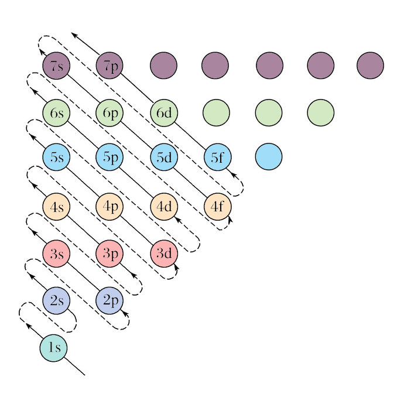

# 原子结构模型

## 核物理初步

### 原子概述

原子分为原子核与核外电子，原子核分为质子和中子。

其中，核外电子带负电，中子带正电，原子不带电（电中性），因此：

质子数 $=$ 电子数 $=$ 核电荷数 $=$ 原子序数

对于元素 $_Z^A\ce{X}$ 的表示：质量数（$A$）$=$ 质子数（$Z$）$+$ 中子数（$N$）。

### 基态与激发态

处于最低能量状态的原子叫做基态，基态原子吸收能量，它的原子灰跃迁到较高能级变为激发态原子。

{ width="60%" }

- 电子从较高的激发态跃迁到较低的激发态，甚至基态时会释放能量。

- 易错：不一定跃迁到基态，有可能跃迁到较低的激发态。

- 光（辐射）是电子跃迁释放能量的重要形式，……都与原子核外电子跃迁释放能量有关。

光谱：

- 光谱的定义：利用仪器将物质吸收的光或发射的光的波长和强度分别记录下来，就得到光谱。

- 连续光谱：若光谱是由各种波长的光所组成，且相近的波长差别极小而不能分辨，则这种光谱为连续光谱，例如阳光的光谱即为连续光谱。

- 线性光谱：若光谱是由具有特定波长、彼此分立的谱线组成，则所得的光谱为线性光谱。

- 原子光谱通常是线性光谱，原子光谱源自核外电子在能量不同的轨道之间的跃迁，而电子所处的轨道的能量是量子化的，电子从一个轨道跃迁到另一个轨道时，辐射或吸收的能量是不连续的，以光的形式表现出来的光的波长是不连续的。

{ width="80%" }

不同元素的电子发生跃迁会释放或吸收不同的光，可以用光谱仪摄取各种原子的「吸收光谱」（从低能量到高能量）或「发生光谱」（从高能量到低能量），总称为原子光谱。

{ align=right width="35%" }

如右图，

- 电子从能量较高的轨道跃迁到 $n=1$ 的轨道所形成的谱线在紫外光区。
- 电子从能量较高的轨道跃迁到 $n=2$ 的轨道所形成的谱线在可见光区，可见光区的四条谱线分别为一条红色的、一条蓝色的和两条紫色的。
- 电子从能量较高的轨道跃迁到 $n=3$ 的轨道所形成的谱线在红外光区。

在现代化学中，常利用原子光谱上的特征谱线来鉴定元素，称为光谱分析。

### 衰变概述

以下内容由 Grok3 生成，详细请见[百科文档](https://chem.libretexts.org/Courses/University_of_British_Columbia/CHEM_100:_Foundations_of_Chemistry/17:_Radioactivity_and_Nuclear_Chemistry/17.03:_Types_of_Radioactivity:_Alpha_Beta_and_Gamma_Decay)。

这是因为某些原子核中的质子和中子数量不平衡，导致不稳定；为了变得更稳定，这些原子核会发生衰变，转变为不同的元素或同位素。

研究表明，放射性衰变是随机过程，但可以通过半衰期等指标量化，半衰期是样品中一半放射性原子衰变所需的时间，每个放射性同位素有独特半衰期，从几分之一秒到数十亿年不等。例如，C-14 的半衰期约为 5730 年，这使其在考古学中用于测定古代有机物的年代。

举例：如果有 $100$ 个半衰期为 $10$ 年的放射性物质原子，$10$ 年后，$50$ 个原子衰变，剩下 $50$ 个；再过 $10$ 年，又有 $25$ 个衰变，剩下 $25$ 个，依此类推。

放射性衰变的理解在医学（如影像和治疗）、地质年代测定和核能领域有重要应用。

其中 α 衰变、β 衰变和 γ 衰变是最常见的类型。

| 衰变类型 | 发射粒子          | 原子序数变化 | 质量数变化 | 穿透力         |
|----------|-------------------|--------------|------------|----------------|
| α 衰变    | α 粒子   | 减少 2        | 减少 4      | 弱（纸张或空气阻挡） |
| β^-^ 衰变   | 电子 + 反中微子   | 增加 1        | 不变       | 中等（铝阻挡）  |
| β^+^ 衰变   | 正电子 + 中微子   | 减少 1        | 不变       | 中等（铝阻挡）  |
| γ 衰变    | γ 射线（高能光子） | 不变         | 不变       | 强（铅或混凝土阻挡） |

除了上述三种，还有其他较少见的衰变类型：

- 电子捕获：原子核中的质子捕获内层电子，转变为中子并发射中微子，原子序数减少 1，这就是中子星的形成过程。

- 自发裂变：重原子核分裂成两个较轻的核，释放大量能量，通常见于非常重的元素，如铀或钚。

### α 衰变

在 α 衰变中，原子核发射一个 α 粒子，α 粒子本质上是氦原子的核，由 $2$ 个质子和 $2$ 个中子组成。

过程由强相互作用和量子隧穿效应主导，常见于原子序数 $\ge52$ 的重元素（如铀、镭），但铍-8 是个例外。

- 当发生 α 衰变时，原子核失去这两个质子和两个中子，因此原子序数减少 $2$，质量数减少 $4$。

- 例如，铀-238（U-238）衰变成钍-234（Th-234）并发射 α 粒子：

其中 α 粒子质量较大、速度较慢（约为光速的十分之一），带有正电荷，与物质相互作用强烈，穿透力弱，通常一张纸或几厘米的空气即可阻挡。

### β 衰变

形式上，β 衰变有两种，β^-^ 衰变和 β^+^ 衰变，均由弱相互作用介导，涉及夸克的转变。

- β^-^ 衰变：原子核中的一个中子转变为质子，并发射一个电子和一个反中微子。这使得原子序数增加 $1$，质量数保持不变。例如，碳-14 衰变成氮-14。

- β^+^ 衰变：原子核中的一个质子转变为中子，并发射一个正电子（电子的反粒子）和一个中微子。这使得原子序数减少 $1$，质量数保持不变。例如，氟-18 衰变成氧-18。

其中 β 粒子比 α 粒子轻，穿透力较强，通常需要几毫米的铝来阻挡。

β 衰变在所有元素中均可观察，人工放射性常涉及 β^+^ 衰变和电子捕获。

### γ 衰变

形式上，γ 衰通常在 α 或 β 衰变后发生，子核可能处于激发态，随后发射 γ 射线（原子核从激发态释放高能光子）以降低能量至更稳定状态（甚至达到基态）。

γ 衰变不改变原子核的原子序数或质量数，仅降低能级。

其中 γ 射线是电磁辐射，没有质量或电荷，穿透力极强，需要厚铅或混凝土阻挡。

### 分子光谱

分子光谱和分子内部的运动密切相关，涉及的分子运动方式主要为：

1. 分子的转动，吸收或发射的光处在远红外区或微波区，称为远红外光谱或微波谱。

2. 分子中原子间的振动，通常振动光谱在近红外区和中红外区，一般称为红外光谱。

3. 分子中电子在不同能级的分子轨道间跃迁，得到紫外 $\sim$ 可见光谱。

因此：

- 键长缩短、键能加强，化学键的伸缩振动频率升高，在红外光谱中对应吸收峰值的频率依次增加。

- 基于红外光谱中吸收峰值的频率可以推测分子中存在的官能团，进而为推测分子结构提供证据。

- 物质的浓度越高，其吸收峰的强度则越大，因此分子光谱还被广泛用于测定物质浓度。

## 原子结构模型

### 原子模型

| 时间 | 科学家 | 模型名称 | 备注 |
| :-: | :-: | :-: | :-: |
| 公元前 400 多年 | （古希腊）德谟克利特 | 原子唯物论 | 构成物质的最小单位 |
| 1803 年 | （英国）道尔顿 | 原子论 | 具有实在意义的微粒的概念 |
| 1904 年 | （英国）汤姆孙 | 葡萄干布丁模型 | 在发现电子的基础上 |
| 1911 年 | （英国）卢瑟福 | 核式模型 | 根据 α 粒子散射实验 |
| 1913 年 | （丹麦）玻尔 | 原子结构模型 | 氢原子光谱 |
| 20 世纪 20 年代中期 | 薛定谔等 | 量子力学模型 | 电子云 |

波尔的原子结构模型：

1. 原子中的电子在具有确定半径的圆周轨道上绕原子核运动，并且不辐射能量。

2. 在不同轨道上运动的电子具有不同的能量（$E$），而且能量值是不连续的，这称为能量“量子化”。轨道能量依 $n$ 值（$1,2,3,\dots$）的增大而升高，$n$ 称为量子数。对氢原子而言，电子处在 $n=1$ 的轨道时能量最低，这种状态称为基态；能量高于基态能量的状态，称为激发态。

3. 只有当电子从一个轨道（能量为 $E_i$）跃迁到另一个轨道（能量为 $E_j$）时，才会辐射或吸收能量。当辐射或吸收的能量以光的形式表现出来并被记录时，就形成了光谱。

4. 玻尔原子结构模型成功地解释了氢原子光谱是线状光谱的实验事实，阐明了原子光谱源自核外电子在能量不同的轨道之间的跃迁，指出了电子所处的轨道的能量是量子化的。但是其局限性在于，复杂的光谱现象无法解释。

### 原子轨道

- 核外电子按能量不同分成能层，电子的能层从核由内向外排序。

- 能层越高，电子的能量越高，能量的高低顺序为 $E(K)<E(L)<\dots<E(Q)$。

- 记忆方法，起于国王终于皇后（from K king to Q queen）。

/// caption
能层与能级
///

- 任意能层的等级从 s 级开始，每一能层的能级数等于该能层虚数。

- 即第一能层 1s 一个能级，第二能层 2s, 2p 两个能级，第三能层 3s, 3p, 3d 三个能级，第四能层 4s, 4p, 4d 四个能级。

- 能级的字母符号总是按照 s, p, d, f 排序的，记为开始（s start）于 PDF（便携式文档格式），他们可容纳的最多电子数依次为 $1,3,5,7$ 的二倍。

- 同一能层不同能级电子能量接近，故电子先分层后分级。

四个量子数，描述电子运动状态：

| 量子数 | 意义 | 规律 | 取值范围 |
| :-: | :-: | :-: | :-: |
|  主量子数 $n$ |  描述电子离核远近 | 电子离核越远 主量子数越大 能量越大 | 字母与数字对应 $1,2,3,4,5,6,7$ $\mathrm{K,L,M,N,O,P,Q}$ |
|  角量子数 $\ell$ |  描述电子云形状 | $\mathrm{s,p,d,f,g}$ 角量子数越大 能量越大 | $[0,n)$ $0$ 为 $s$ 球形，$1$ 为 $p$ 纺锤形或哑铃型 $d$ 以花瓣形为主，更大为复杂形状 |
|  磁量子数 $m$ |  描述电子云伸展方向 |  与能量无关 | $[-\ell,+\ell]$ $\mathrm{p_x,p_y,p_z}$ $\mathrm{d_{xy},d_{xz},d_{yz}}$ 等 |
| 自旋量子数 $m_s$ | 描述电子自旋方向 | 与能量无关 | $\pm\dfrac{1}{2}$ |

- 其中，$n,\ell,m$ 决定原子轨道 $n^2$ 个（空间运动状态），最大总电子数 $2n^2$ 个。

- 一个原子核外不可能有两个运动状态完全相等（四个量子数都相等）的电子。

- 一般 $n,\ell$ 决定能量，$m,m_s$ 几乎不影响能量，故 $n,\ell$ 相等成为简并轨道。

### 构造原理

根据光谱学事实，人们**理想化**的总结出，从氢开始随着核电荷数的递增，新增电子填入能层、能级的顺序，称为构造原理：核电荷数每增加一，核外电子增加一个，填满一个能级后开始填入下一个能级，根据构造原理可以得到元素周期表中各元素**基态原子**的电子排布。

构造原理就是告诉我们，随着电荷数递增，电子不总是填满一个能层后，再开始填入下一个能层的（这个对于前 $20$ 号元素满足）。

- 能量最低原理表示，在构建基态原子时，电子将尽可能地占据能量最低的原子轨道，使整个原子能量最低。

- 泡利不相容原理：在一个原子轨道里，最多只能容纳两个电子，他们的自旋相反。

- 洪特规则：基态原子中填入简并轨道的电子总是先单独分占且自选平行，即先独占后成对，其同余适用于基态离子。

- 洪特规则特例：能量相同的原子轨道在全充满（如 $\rm d^{10}$）、半充满（如 $\rm d^5$）和全空（如 $\rm d^0$）状态时，体系的能量较低，反常稳定。基态铬原子 $\ce{Cr}(\el3d5\el4s1)$ 和基态铜原子 $\ce{Cu}(\el3d{10}\el4s{1})$ 的核外电子排布就反映了这种情况。

同时基于光谱学事实，存在**能级交错**的现象。

### 能级交错

| 能级组 | | | | | |
| :-: | :-: | :-: | :-: | :-: | :-: |
| 第一能级组 | $\rm 1s$ | | | | |
| 第二能级组 | $\rm 2s$ | | | | $\rm 2p$ |
| 第三能级组 | $\rm 3s$ | | | | $\rm 3p$ |
| 第四能级组 | $\rm 4s$ | | | $\rm 3d$ | $\rm 4p$ |
| 第五能级组 | $\rm 5s$ | | | $\rm 4d$ | $\rm 5p$ |
| 第六能级组 | $\rm 6s$ | | $\rm 7f$ | $\rm 5d$ | $\rm 6p$ |
| 第七能级组 | $\rm 7s$ | | $\rm 5f$ | $\rm 6d$ | $\rm 7p$ |
| 第八能级组 | $\rm 8s$ | $\rm 5g$ | $\rm 6f$ | $\rm 7d$ | $\rm 8p$ |

{ width="70%" }

记为：

$$
n\mathrm{s}<(n-3)\mathrm{g}<(n-2)\mathrm{f}<(n-1)\mathrm{d}<n\mathrm{p}
$$

然而，构造原理是基于光谱学事实的理想化、经验化的，某些过渡元素基态原子电子排布不符合构造原理。

### 特例问题

- 有 $\ce{Cr}(\el 3d5\el 4s1),\ce{Mo}(\el 4d5\el 5s1),\ce{Cu}(\el 3d{10}\el4s1),\ce{Ag}(\el4d{10}\el5s1),\ce{Au}(\el5d{10}\el6s1)$ 符合洪特规则特例，$\ce{W}(\el5d4\el6s2)$ 符合洪特规则、不符合洪特规则特例。

- 有铌 $\ce{Nb}(\el 4d4\el5s1)$、钌 $\ce{Ru}(\el4d7\el5s1)$、铑 $\ce{Rh}(\el4d8\el5s1)$、铂 $\ce{Pt}(\el5d9\el6s1)$ 类似洪特规则特例。

- 有钯 $\ce{Pd}(\el4d{10})$ 没有 $\rm 5s$ 轨道。

### 电子排布式

- 核外运动的电子还存在一种被称为“自旋”的量子化状态。处于同一原子轨道上的电子自旋状态只能有两种，分别用符号 $\uparrow$ 和 $\downarrow$ 表示。

- 电子排布的轨道表示式：

    表示电子排布的一种图示，画出电子的自旋方向，以氧元素为例：

    $$
    \begin{array}{ccc}
    \el1s{}&\el2s{}&\el2p{}\\
    \begin{array}{|c|}\hline\uparrow\downarrow\\\hline\end{array}&
    \begin{array}{|c|}\hline\uparrow\downarrow\\\hline\end{array}&
    \begin{array}{|c|c|c|}\hline\uparrow\downarrow&\uparrow&\uparrow\\\hline\end{array}
    \end{array}
    $$

- 氢原子的电子由 $n=2$ 的状态跃迁到 $n=1$ 的状态时得到两条靠得很近的谱线，钠的原子光谱中存在靠得很近的两条黄色谱线，都与电子的自旋有关。这里的“自旋”并不意味着电子像地球那样绕轴“自转”，它的实质仍在探索之中。

四个排布式：

1. （基态原子）**核外电子排布式**。

2. （基态原子）**简化核外电子排布式**。

3. **价电子排布式**、又称**外围电子排布式**、又称**特征排布式**。

4. **轨道表示式**，又称**电子排布图**。

5. **价电子轨道表示式**，又称**价电子排布图**。

价电子：

- 通常只有最外能级组的电子才有可能参与化学反应，最外能级组中那些有可能参与化学反应的电子称为价电子。

- 一般情况下，主族元素原子的价电子只包括最外层电子；过渡元素原子的价电子除最外层电子外，还包括次外层的部分电子，甚至倒数第三层的电子。

- 元素性质与原子的价电子的数目密切相关。为了便于研究元素性质与核外电子间的关系，人们常常只表示出原子的价电子排布。

- 价电子直接看价电子排布式即可，可以观察元素周期表记忆。

{ width="100%" }

### 电子云模型

概率密度：

- 用 $P$ 表示电子在某处出现的概率，$V$ 表示该处的体积，则 $\rho=P/V$ 称为概率密度。

- 意义：点密集的地方，表示电子在此处单位体积内出现的概率大；点稀疏的地方，表示电子在此处单位体积内出现的概率小。

电子云：

- 核外电子的概率密度分布看起来像一片云雾，故称为电子云。

- 电子云是处于一定空间运动状态的电子在原子核外空间的概率密度分布的形象化描述。

- 电子云轮廓图是表示电子云轮廓的形状，以对核外电子的空间状态有一个形象化的简便描述。

不同能级的电子云轮廓：

- 任意能层 s 能级的电子云轮廓是球形，只有一种空间延伸方向，故只有一个原子轨道。

- 任意能层 p 能级的电子云轮廓是哑铃形（纺锤形），有三种空间延伸方向，称为 $\mathrm{p}_x,\mathrm{p}_y,\mathrm{p}_z$，故有三个原子轨道。

- 当有磁场时，同能级上电子能量不同，说明电子云在合外空间伸展方向不同。

{ width="90%" }

屏蔽和钻穿：

- 屏蔽效应：多电子原子中核电荷对某一电子的吸引作用，部分地被其他电子对该电子的排斥作用相抵消的效应。

- 钻穿效应：多电子原子中每个电子为避开其他电子的屏蔽，其电子云钻到进核区而感受到更大核电荷作用的效应。

屏蔽效应和钻穿效应强调的重点不同：

- 屏蔽效应强调客观事实，也就是说一个电子因为其他电子的客观存在，它状态发生了改变。

- 钻穿效应强调主观能动性，也就是说一个电子通过一定手段阻止这种改变的发生。
