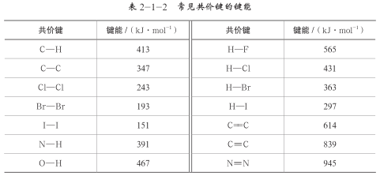
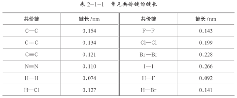

# 分子与晶体

## 化学键概述

### 化学键

化学键：**分子内部**相邻原子间**强烈**的**相互作用**，称为化学键，主要决定了物质的化学性质。

化学反应的过程实质是，旧化学键的断裂（吸收热量），和新化学键的生成（放出热量）。

化学键分为**离子键**、**共价键**、**金属键**，其中有**配位键**作为一个特殊的共价键。

### 离子键

离子键：阴阳离子之间强烈的静电作用，称为离子键，活泼金属（或铵根）与非金属之间易形成离子键。

离子化合物：含有离子键的化合物称为离子化合物，绝大多数盐（$\ce{AlCl3}$ 为特例）、强碱、活泼金属氧化物、硫化物为离子化合物。

离子键性质：

- 无饱和性：在离子化合物中，每个离子周围最邻近的带异性电荷离子数目的多少，取决于阴、阳离子的**相对**大小。

    只要空间条件允许，阳离子将吸引尽可能多的阴离子排列在其周围，阴离子也将吸引尽可能多的阳离子排列在其周围，以达到降低体系能量的目的。

- 无方向性：离子键的实质是静电作用，离子的电荷分布通常被看成是球形对称的，因此一种离子可以对不同方向的带异性电荷的离子产生吸引作用。

离子键强度：

- 离子键强度越大，键能越大，熔沸点越高。

    $$
    F=k\dfrac{Q_1Q_2}{d^2}
    $$

离子键的极化：

- 基本上呈球对称的离子本身所带有的电荷会形成一个电场，阴、阳离子在相互的电场作用下，会使离子内的电子分布发生相对偏移，这种在电场的作用下产生的离子中的电子分布发生偏移的现象称为离子极化。

- 离子极化可能导致阴、阳离子的外层轨道发生重叠，从而使得许多离子键不同程度地带有一些共价性，继而导致键长缩短、键能增加，甚至出现结构变异。

- 例如：从 $\ce{AgF}$ 到 $\ce{AgI}$，离子键愈来愈倾向于共价形式，$\ce{AgF}$ 的键长几乎等于半径之和，但是半径之和增大，键长的增大却跟不上半径之和，到 $\ce{AgI}$ 中半径之和已经明显大于键长，导致其成为以共价键为主的结构，卤化银溶解度自上到下减小。

离子键的破坏：发生化学变化、电离（溶于水或熔融）。

### 金属键

定义：

- 金属原子的电离能低，容易失去电子而形成阳离子和自由电子，阳离子整体共同吸引自由电子而结合在一起。

- 这种金属阳离子和自由电子之间强烈的相互作用就是金属键，是一种遍布整个晶体的离域化学键。

- 金属键可看成是由许多原子共用许多电子的一种特殊形式的共价键，但与共价键有着明显不同。

- 金属键既没有方向性也没有饱和性，成键电子可以在金属中自由运动，使得金属呈现出特有的属性。

成键微粒：

- 金属阳离子和自由电子（金属晶体中，金属失去电子形成金属阳离子和电子，没有阴离子）。

- 通过金属键延伸形成的晶体为金属晶体，其中不存在单个分子，金属阳离子被自由电子所包围。

金属键的强弱：

- 金属阳离子半径：半径越小，键越强。

- 离子带电荷数（单位体积内的自由电子数）：带电荷数越多，键越强。

- 金属阳离子半径越小、所带电荷越多、自由电子越多、**金属键越强**、熔点越高，硬度越大。

金属键的递变规律：

- **同主族元素**：从上到下原子半径依次增大，金属键依次减弱。

- **同周期元素**：从左到右价电子数增大，原子半径依次减小，金属键依次增强。

金属键对金属的影响：

1. 金属不透明，具有金属光泽：当可见光照射到金属表面上时，固态金属中的“自由电子”能够吸收所有频率的光并很快放出，使得金属不透明并具有金属光泽。

2. 金属具有良好的导电性：金属内部自由电子的运动不具有方向性，在外加电场的作用下，金属晶体中的“自由电子”沿着导线由电源的负极向电源正极发生定向移动而形成电流。温度越高，金属的导电性能越差。

3. 金属具有良好的导热性：当金属中有温度差时，通过不停运动着的“自由电子”通过自身与金属阳离子间的碰撞，把能量由高温处传向低温处。

4. 金属具有良好的延展性：当金属受到外力作用时，晶体中的各原子层就会发生相对滑动，但排列方式不变，金属晶体中的化学键没有被破坏。

| 属性               | 金属 | 属性               | 金属 |
|--------------------|------|--------------------|------|
| 熔点最低的金属是   | 汞   | 熔点最高的金属是   | 钨   |
| 密度最小的金属是   | 锂   | 密度最大的金属是   | 锇   |
| 硬度最小的金属是   | 铯   | 硬度最大的金属是   | 铬   |
| 延性最好的金属是   | 铂   | 展性最好的金属是   | 金   |
| 最活泼的金属是     | 铯   | 最稳定的金属是     | 金   |

## 共价键模型

### 分子光谱

分子光谱和分子内部的运动密切相关，涉及的分子运动方式主要为：

1. 分子的转动，吸收或发射的光处在远红外区或微波区，称为远红外光谱或微波谱。

2. 分子中原子间的振动，通常振动光谱在近红外区和中红外区，一般称为红外光谱。

3. 分子中电子在不同能级的分子轨道间跃迁，得到紫外 $\sim$ 可见光谱。

因此：

- 键长缩短、键能加强，化学键的伸缩振动频率升高，在红外光谱中对应吸收峰值的频率依次增加。

- 基于红外光谱中吸收峰值的频率可以推测分子中存在的官能团，进而为推测分子结构提供证据。

- 物质的浓度越高，其吸收峰的强度则越大，因此分子光谱还被广泛用于测定物质浓度。

### 分子轨道理论

根据已学的知识，氧分子的结构是 $\ce{O \bond{2} O}$，因此，氧分子中的电子已经完全配对，氧分子应该是逆磁性分子。但事实上，将液态氧倒入配有磁铁的仪器中时，氧分子被磁场吸引而悬浮在磁场中，这说明氧分子是顺磁性分子，即分子中存在未成对电子。

利用分子轨道理论能够很好地解释氧分子是顺磁性分子这一事实。

- 分子轨道理论认为，分子中的每个电子都是在整个分子中运动的，分子中的单电子运动状态可以用分子轨道来描述。分子轨道可以用能级相近的原子轨道线性组合来表示。

- 光电子能谱为分子轨道理论提供了实验基础，若入射光的能量超过一定值，就能够将电子击出，由此产生的电子称为光电子。通过光电子能谱可以了解分子轨道能级的信息。

### 共价键与化合物

定义：

- 共价键：原子间通过共用电子对形成的相互作用。

- 共价化合物：只有共价键的化合物称为共价化合物。

- 根据共用电子对数，可以分为单键、双键、三键。

注意区分：

- 含有离子键即为离子化合物，只有共价键才为共价化合物。

- 离子化合物中可能含有共价键，共价化合物中不可能有离子键。

特性：

- 饱和性：

- 方向性：

稳定条件：

- 电子配对原理：两原子各自提供一个能量相同或相近的、自旋相反的单电子配对。

- 最大重叠原理：重叠部分越大，核间电子的概率密度越大，形成的共价键越牢固，分子越稳定。

共价键类型：

- $\sigma$ 键：原子轨道以「头碰头」方式相互重叠导致电子在核间出现的概率增大而形成的共价键。

- $\pi$ 键：原子轨道以「肩并肩」方式相互重叠导致电子在核间出现的概率增大而形成的共价键。

注意：

- 通常来说，只有第二周期元素之间才能生成经典的 $\pi$ 键，例如硫酸中氧硫键为反馈 $\pi$ 键。

- 在没有数据的情况下，$\sigma$ 键比 $\pi$ 键更稳定，例如 $\ce{N # N}$ 中 $\sigma$ 键就不如 $\pi$ 键稳定。

- 受到电场或电磁场的影响，$\sigma$ 键受到的影响比 $\pi$ 键小，继父原则，

- 环与 $\pi$ 键均限制旋转，因此决定了顺式与逆式的差别。

{ width="70%" }

| 共价键类型 | $\sigma$ 键 | $\pi$ 键 |
| :-: | :-: | :-: |
| 电子云重叠方式 | 沿键轴方向相对重叠 | 沿键轴方向平行重叠 |
| 电子云重叠程度 | 大，因此键的强度大 | 小，因此键的强度小 |
| 化学活泼性 | 不活泼 | 活泼 |

成键规律：

- 共价单键是 $\sigma$ 键。

- 共价双键中一个是 $\sigma$ 键，一个是 $\pi$ 键。

- 共价三键中一个是 $\sigma$ 键，两个是 $\pi$ 键。

- 两个原子形成共价键时先形成 $\sigma$ 键，后形成 $\pi$ 键。

### 键参数——键能

化学键的断裂需要吸收能量，常用键能来表示化学键的强弱程度。

在常温差压下（$\pu{1\times10^5 Pa, 298 K}$），断开 $\pu{1 mol} \ce{AB(g)}$ 分子中的化学键，使其分别生成气态 $\ce A$ 原子和气态 $\ce B$ 原子所吸收的能量称为 $\ce{A-B}$ 键的键能，常用 $E_{\ce{A-B}}$ 表示。

{ width="100%" }

表中的键能数据是对大量分子进行统计得到的平均值。

### 键参数——键长

两个成键原子的原子核间的距离（简称核间距）叫作该化学键的键长。

{ width="100%" }

键长是影响分子空间结构的因素之一。键长的数值可以通过晶体 X 射线衍射实验进行测定，也可以通过理论计算求得。

### 键参数——键角

在多原子分子中，两个化学键的夹角叫作键角。

键角可通过晶体 X 射线衍射实验测定，常用于描述多原子分子的空间结构。

### 共价键强弱判断

对于键能和键长：

- 键能的大小可以定量地表示化学键的强弱。

- 一般而言，化学键的键长愈短，化学键就愈强，键就愈牢固。

总的来说：

- 键长越短，键能愈大，断开时需要的能量就愈多，这个化学键就愈牢固。

- 键长越长，键能愈小，断开时需要的能量就愈少，这个化学键就愈不牢固。

- 原子半径越小、共用电子对越多、元素电负性越大，一般越牢固，键长越小。

分子的性质由：

- 键能、键长，决定分子的稳定性。

- 键长、键角，决定分子的空间结构。

### 配位键与配合物

定义：

- 配位键：一个原子通过孤电子对，另一个原子提供空轨道的特殊的共价键。

- 配合物（配位化合物）：含有「由**提供孤电子对的配体**与**接受孤电子对的中心原子**以**配位键**形成的组分」的化合物，注意一定是中心原子提供空轨道。

形式：

- 以四氨合硫酸铜为例：

    $$
    \ce{[Cu(NH3)4]SO4}
    $$

    内界：$\ce{Cu}$ 为中心原子，$\ce{NH3}$ 中的氮为配位原子，$\ce{NH3}$ 为配位体（配体），其角标 $4$ 为配体数。

    外界：$\ce{SO4^2-}$ 离子。

- 配位数：围着中心原子，与其直接成键（不一定为配位键）的**原子数目**；配位数不一定等于配体数（当且仅当为单齿配体时相等）。

    例如 $\ce{BF4-, [Al(OH)4]-}$ 的配位数都为 $4$，但是其配位键数与起始点相关。

    注意双齿配体不能跨轴。

- 螯合物：螯合物是具有环状结构的配合物，是通过两个或多个配位体与同一金属离子形成螯合环的螯合作用而得到。

    { width="60%"}
    /// caption
    乙二胺四乙酸 EDTA，六齿配体，可以螯著多种金属离子
    ///

性质：

- 溶解性改变，注意配体的竞争（一般电负性越强配位键越强）。

- 颜色改变：一般来说，过渡元素可以提供空轨道（一般来说是 d 轨道），而 d 轨道有但是并非全满的电子，通常使其不同程度水解后显示特殊的颜色。

- 稳定性增强（例如血红蛋白与一氧化氮、一氧化碳、氧气、二氧化碳结合力依次减弱）。

经典的配合反应：

## 分子空间结构理论

### 空间结构概述

分子空间结构的测量：

- 红外光谱：测定分子中哪些化学键。

- 质谱仪：测量分子的相对分子质量。

常见的分子结构：

- 三原子分子通常为一个平面图形。

- 大多数四原子分子为三角形或三角锥形。

- 五原子分子常见为四面体形。

经典的分子结构：

| 物质名称 | 化学式 | 结构模型 | 键角 |
| :-: | :-: | :-: | :-: |
| 二氧化碳 | $\ce{CO2}$ | 直线型 | $\pu{180^o}$ |
| 水 | $\ce{H2O}$ | 角形或 V 形 | $\pu{104.5^o}$ |
| 甲醛 | $\ce{CH2O}$ | 三角形 | 约 $\pu{120^o}$ |
| 氨气 | $\ce{NH3}$ | 三角锥形 | $\pu{107.3^o}$ |
| 白磷 | $\ce{P4}$ | 正四面体形 | $\pu{60^o}$ |
| 甲烷 | $\ce{CH4}$ | 四面体形 | $\pu{109^o 28'}$ |
| 六氟化硫 | $\ce{SF6}$ | 正八面体 |  |

### 价电子对互斥理论

价电子对互斥（VSEPR）理论能比较简便地定性预测分子的空间结构，其基本观点是：

- 分子中的中心原子的价电子对——成键电子对（bp）和孤电子对（lp）由于相互排斥作用，处于不同的空间取向且尽可能趋向于彼此远离。

- 两个原子间的成键电子不论是单键还是多重键，都看作一个空间取向；一对孤电子对可看作一个空间取向。

因此，我们可以先分析分子中的中心原子的价电子对存在几个空间取向，再让这几个空间取向尽量彼此远离，就可以推测出分子的空间结构。

有公式：

$$
n=\dfrac{1}{2}(a-xb)
$$

其中，其他原子的未成对电子数之和：

$xb=$ 结合的原子数 $\times$ 其最多能接受的电子数

其中，中心原子的价电子数：

$a=$ 中心原子（离子）价电子数 $=$ 中心原子价电子数 $-$ 离子价态

价电子对互斥理论的局限性：

- 电子对之间的排斥与分子空间结构当价电子对包含孤电子对且成键电子对中也有多重键时，由于它们之间的斥力不同，会对分子的空间结构产生影响。

- 通常，多重键、成键电子对与孤电子对的斥力大小顺序可定性地表示为：

    $$
    \text{lp}-\text{lp} \gg \text{lp}-\text{bp} > \text{bp}-\text{bp}
    $$

    

    三键—三键 $>$ 三键—双键 $>$ 双键—双键 $>$ 双键—单键 $>$ 单键—单键
    

- 注意：预测的模型中，孤电子对不参与实际结构，因此要去掉。

价电子对互斥理论能较便捷地预测分子的空间结构，但是价电子对互斥理论一般不适用于推测过渡金属化合物分子的空间结构。

- 若 $n$ 个价电子对全部是成单键的电子对且没有孤电子对，为使价电子对之间的斥力最小，价电子对应尽量远离。

- 因此，当 $n=2、3、4、5、6$ 时，分子的空间结构分别为直线形、三角形、四面体形、三角双锥形和八面体形。

- 下图表示的分别是二氯化汞 $\ce{HgCl2}$、三氟化硼 $\ce{BF3}$、四氯化碳 $\ce{CCl4}$、五氯化磷 $\ce{PCl5}$ 和六氟化硫 $\ce{SF6}$ 的分子空间结构。

{ width="90%" }

另外，由于孤电子对有较大斥力，含孤电子对的分子实测键角几乎都小于 VSEPR 模型的预测值。

### 杂化轨道理论

高中阶段，杂化轨道通常仅对于主族元素。

在外界条件影响下，原子内部能量相近的原子轨道重新组合形成新的原子轨道的过程叫作原子轨道的杂化，组合后形成的一组新的原子轨道叫作杂化原子轨道，简称杂化轨道。

判断需要几个杂化轨道：连接的原子数加上孤电子对数（VSEPR），优先杂化 s 轨道，分为 $\mathrm{sp,sp^2,sp^3}$。

### 离域大 $\pi$ 键

离域 $\pi$ 键，或共轭大 $\pi$ 键，简称大 $\pi$ 键。

## 分子的表示方法

### 电子式的书写

### 结构式的书写

### 等电子原理

等电子原理：等电子原理化学通式相同且价电子总数相等的分子或离子具有相同的空间结构和相同的化学键类型等结构特征，这是等电子原理的基本观点。利用该原理可以判断一些简单分子或原子团的空间结构。

### 经典的电子式

## 分子的结构与性质

### 推、吸电子效应

电子效应是指分子中取代基通过改变电子云分布，影响物质性质和反应活性的现象，主要包括诱导效应（I）和共轭效应（C）。

- 诱导效应（Inductive Effect）：由电负性差异引起的σ键电子云偏移，沿分子链传递，强度随距离增加迅速减弱。

- 共轭效应（Conjugative Effect）：通过共轭体系（如π键、孤对电子）传递的电子离域现象，影响范围较广且不随距离减弱。

推电子效应（+I / +C）：

- 基团向分子其他部分释放电子，增加邻近区域的电子密度。

- 典型基团：烷基（-CH₃）、氨基（-NH₂）、羟基（-OH）、烷氧基（-OR）等。

吸电子效应（-I / -C）：

- 基团从分子中吸引电子，降低邻近区域的电子密度。

- 典型基团：硝基（-NO₂）、氰基（-CN）、卤素（-F、-Cl）、羰基（C=O）等。

对于酸碱性的影响：

- 吸电子基（如-Cl、-NO₂）通过诱导效应增强酸性（如氯乙酸酸性强于乙酸）。

- 推电子基（如烷基）减弱酸性（如丙酸酸性弱于乙酸）。

- 苯酚酸性：苯环的吸电子共轭效应使羟基更易解离，酸性强于醇。

常见强弱比较（内容由 DeepSeek 提供，未做检验）：

| 吸电子基（-I / -C）                | 推电子基（+I / +C）                  |
| :----------------------------------: | :-----------------------------------: |
| $\ce{- NO2} > \ce{- CN} > \ce{- F} > \ce{- Cl}$ | $\ce{- O^-} > \ce{- NH2} > \ce{- OH} > \ce{- CH3}$ |
| $\ce{- COOH} > \ce{- SO3H} > \ce{- CHO}$       | $\ce{- OR} > \ce{- C(CH3)_3} > \ce{- CH2CH3}$    |
| $\ce{- C # C} > \ce{- C = O} > \ce{- C6H5}$        | $\ce{- NR2} > \ce{- NHR} > \ce{- NH2}$          |

### 原子排布对称性

分子的手性：具有完全相同的组成和原子排列的一对分子，互为镜像且在三维空间里不能重合，称为手性异构体，有手性的异构体称为手性分子。

手性分子在制药中有广泛的应用，药物中一对手性异构体可能只有一个有效，另一个可能无效甚至是有害的。

2001 年诺贝尔化学奖授予三位用手性催化剂生成手性药物的化学家，可以得到或主要得到一种手性分子，称为手性合成。

### 电荷分布与极性

共价键分为极性键和非极性键：

- 极性键：不同元素两个原子，共用电子偏向电负性强的原子，显示负电性，另一原子显示正电性。

- 非极性键：相同元素两个原子，对称，两原子均不显电性，例如在形成氯化氢分子时，氯原子吸引电子的能力比氢原子强，使氯原子带部分负电荷（$\delta^-$）、氢原子带部分正电荷（$\delta^+$），所形成的共价键是极性键。

类似的，分子也有极性和非极性之分。

- 在极性分子中，正电中心和负电中心不重合，分子一端呈负电性（$\delta^-$）另一端呈负电性（$\delta^+$）；非极性分子反之。

- 只含非极性键的分子一定是非极性分子，而含有极性键的分子的极性可以根据分子中化学键的极性的矢量和，只有矢量和为零才为非极性分子。

- 通常的，$\ce{AA}$ 通常为非极性分子，$\ce{AB}$ 通常为极性分子，$\ce{ABn}$ 型通常需要根据 $\ce A$ 的孤电子对有无比较，无则为非极性。

### 范德华力与氢键

范德华力：

- 定义：一种很弱的（比化学键普遍小 $1\sim2$ 个数量级）的分子间作用力。

- 特性：无方向性、无饱和性，分子间广泛存在。

- 大小：结构相似，相对质量越大，范德华力越大；相对质量接近，分子极性越大，范德华力越大。

    特殊的，同分异构体，支链越多，范德华力越小，熔沸点越低，例如正、异、新戊烷。

- 意义：通常来说，范德华力越大，熔沸点越高（首先考虑氢键）、水溶性越好。

氢键：

- 定义：与电负性大（一般来说为 $\ce{N,O,F}$）的原子连接的氢，与较强的孤电子对（一般来说为 $\ce{N,O,F}$）形成的电性作用。

    也就是说，一般来说可以表示为 $\ce{N/O/F \bond{1} H \cdots N/O/F}$ 的分子间作用力。

- 意义：氢键对物质的熔沸点等影响较大，例如在接近沸点的水蒸气，水分子间因氢键相互缔合，形成缔合分子。

- 特性：有方向性（当 $\ce{X \bond{1} H \cdots Y}$ 为一条直线时键能最大）、有饱和性（一般来说一个 $\ce H$ 只能形成一个氢键）。

- 注意：氢键不是化学键，但是也讨论键长、键能等。

- 强度：与 $\ce{H}$ 相连的原子电负性越大，氢键越强，例如氨气中 $\ce{H3N \cdots H - OH}$ 氢键多于 $\ce{H2O \cdots H - NH2}$。

### 超分子与多聚体

超分子是由两种或两种以上的分子，通过分子间相互作用形成的分子聚合体。

例如 $\ce{C60}$ 和 $\ce{(HF)n}$（通过氢键）就是经典的超分子。

## 晶体概述

### 晶体与晶胞

晶胞：描述晶体结构的最小单元。

原子在晶胞中的占有率：$n$ 个晶胞完全包含该原子，则该原子对每个晶胞有 $1/n$。

| 原子位置 | $n$ 个包含 | 占有率 |
| :-: | :-: | :-: |
| 体内 | $1$ | $1/1$ |
| 面上 | $2$ | $1/2$ |
| 棱上 | $4$ | $1/4$ |
| 顶点 | $8$ | $1/8$ |

### 熔沸点比较
